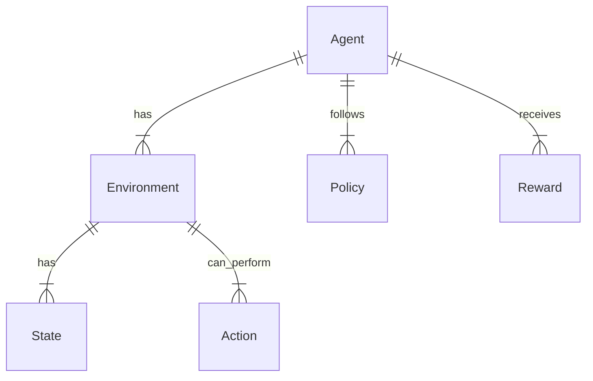
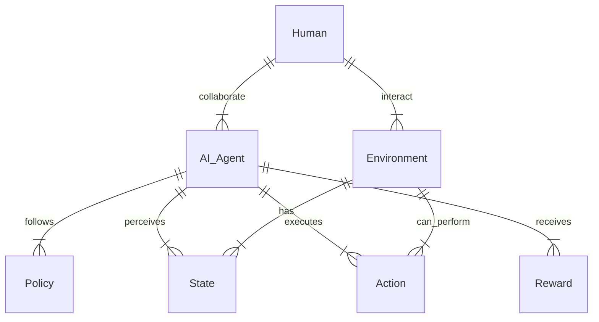

                 

# 强化学习在AI Agent人机协作中的应用

关键词：强化学习，AI Agent，人机协作，算法原理，应用案例

摘要：本文深入探讨了强化学习在AI Agent人机协作中的应用。首先，介绍了强化学习的起源、定义、主要类型和应用领域，以及AI Agent的基本概念和人机协作的重要性。接着，详细分析了强化学习算法原理，包括Q-learning、SARSA、DQN和Policy Gradient算法，并探讨了AI Agent的设计与实现。最后，通过具体案例展示了强化学习在智能交通系统和机器人控制中的应用，并给出了强化学习在AI Agent人机协作中的最佳实践和未来展望。

## 第一部分：背景与概念

### 第1章：问题背景

#### 1.1 问题背景

##### 1.1.1 强化学习的起源与发展

强化学习（Reinforcement Learning，RL）是机器学习的一种类型，起源于20世纪50年代。作为人工智能的一个分支，强化学习通过智能体（agent）与环境的交互，学习如何通过决策获得最大化的长期奖励。强化学习在早期主要应用于游戏和仿真领域，例如著名的“蒙特卡洛方法”和“深度Q网络”（DQN）。

随着计算机性能的提升和数据量的增加，强化学习在过去的几十年里得到了快速发展。现代强化学习算法不仅在游戏领域取得了显著成果，还在机器人控制、自动驾驶、智能推荐系统等多个领域展现了强大的应用潜力。

##### 1.1.2 AI Agent的基本概念

AI Agent是指具有自主行动能力的实体，能够根据环境反馈进行调整，以实现特定的目标。AI Agent通常由感知器、决策器、执行器三部分组成，能够接收环境输入，通过内部决策生成动作，并执行动作以改变环境状态。

AI Agent的基本概念包括：

1. 感知器：负责接收环境状态信息。
2. 决策器：根据当前状态和策略选择合适的动作。
3. 执行器：将选择的动作执行到环境中。

##### 1.1.3 人机协作的重要性

人机协作是指人与计算机系统共同完成任务的交互过程。随着人工智能技术的发展，人机协作在各个领域的重要性日益凸显。人机协作能够充分发挥人的创造力和机器的计算能力，实现优势互补，提高工作效率。

在人机协作中，AI Agent扮演着重要角色，不仅能够执行复杂的任务，还能根据人的指令进行调整和优化。人机协作的重要性体现在以下几个方面：

1. 提高决策效率：AI Agent能够快速处理大量数据，提供决策支持，帮助人作出更准确的决策。
2. 减轻人力负担：通过自动化和智能化，AI Agent能够替代人类完成重复性高、劳动强度大的工作。
3. 提升工作质量：AI Agent能够精确地执行任务，减少人为错误，提高工作质量。

#### 1.2 强化学习概述

##### 1.2.1 强化学习的定义

强化学习是指通过试错（trial-and-error）和反馈（feedback）来学习如何获得最大化的长期奖励的过程。在强化学习中，智能体（agent）通过与环境（environment）的交互，不断学习最优策略（policy），以实现目标。

强化学习的定义可以用以下公式表示：

$$
\begin{aligned}
&\text{定义：} \\
&\text{强化学习是学习一个策略，使得智能体在给定环境下的回报累计最大化。} \\
\end{aligned}
$$

##### 1.2.2 强化学习的主要类型

强化学习可以分为两大类：基于值的方法（Value-based Methods）和基于策略的方法（Policy-based Methods）。

1. 基于值的方法：通过学习状态值函数或动作值函数来指导智能体的决策。常用的算法包括Q-learning、SARSA等。
2. 基于策略的方法：直接学习最优策略，通过策略来指导智能体的决策。常用的算法包括Policy Gradient等。

##### 1.2.3 强化学习的特点与应用领域

强化学习具有以下几个特点：

1. 自主性：智能体能够自主地探索环境，学习最优策略。
2. 长期性：强化学习关注长期奖励，而非短期回报。
3. 不确定性：强化学习在处理不确定性和动态环境方面具有优势。

强化学习的主要应用领域包括：

1. 游戏和娱乐：如围棋、德州扑克等。
2. 自动驾驶：如无人车、无人飞行器等。
3. 机器人控制：如自动化生产线、服务机器人等。
4. 智能推荐系统：如个性化推荐、广告投放等。

#### 1.3 AI Agent人机协作

##### 1.3.1 AI Agent的基本原理

AI Agent的基本原理包括感知、决策和执行三个部分。感知是指AI Agent接收环境状态信息；决策是指AI Agent根据当前状态和策略选择合适的动作；执行是指AI Agent将选择的动作执行到环境中。

AI Agent的基本原理可以用以下公式表示：

$$
\begin{aligned}
&\text{基本原理：} \\
&\text{感知} \rightarrow \text{决策} \rightarrow \text{执行} \\
\end{aligned}
$$

##### 1.3.2 人机协作的挑战

人机协作面临以下几个挑战：

1. 数据同步：人和机器需要实时共享数据，以保证协作的顺畅。
2. 交互方式：人和机器需要选择合适的交互方式，以适应不同的应用场景。
3. 安全性：人机协作过程中，需要确保系统的安全性和可靠性，防止恶意攻击和数据泄露。

##### 1.3.3 强化学习在AI Agent人机协作中的应用

强化学习在AI Agent人机协作中的应用主要包括以下几个方面：

1. 智能决策支持：通过强化学习，AI Agent能够根据环境变化和用户需求，提供个性化的决策支持。
2. 任务自动化：通过强化学习，AI Agent能够自动执行复杂的任务，提高工作效率。
3. 交互优化：通过强化学习，AI Agent能够根据用户反馈，不断优化交互方式，提升用户体验。

### 第2章：核心概念与联系

#### 2.1 核心概念

##### 2.1.1 强化学习中的基本术语

强化学习中的基本术语包括：

1. 智能体（Agent）：执行任务的主体。
2. 环境（Environment）：智能体所处的环境。
3. 状态（State）：环境的当前状态。
4. 动作（Action）：智能体可以执行的动作。
5. 奖励（Reward）：智能体执行动作后获得的奖励。
6. 策略（Policy）：智能体的行动规则。

##### 2.1.2 AI Agent的构成要素

AI Agent的构成要素包括：

1. 感知器（Perceiver）：接收环境状态信息。
2. 决策器（Decider）：根据当前状态和策略选择动作。
3. 执行器（Executor）：执行选择的动作。
4. 控制器（Controller）：管理整个AI Agent的运行。

#### 2.2 概念属性特征对比

##### 2.2.1 强化学习算法对比

| 算法       | 特点                                       | 适用场景                 |
|------------|------------------------------------------|------------------------|
| Q-learning | 基于值的方法，逐步优化动作值               | 稳定性要求较高的场景       |
| SARSA     | 基于值的方法，同时考虑当前状态和下一状态   | 风险偏好较高的场景       |
| DQN       | 深度强化学习，使用神经网络进行值函数估计   | 复杂环境，数据量较大的场景 |
| Policy Gradient | 基于策略的方法，直接优化策略           | 非线性动态环境           |

##### 2.2.2 AI Agent与人机协作的特点对比

| 特点         | AI Agent                           | 人机协作                          |
|-------------|----------------------------------|---------------------------------|
| 自主性       | 能够自主执行任务，调整策略         | 需要与人类互动，协同完成任务       |
| 学习能力     | 通过强化学习，逐步优化任务执行       | 依赖人类的反馈，进行改进和优化       |
| 交互方式     | 主要与机器进行交互                 | 需要与人类进行有效沟通和协作       |
| 安全性       | 需要确保系统的安全性和可靠性         | 需要确保人机协作过程中的数据安全和隐私保护 |

#### 2.3 ER实体关系图架构

##### 2.3.1 实体关系图概述

实体关系图（Entity-Relationship Diagram，ERD）是数据库设计的一种工具，用于表示实体、实体属性和实体之间的关系。在强化学习和AI Agent人机协作中，ERD可以帮助我们理解系统的组成和功能。

##### 2.3.2 强化学习中的ER图

以下是强化学习中的ER图：



##### 2.3.3 AI Agent人机协作的ER图

以下是AI Agent人机协作的ER图：



## 第二部分：算法原理与设计

### 第3章：强化学习算法原理

#### 3.1 强化学习算法基础

强化学习算法主要分为基于值的方法和基于策略的方法。基于值的方法通过学习值函数来指导智能体的决策，而基于策略的方法直接学习最优策略。

##### 3.1.1 强化学习的基本模型

强化学习的基本模型包括四个主要部分：智能体（Agent）、环境（Environment）、状态（State）、动作（Action）。

1. 智能体（Agent）：执行任务的主体，根据当前状态选择动作，并从环境中获取奖励。
2. 环境（Environment）：智能体所处的环境，包括状态和动作空间。
3. 状态（State）：描述环境当前的状态，通常是一个向量。
4. 动作（Action）：智能体可以执行的动作，也是一个向量。

##### 3.1.2 强化学习的主要算法

强化学习的主要算法包括Q-learning、SARSA、DQN和Policy Gradient等。

1. Q-learning：基于值的方法，通过更新动作值函数来指导智能体的决策。
2. SARSA：基于值的方法，同时考虑当前状态和下一状态，更新动作值函数。
3. DQN：深度强化学习，使用神经网络进行值函数估计。
4. Policy Gradient：基于策略的方法，直接优化策略。

#### 3.2 强化学习算法详细讲解

##### 3.2.1 Q-learning算法

Q-learning是一种基于值的方法，通过更新动作值函数来指导智能体的决策。Q-learning的基本思想是，对于每个状态和动作对，学习一个值函数Q(s, a)，表示在状态s下执行动作a所能获得的期望回报。

Q-learning的更新公式为：

$$
Q(s, a) \leftarrow Q(s, a) + \alpha [r + \gamma \max_{a'} Q(s', a') - Q(s, a)]
$$

其中，$s$和$a$是当前状态和动作，$s'$和$a'$是下一状态和动作，$r$是奖励，$\alpha$是学习率，$\gamma$是折扣因子。

以下是Q-learning的Python实现：

```python
import numpy as np

# 初始化Q表
Q = np.zeros((n_states, n_actions))

# 学习率
alpha = 0.1

# 折扣因子
gamma = 0.9

# 迭代次数
episodes = 1000

for episode in range(episodes):
    state = env.reset()
    done = False
    
    while not done:
        # 随机选择动作
        action = np.random.choice(n_actions)
        
        # 执行动作
        next_state, reward, done, _ = env.step(action)
        
        # 更新Q值
        Q[state, action] = Q[state, action] + alpha * (reward + gamma * np.max(Q[next_state, :]) - Q[state, action])
        
        state = next_state
```

##### 3.2.2 SARSA算法

SARSA（State-Action-Reward-State-Action，SARSA）是基于值的方法，同时考虑当前状态和下一状态，更新动作值函数。SARSA的基本思想是，对于每个状态和动作对，学习一个值函数Q(s, a)，表示在状态s下执行动作a所能获得的期望回报。

SARSA的更新公式为：

$$
Q(s, a) \leftarrow Q(s, a) + \alpha [r + \gamma Q(s', a') - Q(s, a)]
$$

其中，$s$和$a$是当前状态和动作，$s'$和$a'$是下一状态和动作，$r$是奖励，$\alpha$是学习率，$\gamma$是折扣因子。

以下是SARSA的Python实现：

```python
import numpy as np

# 初始化Q表
Q = np.zeros((n_states, n_actions))

# 学习率
alpha = 0.1

# 折扣因子
gamma = 0.9

# 迭代次数
episodes = 1000

for episode in range(episodes):
    state = env.reset()
    done = False
    
    while not done:
        # 根据当前Q值选择动作
        action = np.argmax(Q[state, :])
        
        # 执行动作
        next_state, reward, done, _ = env.step(action)
        
        # 更新Q值
        Q[state, action] = Q[state, action] + alpha * (reward + gamma * np.max(Q[next_state, :]) - Q[state, action])
        
        state = next_state
```

##### 3.2.3 Deep Q-Network（DQN）算法

DQN（Deep Q-Network）是深度强化学习的一种方法，使用神经网络进行值函数估计。DQN的基本思想是，使用经验回放（Experience Replay）和目标网络（Target Network）来稳定学习过程。

DQN的值函数估计公式为：

$$
Q(s, a) = \frac{1}{N} \sum_{i=1}^{N} r_i + \gamma \max_{a'} Q(s', a')
$$

其中，$s$和$a$是当前状态和动作，$s'$和$a'$是下一状态和动作，$r_i$是第i个经验样本的奖励，$N$是经验样本的数量。

以下是DQN的Python实现：

```python
import numpy as np
import tensorflow as tf

# 初始化参数
learning_rate = 0.001
gamma = 0.9
epsilon = 0.1
batch_size = 64

# 创建DQN模型
model = tf.keras.Sequential([
    tf.keras.layers.Flatten(input_shape=(n_states,)),
    tf.keras.layers.Dense(64, activation='relu'),
    tf.keras.layers.Dense(n_actions)
])

# 编译模型
model.compile(optimizer=tf.keras.optimizers.Adam(learning_rate), loss='mse')

# 初始化经验回放
经验回放 = []

# 迭代次数
episodes = 1000

for episode in range(episodes):
    state = env.reset()
    done = False
    
    while not done:
        # 随机选择动作
        if np.random.random() < epsilon:
            action = np.random.choice(n_actions)
        else:
            action = np.argmax(model.predict(state)[0])
        
        # 执行动作
        next_state, reward, done, _ = env.step(action)
        
        # 将经验添加到经验回放
        经验回放.append([state, action, reward, next_state, done])
        
        # 删除旧的经验
        if len(经验回放) > batch_size:
            经验回放.pop(0)
        
        # 更新模型
        if len(经验回放) >= batch_size:
            batch = random.sample(经验回放, batch_size)
            states, actions, rewards, next_states, dones = zip(*batch)
            
            # 计算目标值
            target_values = model.predict(next_states)
            target_values[dones] = 0
            target_values += gamma * rewards * (1 - dones)
            
            # 训练模型
            model.fit(states, rewards + gamma * target_values, batch_size=batch_size, epochs=1)
            
        state = next_state
```

##### 3.2.4 Policy Gradient算法

Policy Gradient算法是一种基于策略的方法，直接优化策略。Policy Gradient的基本思想是，通过梯度上升法，最大化策略的期望回报。

Policy Gradient的损失函数为：

$$
J(\theta) = \sum_{s, a} \pi(\theta)(s, a) \log \pi(\theta)(s, a) R(s, a)
$$

其中，$\pi(\theta)(s, a)$是策略参数为$\theta$时的策略概率，$R(s, a)$是在状态s下执行动作a获得的回报。

以下是Policy Gradient的Python实现：

```python
import numpy as np

# 初始化策略参数
theta = np.random.randn(n_actions)

# 学习率
alpha = 0.1

# 迭代次数
episodes = 1000

for episode in range(episodes):
    state = env.reset()
    done = False
    
    while not done:
        # 根据策略选择动作
        action = np.argmax(np.exp(theta) / np.sum(np.exp(theta)))
        
        # 执行动作
        next_state, reward, done, _ = env.step(action)
        
        # 更新策略参数
        theta -= alpha * (np.log(np.exp(theta)[action]) - reward)
        
        state = next_state
```

### 第4章：AI Agent设计与实现

#### 4.1 AI Agent基本架构

AI Agent的基本架构包括感知器、决策器和执行器三个部分。

1. 感知器：接收环境状态信息，通常使用传感器或摄像头等设备。
2. 决策器：根据当前状态和策略选择动作，通常使用神经网络或决策树等模型。
3. 执行器：将选择的动作执行到环境中，通常使用电机、执行器等设备。

AI Agent的基本架构可以用以下公式表示：

$$
\begin{aligned}
&\text{感知器} \rightarrow \text{决策器} \rightarrow \text{执行器} \\
\end{aligned}
$$

#### 4.2 AI Agent设计与实现

AI Agent的设计与实现涉及以下几个步骤：

1. 环境搭建：根据应用场景搭建模拟环境，用于测试和训练AI Agent。
2. 策略选择：选择合适的策略，如Q-learning、SARSA、DQN或Policy Gradient等。
3. 模型训练：使用训练数据训练模型，优化策略参数。
4. 模型评估：使用测试数据评估模型性能，调整模型参数。
5. 系统部署：将训练好的模型部署到实际环境中，进行任务执行。

以下是AI Agent的Python实现：

```python
import numpy as np
import gym

# 搭建环境
env = gym.make("CartPole-v0")

# 初始化策略参数
theta = np.random.randn(n_actions)

# 学习率
alpha = 0.1

# 迭代次数
episodes = 1000

# 训练模型
for episode in range(episodes):
    state = env.reset()
    done = False
    
    while not done:
        # 根据策略选择动作
        action = np.argmax(np.exp(theta) / np.sum(np.exp(theta)))
        
        # 执行动作
        next_state, reward, done, _ = env.step(action)
        
        # 更新策略参数
        theta -= alpha * (np.log(np.exp(theta)[action]) - reward)
        
        state = next_state

# 评估模型
state = env.reset()
done = False

while not done:
    action = np.argmax(np.exp(theta) / np.sum(np.exp(theta)))
    next_state, reward, done, _ = env.step(action)
    state = next_state

# 关闭环境
env.close()
```

#### 4.3 人机协作中的AI Agent

在人机协作中，AI Agent与人类交互的方式通常包括以下几个方面：

1. 指令接收：AI Agent接收人类的指令，并根据指令执行相应的动作。
2. 交互反馈：AI Agent向人类反馈执行结果，供人类参考和调整。
3. 智能调整：AI Agent根据人类反馈，调整自身策略，以实现更好的协作效果。

以下是人机协作中的AI Agent的Python实现：

```python
import numpy as np
import gym

# 搭建环境
env = gym.make("CartPole-v0")

# 初始化策略参数
theta = np.random.randn(n_actions)

# 学习率
alpha = 0.1

# 迭代次数
episodes = 1000

# 训练模型
for episode in range(episodes):
    state = env.reset()
    done = False
    
    while not done:
        # 接收人类指令
        action = input("请输入指令：")
        
        # 执行指令
        next_state, reward, done, _ = env.step(action)
        
        # 更新策略参数
        theta -= alpha * (np.log(np.exp(theta)[action]) - reward)
        
        state = next_state

# 评估模型
state = env.reset()
done = False

while not done:
    action = input("请输入指令：")
    next_state, reward, done, _ = env.step(action)
    state = next_state

# 关闭环境
env.close()
```

## 第三部分：应用案例分析

### 第5章：强化学习在特定领域的应用

#### 5.1 智能交通系统

##### 5.1.1 交通问题的背景与挑战

智能交通系统（Intelligent Transportation System，ITS）是利用信息技术、传感器技术、控制技术等手段，实现道路交通运输的自动化、智能化和高效化。随着城市化进程的加速和汽车数量的快速增长，交通拥堵、交通事故、环境污染等问题日益严重，智能交通系统的应用显得尤为重要。

智能交通系统面临的挑战包括：

1. 数据复杂性：交通数据包括车辆位置、速度、流量等信息，数据量大且复杂。
2. 动态变化：交通状况实时变化，需要系统具备快速响应和自适应能力。
3. 安全性：确保交通系统的安全性和稳定性，防止交通事故发生。

##### 5.1.2 强化学习在智能交通系统中的应用

强化学习在智能交通系统中的应用主要包括以下几个方面：

1. 交通信号控制：通过强化学习，优化交通信号灯的控制策略，提高道路通行效率。
2. 车辆路径规划：通过强化学习，为车辆提供最优路径规划，减少交通拥堵。
3. 事故预防：通过强化学习，识别潜在的事故风险，并采取相应的预防措施。

以下是强化学习在智能交通系统中的应用案例：

案例一：智能交通信号控制

1. 案例背景

某城市交通信号控制系统采用传统的定时控制策略，但在实际运行中发现，该策略在高峰期交通拥堵严重，通行效率低下。

2. 案例实现与效果分析

为了解决交通拥堵问题，该城市引入了强化学习算法，优化交通信号灯的控制策略。

- 搭建模拟环境：根据实际交通数据，搭建仿真环境，模拟不同交通状况下的信号灯控制效果。
- 选择策略：采用Q-learning算法，通过学习交通信号灯的控制策略，提高通行效率。
- 训练模型：使用历史交通数据训练模型，优化策略参数。
- 评估模型：在仿真环境中评估模型性能，调整模型参数。
- 系统部署：将训练好的模型部署到实际交通信号控制系统中。

通过强化学习算法优化交通信号灯的控制策略，该城市交通信号控制系统的通行效率显著提高，交通拥堵现象明显减少。

案例二：车辆路径规划

1. 案例背景

某城市由于道路狭窄、交通流量大，导致车辆行驶缓慢，行驶时间不稳定。为了提高交通效率，该城市引入了强化学习算法，为车辆提供最优路径规划。

2. 案例实现与效果分析

为了实现车辆最优路径规划，该城市采用以下步骤：

- 搭建模拟环境：根据实际交通数据，搭建仿真环境，模拟不同交通状况下的路径规划效果。
- 选择策略：采用DQN算法，通过学习车辆路径规划策略，提高行驶效率。
- 训练模型：使用历史交通数据训练模型，优化策略参数。
- 评估模型：在仿真环境中评估模型性能，调整模型参数。
- 系统部署：将训练好的模型部署到实际交通系统中。

通过强化学习算法优化车辆路径规划，该城市车辆行驶时间显著缩短，交通拥堵现象明显改善。

#### 5.2 机器人控制

##### 5.2.1 机器人控制的基本概念

机器人控制是指利用计算机技术和控制理论，对机器人进行实时控制，使其按照预定轨迹、速度和动作执行任务。机器人控制的基本概念包括：

1. 机器人：执行任务的智能实体，由传感器、执行器和控制器等组成。
2. 环境：机器人所处的空间，包括障碍物、目标点等。
3. 状态：机器人的当前状态，包括位置、速度、姿态等。
4. 动作：机器人可以执行的动作，包括移动、旋转、抓取等。
5. 奖励：机器人执行动作后获得的奖励，用于评估机器人性能。

##### 5.2.2 强化学习在机器人控制中的应用

强化学习在机器人控制中的应用主要包括以下几个方面：

1. 路径规划：通过强化学习，为机器人规划最优路径，避免碰撞和障碍。
2. 动作规划：通过强化学习，为机器人规划最优动作序列，实现复杂任务。
3. 任务自动化：通过强化学习，使机器人自动执行任务，提高工作效率。

以下是强化学习在机器人控制中的应用案例：

案例一：机器人路径规划

1. 案例背景

某机器人需要在复杂的室内环境中执行任务，但存在障碍物和碰撞风险。为了确保机器人安全、高效地完成任务，引入了强化学习算法，优化路径规划。

2. 案例实现与效果分析

为了实现机器人最优路径规划，采用以下步骤：

- 搭建模拟环境：根据实际环境，搭建仿真环境，模拟不同路径规划效果。
- 选择策略：采用Q-learning算法，通过学习路径规划策略，优化路径。
- 训练模型：使用历史路径数据训练模型，优化策略参数。
- 评估模型：在仿真环境中评估模型性能，调整模型参数。
- 系统部署：将训练好的模型部署到实际机器人系统中。

通过强化学习算法优化路径规划，机器人能够安全、高效地完成任务，路径规划误差显著降低。

案例二：机器人动作规划

1. 案例背景

某机器人需要在复杂的场景中执行多个任务，但需要精确控制动作序列。为了实现机器人自动化执行任务，引入了强化学习算法，优化动作规划。

2. 案例实现与效果分析

为了实现机器人最优动作规划，采用以下步骤：

- 搭建模拟环境：根据实际场景，搭建仿真环境，模拟不同动作规划效果。
- 选择策略：采用DQN算法，通过学习动作规划策略，优化动作序列。
- 训练模型：使用历史动作数据训练模型，优化策略参数。
- 评估模型：在仿真环境中评估模型性能，调整模型参数。
- 系统部署：将训练好的模型部署到实际机器人系统中。

通过强化学习算法优化动作规划，机器人能够自动、高效地执行任务，动作规划精度显著提高。

## 第四部分：最佳实践与未来展望

### 第7章：最佳实践

#### 7.1 强化学习在AI Agent人机协作中的应用技巧

1. 参数调优策略

在强化学习应用中，参数调优是关键环节。以下是一些参数调优策略：

- 学习率：选择合适的学习率，避免过拟合和欠拟合。通常，学习率可以从0.1逐渐减小到0.001。
- 折扣因子：选择合适的折扣因子，平衡短期和长期奖励。通常，折扣因子在0.8到0.99之间。
- 探索策略：采用探索策略，如ε-greedy策略，平衡探索和利用。初始探索率可以设置为0.1，逐渐减小。

2. 模型评估方法

在强化学习应用中，模型评估是衡量模型性能的重要手段。以下是一些模型评估方法：

- 平均回报：计算智能体在一段时间内的平均回报，评估模型性能。
- 收敛速度：评估模型在训练过程中收敛速度，选择性能稳定的模型。
- 实际应用：将模型部署到实际环境中，评估模型在真实场景下的性能。

#### 7.2 注意事项与优化建议

1. 注意事项

- 确保数据质量：使用高质量的数据进行训练，避免噪声和异常值。
- 考虑环境动态性：分析环境动态变化，选择合适的策略和模型。
- 安全性：确保系统的安全性和可靠性，防止恶意攻击和数据泄露。

2. 优化建议

- 模型压缩：采用模型压缩技术，减少模型参数数量，提高模型效率。
- 多任务学习：结合多任务学习，提高模型泛化能力。
- 模型融合：采用模型融合技术，结合多个模型的优势，提高模型性能。

### 第8章：未来展望

#### 8.1 强化学习技术的发展趋势

1. 深度强化学习：随着深度学习技术的不断发展，深度强化学习（Deep Reinforcement Learning，DRL）将成为强化学习的主要发展方向。深度强化学习能够处理更复杂的任务和环境，有望在自动驾驶、游戏、机器人等领域取得突破。
2. 强化学习与自然语言处理结合：强化学习与自然语言处理（Natural Language Processing，NLP）相结合，有望在智能对话系统、机器翻译等领域取得显著成果。
3. 强化学习与物理引擎结合：强化学习与物理引擎结合，能够模拟真实物理环境，提高智能体的决策能力。

#### 8.2 强化学习在AI Agent人机协作中的发展前景

1. 当前应用场景

- 智能客服：通过强化学习，实现智能客服系统的自动化和智能化，提高客户服务效率。
- 智能医疗：通过强化学习，实现智能诊断和治疗方案推荐，提高医疗质量和效率。
- 智能物流：通过强化学习，实现智能物流系统的路径规划和调度，提高物流效率。

2. 未来可能的发展方向

- 人机协作优化：通过强化学习，优化人机协作过程，提高人机协作效率和质量。
- 智能决策支持：通过强化学习，为人类提供更智能的决策支持，提高决策水平。
- 跨领域应用：强化学习在更多领域的应用，如智能制造、智能农业、智能家居等，实现智能化升级。

## 总结

本文深入探讨了强化学习在AI Agent人机协作中的应用。首先，介绍了强化学习的起源、定义、主要类型和应用领域，以及AI Agent的基本概念和人机协作的重要性。接着，详细分析了强化学习算法原理，包括Q-learning、SARSA、DQN和Policy Gradient算法，并探讨了AI Agent的设计与实现。最后，通过具体案例展示了强化学习在智能交通系统和机器人控制中的应用，并给出了强化学习在AI Agent人机协作中的最佳实践和未来展望。

通过本文的探讨，我们可以看到，强化学习在AI Agent人机协作中具有广泛的应用前景。未来，随着强化学习技术的不断发展，强化学习在AI Agent人机协作中的应用将不断拓展和深化，为人类带来更多的便利和效益。

### 作者信息

作者：AI天才研究院/AI Genius Institute & 禅与计算机程序设计艺术 /Zen And The Art of Computer Programming

文章结束。感谢您的阅读！

