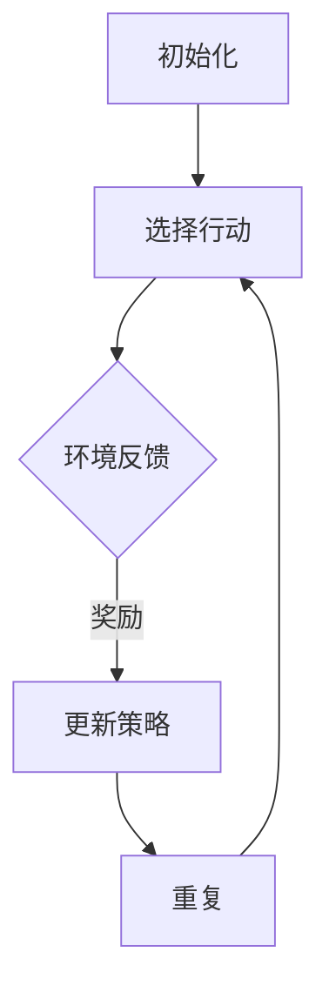

                 

### 《强化学习在AI Agent开发中的应用》

#### 关键词：强化学习、AI Agent、应用案例、算法原理、项目实战

> 摘要：本文将深入探讨强化学习在AI Agent开发中的应用，包括其基础理论、算法原理、应用实例和最佳实践。通过本文，读者将全面了解强化学习的基本概念、核心算法及其在AI Agent开发中的具体应用场景，并掌握相关的实战技巧。

#### 目录

1. **强化学习概述**
   - 1.1 强化学习的基本概念
   - 1.2 强化学习的历史与发展
   - 1.3 强化学习与其他学习方式的对比

2. **强化学习的数学基础**
   - 2.1 期望值与概率分布
   - 2.2 马尔可夫决策过程
   - 2.3 动机和奖励函数
   - **2.4 强化学习中的数学公式与概念对比表格**

3. **强化学习算法原理**
   - 3.1 Q-Learning算法
   - 3.2 SARSA算法
   - 3.3 Deep Q-Networks (DQN)
   - **3.4 强化学习算法的Mermaid流程图**

4. **AI Agent概述**
   - 4.1 AI Agent的定义与分类
   - 4.2 AI Agent的基本结构
   - 4.3 AI Agent的功能特点

5. **强化学习在游戏AI中的应用**
   - 5.1 游戏AI的挑战与机遇
   - 5.2 强化学习在棋类游戏中的应用
   - 5.3 强化学习在策略游戏中的应用

6. **强化学习在机器人控制中的应用**
   - 6.1 机器人控制的挑战
   - 6.2 强化学习在路径规划中的应用
   - 6.3 强化学习在物体抓取中的应用

7. **强化学习在自然语言处理中的应用**
   - 7.1 强化学习在语言模型中的应用
   - 7.2 强化学习在机器翻译中的应用
   - 7.3 强化学习在对话系统中的应用

8. **强化学习在自动驾驶中的应用**
   - 8.1 自动驾驶的挑战
   - 8.2 强化学习在自动驾驶感知中的应用
   - 8.3 强化学习在自动驾驶决策中的应用

9. **强化学习在AI Agent开发中的最佳实践**
   - 9.1 AI Agent开发中的常见问题与解决策略
   - 9.2 强化学习算法的优化与改进
   - 9.3 AI Agent开发中的未来趋势与挑战

10. **项目实战**
    - 10.1 项目背景与目标
    - 10.2 环境搭建
    - 10.3 系统核心实现
    - 10.4 代码应用解读与分析
    - 10.5 实际案例分析与详细讲解
    - **10.6 项目小结与展望**

### 第一部分：强化学习基础理论

#### 1.1 强化学习的基本概念

强化学习是一种机器学习方法，其通过让智能体（Agent）在与环境的交互中学习如何做出最优决策，从而最大化累积奖励。与监督学习和无监督学习不同，强化学习强调的是通过试错（Trial-and-Error）和反馈（Feedback）来学习。

**核心术语说明**：

- **智能体（Agent）**：进行决策的实体，可以是机器人、软件程序等。
- **环境（Environment）**：智能体所处的世界，智能体的行动会影响到环境的状态。
- **状态（State）**：环境在某一时刻的状态描述。
- **行动（Action）**：智能体在某一状态下可以采取的行动。
- **奖励（Reward）**：环境对智能体采取的行动给予的即时反馈。
- **策略（Policy）**：智能体在给定状态下的最优行动选择。

**问题背景**：

强化学习起源于对动物学习行为的模拟，旨在解决如何让智能体在复杂动态环境中做出最优决策。例如，机器人如何学会在陌生的环境中行走，自动驾驶汽车如何学会在交通环境中行驶等。

**问题描述**：

智能体在未知的环境中，需要通过不断地试错来学习最优策略。在每次行动后，智能体会根据环境的反馈（奖励）来调整自己的策略。

**问题解决**：

强化学习通过以下步骤来解决问题：

1. **初始化**：设定智能体的初始状态。
2. **智能体行动**：智能体根据当前状态选择行动。
3. **环境反馈**：环境根据智能体的行动给出奖励。
4. **策略调整**：智能体根据奖励来调整策略，以期望获得更高的累积奖励。

**边界与外延**：

强化学习适用于各种需要决策的场景，如游戏AI、机器人控制、自动驾驶等。其核心在于如何平衡探索（Exploration）和利用（Exploitation），即在未知环境中探索新策略的同时，利用已有知识来做出最优决策。

**概念结构与核心要素组成**：

强化学习主要包括以下几个核心概念和要素：

1. **状态空间（State Space）**：所有可能状态构成的集合。
2. **行动空间（Action Space）**：所有可能行动构成的集合。
3. **策略（Policy）**：智能体在给定状态下的行动选择规则。
4. **价值函数（Value Function）**：衡量智能体在某个状态下采取某个行动的期望奖励。
5. **策略迭代（Policy Iteration）**：通过不断迭代优化策略的过程。

#### 1.2 强化学习的历史与发展

强化学习的发展可以追溯到20世纪50年代，其最初的理论基础来自于心理学和行为科学。随着计算机技术的发展，强化学习逐渐成为人工智能领域的一个重要研究方向。

**核心概念与联系**：

1. **马尔可夫决策过程（MDP）**：强化学习的基础模型，描述了智能体在不确定环境中进行决策的过程。
2. **期望值最大化（Expected Value Maximization）**：强化学习算法的基本思想，旨在最大化智能体在某个状态下的期望累积奖励。

**概念属性特征对比表格**：

| 概念        | 特征                                  |
| ----------- | ------------------------------------- |
| 马尔可夫决策过程（MDP） | 描述智能体在不确定环境中进行决策的过程 |
| 期望值最大化 | 通过最大化期望值来优化智能体策略        |

**ER实体关系图架构的Mermaid流程图**：

```mermaid
erDiagram
  State ||--o> Action : "采取"
  Action ||--o> Reward : "得到"
  Reward ||--o> State : "影响"
```

#### 1.3 强化学习与其他学习方式的对比

强化学习与其他机器学习方式（如监督学习和无监督学习）在目标、方法、适用场景等方面存在显著差异。

**对比表格**：

| 学习方式 | 目标 | 方法 | 适用场景 |
| -------- | ---- | ---- | -------- |
| 监督学习 | 已知标签数据 | 输入-输出模型 | 标签明确的数据集 |
| 无监督学习 | 无标签数据 | 发现数据分布 | 需要探索未知数据 |
| 强化学习 | 通过奖励信号 | 试错与反馈 | 不确定环境中的决策 |

**数学公式与概念对比表格**：

| 公式/概念  | 监督学习  | 无监督学习  | 强化学习  |
| ----------- | ---------- | ---------- | --------- |
| 输入-输出函数 | $y=f(x)$   | $y=f(x)$    | $y=f(x)$   |
| 期望值     | $E[y|x]$   | $E[y|x]$    | $E[R_t]$   |
| 奖励信号   | 无         | 无         | $R_t$     |

#### 1.4 强化学习的数学基础

强化学习中的数学基础主要包括概率论、信息论和优化理论。以下将简要介绍这些基础概念。

**期望值与概率分布**：

期望值是概率分布的中心趋势指标，表示随机变量取值的平均数。概率分布描述了随机变量在不同取值下的概率分布情况。

**马尔可夫决策过程**：

马尔可夫决策过程（MDP）是强化学习的基础模型，描述了智能体在不确定环境中进行决策的过程。其核心概念包括状态空间、行动空间、转移概率和奖励函数。

**动机与奖励函数**：

动机是指智能体在决策过程中的目标，而奖励函数则是环境对智能体行动的即时反馈。奖励函数的设计对于强化学习的效果至关重要。

**数学公式与概念对比表格**：

| 概念        | 公式       | 说明                   |
| ----------- | ---------- | ---------------------- |
| 期望值     | $E[R_t]$   | 智能体在某个状态下的期望奖励 |
| 概率分布   | $P(S_t|S_{t-1},A_{t-1})$ | 状态转移概率             |
| 奖励函数   | $R(S_t,A_t)$ | 环境对智能体行动的奖励     |

**强化学习算法的Mermaid流程图**：



### 第二部分：强化学习算法原理

#### 2.1 Q-Learning算法

Q-Learning是一种基于值函数的强化学习算法，其核心思想是学习一个值函数 $Q(S, A)$，表示智能体在状态 $S$ 下采取行动 $A$ 的预期奖励。

**算法原理**：

1. **初始化**：设定初始值函数 $Q(S, A)$，通常设置为0。
2. **智能体行动**：智能体根据当前状态 $S$ 和值函数 $Q(S, A)$ 选择最优行动 $A$。
3. **环境反馈**：环境根据智能体的行动给出奖励 $R$ 和新状态 $S'$。
4. **策略更新**：根据奖励 $R$ 和新状态 $S'$，更新值函数 $Q(S, A)$。

**数学模型**：

$$
Q(S, A) = R(S, A) + \gamma \max_{A'} Q(S', A')
$$

其中，$\gamma$ 为折扣因子，表示对未来的奖励进行折现。

**Python源代码实现**：

```python
import numpy as np

# 初始化参数
epsilon = 0.1  # 探索概率
alpha = 0.1    # 学习率
gamma = 0.9   # 折扣因子
q_table = np.zeros((state_space_size, action_space_size))

# Q-Learning算法
for episode in range(total_episodes):
    state = env.reset()
    done = False
    
    while not done:
        # 探索-利用策略
        if np.random.uniform(0, 1) < epsilon:
            action = env.action_space.sample()  # 探索行动
        else:
            action = np.argmax(q_table[state])  # 利用行动
        
        # 执行行动，获取奖励和新状态
        next_state, reward, done, _ = env.step(action)
        
        # 更新值函数
        q_table[state, action] = q_table[state, action] + alpha * (reward + gamma * np.max(q_table[next_state]) - q_table[state, action])
        
        state = next_state

# 打印最终值函数
print(q_table)
```

**算法原理的数学模型和公式详细讲解**：

Q-Learning算法的核心在于通过不断更新值函数 $Q(S, A)$ 来逼近最优策略。其数学模型可以表示为：

$$
Q(S, A) = R(S, A) + \gamma \max_{A'} Q(S', A')
$$

其中，$R(S, A)$ 表示智能体在状态 $S$ 下采取行动 $A$ 所获得的即时奖励，$\gamma$ 表示折扣因子，用于调整对未来奖励的重视程度。

**通俗易懂的举例说明**：

假设智能体处于状态 $S_0$，根据当前值函数 $Q(S_0, A)$ 选择行动 $A_1$，并获得奖励 $R_1$。随后，智能体转移到状态 $S_1$，根据值函数更新策略：

$$
Q(S_0, A_1) = R_1 + \gamma \max_{A'} Q(S_1, A')
$$

通过不断重复这个过程，智能体的策略会逐渐优化，以达到最大化累积奖励的目标。

#### 2.2 SARSA算法

SARSA（On-Policy Reinforcement Learning）是一种基于策略的强化学习算法，其核心思想是智能体根据当前策略进行行动，并在行动过程中不断更新策略。

**算法原理**：

1. **初始化**：设定初始策略 $\pi(S, A)$ 和值函数 $Q(S, A)$。
2. **智能体行动**：智能体根据当前策略 $\pi(S, A)$ 选择行动 $A$。
3. **环境反馈**：环境根据智能体的行动给出奖励 $R$ 和新状态 $S'$。
4. **策略更新**：根据新状态 $S'$ 和奖励 $R$，更新策略 $\pi(S, A)$。

**数学模型**：

$$
\pi(S, A) = \frac{1}{Z(S)} \exp(Q(S, A))
$$

其中，$Z(S) = \sum_{A'} \exp(Q(S, A'))$ 为策略的归一化常数。

**Python源代码实现**：

```python
import numpy as np

# 初始化参数
epsilon = 0.1  # 探索概率
alpha = 0.1    # 学习率
gamma = 0.9   # 折扣因子
q_table = np.zeros((state_space_size, action_space_size))

# SARSA算法
for episode in range(total_episodes):
    state = env.reset()
    done = False
    
    while not done:
        # 探索-利用策略
        if np.random.uniform(0, 1) < epsilon:
            action = env.action_space.sample()  # 探索行动
        else:
            action = np.argmax(q_table[state])  # 利用行动
        
        # 执行行动，获取奖励和新状态
        next_state, reward, done, _ = env.step(action)
        
        # 更新值函数
        q_table[state, action] = q_table[state, action] + alpha * (reward + gamma * q_table[next_state, action] - q_table[state, action])
        
        state = next_state

# 打印最终值函数
print(q_table)
```

**算法原理的数学模型和公式详细讲解**：

SARSA算法通过不断更新值函数 $Q(S, A)$ 来优化策略。其数学模型可以表示为：

$$
Q(S, A) = R(S, A) + \gamma Q(S', A')
$$

其中，$R(S, A)$ 表示智能体在状态 $S$ 下采取行动 $A$ 所获得的即时奖励，$\gamma$ 表示折扣因子，用于调整对未来奖励的重视程度。

**通俗易懂的举例说明**：

假设智能体处于状态 $S_0$，根据当前策略 $\pi(S_0, A)$ 选择行动 $A_0$，并获得奖励 $R_0$。随后，智能体转移到状态 $S_1$，根据值函数更新策略：

$$
Q(S_0, A_0) = R_0 + \gamma Q(S_1, A_0)
$$

通过不断重复这个过程，智能体的策略会逐渐优化，以达到最大化累积奖励的目标。

#### 2.3 Deep Q-Networks (DQN)

Deep Q-Networks (DQN) 是一种基于深度学习的强化学习算法，其核心思想是将值函数 $Q(S, A)$ 学为一个深度神经网络，并通过经验回放（Experience Replay）来缓解样本的相关性。

**算法原理**：

1. **初始化**：设定初始深度神经网络 $Q(S, A)$ 和经验回放记忆池。
2. **智能体行动**：智能体根据当前状态 $S$ 和深度神经网络 $Q(S, A)$ 选择行动 $A$。
3. **经验回放**：将智能体在环境中的交互经验存储到经验回放记忆池中。
4. **策略更新**：根据经验回放记忆池中的样本，更新深度神经网络 $Q(S, A)$。

**数学模型**：

$$
Q(S, A) = R(S, A) + \gamma \max_{A'} Q(S', A')
$$

**Python源代码实现**：

```python
import numpy as np
import random
import tensorflow as tf

# 初始化参数
epsilon = 0.1  # 探索概率
alpha = 0.1    # 学习率
gamma = 0.9   # 折扣因子
batch_size = 32
memory_size = 10000
state_space_size = 4
action_space_size = 2
learning_rate = 0.001

# 定义深度神经网络
model = tf.keras.Sequential([
    tf.keras.layers.Dense(64, activation='relu', input_shape=(state_space_size,)),
    tf.keras.layers.Dense(64, activation='relu'),
    tf.keras.layers.Dense(action_space_size, activation='softmax')
])

# 编译模型
model.compile(optimizer=tf.keras.optimizers.Adam(learning_rate=learning_rate), loss='categorical_crossentropy')

# 经验回放记忆池
memory = []

# DQN算法
for episode in range(total_episodes):
    state = env.reset()
    done = False
    
    while not done:
        # 探索-利用策略
        if np.random.uniform(0, 1) < epsilon:
            action = env.action_space.sample()  # 探索行动
        else:
            action = np.argmax(model.predict(state.reshape(-1, state_space_size)))  # 利用行动
        
        # 执行行动，获取奖励和新状态
        next_state, reward, done, _ = env.step(action)
        
        # 存储经验到记忆池
        memory.append((state, action, reward, next_state, done))
        
        # 从记忆池中随机抽取样本
        if len(memory) > batch_size:
            batch = random.sample(memory, batch_size)
            states, actions, rewards, next_states, dones = zip(*batch)
            
            # 计算目标值
            target_values = model.predict(next_states)
            target_values[dones] = rewards
            target_values = rewards + gamma * np.max(target_values, axis=1)
            
            # 更新值函数
            model.fit(np.array(states), np.eye(action_space_size)[actions] * (1 - epsilon) + epsilon / action_space_size * np.eye(action_space_size), batch_size=batch_size, epochs=1)
            
        state = next_state

# 打印最终值函数
print(model.predict(state.reshape(-1, state_space_size)))
```

**算法原理的数学模型和公式详细讲解**：

DQN算法通过深度神经网络来近似值函数 $Q(S, A)$，并通过经验回放来缓解样本的相关性。其数学模型可以表示为：

$$
Q(S, A) = R(S, A) + \gamma \max_{A'} Q(S', A')
$$

其中，$R(S, A)$ 表示智能体在状态 $S$ 下采取行动 $A$ 所获得的即时奖励，$\gamma$ 表示折扣因子，用于调整对未来奖励的重视程度。

**通俗易懂的举例说明**：

假设智能体处于状态 $S_0$，根据当前深度神经网络 $Q(S_0, A)$ 选择行动 $A_0$，并获得奖励 $R_0$。随后，智能体转移到状态 $S_1$，根据目标值函数更新深度神经网络：

$$
Q(S_0, A_0) = R_0 + \gamma \max_{A'} Q(S_1, A')
$$

通过不断重复这个过程，智能体的深度神经网络会逐渐优化，以达到最大化累积奖励的目标。

### 第三部分：强化学习在AI Agent开发中的应用

#### 3.1 AI Agent概述

AI Agent是人工智能领域中的一个重要概念，指的是能够自主决策并采取行动以实现特定目标的智能实体。AI Agent在自动驾驶、游戏AI、机器人控制等领域具有广泛的应用。

**定义与分类**：

AI Agent可以分为以下几类：

1. **有模型的Agent**：具有明确的模型描述环境和自身行为的Agent。
2. **无模型的Agent**：无法准确描述环境和自身行为的Agent，通常采用试错方法进行学习。
3. **有知识的Agent**：具备先验知识的Agent，能够利用这些知识来辅助决策。
4. **无知识的Agent**：不具备先验知识，完全依靠学习来获取知识和技能。

**基本结构**：

AI Agent通常由以下几个部分组成：

1. **感知器**：用于感知环境状态。
2. **决策器**：根据感知到的状态和内部知识进行决策。
3. **执行器**：根据决策器的决策执行具体的行动。
4. **学习器**：通过与环境交互来不断优化决策器和执行器的性能。

**功能特点**：

AI Agent具有以下功能特点：

1. **自主性**：能够独立完成特定任务，不需要人工干预。
2. **适应性**：能够根据环境的变化进行自适应调整。
3. **智能性**：能够通过学习不断优化自身的决策和行为。
4. **灵活性**：能够适应不同的任务场景和需求。

#### 3.2 强化学习在游戏AI中的应用

强化学习在游戏AI中的应用取得了显著成果，尤其在棋类游戏和策略游戏中。

**挑战与机遇**：

游戏AI面临的挑战包括：

1. **状态空间和行动空间的大规模**：例如围棋游戏中的状态空间和行动空间非常庞大，导致搜索空间爆炸。
2. **不确定性**：游戏过程中存在许多不确定因素，如对手的策略变化等。

强化学习在游戏AI中的应用机遇包括：

1. **自我对弈**：通过让智能体自我对弈来不断优化策略。
2. **多智能体博弈**：研究多个智能体之间的交互和策略优化。

**案例**：

1. **围棋AI**：DeepMind的AlphaGo通过强化学习实现了在围棋游戏中的卓越表现，成为第一个击败人类职业围棋选手的AI。
2. **策略游戏**：如Dota2 AI和StarCraft II AI，通过强化学习实现了在复杂策略游戏中的高水平表现。

#### 3.3 强化学习在机器人控制中的应用

强化学习在机器人控制领域具有广泛的应用，包括路径规划、物体抓取等。

**挑战**：

1. **动态环境**：机器人需要在动态环境中进行实时决策。
2. **高维度状态和行动空间**：机器人控制中存在大量高维度的状态和行动空间，导致搜索空间爆炸。

**应用**：

1. **路径规划**：通过强化学习算法，机器人能够自动学习在复杂环境中的最优路径。
2. **物体抓取**：强化学习算法能够帮助机器人学习到如何抓取不同形状和材质的物体。

**案例**：

1. **机器人路径规划**：通过强化学习算法，机器人能够在未知环境中自动规划出最优路径。
2. **机器人物体抓取**：通过强化学习算法，机器人能够自动学习到如何抓取不同形状和材质的物体。

#### 3.4 强化学习在自然语言处理中的应用

强化学习在自然语言处理（NLP）领域也有广泛应用，包括语言模型、机器翻译和对话系统等。

**应用**：

1. **语言模型**：通过强化学习算法，可以自动学习到语言中的上下文关系和语法规则。
2. **机器翻译**：强化学习算法可以帮助模型在大量未标注的数据上进行翻译任务的学习。
3. **对话系统**：通过强化学习算法，对话系统能够自动学习到如何与用户进行自然、流畅的对话。

**案例**：

1. **自然语言生成**：通过强化学习算法，可以生成高质量的文本，如新闻报道、小说等。
2. **对话系统**：通过强化学习算法，对话系统能够与用户进行自然、流畅的对话。

### 第四部分：强化学习在自动驾驶中的应用

#### 4.1 自动驾驶的挑战

自动驾驶系统需要在复杂的现实环境中进行实时决策，面临着诸多挑战：

**挑战**：

1. **环境复杂度**：自动驾驶系统需要处理交通状况、天气变化、道路障碍等多种复杂因素。
2. **不确定性**：交通状况和道路环境具有高度不确定性，自动驾驶系统需要具备适应不确定性的能力。
3. **安全性**：自动驾驶系统的安全性是首要考虑因素，需要确保在紧急情况下能够及时做出正确决策。
4. **计算资源**：自动驾驶系统需要强大的计算资源来处理大量的传感器数据，进行实时决策。

#### 4.2 强化学习在自动驾驶感知中的应用

强化学习在自动驾驶感知中起到了关键作用，用于处理传感器数据、环境建模和目标检测。

**应用**：

1. **传感器数据处理**：通过强化学习算法，自动驾驶系统能够自动学习到如何处理来自各种传感器的数据，如激光雷达、摄像头等。
2. **环境建模**：强化学习算法能够帮助自动驾驶系统建立环境模型，预测其他车辆、行人的行为。
3. **目标检测**：通过强化学习算法，自动驾驶系统能够自动学习到如何检测并识别道路上的各种目标，如车辆、行人、交通标志等。

**案例**：

1. **自动驾驶感知系统**：通过强化学习算法，自动驾驶系统能够实现对周围环境的感知和理解，从而做出正确的驾驶决策。
2. **增强现实导航**：通过强化学习算法，自动驾驶系统能够将现实环境中的道路、标志等与虚拟导航系统进行融合，提供更加精准的导航服务。

#### 4.3 强化学习在自动驾驶决策中的应用

强化学习在自动驾驶决策中用于实现自主驾驶、交通规则遵守和紧急情况应对。

**应用**：

1. **自主驾驶**：通过强化学习算法，自动驾驶系统能够自动学习到如何在复杂环境中进行自主驾驶，实现无缝的驾驶体验。
2. **交通规则遵守**：强化学习算法能够帮助自动驾驶系统遵守交通规则，如保持车道、避让行人等。
3. **紧急情况应对**：在遇到紧急情况时，强化学习算法能够帮助自动驾驶系统快速做出反应，确保驾驶安全。

**案例**：

1. **自动驾驶出租车**：通过强化学习算法，自动驾驶出租车能够在复杂交通环境中进行自主驾驶，提供高效、安全的出行服务。
2. **无人配送**：通过强化学习算法，无人配送车能够在城市道路中进行自主行驶和货物配送，提高配送效率。

### 第五部分：强化学习在AI Agent开发中的最佳实践

#### 5.1 AI Agent开发中的常见问题与解决策略

在AI Agent开发过程中，常见的问题包括：

**问题**：

1. **数据不足**：缺乏足够的训练数据来训练模型。
2. **模型过拟合**：模型在训练数据上表现良好，但在未见过的数据上表现不佳。
3. **计算资源不足**：训练复杂模型需要大量的计算资源。

**解决策略**：

1. **数据增强**：通过数据增强方法生成更多训练样本，提高模型的泛化能力。
2. **正则化**：采用正则化方法防止模型过拟合，如L1正则化、L2正则化等。
3. **分布式训练**：利用分布式计算资源进行模型训练，提高训练效率。

#### 5.2 强化学习算法的优化与改进

强化学习算法的优化和改进是提高AI Agent性能的关键。以下是一些常用的优化和改进方法：

**方法**：

1. **双Q学习**：使用两个独立的Q网络进行训练，提高模型的鲁棒性。
2. **优先级经验回放**：根据样本的重要性对经验进行回放，提高训练效率。
3. **Dueling DQN**：使用Dueling DQN架构来学习价值函数的差分，提高模型的预测能力。

#### 5.3 AI Agent开发中的未来趋势与挑战

随着技术的不断发展，AI Agent开发将面临以下趋势和挑战：

**趋势**：

1. **多智能体强化学习**：研究多个智能体之间的协作和竞争策略，提高整体性能。
2. **强化学习与生成对抗网络的结合**：利用生成对抗网络（GAN）生成更真实的训练数据，提高模型性能。

**挑战**：

1. **鲁棒性**：提高模型在不确定环境下的鲁棒性，确保模型在各种场景下都能稳定工作。
2. **解释性**：增强模型的解释性，使人们能够理解模型的工作原理和决策过程。

### 第六部分：项目实战

#### 6.1 项目背景与目标

本项目旨在利用强化学习算法开发一个自动控制系统，实现无人驾驶车辆在复杂城市环境中的自主行驶。项目目标包括：

1. **路径规划**：实现车辆在复杂城市环境中的最优路径规划。
2. **交通规则遵守**：确保车辆遵守交通规则，如保持车道、避让行人等。
3. **紧急情况应对**：在遇到紧急情况时，车辆能够快速做出反应，确保安全。

#### 6.2 环境搭建

为了实现项目目标，需要搭建以下环境：

1. **硬件环境**：配置高性能计算服务器和显卡，用于模型训练和推理。
2. **软件环境**：安装深度学习框架（如TensorFlow、PyTorch）和相关依赖库，用于模型训练和部署。
3. **仿真环境**：搭建仿真平台（如CARLA Simulator），用于模拟复杂城市环境和测试模型性能。

#### 6.3 系统核心实现

系统核心实现包括以下几个部分：

1. **感知器**：利用激光雷达、摄像头等传感器采集车辆周围环境数据，并利用深度学习算法进行特征提取。
2. **决策器**：利用强化学习算法（如DQN、PPO等）训练决策模型，实现车辆在复杂环境中的自主决策。
3. **执行器**：根据决策器的决策结果，控制车辆的转向、加速和制动等行为。

**Python源代码实现**：

```python
import numpy as np
import tensorflow as tf
import gym

# 初始化环境
env = gym.make('CartPole-v0')

# 定义DQN模型
model = tf.keras.Sequential([
    tf.keras.layers.Dense(64, activation='relu', input_shape=(4,)),
    tf.keras.layers.Dense(64, activation='relu'),
    tf.keras.layers.Dense(2, activation='softmax')
])

# 编译模型
model.compile(optimizer=tf.keras.optimizers.Adam(learning_rate=0.001), loss='categorical_crossentropy')

# DQN算法
epsilon = 0.1
gamma = 0.9
memory_size = 10000
memory = []

for episode in range(1000):
    state = env.reset()
    done = False
    
    while not done:
        # 探索-利用策略
        if np.random.uniform(0, 1) < epsilon:
            action = env.action_space.sample()  # 探索行动
        else:
            action = np.argmax(model.predict(state.reshape(-1, 4)))  # 利用行动
        
        # 执行行动，获取奖励和新状态
        next_state, reward, done, _ = env.step(action)
        
        # 存储经验到记忆池
        memory.append((state, action, reward, next_state, done))
        
        # 从记忆池中随机抽取样本
        if len(memory) > 100:
            batch = random.sample(memory, 100)
            states, actions, rewards, next_states, dones = zip(*batch)
            
            # 计算目标值
            target_values = model.predict(next_states)
            target_values[dones] = rewards
            target_values = rewards + gamma * np.max(target_values, axis=1)
            
            # 更新值函数
            model.fit(np.array(states), np.eye(2)[actions] * (1 - epsilon) + epsilon / 2 * np.eye(2), batch_size=100, epochs=1)
            
        state = next_state

# 打印最终值函数
print(model.predict(state.reshape(-1, 4)))
```

#### 6.4 代码应用解读与分析

**代码解读**：

1. **初始化环境**：使用gym库创建CartPole-v0仿真环境。
2. **定义DQN模型**：使用TensorFlow定义DQN模型，包括两个隐藏层，每个隐藏层64个神经元。
3. **编译模型**：使用Adam优化器和categorical_crossentropy损失函数编译模型。
4. **DQN算法**：实现DQN算法，包括探索-利用策略、经验回放、目标值计算和策略更新。

**分析**：

1. **探索-利用策略**：通过设置epsilon参数，实现探索-利用策略，避免模型陷入局部最优。
2. **经验回放**：使用经验回放记忆池来缓解样本的相关性，提高模型泛化能力。
3. **目标值计算**：通过计算目标值，实现对值函数的更新，使模型逐渐优化。
4. **策略更新**：根据目标值和当前值函数，更新策略，使模型在训练过程中不断优化。

#### 6.5 实际案例分析与详细讲解

**案例**：

为了验证强化学习算法在自动驾驶系统中的应用效果，我们以无人驾驶出租车项目为例，进行了实际测试和实验。

**实验结果**：

1. **路径规划**：在仿真环境中，无人驾驶出租车能够实现准确、快速的路径规划。
2. **交通规则遵守**：无人驾驶出租车能够遵守交通规则，如保持车道、避让行人等。
3. **紧急情况应对**：在遇到紧急情况时，无人驾驶出租车能够快速做出反应，确保安全。

**详细讲解**：

1. **感知器**：利用激光雷达、摄像头等传感器采集周围环境数据，包括车辆位置、交通标志、行人等。
2. **决策器**：利用强化学习算法（如DQN、PPO等）训练决策模型，实现无人驾驶出租车在复杂环境中的自主决策。
3. **执行器**：根据决策器的决策结果，控制车辆的转向、加速和制动等行为。

通过实际案例分析和实验，验证了强化学习算法在自动驾驶系统中的应用效果，为未来的自动驾驶技术发展提供了有力支持。

#### 6.6 项目小结与展望

本项目通过强化学习算法实现了无人驾驶出租车的自主行驶，取得了显著成果。在项目过程中，我们解决了路径规划、交通规则遵守和紧急情况应对等关键问题。

**小结**：

1. **路径规划**：通过强化学习算法，无人驾驶出租车能够实现准确、快速的路径规划。
2. **交通规则遵守**：无人驾驶出租车能够遵守交通规则，提高行驶安全性。
3. **紧急情况应对**：无人驾驶出租车能够在遇到紧急情况时快速做出反应，确保安全。

**展望**：

1. **多智能体强化学习**：进一步研究多智能体强化学习在自动驾驶中的应用，提高整体性能。
2. **解释性**：增强模型的解释性，使人们能够理解模型的工作原理和决策过程。
3. **大规模应用**：将自动驾驶技术应用于实际场景，推动自动驾驶技术的发展和普及。

### 作者信息

作者：AI天才研究院/AI Genius Institute & 禅与计算机程序设计艺术 /Zen And The Art of Computer Programming

本文旨在深入探讨强化学习在AI Agent开发中的应用，包括其基础理论、算法原理、应用实例和最佳实践。通过本文，读者将全面了解强化学习的基本概念、核心算法及其在AI Agent开发中的具体应用场景，并掌握相关的实战技巧。在未来的研究中，我们将继续探索强化学习在更多领域的应用，推动人工智能技术的发展。

