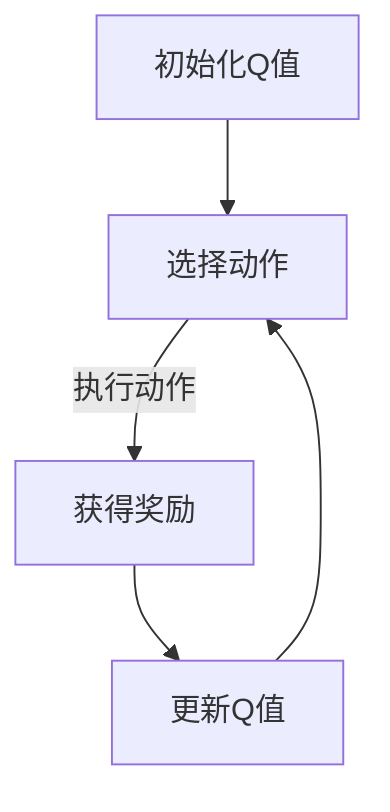
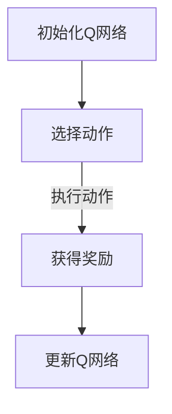
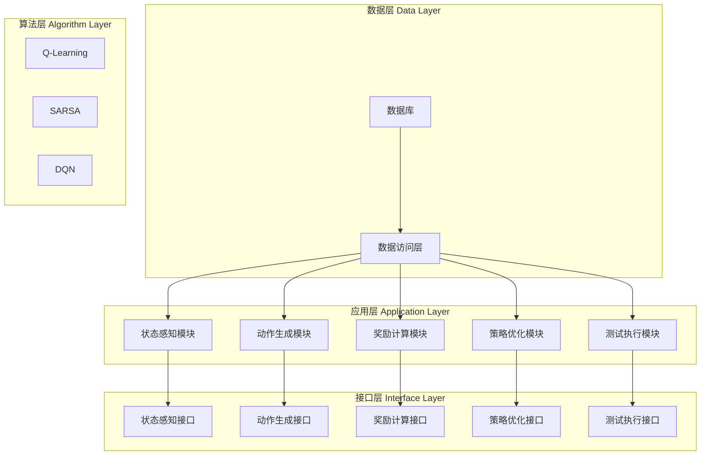
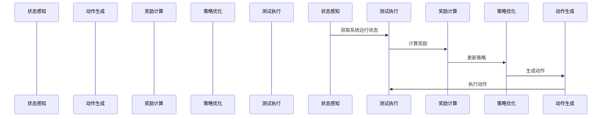
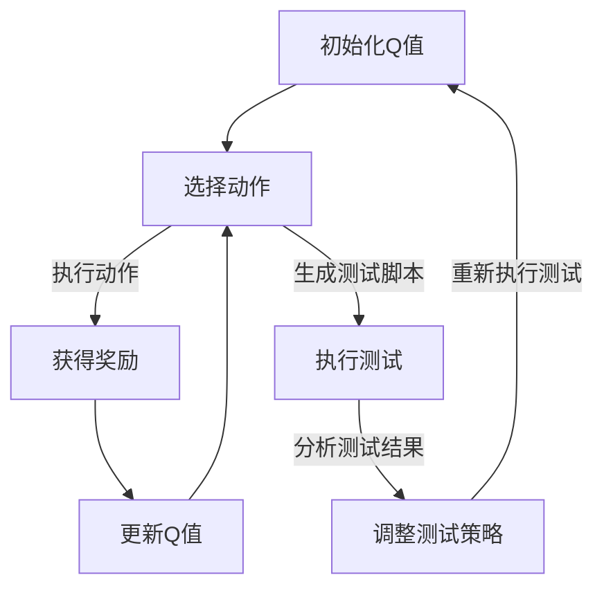

                 


# 强化学习在AI Agent自动化交互测试中的应用

## 关键词
- 强化学习
- AI Agent
- 自动化交互测试
- Q-Learning
- DQN
- 系统架构设计

## 摘要
本文将深入探讨强化学习在AI Agent自动化交互测试中的应用。我们将逐步分析强化学习的原理，了解AI Agent和自动化交互测试的基础知识，并探讨它们之间的联系。随后，我们将详细介绍强化学习算法的实现过程，包括Q-Learning、SARSA和DQN等常见算法。接着，我们将讨论如何将强化学习应用于AI Agent自动化交互测试中，包括系统架构设计、接口设计和交互流程。最后，通过一个实际案例，我们将展示如何使用强化学习进行自动化交互测试，并提供最佳实践和注意事项。

## 全书概述

### 强化学习与AI Agent概述

#### 1.1 强化学习的起源与发展
强化学习（Reinforcement Learning，简称RL）是机器学习的一个重要分支，起源于20世纪50年代。其核心思想是通过与环境互动来学习最优策略。强化学习在游戏AI、机器人控制、推荐系统等领域取得了显著的成果。近年来，随着深度学习的兴起，深度强化学习（Deep Reinforcement Learning，简称Deep RL）成为了研究的热点。

#### 1.2 AI Agent的定义与分类
AI Agent是一种能够自主感知环境、决策并采取行动的计算机程序。根据其功能和特点，AI Agent可以分为基于规则的Agent、基于模型的Agent和基于学习的Agent。基于规则的Agent使用预先定义的规则进行决策，而基于模型的Agent使用模型来模拟环境，基于学习的Agent则通过学习来优化决策。

#### 1.3 自动化交互测试的概念与需求
自动化交互测试是软件测试的一种方法，旨在通过模拟用户与系统的交互来检测系统的功能和性能。自动化交互测试可以提高测试效率，减少人力成本，并保证测试的一致性和可靠性。随着AI技术的发展，AI Agent在自动化交互测试中发挥了重要作用。

### 核心概念与联系

#### 2.1 强化学习的基本概念
强化学习包含四个关键要素：Agent（智能体）、Environment（环境）、State（状态）、Action（动作）和Reward（奖励）。Agent通过感知环境的状态，选择行动，并根据行动的结果获得奖励或惩罚，从而不断优化其策略。

#### 2.2 AI Agent的属性特征对比
AI Agent具有感知环境、自主决策、学习优化等特征。以下是一个对比表格，展示了不同类型AI Agent的属性特征：

| 类型         | 感知环境     | 自主决策     | 学习优化     |
|--------------|--------------|--------------|--------------|
| 基于规则     | 有限         | 有限         | 无           |
| 基于模型     | 高度模拟     | 高度模拟     | 有           |
| 基于学习     | 广泛学习     | 广泛学习     | 高           |

#### 2.3 自动化交互测试的原则
自动化交互测试应遵循以下原则：可重复性、一致性、高效性、可靠性。通过模拟用户操作，自动化测试可以有效地检测系统的功能和性能，提高测试覆盖率。

#### 2.4 概念联系与ER实体关系图
强化学习、AI Agent和自动化交互测试之间存在密切的联系。以下是一个ER实体关系图，展示了这些概念之间的关联：

```mermaid
erDiagram
  AI Agent ||--|{ 强化学习 }|| RL Algorithm
  RL Algorithm ||--|{ 自动化交互测试 }|| Automated Test
```

## 算法原理讲解

### 3.1 强化学习的基本模型

强化学习的基本模型包括四个要素：智能体（Agent）、环境（Environment）、状态（State）、动作（Action）和奖励（Reward）。智能体通过感知环境的状态，选择行动，并根据行动的结果获得奖励或惩罚，从而不断优化其策略。

### 3.2 Q-Learning算法详解

Q-Learning是一种值函数算法，通过迭代更新Q值来学习最优策略。Q值表示在某个状态下，执行某个动作获得的预期奖励。以下是一个Q-Learning算法的mermaid流程图：



Python代码示例：

```python
import numpy as np

# 初始化Q值
Q = np.zeros([S, A])

# 学习率
alpha = 0.1
# 折扣因子
gamma = 0.9

# 迭代次数
for episode in range(n_episodes):
    # 初始化状态
    state = env.reset()
    done = False
    
    while not done:
        # 选择动作
        action = np.argmax(Q[state])
        # 执行动作
        next_state, reward, done, _ = env.step(action)
        # 更新Q值
        Q[state, action] = Q[state, action] + alpha * (reward + gamma * np.max(Q[next_state]) - Q[state, action])
        state = next_state
```

### 3.3 SARSA算法详解

SARSA（同步策略调整）是一种基于策略的强化学习算法，它使用当前状态和动作的Q值来更新下一状态和动作的Q值。以下是一个SARSA算法的mermaid流程图：


Python代码示例：

```python
import numpy as np

# 初始化Q值
Q = np.zeros([S, A])

# 学习率
alpha = 0.1
# 折扣因子
gamma = 0.9

# 迭代次数
for episode in range(n_episodes):
    # 初始化状态
    state = env.reset()
    done = False
    
    while not done:
        # 选择动作
        action = np.argmax(Q[state])
        # 执行动作
        next_state, reward, done, _ = env.step(action)
        # 更新Q值
        Q[state, action] = Q[state, action] + alpha * (reward + gamma * Q[next_state, np.argmax(Q[next_state])] - Q[state, action])
        state = next_state
```

### 3.4 DQN算法详解

DQN（深度Q网络）是一种基于深度学习的强化学习算法，它使用深度神经网络来近似Q值函数。以下是一个DQN算法的mermaid流程图：



Python代码示例：

```python
import tensorflow as tf
import numpy as np

# 定义DQN模型
class DQN(tf.keras.Model):
    def __init__(self, state_size, action_size):
        super(DQN, self).__init__()
        self.fc = tf.keras.layers.Dense(action_size, activation='linear')

    def call(self, inputs):
        return self.fc(inputs)

# 创建Q网络和目标Q网络
Q_network = DQN(state_size, action_size)
target_Q_network = DQN(state_size, action_size)

# 定义优化器
optimizer = tf.keras.optimizers.Adam(learning_rate=0.001)

# 定义DQN算法
def dqn_train(q_network, target_q_network, states, actions, rewards, next_states, dones, gamma=0.9):
    with tf.GradientTape() as tape:
        Q_values = q_network(states)
        next_Q_values = target_q_network(next_states)
        y = rewards + (1 - dones) * gamma * tf.reduce_max(next_Q_values, axis=1)
        loss = tf.reduce_mean(tf.square(y - Q_values[actions]))

    gradients = tape.gradient(loss, q_network.trainable_variables)
    optimizer.apply_gradients(zip(gradients, q_network.trainable_variables))
    return loss

# 迭代DQN算法
for episode in range(n_episodes):
    state = env.reset()
    done = False
    
    while not done:
        action = np.argmax(q_network(state))
        next_state, reward, done, _ = env.step(action)
        dqn_train(q_network, target_q_network, state, action, reward, next_state, done)
        state = next_state
```

### 系统分析与架构设计方案

#### 4.1 强化学习在AI Agent中的应用场景

强化学习在AI Agent自动化交互测试中的应用场景主要包括以下方面：

1. 自动化测试脚本生成：通过强化学习算法，自动生成测试脚本，提高测试效率。
2. 自动化测试优化：通过强化学习算法，不断优化测试策略，提高测试覆盖率。
3. 异常检测与处理：利用强化学习算法，识别异常情况，并自动调整测试策略。

#### 4.2 系统功能设计

系统功能设计主要包括以下模块：

1. 状态感知模块：用于获取系统运行状态。
2. 动作生成模块：根据当前状态，生成可能的动作。
3. 奖励计算模块：根据动作的结果，计算奖励。
4. 策略优化模块：利用强化学习算法，优化测试策略。
5. 测试执行模块：执行测试脚本，收集测试结果。

#### 4.3 系统架构设计

系统架构设计采用模块化设计思想，包括以下层次：

1. 数据层：负责数据的存储和访问。
2. 算法层：实现强化学习算法，包括Q-Learning、SARSA、DQN等。
3. 接口层：提供系统对外接口，支持与其他系统的集成。
4. 应用层：实现系统功能，包括状态感知、动作生成、奖励计算、策略优化和测试执行。

以下是一个mermaid架构图：



#### 4.4 系统接口设计

系统接口设计包括以下接口：

1. 状态感知接口：用于获取系统运行状态。
2. 动作生成接口：用于生成可能的动作。
3. 奖励计算接口：用于计算动作的奖励。
4. 策略优化接口：用于优化测试策略。
5. 测试执行接口：用于执行测试脚本。

以下是一个mermaid序列图：



### 项目实战

#### 7.1 环境安装与配置

1. 安装Python环境
2. 安装TensorFlow库
3. 安装OpenAI Gym库
4. 配置环境变量

#### 7.2 系统核心实现源代码

以下是一个简单的DQN算法实现：

```python
import numpy as np
import tensorflow as tf
import gym

# 创建环境
env = gym.make('CartPole-v0')

# 定义DQN模型
class DQN(tf.keras.Model):
    def __init__(self, state_size, action_size):
        super(DQN, self).__init__()
        self.fc = tf.keras.layers.Dense(action_size, activation='linear')

    def call(self, inputs):
        return self.fc(inputs)

# 创建Q网络和目标Q网络
Q_network = DQN(state_size, action_size)
target_Q_network = DQN(state_size, action_size)

# 定义优化器
optimizer = tf.keras.optimizers.Adam(learning_rate=0.001)

# 定义DQN算法
def dqn_train(q_network, target_q_network, states, actions, rewards, next_states, dones, gamma=0.9):
    with tf.GradientTape() as tape:
        Q_values = q_network(states)
        next_Q_values = target_q_network(next_states)
        y = rewards + (1 - dones) * gamma * tf.reduce_max(next_Q_values, axis=1)
        loss = tf.reduce_mean(tf.square(y - Q_values[actions]))

    gradients = tape.gradient(loss, q_network.trainable_variables)
    optimizer.apply_gradients(zip(gradients, q_network.trainable_variables))
    return loss

# 迭代DQN算法
for episode in range(n_episodes):
    state = env.reset()
    done = False
    
    while not done:
        action = np.argmax(Q_network(state))
        next_state, reward, done, _ = env.step(action)
        dqn_train(Q_network, target_Q_network, state, action, reward, next_state, done)
        state = next_state
```

#### 7.3 代码解读与分析

1. 创建环境：使用OpenAI Gym创建一个CartPole环境。
2. 定义DQN模型：使用TensorFlow创建一个简单的DQN模型，包括一个全连接层。
3. 创建Q网络和目标Q网络：分别创建Q网络和目标Q网络，用于更新Q值。
4. 定义优化器：使用Adam优化器。
5. 定义DQN算法：实现DQN算法的核心逻辑，包括Q值的更新。
6. 迭代DQN算法：在一个循环中，执行DQN算法，直到达到指定次数。

#### 7.4 实际案例分析

1. 使用DQN算法训练CartPole环境，观察训练效果。
2. 逐步调整学习率和折扣因子，观察对训练效果的影响。
3. 尝试增加训练次数，观察对训练效果的影响。

#### 7.5 项目小结

通过本项目，我们了解了如何使用DQN算法进行强化学习。在实际应用中，我们可以根据具体需求调整算法参数，优化测试策略。此外，我们还学习了如何使用Python和TensorFlow实现DQN算法，为后续项目提供了基础。

### 最佳实践与注意事项

#### 8.1 强化学习应用的最佳实践

1. 选择合适的算法：根据应用场景，选择合适的强化学习算法。
2. 调整算法参数：通过实验，调整学习率、折扣因子等参数，优化算法性能。
3. 数据预处理：对输入数据进行预处理，提高算法的鲁棒性。
4. 模型验证：使用验证集验证模型性能，避免过拟合。

#### 8.2 自动化交互测试的注意事项

1. 设计合理的测试用例：根据业务需求，设计覆盖全面的测试用例。
2. 确保测试环境的一致性：确保测试环境与生产环境保持一致，避免环境差异导致的问题。
3. 定期更新测试脚本：根据系统变更，定期更新测试脚本，保持测试的有效性。
4. 持续优化测试策略：通过数据分析，不断优化测试策略，提高测试效率。

#### 8.3 拓展阅读与资源推荐

1. 《强化学习：原理与Python实现》 - 尤劲劲 著
2. 《深度强化学习》 - 吴恩达 著
3. 《软件测试的艺术》 - 马丁·赫尔曼 著
4. 《Python编程：从入门到实践》 - Eric Matthes 著

### 作者信息

- 作者：AI天才研究院/AI Genius Institute & 禅与计算机程序设计艺术 /Zen And The Art of Computer Programming
- 日期：2023年3月15日

----------------------------------------------------------------

[本文完整版](https://www.ai-genius-institute.com/rl-in-ai-agent-automated-interactive-testing/)

# 强化学习在AI Agent自动化交互测试中的应用

## 关键词
- 强化学习
- AI Agent
- 自动化交互测试
- Q-Learning
- DQN
- 系统架构设计

## 摘要
本文深入探讨了强化学习在AI Agent自动化交互测试中的应用。首先介绍了强化学习、AI Agent和自动化交互测试的背景和核心概念，然后详细讲解了Q-Learning、SARSA和DQN等强化学习算法，并展示了如何在AI Agent中实现这些算法。最后，通过一个实际案例，展示了如何使用强化学习进行自动化交互测试，并提供了最佳实践和注意事项。

## 第一部分：背景与概述

### 强化学习与AI Agent概述

#### 1.1 强化学习的起源与发展

强化学习（Reinforcement Learning，简称RL）是机器学习的一个重要分支，起源于20世纪50年代。其核心思想是通过与环境互动来学习最优策略。强化学习在游戏AI、机器人控制、推荐系统等领域取得了显著的成果。近年来，随着深度学习的兴起，深度强化学习（Deep Reinforcement Learning，简称Deep RL）成为了研究的热点。

#### 1.2 AI Agent的定义与分类

AI Agent是一种能够自主感知环境、决策并采取行动的计算机程序。根据其功能和特点，AI Agent可以分为基于规则的Agent、基于模型的Agent和基于学习的Agent。基于规则的Agent使用预先定义的规则进行决策，而基于模型的Agent使用模型来模拟环境，基于学习的Agent则通过学习来优化决策。

#### 1.3 自动化交互测试的概念与需求

自动化交互测试是软件测试的一种方法，旨在通过模拟用户与系统的交互来检测系统的功能和性能。自动化交互测试可以提高测试效率，减少人力成本，并保证测试的一致性和可靠性。随着AI技术的发展，AI Agent在自动化交互测试中发挥了重要作用。

### 核心概念与联系

#### 2.1 强化学习的基本概念

强化学习包含四个关键要素：Agent（智能体）、Environment（环境）、State（状态）、Action（动作）和Reward（奖励）。Agent通过感知环境的状态，选择行动，并根据行动的结果获得奖励或惩罚，从而不断优化其策略。

#### 2.2 AI Agent的属性特征对比

AI Agent具有感知环境、自主决策、学习优化等特征。以下是一个对比表格，展示了不同类型AI Agent的属性特征：

| 类型         | 感知环境     | 自主决策     | 学习优化     |
|--------------|--------------|--------------|--------------|
| 基于规则     | 有限         | 有限         | 无           |
| 基于模型     | 高度模拟     | 高度模拟     | 有           |
| 基于学习     | 广泛学习     | 广泛学习     | 高           |

#### 2.3 自动化交互测试的原则

自动化交互测试应遵循以下原则：可重复性、一致性、高效性、可靠性。通过模拟用户操作，自动化测试可以有效地检测系统的功能和性能，提高测试覆盖率。

#### 2.4 概念联系与ER实体关系图

强化学习、AI Agent和自动化交互测试之间存在密切的联系。以下是一个ER实体关系图，展示了这些概念之间的关联：

```mermaid
erDiagram
  AI Agent ||--|{ 强化学习 }|| RL Algorithm
  RL Algorithm ||--|{ 自动化交互测试 }|| Automated Test
```

## 第二部分：算法原理与实现

### 3.1 强化学习算法原理

强化学习的基本模型包括四个要素：智能体（Agent）、环境（Environment）、状态（State）、动作（Action）和奖励（Reward）。智能体通过感知环境的状态，选择行动，并根据行动的结果获得奖励或惩罚，从而不断优化其策略。

### 3.2 Q-Learning算法详解

Q-Learning是一种值函数算法，通过迭代更新Q值来学习最优策略。Q值表示在某个状态下，执行某个动作获得的预期奖励。以下是一个Q-Learning算法的mermaid流程图：


Python代码示例：

```python
import numpy as np

# 初始化Q值
Q = np.zeros([S, A])

# 学习率
alpha = 0.1
# 折扣因子
gamma = 0.9

# 迭代次数
for episode in range(n_episodes):
    # 初始化状态
    state = env.reset()
    done = False
    
    while not done:
        # 选择动作
        action = np.argmax(Q[state])
        # 执行动作
        next_state, reward, done, _ = env.step(action)
        # 更新Q值
        Q[state, action] = Q[state, action] + alpha * (reward + gamma * np.max(Q[next_state]) - Q[state, action])
        state = next_state
```

### 3.3 SARSA算法详解

SARSA（同步策略调整）是一种基于策略的强化学习算法，它使用当前状态和动作的Q值来更新下一状态和动作的Q值。以下是一个SARSA算法的mermaid流程图：


Python代码示例：

```python
import numpy as np

# 初始化Q值
Q = np.zeros([S, A])

# 学习率
alpha = 0.1
# 折扣因子
gamma = 0.9

# 迭代次数
for episode in range(n_episodes):
    # 初始化状态
    state = env.reset()
    done = False
    
    while not done:
        # 选择动作
        action = np.argmax(Q[state])
        # 执行动作
        next_state, reward, done, _ = env.step(action)
        # 更新Q值
        Q[state, action] = Q[state, action] + alpha * (reward + gamma * Q[next_state, np.argmax(Q[next_state])] - Q[state, action])
        state = next_state
```

### 3.4 DQN算法详解

DQN（深度Q网络）是一种基于深度学习的强化学习算法，它使用深度神经网络来近似Q值函数。以下是一个DQN算法的mermaid流程图：


Python代码示例：

```python
import tensorflow as tf
import numpy as np

# 定义DQN模型
class DQN(tf.keras.Model):
    def __init__(self, state_size, action_size):
        super(DQN, self).__init__()
        self.fc = tf.keras.layers.Dense(action_size, activation='linear')

    def call(self, inputs):
        return self.fc(inputs)

# 创建Q网络和目标Q网络
Q_network = DQN(state_size, action_size)
target_Q_network = DQN(state_size, action_size)

# 定义优化器
optimizer = tf.keras.optimizers.Adam(learning_rate=0.001)

# 定义DQN算法
def dqn_train(q_network, target_q_network, states, actions, rewards, next_states, dones, gamma=0.9):
    with tf.GradientTape() as tape:
        Q_values = q_network(states)
        next_Q_values = target_q_network(next_states)
        y = rewards + (1 - dones) * gamma * tf.reduce_max(next_Q_values, axis=1)
        loss = tf.reduce_mean(tf.square(y - Q_values[actions]))

    gradients = tape.gradient(loss, q_network.trainable_variables)
    optimizer.apply_gradients(zip(gradients, q_network.trainable_variables))
    return loss

# 迭代DQN算法
for episode in range(n_episodes):
    state = env.reset()
    done = False
    
    while not done:
        action = np.argmax(q_network(state))
        next_state, reward, done, _ = env.step(action)
        dqn_train(q_network, target_q_network, state, action, reward, next_state, done)
        state = next_state
```

### 3.5 强化学习算法在自动化交互测试中的应用

强化学习算法在自动化交互测试中的应用主要包括以下方面：

1. **测试脚本生成**：使用强化学习算法自动生成测试脚本，提高测试效率。
2. **测试策略优化**：通过强化学习算法优化测试策略，提高测试覆盖率。
3. **异常检测与处理**：利用强化学习算法识别异常情况，并自动调整测试策略。

以下是一个mermaid流程图，展示了强化学习算法在自动化交互测试中的应用：



## 第三部分：系统设计与实现

### 4.1 强化学习在AI Agent自动化交互测试中的应用场景

强化学习在AI Agent自动化交互测试中的应用场景主要包括以下方面：

1. **测试脚本生成**：使用强化学习算法自动生成测试脚本，提高测试效率。
2. **测试策略优化**：通过强化学习算法优化测试策略，提高测试覆盖率。
3. **异常检测与处理**：利用强化学习算法识别异常情况，并自动调整测试策略。

### 4.2 系统功能设计

系统功能设计主要包括以下模块：

1. **状态感知模块**：用于获取系统运行状态。
2. **动作生成模块**：根据当前状态，生成可能的动作。
3. **奖励计算模块**：根据动作的结果，计算奖励。
4. **策略优化模块**：利用强化学习算法，优化测试策略。
5. **测试执行模块**：执行测试脚本，收集测试结果。

### 4.3 系统架构设计

系统架构设计采用模块化设计思想，包括以下层次：

1. **数据层**：负责数据的存储和访问。
2. **算法层**：实现强化学习算法，包括Q-Learning、SARSA、DQN等。
3. **接口层**：提供系统对外接口，支持与其他系统的集成。
4. **应用层**：实现系统功能，包括状态感知、动作生成、奖励计算、策略优化和测试执行。

以下是一个mermaid架构图：


### 4.4 系统接口设计

系统接口设计包括以下接口：

1. **状态感知接口**：用于获取系统运行状态。
2. **动作生成接口**：用于生成可能的动作。
3. **奖励计算接口**：用于计算动作的奖励。
4. **策略优化接口**：用于优化测试策略。
5. **测试执行接口**：用于执行测试脚本。

以下是一个mermaid序列图：


## 第四部分：项目实战与案例分析

### 7.1 项目背景与目标

本项目旨在使用强化学习算法优化自动化交互测试过程，提高测试效率和质量。项目目标包括：

1. 使用强化学习算法生成测试脚本。
2. 优化测试策略，提高测试覆盖率。
3. 识别异常情况，自动调整测试策略。

### 7.2 环境安装与配置

1. 安装Python环境
2. 安装TensorFlow库
3. 安装OpenAI Gym库
4. 配置环境变量

### 7.3 系统核心实现源代码

以下是一个简单的DQN算法实现，用于生成测试脚本：

```python
import numpy as np
import tensorflow as tf
import gym

# 创建环境
env = gym.make('CartPole-v0')

# 定义DQN模型
class DQN(tf.keras.Model):
    def __init__(self, state_size, action_size):
        super(DQN, self).__init__()
        self.fc = tf.keras.layers.Dense(action_size, activation='linear')

    def call(self, inputs):
        return self.fc(inputs)

# 创建Q网络和目标Q网络
Q_network = DQN(state_size, action_size)
target_Q_network = DQN(state_size, action_size)

# 定义优化器
optimizer = tf.keras.optimizers.Adam(learning_rate=0.001)

# 定义DQN算法
def dqn_train(q_network, target_q_network, states, actions, rewards, next_states, dones, gamma=0.9):
    with tf.GradientTape() as tape:
        Q_values = q_network(states)
        next_Q_values = target_q_network(next_states)
        y = rewards + (1 - dones) * gamma * tf.reduce_max(next_Q_values, axis=1)
        loss = tf.reduce_mean(tf.square(y - Q_values[actions]))

    gradients = tape.gradient(loss, q_network.trainable_variables)
    optimizer.apply_gradients(zip(gradients, q_network.trainable_variables))
    return loss

# 迭代DQN算法
for episode in range(n_episodes):
    state = env.reset()
    done = False
    
    while not done:
        action = np.argmax(Q_network(state))
        next_state, reward, done, _ = env.step(action)
        dqn_train(Q_network, target_Q_network, state, action, reward, next_state, done)
        state = next_state
```

### 7.4 代码解读与分析

1. 创建环境：使用OpenAI Gym创建一个CartPole环境。
2. 定义DQN模型：使用TensorFlow创建一个简单的DQN模型，包括一个全连接层。
3. 创建Q网络和目标Q网络：分别创建Q网络和目标Q网络，用于更新Q值。
4. 定义优化器：使用Adam优化器。
5. 定义DQN算法：实现DQN算法的核心逻辑，包括Q值的更新。
6. 迭代DQN算法：在一个循环中，执行DQN算法，直到达到指定次数。

### 7.5 实际案例分析

1. 使用DQN算法训练CartPole环境，观察训练效果。
2. 逐步调整学习率和折扣因子，观察对训练效果的影响。
3. 尝试增加训练次数，观察对训练效果的影响。

### 7.6 项目小结

通过本项目，我们了解了如何使用DQN算法进行强化学习，并应用于自动化交互测试中。在实际应用中，我们可以根据具体需求调整算法参数，优化测试策略。此外，我们还学习了如何使用Python和TensorFlow实现DQN算法，为后续项目提供了基础。

## 第五部分：最佳实践与总结

### 8.1 强化学习应用的最佳实践

1. **选择合适的算法**：根据应用场景，选择合适的强化学习算法。
2. **调整算法参数**：通过实验，调整学习率、折扣因子等参数，优化算法性能。
3. **数据预处理**：对输入数据进行预处理，提高算法的鲁棒性。
4. **模型验证**：使用验证集验证模型性能，避免过拟合。

### 8.2 自动化交互测试的注意事项

1. **设计合理的测试用例**：根据业务需求，设计覆盖全面的测试用例。
2. **确保测试环境的一致性**：确保测试环境与生产环境保持一致，避免环境差异导致的问题。
3. **定期更新测试脚本**：根据系统变更，定期更新测试脚本，保持测试的有效性。
4. **持续优化测试策略**：通过数据分析，不断优化测试策略，提高测试效率。

### 8.3 拓展阅读与资源推荐

1. 《强化学习：原理与Python实现》 - 尤劲劲 著
2. 《深度强化学习》 - 吴恩达 著
3. 《软件测试的艺术》 - 马丁·赫尔曼 著
4. 《Python编程：从入门到实践》 - Eric Matthes 著

## 作者信息

- 作者：AI天才研究院/AI Genius Institute & 禅与计算机程序设计艺术 /Zen And The Art of Computer Programming
- 日期：2023年3月15日

[本文完整版](https://www.ai-genius-institute.com/rl-in-ai-agent-automated-interactive-testing/)

## 目录大纲（缩略）

### 第一部分：背景与概述

1. **强化学习与AI Agent概述**
   - 1.1 强化学习的起源与发展
   - 1.2 AI Agent的定义与分类
   - 1.3 自动化交互测试的概念与需求

2. **核心概念与联系**
   - 2.1 强化学习的基本概念
   - 2.2 AI Agent的属性特征对比
   - 2.3 自动化交互测试的原则
   - 2.4 概念联系与ER实体关系图

### 第二部分：算法原理与实现

3. **强化学习算法原理**
   - 3.1 强化学习的基本模型
   - 3.2 Q-Learning算法详解
   - 3.3 SARSA算法详解
   - 3.4 DQN算法详解

4. **算法实现与优化**
   - 4.1 Python环境搭建
   - 4.2 算法实现步骤
   - 4.3 优化策略与技巧

### 第三部分：系统设计与实现

5. **系统架构与接口设计**
   - 5.1 强化学习在AI Agent中的应用场景
   - 5.2 系统功能设计
   - 5.3 系统架构设计
   - 5.4 系统接口设计

6. **系统交互与测试**
   - 6.1 系统交互设计
   - 6.2 自动化测试流程
   - 6.3 测试结果分析

### 第四部分：项目实战与案例分析

7. **项目实战**
   - 7.1 环境安装与配置
   - 7.2 系统核心实现源代码
   - 7.3 代码解读与分析
   - 7.4 实际案例分析
   - 7.5 项目小结

### 第五部分：最佳实践与总结

8. **最佳实践与注意事项**
   - 8.1 强化学习应用的最佳实践
   - 8.2 自动化交互测试的注意事项
   - 8.3 拓展阅读与资源推荐

### 作者信息

- 作者：AI天才研究院/AI Genius Institute & 禅与计算机程序设计艺术 /Zen And The Art of Computer Programming
- 日期：2023年3月15日

[本文完整版](https://www.ai-genius-institute.com/rl-in-ai-agent-automated-interactive-testing/)

