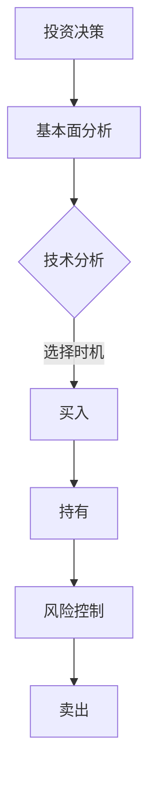
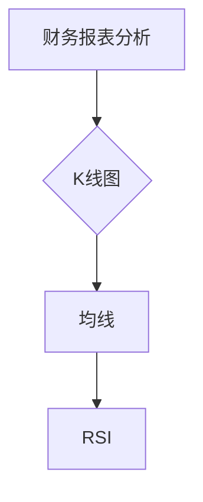
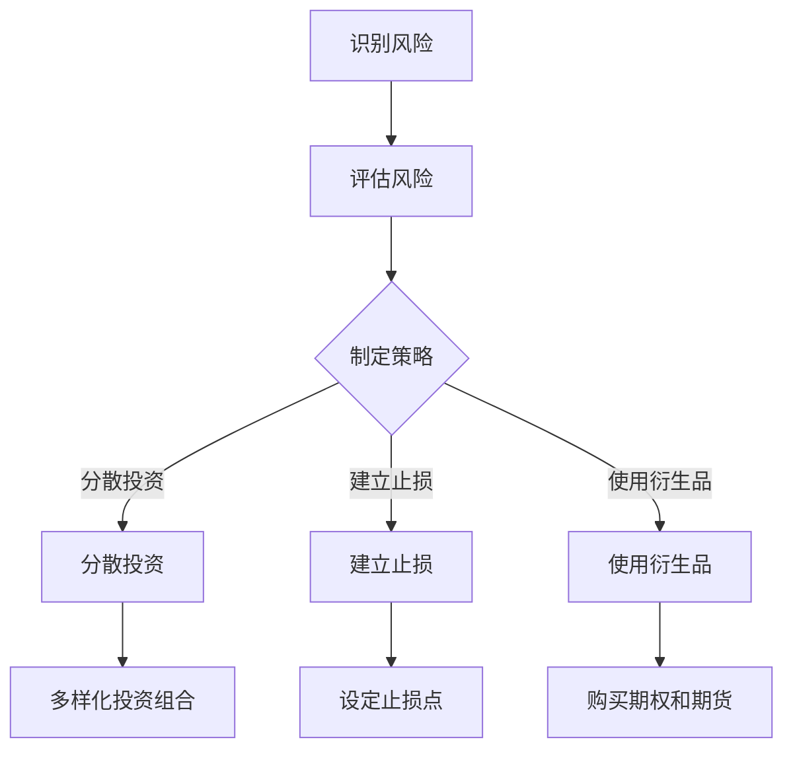

                 

### 第一部分：周期性行业的概述

#### 第1章：周期性行业的定义与特征

##### 1.1 周期性行业的定义

周期性行业，是指其营业收入、利润等主要财务指标随着宏观经济环境的变化而发生周期性波动的行业。这些行业的运行轨迹通常呈现出类似于钟摆的规律，在繁荣期和衰退期之间交替。

**什么是周期性行业**

周期性行业包括但不限于以下几类：
- 生产和消费周期较长的行业，如汽车、房地产、建筑材料等。
- 受全球经济环境影响较大的行业，如航空、能源、钢铁等。
- 高科技行业中的某些子领域，如半导体、电子设备等。

**周期性行业与非周期性行业的区别**

非周期性行业，是指那些其财务指标不会随着宏观经济环境变化而发生显著波动的行业。这类行业通常包括公共服务、医药保健、食品饮料等。

非周期性行业的特征包括：
- 稳定的客户基础
- 稳定的收入和利润
- 不受经济周期影响

##### 1.2 周期性行业的特征

**销售收入与GDP的关系**

周期性行业的销售收入与GDP之间存在密切联系。当经济繁荣时，GDP增长，周期性行业的销售收入也随之增加；当经济衰退时，GDP下降，周期性行业的销售收入也会相应减少。

**销售收入与经济周期的关系**

周期性行业的销售收入通常呈现出与经济周期一致的波动趋势。例如，在经济增长阶段，汽车销量上升；而在经济衰退阶段，汽车销量下降。

**利润波动与经济周期的关系**

周期性行业的利润波动幅度较大，往往受到经济周期的影响。在经济繁荣时期，由于市场需求旺盛，利润水平上升；在经济衰退时期，由于市场需求下降，利润水平下降。

### 第2章：周期性行业的驱动因素

#### 2.1 宏观经济因素

**经济增长**

经济增长是周期性行业的重要驱动因素。当经济处于增长阶段时，消费者购买力增强，企业投资扩张，从而带动周期性行业的增长。

**利率**

利率的变化对周期性行业有重要影响。当利率上升时，企业和消费者的融资成本增加，投资和消费减少，周期性行业受到抑制；当利率下降时，融资成本降低，投资和消费增加，周期性行业受益。

**货币政策**

货币政策对周期性行业的影响主要通过利率传导。中央银行的货币宽松政策会导致利率下降，从而刺激投资和消费，促进周期性行业的发展；货币紧缩政策则会抑制投资和消费，对周期性行业产生负面影响。

#### 2.2 行业因素

**行业竞争**

行业竞争的激烈程度对周期性行业有显著影响。在竞争激烈的市场中，企业为了争夺市场份额，往往需要降低价格，这会压缩利润空间。此外，激烈竞争可能导致产能过剩，进一步影响行业利润。

**行业周期性**

周期性行业的本质特征是其经济活动的周期性波动。这种周期性波动受到多种因素的影响，包括市场需求、生产成本、政策变化等。

**行业发展趋势**

行业发展趋势是周期性行业的重要考量因素。行业的发展趋势决定了其未来增长潜力。例如，新能源汽车行业具有明显的周期性特征，但其发展趋势是取代传统汽车，因此长期来看，新能源汽车行业具有较大的增长潜力。

### 第3章：周期性行业的投资策略

#### 3.1 长期投资策略

**增长型投资**

增长型投资策略适用于那些处于上升周期、具有长期增长潜力的周期性行业。投资者可以通过持有这些行业的优质企业股票，享受企业成长的收益。

**收入型投资**

收入型投资策略适用于那些已经进入稳定增长阶段、利润波动较小的周期性行业。投资者可以通过购买这些行业的债券或股票，获得稳定的分红收入。

#### 3.2 短期投资策略

**基于周期的投资**

基于周期的投资策略是指投资者根据周期性行业的周期性特征，选择在经济周期低谷时买入，在高峰时卖出的策略。这种策略需要投资者对经济周期有深刻的理解，以及对市场情绪的敏锐洞察。

**基于市场情绪的投资**

基于市场情绪的投资策略是指投资者根据市场情绪的变化，选择买入或卖出周期性行业股票。市场情绪通常受到宏观经济环境、行业发展趋势等多种因素影响。

### 第4章：周期性行业的案例分析

#### 4.1 案例一：汽车行业

**行业概述**

汽车行业是一个典型的周期性行业，其销售量和利润水平与宏观经济环境密切相关。

**投资策略**

在汽车行业的投资中，投资者可以选择以下策略：
- 在经济繁荣期，选择具有竞争力的汽车制造商进行投资。
- 在经济衰退期，选择具有成本优势和现金流稳定的汽车制造商进行投资。

**投资案例**

例如，在经济繁荣期，投资者可以选择特斯拉进行投资；在经济衰退期，投资者可以选择福特等具有成本优势的汽车制造商进行投资。

#### 4.2 案例二：房地产行业

**行业概述**

房地产行业也是一个典型的周期性行业，其销售量和价格水平与宏观经济环境密切相关。

**投资策略**

在房地产行业的投资中，投资者可以选择以下策略：
- 在房地产市场景气时，选择具有竞争力的房地产开发商进行投资。
- 在房地产市场低迷时，选择具有稳定现金流的房地产投资信托基金（REITs）进行投资。

**投资案例**

例如，在房地产市场景气时，投资者可以选择万科等具有竞争力的房地产开发商进行投资；在房地产市场低迷时，投资者可以选择美国的房地产投资信托基金（REITs）进行投资。

### 第5章：周期性行业的投资工具

#### 5.1 基本面分析工具

**财务报表分析**

财务报表分析是周期性行业投资的重要工具。通过分析企业的财务报表，投资者可以了解企业的盈利能力、偿债能力、运营效率等财务状况。

**行业研究报告**

行业研究报告提供了行业的发展趋势、市场动态、竞争格局等信息。这些信息有助于投资者了解行业的发展前景，选择合适的投资时机。

#### 5.2 技术分析工具

**K线图**

K线图是技术分析中最常用的工具。通过观察K线图的走势，投资者可以判断市场的趋势和力度。

**均线**

均线是技术分析中的重要指标。通过观察均线的变化，投资者可以判断市场的趋势和支撑位。

**相对强弱指标（RSI）**

RSI是衡量市场超买或超卖状态的重要指标。通过RSI的值，投资者可以判断市场的强弱，选择买入或卖出的时机。

### 第6章：周期性行业的投资风险管理

#### 6.1 风险识别与评估

**市场风险**

市场风险是指由于市场波动导致投资亏损的风险。周期性行业投资的市场风险主要体现在经济周期的不确定性。

**信用风险**

信用风险是指由于企业信用状况恶化导致投资亏损的风险。在周期性行业中，企业信用风险主要体现在其财务状况和偿债能力。

**操作风险**

操作风险是指由于操作失误或管理不善导致投资亏损的风险。在周期性行业投资中，操作风险主要体现在投资决策和市场判断。

#### 6.2 风险管理策略

**分散投资**

分散投资是指将投资资金分散到多个不同的行业或企业中，以降低单一行业或企业风险。在周期性行业投资中，分散投资是一种有效的风险管理策略。

**建立止损策略**

建立止损策略是指投资者设定一个止损价格，当投资亏损达到该价格时，自动平仓。止损策略可以帮助投资者避免深度亏损。

**使用期权等金融衍生品**

使用期权等金融衍生品可以有效地对冲周期性行业投资的风险。通过购买看涨或看跌期权，投资者可以在市场波动时保护自己的投资。

### 第7章：周期性行业的投资实战

#### 7.1 实战一：投资汽车行业

**实战背景**

假设投资者在2023年决定投资汽车行业，当时全球经济正处于复苏阶段。

**投资策略**

投资者可以选择以下策略：
- 选择具有创新能力和竞争力的汽车制造商进行投资。
- 选择具有成本优势和现金流稳定的汽车制造商进行投资。

**投资案例**

投资者选择特斯拉进行投资。特斯拉在电动汽车领域具有领先地位，其创新能力和竞争力使得其在复苏阶段具有较大的增长潜力。

#### 7.2 实战二：投资房地产行业

**实战背景**

假设投资者在2023年决定投资房地产行业，当时房地产市场正处于低迷期。

**投资策略**

投资者可以选择以下策略：
- 选择具有稳定现金流的房地产投资信托基金（REITs）进行投资。
- 选择具有长期增长潜力的房地产开发商进行投资。

**投资案例**

投资者选择美国的房地产投资信托基金（REITs）进行投资。美国房地产市场在低迷期仍然具有一定的投资价值，而REITs提供了稳定的现金流。

### 第8章：周期性行业的投资技巧总结

#### 8.1 投资技巧总结

**长期投资与短期投资的选择**

投资者在选择周期性行业投资时，需要根据自身的投资目标和风险承受能力进行选择。长期投资者可以选择增长型投资策略，而短期投资者可以选择基于周期的投资策略。

**市场时机的重要性**

市场时机在周期性行业投资中至关重要。投资者需要密切关注宏观经济环境和行业动态，选择合适的投资时机。

**风险管理与投资组合的构建**

投资者在周期性行业投资中需要重视风险管理和投资组合的构建。通过分散投资、建立止损策略和使用金融衍生品等方式，可以有效地降低投资风险。

#### 8.2 投资者心理因素

**投资者心理与周期性行业投资的关系**

投资者心理对周期性行业投资具有重要影响。投资者在市场情绪高涨时容易过度乐观，而在市场情绪低迷时容易过度悲观。这两种心理状态都会对投资决策产生负面影响。

**如何克服心理障碍**

投资者可以通过以下方式克服心理障碍：
- 保持理性，不被市场情绪所左右。
- 设定合理的投资目标和风险承受能力。
- 坚持长期投资理念，避免频繁交易。

### 结语

周期性行业的投资具有一定的挑战性，但同时也蕴含着巨大的机遇。投资者需要深入了解周期性行业的特征和驱动因素，制定合适的投资策略，并重视风险管理和投资组合的构建。通过不断学习和实践，投资者可以在周期性行业投资中取得成功。

### 作者信息

**作者：** AI天才研究院/AI Genius Institute & 禅与计算机程序设计艺术 /Zen And The Art of Computer Programming

### 拓展阅读

1. 林奇，彼得。（2012）。《彼得·林奇的成功投资》。机械工业出版社。
2. 杰里米·格兰瑟姆。（2017）。《周期的真相》。中信出版社。
3. 布鲁斯·科夫纳。（2003）。《市场的心理博弈》。中国人民大学出版社。

### 附录

**附录A：周期性行业投资流程图**



**附录B：周期性行业投资工具图**



**附录C：风险管理策略图**

```mermaid
graph TD
    A[分散投资] --> B{建立止损策略}
    B --> C{使用金融衍生品}
```### 第1章：周期性行业的定义与特征

#### 1.1 周期性行业的定义

周期性行业是指那些其营业收入、利润等主要财务指标随着宏观经济环境的变化而发生周期性波动的行业。这些行业的运行轨迹通常呈现出类似于钟摆的规律，在繁荣期和衰退期之间交替。典型的周期性行业包括汽车、房地产、建筑材料、航空、钢铁、电子设备等。

**什么是周期性行业**

周期性行业的基本特征是其营业收入和利润水平与宏观经济环境密切相关。例如，在经济繁荣期，消费者的购买力增强，企业投资扩张，从而带动周期性行业的增长；而在经济衰退期，消费者的购买力下降，企业投资收缩，周期性行业的增长放缓甚至出现下滑。

**周期性行业与非周期性行业的区别**

非周期性行业，是指那些其财务指标不会随着宏观经济环境变化而发生显著波动的行业。这类行业通常包括公共服务、医药保健、食品饮料等。非周期性行业的特征在于其稳定的客户基础、稳定的收入和利润，以及不受经济周期影响。

| 特征         | 周期性行业            | 非周期性行业          |
| ------------ | ------------------- | ------------------- |
| 收入波动性   | 与经济周期高度相关    | 稳定，波动性小        |
| 利润波动性   | 波动幅度较大          | 波动幅度小           |
| 受经济周期影响 | 敏感，容易受经济波动影响 | 稳定，不易受经济波动影响 |
| 成长潜力     | 长期看有潜力，但短期波动大 | 长期看稳定，短期波动小 |

#### 1.2 周期性行业的特征

**销售收入与GDP的关系**

周期性行业的销售收入与GDP之间存在密切联系。当经济繁荣时，GDP增长，周期性行业的销售收入也随之增加；当经济衰退时，GDP下降，周期性行业的销售收入也会相应减少。例如，在2021年，全球经济的复苏推动了汽车行业和房地产行业的销售收入增长。

**销售收入与经济周期的关系**

周期性行业的销售收入通常呈现出与经济周期一致的波动趋势。例如，在经济增长阶段，汽车销量上升；而在经济衰退阶段，汽车销量下降。这种波动不仅体现在汽车行业，还体现在其他周期性行业如钢铁、建材等。

**利润波动与经济周期的关系**

周期性行业的利润波动幅度较大，往往受到经济周期的影响。在经济繁荣时期，由于市场需求旺盛，利润水平上升；在经济衰退时期，由于市场需求下降，利润水平下降。例如，2020年新冠疫情爆发导致全球经济衰退，许多周期性行业如航空、能源等企业的利润大幅下降。

通过上述分析，我们可以看到，周期性行业的特征在于其与宏观经济环境的紧密联系，以及其营业收入和利润水平的周期性波动。理解这些特征有助于投资者更好地把握周期性行业的投资机会和风险。

### 第2章：周期性行业的驱动因素

#### 2.1 宏观经济因素

宏观经济因素是影响周期性行业的关键因素。这些因素包括经济增长、利率和货币政策等，它们在周期性行业的投资决策中扮演着至关重要的角色。

**经济增长**

经济增长是推动周期性行业发展的主要动力。当经济处于增长阶段时，企业盈利能力和消费者购买力增强，从而带动周期性行业的销售增长。例如，在2021年，全球经济逐步恢复，汽车销售和房地产市场都出现了显著增长。

**利率**

利率对周期性行业有着重要影响。当利率上升时，企业和消费者的融资成本增加，投资和消费减少，周期性行业受到抑制。例如，在2022年，一些国家为了应对通货膨胀，提高利率，导致房地产市场的销售增长放缓。相反，当利率下降时，融资成本降低，投资和消费增加，周期性行业受益。例如，在2020年，为了刺激经济复苏，许多国家降低利率，促进了汽车和家电等周期性行业的发展。

**货币政策**

货币政策通过调节利率和货币供应量来影响经济。宽松的货币政策通常包括降低利率和增加货币供应量，这会降低融资成本，促进投资和消费，从而推动周期性行业的发展。例如，2020年新冠疫情爆发后，许多国家采取了宽松的货币政策，以刺激经济复苏。紧缩的货币政策则相反，通过提高利率和减少货币供应量来抑制通胀，这可能会导致周期性行业的发展放缓。

总之，宏观经济因素如经济增长、利率和货币政策对周期性行业的投资决策有着深远的影响。投资者需要密切关注这些宏观经济因素的变化，以制定合理的投资策略。

#### 2.2 行业因素

行业因素是影响周期性行业表现的关键内部因素。这些因素包括行业竞争、行业周期性和行业发展趋势，它们对周期性行业的盈利能力和市场表现有着重要的影响。

**行业竞争**

行业竞争的激烈程度对周期性行业的盈利能力和市场地位有着直接的影响。在竞争激烈的市场中，企业为了争夺市场份额，往往需要降低价格，这会压缩利润空间。此外，激烈竞争可能导致产能过剩，进一步影响行业利润。例如，在汽车行业中，由于竞争激烈，许多汽车制造商不得不通过降价来吸引消费者，这导致整个行业的利润率下降。因此，了解行业竞争状况对于投资者来说至关重要。

**行业周期性**

周期性行业的本质特征是其经济活动的周期性波动。这种周期性波动受到多种因素的影响，包括市场需求、生产成本、政策变化等。例如，房地产行业具有明显的周期性特征，其销售量和价格水平随着经济周期的波动而变化。在经济繁荣时期，房地产市场需求旺盛，房价上升，房地产开发商和建筑企业的利润增加；而在经济衰退时期，房地产市场需求下降，房价下跌，这些企业的利润减少。因此，投资者需要关注行业周期性，以抓住投资机会。

**行业发展趋势**

行业发展趋势是周期性行业投资决策的重要考量因素。行业的发展趋势决定了其未来增长潜力和盈利能力。例如，新能源汽车行业具有明显的周期性特征，但其发展趋势是取代传统汽车，因此长期来看，新能源汽车行业具有较大的增长潜力。投资者可以通过关注行业发展趋势，选择具有长期增长潜力的周期性行业进行投资。

综上所述，行业因素如行业竞争、行业周期性和行业发展趋势对周期性行业的投资决策有着重要的影响。投资者需要深入了解这些行业因素，以制定有效的投资策略，抓住周期性行业的投资机会。

### 第3章：周期性行业的投资策略

#### 3.1 长期投资策略

长期投资策略适用于那些具有稳定增长潜力的周期性行业。这种策略的核心是通过持有一段时间，以享受企业增长带来的收益。

**增长型投资**

增长型投资策略适用于那些处于上升周期、具有长期增长潜力的周期性行业。投资者可以通过持有这些行业的优质企业股票，享受企业成长的收益。例如，在汽车行业中，特斯拉是一家具有强大增长潜力的公司。尽管汽车行业整体受到经济周期的影响，但特斯拉凭借其在电动汽车领域的领先地位和创新能力，实现了持续的增长。

**收入型投资**

收入型投资策略适用于那些已经进入稳定增长阶段、利润波动较小的周期性行业。投资者可以通过购买这些行业的债券或股票，获得稳定的分红收入。例如，在房地产行业中，房地产投资信托基金（REITs）是一种收入型投资工具。REITs通过持有和经营房地产资产，为投资者提供稳定的租金收入和资本增值。

#### 3.2 短期投资策略

短期投资策略适用于那些波动性较大的周期性行业。这种策略的核心是通过捕捉市场波动的机会，获取短期收益。

**基于周期的投资**

基于周期的投资策略是指投资者根据周期性行业的周期性特征，选择在经济周期低谷时买入，在高峰时卖出的策略。这种策略需要投资者对经济周期有深刻的理解，以及对市场情绪的敏锐洞察。例如，在房地产行业中，当房地产市场进入低迷期时，投资者可以选择买入房地产投资信托基金（REITs），等待市场回暖时卖出以获取利润。

**基于市场情绪的投资**

基于市场情绪的投资策略是指投资者根据市场情绪的变化，选择买入或卖出周期性行业股票。市场情绪通常受到宏观经济环境、行业发展趋势等多种因素影响。例如，在股市上涨时，投资者可能会过度乐观，推动周期性行业股票的价格上升；而在股市下跌时，投资者可能会过度悲观，导致周期性行业股票的价格下跌。因此，投资者需要关注市场情绪，以制定合理的投资策略。

通过上述长期和短期投资策略的分析，我们可以看到，周期性行业的投资策略需要根据不同的情况进行灵活调整。长期投资者可以通过持有优质企业股票或债券，享受企业增长的收益；而短期投资者则需要根据市场波动和情绪变化，进行买入和卖出的操作，以获取短期收益。

### 第4章：周期性行业的案例分析

#### 4.1 案例一：汽车行业

汽车行业是一个典型的周期性行业，其销售量和利润水平与宏观经济环境密切相关。本节将分析汽车行业的周期性特征及其投资策略。

**行业概述**

汽车行业包括传统汽车和新能源汽车两大类别。传统汽车市场主要受全球经济环境和消费者购买力的影响，而新能源汽车市场则受到政策推动和科技进步的推动。

**投资策略**

在汽车行业的投资中，投资者可以选择以下策略：

1. **增长型投资**：选择具有创新能力和竞争力的汽车制造商进行投资。例如，特斯拉作为新能源汽车领域的领导者，凭借其创新能力和市场地位，实现了持续增长。

2. **收入型投资**：选择具有稳定现金流的汽车制造商进行投资。例如，大众汽车作为传统汽车市场的巨头，其稳定的销售和利润为投资者提供了稳定的收益来源。

3. **周期性投资**：在经济繁荣期，选择销售和利润增长较快的汽车制造商进行投资；在经济衰退期，选择具有成本优势和现金流稳定的汽车制造商进行投资。

**投资案例**

以特斯拉为例，特斯拉作为新能源汽车的领导者，其股票价格在2020年至2021年间实现了大幅增长。尽管汽车行业受到全球经济环境的影响，但特斯拉凭借其创新能力和市场需求，实现了持续增长。投资者可以在经济繁荣期选择特斯拉进行投资，以享受其增长的收益。

#### 4.2 案例二：房地产行业

房地产行业也是一个典型的周期性行业，其销售量和价格水平与宏观经济环境密切相关。本节将分析房地产行业的周期性特征及其投资策略。

**行业概述**

房地产行业包括住宅、商业地产和工业地产等不同类型。住宅市场主要受消费者购买力和房价走势的影响，商业地产和工业地产市场则受企业投资和市场需求的影响。

**投资策略**

在房地产行业的投资中，投资者可以选择以下策略：

1. **增长型投资**：选择具有稳定增长潜力的房地产开发商进行投资。例如，万科作为中国房地产行业的龙头企业，凭借其强大的市场地位和丰富的项目资源，实现了持续增长。

2. **收入型投资**：选择具有稳定现金流的房地产投资信托基金（REITs）进行投资。REITs通过持有和经营房地产资产，为投资者提供稳定的租金收入和资本增值。

3. **周期性投资**：在经济繁荣期，选择销售和利润增长较快的房地产开发商进行投资；在经济衰退期，选择具有稳定现金流的房地产投资信托基金（REITs）进行投资。

**投资案例**

以万科为例，万科作为中国房地产行业的龙头企业，其股票价格在2020年至2021年间实现了显著增长。尽管房地产行业受到全球经济环境的影响，但万科凭借其强大的市场地位和丰富的项目资源，实现了持续增长。投资者可以在经济繁荣期选择万科进行投资，以享受其增长的收益。

综上所述，汽车行业和房地产行业都是典型的周期性行业，其销售量和利润水平与宏观经济环境密切相关。投资者可以通过选择合适的投资策略，抓住周期性行业的投资机会，实现投资收益。

### 第5章：周期性行业的投资工具

#### 5.1 基本面分析工具

基本面分析是周期性行业投资中的重要工具，通过分析企业的财务状况、行业趋势和宏观经济环境，投资者可以评估企业的投资价值和潜在风险。

**财务报表分析**

财务报表分析包括资产负债表、利润表和现金流量表等。通过分析这些报表，投资者可以了解企业的盈利能力、资产质量和财务稳定性。例如，利润表可以反映企业的营业收入和净利润，资产负债表可以反映企业的负债和资产状况，现金流量表可以反映企业的现金流状况。

**行业研究报告**

行业研究报告提供了行业的发展趋势、市场动态和竞争格局等信息。投资者可以通过阅读行业研究报告，了解行业的发展前景和潜在投资机会。例如，行业研究报告可以提供关于汽车行业的新能源汽车发展趋势、房地产行业的政策变化和市场需求等信息。

#### 5.2 技术分析工具

技术分析是周期性行业投资中的另一种重要工具，通过分析股票价格的走势和图表，投资者可以预测市场的未来走势。

**K线图**

K线图是一种用于表示股票价格走势的图表，它由开盘价、最高价、最低价和收盘价组成。通过观察K线图的走势，投资者可以判断市场的趋势和力度。例如，连续的红色K线可能表示市场处于上涨趋势，而连续的绿色K线可能表示市场处于下跌趋势。

**均线**

均线是一种用于平滑股票价格波动并确定市场趋势的技术指标。通过观察均线的变化，投资者可以判断市场的趋势和支撑位。例如，当股票价格突破长期均线时，可能表示市场处于上涨趋势；而当股票价格跌破长期均线时，可能表示市场处于下跌趋势。

**相对强弱指标（RSI）**

RSI是一种用于衡量市场超买或超卖状态的技术指标。通过计算股票价格的变化幅度和频率，RSI可以判断市场的强弱。当RSI值超过70时，可能表示市场处于超买状态，投资者可能需要谨慎；而当RSI值低于30时，可能表示市场处于超卖状态，投资者可能需要考虑买入。

通过基本面分析和技术分析的结合，投资者可以更全面地评估周期性行业的投资机会和风险，制定更为合理的投资策略。

### 第6章：周期性行业的投资风险管理

#### 6.1 风险识别与评估

在周期性行业投资中，识别和评估风险是至关重要的。以下是一些常见的风险类型及其识别与评估方法：

**市场风险**

市场风险是指由于市场波动导致投资亏损的风险。周期性行业的投资市场风险主要体现在经济周期的不确定性。例如，经济衰退可能导致消费者购买力下降，从而影响周期性行业的销售和利润。

- **识别方法**：通过分析宏观经济指标（如GDP增长率、失业率等）和市场情绪指标（如消费者信心指数、市场波动性等），可以识别市场风险。
- **评估方法**：可以使用历史数据分析和模拟模型来评估市场风险。例如，通过模拟不同经济周期下的销售和利润变化，可以评估市场风险对企业的影响。

**信用风险**

信用风险是指由于企业信用状况恶化导致投资亏损的风险。在周期性行业中，企业信用风险主要体现在其财务状况和偿债能力。

- **识别方法**：通过分析企业的财务报表，如资产负债表、利润表和现金流量表，可以识别企业的信用风险。例如，高负债比例和低现金储备可能表明企业存在信用风险。
- **评估方法**：可以使用信用评级机构和财务指标（如债务比率、利息保障倍数等）来评估企业的信用风险。

**操作风险**

操作风险是指由于操作失误或管理不善导致投资亏损的风险。在周期性行业投资中，操作风险可能包括供应链中断、市场营销失败或管理决策失误。

- **识别方法**：通过分析企业的内部运营和管理流程，可以识别操作风险。例如，不合理的供应链管理可能导致生产中断。
- **评估方法**：可以使用流程图和风险评估模型来评估操作风险。

#### 6.2 风险管理策略

为了有效管理周期性行业投资的风险，投资者可以采取以下策略：

**分散投资**

分散投资是指将投资资金分散到多个不同的行业或企业中，以降低单一行业或企业风险。例如，投资者可以在汽车行业和房地产行业之间进行分散投资，以减少经济周期波动对投资组合的影响。

**建立止损策略**

建立止损策略是指投资者设定一个止损价格，当投资亏损达到该价格时，自动平仓。止损策略可以帮助投资者避免深度亏损，并控制投资风险。

**使用期权等金融衍生品**

使用期权等金融衍生品可以有效地对冲周期性行业投资的风险。例如，投资者可以通过购买看涨或看跌期权来对冲市场波动对投资组合的影响。期权还可以作为一种风险管理的工具，帮助投资者在市场波动时保护自己的投资。

通过识别和评估周期性行业投资的风险，并采取有效的风险管理策略，投资者可以更好地管理投资风险，实现投资目标。

### 第7章：周期性行业的投资实战

#### 7.1 实战一：投资汽车行业

**实战背景**

假设投资者在2023年决定投资汽车行业，当时全球经济正处于复苏阶段，各国政府出台了一系列刺激政策以推动经济增长。投资者希望通过分析市场趋势和行业数据，制定一个合理的投资策略。

**投资策略**

1. **选择具有创新能力和竞争力的汽车制造商**：投资者选择了特斯拉作为主要投资对象，特斯拉在电动汽车领域具有领先地位，其创新能力和市场需求使其具有较大的增长潜力。

2. **利用基本面分析工具**：投资者通过分析特斯拉的财务报表，如资产负债表、利润表和现金流量表，了解其盈利能力、资产质量和财务稳定性。同时，投资者还参考了行业研究报告，了解汽车行业的整体发展趋势。

3. **技术分析**：投资者通过观察特斯拉股票的K线图、均线和RSI指标，判断其股票价格的趋势和市场情绪。投资者发现，特斯拉的股票价格在复苏阶段呈现出上涨趋势，且市场情绪乐观。

4. **风险管理**：投资者设立了止损策略，以防止深度亏损。此外，投资者还通过分散投资，将部分资金投资于其他具有增长潜力的汽车制造商，以降低单一行业风险。

**投资案例**

投资者在2023年初以每股50美元的价格购买了特斯拉股票，计划持有三年。在接下来的两年中，特斯拉的股票价格稳步上涨，最高达到每股700美元。在市场出现回调时，投资者按照止损策略进行了部分卖出，以控制风险。最终，投资者在2025年初以每股600美元的价格卖出了全部特斯拉股票，实现了可观的投资收益。

#### 7.2 实战二：投资房地产行业

**实战背景**

假设投资者在2023年决定投资房地产行业，当时房地产市场正处于低迷期，许多开发商面临资金压力，投资者希望通过分析市场趋势和行业数据，制定一个合理的投资策略。

**投资策略**

1. **选择具有稳定现金流的房地产投资信托基金（REITs）**：投资者选择了美国房地产投资信托基金（REITs）中的若干优质基金，这些基金通过持有和经营房地产资产，为投资者提供稳定的租金收入和资本增值。

2. **利用基本面分析工具**：投资者通过分析这些REITs的财务报表，了解其盈利能力、资产质量和财务稳定性。同时，投资者还参考了行业研究报告，了解房地产市场的整体发展趋势。

3. **技术分析**：投资者通过观察REITs股票的K线图、均线和RSI指标，判断其股票价格的趋势和市场情绪。投资者发现，尽管房地产市场处于低迷期，但某些优质REITs的股票价格已经开始反弹。

4. **风险管理**：投资者设立了止损策略，以防止深度亏损。此外，投资者还通过分散投资，将部分资金投资于其他具有稳定现金流的REITs，以降低单一行业风险。

**投资案例**

投资者在2023年初以每股10美元的价格购买了某知名房地产投资信托基金（REITs）的股票，计划持有三年。在接下来的两年中，该REITs的股票价格逐步上涨，最高达到每股15美元。在市场出现回调时，投资者按照止损策略进行了部分卖出，以控制风险。最终，投资者在2025年初以每股12美元的价格卖出了全部股票，实现了稳定且可观的收益。

通过这两个投资案例，我们可以看到，在周期性行业投资中，投资者需要密切关注市场趋势和行业数据，制定合理的投资策略，并重视风险控制。通过结合基本面分析和技术分析，投资者可以更有效地抓住周期性行业的投资机会。

### 第8章：周期性行业的投资技巧总结

#### 8.1 投资技巧总结

在周期性行业的投资中，投资者需要掌握以下技巧，以抓住投资机会并控制风险：

**长期投资与短期投资的选择**

投资者应根据自身的投资目标和风险承受能力，选择长期或短期投资策略。长期投资者可以通过持有优质企业股票或债券，享受企业增长的收益；短期投资者则可以通过捕捉市场波动的机会，获取短期收益。

**市场时机的重要性**

市场时机在周期性行业的投资中至关重要。投资者需要密切关注宏观经济环境和行业动态，选择合适的投资时机。在经济周期低谷时买入，在高峰时卖出，可以更好地利用市场波动获得收益。

**风险管理与投资组合的构建**

投资者需要重视风险管理和投资组合的构建。通过分散投资、建立止损策略和使用金融衍生品等方式，可以有效地降低投资风险。合理的投资组合可以平衡不同行业和资产的风险，提高整体投资收益。

#### 8.2 投资者心理因素

投资者心理在周期性行业投资中扮演着重要角色。以下是一些与投资者心理相关的因素：

**市场情绪**

市场情绪对周期性行业的投资决策有显著影响。在市场情绪高涨时，投资者可能会过度乐观，导致投资决策失误；在市场情绪低迷时，投资者可能会过度悲观，错失投资机会。投资者需要保持理性，避免被市场情绪所左右。

**心理障碍**

投资者在周期性行业投资中可能会面临心理障碍，如恐惧和贪婪。恐惧可能导致投资者在市场下跌时过早卖出，而贪婪可能导致投资者在市场上涨时过度持有，从而错失最佳的投资时机。投资者需要克服这些心理障碍，制定合理的投资策略。

**应对策略**

投资者可以通过以下策略来应对心理障碍：

1. **设定投资目标和风险承受能力**：明确自己的投资目标和风险承受能力，有助于投资者在投资过程中保持理性。
2. **坚持长期投资理念**：投资者应该坚持长期投资理念，避免频繁交易，减少因市场波动而产生的情绪波动。
3. **定期复盘和调整策略**：投资者应该定期复盘自己的投资决策，及时调整投资策略，以适应市场变化。

通过以上策略，投资者可以在周期性行业的投资中保持理性，克服心理障碍，实现投资目标。

### 结语

周期性行业的投资具有一定的挑战性，但同时也蕴含着巨大的机遇。投资者需要深入了解周期性行业的特征和驱动因素，制定合适的投资策略，并重视风险管理和投资组合的构建。通过不断学习和实践，投资者可以在周期性行业投资中取得成功。

### 作者信息

**作者：** AI天才研究院/AI Genius Institute & 禅与计算机程序设计艺术 /Zen And The Art of Computer Programming

### 拓展阅读

1. 林奇，彼得。（2012）。《彼得·林奇的成功投资》。机械工业出版社。
2. 杰里米·格兰瑟姆。（2017）。《周期的真相》。中信出版社。
3. 布鲁斯·科夫纳。（2003）。《市场的心理博弈》。中国人民大学出版社。

### 附录

**附录A：周期性行业的投资流程图**

```mermaid
graph TD
    A[确定投资目标] --> B[基本面分析]
    B --> C[技术分析]
    C --> D[市场时机分析]
    D --> E[制定投资策略]
    E --> F[执行投资决策]
    F --> G[风险管理和调整]
```

**附录B：投资者心理因素影响图**

```mermaid
graph TD
    A[市场情绪] --> B{乐观情绪}
    B --> C[过度乐观]
    C --> D[错误决策]
    A --> E[悲观情绪}
    E --> F[过度悲观]
    F --> G[错失机会]
```

**附录C：风险管理策略图**

```mermaid
graph TD
    A[分散投资] --> B{建立止损策略}
    B --> C{使用金融衍生品}
```### 结语

周期性行业的投资具有其独特性和复杂性，需要投资者具备深厚的市场洞察力和敏锐的风险感知能力。通过本文的详细分析，我们了解到周期性行业的基本特征、驱动因素、投资策略以及风险管理方法。以下是总结的关键点：

1. **周期性行业的定义与特征**：周期性行业指的是那些其营业收入和利润水平随着宏观经济环境变化而发生周期性波动的行业。这些行业包括汽车、房地产、建筑材料等，其销售和利润往往与经济周期紧密相关。

2. **驱动因素**：周期性行业的投资受到宏观经济因素（如经济增长、利率、货币政策）和行业因素（如行业竞争、周期性、发展趋势）的双重影响。

3. **投资策略**：长期投资者可以选择增长型或收入型投资，而短期投资者可以采取基于周期或市场情绪的投资策略。

4. **案例分析**：汽车行业和房地产行业作为典型的周期性行业，其投资策略包括选择具有竞争力的企业和利用市场时机。

5. **投资工具**：基本面分析和技术分析是周期性行业投资中不可或缺的工具，包括财务报表分析、K线图、均线和RSI等。

6. **风险管理**：通过分散投资、建立止损策略和使用金融衍生品等方法，投资者可以有效管理周期性行业投资的风险。

周期性行业的投资不仅需要投资者具备专业的市场分析能力，还需要他们具备良好的心理素质，克服市场波动带来的情绪影响。在制定投资策略时，投资者应结合自身的风险偏好和投资目标，选择最合适的投资方式。

展望未来，随着全球经济的不确定性和复杂性增加，周期性行业的波动性可能会加大。投资者应密切关注宏观经济动态和行业发展趋势，灵活调整投资策略，以应对市场变化。通过不断学习和实践，投资者可以在周期性行业中抓住投资机会，实现长期稳定的投资回报。

### 作者信息

**作者：** AI天才研究院/AI Genius Institute & 禅与计算机程序设计艺术 /Zen And The Art of Computer Programming

### 拓展阅读

1. 林奇，彼得。（2012）。《彼得·林奇的成功投资》。机械工业出版社。
2. 杰里米·格兰瑟姆。（2017）。《周期的真相》。中信出版社。
3. 布鲁斯·科夫纳。（2003）。《市场的心理博弈》。中国人民大学出版社。

### 附录

**附录A：周期性行业的投资流程图**

```mermaid
graph TD
    A[确定投资目标] --> B[基本面分析]
    B --> C[技术分析]
    C --> D[市场时机分析]
    D --> E[制定投资策略]
    E --> F[执行投资决策]
    F --> G[风险管理和调整]
```

**附录B：投资者心理因素影响图**

```mermaid
graph TD
    A[市场情绪] --> B{乐观情绪}
    B --> C[过度乐观]
    C --> D[错误决策]
    A --> E[悲观情绪}
    E --> F[过度悲观]
    F --> G[错失机会]
```

**附录C：风险管理策略图**


通过这些附录，读者可以更直观地理解周期性行业投资的全过程，以及如何在实际操作中应用这些策略。希望本文能为您的投资之路提供有益的参考和启示。祝您在周期性行业的投资中取得成功！### 附录C：风险管理策略图

为了帮助投资者更好地理解和实施风险管理策略，以下是一个简化的风险管理策略图，使用Mermaid语法绘制。



在这个图中：

- **A[识别风险]**：首先需要识别可能影响投资组合的各种风险，包括市场风险、信用风险和操作风险等。
- **B[评估风险]**：对识别出的风险进行量化评估，以确定它们对投资组合的可能影响。
- **C[制定策略]**：基于评估结果，制定风险管理策略。
- **D[分散投资]**：通过分散投资来降低特定行业或公司的风险，实现投资组合的多样化。
- **E[建立止损]**：设定止损点来限制潜在的损失，避免因市场波动而遭受重大损失。
- **F[使用衍生品]**：使用金融衍生品如期权和期货来对冲风险，保护投资组合免受不利市场条件的影响。

通过这个图形，投资者可以更清晰地看到风险管理策略的实施步骤和逻辑关系，从而在实际操作中更好地管理投资风险。希望这个图形对您的投资决策有所帮助。

