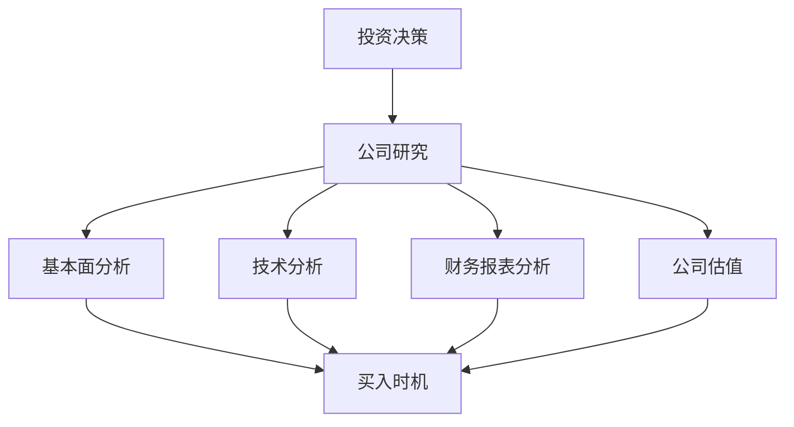

                 

### 彼得·林奇的新兴市场投资策略

> 关键词：彼得·林奇、新兴市场、投资策略、价值投资、成长投资、投资组合管理

摘要：彼得·林奇是一位著名的美国投资专家，他的投资策略在股票市场中取得了显著的成果。本文将详细介绍彼得·林奇的新兴市场投资策略，包括其核心投资理念、具体策略、行业分析与公司研究方法，以及实战案例和策略调整与优化。通过本文的详细分析，读者可以更好地理解彼得·林奇的投资策略，并将其应用于新兴市场的投资中。

---

## 引言

新兴市场是指经济发展迅速、市场潜力巨大的国家和地区。这些市场通常具有以下特点：

1. **高经济增长率**：新兴市场的经济增速往往高于发达市场，这为投资者提供了较高的潜在回报。
2. **市场开放程度高**：新兴市场的贸易和投资政策相对宽松，外资进入门槛较低，有利于资本的流动和投资机会的产生。
3. **多样性**：新兴市场涵盖了各种行业和领域，包括制造业、服务业、科技行业和健康行业等，提供了丰富的投资选择。

然而，新兴市场也伴随着较高的风险，如政策波动、市场波动和地缘政治风险等。因此，投资者需要采取适当的投资策略来降低风险，实现资产的稳健增长。

彼得·林奇（Peter Lynch）是一位享有盛誉的美国投资专家，他在股票市场中取得了卓越的业绩。他的投资策略以价值投资和成长投资为基础，注重长期投资和资产配置。本文将重点探讨彼得·林奇的新兴市场投资策略，帮助读者更好地理解这一策略的核心思想和实践方法。

## 彼得·林奇的投资哲学

彼得·林奇的投资哲学可以总结为以下几点：

1. **长期投资**：彼得·林奇强调长期投资的重要性，他认为股票投资是一个长期的过程，而不是短期的投机行为。通过长期持有优质股票，投资者可以获得较高的回报。

2. **价值投资**：价值投资是彼得·林奇的核心投资理念之一。他认为，股票的价值是由其内在价值决定的，而不是市场价格。投资者应该寻找那些价格低于其内在价值的股票，并持有这些股票直到其价格接近或超过其内在价值。

3. **成长投资**：成长投资是彼得·林奇的另一个核心投资理念。他认为，成长股票具有巨大的增长潜力，能够在较长时间内实现大幅度的股价上涨。投资者应该寻找那些拥有强大竞争优势、高增长潜力的公司，并持有这些股票。

4. **资产配置**：彼得·林奇主张合理的资产配置，通过在不同资产类别、不同行业和不同地区进行分散投资，降低投资风险，实现资产的稳健增长。

## 彼得·林奇的新兴市场投资策略

彼得·林奇的新兴市场投资策略主要包括以下几个方面：

### 1. 价值投资策略

价值投资是彼得·林奇的核心投资策略之一。在新兴市场中，他寻找那些价格低于其内在价值的股票。以下是价值投资策略的关键步骤：

1. **公司基本面分析**：投资者需要分析公司的财务报表、经营状况和行业地位，以评估其内在价值。
2. **估值方法**：投资者可以使用市盈率、市净率、企业价值/EBITDA等方法来评估股票的价值。
3. **买入时机**：投资者应在股票价格低于其内在价值时买入，并在股票价格接近或超过其内在价值时卖出。

### 2. 成长投资策略

成长投资是彼得·林奇在新兴市场中常用的策略之一。他寻找那些具有强大竞争优势、高增长潜力的公司。以下是成长投资策略的关键步骤：

1. **行业研究**：投资者需要了解不同行业的增长趋势、竞争格局和未来发展方向。
2. **公司竞争优势**：投资者应评估公司的竞争优势，如品牌、技术、市场份额等。
3. **买入时机**：投资者应在公司股价较低时买入，并在公司股价上涨时持有。

### 3. 投资组合管理

彼得·林奇认为，合理的投资组合管理是降低投资风险、实现资产稳健增长的关键。以下是投资组合管理的几个要点：

1. **分散投资**：投资者应将资金分散投资于不同行业、不同地区和不同类型的股票，以降低风险。
2. **定期调整**：投资者应定期检查投资组合，根据市场变化进行调整，以保持投资组合的平衡。
3. **风险管理**：投资者应制定合适的风险管理策略，如设置止损点、分散投资等。

## 新兴市场行业分析

在新兴市场中，不同的行业具有不同的增长潜力和投资价值。以下是彼得·林奇在新兴市场投资中关注的几个主要行业：

### 1. 制造业

制造业是新兴市场的重要行业之一，包括汽车、家电、电子等领域。这些行业通常具有较大的市场规模和较高的技术含量，具有较高的投资潜力。

### 2. 服务业

服务业是新兴市场增长最快的行业之一，包括金融、零售、物流等领域。随着新兴市场经济的不断发展，服务业的需求也在不断增加，为投资者提供了良好的投资机会。

### 3. 科技行业

科技行业是新兴市场中最具活力和潜力的行业之一，包括互联网、人工智能、大数据等领域。科技行业的快速发展为投资者带来了丰富的投资机会。

### 4. 健康行业

健康行业是新兴市场中的一个重要行业，包括医药、医疗设备、保健品等领域。随着人们健康意识的提高，健康行业的需求也在不断增加，为投资者提供了良好的投资机会。

## 新兴市场公司研究

在新兴市场投资中，对公司的研究是至关重要的。以下是彼得·林奇在新兴市场公司研究中的几个关键方面：

### 1. 公司基本面分析

公司基本面分析是评估公司内在价值的重要方法。投资者需要分析公司的财务报表、经营状况和行业地位，以评估其内在价值。

### 2. 技术分析

技术分析是评估股票价格走势的重要方法。投资者可以使用各种技术指标和图表来分析股票的价格走势，以确定买入和卖出的时机。

### 3. 财务报表分析

财务报表分析是评估公司财务状况的重要方法。投资者需要分析公司的资产负债表、利润表和现金流量表，以了解公司的财务状况和经营成果。

### 4. 公司估值

公司估值是评估股票价格的重要方法。投资者可以使用市盈率、市净率、企业价值/EBITDA等方法来评估公司的价值，以确定买入和卖出的时机。

## 彼得·林奇的新兴市场投资实战

彼得·林奇在新兴市场的投资中，积累了丰富的实战经验。以下是一个典型的投资案例：

### 案例介绍

彼得·林奇在20世纪80年代投资了一家名为“IBM”的新兴市场科技公司。这家公司拥有强大的技术研发能力和广阔的市场前景。

### 投资决策过程

1. **行业研究**：彼得·林奇首先对科技行业进行了深入研究，分析了行业的增长趋势、竞争格局和未来发展方向。
2. **公司分析**：他对“IBM”进行了详细的研究，分析了其财务报表、技术实力和市场地位，认为该公司具有强大的竞争优势和较高的增长潜力。
3. **买入时机**：彼得·林奇在股价较低时买入“IBM”股票，并持有多年。

### 投资收益分析

通过长期持有“IBM”股票，彼得·林奇获得了丰厚的投资回报。尽管期间经历了市场波动和公司业绩的波动，但最终他的投资获得了可观的收益。

## 新兴市场投资策略的调整与优化

彼得·林奇认为，新兴市场的投资策略需要根据市场环境的变化进行调整和优化。以下是几个关键方面：

### 1. 投资策略调整

投资者需要根据市场环境的变化，调整其投资策略。例如，在市场波动较大时，可以适当增加债券等低风险资产的比例，降低整体投资组合的风险。

### 2. 投资策略优化

投资者可以通过优化投资组合，提高整体收益。例如，可以引入量化投资策略、对冲策略等，以降低投资风险，提高收益。

### 3. 风险管理与控制

投资者需要建立有效的风险管理和控制机制，包括设置止损点、分散投资等，以降低投资风险。

## 小结

彼得·林奇的新兴市场投资策略以其独特的价值投资和成长投资理念，为投资者提供了宝贵的投资指导。通过本文的详细分析，读者可以更好地理解彼得·林奇的投资策略，并应用于新兴市场的投资中。在投资过程中，投资者需要结合市场环境、行业趋势和公司基本面，制定合适的投资策略，实现资产的稳健增长。

## 作者信息

作者：AI天才研究院/AI Genius Institute & 禅与计算机程序设计艺术 /Zen And The Art of Computer Programming

---

**注意事项：**

- 在实际投资中，投资者需要结合市场环境、行业趋势和公司基本面，制定合适的投资策略，实现资产的稳健增长。
- 新兴市场的投资风险较高，投资者应充分了解投资风险，并做好风险管理和控制。
- 本文章仅供参考，不构成具体投资建议。投资者在做出投资决策时，应谨慎考虑自身风险承受能力和投资目标。

**拓展阅读：**

- 彼得·林奇的著作，如《战胜华尔街》和《彼得·林奇的成功投资》等，提供了丰富的投资经验和策略分析。
- 相关研究论文和报告，如《新兴市场的投资机会与挑战》和《彼得·林奇的投资策略解析》等，可以帮助读者更深入地了解新兴市场的投资策略。

---

**Mermaid 流程图：**



**Python 代码示例：**

```python
import pandas as pd

# 基本面分析数据
data = {
    '公司名称': ['公司A', '公司B', '公司C'],
    '市盈率': [10, 20, 15],
    '市净率': [2, 3, 2.5],
    '企业价值/EBITDA': [5, 7, 6]
}

# 创建DataFrame
df = pd.DataFrame(data)

# 估值方法
def evaluate_company(df):
    # 计算每个公司的平均估值
    average_pe = df['市盈率'].mean()
    average_pb = df['市净率'].mean()
    average_evebitda = df['企业价值/EBITDA'].mean()

    # 打印平均估值
    print(f"平均市盈率: {average_pe}")
    print(f"平均市净率: {average_pb}")
    print(f"平均企业价值/EBITDA: {average_evebitda}")

    # 找出估值最低的公司
    lowest_pe = df['市盈率'].min()
    lowest_pb = df['市净率'].min()
    lowest_evebitda = df['企业价值/EBITDA'].min()

    print(f"市盈率最低的公司：{df[df['市盈率'] == lowest_pe]['公司名称'].values}")
    print(f"市净率最低的公司：{df[df['市净率'] == lowest_pb]['公司名称'].values}")
    print(f"企业价值/EBITDA最低的公司：{df[df['企业价值/EBITDA'] == lowest_evebitda]['公司名称'].values}")

# 执行估值分析
evaluate_company(df)
```

**代码解读：**

- 导入 pandas 库，用于数据分析和处理。
- 创建一个 DataFrame，包含公司名称、市盈率、市净率和企业价值/EBITDA 等指标。
- 定义一个函数 `evaluate_company`，用于计算平均估值和找出估值最低的公司。
- 在函数中，使用 DataFrame 的 mean() 方法计算平均市盈率、平均市净率和平均企业价值/EBITDA。
- 使用 DataFrame 的 min() 方法找出市盈率、市净率和企业价值/EBITDA最低的公司。
- 打印出平均估值和估值最低的公司名称。

通过这个示例，读者可以了解如何使用 Python 代码进行公司估值分析，以及如何将数据分析结果应用于投资决策中。在实际应用中，可以根据具体需求，调整代码以处理不同的数据和分析方法。

