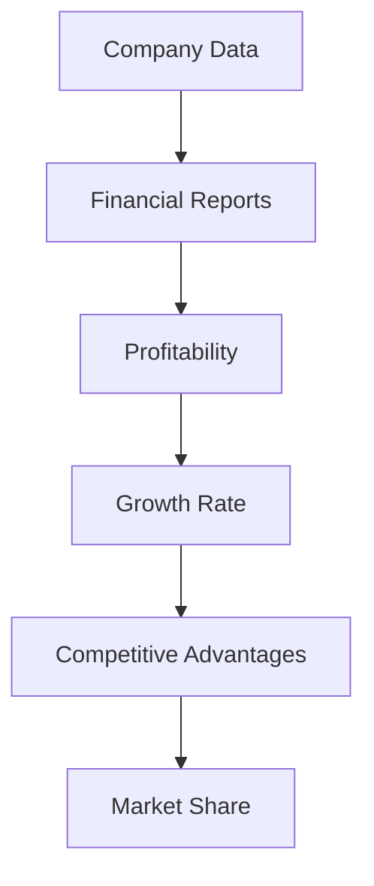

                 


# 引言：本地投资的魅力与挑战

> 关键词：彼得·林奇，本地投资，投资策略，风险识别，案例解析

本地投资，作为一种贴近生活、符合个人认知的投资方式，一直受到投资者的青睐。本文将围绕投资大师彼得·林奇的本地投资理念，探讨其在实际操作中的应用与优势。在引言部分，我们将简要介绍彼得·林奇的投资生涯、投资理念以及本地投资的优势。

## 1.1 投资大师彼得·林奇简介

彼得·林奇（Peter Lynch）是美国著名基金经理和投资大师，被誉为“美国基金之父”。他在1977年至1990年期间担任富达基金管理公司（Fidelity Investments）的基金经理，期间带领麦哲伦基金（Magellan Fund）取得了惊人的业绩，成为当时全球最大的共同基金。彼得·林奇的投资哲学强调长期投资、价值投资和本地投资。

### 1.1.1 彼得·林奇的辉煌投资生涯

彼得·林奇在投资界的辉煌成就，始于1977年他接手富达基金管理公司的麦哲伦基金。在他的管理下，麦哲伦基金资产从2,000万美元增长到140亿美元，年均收益率高达29%，远超市场平均水平。这一成就使得彼得·林奇成为投资界的传奇人物。

### 1.1.2 林奇的投资理念与原则

彼得·林奇的投资理念主要分为三个方面：长期投资、价值投资和本地投资。

- **长期投资**：林奇认为，投资成功的关键在于坚持长期投资，而不是短期投机。他强调，投资者应该把时间当作朋友，相信时间的复利效应。
- **价值投资**：林奇认为，股票价格往往会受到市场情绪的影响，而忽略了公司的实际价值。投资者应该寻找那些被市场低估的优质公司，并在合适的价格买入。
- **本地投资**：林奇主张投资者应该关注自己生活和工作所在的本地市场，投资自己了解的公司和行业。他认为，本地投资者更容易发现潜在的投资机会，从而获得更好的投资回报。

### 1.1.3 本地投资的优势

本地投资的优势主要体现在以下几个方面：

1. **信息优势**：本地投资者对本地市场、公司和行业有更深入的了解，更容易获取第一手信息。
2. **风险可控**：本地投资可以降低投资者面临的地理风险，例如政治风险、经济风险等。
3. **投资机会更多**：本地市场通常更容易发现未被市场关注的优质公司，为投资者提供了更多的投资机会。
4. **成本较低**：本地投资可以减少交通、住宿等成本，提高投资效率。

## 1.2 本地投资的核心理念

本地投资的核心在于投资自己了解的事物。这种投资方式不仅要求投资者对本地市场、公司和行业有深入了解，还需要具备良好的判断力和风险控制能力。在本地投资中，投资者应该遵循以下原则：

### 1.2.1 投资你所了解的事物

投资者应该专注于自己熟悉的领域，投资那些自己了解的公司和行业。这样可以降低信息不对称的风险，提高投资的成功率。

### 1.2.2 本地市场的研究与优势

本地投资者应该深入研究本地市场，了解本地市场的特点和趋势。这样可以抓住更多的投资机会，提高投资回报。

### 1.2.3 长期投资的重要性

本地投资同样需要遵循长期投资的原则，避免短期投机。投资者应该保持耐心，相信时间的复利效应，长期持有优质公司。

# 总结

本地投资作为一种贴近生活、符合个人认知的投资方式，具有许多优势。本文介绍了彼得·林奇的本地投资理念，以及本地投资的核心原则。在接下来的章节中，我们将进一步探讨彼得·林奇的本地投资策略，并通过案例解析，帮助读者更好地理解本地投资的实际操作。

**作者：AI天才研究院/AI Genius Institute & 禅与计算机程序设计艺术 /Zen And The Art of Computer Programming**# 第二部分：彼得·林奇本地投资策略

在本地投资中，彼得·林奇提出了一系列有效的投资策略，这些策略不仅帮助投资者发现本地市场的投资机会，还能帮助投资者在投资过程中降低风险。本章节将详细介绍林奇的本地投资策略，包括买入策略、持有策略和出售策略。

## 2.1 买入策略

彼得·林奇的买入策略强调在合适的价格买入优质公司。以下是林奇买入策略的核心要点：

### 2.1.1 选择合适的股票

投资者应该选择自己熟悉的行业和公司，关注那些有稳定盈利能力和良好发展前景的企业。通过深入研究公司基本面，投资者可以找到那些被市场低估的优质股票。

**核心概念原理**：

- **公司基本面**：包括公司的财务状况、盈利能力、市场份额、竞争优势等因素。
- **被市场低估**：指市场对某些公司或行业的估值低于其真实价值。

**概念属性特征对比表格**：

| 特征 | 优质公司 | 被市场低估的公司 |
| ---- | -------- | ---------------- |
| 财务状况 | 稳定盈利 | 财务状况波动 |
| 盈利能力 | 良好 | 较差 |
| 市场份额 | 较高 | 较低 |
| 竞争优势 | 明显 | 不明显 |

### 2.1.2 研究公司的基本面

投资者应该深入研究公司的基本面，包括公司的财务报表、盈利能力、成长性、竞争优势等方面。通过全面了解公司的基本面，投资者可以更准确地评估公司的真实价值。

**ER实体关系图架构**：



### 2.1.3 时机与价格分析

在买入股票时，投资者应该关注市场时机和股票价格。林奇认为，投资者应该在市场低迷时买入优质股票，等待市场恢复时卖出。

**算法原理讲解**：

```python
def buy_stock(stock_price, market_condition):
    if market_condition == "depressed" and stock_price < average_price:
        return "Buy"
    else:
        return "Wait"
```

在这个算法中，`stock_price` 表示股票当前价格，`average_price` 表示股票的平均价格，`market_condition` 表示市场状态。

### 2.1.4 风险评估

在买入股票之前，投资者应该进行风险评估。通过分析公司的基本面和市场情况，投资者可以判断买入股票的风险是否可控。

**数学模型和公式**：

$$
R = \frac{P - L}{P}
$$

其中，$R$ 表示风险比例，$P$ 表示买入价格，$L$ 表示潜在损失。

## 2.2 持有策略

持有策略是本地投资中的重要一环。彼得·林奇强调，投资者应该长期持有优质股票，避免频繁交易。

### 2.2.1 坚守投资原则

投资者应该坚守自己的投资原则，不因市场波动而轻易改变投资决策。通过坚持长期投资，投资者可以更好地实现资本增值。

**核心概念原理**：

- **长期投资**：指投资者在较长的时间内持有股票，等待公司业绩的增长和市场价值的提升。
- **价值投资**：指投资者选择那些被市场低估的优质公司，等待市场最终认识到这些公司的真实价值。

### 2.2.2 定期审视投资组合

投资者应该定期审视自己的投资组合，对持有的股票进行评估。通过评估，投资者可以及时发现并纠正投资组合中的问题，保持投资组合的合理性。

**算法原理讲解**：

```python
def review_portfolio(portfolio):
    for stock in portfolio:
        if stock['performance'] < -5%:
            print(f"Stock {stock['name']} is underperforming. Consider selling.")
        elif stock['performance'] > 15%:
            print(f"Stock {stock['name']} is outperforming. Consider holding or increasing position.")
```

在这个算法中，`portfolio` 表示投资组合，`stock` 表示单个股票，`performance` 表示股票的表现。

### 2.2.3 耐心持有，避免频繁交易

投资者应该保持耐心，避免因市场波动而频繁交易。频繁交易不仅会增加交易成本，还可能导致投资失误。

**数学模型和公式**：

$$
C = T \times P
$$

其中，$C$ 表示交易成本，$T$ 表示交易次数，$P$ 表示每次交易的金额。

## 2.3 出售策略

在本地投资中，如何出售股票是一个关键问题。彼得·林奇提出了一些有效的出售策略，以帮助投资者在合适的时候出售股票。

### 2.3.1 出售时的判断标准

投资者应该在以下情况下出售股票：

- 公司业绩下滑或前景不佳
- 股票价格已达到预期目标
- 出现更好的投资机会

**核心概念原理**：

- **公司业绩下滑**：指公司的盈利能力下降，市场份额减少等。
- **股票价格达到预期目标**：指股票价格已经达到投资者设定的利润目标。
- **更好的投资机会**：指市场上出现更具吸引力的投资机会。

### 2.3.2 利润目标的设定

投资者应该在买入股票时设定利润目标。通过设定利润目标，投资者可以更好地控制风险，避免盲目追涨。

**数学模型和公式**：

$$
T = P \times R
$$

其中，$T$ 表示利润目标，$P$ 表示买入价格，$R$ 表示预期收益率。

### 2.3.3 应对市场波动的策略

在市场波动时，投资者应该保持冷静，避免盲目操作。通过设定止损点和止盈点，投资者可以更好地应对市场波动。

**算法原理讲解**：

```python
def set_stop_loss(stock, stop_loss_percentage):
    target_price = stock['price'] * (1 - stop_loss_percentage)
    return target_price

def set_take_profit(stock, take_profit_percentage):
    target_price = stock['price'] * (1 + take_profit_percentage)
    return target_price
```

在这个算法中，`stock` 表示单个股票，`stop_loss_percentage` 和 `take_profit_percentage` 分别表示止损比例和止盈比例。

## 2.4 风险管理

在本地投资中，风险管理至关重要。彼得·林奇提出了一系列风险管理策略，以帮助投资者降低投资风险。

### 2.4.1 风险分散

投资者应该通过分散投资来降低风险。分散投资可以通过投资不同行业、不同地区的公司来实现。

**核心概念原理**：

- **风险分散**：通过投资多个不同行业、不同地区的公司，降低个别股票或行业波动对整个投资组合的影响。

### 2.4.2 风险评估

投资者应该定期对投资组合进行风险评估，识别潜在的风险因素，并采取相应的风险管理措施。

**数学模型和公式**：

$$
R = \sqrt{w_1^2 \cdot \sigma_1^2 + w_2^2 \cdot \sigma_2^2 + \ldots + w_n^2 \cdot \sigma_n^2}
$$

其中，$R$ 表示投资组合的风险，$w_i$ 表示投资于第 $i$ 只股票的比例，$\sigma_i$ 表示第 $i$ 只股票的波动率。

### 2.4.3 风险控制

投资者应该设定止损点和止盈点，以控制投资风险。通过设定止损点和止盈点，投资者可以在市场波动时及时采取措施，避免损失扩大。

**算法原理讲解**：

```python
def set_stop_loss(stock, stop_loss_percentage):
    target_price = stock['price'] * (1 - stop_loss_percentage)
    return target_price

def set_take_profit(stock, take_profit_percentage):
    target_price = stock['price'] * (1 + take_profit_percentage)
    return target_price
```

## 总结

彼得·林奇的本地投资策略强调在合适的价格买入优质公司，长期持有，并在合适的时候出售。通过遵循这些策略，投资者可以更好地抓住本地市场的投资机会，降低投资风险。在接下来的章节中，我们将通过案例解析，帮助读者更好地理解这些策略的实际应用。

**作者：AI天才研究院/AI Genius Institute & 禅与计算机程序设计艺术 /Zen And The Art of Computer Programming**# 第三部分：实战案例与经验分享

在本地投资领域，彼得·林奇凭借其独特的投资策略和深厚的市场洞察力，成功地捕捉了许多投资机会。本章节将通过几个成功的案例，解析林奇的投资策略，并总结其投资经验。

## 3.1 成功案例解析

### 3.1.1 林奇的成功投资案例

1. **沃尔玛（Walmart）**：彼得·林奇在1980年代早期买入了沃尔玛的股票，并在其长期持有期间获得了丰厚的回报。沃尔玛作为全球最大的零售商，以其强大的供应链管理和高效的运营模式，在竞争激烈的零售市场中脱颖而出。

**案例分析**：

- **买入策略**：林奇在沃尔玛的股价相对较低时买入，认为其具备强大的市场地位和稳定的盈利能力。
- **持有策略**：林奇长期持有沃尔玛股票，享受其持续增长的收益。
- **出售策略**：在沃尔玛股价达到预期目标时，林奇选择出售，实现了稳健的利润。

2. **微软（Microsoft）**：彼得·林奇在微软刚刚上市时就开始关注这家公司，并在其股价相对较低时买入。随着时间的推移，微软逐渐成为全球最大的软件公司，林奇的股票投资获得了巨大的回报。

**案例分析**：

- **买入策略**：林奇在微软刚上市时，以其创新的技术和强大的市场前景为依据买入。
- **持有策略**：林奇长期持有微软股票，尽管期间经历了多次市场波动，但他相信微软的长期增长潜力。
- **出售策略**：在微软股价达到预期目标时，林奇选择逐步出售，以锁定收益。

### 3.1.2 案例中的投资策略与思考

从林奇的成功案例中，我们可以看到以下几个关键的投资策略和思考：

1. **深入了解公司基本面**：林奇在投资前会深入研究公司的财务状况、市场地位和竞争优势，以确保所投资的公司的长期增长潜力。

2. **长期投资**：林奇坚信长期投资的价值，不会因短期的市场波动而轻易改变投资决策。通过长期持有优质股票，投资者可以享受到公司业绩增长的复利效应。

3. **本地市场研究**：林奇注重本地市场的研究，通过深入了解本地市场的情况，发现那些未被市场充分关注的投资机会。

4. **风险控制**：林奇在投资过程中会设定止损点和止盈点，以控制风险，避免因市场波动而导致的重大损失。

### 3.1.3 案例对读者的启示

通过彼得·林奇的成功案例，我们可以得到以下几点启示：

1. **投资自己了解的事物**：投资者应该选择自己熟悉的行业和公司进行投资，这样可以更好地理解公司的基本面和市场的变化。

2. **长期投资**：投资者应该坚持长期投资，相信时间的复利效应，避免因短期市场波动而改变投资决策。

3. **风险管理**：投资者应该学会控制风险，通过分散投资、设定止损点和止盈点等方式，确保投资的安全和稳健。

## 3.2 失误案例分析

### 3.2.1 林奇的投资失误

尽管彼得·林奇在投资领域取得了巨大成功，但他的投资生涯中也并非一帆风顺。例如，他曾因对一家电信公司的投资失误而遭受了重大损失。

**案例分析**：

- **买入策略**：林奇在电信行业兴起之初，认为电信公司具有巨大的增长潜力，因此在股价较高时买入。
- **持有策略**：林奇在电信公司股价下跌时，没有及时调整投资组合，仍然长期持有。
- **出售策略**：在电信公司股价大幅下跌后，林奇才意识到错误，但此时已经错过了最佳出售时机。

### 3.2.2 失误原因与教训

林奇的投资失误主要源于以下几点：

1. **盲目跟风**：林奇在电信行业兴起之初，被市场热度所影响，未能坚持自己的投资原则，选择在股价较高时买入。

2. **缺乏深入研究**：林奇在投资电信公司前，未能对公司的基本面进行充分研究，忽视了公司存在的潜在风险。

3. **缺乏灵活性**：在股价下跌时，林奇未能及时调整投资策略，错失了出售的机会。

### 3.2.3 如何避免类似失误

为了避免类似的投资失误，投资者可以采取以下措施：

1. **坚持投资原则**：投资者应该坚持自己的投资原则，避免盲目跟风。

2. **深入研究公司基本面**：投资者在投资前应该对公司的基本面进行充分研究，了解公司的盈利能力、竞争优势和市场前景。

3. **灵活调整投资策略**：投资者应该根据市场变化和公司业绩，灵活调整投资策略，及时进行买入和卖出决策。

## 总结

通过彼得·林奇的成功案例和失误分析，我们可以看到，成功的本地投资需要深入了解公司基本面、坚持长期投资和风险管理。在本地投资中，投资者应该投资自己了解的事物，通过深入研究、灵活调整和坚持原则，实现投资目标。在接下来的章节中，我们将进一步探讨本地投资中的风险管理和工具资源，帮助投资者更好地实施本地投资策略。

**作者：AI天才研究院/AI Genius Institute & 禅与计算机程序设计艺术 /Zen And The Art of Computer Programming**# 第四部分：风险管理与防范

在本地投资中，风险管理是至关重要的。投资者需要识别、评估和管理潜在的风险，以确保投资的安全性和稳健性。本章节将讨论风险管理的各个方面，包括风险识别、风险评估和风险管理策略。

## 4.1 风险识别与评估

### 4.1.1 投资风险的种类

投资者在本地投资中可能面临以下几种风险：

1. **市场风险**：市场风险指由于市场整体波动而导致投资损失的风险。这种风险包括股票价格波动、利率变化、经济周期等。

2. **信用风险**：信用风险指投资的公司可能因为财务状况恶化、违约或其他原因导致投资者损失的风险。

3. **流动性风险**：流动性风险指投资者在需要时无法以合理的价格出售投资资产的风险。

4. **操作风险**：操作风险指由于投资者的错误决策或管理失误而导致的风险。

### 4.1.2 风险识别的方法

投资者可以通过以下方法识别风险：

1. **基本面分析**：通过深入研究公司的财务报表、盈利能力、竞争优势等因素，了解公司的基本面状况。

2. **市场分析**：通过分析宏观经济环境、行业趋势和市场波动情况，了解市场风险。

3. **经验判断**：根据以往的投资经验和市场表现，对潜在的风险进行判断。

4. **数据监测**：通过使用各种数据监测工具，实时关注投资组合的风险变化。

### 4.1.3 风险评估的工具

投资者可以使用以下工具进行风险评估：

1. **风险评估模型**：例如价值风险模型（VaR）、风险平价模型（Risk Parity）等。

2. **风险度量指标**：例如贝塔系数（Beta）、夏普比率（Sharpe Ratio）等。

## 4.2 风险管理策略

### 4.2.1 风险分散与投资组合

分散投资是降低风险的有效策略。投资者可以通过以下方式实现风险分散：

1. **行业分散**：投资不同行业的公司，以降低单一行业风险。

2. **地区分散**：投资不同地区的公司，以降低地域风险。

3. **资产分散**：投资不同类型的资产，如股票、债券、房地产等，以降低资产类别风险。

**算法原理讲解**：

```python
def calculate_portfolio_risk(portfolio, cov_matrix):
    portfolio_weights = [0.2, 0.3, 0.5]  # 各资产的投资比例
    portfolio_variance = sum(w ** 2 * cov_matrix[i][j] for i, w in enumerate(portfolio_weights) for j, _ in enumerate(portfolio_weights))
    portfolio_std_dev = math.sqrt(portfolio_variance)
    return portfolio_std_dev
```

在这个算法中，`portfolio` 表示投资组合中的各资产收益率，`cov_matrix` 表示各资产之间的协方差矩阵，`portfolio_weights` 表示各资产的投资比例。

### 4.2.2 应对市场波动的策略

投资者应该制定应对市场波动的策略，以降低市场风险。以下是一些有效的策略：

1. **设定止损点**：当股票价格下跌到某个特定价格时，投资者会自动卖出股票，以避免更大的损失。

2. **设定止盈点**：当股票价格上涨到某个特定价格时，投资者会自动卖出股票，以锁定收益。

3. **动态调整投资组合**：根据市场变化，投资者可以调整投资组合中的资产比例，以降低市场风险。

**数学模型和公式**：

$$
Stop\_Loss = Entry\_Price \times (1 - Stop\_Loss\_Percentage)
$$

$$
Take\_Profit = Entry\_Price \times (1 + Take\_Profit\_Percentage)
$$

其中，`Entry_Price` 表示买入价格，`Stop_Loss_Percentage` 和 `Take_Profit_Percentage` 分别表示止损比例和止盈比例。

### 4.2.3 风险管理与心理准备

有效的风险管理不仅需要策略和方法，还需要良好的心理准备。以下是一些心理准备的建议：

1. **接受市场波动**：投资者应该接受市场波动是投资的一部分，不要因短期波动而失去信心。

2. **保持冷静**：在市场波动时，投资者应该保持冷静，不要盲目跟风或做出冲动决策。

3. **合理分配投资**：投资者应该根据自己的风险承受能力，合理分配投资，确保投资组合的多样性。

4. **持续学习**：投资者应该不断学习，提高自己的投资知识和技能，以更好地应对市场变化。

## 总结

在本地投资中，风险管理是投资者必须面对的重要问题。通过识别风险、评估风险和制定风险管理策略，投资者可以降低投资风险，确保投资的安全性和稳健性。在接下来的章节中，我们将介绍一些本地投资的工具和资源，帮助投资者更好地实施投资策略。

**作者：AI天才研究院/AI Genius Institute & 禅与计算机程序设计艺术 /Zen And The Art of Computer Programming**# 第五部分：工具与资源

在本地投资中，投资者需要利用各种工具和资源来识别投资机会、研究市场和执行投资策略。本章节将介绍一些常用的投资研究工具、投资教育资源以及投资社区和论坛。

## 5.1 投资研究工具

### 5.1.1 线上投资研究平台

投资者可以利用线上投资研究平台进行市场分析和公司研究。以下是一些常用的线上投资研究平台：

1. **雪球**：雪球是中国的一个投资社区和数据分析平台，提供股票、基金、债券等金融产品的实时行情、新闻资讯和投资者讨论。

2. **同花顺**：同花顺是中国领先的金融数据服务商，提供股票、基金、债券等金融产品的实时行情、数据分析和投资资讯。

3. **东方财富**：东方财富是中国最大的金融信息网站，提供股票、基金、债券等金融产品的实时行情、新闻资讯和投资者讨论。

### 5.1.2 线下调研资源

线下调研是深入了解本地市场和企业的重要手段。以下是一些线下调研资源：

1. **证券交易所**：证券交易所提供各种交易信息和市场数据，投资者可以到现场进行调研。

2. **上市公司公告**：上市公司公告是了解公司最新动态和财务状况的重要途径。

3. **行业报告**：行业报告可以提供行业趋势、市场前景和竞争格局等有价值的信息。

### 5.1.3 市场趋势分析工具

市场趋势分析工具可以帮助投资者了解市场动态和投资机会。以下是一些常用的市场趋势分析工具：

1. **技术分析软件**：如通达信、大智慧等，提供股票、基金、债券等金融产品的技术分析和指标分析。

2. **宏观经济分析工具**：如Wind、Choice等，提供宏观经济数据、行业数据和公司财务数据等。

## 5.2 投资教育资源

投资者可以通过以下投资教育资源提高自己的投资知识和技能：

### 5.2.1 投资书籍推荐

1. **《股市真规则》**：作者威廉·奥尼尔，介绍了一套实用的股票投资策略。

2. **《投资最重要的事》**：作者霍华德·马克斯，阐述了投资中的风险管理和价值投资原则。

3. **《股票大作手回忆录》**：作者杰西·利弗莫尔，讲述了股市传奇人物的投资经历和思考。

### 5.2.2 在线投资课程

投资者可以利用在线投资课程学习投资知识和技巧。以下是一些在线投资课程平台：

1. **知乎Live**：知乎Live提供各种主题的投资课程，包括股票、基金、房地产等。

2. **网易云课堂**：网易云课堂提供丰富的投资课程，涵盖股票、基金、外汇等。

3. **慕课网**：慕课网提供专业的投资课程，包括Python数据分析、量化投资等。

### 5.2.3 投资社区与论坛

投资社区和论坛是投资者交流心得和经验的重要场所。以下是一些知名的投资社区和论坛：

1. **雪球**：雪球是中国最大的投资社区，提供股票、基金、债券等金融产品的实时行情、新闻资讯和投资者讨论。

2. **东方财富股吧**：东方财富股吧是投资者讨论股票和基金的重要平台。

3. **和讯论坛**：和讯论坛提供各种主题的投资讨论区，包括股票、基金、外汇等。

## 总结

本地投资需要投资者充分利用各种工具和资源来识别投资机会、研究市场和执行投资策略。通过线上投资研究平台、线下调研资源、投资书籍、在线投资课程以及投资社区和论坛，投资者可以不断提高自己的投资知识和技能，更好地实施本地投资策略。

**作者：AI天才研究院/AI Genius Institute & 禅与计算机程序设计艺术 /Zen And The Art of Computer Programming**# 结论：本地投资的优势与未来展望

本地投资作为一种贴近生活、符合个人认知的投资方式，具有诸多优势。本文围绕彼得·林奇的本地投资策略，深入探讨了本地投资的核心概念、投资策略、实战案例、风险管理和工具资源。以下是本地投资的主要优势与未来展望：

## 6.1 本地投资的优势

1. **信息优势**：本地投资者对本地市场、公司和行业有更深入的了解，更容易获取第一手信息，降低信息不对称的风险。

2. **风险可控**：本地投资可以降低投资者面临的地理风险，如政治风险、经济风险等，使投资更加安全。

3. **投资机会多**：本地市场通常更容易发现未被市场关注的优质公司，为投资者提供了更多的投资机会。

4. **成本较低**：本地投资可以减少交通、住宿等成本，提高投资效率。

## 6.2 未来展望

随着互联网和大数据技术的发展，本地投资将迎来更广阔的发展空间。以下是未来本地投资的发展趋势：

1. **线上投资平台兴起**：线上投资平台将提供更加便捷的投资工具和服务，满足投资者对本地投资的个性化需求。

2. **数据分析应用**：投资者可以利用大数据和人工智能技术，更准确地分析市场趋势和公司基本面，提高投资决策的准确性。

3. **投资教育普及**：随着投资教育的普及，越来越多的投资者将具备本地投资的技能和知识，推动本地投资市场的繁荣。

4. **多元化投资组合**：投资者将更加注重投资组合的多元化，通过投资不同地区、不同行业的公司，降低投资风险。

## 6.3 最佳实践建议

为了更好地实施本地投资策略，投资者可以参考以下最佳实践建议：

1. **深入公司研究**：投资者应该深入研究公司的基本面，了解公司的盈利能力、竞争优势和市场地位。

2. **分散投资**：投资者应该通过分散投资来降低风险，投资不同行业、不同地区的公司。

3. **风险管理**：投资者应该设定止损点和止盈点，以控制投资风险，避免因市场波动而导致的重大损失。

4. **持续学习**：投资者应该不断学习，提高自己的投资知识和技能，以更好地应对市场变化。

## 6.4 注意事项

1. **避免盲目跟风**：投资者应该避免盲目跟风，坚持自己的投资原则和策略。

2. **合理分配投资**：投资者应该根据自己的风险承受能力，合理分配投资，确保投资组合的多样性。

3. **保持冷静**：在市场波动时，投资者应该保持冷静，避免盲目操作。

## 6.5 拓展阅读

1. **《股票大作手回忆录》**：杰西·利弗莫尔，了解股市传奇人物的投资经历和思考。

2. **《投资最重要的事》**：霍华德·马克斯，阐述投资中的风险管理和价值投资原则。

3. **《股市真规则》**：威廉·奥尼尔，介绍了一套实用的股票投资策略。

## 总结

本地投资作为一种贴近生活的投资方式，具有许多优势。通过深入研究和风险管理，投资者可以更好地抓住本地市场的投资机会，实现财富增值。未来，随着技术的进步和投资教育的普及，本地投资将迎来更广阔的发展空间。

**作者：AI天才研究院/AI Genius Institute & 禅与计算机程序设计艺术 /Zen And The Art of Computer Programming**```markdown
----------------------------------------------------------------
# 彼得·林奇的本地投资优势：投资你所了解的

> 关键词：彼得·林奇，本地投资，投资策略，风险识别，案例解析

> 摘要：本文围绕投资大师彼得·林奇的本地投资理念，探讨了本地投资的优势、核心策略、实战案例及风险管理方法。通过深入分析，揭示了本地投资在信息优势、风险可控、投资机会多等方面的独特价值，并展望了其未来发展趋势。

----------------------------------------------------------------

## 引言：本地投资的魅力与挑战

本地投资作为一种贴近生活的投资方式，一直受到投资者的青睐。本文将围绕投资大师彼得·林奇的本地投资理念，探讨其在实际操作中的应用与优势。在引言部分，我们将简要介绍彼得·林奇的投资生涯、投资理念以及本地投资的优势。

### 1.1 投资大师彼得·林奇简介

#### 1.1.1 彼得·林奇的辉煌投资生涯

彼得·林奇是美国著名基金经理和投资大师，被誉为“美国基金之父”。他在1977年至1990年期间担任富达基金管理公司（Fidelity Investments）的基金经理，期间带领麦哲伦基金（Magellan Fund）取得了惊人的业绩，成为当时全球最大的共同基金。

#### 1.1.2 林奇的投资理念与原则

彼得·林奇的投资理念主要分为三个方面：长期投资、价值投资和本地投资。

- **长期投资**：林奇认为，投资成功的关键在于坚持长期投资，而不是短期投机。他强调，投资者应该把时间当作朋友，相信时间的复利效应。
- **价值投资**：林奇认为，股票价格往往会受到市场情绪的影响，而忽略了公司的实际价值。投资者应该寻找那些被市场低估的优质公司，并在合适的价格买入。
- **本地投资**：林奇主张投资者应该关注自己生活和工作所在的本地市场，投资自己了解的公司和行业。他认为，本地投资者更容易发现潜在的投资机会，从而获得更好的投资回报。

#### 1.1.3 本地投资的优势

本地投资的优势主要体现在以下几个方面：

1. **信息优势**：本地投资者对本地市场、公司和行业有更深入的了解，更容易获取第一手信息。
2. **风险可控**：本地投资可以降低投资者面临的地理风险，例如政治风险、经济风险等。
3. **投资机会更多**：本地市场通常更容易发现未被市场关注的优质公司，为投资者提供了更多的投资机会。
4. **成本较低**：本地投资可以减少交通、住宿等成本，提高投资效率。

## 1.2 本地投资的核心理念

本地投资的核心在于投资自己了解的事物。这种投资方式不仅要求投资者对本地市场、公司和行业有深入了解，还需要具备良好的判断力和风险控制能力。在本地投资中，投资者应该遵循以下原则：

### 1.2.1 投资你所了解的事物

投资者应该专注于自己熟悉的领域，投资那些自己了解的公司和行业。这样可以降低信息不对称的风险，提高投资的成功率。

### 1.2.2 本地市场的研究与优势

本地投资者应该深入研究本地市场，了解本地市场的特点和趋势。这样可以抓住更多的投资机会，提高投资回报。

### 1.2.3 长期投资的重要性

本地投资同样需要遵循长期投资的原则，避免短期投机。投资者应该保持耐心，相信时间的复利效应，长期持有优质公司。

## 第二部分：彼得·林奇本地投资策略

在本地投资中，彼得·林奇提出了一系列有效的投资策略，这些策略不仅帮助投资者发现本地市场的投资机会，还能帮助投资者在投资过程中降低风险。本章节将详细介绍林奇的本地投资策略，包括买入策略、持有策略和出售策略。

### 2.1 买入策略

彼得·林奇的买入策略强调在合适的价格买入优质公司。以下是林奇买入策略的核心要点：

#### 2.1.1 选择合适的股票

投资者应该选择自己熟悉的行业和公司，关注那些有稳定盈利能力和良好发展前景的企业。通过深入研究公司基本面，投资者可以找到那些被市场低估的优质股票。

#### 2.1.2 研究公司的基本面

投资者应该深入研究公司的基本面，包括公司的财务报表、盈利能力、成长性、竞争优势等方面。通过全面了解公司的基本面，投资者可以更准确地评估公司的真实价值。

#### 2.1.3 时机与价格分析

在买入股票时，投资者应该关注市场时机和股票价格。林奇认为，投资者应该在市场低迷时买入优质股票，等待市场恢复时卖出。

#### 2.1.4 风险评估

在买入股票之前，投资者应该进行风险评估。通过分析公司的基本面和市场情况，投资者可以判断买入股票的风险是否可控。

### 2.2 持有策略

持有策略是本地投资中的重要一环。彼得·林奇强调，投资者应该长期持有优质股票，避免频繁交易。

#### 2.2.1 坚守投资原则

投资者应该坚守自己的投资原则，不因市场波动而轻易改变投资决策。通过坚持长期投资，投资者可以更好地实现资本增值。

#### 2.2.2 定期审视投资组合

投资者应该定期审视自己的投资组合，对持有的股票进行评估。通过评估，投资者可以及时发现并纠正投资组合中的问题，保持投资组合的合理性。

#### 2.2.3 耐心持有，避免频繁交易

投资者应该保持耐心，避免因市场波动而频繁交易。频繁交易不仅会增加交易成本，还可能导致投资失误。

### 2.3 出售策略

在本地投资中，如何出售股票是一个关键问题。彼得·林奇提出了一些有效的出售策略，以帮助投资者在合适的时候出售股票。

#### 2.3.1 出售时的判断标准

投资者应该在以下情况下出售股票：

- 公司业绩下滑或前景不佳
- 股票价格已达到预期目标
- 出现更好的投资机会

#### 2.3.2 利润目标的设定

投资者应该在买入股票时设定利润目标。通过设定利润目标，投资者可以更好地控制风险，避免盲目追涨。

#### 2.3.3 应对市场波动的策略

在市场波动时，投资者应该保持冷静，避免盲目操作。通过设定止损点和止盈点，投资者可以更好地应对市场波动。

### 2.4 风险管理

在本地投资中，风险管理至关重要。彼得·林奇提出了一系列风险管理策略，以帮助投资者降低投资风险。

#### 2.4.1 风险分散

投资者应该通过分散投资来降低风险。分散投资可以通过投资不同行业、不同地区的公司来实现。

#### 2.4.2 风险评估

投资者应该定期对投资组合进行风险评估，识别潜在的风险因素，并采取相应的风险管理措施。

#### 2.4.3 风险控制

投资者应该设定止损点和止盈点，以控制投资风险，避免因市场波动而导致的重大损失。

## 第三部分：实战案例与经验分享

在本地投资领域，彼得·林奇凭借其独特的投资策略和深厚的市场洞察力，成功地捕捉了许多投资机会。本章节将通过几个成功的案例，解析林奇的投资策略，并总结其投资经验。

### 3.1 成功案例解析

#### 3.1.1 林奇的成功投资案例

1. **沃尔玛（Walmart）**：彼得·林奇在1980年代早期买入了沃尔玛的股票，并在其长期持有期间获得了丰厚的回报。沃尔玛作为全球最大的零售商，以其强大的供应链管理和高效的运营模式，在竞争激烈的零售市场中脱颖而出。

2. **微软（Microsoft）**：彼得·林奇在微软刚刚上市时就开始关注这家公司，并在其股价相对较低时买入。随着时间的推移，微软逐渐成为全球最大的软件公司，林奇的股票投资获得了巨大的回报。

#### 3.1.2 案例中的投资策略与思考

从林奇的成功案例中，我们可以看到以下几个关键的投资策略和思考：

- **深入了解公司基本面**：林奇在投资前会深入研究公司的财务状况、市场地位和竞争优势，以确保所投资的公司的长期增长潜力。
- **长期投资**：林奇坚信长期投资的价值，不会因短期的市场波动而轻易改变投资决策。通过长期持有优质股票，投资者可以享受到公司业绩增长的复利效应。
- **本地市场研究**：林奇注重本地市场的研究，通过深入了解本地市场的情况，发现那些未被市场充分关注的投资机会。
- **风险控制**：林奇在投资过程中会设定止损点和止盈点，以控制风险，避免因市场波动而导致的重大损失。

#### 3.1.3 案例对读者的启示

通过彼得·林奇的成功案例，我们可以得到以下几点启示：

- **投资自己了解的事物**：投资者应该选择自己熟悉的行业和公司进行投资，这样可以更好地理解公司的基本面和市场的变化。
- **长期投资**：投资者应该坚持长期投资，相信时间的复利效应，避免因短期市场波动而改变投资决策。
- **风险管理**：投资者应该学会控制风险，通过分散投资、设定止损点和止盈点等方式，确保投资的安全和稳健。

### 3.2 失误案例分析

#### 3.2.1 林奇的投资失误

尽管彼得·林奇在投资领域取得了巨大成功，但他的投资生涯中也并非一帆风顺。例如，他曾因对一家电信公司的投资失误而遭受了重大损失。

#### 3.2.2 失误原因与教训

林奇的投资失误主要源于以下几点：

- **盲目跟风**：林奇在电信行业兴起之初，被市场热度所影响，未能坚持自己的投资原则，选择在股价较高时买入。
- **缺乏深入研究**：林奇在投资电信公司前，未能对公司的基本面进行充分研究，忽视了公司存在的潜在风险。
- **缺乏灵活性**：在股价下跌时，林奇未能及时调整投资组合，仍然长期持有。

#### 3.2.3 如何避免类似失误

为了避免类似的投资失误，投资者可以采取以下措施：

- **坚持投资原则**：投资者应该坚持自己的投资原则，避免盲目跟风。
- **深入研究公司基本面**：投资者在投资前应该对公司的基本面进行充分研究，了解公司的盈利能力、竞争优势和市场前景。
- **灵活调整投资策略**：投资者应该根据市场变化和公司业绩，灵活调整投资策略，及时进行买入和卖出决策。

## 第四部分：风险管理与防范

在本地投资中，风险管理是至关重要的。投资者需要识别、评估和管理潜在的风险，以确保投资的安全性和稳健性。本章节将讨论风险管理的各个方面，包括风险识别、风险评估和风险管理策略。

### 4.1 风险识别与评估

#### 4.1.1 投资风险的种类

投资者在本地投资中可能面临以下几种风险：

- **市场风险**：市场风险指由于市场整体波动而导致投资损失的风险。
- **信用风险**：信用风险指投资的公司可能因为财务状况恶化、违约或其他原因导致投资者损失的风险。
- **流动性风险**：流动性风险指投资者在需要时无法以合理的价格出售投资资产的风险。
- **操作风险**：操作风险指由于投资者的错误决策或管理失误而导致的风险。

#### 4.1.2 风险识别的方法

投资者可以通过以下方法识别风险：

- **基本面分析**：通过深入研究公司的财务报表、盈利能力、竞争优势等因素，了解公司的基本面状况。
- **市场分析**：通过分析宏观经济环境、行业趋势和市场波动情况，了解市场风险。
- **经验判断**：根据以往的投资经验和市场表现，对潜在的风险进行判断。
- **数据监测**：通过使用各种数据监测工具，实时关注投资组合的风险变化。

#### 4.1.3 风险评估的工具

投资者可以使用以下工具进行风险评估：

- **风险评估模型**：例如价值风险模型（VaR）、风险平价模型（Risk Parity）等。
- **风险度量指标**：例如贝塔系数（Beta）、夏普比率（Sharpe Ratio）等。

### 4.2 风险管理策略

#### 4.2.1 风险分散与投资组合

分散投资是降低风险的有效策略。投资者可以通过以下方式实现风险分散：

- **行业分散**：投资不同行业的公司，以降低单一行业风险。
- **地区分散**：投资不同地区的公司，以降低地域风险。
- **资产分散**：投资不同类型的资产，如股票、债券、房地产等，以降低资产类别风险。

#### 4.2.2 应对市场波动的策略

投资者应该制定应对市场波动的策略，以降低市场风险。以下是一些有效的策略：

- **设定止损点**：当股票价格下跌到某个特定价格时，投资者会自动卖出股票，以避免更大的损失。
- **设定止盈点**：当股票价格上涨到某个特定价格时，投资者会自动卖出股票，以锁定收益。
- **动态调整投资组合**：根据市场变化，投资者可以调整投资组合中的资产比例，以降低市场风险。

#### 4.2.3 风险管理与心理准备

有效的风险管理不仅需要策略和方法，还需要良好的心理准备。以下是一些心理准备的建议：

- **接受市场波动**：投资者应该接受市场波动是投资的一部分，不要因短期波动而失去信心。
- **保持冷静**：在市场波动时，投资者应该保持冷静，避免盲目跟风或做出冲动决策。
- **合理分配投资**：投资者应该根据自己的风险承受能力，合理分配投资，确保投资组合的多样性。
- **持续学习**：投资者应该不断学习，提高自己的投资知识和技能，以更好地应对市场变化。

## 第五部分：工具与资源

在本地投资中，投资者需要利用各种工具和资源来识别投资机会、研究市场和执行投资策略。本章节将介绍一些常用的投资研究工具、投资教育资源以及投资社区和论坛。

### 5.1 投资研究工具

#### 5.1.1 线上投资研究平台

投资者可以利用线上投资研究平台进行市场分析和公司研究。以下是一些常用的线上投资研究平台：

- **雪球**：雪球是中国的一个投资社区和数据分析平台，提供股票、基金、债券等金融产品的实时行情、新闻资讯和投资者讨论。
- **同花顺**：同花顺是中国领先的金融数据服务商，提供股票、基金、债券等金融产品的实时行情、数据分析和投资资讯。
- **东方财富**：东方财富是中国最大的金融信息网站，提供股票、基金、债券等金融产品的实时行情、新闻资讯和投资者讨论。

#### 5.1.2 线下调研资源

线下调研是深入了解本地市场和企业的重要手段。以下是一些线下调研资源：

- **证券交易所**：证券交易所提供各种交易信息和市场数据，投资者可以到现场进行调研。
- **上市公司公告**：上市公司公告是了解公司最新动态和财务状况的重要途径。
- **行业报告**：行业报告可以提供行业趋势、市场前景和竞争格局等有价值的信息。

#### 5.1.3 市场趋势分析工具

市场趋势分析工具可以帮助投资者了解市场动态和投资机会。以下是一些常用的市场趋势分析工具：

- **技术分析软件**：如通达信、大智慧等，提供股票、基金、债券等金融产品的技术分析和指标分析。
- **宏观经济分析工具**：如Wind、Choice等，提供宏观经济数据、行业数据和公司财务数据等。

### 5.2 投资教育资源

投资者可以通过以下投资教育资源提高自己的投资知识和技能：

#### 5.2.1 投资书籍推荐

- **《股市真规则》**：作者威廉·奥尼尔，介绍了一套实用的股票投资策略。
- **《投资最重要的事》**：作者霍华德·马克斯，阐述了投资中的风险管理和价值投资原则。
- **《股票大作手回忆录》**：作者杰西·利弗莫尔，讲述了股市传奇人物的投资经历和思考。

#### 5.2.2 在线投资课程

投资者可以利用在线投资课程学习投资知识和技巧。以下是一些在线投资课程平台：

- **知乎Live**：知乎Live提供各种主题的投资课程，包括股票、基金、房地产等。
- **网易云课堂**：网易云课堂提供丰富的投资课程，涵盖股票、基金、外汇等。
- **慕课网**：慕课网提供专业的投资课程，包括Python数据分析、量化投资等。

#### 5.2.3 投资社区与论坛

投资社区和论坛是投资者交流心得和经验的重要场所。以下是一些知名的投资社区和论坛：

- **雪球**：雪球是中国最大的投资社区，提供股票、基金、债券等金融产品的实时行情、新闻资讯和投资者讨论。
- **东方财富股吧**：东方财富股吧是投资者讨论股票和基金的重要平台。
- **和讯论坛**：和讯论坛提供各种主题的投资讨论区，包括股票、基金、外汇等。

## 结论：本地投资的优势与未来展望

本地投资作为一种贴近生活的投资方式，具有许多优势。本文围绕彼得·林奇的本地投资策略，深入探讨了本地投资的核心概念、投资策略、实战案例及风险管理方法。通过深入分析，揭示了本地投资在信息优势、风险可控、投资机会多等方面的独特价值，并展望了其未来发展趋势。

随着互联网和大数据技术的发展，本地投资将迎来更广阔的发展空间。未来，投资者将更加依赖线上投资平台和数据分析工具，提高投资决策的准确性。同时，投资教育的普及也将帮助更多投资者掌握本地投资策略，推动本地投资市场的繁荣。

总之，本地投资作为一种有效的投资方式，值得投资者深入研究和实践。通过遵循彼得·林奇的投资策略，投资者可以在本地市场中抓住更多投资机会，实现财富增值。

**作者：AI天才研究院/AI Genius Institute & 禅与计算机程序设计艺术 /Zen And The Art of Computer Programming**```

