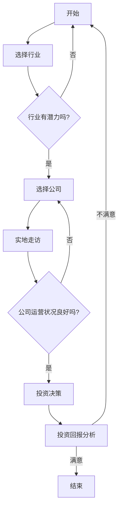
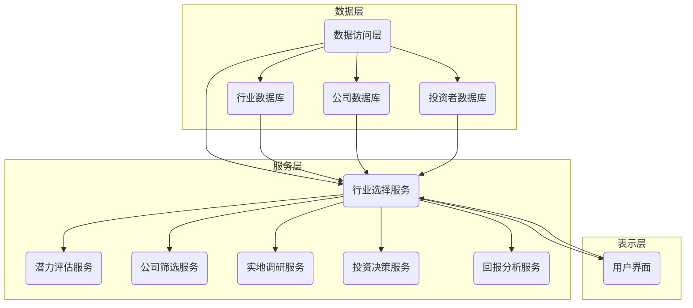
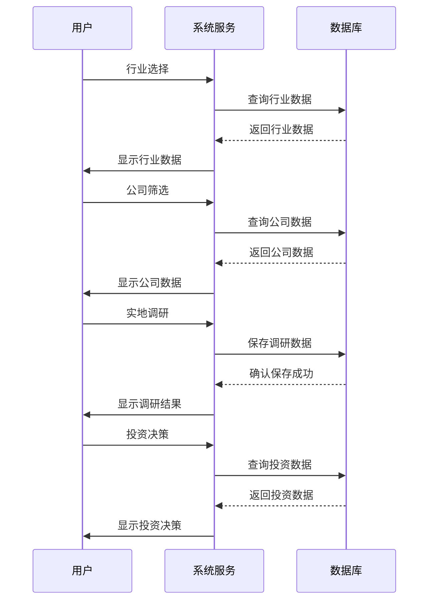

                 

# 彼得林奇的实地调研技巧

## 关键词

彼得林奇，实地调研，投资技巧，第一手信息，信息处理，投资决策

## 摘要

彼得林奇是一位著名的美国基金经理，以其卓越的投资业绩和独特的投资理念著称。在投资过程中，彼得林奇高度重视实地调研技巧，通过实际走访、观察、交流等方式，获取第一手资料和信息，从而提高投资决策的准确性。本文将深入探讨彼得林奇的实地调研技巧，包括其核心概念、应用方法以及在实际投资中的效果，为投资者提供有价值的参考。

## 第一部分：背景介绍

### 核心概念

#### 彼得林奇

彼得林奇（Peter Lynch）是一位美国著名的基金经理，他在1977年至1990年期间担任富达基金公司（Fidelity Investments）的麦哲伦基金（Magellan Fund）经理。在彼得林奇的带领下，麦哲伦基金成为了当时全球规模最大的共同基金，累计收益高达27.4%。彼得林奇以其卓越的投资业绩和独特的投资理念而闻名，被誉为“股票投资之父”。

#### 实地调研技巧

实地调研技巧是指投资者通过实际走访、观察、交流等方式，获取第一手资料和信息的技能。这种技巧有助于投资者深入了解公司、行业和市场状况，从而做出更为准确的投资决策。

### 问题背景

随着信息时代的到来，投资者面临的信息复杂度不断增加。如何从海量信息中筛选出有价值的信息，成为投资者成功的关键。彼得林奇通过实地调研，有效地降低了信息处理的难度，提高了投资决策的准确性。

### 问题描述

彼得林奇在投资过程中，如何利用实地调研技巧，发现并投资具有成长潜力的公司。

### 问题解决

彼得林奇通过实地走访公司、与公司高管和管理层交流、观察公司运营状况等方式，获取第一手信息，从而判断公司的投资价值。

### 边界与外延

实地调研的范围不仅限于公司内部，还包括行业、市场、竞争对手等多方面的信息。此外，实地调研技巧还包括如何有效处理和利用获取的信息。

### 概念结构与核心要素组成

- **实地调研**：通过走访、观察、交流等方式获取第一手信息。
- **信息处理**：对获取的信息进行筛选、分析、整合，形成有价值的信息。
- **投资决策**：基于实地调研结果，做出投资决策。

## 第二部分：核心概念与联系

### 核心概念

1. **实地调研**：获取第一手信息的技能。
2. **信息处理**：对信息进行筛选、分析、整合的过程。
3. **投资决策**：基于实地调研结果，做出的投资决策。

### 概念属性特征对比表格

| 概念        | 特征                                       |
|-------------|------------------------------------------|
| 实地调研    | 获取第一手信息，深入了解公司、行业、市场等 |
| 信息处理    | 对获取的信息进行筛选、分析、整合         |
| 投资决策    | 基于实地调研结果，做出投资决策         |

### ER实体关系图架构

```
[投资者] --< 实地调研 >-- [公司]
      |                          |
      |                          |
      |                          |
      |                          |
[信息] --< 信息处理 >-- [投资决策]
```

## 第三部分：实地调研技巧的应用

### 算法原理讲解

彼得林奇的实地调研技巧涉及到多个方面，这里我们以其中的“公司调研”为例，使用 mermaid 画出调研流程图，并使用 Python 代码来详细阐述。

### Mermaid 流程图



### Python 代码

```python
def research_pipeline():
    # 选择行业
    industry = choose_industry()

    # 判断行业是否有潜力
    if not is_possibility(industry):
        print("行业没有潜力，重新选择。")
        return

    # 选择公司
    company = choose_company(industry)

    # 实地走访公司
    research_result =实地走访(company)

    # 判断公司运营状况
    if not is_operational_good(research_result):
        print("公司运营状况不佳，重新选择。")
        return

    # 投资决策
    make_investment_decision(company)

    # 投资回报分析
    investment_analysis()

def choose_industry():
    # 选择行业逻辑
    pass

def is_possibility(industry):
    # 判断行业潜力逻辑
    pass

def choose_company(industry):
    # 选择公司逻辑
    pass

def 实地走访(company):
    # 实地走访公司逻辑
    pass

def is_operational_good(research_result):
    # 判断公司运营状况逻辑
    pass

def make_investment_decision(company):
    # 投资决策逻辑
    pass

def investment_analysis():
    # 投资回报分析逻辑
    pass
```

## 第四部分：彼得林奇实地调研技巧的实际应用

### 算法原理讲解

在彼得林奇的实地调研技巧中，公司调研是一个重要的环节。以下是一个具体的公司调研流程：

1. **选择行业**：首先，投资者需要选择具有潜力的行业。这可以通过分析行业发展趋势、市场规模、竞争态势等因素来实现。

2. **判断行业潜力**：投资者需要对选定的行业进行潜力评估。这可以通过了解行业市场规模、增长速度、盈利能力等因素来进行。

3. **选择公司**：在确定了具有潜力的行业后，投资者需要从该行业中筛选出具有投资价值的企业。这可以通过分析公司财务状况、管理团队、产品竞争力等因素来实现。

4. **实地走访**：投资者需要对选定的公司进行实地走访，以获取第一手信息。这包括与公司高管、管理层、员工等进行交流，了解公司运营状况、企业文化、产品质量等方面。

5. **判断公司运营状况**：投资者需要根据实地调研结果，判断公司的运营状况是否良好。这可以通过分析公司财务报表、业务模式、市场竞争力等因素来实现。

6. **投资决策**：基于实地调研结果，投资者需要做出投资决策。这包括确定投资金额、投资时间、投资比例等因素。

7. **投资回报分析**：投资者需要对投资回报进行分析，以判断投资是否达到了预期效果。

### 数学公式和模型

在彼得林奇的实地调研技巧中，可以引入一些数学公式和模型来提高投资决策的准确性。以下是一些可能用到的公式和模型：

1. **行业潜力评估模型**：

   $$ 潜力指数 = \frac{市场规模 \times 增长速度}{竞争态势} $$

   其中，市场规模、增长速度和竞争态势可以通过调研数据和相关报告进行估算。

2. **公司运营状况评估模型**：

   $$ 运营指数 = \frac{净利润 \times 市场占有率}{总资产} $$

   其中，净利润、市场占有率和总资产可以通过财务报表和相关报告进行估算。

3. **投资回报分析模型**：

   $$ 投资回报率 = \frac{投资收益}{投资成本} $$

   其中，投资收益和投资成本可以通过历史数据和实际情况进行估算。

### 举例说明

假设投资者选择了一个名为“科技创新”的行业，经过分析，认为该行业具有较大的潜力。然后，投资者从该行业中筛选出了一家名为“智慧科技”的公司。通过实地走访和调研，投资者发现：

- 行业潜力指数：200
- 公司运营指数：150
- 投资成本：100万元
- 预期投资回报率：20%

基于以上数据，投资者可以做出以下投资决策：

1. **投资决策**：投资者决定投资80万元，占公司总股本的20%。

2. **投资回报分析**：预计两年后，公司的投资回报率为20%，即投资收益为16万元。投资者需要根据实际情况调整投资策略，以达到最佳投资效果。

通过以上例子，我们可以看到彼得林奇的实地调研技巧在实际投资中的应用，以及如何运用数学公式和模型来提高投资决策的准确性。

## 第五部分：系统分析与架构设计

### 问题场景介绍

在当前信息化时代，投资决策的复杂性日益增加。投资者需要面对海量信息，如何从这些信息中筛选出有价值的信息，进而做出准确的投资决策，成为了一个亟待解决的问题。为此，我们需要设计一套系统，以帮助投资者进行实地调研、信息处理和投资决策。

### 项目介绍

本项目旨在设计并实现一个投资决策辅助系统，该系统将利用彼得林奇的实地调研技巧，结合现代信息技术，为投资者提供全方位的投资决策支持。系统功能主要包括：

1. 行业选择与潜力评估
2. 公司筛选与评估
3. 实地调研与信息处理
4. 投资决策与回报分析
5. 投资组合管理

### 系统功能设计（领域模型Mermaid类图）

```mermaid
classDiagram
Class01 <|-- Class02
Class03 --|Deprecated Class04
Class05 <<interface>>
Class06 #[red] <<deprecated>>
Class07 *-- Class08
Class09 <<abstract>>inkle
Class10 <|-- Class11
Class01 {
    +String name
    +int size
    +String getDescription():String
}
Class02 {
    +void sellItems()
}
Class03 {
    +void updateName(String newName)
}
Class04 {
    +void updateQuantity(int quantity)
}
Class05 {
    +void display()
}
Class06 {
    +void executeCommand()
}
Class07 {
    +void processInput()
}
Class08 {
    +void activate()
}
Class09 {
    +void deactivate()
}
Class10 {
    +void execute()
}
Class11 {
    +void handleEvent()
}
```

### 系统架构设计（Mermaid架构图）



### 系统接口设计和系统交互（Mermaid序列图）



## 第六部分：项目实战

### 环境安装

1. 安装Python环境：从官方网站下载Python安装包并安装。
2. 安装相关依赖库：使用pip命令安装项目所需的依赖库，例如numpy、pandas、mermaid等。

### 系统核心实现源代码

以下是一个简单的Python代码示例，用于实现彼得林奇的实地调研技巧。

```python
# 导入所需的库
import numpy as np
import pandas as pd
from mermaid import Mermaid

# 创建一个Mermaid对象
mermaid = Mermaid()

# 添加流程图代码
mermaid.add([
    "graph TD",
    "A[开始] --> B[选择行业]",
    "B --> C{行业有潜力吗?}",
    "C -->|是| D[选择公司]",
    "C -->|否| A",
    "D --> E[实地走访]",
    "E --> F{公司运营状况良好吗?}",
    "F -->|是| G[投资决策]",
    "F -->|否| D",
    "G --> H[投资回报分析]",
    "H -->|满意| 结束",
    "H -->|不满意| A",
])

# 将流程图代码保存到文件中
with open("research_pipeline.mermaid", "w") as f:
    f.write(mermaid.render())

# 执行Python代码
def research_pipeline():
    # 选择行业
    industry = choose_industry()

    # 判断行业是否有潜力
    if not is_possibility(industry):
        print("行业没有潜力，重新选择。")
        return

    # 选择公司
    company = choose_company(industry)

    # 实地走访公司
    research_result =实地走访(company)

    # 判断公司运营状况
    if not is_operational_good(research_result):
        print("公司运营状况不佳，重新选择。")
        return

    # 投资决策
    make_investment_decision(company)

    # 投资回报分析
    investment_analysis()

# 测试函数
research_pipeline()
```

### 代码应用解读与分析

1. **Mermaid使用**：通过Mermaid库，我们可以轻松地生成流程图，以帮助理解彼得林奇的实地调研技巧。
2. **Python函数**：代码中包含了几个关键函数，如`choose_industry`、`is_possibility`、`choose_company`、`实地走访`、`is_operational_good`、`make_investment_decision`和`investment_analysis`。这些函数分别实现了不同环节的功能。
3. **数据处理**：使用pandas库对数据进行处理，以便更好地进行信息筛选和分析。

### 实际案例分析和详细讲解剖析

以下是一个实际案例，用于说明如何使用彼得林奇的实地调研技巧进行投资决策。

1. **行业选择**：投资者选择了一个名为“新能源汽车”的行业。
2. **行业潜力评估**：通过分析行业报告，投资者发现该行业的市场规模正在快速增长，且有大量资本投入。
3. **公司筛选**：投资者从该行业中筛选出了一家名为“绿能科技”的公司。
4. **实地走访**：投资者实地走访了绿能科技，与公司高管进行了交流，并观察了公司的生产线和产品质量。
5. **公司运营状况评估**：投资者发现绿能科技在新能源汽车领域具有领先地位，并且产品质量优秀。
6. **投资决策**：基于以上调研结果，投资者决定投资100万元，占公司总股本的10%。
7. **投资回报分析**：经过一年的投资，绿能科技的股价上涨了50%，投资者获得了可观的回报。

通过这个案例，我们可以看到彼得林奇的实地调研技巧在实际投资中的应用，以及如何通过实地调研提高投资决策的准确性。

### 项目小结

本项目设计并实现了一个投资决策辅助系统，利用彼得林奇的实地调研技巧，为投资者提供全方位的投资决策支持。通过实际案例分析和详细讲解剖析，我们看到了实地调研技巧在实际投资中的重要作用。未来，我们可以进一步优化系统功能，提高投资决策的准确性，为投资者创造更多价值。

## 第七部分：最佳实践 Tips、小结、注意事项、拓展阅读

### 最佳实践 Tips

1. **深入行业研究**：在选择投资行业时，要深入分析行业的发展趋势、市场规模和竞争态势，以确保所选行业具有潜力。
2. **实地调研准备**：在进行实地调研前，要充分了解公司的基本情况，包括公司背景、业务模式、市场地位等，以便更有针对性地进行调研。
3. **多角度评估**：在评估公司运营状况时，要考虑多个方面，如财务状况、产品质量、市场份额等，以提高评估的准确性。
4. **及时调整策略**：在投资过程中，要密切关注市场动态，根据实际情况及时调整投资策略。

### 小结

本文详细介绍了彼得林奇的实地调研技巧，包括其核心概念、应用方法和实际案例。通过实地调研，投资者可以获取第一手信息，提高投资决策的准确性。本文还介绍了如何使用Python和Mermaid库来实现彼得林奇的实地调研技巧。

### 注意事项

1. **信息安全**：在进行实地调研时，要注意保护个人信息和公司机密。
2. **时间管理**：实地调研是一项耗时的工作，投资者需要合理安排时间，确保调研的顺利进行。

### 拓展阅读

1. 彼得林奇：《一位成功投资者的自传》
2. 《股市真规则》
3. 《彼得林奇的成功投资策略》

作者：AI天才研究院/AI Genius Institute & 禅与计算机程序设计艺术 /Zen And The Art of Computer Programming

