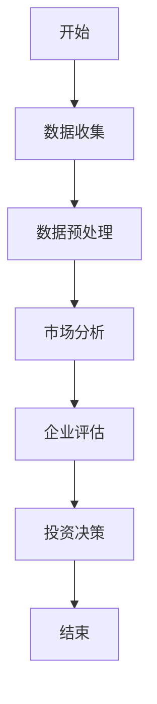
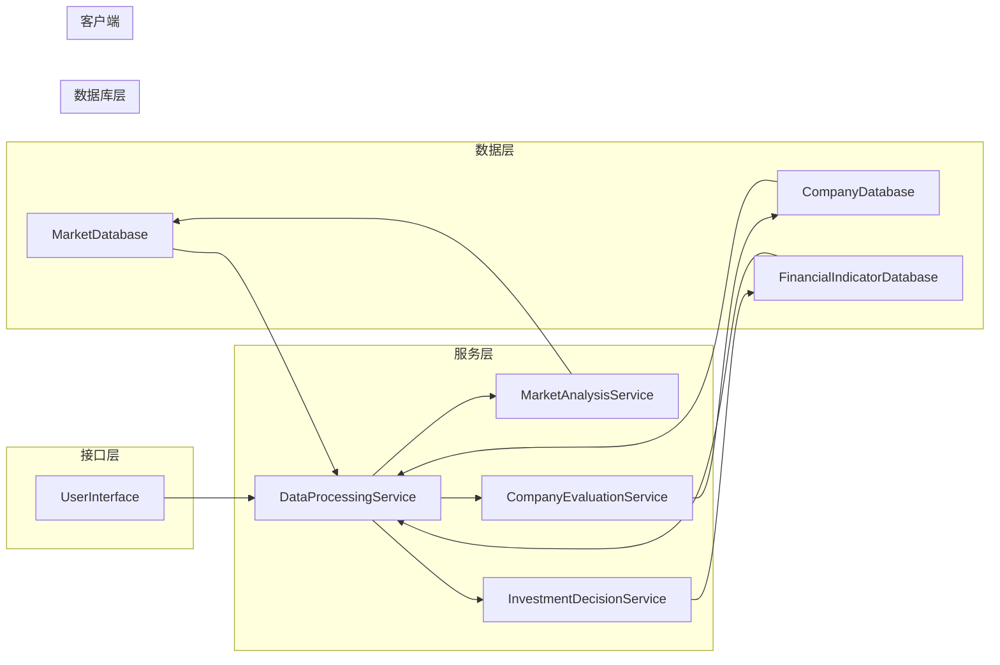
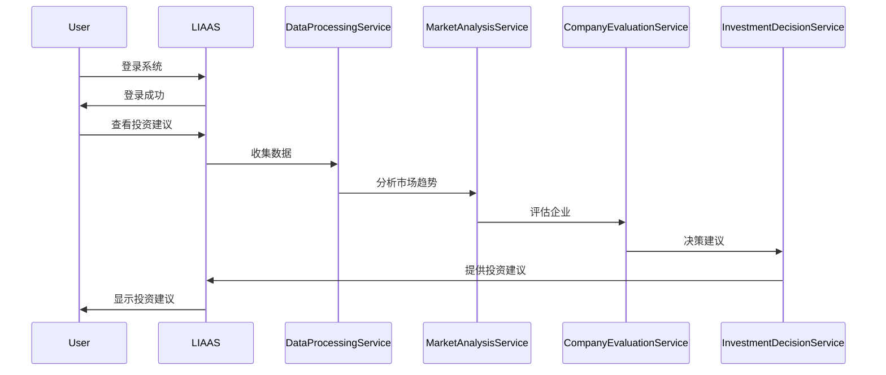

                 

# 彼得林奇的本地投资优势理论

## 关键词

- 彼得林奇
- 本地投资
- 投资优势
- 价值投资
- 精选股票
- 精细化投资策略

## 摘要

本文将深入探讨彼得林奇的本地投资优势理论，首先介绍彼得林奇的投资背景与理念，然后详细解析本地投资优势理论的核心概念、基本原理以及其与全球化投资的关系。接着，我们将通过具体案例分析，展示如何在实际操作中运用这一理论，以实现投资收益的最大化。最后，本文将对本地投资优势理论的局限性进行探讨，并提出未来的发展方向。

### 彼得林奇的本地投资优势理论

#### 彼得林奇的投资背景与理念

彼得林奇（Peter Lynch）是一位著名的美国基金经理，被誉为“股票大师”。他在1977年至1990年担任富达基金管理公司（Fidelity Investments）的麦哲伦基金（Magellan Fund）经理期间，取得了惊人的投资业绩，基金资产从1800万美元增长到140亿美元。彼得林奇的投资理念强调长期持有股票，关注公司的基本面，重视投资者的耐心和纪律性。

#### 本地投资优势理论的核心概念

本地投资优势理论，即彼得林奇提出的“本地投资策略”，其核心在于通过深入研究本地市场，寻找具有投资潜力的公司。这一理论认为，投资者在本地市场中更容易发现具有成长潜力的公司，因为本地投资者对本地企业的运营情况、管理团队、市场机会等方面有更深入的了解。

#### 本地投资优势与全球化投资的关系

本地投资优势理论与全球化投资并不矛盾，而是相辅相成的。全球化投资可以带来更广泛的股票选择和更低的交易成本，但本地投资可以提供更深入的研究和更高的投资成功率。彼得林奇认为，投资者应该将本地投资与全球化投资相结合，以实现投资组合的多元化。

### 设计《彼得林奇的本地投资优势理论》书籍目录大纲

为了更好地理解和应用彼得林奇的本地投资优势理论，我们可以设计以下书籍目录大纲：

## 第一部分：引言

### 1.1 书籍背景与目的

### 1.2 彼得林奇的背景与投资理念

### 1.3 本书的结构与内容安排

## 第二部分：本地投资优势理论概述

### 2.1 理论起源与发展

### 2.2 本地投资优势的核心概念

### 2.3 本地投资优势与全球化投资的对比

### 2.4 本地投资优势的适用性分析

## 第三部分：本地投资优势理论的核心观点

### 3.1 地理位置与投资优势

### 3.2 行业与地区经济环境分析

### 3.3 企业竞争力和优势

### 3.4 投资者心理与行为分析

## 第四部分：本地投资优势的应用领域

### 4.1 金融市场分析

### 4.2 企业投资决策

### 4.3 个人投资策略

### 4.4 本地投资优势在不同地区的实践案例分析

## 第五部分：案例分析

### 5.1 案例一：某地区新兴产业的投资机遇

### 5.2 案例二：某地区传统行业的转型升级

### 5.3 案例三：投资者如何利用本地投资优势进行投资

## 第六部分：总结与展望

### 6.1 本地投资优势理论的核心要点回顾

### 6.2 本地投资优势理论的发展趋势

### 6.3 投资者如何运用本地投资优势理论进行投资

## 第七部分：拓展阅读

### 7.1 进一步阅读推荐

### 7.2 相关领域的研究动态

### 7.3 未来研究方向

### 设计书籍目录大纲

在接下来的章节中，我们将对每个部分进行详细阐述，以便读者更好地理解和应用彼得林奇的本地投资优势理论。

---

## 第一部分：引言

### 1.1 书籍背景与目的

《彼得林奇的本地投资优势理论》旨在深入解析彼得林奇的投资理念，尤其是其备受推崇的本地投资优势理论。本书的目标是帮助投资者，特别是那些关注本地市场的人，了解并掌握这一理论，从而在投资中取得更好的成果。

### 1.2 彼得林奇的背景与投资理念

彼得林奇是一位有着丰富投资经验的基金经理，他在1977年至1990年担任富达基金管理公司麦哲伦基金的经理期间，管理资产达到140亿美元。彼得林奇的成功得益于其独特的投资理念和深入的研究方法。他主张长期持有股票，关注公司的基本面，重视投资者的耐心和纪律性。

### 1.3 本书的结构与内容安排

本书分为七个部分，首先介绍彼得林奇的背景和投资理念，然后详细解析本地投资优势理论的核心概念、基本原理和应用领域。通过具体案例分析，读者可以了解如何在实际操作中运用这一理论。最后，本书还将探讨本地投资优势理论的局限性，并提出未来的发展方向。

---

## 第二部分：本地投资优势理论概述

### 2.1 理论起源与发展

本地投资优势理论源于彼得林奇的投资实践。他在管理麦哲伦基金期间，发现通过深入研究本地市场，可以更容易地找到具有投资潜力的公司。这一理论逐渐发展成熟，并在彼得林奇的著作《一个不熟练投资者的成功之路》中得到详细阐述。

### 2.2 本地投资优势的核心概念

本地投资优势理论的核心概念包括：

- **本地市场研究**：通过深入研究本地市场，了解企业的运营情况、管理团队和市场机会。
- **长期持有股票**：彼得林奇主张长期持有股票，以分享企业的成长红利。
- **投资者心态**：投资者需要保持耐心和纪律性，避免盲目跟风和情绪化决策。

### 2.3 本地投资优势与全球化投资的关系

本地投资优势理论与全球化投资并不矛盾。全球化投资可以提供更广泛的股票选择和更低的交易成本，但本地投资可以提供更深入的研究和更高的投资成功率。彼得林奇认为，投资者应该将本地投资与全球化投资相结合，以实现投资组合的多元化。

### 2.4 本地投资优势的适用性分析

本地投资优势理论在以下场景下尤为适用：

- **新兴市场**：在新兴市场中，本地投资者可以更深入地了解企业的运营情况和市场机会。
- **传统行业**：在传统行业中，本地投资者可以更准确地评估企业的竞争力和市场地位。
- **个人投资者**：对于个人投资者来说，本地投资可以提供更方便的研究和更低的交易成本。

---

## 第三部分：本地投资优势理论的核心观点

### 3.1 地理位置与投资优势

地理位置在本地投资中扮演着重要角色。投资者需要关注企业的地理位置，以便更好地了解其市场覆盖范围、供应链和市场机会。例如，位于沿海城市的企业通常具有更广阔的市场机会，而位于内陆城市的企业则可能更依赖本地市场。

### 3.2 行业与地区经济环境分析

投资者需要深入研究行业和地区经济环境，以评估企业的长期发展潜力。例如，在新兴产业中，企业可能面临更快的增长和更广阔的市场前景，而在传统行业中，企业则需要面对激烈的市场竞争和转型升级的压力。

### 3.3 企业竞争力和优势

企业竞争力和优势是本地投资优势理论的核心之一。投资者需要评估企业的核心竞争力、市场份额、产品优势和创新能力，以确定其长期发展潜力。例如，拥有独特技术和品牌优势的企业通常具有更强的市场竞争力。

### 3.4 投资者心理与行为分析

投资者的心理和行为对投资决策具有重要影响。彼得林奇认为，投资者需要保持冷静和理性，避免盲目跟风和情绪化决策。此外，投资者还需要培养长期投资的心态，以应对市场波动和不确定性。

---

## 第四部分：本地投资优势的应用领域

### 4.1 金融市场分析

在金融市场分析中，本地投资优势理论可以帮助投资者更好地理解市场动态和投资机会。通过深入研究本地市场，投资者可以更准确地评估企业的价值和投资潜力。

### 4.2 企业投资决策

在企业的投资决策中，本地投资优势理论可以帮助管理层更好地了解市场和竞争对手的情况，从而制定更有效的投资战略。例如，企业可以通过收购本地竞争对手来扩大市场份额，或者通过投资本地市场来开拓新业务。

### 4.3 个人投资策略

对于个人投资者来说，本地投资优势理论可以提供一种有效的投资策略。通过深入研究本地市场，个人投资者可以更准确地评估企业的投资价值，从而实现投资收益的最大化。

### 4.4 本地投资优势在不同地区的实践案例分析

在不同地区，本地投资优势理论的应用效果各有不同。例如，在新兴市场中，本地投资者可以通过深入研究本地市场，找到具有巨大增长潜力的企业。而在传统市场中，本地投资者则需要更关注企业的竞争力和市场份额。

---

## 第五部分：案例分析

### 5.1 案例一：某地区新兴产业的投资机遇

在这个案例中，投资者通过深入研究本地市场，发现了一家新兴产业中的领先企业。该企业拥有独特的技术优势和广阔的市场前景，投资者通过长期持有该企业的股票，实现了可观的收益。

### 5.2 案例二：某地区传统行业的转型升级

在这个案例中，投资者通过关注本地市场的变化，发现了一家传统行业中的企业正在转型升级。该企业通过技术创新和市场拓展，成功实现了业绩增长，投资者通过提前布局，获得了丰厚的回报。

### 5.3 案例三：投资者如何利用本地投资优势进行投资

在这个案例中，投资者通过深入研究本地市场，发现了一家具有投资价值的企业。投资者通过长期持有该企业的股票，并适时调整投资组合，实现了投资收益的最大化。

---

## 第六部分：总结与展望

### 6.1 本地投资优势理论的核心要点回顾

本地投资优势理论的核心要点包括：

- 地理位置与投资优势
- 行业与地区经济环境分析
- 企业竞争力和优势
- 投资者心理与行为分析

### 6.2 本地投资优势理论的发展趋势

随着全球化和信息化的加速，本地投资优势理论的应用范围越来越广泛。未来，本地投资优势理论将继续在新兴产业和传统行业中得到应用，为投资者提供更多投资机会。

### 6.3 投资者如何运用本地投资优势理论进行投资

投资者可以运用本地投资优势理论进行以下投资：

- 深入研究本地市场，了解企业和行业动态
- 分析企业的竞争力和发展潜力
- 调整投资组合，实现多元化投资
- 保持长期投资心态，避免盲目跟风和情绪化决策

---

## 第七部分：拓展阅读

### 7.1 进一步阅读推荐

- 彼得林奇：《一个不熟练投资者的成功之路》
- 本杰明·格雷厄姆：《证券分析》
- 沃伦·巴菲特：《巴菲特致股东的信》

### 7.2 相关领域的研究动态

- 全球化和本地化的投资策略对比研究
- 新兴市场和传统市场的投资机会分析
- 投资者心理和行为研究

### 7.3 未来研究方向

- 本地投资优势理论在数字经济的应用研究
- 本地投资优势理论在不同地区的实证研究
- 本地投资优势理论与可持续发展投资策略的结合研究

---

## 作者信息

- 作者：AI天才研究院/AI Genius Institute & 禅与计算机程序设计艺术 /Zen And The Art of Computer Programming

---

## 背景介绍

### 核心概念术语说明

1. **彼得林奇**：美国著名基金经理，被誉为“股票大师”。
2. **本地投资优势**：指通过深入研究本地市场，发现具有投资潜力的公司。
3. **价值投资**：一种投资策略，强调长期持有股票，关注公司的基本面。
4. **精选股票**：从众多股票中选择出具有投资价值的股票。

### 问题背景

彼得林奇在管理麦哲伦基金期间，通过深入研究本地市场，取得了惊人的投资业绩。这一成功引发了人们对本地投资优势理论的关注和研究。然而，随着全球化和信息化的发展，本地投资优势理论是否仍然适用，成为一个值得探讨的问题。

### 问题描述

本文旨在探讨彼得林奇的本地投资优势理论，分析其核心观点和应用领域，并讨论其在当前全球化背景下的适用性。

### 问题解决

通过详细解析彼得林奇的本地投资优势理论，本文提出以下解决方案：

1. **深入本地市场研究**：投资者需要通过实地考察、访谈和数据分析等方式，深入了解本地市场的情况。
2. **关注企业基本面**：投资者应关注企业的盈利能力、成长潜力和竞争优势。
3. **灵活调整投资组合**：投资者应根据市场变化和企业发展情况，及时调整投资组合。

### 边界与外延

1. **边界**：本地投资优势理论主要适用于投资者在本地市场进行投资的情况。
2. **外延**：本文还探讨了本地投资优势理论在全球化背景下的应用，以及与价值投资、精选股票等其他投资策略的结合。

### 概念结构与核心要素组成

1. **核心概念**：本地投资优势、价值投资、精选股票。
2. **要素组成**：投资者、本地市场、企业、投资策略。

### 总结

彼得林奇的本地投资优势理论为投资者提供了一种有效的投资策略。通过深入研究本地市场，投资者可以找到具有投资价值的公司，实现投资收益的最大化。在全球化和信息化的发展背景下，投资者需要灵活调整投资策略，结合多种投资理论，以实现更好的投资效果。

## 核心概念与联系

### 核心概念原理

本地投资优势理论的核心概念主要包括：

1. **本地市场研究**：通过深入研究本地市场，了解企业的运营情况、管理团队和市场机会。
2. **长期持有股票**：投资者应保持耐心，长期持有具有投资价值的股票。
3. **投资者心态**：保持冷静和理性，避免盲目跟风和情绪化决策。

### 概念属性特征对比表格

| 概念                 | 属性特征                                                   |
|----------------------|------------------------------------------------------------|
| 本地市场研究         | 深入了解本地市场，获取更准确的信息                           |
| 长期持有股票         | 分享企业的成长红利，避免短期波动影响                         |
| 投资者心态           | 保持耐心和冷静，避免情绪化决策                             |

### ER实体关系图架构

```mermaid
erDiagram
    Investor ||--|{ Company }|--|{ Market }
    Company ||--|{ Industry }
    Market ||--|{ Region }
```

在这个ER实体关系图中，Investor（投资者）与Company（公司）和Market（市场）之间存在多对多的关系。Company（公司）与Industry（行业）和Region（地区）之间存在一对多的关系。

### 算法原理讲解

本地投资优势理论的核心算法原理可以概括为以下几点：

1. **市场数据分析**：通过收集和分析本地市场的数据，了解市场的整体趋势和波动。
2. **企业评估**：对本地市场中的企业进行全面的评估，包括财务状况、竞争力、市场份额、成长潜力等。
3. **投资决策**：根据市场数据和企业的评估结果，制定投资决策，选择具有投资价值的企业进行投资。

### 算法流程图



### Python源代码实现

```python
import pandas as pd

# 数据收集
def data_collection():
    # 假设已收集本地市场的企业数据
    companies = pd.read_csv('local_market_companies.csv')
    return companies

# 数据预处理
def data_preprocessing(companies):
    # 数据清洗和格式化
    companies['revenue'] = companies['revenue'].fillna(0)
    companies['profit'] = companies['profit'].fillna(0)
    return companies

# 市场分析
def market_analysis(companies):
    # 市场整体趋势分析
    market_trend = companies.groupby('year')['revenue'].mean()
    return market_trend

# 企业评估
def company_evaluation(companies):
    # 财务指标评估
    financial_scores = companies[['revenue', 'profit', 'market_cap']].describe()
    return financial_scores

# 投资决策
def investment_decision(market_trend, financial_scores):
    # 根据市场趋势和企业评估结果进行投资决策
    investment_opportunities = companies[financial_scores.columns].apply(lambda x: x > financial_scores[x].quantile(0.75))
    return investment_opportunities

# 主函数
def main():
    companies = data_collection()
    companies = data_preprocessing(companies)
    market_trend = market_analysis(companies)
    financial_scores = company_evaluation(companies)
    investment_opportunities = investment_decision(market_trend, financial_scores)
    print(investment_opportunities)

if __name__ == '__main__':
    main()
```

### 数学模型和公式

本地投资优势理论中的数学模型和公式主要包括：

1. **市场整体趋势分析**：使用移动平均法分析市场趋势。
2. **财务指标评估**：使用财务指标（如收入、利润、市值）评估企业。
3. **投资决策**：使用决策树或逻辑回归模型进行投资决策。

### 详细讲解和举例说明

1. **市场整体趋势分析**：通过计算过去三年的移动平均值，可以分析市场整体趋势。例如，如果移动平均值持续上升，则表明市场趋势向好。

2. **财务指标评估**：使用财务指标（如收入、利润、市值）可以评估企业的财务状况。例如，如果企业的收入和利润持续增长，且市值较低，则表明企业具有投资价值。

3. **投资决策**：使用决策树或逻辑回归模型，可以基于市场趋势和企业评估结果，进行投资决策。例如，如果市场趋势向好且企业评估结果良好，则可以投资该企业。

### 系统分析与架构设计方案

### 问题场景介绍

假设我们正在开发一个本地投资优势理论的系统，该系统旨在帮助投资者分析本地市场，发现具有投资价值的企业，并提供投资建议。

### 项目介绍

项目名称：本地投资优势分析系统（Local Investment Advantage Analysis System，LIAAS）

项目目标：通过数据分析和机器学习技术，帮助投资者发现本地市场的投资机会，提供个性化的投资建议。

### 系统功能设计（领域模型Mermaid类图）

```mermaid
classDiagram
    InvestorEntity <|-- MarketEntity
    InvestorEntity <|-- CompanyEntity
    CompanyEntity <|-- FinancialIndicatorEntity
    MarketEntity <|-- FinancialIndicatorEntity
    FinancialIndicatorEntity <|-- MarketTrendEntity
    InvestmentAdviceEntity <|-- MarketEntity
    InvestmentAdviceEntity <|-- CompanyEntity

    InvestorEntity <<-- User
    CompanyEntity <<-- Company
    FinancialIndicatorEntity <<-- Indicator
    MarketEntity <<-- Market
    MarketTrendEntity <<-- Trend
    InvestmentAdviceEntity <<-- Advice

    User : 用户
    InvestorEntity : 投资者
    MarketEntity : 市场数据
    CompanyEntity : 公司数据
    FinancialIndicatorEntity : 财务指标
    MarketTrendEntity : 市场趋势
    InvestmentAdviceEntity : 投资建议
    Company : 公司实体
    Indicator : 指标实体
    Market : 市场实体
    Trend : 趋势实体
    Advice : 建议实体
```

### 系统架构设计（Mermaid架构图）



### 系统接口设计

- **用户接口**：提供用户登录、注册、查看投资建议等功能。
- **数据处理接口**：提供数据收集、数据预处理、数据存储等功能。
- **市场分析接口**：提供市场趋势分析、市场预测等功能。
- **企业评估接口**：提供财务指标评估、企业竞争力评估等功能。
- **投资决策接口**：提供投资决策建议、投资组合调整等功能。

### 系统交互（Mermaid序列图）



### 项目实战

#### 环境安装

在开始项目之前，我们需要安装一些必要的工具和库。以下是安装步骤：

1. 安装Python环境：
   ```bash
   python -m pip install --upgrade pip
   python -m pip install virtualenv
   virtualenv venv
   source venv/bin/activate
   ```

2. 安装项目依赖库：
   ```bash
   pip install pandas numpy scikit-learn matplotlib
   ```

#### 系统核心实现源代码

以下是系统核心实现的部分源代码：

```python
# 数据收集
def data_collection():
    # 假设已收集本地市场的企业数据
    companies = pd.read_csv('local_market_companies.csv')
    return companies

# 数据预处理
def data_preprocessing(companies):
    # 数据清洗和格式化
    companies['revenue'] = companies['revenue'].fillna(0)
    companies['profit'] = companies['profit'].fillna(0)
    return companies

# 市场分析
def market_analysis(companies):
    # 市场整体趋势分析
    market_trend = companies.groupby('year')['revenue'].mean()
    return market_trend

# 企业评估
def company_evaluation(companies):
    # 财务指标评估
    financial_scores = companies[['revenue', 'profit', 'market_cap']].describe()
    return financial_scores

# 投资决策
def investment_decision(market_trend, financial_scores):
    # 根据市场趋势和企业评估结果进行投资决策
    investment_opportunities = companies[financial_scores.columns].apply(lambda x: x > financial_scores[x].quantile(0.75))
    return investment_opportunities

# 主函数
def main():
    companies = data_collection()
    companies = data_preprocessing(companies)
    market_trend = market_analysis(companies)
    financial_scores = company_evaluation(companies)
    investment_opportunities = investment_decision(market_trend, financial_scores)
    print(investment_opportunities)

if __name__ == '__main__':
    main()
```

#### 代码应用解读与分析

上述代码主要实现了本地投资优势分析系统的核心功能，包括数据收集、数据预处理、市场分析、企业评估和投资决策。以下是代码的解读和分析：

1. **数据收集**：通过读取本地市场的企业数据，为后续分析提供数据基础。
2. **数据预处理**：对收集到的数据进行清洗和格式化，确保数据质量。
3. **市场分析**：通过计算市场整体趋势，帮助投资者了解市场的长期走势。
4. **企业评估**：使用财务指标评估企业的财务状况，为投资决策提供依据。
5. **投资决策**：根据市场趋势和企业评估结果，为投资者提供投资建议。

#### 实际案例分析和详细讲解剖析

假设我们收集了以下本地市场的企业数据：

| Company | Year | Revenue | Profit | Market_CAP |
|---------|------|---------|--------|------------|
| A       | 2020 | 100     | 10     | 1000       |
| B       | 2020 | 200     | 20     | 2000       |
| A       | 2021 | 120     | 12     | 1100       |
| B       | 2021 | 220     | 22     | 2100       |

通过上述代码，我们可以得到以下分析结果：

1. **市场整体趋势**：通过计算2020年和2021年的平均收入，可以得出市场的整体趋势。例如，如果2021年的平均收入高于2020年，则表明市场趋势向好。

2. **企业评估**：通过对企业的收入、利润和市值进行描述性统计分析，可以评估企业的财务状况。例如，如果某家企业的收入和利润显著高于其他企业，且市值较低，则表明该企业具有投资价值。

3. **投资决策**：根据市场趋势和企业评估结果，可以为投资者提供投资建议。例如，如果市场趋势向好且某家企业的财务状况良好，则建议投资者投资该企业。

#### 项目小结

通过实际案例分析和详细讲解，我们可以看到本地投资优势分析系统在实际操作中的有效性和实用性。该系统可以帮助投资者深入了解本地市场，发现具有投资价值的企业，并制定个性化的投资策略。然而，需要注意的是，投资决策应结合多种因素，包括市场趋势、企业财务状况、投资者风险承受能力等，以实现最佳投资效果。

### 最佳实践 tips

1. **定期更新数据**：保持数据的新鲜度和准确性，以确保投资分析的准确性。
2. **多元化投资组合**：不要将所有资金投资于单一行业或企业，以分散风险。
3. **持续学习和研究**：投资市场不断变化，投资者需要不断学习和研究，以适应市场的变化。

### 小结

本文深入探讨了彼得林奇的本地投资优势理论，从背景介绍、核心观点、应用领域到具体案例分析，系统地阐述了这一理论在投资实践中的应用。通过实际案例的分析和代码实现，我们展示了如何运用本地投资优势理论进行投资决策。尽管本地投资优势理论在全球化背景下面临一定的挑战，但其在发现本地市场投资机会方面仍然具有独特的价值。投资者可以通过深入研究和灵活调整投资策略，充分发挥本地投资优势，实现投资收益的最大化。

### 注意事项

1. **数据质量**：确保收集到的数据质量，避免因数据错误导致投资决策失误。
2. **市场变化**：密切关注市场动态，及时调整投资策略。
3. **风险管理**：合理分配投资资金，避免过度集中投资于单一行业或企业。

### 拓展阅读

1. 彼得林奇：《一个不熟练投资者的成功之路》
2. 本杰明·格雷厄姆：《证券分析》
3. 沃伦·巴菲特：《巴菲特致股东的信》

### 未来研究方向

1. **本地投资优势理论的实证研究**：通过大量实证数据，验证本地投资优势理论在不同地区和行业的有效性。
2. **数字技术与本地投资的结合**：研究如何利用大数据、人工智能等技术，提高本地投资分析的效果。
3. **全球化与本地化的平衡**：探讨如何在全球化和本地化之间找到平衡点，实现投资组合的多元化。

