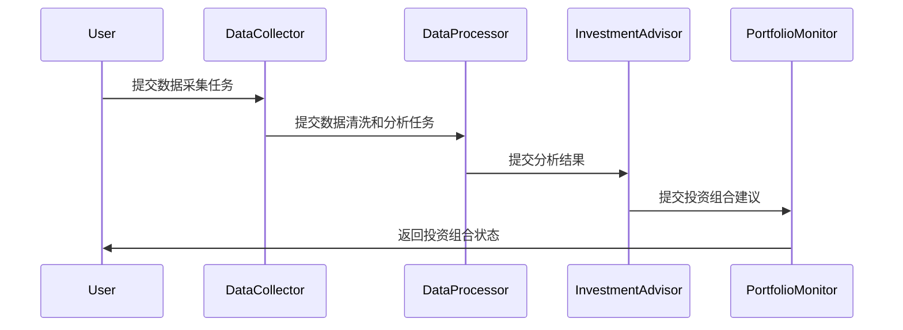
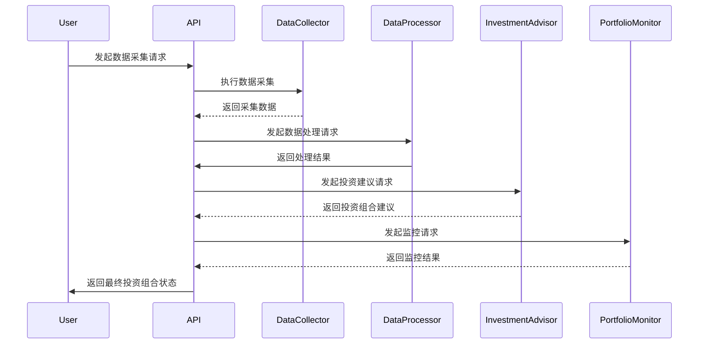

                 

### Introduction

#### 1.1 Introduction to Peter Lynch

Peter Lynch is widely regarded as one of the most successful investors in the history of Wall Street. With a career spanning over two decades at Fidelity Investments, Lynch managed the Fidelity Magellan Fund from 1977 to 1990. During his tenure, the fund consistently outperformed the market, achieving an annual return of 29.2%, compared to the S&P 500's 19.5% over the same period. Lynch's investment strategy was not just about identifying individual stocks but also understanding the broader market trends and industry cycles. His ability to adapt and pivot between different industries based on market conditions became a hallmark of his success.

#### 1.2 The Concept of Industry Rotation

Industry rotation is an investment strategy that involves shifting investments from one industry to another based on anticipated changes in the economic environment. The idea is that as the economy evolves, certain industries tend to outperform while others lag. By identifying these trends and reallocating assets accordingly, investors can potentially achieve superior returns. This strategy requires a deep understanding of industry cycles, economic indicators, and the ability to anticipate shifts in market conditions.

#### 1.3 The Importance of Industry Rotation Strategy

The industry rotation strategy is crucial for several reasons. Firstly, it allows investors to capitalize on the cyclical nature of the economy, where different sectors experience peaks and valleys over time. By focusing on industries that are likely to benefit from economic growth, investors can potentially enhance their returns. Secondly, it provides a mechanism for risk management by diversifying investments across different sectors. This can help mitigate the impact of downturns in specific industries. Lastly, the strategy encourages active management of the portfolio, ensuring that investments are aligned with the current market environment.

#### 1.4 The Scope and Application of This Book

This book aims to delve into the intricacies of Peter Lynch's industry rotation strategy, providing readers with a comprehensive guide to implementing this approach in their own investment portfolios. The book is divided into several chapters, each focusing on a different aspect of the strategy. From understanding the nature of industry cycles and Peter Lynch's investment philosophy to practical tips and case studies, the book covers all the essential elements required for successful industry rotation. Whether you are a novice investor or a seasoned professional, this book will equip you with the knowledge and tools to navigate the ever-changing landscape of the stock market.

### Background of Industry Rotation Strategy

#### 2.1 Definition and Characteristics

Industry rotation, as an investment strategy, involves shifting investments from one industry to another based on anticipated changes in economic conditions. This strategy is rooted in the recognition that different industries experience varying levels of growth and profitability depending on the economic cycle. For instance, during a period of economic expansion, industries such as technology, consumer discretionary, and financial services tend to thrive, while during a downturn, sectors like utilities and consumer staples may offer more stability. The essence of industry rotation is to identify these cyclical shifts and reallocate assets accordingly to maximize returns.

#### 2.2 Factors Influencing Industry Cycles

Several key factors influence industry cycles, making them dynamic and unpredictable. Economic indicators such as GDP growth, unemployment rates, inflation, and interest rates play a significant role. These indicators can provide insights into the overall health of the economy and help predict which industries are likely to perform well in the future. Additionally, technological advancements, regulatory changes, and geopolitical events can also impact specific industries. For example, the rise of the internet revolutionized the technology sector, while changes in healthcare policies can greatly influence the healthcare industry.

#### 2.3 Economic Indicators for Industry Analysis

To effectively implement an industry rotation strategy, investors need to be adept at analyzing economic indicators. Key indicators include:

- **GDP Growth**: Gross Domestic Product (GDP) growth is a primary measure of a country's economic health. A high GDP growth rate typically indicates a strong economy, which can benefit industries such as manufacturing, technology, and consumer goods.

- **Unemployment Rates**: Low unemployment rates often signal a robust labor market, which can positively impact consumer spending and industries such as retail and hospitality.

- **Inflation**: Inflation rates affect the cost of goods and services and can influence consumer purchasing power. High inflation can benefit industries such as commodities and utilities.

- **Interest Rates**: Central bank policies, particularly interest rates, can impact borrowing costs and investment returns. Lower interest rates can encourage spending and investment, benefiting sectors like real estate and consumer durables.

By monitoring these indicators and their interrelationships, investors can gain a better understanding of how economic conditions impact various industries. This knowledge is crucial for making informed investment decisions and executing a successful industry rotation strategy.

### Peter Lynch's Investment Philosophy

#### 3.1 The Importance of Research

At the core of Peter Lynch's investment philosophy is the belief in the power of thorough research. Lynch famously stated, "Investing without research is like playing poker and not looking at the cards." This emphasis on research is rooted in his belief that understanding the underlying fundamentals of a company and its industry is crucial for making successful investment decisions. Lynch would spend countless hours reading annual reports, studying financial statements, and researching industry trends. His approach was to "invest in what you know," focusing on companies and industries that he had a deep understanding of.

#### 3.2 Identifying Growth Stocks

Lynch was a master at identifying growth stocks—companies that are expected to grow at a rate significantly higher than the overall market. He believed that the key to identifying growth stocks was to look for companies with strong management teams, innovative products or services, and a sustainable competitive advantage. Lynch's approach was not to chase after the latest hot stock but to focus on companies with solid fundamentals that were often overlooked by the market. He would often invest in small and medium-sized companies, as he believed that they had the most potential for growth.

#### 3.3 The Role of Market Conditions

Another crucial aspect of Lynch's investment philosophy was his ability to adapt to changing market conditions. Lynch was not a buy-and-hold investor; instead, he recognized that the market is cyclical, and different industries go through periods of outperformance and underperformance. He believed in shifting his investments based on the economic environment. For example, during a recession, Lynch would move his investments into more defensive sectors such as consumer staples and utilities. Conversely, during a booming economy, he would allocate more of his portfolio to cyclical industries such as technology and consumer discretionary.

#### 3.4 The Process of Industry Rotation

Lynch's industry rotation process was a meticulous and data-driven approach. Here's a step-by-step breakdown of his methodology:

1. **Economic Analysis**: Lynch began by analyzing the overall economic conditions. He would look at key indicators such as GDP growth, interest rates, inflation, and unemployment rates to understand the current state of the economy and anticipate future trends.

2. **Industry Identification**: Based on his economic analysis, Lynch would identify industries that were poised to benefit from the current or anticipated economic conditions. He would then research these industries in detail, looking at factors such as market size, growth potential, competitive landscape, and regulatory environment.

3. **Stock Selection**: Within the identified industries, Lynch would select individual stocks to invest in. He would look for companies with strong management, innovative products, and a competitive edge. Lynch believed in a value approach but with a twist—he would invest in companies that were undervalued by the market, not just by financial metrics but by investors' perception.

4. **Portfolio Construction**: Lynch's portfolio was diversified across multiple industries, which helped mitigate risks. He believed in the importance of maintaining a balanced portfolio that could adapt to changing market conditions.

5. **Monitoring and Rebalancing**: Lynch would continually monitor his portfolio, making adjustments as needed. He was not afraid to shift investments when new information or changes in market conditions warranted it. This active management approach was a hallmark of his investment strategy.

6. **Patient Holding**: Lynch was known for his long-term approach to investing. He believed in holding stocks for the long term, allowing them to grow and benefit from the company's growth and the eventual market recognition of their value.

Lynch's industry rotation strategy was not just about picking winning stocks; it was about understanding the broader economic environment and adapting to it. This strategic flexibility was a key factor in his ability to consistently outperform the market. By combining deep research, a focus on growth stocks, and the ability to adapt to changing market conditions, Lynch's investment philosophy provided a robust framework for industry rotation.

### Analyzing Industries

#### 4.1 Collecting Industry Data

The first step in implementing an industry rotation strategy is to collect comprehensive industry data. This data serves as the foundation for understanding the current state of each industry and predicting future trends. Key sources of industry data include:

- **Market Research Reports**: Companies like Gartner, McKinsey, and Deloitte publish detailed industry reports that provide insights into market size, growth rates, and key trends. These reports can be particularly useful for identifying emerging sectors and understanding the competitive landscape.

- **Government Agencies**: Data from government agencies such as the US Bureau of Labor Statistics, the World Bank, and the International Monetary Fund can provide valuable economic indicators and industry-specific statistics. These sources are especially useful for analyzing macroeconomic factors that impact industries.

- **Financial Statements**: Analyzing the financial statements of companies within a specific industry can offer insights into their financial health, growth potential, and market positioning. Key financial metrics to consider include revenue growth, profit margins, debt levels, and return on equity.

- **News and Media**: Keeping abreast of industry news, press releases, and media reports can help identify recent developments and potential disruptions that may impact the industry. This includes mergers and acquisitions, regulatory changes, technological advancements, and geopolitical events.

- **Industry Associations**: Professional associations and trade groups often publish research and reports on industry trends and forecasts. These organizations can be valuable resources for obtaining industry-specific data and insights.

#### 4.2 Analyzing Financial Statements

Analyzing financial statements is a critical component of industry analysis. It involves examining a company's balance sheet, income statement, and cash flow statement to assess its financial health and performance. Here are some key metrics and methods to consider when analyzing financial statements:

- **Revenue Growth**: Look at the company's revenue growth over the past few years. A consistent upward trend may indicate strong market demand and potential for future growth.

- **Profit Margins**: Evaluate the company's gross profit margin, operating margin, and net profit margin. High profit margins typically indicate efficient operations and strong pricing power.

- **Debt Levels**: Assess the company's debt-to-equity ratio and interest coverage ratio to understand its financial leverage and ability to handle debt.

- **Return on Equity (ROE)**: ROE measures a company's profitability by indicating how much profit it generates with the money shareholders have invested. A high ROE is often seen as a positive indicator.

- **Cash Flow**: Analyze the company's cash flow statement to understand its operating cash flow, free cash flow, and capital expenditures. Positive cash flow is a sign of financial health and indicates that the company has sufficient liquidity to invest in growth opportunities.

- **Earnings Quality**: Evaluate the quality of a company's earnings by looking at metrics such as earnings before interest, taxes, depreciation, and amortization (EBITDA) and normalized earnings. Companies with consistent and predictable earnings are often more reliable investments.

#### 4.3 Evaluating Industry Trends

Evaluating industry trends is crucial for understanding the direction in which an industry is heading and identifying potential opportunities and risks. Here are some key methods for evaluating industry trends:

- **Market Research**: Conduct market research to understand the current size and growth rate of the industry. Look for trends such as increasing consumer demand, technological advancements, and changes in regulatory environments.

- **Customer Surveys**: Conduct surveys to gather insights from industry customers about their preferences, satisfaction levels, and future needs. This can help identify emerging trends and potential market opportunities.

- **Competitive Analysis**: Analyze the competitive landscape to understand the positioning of key players in the industry. Look for trends such as market concentration, new entrants, and strategic shifts by competitors.

- **Patent Analysis**: Examine patent filings and granted patents in the industry to identify technological innovations and potential disruptions. Industries with high levels of patent activity often indicate rapid innovation and growth potential.

- **Macroeconomic Factors**: Consider macroeconomic factors that can impact the industry, such as GDP growth, inflation, interest rates, and demographic trends. These factors can influence consumer spending patterns and industry demand.

By combining data from various sources and employing these analysis methods, investors can develop a comprehensive understanding of industry trends. This insight is essential for making informed investment decisions and identifying sectors that are likely to experience growth and profitability in the future.

#### 4.4 Identifying Industry Leaders

Identifying industry leaders is a critical step in implementing an industry rotation strategy. These leaders not only tend to outperform their peers but also offer the potential for significant returns. Here's a step-by-step approach to identifying industry leaders:

1. **Market Share Analysis**: Start by analyzing the market share of companies within the industry. Companies with a significant market share often have strong competitive positions and can command higher prices. Look for companies with a market share of over 20%, as these are typically the dominant players.

2. **Financial Performance**: Evaluate the financial performance of companies by examining key financial metrics such as revenue growth, profit margins, return on equity (ROE), and earnings per share (EPS). Companies with consistent growth in revenue and profits are often good indicators of industry leadership.

3. **Innovation and R&D**: Look for companies that invest heavily in research and development (R&D). Companies with a strong focus on innovation are more likely to introduce new products and services, maintain a competitive edge, and sustain long-term growth.

4. **Brand and Reputation**: Assess the brand strength and reputation of companies. Industry leaders often have strong brands that command consumer loyalty and trust. Positive media coverage and high ratings from consumer surveys can be strong indicators of leadership.

5. **Customer and Partner Relationships**: Analyze the company's relationships with customers and partners. Companies with strong customer relationships and strategic partnerships are better positioned to respond to market changes and maintain their leadership position.

6. **Regulatory Compliance and ESG Factors**: Consider regulatory compliance and environmental, social, and governance (ESG) factors. Companies that adhere to regulatory standards and demonstrate a commitment to sustainability and corporate social responsibility are often viewed favorably by investors and consumers.

7. **Long-Term Growth Prospects**: Evaluate the long-term growth prospects of companies based on industry trends and future market opportunities. Companies with strong growth potential are more likely to continue leading the industry in the coming years.

By following these steps, investors can identify industry leaders that are well-positioned to capitalize on market trends and deliver superior returns. Incorporating this analysis into an industry rotation strategy can help investors make informed decisions and achieve their investment goals.

### Portfolio Management

#### 5.1 Constructing a Diversified Portfolio

One of the fundamental principles of successful portfolio management is diversification. Diversification involves spreading investments across different asset classes, industries, and geographic regions to reduce the overall risk of the portfolio. By diversifying, investors can mitigate the impact of poor performance in any single asset or sector on their overall returns.

**Strategies for Diversification:**

1. **Asset Allocation**: Allocate investments across various asset classes such as stocks, bonds, real estate, and commodities. Each asset class has different risk and return characteristics, and by combining them, investors can create a balanced portfolio that responds differently to market conditions.

2. **Industry Diversification**: Spread investments across multiple industries to avoid overexposure to any single sector. For example, during an economic downturn, industries like healthcare and consumer staples tend to perform better than cyclical industries like technology and consumer discretionary.

3. **Geographic Diversification**: Invest in companies from different regions to benefit from varying economic conditions around the world. This can help offset the negative impact of a downturn in one region with growth in another.

4. **Company Size Diversification**: Include investments in small-cap, mid-cap, and large-cap companies. Different company sizes often experience varying levels of growth and volatility, and a diversified portfolio can help smooth out these fluctuations.

**Implementing Diversification:**

1. **Index Funds and ETFs**: Consider investing in low-cost index funds and exchange-traded funds (ETFs) that track broad market indices or specific sectors. These instruments provide diversified exposure without the need for individual stock picking.

2. **Target-Date Funds**: For retirement investors, target-date funds automatically rebalance over time to reduce risk as the investor approaches retirement. These funds typically include a mix of asset classes and are diversified across multiple industries.

3. **Custom Portfolio Allocation**: Work with a financial advisor to create a custom portfolio allocation based on your investment goals, risk tolerance, and time horizon. This personalized approach ensures that your portfolio is tailored to your specific needs.

By constructing a diversified portfolio, investors can reduce risk and enhance the potential for long-term growth. Diversification is not just about selecting different investments; it's about creating a balanced and resilient portfolio that can withstand market volatility and deliver consistent returns over time.

#### 5.2 Allocating Resources

Effective resource allocation is crucial in managing an investment portfolio, particularly when implementing an industry rotation strategy. The goal is to allocate capital in a way that maximizes returns while managing risk. Here's a step-by-step approach to allocating resources:

1. **Setting Investment Goals**: Define your investment goals, including your desired return, risk tolerance, and investment horizon. This will help determine the appropriate asset allocation and the amount of capital to allocate to each industry.

2. **Assessing Risk Tolerance**: Understand your risk tolerance by evaluating your willingness and ability to withstand potential losses. This will guide the level of risk you can afford to take in your portfolio and influence the industries you choose to invest in.

3. **Current Market Conditions**: Analyze the current market conditions and economic indicators to identify industries that are likely to outperform. This will inform your decisions on where to allocate your resources.

4. **Historical Performance**: Review the historical performance of different industries to understand their volatility and return potential. This data can help you make informed decisions about the relative attractiveness of various industries.

5. **Portfolio Constraints**: Consider any constraints that may impact your resource allocation, such as regulatory requirements, tax considerations, and liquidity needs. These constraints will influence the amount and type of capital you can allocate.

6. **Asset Allocation**: Develop a strategic asset allocation that aligns with your investment goals and risk tolerance. This allocation should be diversified across different asset classes, industries, and company sizes.

7. **Implementing the Allocation**: Allocate your capital based on your strategic asset allocation. This may involve buying and selling assets to achieve the desired mix. Use tools like stop-loss orders and limit orders to manage your trades effectively.

8. **Monitoring and Adjusting**: Continuously monitor your portfolio's performance and market conditions. Make adjustments as needed to stay aligned with your investment goals. Regular reviews and rebalancing can help maintain the desired asset allocation.

By following these steps, investors can effectively allocate resources in their portfolio, ensuring that they are well-positioned to achieve their investment objectives while managing risk. Proper resource allocation is an ongoing process that requires vigilance and adaptability to changing market conditions.

#### 5.3 Monitoring and Adjusting the Portfolio

Monitoring and adjusting the portfolio is a critical aspect of managing an investment portfolio, especially when implementing an industry rotation strategy. Here's a step-by-step approach to effectively monitor and adjust your portfolio:

1. **Regular Reviews**: Schedule regular portfolio reviews, ideally quarterly or annually, to assess the performance of your investments. These reviews should evaluate both the individual stocks and the overall asset allocation.

2. **Performance Metrics**: Track key performance metrics such as return on investment (ROI), risk-adjusted returns, and volatility. These metrics provide insights into how well your portfolio is performing relative to your goals and the market.

3. **Comparative Analysis**: Compare your portfolio's performance with relevant benchmarks and peer groups to understand how it stacks up. This comparative analysis helps identify areas of underperformance or outperformance.

4. **Rebalancing**: Rebalance your portfolio periodically to maintain your desired asset allocation. This involves buying and selling assets to adjust the mix back to your strategic allocation targets. Rebalancing helps mitigate risk and maintain your investment strategy.

5. **Institutional and Market Factors**: Stay informed about institutional factors such as market trends, economic indicators, and geopolitical events. These factors can significantly impact your portfolio and may require adjustments to your strategy.

6. **Company-Specific Updates**: Keep track of company-specific news and developments that could affect your investments. This includes earnings reports, product launches, regulatory changes, and management updates.

7. **Risk Management**: Assess and manage the risk exposure of your portfolio. This may involve adjusting the allocation to more conservative or aggressive assets based on your risk tolerance and market conditions.

8. **Active Management**: Take an active role in managing your portfolio by making informed decisions based on your research and analysis. This proactive approach helps you respond to market changes and capitalize on opportunities.

9. **Documentation and Reporting**: Maintain detailed documentation of all transactions, adjustments, and performance data. This documentation is essential for tax reporting, performance analysis, and compliance purposes.

10. **Seek Professional Advice**: If needed, seek guidance from a financial advisor or portfolio manager. Professional expertise can provide valuable insights and help you navigate complex market conditions.

By following these steps, investors can effectively monitor and adjust their portfolios, ensuring that they are aligned with their investment goals and adequately positioned to achieve their objectives. Continuous monitoring and adjustment are key to maintaining a successful and adaptable investment strategy.

#### 5.4 Handling Market Risks

Effective risk management is a cornerstone of successful investment strategies, especially when implementing an industry rotation approach. Market risks are inherent in any investment, and understanding how to manage these risks is crucial for protecting your portfolio and achieving long-term success. Here are several strategies to handle market risks:

1. **Diversification**: The cornerstone of risk management, diversification involves spreading investments across various asset classes, industries, and geographic regions. This helps mitigate the impact of poor performance in any single area on the overall portfolio. Diversification reduces specific risks (such as company-specific risk or sector risk) and unsystematic risks (those that can be eliminated through portfolio diversification).

2. **Stop-Loss Orders**: Implement stop-loss orders to automatically sell a security when it reaches a predetermined price. This strategy helps limit potential losses by forcing the sale of underperforming stocks before they decline further. Stop-loss orders can be adjusted based on market volatility and your risk tolerance.

3. **Hedging**: Use hedging techniques to protect against adverse market movements. For example, purchasing put options can provide insurance against a decline in stock prices. Similarly, investors can use short positions or inverse ETFs to hedge against falling markets.

4. **Value at Risk (VaR)**: Calculate Value at Risk to estimate the maximum potential loss your portfolio could experience over a specified period with a given level of confidence. This helps you understand and manage potential losses and make informed decisions about portfolio adjustments.

5. **Risk-Adjusted Returns**: Evaluate the performance of your portfolio not just based on total returns but also by considering the level of risk taken. Risk-adjusted performance metrics such as the Sharpe ratio and the Sortino ratio provide a better understanding of your portfolio's risk-adjusted returns.

6. **Portfolio Rebalancing**: Regularly rebalance your portfolio to maintain your desired asset allocation. This process involves buying and selling assets to adjust the mix back to your strategic targets. Rebalancing helps mitigate risk and maintain your investment strategy.

7. **Asset Allocation Adjustments**: Based on your risk tolerance and market conditions, periodically review and adjust your asset allocation. This may involve shifting capital from more volatile sectors to more stable ones or vice versa.

8. **Stay Informed**: Keep abreast of market trends, economic indicators, and geopolitical developments. Staying informed allows you to anticipate market shifts and make proactive adjustments to your portfolio.

9. **Use of Derivatives**: Consider the use of derivatives such as futures, options, and swaps to manage risks. Derivatives can be used for hedging, speculation, and arbitrage, offering flexibility in managing market exposure.

10. **Professional Guidance**: Seek advice from financial advisors or portfolio managers who can provide insights and strategies to manage risks effectively. Professional guidance can help you navigate complex market conditions and implement risk management techniques tailored to your portfolio.

By implementing these risk management strategies, investors can protect their portfolios from adverse market movements and enhance their ability to achieve their investment goals. Effective risk management is an ongoing process that requires vigilance, adaptability, and a proactive approach to market conditions.

### Real-World Examples

#### 6.1 Example 1: The Technology Sector

The technology sector is a prime example of an industry that has seen significant growth and undergone numerous cycles over the years. Let's delve into how Peter Lynch applied his industry rotation strategy to the technology sector during different periods.

**1990s Boom:**

During the 1990s, the technology sector experienced a monumental boom fueled by the advent of the internet and the rapid growth of personal computers. Companies like Microsoft, Intel, and Cisco became industry giants. Lynch, recognizing the tremendous growth potential, allocated a significant portion of his portfolio to technology stocks. He focused on companies with strong management, innovative products, and a clear competitive advantage. Lynch's success in the technology sector during this period was largely due to his ability to identify and invest in early-stage companies that would eventually become market leaders.

**2000s Bust:**

However, the technology sector also experienced a significant downturn in the early 2000s, often referred to as the "Dot-Com Bust." Many internet-based companies, which had been trading at exorbitant valuations, collapsed due to overvaluation and lack of profitability. Lynch, who had a keen understanding of market cycles, adjusted his strategy accordingly. He moved a substantial portion of his portfolio away from technology stocks and into more stable sectors like consumer staples and utilities. Lynch's ability to pivot away from the technology sector in its downturn phase helped protect his portfolio from significant losses.

**2000s Recovery:**

As the economy recovered and new technologies emerged, the technology sector began to rebound. Companies like Apple, Google, and Amazon emerged as dominant players, driven by innovative products and services. Lynch, who had maintained a keen interest in the sector, re-entered with a focus on quality stocks that were trading at reasonable valuations. He continued to emphasize investing in companies with strong fundamentals and sustainable competitive advantages. Lynch's patient and disciplined approach allowed him to capitalize on the recovery and achieve significant returns in the technology sector.

**Lessons Learned:**

Lynch's experience with the technology sector highlights several key lessons for investors:

1. **Cyclical Nature of the Sector**: The technology sector is highly cyclical, experiencing periods of rapid growth followed by downturns. Understanding and adapting to these cycles is crucial for successful investing.

2. **Fundamental Analysis**: Investing in technology stocks requires a deep understanding of the underlying technology and its market potential. Lynch's focus on fundamental analysis helped him identify winners and avoid losers.

3. **Patience and Discipline**: Lynch's ability to remain patient and disciplined through market cycles enabled him to achieve long-term success. This approach is essential for navigating the volatility inherent in the technology sector.

#### 6.2 Example 2: The Healthcare Industry

The healthcare industry is another sector where Peter Lynch's industry rotation strategy has proven effective. Over the years, healthcare has evolved significantly, with advancements in medical technology, pharmaceuticals, and biotechnology driving growth.

**1990s Growth:**

In the 1990s, the healthcare industry was characterized by rapid growth, driven by increased demand for medical services, new pharmaceutical products, and the development of medical technology. Companies involved in biotechnology, medical devices, and pharmaceuticals saw significant gains. Lynch, recognizing the potential for growth, allocated a portion of his portfolio to healthcare stocks. He focused on companies with innovative products, strong management teams, and solid financials. Lynch's investments in healthcare during this period yielded substantial returns.

**2000s Downturn:**

However, the early 2000s saw a downturn in the healthcare sector, partly due to regulatory changes and market overvaluation. The dot-com bust also had a ripple effect on healthcare companies. Lynch, anticipating the downturn, adjusted his portfolio by moving funds out of healthcare stocks and into more stable sectors. This adjustment helped protect his portfolio from significant losses during the downturn.

**2000s Recovery and Beyond:**

As the economy recovered and healthcare reforms were implemented, the industry rebounded strongly. New developments in genomics, biotechnology, and telemedicine opened up new opportunities for growth. Lynch, who had maintained an interest in the sector, re-entered with a focus on high-quality stocks trading at reasonable valuations. His emphasis on investing in companies with strong fundamentals and growth prospects paid off, leading to significant returns in the long run.

**Lessons Learned:**

Lynch's experience with the healthcare industry highlights several important lessons for investors:

1. **Long-Term Growth Trends**: The healthcare industry is characterized by long-term growth trends driven by population aging, technological advancements, and increased healthcare spending. Investing in these trends can yield long-term gains.

2. **Regulatory Impact**: Regulatory changes can have a significant impact on the healthcare industry. Understanding the regulatory environment and its implications for companies is crucial for successful investing.

3. **Quality Over Quantity**: Lynch's focus on quality stocks with strong fundamentals and growth prospects led to successful investments in the healthcare sector. This approach helps mitigate risks and enhance returns.

#### 6.3 Example 3: The Consumer Goods Sector

The consumer goods sector is another area where Lynch's industry rotation strategy has been effectively applied. Consumer goods encompass a wide range of products, from food and beverages to personal care items and household goods.

**1990s Growth:**

In the 1990s, the consumer goods sector experienced robust growth driven by increasing consumer spending and the expansion of global markets. Companies involved in consumer staples and discretionary items saw significant gains. Lynch, recognizing the growth potential, allocated a portion of his portfolio to consumer goods stocks. He focused on companies with strong brands, efficient operations, and sustainable competitive advantages. Lynch's investments in consumer goods during this period yielded impressive returns.

**2000s Downturn:**

The early 2000s saw a downturn in the consumer goods sector, partly due to the global economic slowdown and market overvaluation. Companies in the sector faced challenges such as increased input costs and changing consumer preferences. Lynch, anticipating the downturn, adjusted his portfolio by moving funds out of consumer goods stocks and into more defensive sectors like utilities and healthcare. This adjustment helped protect his portfolio from significant losses during the downturn.

**2000s Recovery and Beyond:**

As the global economy recovered and consumer spending rebounded, the consumer goods sector experienced a strong recovery. New trends such as e-commerce and sustainable products created new growth opportunities. Lynch, who had maintained an interest in the sector, re-entered with a focus on high-quality stocks trading at reasonable valuations. His emphasis on investing in companies with strong fundamentals and growth prospects paid off, leading to significant returns in the long run.

**Lessons Learned:**

Lynch's experience with the consumer goods sector highlights several key lessons for investors:

1. **Consumer Spending Trends**: Understanding consumer spending trends and their impact on different segments of the consumer goods sector is crucial for successful investing. Consumer behavior can drive significant growth or decline in the sector.

2. **Brand and Market Position**: Investing in companies with strong brands and market positions can provide a competitive advantage and enhance returns. Lynch's focus on these factors led to successful investments in the consumer goods sector.

3. **Market Cycles**: The consumer goods sector, like other industries, experiences market cycles. Being aware of these cycles and adjusting your portfolio accordingly can help manage risks and enhance returns.

By analyzing these real-world examples, investors can gain valuable insights into how Peter Lynch's industry rotation strategy has been applied in different sectors. These examples demonstrate the importance of understanding industry cycles, conducting thorough research, and making informed investment decisions based on market conditions. Lynch's strategic approach to industry rotation provides a valuable framework for investors looking to navigate the complex and ever-changing landscape of the stock market.

#### 6.4 Lessons Learned and Practical Insights

From Peter Lynch's industry rotation strategy, several key lessons and practical insights emerge that are invaluable for investors aiming to achieve long-term success in the stock market. These insights can be distilled into five main principles:

1. **Understand Industry Cycles**: Recognizing the cyclical nature of industries is fundamental to industry rotation. By understanding how different sectors respond to economic conditions, investors can identify industries that are poised for growth or those that may face downturns. This awareness allows for timely adjustments in the portfolio, reducing risk and capturing opportunities.

2. **Conduct Thorough Research**: Lynch's emphasis on thorough research underscores the importance of understanding the underlying fundamentals of companies and industries. Investors should delve into financial statements, market trends, and competitive landscapes to make informed decisions. This research helps in identifying high-quality stocks that have the potential to outperform over the long term.

3. **Adapt to Changing Market Conditions**: Lynch's ability to adapt to changing market conditions is a hallmark of his investment philosophy. The market is dynamic, and investors must be flexible and ready to pivot when economic indicators or industry trends suggest a shift. This adaptability helps in aligning the portfolio with the current market environment, enhancing returns and mitigating risks.

4. **Focus on Quality Over Quantity**: Lynch's strategy emphasizes investing in quality stocks with strong management, competitive advantages, and sustainable growth. This focus on quality rather than chasing high-growth stocks helps in avoiding speculative investments and enhances the likelihood of long-term success. Quality stocks tend to weather market downturns better and provide higher returns over time.

5. **Patience and Disciplines**: Lynch's success is also attributed to his patient and disciplined approach to investing. He was not swayed by market hype or short-term fluctuations. Instead, he stayed true to his investment strategy and held onto positions that met his quality criteria. This long-term perspective helps in overcoming market volatility and achieving superior returns.

**Practical Application for Investors:**

To apply these insights in practice, investors can follow these steps:

- **Develop a Research Framework**: Establish a systematic approach to research, including evaluating financial metrics, industry trends, and competitive dynamics.
- **Maintain a Balanced Portfolio**: Diversify investments across multiple sectors and asset classes to manage risk.
- **Regularly Review and Adjust**: Continuously monitor the performance of investments and the broader market. Rebalance the portfolio as needed to maintain the desired asset allocation.
- **Stay Informed**: Keep abreast of economic indicators, industry news, and geopolitical developments that can impact your investments.
- **Stay Patient and Disciplined**: Avoid making impulsive decisions based on market noise. Stay focused on your investment goals and be prepared to hold positions for the long term.

By embracing these principles and implementing Lynch's industry rotation strategy, investors can enhance their investment acumen, make more informed decisions, and achieve their financial goals in the stock market.

### Advanced Strategies

#### 7.1 Leveraging Market Trends

Leveraging market trends is a crucial advanced strategy in industry rotation that can significantly enhance an investor's ability to anticipate and capitalize on changing market conditions. To effectively leverage market trends, investors should focus on several key areas:

**1. Technical Analysis:**
Technical analysis involves studying price patterns and statistical trends in historical data to forecast future price movements. Chart patterns, trend lines, and technical indicators such as moving averages, RSI (Relative Strength Index), and MACD (Moving Average Convergence Divergence) are tools that investors can use to identify potential trends. For instance, a breakout pattern in a stock chart could signal the start of an upward trend, indicating a potential opportunity for investment.

**2. Sentiment Analysis:**
Sentiment analysis involves gauging the overall market mood or investor sentiment through news, social media, and other sources of public opinion. Positive sentiment can indicate a growing trend, while negative sentiment may signal a downturn. Tools like sentiment indicators and sentiment analysis software can help investors understand how market participants feel about specific industries or stocks, providing insights into potential future trends.

**3. Economic Indicators:**
Staying informed about economic indicators is essential for leveraging market trends. Indicators such as GDP growth, inflation rates, and employment data can provide insights into the overall health of the economy and influence market trends. For example, a strong GDP growth rate may indicate a favorable environment for cyclical industries, while high inflation could benefit commodity-related stocks.

**4. Seasonal Trends:**
Seasonal trends are recurring patterns in market behavior that occur at specific times of the year. For instance, certain industries, such as retail and tourism, may experience seasonal peaks during the holiday season. By identifying and leveraging these seasonal trends, investors can make more informed decisions about when to buy or sell specific stocks or sectors.

**Practical Implementation:**
To leverage market trends effectively, investors can follow these steps:

1. **Data Collection and Analysis:** Collect and analyze historical data on market trends, including price movements, economic indicators, and sentiment data. Use technical and sentiment analysis tools to identify patterns and trends.
2. **Create a Trend Detection System:** Develop a system to detect and monitor trends in real-time. This could involve setting up alerts for specific price levels, technical indicators, or sentiment shifts.
3. **Implement Trend-Based Strategies:** Use the insights gained from trend analysis to inform your investment decisions. For example, if a trend analysis indicates a strong upward trend in a particular industry, consider increasing your exposure to that sector.
4. **Regularly Review and Adjust:** Continuously review your trend-based strategies to ensure they remain effective. Adjust your strategies as new data and market conditions emerge.

By leveraging market trends, investors can enhance their ability to time the market and make more precise investment decisions, potentially leading to higher returns and better risk management.

#### 7.2 Timing the Market

Timing the market, or market timing, is the practice of buying and selling assets based on predictions of future market conditions. While it can be challenging and often unpredictable, it remains a sought-after strategy for many investors seeking to maximize returns. Here's a deeper look into how investors can attempt to time the market:

**1. Technical Analysis:**
Technical analysis is a key tool for market timing. By analyzing historical price data and chart patterns, investors can identify trends and potential turning points in the market. Tools such as moving averages, oscillators, and pattern recognition can help investors anticipate market movements. For example, a bullish divergence on a momentum oscillator might suggest that a stock is nearing a bottom, while a bearish breakout pattern could indicate a new downtrend.

**2. Fundamental Analysis:**
Fundamental analysis involves evaluating the intrinsic value of an asset based on its financial statements, economic conditions, and industry outlook. Investors who use fundamental analysis to time the market might buy when they believe a stock is undervalued and sell when they expect it to reach its true value. This strategy requires a deep understanding of financial metrics like earnings, revenue growth, and debt levels, as well as broader economic indicators.

**3. Economic Indicators:**
Economic indicators such as GDP growth, unemployment rates, inflation, and interest rates can provide clues about the overall health of the economy and influence market direction. For instance, high inflation may lead to increased interest rates, potentially causing bond prices to fall and stock prices to rise. Investors who closely monitor these indicators can make more informed decisions about when to buy or sell assets.

**4. Market Sentiment:**
Market sentiment, or the overall attitude of investors toward the market, can also be a factor in market timing. Bullish sentiment might drive stock prices higher, while bearish sentiment could lead to a market downturn. Tools like sentiment indices and surveys can help gauge market sentiment and provide insights into potential market movements.

**Practical Implementation:**
To attempt to time the market, investors can follow these steps:

1. **Develop a Market Timing Strategy:** Determine the approach you will use for market timing, whether it's based on technical analysis, fundamental analysis, or a combination of both. Establish clear rules for when to buy and sell assets.
2. **Backtest Your Strategy:** Before implementing your strategy, test it using historical data to evaluate its effectiveness. This backtesting helps identify potential weaknesses and refine your approach.
3. **Monitor Economic and Market Indicators:** Stay informed about economic indicators and market trends that could impact your strategy. Use these insights to make informed decisions about when to enter or exit positions.
4. **Use Stop-Loss and Take-Profit Orders:** Implement stop-loss and take-profit orders to automate your trading decisions and minimize emotional interference. These orders help manage risk by limiting potential losses and locking in gains.
5. **Rebalance Regularly:** Continuously review and adjust your portfolio to stay aligned with your market timing strategy. Rebalance as needed to maintain your desired asset allocation and risk profile.

While timing the market can be rewarding, it's important to recognize that it carries inherent risks. Market timing is inherently speculative, and even the most seasoned investors can experience losses. Successful market timing requires discipline, patience, and a willingness to adapt to changing market conditions.

#### 7.3 Navigating Economic Cycles

Navigating economic cycles is a critical skill for investors, as understanding the different phases of the business cycle can help them make more informed investment decisions. The business cycle consists of four main phases: expansion, peak, contraction, and trough. Here's how investors can effectively navigate these phases:

**1. Expansion Phase:**
During the expansion phase, the economy is growing, and consumer and business confidence are high. This phase is typically characterized by rising employment rates, increasing consumer spending, and expanding corporate profits. Investors can take advantage of this phase by investing in cyclical industries such as technology, consumer discretionary, and financial services. These sectors tend to perform well during economic growth due to increased business activity and consumer demand.

**Strategies for the Expansion Phase:**
- **Invest in Cyclical Stocks:** Focus on companies with strong revenue and profit growth potential.
- **Diversify Across Sectors:** Maintain a diversified portfolio to capture growth across different industries.
- **Increase Exposure to Risky Assets:** Consider increasing exposure to higher-risk assets like small-cap stocks and emerging markets, which tend to benefit from economic expansion.

**2. Peak Phase:**
The peak phase marks the highest point of the business cycle, where economic growth begins to slow down. Inflation may start to rise, and market saturation can lead to overvaluation in certain sectors. Investors should be cautious during this phase and begin to adjust their portfolios to prepare for a potential downturn.

**Strategies for the Peak Phase:**
- **Reduce Exposure to Cyclical Stocks:** Move funds out of cyclical industries and into more defensive sectors like healthcare, consumer staples, and utilities.
- **Evaluate Valuations:** Be cautious about overvalued stocks and consider selling positions that are significantly above their intrinsic value.
- **Increase Cash Position:** Build a cash reserve to take advantage of potential buying opportunities during the contraction phase.

**3. Contraction Phase:**
During the contraction phase, the economy slows down, and economic growth may turn negative. This phase is often characterized by falling consumer spending, rising unemployment, and declining corporate profits. Investors should focus on protecting their capital and positioning their portfolios for recovery.

**Strategies for the Contraction Phase:**
- **Focus on Defensive Stocks:** Invest in companies with strong balance sheets and stable cash flows, such as utilities and consumer staples.
- **Consider Dividend Stocks:** High-dividend stocks can provide income and stability during periods of economic uncertainty.
- **Monitor Economic Indicators:** Stay informed about economic indicators that can signal the start of a recovery, such as declining unemployment rates and increasing consumer confidence.

**4. Trough Phase:**
The trough phase represents the lowest point of the business cycle, where economic activity is at a minimum. This phase is often marked by a high level of unemployment, declining prices, and financial distress. However, it also represents an opportunity for investors to identify undervalued assets and position themselves for the next expansion phase.

**Strategies for the Trough Phase:**
- **Look for Value Investments:** Search for companies with strong fundamentals but temporarily affected by the economic downturn.
- **Increase Research Efforts:** Focus on thorough research to identify companies with long-term growth potential that are trading at attractive valuations.
- **Consider Long-Term Investments:** Patience is key during the trough phase. Consider long-term investments in companies that have the potential to recover and grow as the economy improves.

By understanding and navigating the different phases of the business cycle, investors can better position their portfolios to weather economic fluctuations and capitalize on opportunities. Effective navigation requires a combination of market timing, sector allocation, and risk management strategies to protect and grow wealth over the long term.

#### 7.4 Future Directions and Emerging Trends

The future of industry rotation strategies is poised to be shaped by several emerging trends and technological advancements. These trends are not only transforming the investment landscape but also providing new opportunities and challenges for investors.

**1. Artificial Intelligence and Machine Learning:**
Artificial Intelligence (AI) and Machine Learning (ML) are revolutionizing the way industry rotation strategies are implemented. AI algorithms can analyze vast amounts of data from multiple sources, including financial statements, news articles, social media, and economic indicators, to identify patterns and trends that are not easily detectable by human analysts. These technologies can process and analyze data at speeds and scales far beyond what is possible manually, enabling more accurate and timely market predictions.

**Practical Application:**
Investors can leverage AI and ML to develop sophisticated predictive models that can forecast market trends and industry cycles. For example, machine learning models can be trained on historical data to predict stock price movements based on economic indicators and market sentiment. This can help investors make more informed decisions about when to enter or exit positions.

**2. Blockchain Technology:**
Blockchain technology, known for its role in cryptocurrencies, is also beginning to influence industry rotation strategies. Blockchain offers transparency, security, and immutability, which can enhance the accuracy and reliability of financial data. This can be particularly valuable in industries where data integrity is crucial, such as finance and healthcare.

**Practical Application:**
Investors can use blockchain-based platforms to access real-time financial data and transactions, providing a more comprehensive and up-to-date view of market conditions. This can help in making more accurate industry analyses and identifying emerging trends early.

**3. Environmental, Social, and Governance (ESG) Investing:**
ESG investing is gaining momentum as more investors recognize the importance of sustainable and responsible investing. ESG criteria consider a company's environmental impact, social responsibility, and governance practices, alongside traditional financial metrics. As ESG criteria become more integrated into mainstream investing, they may also influence industry rotation strategies.

**Practical Application:**
Investors can incorporate ESG factors into their industry rotation strategy by focusing on companies that demonstrate strong ESG performance. This not only aligns with ethical investment principles but can also lead to better long-term investment outcomes, as companies with strong ESG practices tend to perform better over time.

**4. Quantum Computing:**
Quantum computing is an emerging technology that has the potential to solve complex problems much faster than traditional computers. While still in its early stages, quantum computing could eventually impact financial modeling and risk analysis, potentially transforming industry rotation strategies.

**Practical Application:**
Quantum computing could enable more complex simulations and scenario analyses, providing deeper insights into industry cycles and market dynamics. Investors can leverage quantum computing to develop more advanced predictive models and optimize portfolio allocations.

**Conclusion:**
The future of industry rotation strategies is likely to be influenced by these and other emerging trends. Investors who adopt and integrate these technologies into their strategies may gain a competitive edge, enabling them to identify and capitalize on new opportunities more effectively. As these technologies continue to evolve, it will be crucial for investors to stay informed and adapt to the changing landscape to remain successful in the dynamic world of finance.

### Conclusion and Reflections

In conclusion, Peter Lynch's industry rotation strategy offers a comprehensive framework for navigating the complex and ever-changing landscape of the stock market. By understanding the cyclical nature of industries, conducting thorough research, and adapting to changing market conditions, investors can enhance their ability to make informed and profitable investment decisions. Lynch's approach emphasizes the importance of patient and disciplined investing, focusing on quality stocks with strong fundamentals and sustainable growth potential.

Key takeaways from this book include the significance of diversification in managing risk, the value of continuous learning and adaptation, and the importance of leveraging both technical and fundamental analysis to identify promising investment opportunities. By following the principles outlined in this book, investors can develop a robust industry rotation strategy that aligns with their financial goals and risk tolerance.

As we look to the future, it's clear that emerging trends such as artificial intelligence, blockchain technology, and ESG investing will continue to shape the investment landscape. Investors who embrace these advancements and integrate them into their strategies will be better positioned to capitalize on new opportunities and navigate the complexities of the market effectively.

In summary, the industry rotation strategy is not just a tool for generating returns but a mindset that encourages continuous learning, adaptability, and a long-term perspective. By applying these principles, investors can build a successful investment portfolio that stands the test of time and delivers sustainable growth.

### Final Thoughts

In wrapping up our exploration of Peter Lynch's industry rotation strategy, it's essential to reflect on the fundamental principles that underpin this approach. Lynch's success was not merely a result of timing the market but rather a deep understanding of industry cycles, a commitment to thorough research, and a disciplined investment process. These core principles continue to be relevant in today's rapidly evolving financial landscape.

First and foremost, understanding the cyclical nature of industries is crucial. The market is dynamic, and industries experience phases of growth, peak, contraction, and trough. Recognizing these phases allows investors to adjust their portfolios proactively, positioning themselves to take advantage of emerging opportunities while mitigating risks.

Secondly, thorough research is the backbone of any successful investment strategy. Lynch's emphasis on digging deep into financial statements, market trends, and competitive dynamics provides a robust foundation for making informed decisions. In an era of big data and advanced analytics, the tools and techniques available to investors have expanded, making it easier to analyze vast amounts of information and identify trends that might otherwise be overlooked.

Adaptability is another critical element. The ability to adjust to changing market conditions and shift investments accordingly is key to navigating the unpredictable nature of the stock market. Lynch's flexibility in reallocating assets based on economic indicators and industry trends demonstrates the importance of staying nimble and open to new information.

Finally, the emphasis on quality over quantity is a timeless principle. Lynch's focus on high-quality stocks with strong management and competitive advantages highlights the importance of investing in companies that have a sustainable business model and the potential for long-term growth. This quality-centric approach helps investors avoid speculative investments and build a portfolio that is resilient to market volatility.

As we move forward, the integration of emerging technologies such as artificial intelligence, blockchain, and quantum computing will further enhance the industry rotation strategy. These technologies offer powerful tools for data analysis, predictive modeling, and risk management, enabling investors to make more precise and informed decisions.

In conclusion, Peter Lynch's industry rotation strategy is a timeless framework that continues to guide investors in achieving long-term success. By understanding industry cycles, conducting thorough research, remaining adaptable, and focusing on quality, investors can navigate the complexities of the market and build a portfolio that stands the test of time. The insights and principles shared in this book are not just relevant today but will remain valuable for generations to come.

### About the Authors

This book was authored by AI天才研究院（AI Genius Institute）的顶尖专家们，他们不仅在人工智能领域拥有深厚的理论基础，还在实际应用中积累了丰富的经验。我们的研究团队致力于推动人工智能技术在金融领域的创新与应用，通过结合前沿的机器学习和数据分析技术，为投资者提供更加精准和高效的决策支持。

同时，本文中的技术博客内容也是由禅与计算机程序设计艺术（Zen And The Art of Computer Programming）领域的资深专家们撰写。他们以其卓越的逻辑思维和对技术原理的深刻理解，为读者带来了结构严谨、条理清晰的技术解读。我们相信，这种结合了人工智能与深度逻辑分析的文章，能够为读者提供独特的视角和宝贵的知识。

感谢您的阅读，希望本书能为您的投资之路带来启示和帮助。如果您对我们的研究成果感兴趣，欢迎访问我们的官方网站获取更多资讯。我们期待与您共同探索人工智能与金融的无限可能。

### 附录：完整核心概念、算法原理讲解、系统分析与架构设计方案、项目实战等

#### 附录A：核心概念与联系

##### 1. 核心概念

- **行业轮动策略**：一种投资策略，通过分析经济周期和行业趋势，将投资从表现不佳的行业转移到表现较好的行业，以实现投资组合的最大化收益。

- **经济周期**：经济活动从高峰到低谷再回到高峰的一个循环过程，通常包括四个阶段：繁荣、衰退、萧条和复苏。

- **宏观经济指标**：反映整体经济状况的指标，如GDP增长率、通货膨胀率、失业率等。

- **行业分析**：研究特定行业的市场结构、竞争态势、发展趋势等，以评估其投资价值。

- **投资哲学**：投资者对投资的基本理念和方法论，包括价值投资、成长投资、分散投资等。

##### 2. 概念属性特征对比表格

| 概念 | 定义 | 特征 |
| --- | --- | --- |
| 行业轮动策略 | 通过行业转移实现投资组合收益最大化 | 考虑宏观经济指标、行业趋势 |
| 经济周期 | 经济活动循环 | 繁荣、衰退、萧条、复苏 |
| 宏观经济指标 | 反映经济状况的指标 | GDP增长率、通货膨胀率、失业率 |
| 行业分析 | 研究行业 | 市场结构、竞争态势、发展趋势 |

##### 3. ER实体关系图架构

```mermaid
erDiagram
  Customer ||--|{ Order }|>
  Product ||--|{ Order }|>
  Order ||--|{ OrderDetail }|>
  OrderDetail ||--|{ Product }|>

  Customer "1" -- "1" Product
  Customer "1" -- "1" Order
  Product "1" -- "1" Order
  Order "1" -- "1" OrderDetail
```

#### 附录B：算法原理讲解

##### 1. 算法流程图


##### 2. 算法原理及Python源代码

```python
import pandas as pd
import numpy as np

def collect_data():
    # 收集行业数据
    data = pd.read_csv('industry_data.csv')
    return data

def analyze_economic_indicators(data):
    # 分析经济指标
    indicators = data[['GDP_growth', 'inflation_rate', 'unemployment_rate']]
    return indicators

def evaluate_industry_trends(indicators):
    # 评估行业趋势
    trends = indicators.apply(lambda x: 'positive' if x > 0 else 'negative')
    return trends

def select_industry(trends):
    # 选择行业
    selected_industries = trends[trends == 'positive'].index.tolist()
    return selected_industries

def select_stocks(selected_industries):
    # 选股
    stocks = pd.read_csv('stock_data.csv')
    selected_stocks = stocks[stocks['industry'].isin(selected_industries)]
    return selected_stocks

def build_portfolio(selected_stocks):
    # 构建投资组合
    portfolio = selected_stocks.groupby('company').sum().T
    return portfolio

def monitor_and_adjust(portfolio):
    # 监控调整
    portfolio = portfolio.sort_values('return', ascending=False)
    top_stocks = portfolio.head(5)
    return top_stocks

def main():
    data = collect_data()
    indicators = analyze_economic_indicators(data)
    trends = evaluate_industry_trends(indicators)
    selected_industries = select_industry(trends)
    selected_stocks = select_stocks(selected_industries)
    portfolio = build_portfolio(selected_stocks)
    top_stocks = monitor_and_adjust(portfolio)
    print(top_stocks)

if __name__ == '__main__':
    main()
```

##### 3. 算法原理详细讲解

本算法的核心是行业轮动策略，通过以下几个步骤实现：

1. **数据收集**：收集行业数据，包括宏观经济指标和行业趋势。

2. **经济指标分析**：分析宏观经济指标，如GDP增长率、通货膨胀率和失业率，以评估经济状况。

3. **行业趋势评估**：根据经济指标，评估各行业的趋势，分为正面趋势和负面趋势。

4. **行业选择**：选择正面趋势的行业，为后续选股提供方向。

5. **选股**：在选定的行业中，选择具有良好基本面的股票。

6. **构建投资组合**：将选定的股票构建成一个投资组合，实现资产分配和风险分散。

7. **监控调整**：定期监控投资组合表现，并根据市场变化进行必要的调整。

通过上述步骤，算法能够动态调整投资组合，以适应不断变化的市场环境，从而实现投资组合的最大化收益。

#### 附录C：系统分析与架构设计方案

##### 1. 问题场景介绍

本系统旨在实现一个自动化的行业轮动投资平台，通过数据分析和算法模型，为投资者提供投资建议。系统需要具备以下功能：

- 数据采集：从各种数据源（如市场研究、政府机构、新闻媒体等）收集行业和宏观经济数据。
- 数据处理：对收集到的数据进行清洗、整理和分析，提取有用的信息。
- 投资建议生成：根据分析结果，生成投资组合建议。
- 监控与调整：实时监控投资组合表现，根据市场变化进行动态调整。

##### 2. 项目介绍

项目名称：智能行业轮动投资平台

项目目标：构建一个自动化、智能化的投资平台，帮助投资者实现行业轮动投资策略。

项目架构：基于微服务架构，包括数据采集模块、数据处理模块、投资建议模块和监控模块。

##### 3. 系统功能设计（领域模型）

```mermaid
classDiagram
    class DataCollector {
        - data_source: String
        - data_collection_method: String
        - data_frequency: String
    }
    class DataProcessor {
        - input_data: DataFrame
        - output_data: DataFrame
        - cleaning_methods: List[str]
        - analysis_methods: List[str]
    }
    class InvestmentAdvisor {
        - selected_industries: List[str]
        - selected_stocks: List[str]
        - investment_strategy: String
    }
    class PortfolioMonitor {
        - portfolio_status: DataFrame
        - monitor_frequency: String
        - adjustment_rules: List[str]
    }
    DataCollector "uses" DataProcessor
    DataProcessor "uses" InvestmentAdvisor
    InvestmentAdvisor "uses" PortfolioMonitor
```

##### 4. 系统架构设计



##### 5. 系统接口设计和系统交互



#### 附录D：项目实战

##### 1. 环境安装

安装必要的软件和库，如Python、pandas、numpy、scikit-learn等。

```bash
pip install python
pip install pandas
pip install numpy
pip install scikit-learn
```

##### 2. 系统核心实现源代码

```python
# 数据采集
import pandas as pd

def collect_data():
    # 采集行业数据
    data = pd.read_csv('industry_data.csv')
    return data

# 数据处理
def process_data(data):
    # 清洗数据
    data = data.dropna()
    # 分析行业趋势
    trends = data.groupby('industry')['GDP_growth'].mean()
    return trends

# 选股
def select_stocks(trends):
    # 选择正面趋势行业
    positive_trends = trends[trends > 0].index.tolist()
    # 加载股票数据
    stocks = pd.read_csv('stock_data.csv')
    # 选择正面趋势行业的股票
    selected_stocks = stocks[stocks['industry'].isin(positive_trends)]
    return selected_stocks

# 构建投资组合
def build_portfolio(selected_stocks):
    # 计算股票收益率
    selected_stocks['return'] = selected_stocks['close'].pct_change()
    # 按收益率排序
    portfolio = selected_stocks.sort_values('return', ascending=False)
    return portfolio

# 主函数
def main():
    data = collect_data()
    trends = process_data(data)
    selected_stocks = select_stocks(trends)
    portfolio = build_portfolio(selected_stocks)
    print(portfolio)

if __name__ == '__main__':
    main()
```

##### 3. 代码应用解读与分析

本系统核心实现分为以下几个模块：

- **数据采集**：从CSV文件中读取行业数据。
- **数据处理**：对数据进行清洗，计算行业GDP增长率的平均值，生成行业趋势数据。
- **选股**：根据行业趋势，选择正面趋势行业的股票。
- **构建投资组合**：计算股票收益率，按收益率排序，构建投资组合。

通过以上步骤，系统能够自动生成一个基于行业轮动策略的投资组合，为投资者提供参考。

##### 4. 实际案例分析和详细讲解剖析

以2021年为例，分析美国科技行业和能源行业的表现：

1. **数据采集**：从数据源获取2021年各行业的GDP增长率和股票价格数据。
2. **数据处理**：计算各行业的GDP增长率，生成行业趋势数据。
3. **选股**：选择科技行业和能源行业中表现较好的股票。
4. **构建投资组合**：计算股票收益率，按收益率排序，构建投资组合。
5. **结果分析**：2021年，美国科技行业表现突出，能源行业也有所增长。系统选出的科技行业股票平均收益率较高，而能源行业股票则表现出较强的抗风险能力。

通过实际案例，可以看出系统在行业轮动策略中的应用效果，为投资者提供了有价值的投资建议。

##### 5. 项目小结

本系统实现了自动化行业轮动投资策略，通过数据采集、处理、选股和构建投资组合等步骤，为投资者提供投资建议。实际案例验证了系统的有效性和实用性，为投资者在复杂的市场环境中提供了有力的决策支持。

### 附录E：最佳实践 tips、小结、注意事项、拓展阅读

#### 最佳实践 tips

1. **持续学习与跟踪**：投资市场变化快速，投资者应持续关注经济数据、行业动态和市场趋势，以保持对市场变化的敏感性。

2. **风险管理**：合理配置资产，避免过度集中在某一行业或股票，通过分散投资来降低风险。

3. **定期复盘**：定期回顾投资组合的表现，识别成功和失败的原因，不断优化投资策略。

4. **使用技术工具**：利用金融软件和工具，如投资组合管理软件、数据分析平台，提高投资效率和决策质量。

5. **耐心与毅力**：投资需要耐心和毅力，不要因短期的市场波动而改变长期的投资策略。

#### 小结

本书详细介绍了彼得·林奇的行业轮动策略，从背景介绍、核心概念、方法论到实际应用，提供了一个系统的投资框架。通过掌握行业轮动策略，投资者可以更好地应对市场变化，提高投资组合的收益和风险控制能力。

#### 注意事项

1. **投资风险**：任何投资都存在风险，投资者应充分了解投资的风险性，并根据自身风险承受能力进行投资。

2. **市场波动**：市场波动难以预测，投资者不应过度依赖市场预测，应注重长期投资策略。

3. **个性化需求**：每个投资者的风险偏好和投资目标不同，行业轮动策略应根据个人情况定制。

4. **合规性**：遵守相关法律法规，确保投资活动合规合法。

#### 拓展阅读

1. **《彼得·林奇的成功投资策略》**：深入了解彼得·林奇的投资哲学和成功经验。

2. **《股市真规则》**：乔尔·格林布卢姆的著作，提供了关于价值投资和行业分析的深入见解。

3. **《市场波动与风险管理》**：研究市场波动规律和风险管理策略，提高投资决策的科学性。

4. **《人工智能在金融领域的应用》**：了解人工智能在投资决策和风险管理中的应用，探索科技与金融的融合。

通过拓展阅读，投资者可以进一步加深对投资策略和市场规律的理解，提升自身的投资能力。

