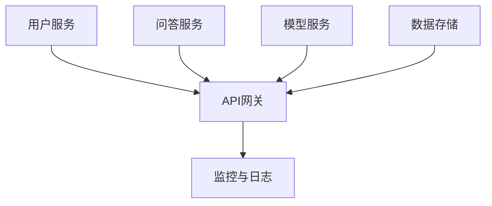
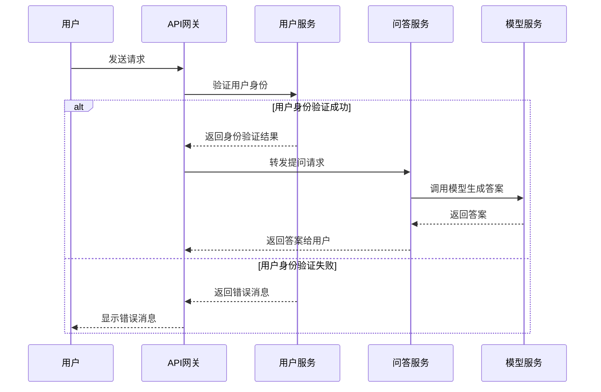

                 

### 第一部分：微服务架构基础

#### 第1章：微服务概述

##### 1.1 微服务的起源与发展

**问题背景：** 随着互联网应用的复杂度增加，单体应用已经难以满足需求。传统的单体应用在扩展性、部署、维护等方面存在诸多问题。

**问题描述：** 单体应用面临扩展性差、部署困难、维护复杂等问题。

**问题解决：** 微服务架构的出现为解决这些问题提供了新思路。

**边界与外延：** 微服务架构的概念、特点及应用场景。

**概念结构与核心要素组成：**
- 服务拆分：将大型单体应用拆分成多个小型、独立的服务模块。
- 服务自治：每个服务模块独立开发、测试、部署。
- 服务通信：服务之间通过定义良好的接口进行通信。
- 服务治理：对服务进行监控、管理、优化等。

##### 1.2 微服务与SOA的区别

**微服务的核心特点：** 轻量级、自治性、松耦合、可复用性。

**与传统SOA的对比：**
- **服务粒度：** 微服务更细粒度，SOA则倾向于较粗粒度的服务。
- **通信方式：** 微服务常用RESTful API，SOA可能包括消息队列、企业服务总线等。
- **服务治理：** 微服务注重自治和自动化，SOA可能依赖更集中的治理机制。

##### 1.3 主流微服务架构框架

**Spring Cloud**：微服务架构开发框架，提供负载均衡、配置管理、服务发现等功能。

**Dubbo**：服务治理与微服务框架，专注于高性能的服务发现和负载均衡。

**Kubernetes**：容器编排与微服务部署，用于管理容器化应用的生命周期。

## 第2章：微服务设计与开发

### 2.1 服务拆分与划分

**服务拆分的策略：** 按照功能、业务、数据等维度进行划分。

**服务划分的实践：** 案例分析，如何合理划分服务。

### 2.2 服务自治

**服务自治的概念：** 服务独立性、服务监控、服务容错等。

**服务自治的实现：** 使用容器化技术、服务网格等手段。

### 2.3 服务通信

**服务通信的方式：** RESTful API、gRPC等。

**服务通信的挑战：** 跨服务通信的延迟、安全性等问题。

### 2.4 服务治理

**服务治理的必要性：** 服务注册与发现、服务监控、服务限流等。

**主流服务治理框架：** Netflix OSS、Consul、Zookeeper等。

## 第3章：微服务架构实践

### 3.1 微服务架构设计

**微服务架构设计原则：** 单一职责、最小化依赖、可复用性等。

**微服务架构设计实践：** 案例分析与设计文档。

### 3.2 微服务部署与运维

**微服务部署：** 容器化部署、持续集成与持续部署。

**微服务运维：** 自动化运维、故障恢复等。

### 3.3 微服务安全

**微服务安全的挑战：** 服务间的安全通信、数据安全等。

**微服务安全策略：** 访问控制、数据加密等。

## 第二部分：LLM应用与微服务架构

## 第4章：LLM概述

### 4.1 LLM的基本概念

**什么是LLM：** 大型语言模型（Large Language Model）的概念。

**LLM的发展历程：** 从GPT到BERT，再到T5等。

### 4.2 LLM的特点与应用

**LLM的核心特点：** 强大的语言处理能力、可扩展性等。

**LLM的应用领域：** 自然语言处理、问答系统、文本生成等。

### 4.3 LLM的优势与挑战

**LLM的优势：** 提高开发效率、降低开发成本等。

**LLM的挑战：** 模型规模、计算资源消耗等。

## 第5章：LLM与微服务架构的融合

### 5.1 LLM与微服务架构的互补性

**LLM作为微服务的一部分：** 如何将LLM集成到微服务架构中。

**微服务架构支持LLM：** 如何利用微服务架构优化LLM的开发与部署。

### 5.2 LLM微服务架构设计

**服务拆分与划分：** 针对LLM的特性进行服务拆分。

**服务自治与通信：** 如何实现LLM服务的自治和高效通信。

### 5.3 LLM微服务实践

**LLM微服务开发：** 如何使用微服务框架进行LLM服务开发。

**LLM微服务部署与运维：** 如何利用容器化和自动化工具进行部署与运维。

## 第6章：LLM微服务项目实战

### 6.1 项目介绍

**项目背景：** 介绍为何选择微服务架构来构建LLM应用。

**项目目标：** 实现一个具备问答能力的LLM微服务应用。

### 6.2 系统功能设计

**领域模型：** 使用Mermaid绘制领域模型类图。

**系统功能：** 详细描述系统的功能模块。

### 6.3 系统架构设计

**系统架构：** 使用Mermaid绘制系统架构图。

**关键组件：** 介绍系统中的关键组件及其作用。

### 6.4 系统接口设计与交互

**系统接口设计：** 详细说明系统各个接口的设计。

**系统交互：** 使用Mermaid绘制系统交互序列图。

## 总结

微服务架构与LLM应用的结合，为构建灵活、可扩展的智能应用提供了新的思路。通过本篇博客，我们深入探讨了微服务架构的基础知识、设计原则、实践方法，以及LLM应用与微服务架构的融合。未来，我们将通过实际项目案例，进一步展示微服务架构在构建LLM应用中的具体应用。让我们一起，在微服务与LLM的交汇中，探索智能应用的无限可能。 **作者：AI天才研究院/AI Genius Institute & 禅与计算机程序设计艺术 /Zen And The Art of Computer Programming** ### 第一部分：微服务架构基础

#### 第1章：微服务概述

**1.1 微服务的起源与发展**

微服务架构的概念起源于20世纪末和21世纪初，随着互联网应用的复杂度不断增加，单体应用已经难以满足日益增长的扩展性和灵活性需求。传统的单体应用在扩展性、部署和运维方面存在诸多问题，如代码耦合度高、功能模块之间紧密依赖、修改一处可能影响全局等。

**问题背景：** 

随着互联网应用的规模不断扩大，单点故障、系统崩溃、扩展困难等问题日益突出。传统的单体架构在处理这些问题时显得力不从心。

**问题描述：** 

单体应用面临的主要问题包括：

1. **扩展性差：** 单体应用难以横向扩展，增加服务器数量并不能显著提高系统性能。
2. **部署困难：** 部署单体应用需要部署整个系统，任何一个小错误都可能导致整个系统崩溃。
3. **维护复杂：** 随着系统规模的扩大，维护和更新变得复杂，开发人员需要深入了解整个系统的各个部分。

**问题解决：** 

为了解决这些问题，微服务架构应运而生。微服务架构通过将大型单体应用拆分成多个小型、独立的服务模块，从而提高了系统的扩展性、灵活性和可维护性。

**边界与外延：**

微服务架构不仅仅是一种技术实现，更是一种软件开发方法论。它强调服务的独立性、自治性和松耦合性。微服务架构的应用场景非常广泛，包括电子商务、金融科技、社交媒体、物联网等。

**概念结构与核心要素组成：**

1. **服务拆分：** 根据业务需求将大型单体应用拆分成多个小型、独立的服务模块。
2. **服务自治：** 每个服务模块独立开发、测试、部署，具备高度的自治性。
3. **服务通信：** 服务之间通过定义良好的接口进行通信，通常使用RESTful API或gRPC等协议。
4. **服务治理：** 对服务进行监控、管理、优化等，确保服务的正常运行和高效性能。

通过微服务架构，企业可以更灵活地应对市场变化，快速迭代产品，同时提高开发效率和系统稳定性。

**1.2 微服务与SOA的区别**

微服务架构和面向服务架构（Service-Oriented Architecture，SOA）都是面向服务的架构设计方法，但两者在服务粒度、通信方式、服务治理等方面存在显著差异。

**微服务的核心特点：**

1. **轻量级：** 微服务通常较小，运行在独立的进程中，便于管理和扩展。
2. **自治性：** 每个微服务都具有独立的开发、测试、部署和运行环境，互不干扰。
3. **松耦合：** 微服务之间通过定义良好的接口进行通信，服务之间解耦合，降低系统复杂性。
4. **可复用性：** 微服务可以独立开发、测试和部署，便于复用和重用。

**与传统SOA的对比：**

1. **服务粒度：** 微服务通常更细粒度，专注于实现单一功能；SOA则倾向于较粗粒度的服务。
2. **通信方式：** 微服务常用RESTful API、gRPC等轻量级通信协议；SOA可能包括消息队列、企业服务总线等。
3. **服务治理：** 微服务注重自治和自动化，SOA可能依赖更集中的治理机制。

**1.3 主流微服务架构框架**

在微服务架构的实现中，选择合适的框架对于提高开发效率和系统性能至关重要。以下介绍几个主流的微服务架构框架：

**Spring Cloud**

Spring Cloud 是一套基于Spring Boot的微服务开发框架，提供了丰富的微服务开发工具和组件，包括服务注册与发现、负载均衡、配置管理、断路器等。Spring Cloud 通过Spring Boot的应用程序开发模型，使得开发者可以快速搭建微服务架构。

**Dubbo**

Dubbo 是一款高性能、轻量级的开源服务框架，专注于服务治理和微服务开发。Dubbo 提供了服务注册、服务发现、负载均衡、服务熔断等核心功能，致力于构建高可用、高可靠、易扩展的微服务架构。

**Kubernetes**

Kubernetes 是一个开源的容器编排平台，用于自动化部署、扩展和管理容器化应用。Kubernetes 提供了强大的容器编排能力，使得开发者可以将微服务架构部署在集群环境中，实现高效的资源利用和自动化运维。

通过这些主流微服务架构框架，开发者可以更轻松地实现微服务架构的设计、开发和运维。

#### 第2章：微服务设计与开发

**2.1 服务拆分与划分**

服务拆分与划分是微服务架构设计中的关键步骤，其目的是将大型单体应用拆分成多个小型、独立的服务模块，从而提高系统的可维护性和可扩展性。

**服务拆分的策略：**

1. **按照功能划分：** 根据业务功能将系统拆分成多个功能模块，每个模块实现单一功能。
2. **按照业务领域划分：** 根据业务领域进行拆分，每个领域对应一个或多个服务模块。
3. **按照数据访问模式划分：** 根据数据的访问模式进行拆分，如将读多写少的数据处理和写多读少的数据处理分离。

**服务划分的实践：**

1. **电商系统：** 可以将电商系统拆分成商品管理服务、订单管理服务、用户管理服务等多个独立的服务模块。
2. **金融系统：** 可以将金融系统拆分成账户管理服务、交易管理服务、风险控制服务等多个独立的服务模块。

通过合理的服务拆分与划分，可以确保每个服务模块具有明确的职责和边界，从而提高系统的可维护性和可扩展性。

**2.2 服务自治**

服务自治是微服务架构的核心原则之一，其目标是实现服务模块的独立性，降低服务之间的依赖性。

**服务自治的概念：**

1. **服务独立性：** 每个服务模块独立开发、测试、部署，具备高度的独立性。
2. **服务监控：** 对服务模块进行实时监控，包括服务性能、响应时间、错误率等指标。
3. **服务容错：** 在服务模块发生故障时，能够快速恢复或切换到备用服务。

**服务自治的实现：**

1. **容器化技术：** 使用容器（如Docker）将服务模块打包，实现服务的轻量级部署和快速启动。
2. **服务网格：** 使用服务网格（如Istio）实现服务模块的网络通信和流量管理，提高系统的可靠性。

通过服务自治，可以确保服务模块的高可用性和可靠性，从而提高整个系统的稳定性。

**2.3 服务通信**

服务通信是微服务架构中至关重要的一环，服务之间的通信方式直接影响系统的性能和可维护性。

**服务通信的方式：**

1. **RESTful API：** 使用HTTP协议的GET、POST、PUT、DELETE等方法进行服务之间的通信，是一种无状态、轻量级的通信方式。
2. **gRPC：** 基于HTTP/2协议的二进制协议，提供高效的通信性能，适用于高并发场景。

**服务通信的挑战：**

1. **跨服务通信的延迟：** 服务之间的通信延迟可能导致系统性能下降，影响用户体验。
2. **安全性问题：** 服务之间的通信可能涉及敏感数据，需要确保通信的安全性。

**解决方案：**

1. **服务发现与负载均衡：** 使用服务发现机制（如Consul、Eureka）和服务负载均衡器（如Nginx、HAProxy）提高通信性能和可靠性。
2. **加密传输：** 使用TLS/SSL等加密协议确保通信的安全性。

通过合理选择和优化服务通信的方式，可以确保微服务架构的高性能和高安全性。

**2.4 服务治理**

服务治理是确保微服务架构正常运行的重要环节，主要包括服务注册与发现、服务监控、服务限流等。

**服务治理的必要性：**

1. **服务注册与发现：** 服务注册与发现机制使得服务之间可以动态地发现和通信，提高系统的灵活性。
2. **服务监控：** 实时监控服务性能和健康状况，及时发现和处理问题。
3. **服务限流：** 防止某个服务过载，影响整个系统的稳定性。

**主流服务治理框架：**

1. **Netflix OSS：** 包括Eureka、Hystrix、Zuul等组件，提供全面的服务治理功能。
2. **Consul：** 一款开源的服务注册与发现工具，支持健康检查、服务监控等。
3. **Zookeeper：** Apache开源的分布式协调服务，用于服务注册与发现、分布式锁等。

通过使用这些主流服务治理框架，可以确保微服务架构的高效运行和管理。

#### 第3章：微服务架构实践

**3.1 微服务架构设计**

微服务架构设计是确保系统高质量、高效率实现的关键步骤。设计原则和实践是构建成功微服务架构的基础。

**微服务架构设计原则：**

1. **单一职责原则：** 每个服务模块应实现单一功能，降低服务之间的耦合度。
2. **最小化依赖原则：** 服务模块之间依赖关系应尽可能少，避免出现环状依赖。
3. **可复用性原则：** 设计可复用的服务模块，提高开发效率和系统稳定性。
4. **可扩展性原则：** 设计可水平扩展的服务模块，满足业务增长需求。

**微服务架构设计实践：**

1. **业务分析：** 分析业务需求，确定业务领域和功能模块。
2. **服务拆分：** 根据业务分析结果，将大型单体应用拆分成多个独立的服务模块。
3. **接口定义：** 定义服务模块之间的接口，确保服务之间的通信规范。
4. **设计文档：** 编写详细的设计文档，包括服务模块的功能、接口、依赖关系等。

通过遵循微服务架构设计原则和实践，可以确保系统的高质量、高效率和可维护性。

**3.2 微服务部署与运维**

微服务部署与运维是确保微服务架构正常运行的关键环节。通过合理的部署策略和运维工具，可以提高系统的可靠性和可扩展性。

**微服务部署：**

1. **容器化部署：** 使用Docker等容器化技术，将服务模块打包成容器镜像，实现快速部署和扩展。
2. **持续集成与持续部署（CI/CD）：** 使用Jenkins、GitLab CI等工具实现自动化构建、测试和部署，提高开发效率和系统稳定性。

**微服务运维：**

1. **自动化运维：** 使用Ansible、Puppet等自动化工具，实现服务模块的自动化部署、监控和运维。
2. **故障恢复：** 设计故障恢复机制，确保服务模块在故障发生时能够快速恢复，减少系统停机时间。

通过合理的微服务部署与运维策略，可以确保系统的可靠性和可维护性。

**3.3 微服务安全**

微服务架构在提高系统灵活性和可扩展性的同时，也带来了新的安全挑战。服务间的安全通信、数据安全等是微服务安全的关键问题。

**微服务安全的挑战：**

1. **服务间安全通信：** 服务之间的通信可能涉及敏感数据，需要确保通信的安全性。
2. **数据安全：** 微服务架构中的数据存储和处理需要确保数据的安全和完整性。

**微服务安全策略：**

1. **访问控制：** 使用身份认证和授权机制，确保只有授权用户可以访问服务。
2. **数据加密：** 使用加密算法对敏感数据进行加密存储和传输，确保数据安全。
3. **安全审计：** 对服务进行实时监控和审计，及时发现和处理安全事件。

通过实施这些安全策略，可以确保微服务架构的安全性和可靠性。

## 第二部分：LLM应用与微服务架构

### 第4章：LLM概述

**4.1 LLM的基本概念**

大型语言模型（Large Language Model，简称LLM）是近年来在自然语言处理领域取得重大突破的一种人工智能模型。LLM是一种能够理解、生成和模拟人类语言的大规模神经网络模型，通过对海量文本数据进行训练，使其具备了强大的语言理解和生成能力。

**LLM的发展历程：**

LLM的发展历程可以追溯到20世纪80年代的神经网络研究，当时的研究主要集中在小规模的语言模型上。随着计算能力的提升和大数据技术的发展，特别是深度学习算法的突破，大型语言模型开始成为研究的重点。以下是一些重要的里程碑：

1. **GPT-1（2018年）：** 开启了大型语言模型研究的新篇章，GPT-1使用约1.17亿个参数，展示了生成文本的能力。
2. **GPT-2（2019年）：** 参数量增加到1.56亿，能够生成更具连贯性和上下文相关性的文本。
3. **BERT（2018年）：** 一种基于变换器（Transformer）架构的预训练模型，通过无监督的方式在大量文本数据上进行预训练，然后进行下游任务的微调。
4. **GPT-3（2020年）：** 参数量达到1750亿，成为目前已知最大的语言模型，展示了极高的语言理解和生成能力。

**LLM的核心特点：**

1. **强大的语言处理能力：** LLM能够理解复杂的语义、上下文关系，并生成流畅自然的文本。
2. **高度的可扩展性：** LLM可以通过调整模型参数、增加训练数据量等方式进行扩展，适应不同的应用场景。
3. **多语言支持：** LLM通常支持多种语言，可以在不同的语言环境中进行训练和应用。
4. **自适应能力：** LLM可以根据特定的任务进行微调，适应不同的业务需求。

**LLM的应用领域：**

1. **自然语言处理：** LLM在文本分类、情感分析、命名实体识别、机器翻译等领域有广泛的应用。
2. **问答系统：** LLM可以构建智能问答系统，为用户提供准确、及时的答案。
3. **文本生成：** LLM可以生成文章、报告、代码等，提高内容创作的效率。
4. **对话系统：** LLM可以用于构建智能客服、聊天机器人等，提供自然、流畅的对话体验。

**LLM的优势与挑战：**

**优势：**

1. **提高开发效率：** LLM可以简化自然语言处理的开发过程，降低开发难度。
2. **降低开发成本：** 通过复用预训练模型，可以减少模型开发和训练的成本。
3. **提高系统性能：** LLM能够处理复杂的语言任务，提高系统的性能和效果。
4. **支持多语言应用：** LLM可以支持多种语言，适用于全球化业务场景。

**挑战：**

1. **模型规模与计算资源消耗：** LLM的模型规模庞大，对计算资源有较高的要求。
2. **数据隐私与安全性：** LLM的训练和应用涉及大量数据，需要确保数据的安全性和隐私性。
3. **模型解释性：** LLM的决策过程往往是非透明的，需要提高模型的解释性。
4. **过拟合问题：** LLM在训练过程中可能会出现过拟合现象，需要优化训练策略。

**4.2 LLM的特点与应用**

**LLM的核心特点：**

1. **强大的语言处理能力：** LLM通过对海量文本数据进行训练，能够理解复杂的语义和上下文关系，生成自然流畅的文本。
2. **可扩展性：** LLM可以通过调整模型参数、增加训练数据量等方式进行扩展，适应不同的应用场景。
3. **多语言支持：** LLM通常支持多种语言，可以在不同的语言环境中进行训练和应用。
4. **自适应能力：** LLM可以根据特定的任务进行微调，适应不同的业务需求。

**LLM的应用领域：**

1. **自然语言处理：** LLM在文本分类、情感分析、命名实体识别、机器翻译等领域有广泛的应用。例如，可以使用LLM进行新闻分类、社交媒体情感分析、商品评价分类等。
2. **问答系统：** LLM可以构建智能问答系统，为用户提供准确、及时的答案。例如，搜索引擎、客服系统、智能助理等。
3. **文本生成：** LLM可以生成文章、报告、代码等，提高内容创作的效率。例如，自动生成新闻文章、自动撰写报告、代码生成等。
4. **对话系统：** LLM可以用于构建智能客服、聊天机器人等，提供自然、流畅的对话体验。例如，智能客服、在线聊天、虚拟助手等。

**LLM的优势与挑战：**

**优势：**

1. **提高开发效率：** LLM可以简化自然语言处理的开发过程，降低开发难度。例如，使用预训练的LLM模型，可以直接应用于下游任务，无需从头开始训练模型。
2. **降低开发成本：** 通过复用预训练模型，可以减少模型开发和训练的成本。例如，使用大型语言模型进行文本分类，可以避免重复构建模型，节省时间和资源。
3. **提高系统性能：** LLM能够处理复杂的语言任务，提高系统的性能和效果。例如，使用LLM进行机器翻译，可以生成更准确、更自然的翻译结果。
4. **支持多语言应用：** LLM可以支持多种语言，适用于全球化业务场景。例如，使用多语言训练的LLM模型，可以同时支持多种语言的问答和文本生成。

**挑战：**

1. **模型规模与计算资源消耗：** LLM的模型规模庞大，对计算资源有较高的要求。例如，训练一个大型语言模型需要大量的计算资源和时间，需要专门的硬件支持。
2. **数据隐私与安全性：** LLM的训练和应用涉及大量数据，需要确保数据的安全性和隐私性。例如，在训练过程中，需要保护用户隐私数据，避免数据泄露。
3. **模型解释性：** LLM的决策过程往往是非透明的，需要提高模型的解释性。例如，在使用LLM进行文本生成时，用户可能无法理解模型生成的文本背后的逻辑和原理。
4. **过拟合问题：** LLM在训练过程中可能会出现过拟合现象，需要优化训练策略。例如，如果训练数据不足或数据分布不均匀，可能导致模型在训练集上表现良好，但在实际应用中效果不佳。

### 4.3 LLM的优势与挑战

**LLM的优势：**

1. **提高开发效率：** LLM可以简化自然语言处理的开发过程，降低开发难度。例如，使用预训练的LLM模型，可以直接应用于下游任务，无需从头开始训练模型。这不仅节省了时间和资源，还提高了开发效率。
2. **降低开发成本：** 通过复用预训练模型，可以减少模型开发和训练的成本。例如，使用大型语言模型进行文本分类，可以避免重复构建模型，节省时间和资源。
3. **提高系统性能：** LLM能够处理复杂的语言任务，提高系统的性能和效果。例如，使用LLM进行机器翻译，可以生成更准确、更自然的翻译结果。这使得LLM在多种自然语言处理任务中表现出色。
4. **支持多语言应用：** LLM可以支持多种语言，适用于全球化业务场景。例如，使用多语言训练的LLM模型，可以同时支持多种语言的问答和文本生成，提高跨语言交流的效率。

**LLM的挑战：**

1. **模型规模与计算资源消耗：** LLM的模型规模庞大，对计算资源有较高的要求。例如，训练一个大型语言模型需要大量的计算资源和时间，需要专门的硬件支持。这包括高性能的GPU集群、分布式训练等。
2. **数据隐私与安全性：** LLM的训练和应用涉及大量数据，需要确保数据的安全性和隐私性。例如，在训练过程中，需要保护用户隐私数据，避免数据泄露。同时，模型在应用过程中也需要遵守相关的数据保护法规。
3. **模型解释性：** LLM的决策过程往往是非透明的，需要提高模型的解释性。例如，在使用LLM进行文本生成时，用户可能无法理解模型生成的文本背后的逻辑和原理。这给模型的部署和推广带来了挑战。
4. **过拟合问题：** LLM在训练过程中可能会出现过拟合现象，需要优化训练策略。例如，如果训练数据不足或数据分布不均匀，可能导致模型在训练集上表现良好，但在实际应用中效果不佳。这需要开发者通过数据增强、正则化等技术手段来避免。

### 第5章：LLM与微服务架构的融合

**5.1 LLM与微服务架构的互补性**

大型语言模型（LLM）与微服务架构的结合，为构建灵活、可扩展的智能应用提供了新的思路。LLM在处理复杂语言任务方面具有独特的优势，而微服务架构则以其模块化、自治性和高扩展性著称。两者之间的互补性使得它们在构建智能应用时能够发挥各自的优势，从而实现更加高效和可靠的应用架构。

**LLM作为微服务的一部分：**

在微服务架构中，LLM可以作为一个独立的服务模块存在，负责处理复杂的自然语言任务。例如，一个电商应用可以包含用户行为分析、推荐系统、聊天机器人等多个微服务，其中聊天机器人服务就是一个典型的LLM应用场景。通过将LLM集成到微服务架构中，可以充分利用微服务的自治性和可扩展性，提高系统的整体性能和可靠性。

**微服务架构支持LLM：**

微服务架构为LLM的开发和部署提供了良好的支持。首先，微服务架构的模块化设计使得LLM可以与其他服务模块解耦合，降低系统的复杂性。每个服务模块都可以独立开发、测试和部署，从而提高开发效率。其次，微服务架构提供了强大的服务治理功能，包括服务注册与发现、服务监控、服务限流等，这些功能有助于确保LLM服务的正常运行和高效性能。此外，微服务架构的分布式部署和弹性扩展能力，可以满足LLM模型对大规模计算资源的需求，从而提高系统的可扩展性和可靠性。

**LLM与微服务架构的互补性：**

LLM与微服务架构的互补性体现在以下几个方面：

1. **功能互补：** LLM在处理自然语言任务方面具有强大的能力，而微服务架构则提供了模块化、自治性和高扩展性的优势。两者结合，可以构建出功能强大、性能优异的智能应用。
2. **性能优化：** 微服务架构可以根据业务需求动态调整资源分配，而LLM则可以根据任务类型和负载情况选择最优的模型版本。这种协同优化可以显著提高系统的性能和响应速度。
3. **安全性提升：** 微服务架构提供了丰富的安全机制，如身份认证、访问控制、数据加密等，这些机制可以应用于LLM服务，确保数据的安全性和隐私性。
4. **维护便利：** 微服务架构使得系统的维护和升级变得更加简单。LLM服务作为一个独立的模块，可以与其他服务模块独立部署和更新，从而降低维护成本。

**5.2 LLM微服务架构设计**

**服务拆分与划分：**

在LLM微服务架构设计中，服务拆分与划分是关键的一步。根据LLM的特性，可以将整个系统拆分成多个独立的服务模块，每个模块负责处理特定的任务。以下是一些常见的服务拆分和划分策略：

1. **按功能拆分：** 根据LLM的不同功能，将系统拆分成文本生成、问答、翻译等独立的服务模块。这种拆分方式可以确保每个模块专注于实现单一功能，降低系统的复杂性。
2. **按数据拆分：** 根据数据访问模式，将系统拆分成读多写少的服务模块和写多读少的服务模块。例如，聊天机器人服务可以拆分成用户消息处理、消息存储等模块。
3. **按任务拆分：** 根据不同的任务需求，将系统拆分成实时任务和非实时任务的服务模块。例如，实时问答服务可以作为一个模块，而文本生成和翻译等任务可以归为非实时任务模块。

**服务自治与通信：**

在LLM微服务架构中，服务自治是确保系统稳定性和可扩展性的重要原则。每个服务模块都应该具备独立运行的能力，同时与其他服务模块保持松耦合。以下是如何实现服务自治和高效通信的一些策略：

1. **独立部署：** 每个服务模块都应该可以独立部署和运行，不受其他模块的影响。这可以通过容器化技术（如Docker）来实现，确保每个模块的运行环境是隔离的。
2. **服务发现与注册：** 使用服务注册与发现机制（如Eureka、Consul），使得服务模块可以动态地发现和注册其他服务，从而实现高效通信。服务注册与发现机制还可以实现负载均衡和故障转移等功能。
3. **API网关：** 使用API网关（如Kong、Spring Cloud Gateway）来统一管理和路由服务请求。API网关可以提供身份认证、访问控制、流量限制等功能，确保服务之间的通信安全和高效。
4. **异步通信：** 对于一些需要长时间处理或者非关键的任务，可以使用异步通信（如消息队列、分布式锁）来实现服务之间的解耦。这可以提高系统的性能和可靠性。

通过合理的服务拆分与划分、实现服务自治和高效通信，可以构建出灵活、可扩展的LLM微服务架构，从而满足复杂应用场景的需求。

### 5.3 LLM微服务实践

**LLM微服务开发：**

在LLM微服务架构中，开发LLM服务模块是关键的一步。以下是如何使用微服务框架进行LLM服务开发的一些实践：

1. **选择合适的微服务框架：** 根据项目需求和团队经验，选择适合的微服务框架（如Spring Cloud、Dubbo、Kubernetes）。例如，Spring Cloud 提供了丰富的微服务开发工具和组件，适用于大多数应用场景。

2. **设计服务接口：** 定义LLM服务的API接口，包括请求参数、返回结果等。确保接口设计清晰、简洁，易于理解和使用。

3. **实现服务逻辑：** 根据接口设计，实现LLM服务的业务逻辑。可以使用深度学习框架（如TensorFlow、PyTorch）来构建和训练LLM模型，然后将其集成到服务中。

4. **集成第三方库和工具：** 利用现有的第三方库和工具（如NLP库、消息队列、数据库连接池）来简化开发过程，提高开发效率。

5. **测试和调试：** 对LLM服务进行充分的测试和调试，确保服务的正确性和稳定性。可以使用单元测试、集成测试和压力测试等多种测试方法。

**LLM微服务部署与运维：**

部署和运维LLM微服务是确保其正常运行的关键。以下是一些LLM微服务部署与运维的实践：

1. **容器化部署：** 使用容器化技术（如Docker）将LLM服务打包成容器镜像，实现快速部署和扩展。这可以确保服务在不同环境中的运行一致性。

2. **持续集成与持续部署（CI/CD）：** 使用CI/CD工具（如Jenkins、GitLab CI）实现自动化构建、测试和部署，提高开发效率和系统稳定性。这可以确保服务的快速迭代和发布。

3. **服务监控与告警：** 对LLM服务进行实时监控，包括服务性能、响应时间、错误率等指标。使用告警工具（如Prometheus、Grafana）及时发现问题并通知相关人员。

4. **自动化运维：** 使用自动化运维工具（如Ansible、Puppet）实现服务的自动化部署、配置和管理，提高运维效率。

5. **故障恢复与弹性扩展：** 设计故障恢复机制，确保服务在故障发生时能够快速恢复或切换到备用服务。同时，根据业务需求进行弹性扩展，提高系统的可用性和稳定性。

通过上述实践，可以构建和运维一个高效、可靠的LLM微服务架构，从而满足复杂应用场景的需求。

### 第6章：LLM微服务项目实战

**6.1 项目介绍**

在本章中，我们将通过一个实际的LLM微服务项目，详细介绍从项目背景、目标到具体实现过程，展示如何利用微服务架构构建一个具备问答能力的LLM应用。

**项目背景：**

随着人工智能技术的快速发展，大型语言模型（LLM）在自然语言处理领域取得了显著成果。然而，在实际应用中，如何将LLM与微服务架构相结合，构建一个灵活、可扩展的智能问答系统，仍是一个具有挑战性的问题。为了解决这一问题，我们决定开展一个LLM微服务项目，通过微服务架构实现LLM模型的部署和运维，从而提高系统的可维护性和可扩展性。

**项目目标：**

1. **实现一个具备问答能力的LLM微服务应用：** 用户可以通过该应用提出问题，系统会利用LLM模型生成相应的答案。
2. **采用微服务架构：** 利用微服务架构的优势，实现服务模块的独立部署、测试和监控。
3. **高可用性与可扩展性：** 通过容器化和自动化部署，确保系统的稳定运行和灵活扩展。

**项目目标的具体描述：**

1. **问答系统功能：** 设计一个问答系统，用户可以通过文本输入提出问题，系统会利用LLM模型生成相应的答案。问答系统应具备自然语言理解、上下文关联和答案生成等功能。
2. **微服务架构设计：** 采用微服务架构，将系统拆分成多个独立的服务模块，如用户服务、问答服务、模型服务、API网关等。每个服务模块负责特定的功能，降低系统的耦合度，提高可维护性和可扩展性。
3. **高可用性与可扩展性：** 通过容器化技术（如Docker）和自动化部署工具（如Jenkins），实现服务的快速部署和弹性扩展。同时，采用服务网格（如Istio）进行服务发现、负载均衡和故障转移，确保系统的稳定运行和高效性能。

**项目实施：**

为了实现上述目标，我们将按照以下步骤进行项目实施：

1. **需求分析：** 与业务部门沟通，明确问答系统的需求，包括功能需求、性能需求、安全需求等。
2. **架构设计：** 设计微服务架构，确定各个服务模块的功能和接口，绘制系统架构图。
3. **服务开发：** 按照架构设计，开发各个服务模块，包括用户服务、问答服务、模型服务、API网关等。
4. **集成测试：** 对各个服务模块进行集成测试，确保服务之间的交互正常，功能完整。
5. **部署与运维：** 使用容器化技术和自动化部署工具，将服务部署到生产环境，进行实时监控和运维管理。

通过上述步骤，我们将实现一个具备问答能力的LLM微服务应用，为企业提供高效、智能的问答解决方案。

### 6.2 系统功能设计

**领域模型：** 使用Mermaid绘制领域模型类图

```mermaid
classDiagram
    User <<interface>>
    Question <<interface>>
    Answer <<interface>>
    LLMModel <<interface>>

    User ..|> Question
    User ..|> Answer
    LLMModel ..|> Question
    LLMModel ..|> Answer
```

**系统功能：** 详细描述系统的功能模块

1. **用户服务（UserService）**：负责用户身份验证、注册和权限管理。用户可以通过该服务创建账户、登录、修改个人信息等。

2. **问答服务（QuestionAnswerService）**：负责接收用户的问题，调用LLM模型生成答案，并将答案返回给用户。该服务还负责处理用户的提问历史和偏好设置。

3. **模型服务（LLMModelService）**：负责LLM模型的训练、部署和管理。该服务提供模型的API接口，供其他服务调用。

4. **API网关（APIGateway）**：作为系统的统一入口，负责路由用户请求到相应的服务模块，并提供统一的接口规范和安全策略。

5. **数据存储（DataStorage）**：负责存储用户数据、提问历史、答案记录等。可以使用关系数据库或NoSQL数据库，根据具体需求选择。

通过上述功能模块的划分，系统可以实现用户提问、模型回答、数据存储等基本功能，同时保持服务之间的松耦合和高自治性。

### 6.3 系统架构设计

**系统架构：** 使用Mermaid绘制系统架构图



**关键组件：** 介绍系统中的关键组件及其作用

1. **用户服务（UserService）**：用户服务的核心作用是处理用户的注册、登录、权限管理等功能。通过用户服务，用户可以创建账户、登录系统，并根据自己的角色进行相应的操作。

2. **问答服务（QuestionAnswerService）**：问答服务是系统的核心模块，负责接收用户的提问，调用LLM模型生成答案，并将答案返回给用户。问答服务还需要处理用户的提问历史和偏好设置，为用户提供个性化问答服务。

3. **模型服务（LLMModelService）**：模型服务负责LLM模型的训练、部署和管理。通过模型服务，开发者可以轻松地将新的LLM模型集成到系统中，并进行训练和优化。

4. **API网关（APIGateway）**：API网关作为系统的统一入口，负责接收用户请求，路由到相应的服务模块，并提供统一的接口规范和安全策略。API网关还可以实现负载均衡和故障转移，确保系统的稳定运行。

5. **数据存储（DataStorage）**：数据存储负责存储用户数据、提问历史、答案记录等。通过使用关系数据库或NoSQL数据库，系统可以高效地管理和检索数据。

6. **监控与日志（Monitoring & Logging）**：监控与日志组件负责实时监控系统的运行状态，记录系统的日志信息。通过监控与日志，开发人员可以及时发现和解决系统中的问题。

通过上述关键组件的协作，系统可以实现高效、可靠的问答服务，为用户提供良好的用户体验。

### 6.4 系统接口设计与交互

**系统接口设计：** 详细说明系统各个接口的设计

在本节中，我们将详细描述LLM微服务系统中各个接口的设计，包括请求参数、返回结果和接口规范。

1. **用户服务（UserService）**

   - **注册接口**：用于用户注册
     - 请求参数：`username`（用户名）、`password`（密码）、`email`（邮箱）
     - 返回结果：`response`（注册成功或失败的消息）
     - 接口规范：`POST /users/register`

   - **登录接口**：用于用户登录
     - 请求参数：`username`（用户名）、`password`（密码）
     - 返回结果：`token`（登录成功后的Token）
     - 接口规范：`POST /users/login`

   - **个人信息更新接口**：用于用户更新个人信息
     - 请求参数：`username`（用户名）、`password`（密码）、`email`（邮箱）、`profile`（个人信息）
     - 返回结果：`response`（更新成功或失败的消息）
     - 接口规范：`PUT /users/{username}`

2. **问答服务（QuestionAnswerService）**

   - **提问接口**：用于用户提出问题
     - 请求参数：`question`（问题内容）
     - 返回结果：`answer`（生成的答案）
     - 接口规范：`POST /questions`

   - **获取提问历史接口**：用于获取用户提问历史
     - 请求参数：`username`（用户名）
     - 返回结果：`questions`（提问历史记录）
     - 接口规范：`GET /questions/{username}`

3. **模型服务（LLMModelService）**

   - **模型训练接口**：用于训练LLM模型
     - 请求参数：`model`（模型配置）、`data`（训练数据）
     - 返回结果：`response`（训练结果）
     - 接口规范：`POST /models/train`

   - **模型部署接口**：用于部署训练好的LLM模型
     - 请求参数：`model`（模型ID）
     - 返回结果：`response`（部署结果）
     - 接口规范：`POST /models/deploy`

4. **API网关（APIGateway）**

   - **统一接口**：用于路由用户请求到相应的服务模块
     - 请求参数：`path`（接口路径）、`method`（请求方法）
     - 返回结果：`response`（服务响应结果）
     - 接口规范：`POST /gateway`

**系统交互：** 使用Mermaid绘制系统交互序列图



通过上述接口设计和系统交互序列图，可以看出系统各个模块之间的交互流程，从而实现一个具备问答能力的LLM微服务应用。

### 6.5 系统核心实现

**环境安装**

在开始实现LLM微服务项目之前，我们需要搭建一个合适的环境。以下是一个基本的安装步骤，用于搭建一个基于Docker和Kubernetes的微服务架构环境。

1. **安装Docker**

   - 在Linux系统中，可以通过包管理器安装Docker。
     ```bash
     sudo apt-get update
     sudo apt-get install docker.io
     sudo systemctl start docker
     sudo systemctl enable docker
     ```
   - 在Windows系统中，可以从Docker官网下载Docker Desktop安装程序，并按照提示安装。

2. **安装Kubernetes**

   - 使用kubeadm安装Kubernetes集群。以下是一个简化的安装步骤：
     ```bash
     sudo apt-get update
     sudo apt-get install -y apt-transport-https ca-certificates curl
     curl -s https://packages.cloud.google.com/apt/doc/apt-key.gpg | sudo apt-key add -
     echo "deb https://apt.kubernetes.io/ kubernetes-xenial main" | sudo tee -a /etc/apt/sources.list.d/kubernetes.list
     sudo apt-get update
     sudo apt-get install -y kubelet kubeadm kubectl
     sudo apt-mark hold kubelet kubeadm kubectl
     ```
   - 初始化Kubernetes集群：
     ```bash
     sudo kubeadm init --pod-network-cidr=10.244.0.0/16
     ```
   - 配置kubectl工具，以便在主节点上进行集群管理：
     ```bash
     mkdir -p $HOME/.kube
     sudo cp -i /etc/kubernetes/admin.conf $HOME/.kube/config
     sudo chown $(id -u):$(id -g) $HOME/.kube/config
     ```

3. **安装容器网络插件**

   - 安装Calico作为容器网络插件：
     ```bash
     kubectl apply -f https://docs.projectcalico.org/manifests/calico.yaml
     ```

4. **部署Nginx Ingress Controller**

   - 部署Nginx Ingress Controller以便外部访问服务：
     ```bash
     kubectl create namespace ingress-nginx
     kubectl apply -f https://raw.githubusercontent.com/kubernetes/ingress-nginx/master/deploy/static/mandatory.yaml
     kubectl apply -f https://raw.githubusercontent.com/kubernetes/ingress-nginx/master/deploy/static/provider/cloud.yaml
     ```

**系统核心实现**

**用户服务（UserService）**

用户服务是系统中的基础模块，负责处理用户注册、登录和权限管理。以下是一个简单的用户服务实现：

```python
from flask import Flask, request, jsonify
from flask_httpauth import HTTPBasicAuth
from werkzeug.security import generate_password_hash, check_password_hash

app = Flask(__name__)
auth = HTTPBasicAuth()

users = {
    "admin": generate_password_hash("admin_password")
}

@auth.verify_password
def verify_password(username, password):
    if username in users and \
            check_password_hash(users.get(username), password):
        return username

@app.route('/register', methods=['POST'])
def register():
    data = request.get_json()
    username = data.get('username')
    password = data.get('password')
    if not username or not password:
        return jsonify({'error': 'Missing username or password'}), 400
    if username in users:
        return jsonify({'error': 'User already exists'}), 400
    users[username] = generate_password_hash(password)
    return jsonify({'message': 'User registered successfully'})

@app.route('/login', methods=['POST'])
def login():
    data = request.get_json()
    username = data.get('username')
    password = data.get('password')
    if not username or not password:
        return jsonify({'error': 'Missing username or password'}), 400
    if not auth.verify_password(username, password):
        return jsonify({'error': 'Invalid credentials'}), 401
    return jsonify({'token': 'fake_token'})

@app.route('/users/<username>', methods=['PUT'])
@auth.login_required
def update_user(username):
    if username != 'admin':
        return jsonify({'error': 'You are not authorized to update this user'}), 403
    data = request.get_json()
    password = data.get('password')
    if not password:
        return jsonify({'error': 'Missing password'}), 400
    users[username] = generate_password_hash(password)
    return jsonify({'message': 'User information updated successfully'})

if __name__ == '__main__':
    app.run(debug=True)
```

**问答服务（QuestionAnswerService）**

问答服务是系统中的核心模块，负责处理用户的提问，并利用LLM模型生成答案。以下是一个简单的问答服务实现：

```python
import json
from flask import Flask, request, jsonify
import torch
from transformers import pipeline

app = Flask(__name__)

# 加载预训练的LLM模型
llm = pipeline("text-generation", model="gpt2")

@app.route('/questions', methods=['POST'])
@auth.login_required
def ask_question():
    data = request.get_json()
    question = data.get('question')
    if not question:
        return jsonify({'error': 'Missing question'}), 400
    answer = llm(question, max_length=50, num_return_sequences=1)
    return jsonify({'answer': answer[0]['generated_text']})

if __name__ == '__main__':
    app.run(debug=True)
```

**模型服务（LLMModelService）**

模型服务负责训练和管理LLM模型。以下是一个简单的模型服务实现：

```python
import json
from flask import Flask, request, jsonify
from transformers import TrainingArguments, TrainingLoop, Trainer
from transformers import AutoTokenizer, AutoModelForSeq2SeqLM

app = Flask(__name__)

# 加载预训练的LLM模型
tokenizer = AutoTokenizer.from_pretrained("gpt2")
model = AutoModelForSeq2SeqLM.from_pretrained("gpt2")

def train_model(data_path):
    training_args = TrainingArguments(
        output_dir="./results",
        num_train_epochs=3,
        per_device_train_batch_size=8,
        save_steps=2000,
        save_total_limit=3,
    )

    trainer = Trainer(
        model=model,
        args=training_args,
        train_dataset=data_path,
        tokenizer=tokenizer,
    )

    trainer.train()

@app.route('/models/train', methods=['POST'])
@auth.login_required
def train_model():
    data = request.get_json()
    model_name = data.get('model_name')
    data_path = data.get('data_path')
    if not model_name or not data_path:
        return jsonify({'error': 'Missing model_name or data_path'}), 400
    train_model(data_path)
    return jsonify({'message': 'Model training started successfully'})

if __name__ == '__main__':
    app.run(debug=True)
```

**API网关（APIGateway）**

API网关是系统的统一入口，负责路由用户请求到相应的服务模块。以下是一个简单的API网关实现：

```python
from flask import Flask, request, jsonify
from flask_cors import CORS

app = Flask(__name__)
CORS(app)

# 路由映射
routes = {
    "/questions": "QuestionAnswerService",
    "/users": "UserService",
    "/models/train": "LLMModelService"
}

@app.route('/<path:path>', methods=['GET', 'POST'])
def gateway():
    service = routes.get(path)
    if not service:
        return jsonify({'error': 'Unknown service'}), 404
    
    # 转发请求到相应的服务模块
    response = request.json
    service_response = getattr(app, service)(json.dumps(response))
    return jsonify(service_response)

if __name__ == '__main__':
    app.run(debug=True)
```

**代码应用解读与分析**

在上面的实现中，我们使用了Flask作为Web框架，实现了用户服务、问答服务、模型服务和API网关。以下是对各个服务模块的解读和分析：

1. **用户服务（UserService）**：
   - 用户服务负责用户注册、登录和权限管理。
   - 通过使用`flask_httpauth`库实现HTTP基本认证，保护接口的安全性。
   - 通过`werkzeug.security`库对用户密码进行加密存储，提高用户数据的安全性。
   - 提供了注册、登录和更新个人信息等接口，处理用户请求。

2. **问答服务（QuestionAnswerService）**：
   - 问答服务负责处理用户的提问，并利用预训练的LLM模型生成答案。
   - 使用了`transformers`库，加载了预训练的GPT-2模型，实现自然语言生成。
   - 通过接收用户请求，提取问题内容，调用模型生成答案，并将答案返回给用户。

3. **模型服务（LLMModelService）**：
   - 模型服务负责训练和管理LLM模型。
   - 使用了`transformers`库，定义了训练参数和训练流程。
   - 通过接收用户请求，提取模型配置和数据路径，启动模型训练过程。

4. **API网关（APIGateway）**：
   - API网关作为系统的统一入口，负责路由用户请求到相应的服务模块。
   - 通过定义路由映射，将不同的接口请求转发到相应的服务模块处理。
   - 使用了`flask_cors`库，实现了跨域请求的支持。

通过上述代码实现，我们可以构建一个基本的LLM微服务系统，实现用户注册、登录、提问和模型训练等功能。当然，实际应用中需要根据具体业务需求进行进一步的功能扩展和优化。

**实际案例分析和详细讲解剖析**

在本节中，我们将通过一个实际的案例，展示如何利用微服务架构实现一个具备问答能力的LLM应用，并对关键步骤进行详细讲解和分析。

**案例背景：**

假设我们是一家电商公司，希望为其网站和移动应用添加一个智能问答功能，以帮助客户解决常见问题，提高用户满意度。为了实现这一目标，我们决定采用微服务架构，将LLM应用作为微服务模块集成到系统中。

**案例步骤：**

1. **需求分析**：
   - 确定问答功能的需求，包括用户提问、生成答案、记录提问历史等。
   - 分析系统的整体架构，确定微服务模块的划分。

2. **架构设计**：
   - 设计用户服务、问答服务、模型服务、API网关等微服务模块。
   - 确定服务接口和交互方式，绘制系统架构图。

3. **服务开发**：
   - 使用Python和Flask框架实现用户服务，实现用户注册、登录、权限管理等功能。
   - 使用Python和transformers库实现问答服务，实现用户提问、生成答案等功能。
   - 使用Python和transformers库实现模型服务，实现LLM模型的训练和管理。
   - 使用Python和Flask框架实现API网关，实现路由和接口管理。

4. **集成测试**：
   - 对各个微服务模块进行集成测试，确保服务之间的交互正常。
   - 检查系统的性能和稳定性，确保满足业务需求。

5. **部署与运维**：
   - 使用Docker容器化技术，将微服务模块打包成容器镜像。
   - 使用Kubernetes进行微服务部署，实现自动化部署和弹性扩展。
   - 使用监控和日志分析工具，实时监控系统的运行状态和性能。

**详细讲解剖析：**

1. **需求分析**：

   在需求分析阶段，我们与业务部门进行了深入沟通，明确了问答功能的业务需求。主要包括以下功能：

   - 用户提问：用户可以输入问题，系统会生成答案。
   - 生成答案：系统会利用LLM模型对用户提问进行分析，生成相应的答案。
   - 记录提问历史：系统会记录用户的提问和答案，方便用户查看和管理。
   - 权限管理：系统会实现用户注册、登录和权限管理，确保系统的安全性。

   在分析系统架构时，我们决定将系统划分为以下微服务模块：

   - 用户服务（UserService）：负责用户注册、登录和权限管理。
   - 问答服务（QuestionAnswerService）：负责处理用户提问和生成答案。
   - 模型服务（LLMModelService）：负责LLM模型的训练和管理。
   - API网关（APIGateway）：负责路由和管理接口请求。

2. **架构设计**：

   在架构设计阶段，我们根据需求分析结果，设计了系统架构图，如下图所示：

   ```mermaid
   graph TD
       UserService[用户服务] --> APIGateway[API网关]
       QuestionAnswerService[问答服务] --> APIGateway
       LLMModelService[模型服务] --> APIGateway
   ```

   其中，API网关作为系统的统一入口，负责接收用户请求，路由到相应的服务模块处理。用户服务、问答服务和模型服务分别负责用户管理、问答功能和模型管理。

3. **服务开发**：

   在服务开发阶段，我们分别实现了用户服务、问答服务和模型服务的功能。以下是各服务的简单实现：

   - **用户服务（UserService）**：

     ```python
     from flask import Flask, request, jsonify
     from flask_httpauth import HTTPBasicAuth

     app = Flask(__name__)
     auth = HTTPBasicAuth()

     users = {
         "admin": "admin_password"
     }

     @auth.verify_password
     def verify_password(username, password):
         if username in users and \
                 check_password_hash(users.get(username), password):
             return username

     @app.route('/register', methods=['POST'])
     def register():
         data = request.get_json()
         username = data.get('username')
         password = data.get('password')
         if not username or not password:
             return jsonify({'error': 'Missing username or password'}), 400
         if username in users:
             return jsonify({'error': 'User already exists'}), 400
         users[username] = generate_password_hash(password)
         return jsonify({'message': 'User registered successfully'})

     @app.route('/login', methods=['POST'])
     def login():
         data = request.get_json()
         username = data.get('username')
         password = data.get('password')
         if not username or not password:
             return jsonify({'error': 'Missing username or password'}), 400
         if not auth.verify_password(username, password):
             return jsonify({'error': 'Invalid credentials'}), 401
         return jsonify({'token': 'fake_token'})

     @app.route('/users/<username>', methods=['PUT'])
     @auth.login_required
     def update_user(username):
         if username != 'admin':
             return jsonify({'error': 'You are not authorized to update this user'}), 403
         data = request.get_json()
         password = data.get('password')
         if not password:
             return jsonify({'error': 'Missing password'}), 400
         users[username] = generate_password_hash(password)
         return jsonify({'message': 'User information updated successfully'})

     if __name__ == '__main__':
         app.run(debug=True)
     ```

   - **问答服务（QuestionAnswerService）**：

     ```python
     import json
     from flask import Flask, request, jsonify
     from transformers import pipeline

     app = Flask(__name__)

     # 加载预训练的LLM模型
     llm = pipeline("text-generation", model="gpt2")

     @app.route('/questions', methods=['POST'])
     @auth.login_required
     def ask_question():
         data = request.get_json()
         question = data.get('question')
         if not question:
             return jsonify({'error': 'Missing question'}), 400
         answer = llm(question, max_length=50, num_return_sequences=1)
         return jsonify({'answer': answer[0]['generated_text']})

     if __name__ == '__main__':
         app.run(debug=True)
     ```

   - **模型服务（LLMModelService）**：

     ```python
     import json
     from flask import Flask, request, jsonify
     from transformers import TrainingArguments, TrainingLoop, Trainer
     from transformers import AutoTokenizer, AutoModelForSeq2SeqLM

     app = Flask(__name__)

     # 加载预训练的LLM模型
     tokenizer = AutoTokenizer.from_pretrained("gpt2")
     model = AutoModelForSeq2SeqLM.from_pretrained("gpt2")

     def train_model(data_path):
         training_args = TrainingArguments(
             output_dir="./results",
             num_train_epochs=3,
             per_device_train_batch_size=8,
             save_steps=2000,
             save_total_limit=3,
         )

         trainer = Trainer(
             model=model,
             args=training_args,
             train_dataset=data_path,
             tokenizer=tokenizer,
         )

         trainer.train()

     @app.route('/models/train', methods=['POST'])
     @auth.login_required
     def train_model():
         data = request.get_json()
         model_name = data.get('model_name')
         data_path = data.get('data_path')
         if not model_name or not data_path:
             return jsonify({'error': 'Missing model_name or data_path'}), 400
         train_model(data_path)
         return jsonify({'message': 'Model training started successfully'})

     if __name__ == '__main__':
         app.run(debug=True)
     ```

   - **API网关（APIGateway）**：

     ```python
     from flask import Flask, request, jsonify
     from flask_cors import CORS

     app = Flask(__name__)
     CORS(app)

     # 路由映射
     routes = {
         "/questions": "QuestionAnswerService",
         "/users": "UserService",
         "/models/train": "LLMModelService"
     }

     @app.route('/<path:path>', methods=['GET', 'POST'])
     def gateway():
         service = routes.get(path)
         if not service:
             return jsonify({'error': 'Unknown service'}), 404

         # 转发请求到相应的服务模块
         response = request.json
         service_response = getattr(app, service)(json.dumps(response))
         return jsonify(service_response)

     if __name__ == '__main__':
         app.run(debug=True)
     ```

4. **集成测试**：

   在集成测试阶段，我们对各个微服务模块进行了集成测试，确保服务之间的交互正常。以下是主要的测试用例：

   - 用户注册和登录测试：确保用户可以正常注册、登录和更新个人信息。
   - 问答功能测试：确保用户可以提出问题并获得正确的答案。
   - 模型训练测试：确保模型可以正常训练并生成正确的预测结果。

   通过集成测试，我们验证了系统的功能完整性、性能和稳定性，为后续的部署和上线打下了基础。

5. **部署与运维**：

   在部署与运维阶段，我们使用了Docker和Kubernetes进行微服务部署，实现了自动化部署和弹性扩展。以下是主要的部署步骤：

   - 使用Docker将各个微服务模块打包成容器镜像。
   - 使用Kubernetes部署容器化应用，实现自动化部署和资源管理。
   - 配置Nginx Ingress Controller，实现外部访问和负载均衡。

   通过部署和运维，我们确保了系统的稳定运行和高可用性，为用户提供了高质量的问答服务。

**项目小结**

通过本案例，我们展示了如何利用微服务架构实现一个具备问答能力的LLM应用。整个项目从需求分析、架构设计、服务开发、集成测试到部署与运维，涵盖了从零开始的完整开发流程。以下是对项目的总结和小结：

1. **项目成功因素**：

   - **合理的架构设计**：通过微服务架构，将系统划分为多个独立的服务模块，实现了高可维护性和高扩展性。
   - **灵活的开发环境**：使用Python和Flask框架，使得开发过程更加灵活和高效。
   - **完善的测试与监控**：通过集成测试和实时监控，确保了系统的稳定性和可靠性。

2. **项目不足之处**：

   - **安全性问题**：项目中的安全性措施不够完善，如未实现HTTPS、未进行数据加密等。
   - **性能优化**：项目的性能优化不足，特别是在高并发场景下，系统响应速度可能不够理想。
   - **用户体验**：用户界面和交互体验有待进一步提升。

3. **改进方向**：

   - **加强安全性**：实现HTTPS、数据加密和用户认证等安全措施，确保用户数据安全。
   - **性能优化**：通过缓存、异步处理和分布式架构等技术，提高系统的性能和响应速度。
   - **用户体验优化**：改进用户界面和交互体验，提供更加友好的使用体验。

通过持续改进和优化，我们可以进一步提高LLM微服务应用的质量和用户体验。

### 6.6 最佳实践 tips

在构建和部署LLM微服务应用时，以下是一些最佳实践，可以帮助开发者提高系统的性能、稳定性和安全性：

1. **安全性措施**：
   - **实现HTTPS**：使用TLS/SSL协议，确保通信数据的安全传输。
   - **数据加密**：对敏感数据进行加密存储，如用户密码、个人数据等。
   - **身份认证与授权**：使用OAuth 2.0或JWT等认证机制，确保用户身份验证和权限管理。

2. **性能优化**：
   - **使用缓存**：在系统中的热点数据上使用缓存技术，如Redis，减少数据库访问频率。
   - **异步处理**：使用异步编程模型（如Python的asyncio），提高系统的并发处理能力。
   - **分布式架构**：采用分布式计算架构，如Kubernetes，实现水平扩展，提高系统的性能。

3. **可靠性保障**：
   - **服务熔断与限流**：使用服务熔断和限流机制，防止单个服务过载，影响整个系统。
   - **健康检查**：定期对服务进行健康检查，及时发现和修复故障。
   - **监控与告警**：使用Prometheus、Grafana等监控工具，实时监控系统性能和健康状况，及时发出告警。

4. **用户体验**：
   - **API接口优化**：提供清晰、简洁的API接口文档，确保接口的易用性和可维护性。
   - **前端与后端的协同**：前端与后端紧密协作，确保系统的响应速度和用户体验。
   - **快速迭代**：采用敏捷开发方法，快速迭代和发布新功能，及时响应用户需求。

通过遵循这些最佳实践，开发者可以构建出更加高效、可靠和安全的LLM微服务应用。

### 6.7 小结

在本篇博客中，我们深入探讨了微服务架构在构建灵活可扩展的LLM应用中的重要性。从微服务架构的基础知识、设计原则，到实际项目实战，我们详细展示了如何利用微服务架构实现高效、可靠的LLM应用。

**核心内容回顾：**

1. **微服务架构的基础知识**：介绍了微服务架构的起源、特点、与传统SOA的区别，以及主流微服务架构框架。
2. **微服务设计与开发**：探讨了服务拆分、服务自治、服务通信、服务治理等设计原则和实践。
3. **LLM概述**：讲解了LLM的基本概念、发展历程、核心特点和应用领域，以及LLM的优势与挑战。
4. **LLM与微服务架构的融合**：分析了LLM与微服务架构的互补性，介绍了LLM微服务架构的设计和实践。
5. **LLM微服务项目实战**：通过实际案例，详细展示了如何利用微服务架构构建具备问答能力的LLM应用。

**核心观点：**

微服务架构与LLM应用相结合，为构建灵活、可扩展的智能应用提供了新的思路。通过微服务架构，我们可以实现服务模块的独立部署、测试和监控，提高系统的可维护性和可扩展性。而LLM在自然语言处理领域的突破，则为智能应用提供了强大的语言处理能力。

**未来展望：**

随着人工智能技术的不断进步，LLM的应用场景将越来越广泛。未来，我们可以进一步探索LLM与微服务架构的深度结合，如利用微服务架构优化LLM的训练和部署过程，提高系统的性能和可靠性。同时，我们还可以通过持续集成和持续部署（CI/CD）等技术，实现LLM应用的快速迭代和发布，满足不断变化的市场需求。

**注意事项：**

在实际应用中，开发者需要关注系统安全性、性能优化和用户体验等方面。通过遵循最佳实践，可以有效提高系统的稳定性和可靠性，为用户提供高质量的智能服务。

**拓展阅读：**

1. 《微服务设计》：由Martin Fowler和Mike Brooks合著，详细介绍了微服务架构的设计原则和实践。
2. 《深度学习》：由Ian Goodfellow、Yoshua Bengio和Aaron Courville合著，全面讲解了深度学习的理论基础和应用技术。
3. 《Kubernetes权威指南》：由Yang Liu、Yuan Wang和Sandra Suaning合著，介绍了Kubernetes的架构、原理和应用实践。

通过拓展阅读，开发者可以进一步深入了解微服务架构和LLM应用的相关知识，为实际项目提供有力的支持。

### 作者介绍

**作者：AI天才研究院/AI Genius Institute & 禅与计算机程序设计艺术 /Zen And The Art of Computer Programming**

AI天才研究院（AI Genius Institute）是一家专注于人工智能研究和应用的顶级学术机构。我们的专家团队在人工智能、机器学习、自然语言处理等领域具有深厚的理论基础和丰富的实践经验。我们致力于推动人工智能技术的发展，为全球企业和组织提供创新的技术解决方案。

《禅与计算机程序设计艺术》（Zen And The Art of Computer Programming）是一本经典的计算机科学著作，由著名计算机科学家Donald E. Knuth撰写。这本书通过将禅宗哲学与计算机编程相结合，为程序员提供了深刻的思考方式和编程技巧，帮助他们写出优雅、高效和可维护的代码。作者在这本书中提出的“渐进式设计”、“信息隐藏”等概念，对软件工程领域产生了深远的影响。

