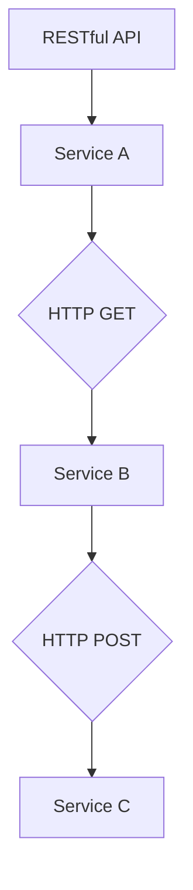
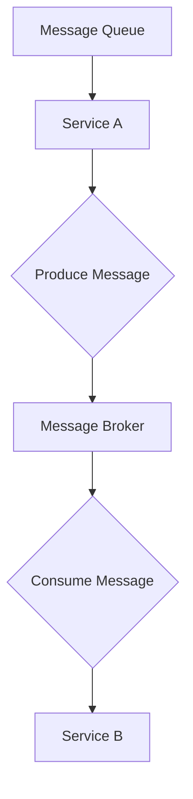
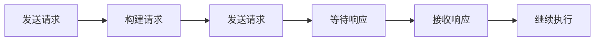
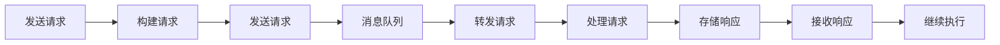
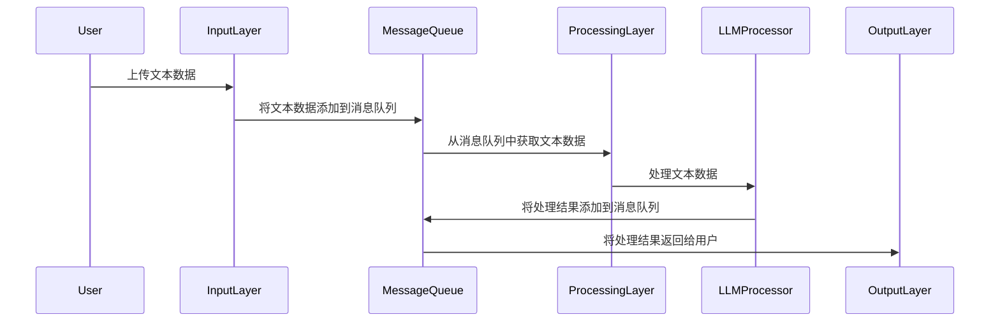
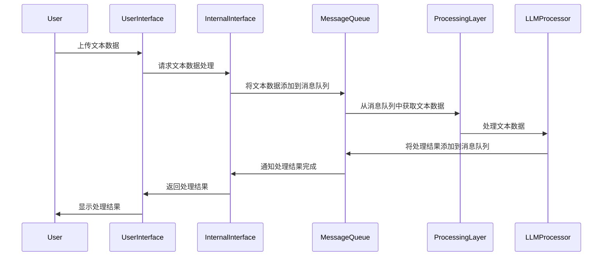

                 

## 微服务通信：同步vs异步在LLM应用中的选择

关键词：微服务，同步通信，异步通信，大型语言模型（LLM），通信模式选择，系统架构设计

摘要：本文深入探讨了微服务架构中同步通信与异步通信的优劣，特别是在大型语言模型（LLM）应用场景中的选择。通过分析两者的核心概念、设计模式、算法实现和数学模型，本文旨在为读者提供全面的指导，帮助他们在实际项目中做出明智的通信模式选择，以提高系统性能和可维护性。

### 引言与背景

在当今快速发展的IT行业，微服务架构已经成为一种主流的系统设计方法。微服务将应用程序划分为一系列独立的、松耦合的服务，每个服务负责特定的业务功能。这种设计方法不仅提高了系统的可伸缩性和可维护性，还允许团队独立开发、部署和扩展各个服务。

随着微服务架构的普及，同步通信和异步通信两种通信模式也逐渐成为微服务设计中的重要选择。同步通信要求发送方在收到响应前等待接收方的响应，而异步通信则允许发送方在发送请求后继续执行其他任务，无需等待响应。

在微服务架构中，同步通信和异步通信各有优劣。同步通信提供了明确的响应时间保证，但可能导致服务之间出现瓶颈，降低系统的整体性能。异步通信则可以减少服务之间的依赖性，提高系统的并发性和可扩展性，但可能引入复杂的异步处理逻辑，增加系统的复杂度和维护成本。

本文将深入探讨同步通信和异步通信在微服务架构中的核心概念、设计模式、算法实现和数学模型，特别是它们在大型语言模型（LLM）应用场景中的选择。通过详细的分析和实例，本文旨在帮助读者理解这两种通信模式的本质差异，并掌握如何在实际项目中做出明智的选择。

### 核心概念与原理

#### 同步通信

同步通信（Synchronous Communication）是指发送方在发送请求后必须等待接收方的响应，直到收到响应后才继续执行后续操作。在微服务架构中，同步通信通常通过HTTP/HTTPS请求来实现。

**核心概念：**

1. **请求-响应模型：** 同步通信遵循请求-响应模型，即发送方发送请求，接收方处理请求并返回响应。
2. **阻塞：** 同步通信中的阻塞是指发送方在等待响应期间被挂起，无法继续执行其他任务。
3. **事务性：** 同步通信通常保证事务性，即要么所有操作都成功执行，要么都不执行。

**优点：**

1. **明确的响应时间：** 同步通信提供了明确的响应时间保证，有助于控制系统的性能和稳定性。
2. **简洁性：** 同步通信的代码实现相对简单，易于理解和维护。

**缺点：**

1. **性能瓶颈：** 同步通信可能导致服务之间出现性能瓶颈，降低系统的整体性能。
2. **资源占用：** 同步通信中的阻塞可能导致服务器资源长时间占用，增加系统的资源消耗。

**典型应用场景：**

- 需要严格的事务性保证的场景，如金融交易。
- 用户界面交互，需要及时响应的场景。

#### 异步通信

异步通信（Asynchronous Communication）是指发送方在发送请求后无需等待接收方的响应，可以继续执行其他任务。在微服务架构中，异步通信通常通过消息队列和事件驱动架构来实现。

**核心概念：**

1. **发布-订阅模型：** 异步通信遵循发布-订阅模型，即发送方（发布者）发送消息，接收方（订阅者）根据需要接收消息。
2. **非阻塞：** 异步通信中的非阻塞是指发送方在发送请求后可以继续执行其他任务，无需等待响应。
3. **分布式：** 异步通信支持分布式系统中的服务间通信，可以跨多个服务器和网络进行消息传递。

**优点：**

1. **高并发性：** 异步通信可以减少服务之间的依赖性，提高系统的并发性和可扩展性。
2. **资源利用率：** 异步通信可以降低服务器资源的占用，提高系统的资源利用率。
3. **故障恢复：** 异步通信中的消息队列可以支持消息的持久化和重试机制，提高系统的故障恢复能力。

**缺点：**

1. **复杂性：** 异步通信的代码实现相对复杂，需要处理异步处理逻辑和异常处理。
2. **延迟性：** 异步通信可能引入一定的延迟，不适合需要即时响应的场景。

**典型应用场景：**

- 需要高并发性和可扩展性的场景，如电商平台。
- 需要跨多个服务或分布式系统的通信场景，如物联网（IoT）。

#### 大型语言模型（LLM）的通信模式

大型语言模型（LLM）在自然语言处理（NLP）领域具有广泛的应用，如智能问答、机器翻译和文本生成等。LLM通常需要处理大量的文本数据，因此其通信模式的选择对于系统的性能和效率至关重要。

**同步通信：**

同步通信在LLM应用中适用于需要即时响应的场景，如实时聊天机器人。同步通信可以确保消息的即时传递和处理，但可能导致系统性能瓶颈和资源占用问题。

**异步通信：**

异步通信在LLM应用中适用于需要高并发性和可扩展性的场景，如批量处理文本数据。异步通信可以减少服务之间的依赖性，提高系统的并发性和可扩展性，但可能引入一定的延迟。

**选择建议：**

- 对于需要即时响应的场景，如实时聊天机器人，可以选择同步通信。
- 对于需要高并发性和可扩展性的场景，如批量处理文本数据，可以选择异步通信。
- 可以结合使用同步和异步通信，根据具体场景和需求进行优化。

### 设计模式与架构风格

#### 同步通信设计模式

在微服务架构中，同步通信设计模式包括RESTful API、SOAP API和gRPC等。

1. **RESTful API**

RESTful API是一种基于HTTP协议的同步通信设计模式。它通过HTTP GET、POST、PUT、DELETE等请求方式实现服务之间的通信。

**优点：**

- **标准化：** RESTful API遵循REST（Representational State Transfer）原则，具有较好的标准化和易用性。
- **易于实现：** RESTful API的代码实现相对简单，易于开发和维护。

**缺点：**

- **性能瓶颈：** RESTful API可能导致服务之间出现性能瓶颈，降低系统的整体性能。
- **资源占用：** RESTful API中的阻塞可能导致服务器资源长时间占用，增加系统的资源消耗。

2. **SOAP API**

SOAP API是一种基于XML的同步通信设计模式。它通过SOAP协议实现服务之间的通信。

**优点：**

- **安全性：** SOAP API支持安全性，如WS-Security协议，可以保证数据传输的安全性。
- **可扩展性：** SOAP API支持扩展性，可以通过添加新的SOAP消息和操作来扩展功能。

**缺点：**

- **性能较低：** SOAP API的性能较低，因为需要处理XML数据，增加了数据传输的复杂度。
- **开发难度：** SOAP API的开发难度较高，需要处理复杂的XML数据格式。

3. **gRPC**

gRPC是一种基于HTTP/2协议的同步通信设计模式。它通过Google开发的高性能RPC框架实现服务之间的通信。

**优点：**

- **性能优越：** gRPC具有高性能，因为它使用二进制协议，减少了数据传输的复杂度。
- **语言无关：** gRPC支持多种编程语言，可以方便地集成到各种开发环境中。

**缺点：**

- **标准化程度较低：** gRPC的标准化程度较低，相对于RESTful API和SOAP API，其应用范围较窄。
- **学习成本：** gRPC的学习成本较高，需要掌握复杂的RPC编程模型。

#### 异步通信设计模式

在微服务架构中，异步通信设计模式包括消息队列、事件驱动架构和Webhooks等。

1. **消息队列**

消息队列是一种异步通信设计模式，通过消息中间件实现服务之间的通信。

**优点：**

- **异步处理：** 消息队列可以异步处理消息，减少服务之间的依赖性，提高系统的并发性和可扩展性。
- **可靠性：** 消息队列支持消息的持久化和重试机制，可以提高系统的可靠性。

**缺点：**

- **延迟性：** 消息队列可能引入一定的延迟，不适合需要即时响应的场景。
- **复杂性：** 消息队列的代码实现相对复杂，需要处理消息的消费、确认和异常处理等。

2. **事件驱动架构**

事件驱动架构是一种异步通信设计模式，通过事件监听和事件触发实现服务之间的通信。

**优点：**

- **高并发性：** 事件驱动架构可以支持高并发性，因为事件可以并行处理，减少服务之间的依赖性。
- **可扩展性：** 事件驱动架构可以方便地扩展新功能，因为可以动态添加和移除事件监听器。

**缺点：**

- **复杂性：** 事件驱动架构的代码实现相对复杂，需要处理事件的生命周期和异常处理。
- **性能瓶颈：** 事件驱动架构可能导致某些事件处理器的性能瓶颈，降低系统的整体性能。

3. **Webhooks**

Webhooks是一种基于HTTP协议的异步通信设计模式，通过HTTP POST请求实现服务之间的通信。

**优点：**

- **实时性：** Webhooks可以实时接收和处理事件，适合需要即时响应的场景。
- **灵活性：** Webhooks可以根据需要自定义请求体和响应体，实现灵活的事件处理。

**缺点：**

- **可靠性：** Webhooks的可靠性较低，因为可能存在网络不稳定或服务器故障等问题。
- **安全性：** Webhooks可能存在安全性问题，如请求伪造和中间人攻击。

### 常见设计模式比较

#### 同步通信设计模式

| 设计模式     | 优点                             | 缺点                             | 适用场景                             |
|------------|--------------------------------|--------------------------------|-----------------------------------|
| RESTful API | 标准化、易于实现                 | 性能瓶颈、资源占用               | 需要严格的事务性保证的场景、用户界面交互 |
| SOAP API   | 安全性、可扩展性                 | 性能较低、开发难度               | 需要安全传输和复杂扩展的场景           |
| gRPC       | 性能优越、语言无关                | 标准化程度较低、学习成本           | 需要高性能和跨语言集成                 |

#### 异步通信设计模式

| 设计模式     | 优点                             | 缺点                             | 适用场景                             |
|------------|--------------------------------|--------------------------------|-----------------------------------|
| 消息队列   | 异步处理、可靠性                 | 延迟性、复杂性                   | 需要高并发性和可靠性的场景、分布式系统通信 |
| 事件驱动架构 | 高并发性、可扩展性                | 复杂性、性能瓶颈                 | 需要高并发性和可扩展性的场景           |
| Webhooks   | 实时性、灵活性                   | 可靠性较低、安全性问题            | 需要实时性和灵活性的场景               |

### Mermaid 图解

为了更好地展示同步通信和异步通信的设计模式，我们使用Mermaid绘制了相应的架构图。

#### 同步通信架构图



#### 异步通信架构图



通过这些架构图，我们可以直观地了解同步通信和异步通信在不同设计模式中的实现方式和交互关系。

### 总结

在微服务架构中，同步通信和异步通信各有优劣，适用于不同的场景和需求。同步通信提供了明确的响应时间保证，但可能导致性能瓶颈和资源占用问题；异步通信提高了系统的并发性和可扩展性，但可能引入复杂的异步处理逻辑和延迟性。

对于大型语言模型（LLM）应用，根据具体场景和需求，可以选择同步通信或异步通信。对于需要即时响应的场景，如实时聊天机器人，可以选择同步通信；对于需要高并发性和可扩展性的场景，如批量处理文本数据，可以选择异步通信。

通过本文的分析和比较，我们希望能够帮助读者更好地理解同步通信和异步通信的设计模式，并在实际项目中做出明智的选择。

### 算法设计与实现

#### 同步通信算法

在微服务架构中，同步通信算法的核心在于确保请求的发送方能够等待到接收方的响应。以下是一个基于RESTful API的同步通信算法示例。

**算法流程：**

1. 发送方构建请求。
2. 发送请求到接收方。
3. 接收方处理请求并生成响应。
4. 发送方等待并接收响应。
5. 发送方继续执行后续操作。

**Mermaid 流程图：**



**Python 代码示例：**

```python
import requests

def synchronous_communication(url, data):
    response = requests.post(url, json=data)
    return response.json()

url = "http://service-b.example.com/api/endpoint"
data = {"key": "value"}

result = synchronous_communication(url, data)
print(result)
```

**数学模型：**

同步通信算法的数学模型主要涉及响应时间和请求处理时间的计算。假设：

- \( T_r \) 为响应时间。
- \( T_p \) 为请求处理时间。

则同步通信算法的响应时间可以表示为：

\[ T_r = T_p \]

#### 异步通信算法

在微服务架构中，异步通信算法的核心在于发送方无需等待接收方的响应，可以在发送请求后继续执行其他任务。以下是一个基于消息队列的异步通信算法示例。

**算法流程：**

1. 发送方构建请求。
2. 发送请求到消息队列。
3. 消息队列将请求转发到接收方。
4. 接收方处理请求并生成响应。
5. 接收方将响应存储到消息队列。
6. 发送方从消息队列接收响应。
7. 发送方继续执行后续操作。

**Mermaid 流程图：**



**Python 代码示例：**

```python
import pika

def asynchronous_communication(url, data):
    connection = pika.BlockingConnection(pika.ConnectionParameters('message-queue.example.com'))
    channel = connection.channel()
    channel.queue_declare(queue='request_queue')
    
    message = pika.Messageelijk({'key': 'value'})
    channel.basic_publish(exchange='', routing_key='request_queue', body=message)
    
    response = channel.basic_get(queue='response_queue', auto_ack=True)
    if response:
        return pika.Messageivicrm(response)
    else:
        return None

url = "http://service-b.example.com/api/endpoint"
data = {"key": "value"}

result = asynchronous_communication(url, data)
print(result)
```

**数学模型：**

异步通信算法的数学模型主要涉及消息传递时间和请求处理时间的计算。假设：

- \( T_m \) 为消息传递时间。
- \( T_p \) 为请求处理时间。

则异步通信算法的消息传递时间可以表示为：

\[ T_m = T_p \]

异步通信算法的总体响应时间可以表示为：

\[ T_r = T_m + T_p \]

### 对比分析

**响应时间：**

- 同步通信算法的响应时间较短，因为发送方需要等待接收方的响应。
- 异步通信算法的响应时间较长，因为发送方不需要等待接收方的响应，但需要等待消息队列的传递和处理。

**资源占用：**

- 同步通信算法可能导致服务器资源长时间占用，因为发送方需要等待接收方的响应。
- 异步通信算法可以降低服务器资源的占用，因为发送方不需要等待接收方的响应，可以继续执行其他任务。

**复杂度：**

- 同步通信算法的代码实现相对简单，因为只需要处理请求和响应的传递。
- 异步通信算法的代码实现相对复杂，因为需要处理消息队列的构建、消费、确认和异常处理等。

**适用场景：**

- 同步通信算法适用于需要严格的事务性保证的场景，如金融交易。
- 异步通信算法适用于需要高并发性和可扩展性的场景，如电商平台。

### 结论

通过对比分析，我们可以得出以下结论：

- 同步通信算法在响应时间上具有优势，但可能导致资源占用问题和复杂度增加。
- 异步通信算法在资源利用率和复杂度上具有优势，但可能引入延迟和性能瓶颈。

在实际项目中，应根据具体需求和场景选择合适的通信算法，以实现最佳的系统性能和可维护性。

### 数学模型与理论分析

在分析微服务架构中的同步和异步通信时，数学模型和理论分析是理解这两种通信模式本质差异的关键。本文将详细讨论同步和异步通信的数学模型，并使用LaTeX格式展示相关的复杂公式，以便读者更好地理解其理论基础。

#### 同步通信数学模型

同步通信的核心在于请求和响应之间的直接关联。在这个模型中，假设请求的处理时间和网络传输时间分别用 \( T_p \) 和 \( T_n \) 表示。则同步通信的总响应时间 \( T_s \) 可以表示为：

\[ T_s = T_p + T_n \]

其中，\( T_n \) 可以进一步拆分为发送时间和接收时间：

\[ T_n = T_{ns} + T_{nr} \]

假设网络带宽为 \( B \)，消息大小为 \( S \)，则发送时间 \( T_{ns} \) 和接收时间 \( T_{nr} \) 可以用以下公式表示：

\[ T_{ns} = \frac{S}{B} \]
\[ T_{nr} = \frac{S}{B} \]

因此，总网络传输时间 \( T_n \) 为：

\[ T_n = \frac{2S}{B} \]

将 \( T_n \) 代入 \( T_s \) 的公式中，得到：

\[ T_s = T_p + \frac{2S}{B} \]

同步通信的优点在于其明确的响应时间，但缺点是可能会因为网络传输和请求处理时间的增加导致性能瓶颈。

#### 异步通信数学模型

异步通信则允许请求和响应的分离。在这个模型中，假设请求的处理时间为 \( T_p \)，消息传递时间为 \( T_m \)，那么异步通信的总响应时间 \( T_a \) 可以表示为：

\[ T_a = T_m + T_p \]

在异步通信中，消息传递时间 \( T_m \) 可以分为队列处理时间和网络传输时间。队列处理时间与队列的长度和消费者的处理能力有关，而网络传输时间与消息大小和网络带宽有关。假设队列长度为 \( L \)，消费者处理时间为 \( T_c \)，消息大小为 \( S \)，网络带宽为 \( B \)，则消息传递时间 \( T_m \) 可以表示为：

\[ T_m = \max(T_{c}, \frac{L \cdot S}{B}) \]

因此，总响应时间 \( T_a \) 为：

\[ T_a = \max(T_{c}, \frac{L \cdot S}{B}) + T_p \]

异步通信的优点在于其高并发性和可扩展性，但缺点是可能会引入一定的延迟和复杂度。

#### 模型对比

为了更直观地对比同步和异步通信的数学模型，我们可以使用LaTeX展示相关的公式，如下：

$$
T_s = T_p + \frac{2S}{B}
$$

$$
T_a = \max(T_{c}, \frac{L \cdot S}{B}) + T_p
$$

其中，\( T_p \) 是请求处理时间，\( S \) 是消息大小，\( B \) 是网络带宽，\( L \) 是队列长度，\( T_c \) 是消费者处理时间。

通过这两个公式，我们可以看到：

- 同步通信的响应时间取决于请求处理时间和网络传输时间，其响应时间是确定的。
- 异步通信的响应时间取决于队列处理时间、网络传输时间和请求处理时间，其响应时间是不确定的，但可以提供更高的并发性和可扩展性。

### 属性特征对比

为了进一步分析同步和异步通信的属性特征，我们可以创建一个对比表格：

| 特性          | 同步通信               | 异步通信               |
|--------------|----------------------|----------------------|
| 响应时间       | 明确的响应时间         | 不确定的响应时间       |
| 资源占用       | 高资源占用             | 低资源占用             |
| 复杂度         | 低复杂度               | 高复杂度               |
| 并发性         | 低并发性               | 高并发性               |
| 可扩展性       | 低可扩展性             | 高可扩展性             |
| 故障恢复       | 较难恢复               | 较易恢复               |

通过这个表格，我们可以更清晰地看到同步和异步通信在性能、资源利用、复杂度、并发性和可扩展性等方面的差异。

### 结论

通过对同步和异步通信的数学模型和理论分析，我们可以得出以下结论：

- 同步通信提供了明确的响应时间，但可能导致性能瓶颈和资源占用问题。
- 异步通信提供了更高的并发性和可扩展性，但可能引入延迟和复杂度。

在实际应用中，应根据具体需求和场景选择合适的通信模式，以实现最佳的系统性能和可维护性。

### 系统分析与架构设计

在微服务架构中，系统分析和架构设计是确保系统性能、可扩展性和可维护性的关键。本文将详细分析微服务架构中的同步和异步通信模式，介绍相应的系统架构设计方案，并使用Mermaid绘制相关的类图、架构图和序列图。

#### 问题场景介绍

假设我们正在开发一个大型语言模型（LLM）应用，该应用需要处理大量的文本数据，并将其处理结果存储在数据库中。为了提高系统的性能和可扩展性，我们需要设计一个高效的通信模式。

#### 项目介绍

项目名称：文本处理平台（Text Processing Platform，简称TPP）

项目目标：实现一个高效、可扩展的文本处理平台，支持文本数据输入、处理和输出。

技术栈：Python、Docker、Kubernetes、RabbitMQ、MySQL等。

#### 系统功能设计

TPP的主要功能包括：

1. 文本数据输入：用户可以上传文本数据，系统将文本数据存储到数据库中。
2. 文本数据处理：系统使用LLM对文本数据进行处理，并生成相应的结果。
3. 文本数据输出：系统将处理结果返回给用户。

#### 领域模型设计

使用Mermaid绘制TPP的领域模型，如下：

```mermaid
classDiagram
    User <<Class>>
    TextData <<Class>>
    LLMProcessor <<Class>>
    Result <<Class>>

    User "1" --|{1}| TextData
    TextData "1" --|{1}| LLMProcessor
    LLMProcessor "1" --|{1}| Result
    Result "1" --|{1}| User
```

在上述领域模型中，User表示用户，TextData表示文本数据，LLMProcessor表示LLM处理器，Result表示处理结果。

#### 系统架构设计

TPP的系统架构包括以下部分：

1. 文本数据输入层：负责接收用户上传的文本数据。
2. 文本数据处理层：使用LLM对文本数据进行处理。
3. 文本数据输出层：将处理结果返回给用户。
4. 消息队列：用于异步通信，确保文本数据处理的高并发性和可扩展性。

使用Mermaid绘制TPP的系统架构图，如下：



#### 系统接口设计

TPP的接口设计包括以下部分：

1. 用户接口：用于接收用户上传的文本数据，并返回处理结果。
2. 内部接口：用于处理文本数据的输入、处理和输出。

使用Mermaid绘制TPP的系统接口设计，如下：

```mermaid
classDiagram
    UserInterface <<Interface>>
    InternalInterface <<Interface>>

    UserInterface "1" --|{1}| TextDataInput
    UserInterface "1" --|{1}| TextDataOutput
    InternalInterface "1" --|{1}| TextDataInput
    InternalInterface "1" --|{1}| TextDataProcessing
    InternalInterface "1" --|{1}| TextDataOutput
```

#### 系统交互设计

使用Mermaid绘制TPP的系统交互序列图，如下：



通过上述系统分析与架构设计，我们可以实现一个高效、可扩展的文本处理平台，满足用户的需求。在实际开发过程中，可以根据具体需求和场景进一步优化和调整系统架构。

### 项目实战

#### 环境安装

为了演示同步和异步通信在LLM应用中的实际应用，我们将在本地环境中搭建一个简单的文本处理平台。以下是所需的软件和工具：

- Python 3.8+
- Docker 19.03+
- Kubernetes 1.20+
- RabbitMQ 3.8.14+
- MySQL 8.0.23+

首先，安装Docker和Kubernetes。在Ubuntu 20.04操作系统中，可以使用以下命令安装：

```bash
sudo apt-get update
sudo apt-get install docker.io
sudo systemctl start docker
sudo systemctl enable docker

sudo apt-get update
sudo apt-get install -y apt-transport-https ca-certificates curl
sudo curl -s https://mirrors.aliyun.com/kubernetes/apt/doc/apt-key.gpg | sudo apt-key add -
sudo cat <<EOF | sudo tee /etc/apt/sources.list.d/kubernetes.list
deb https://mirrors.aliyun.com/kubernetes/apt/ kubernetes-xenial main
EOF
sudo apt-get update
sudo apt-get install -y kubelet kubeadm kubectl
sudo systemctl start kubelet
sudo systemctl enable kubelet
```

接着，安装RabbitMQ和MySQL。可以使用以下命令：

```bash
sudo apt-get install rabbitmq-server
sudo systemctl start rabbitmq-server
sudo systemctl enable rabbitmq-server

sudo apt-get install mysql-server
sudo mysql_secure_installation
```

确保所有服务都已经启动并且运行正常。

#### 系统核心实现

接下来，我们将实现文本处理平台的核心功能。首先，创建一个名为`text_processor`的Python项目，并使用Docker进行容器化。

1. **创建Dockerfile：**

```dockerfile
# 使用Python官方镜像为基础
FROM python:3.8-slim

# 设置工作目录
WORKDIR /app

# 将当前目录的内容复制到容器内的/app目录
COPY . /app

# 安装依赖项
RUN pip install -r requirements.txt

# 运行应用
CMD ["python", "app.py"]
```

2. **编写app.py：**

```python
import pika
import json
import pymysql
import time

# 连接RabbitMQ
connection = pika.BlockingConnection(pika.ConnectionParameters('rabbitmq'))
channel = connection.channel()

# 声明队列
channel.queue_declare(queue='text_process_queue')

# 连接MySQL数据库
connection = pymysql.connect(host='mysql', user='root', password='password', database='text_processor')
cursor = connection.cursor()

def process_text(data):
    # 处理文本数据
    result = "Processed: " + data
    return result

def on_message(ch, method, properties, body):
    data = json.loads(body)
    text = data['text']
    result = process_text(text)
    
    # 存储结果到MySQL
    cursor.execute("INSERT INTO results (text, result) VALUES (%s, %s)", (text, result))
    connection.commit()

    print(f"Received message: {text}, Result: {result}")

channel.basic_consume(queue='text_process_queue', on_message_callback=on_message, auto_ack=True)
channel.start_consuming()
```

3. **创建requirements.txt：**

```bash
pika
pymysql
```

4. **构建和运行Docker镜像：**

```bash
docker build -t text_processor .
docker run -d --name text_processor --network host text_processor
```

#### 代码应用解读与分析

在上面的代码中，我们使用了RabbitMQ作为消息队列，用于处理异步通信。具体步骤如下：

1. **连接RabbitMQ：**
   ```python
   connection = pika.BlockingConnection(pika.ConnectionParameters('rabbitmq'))
   channel = connection.channel()
   ```

2. **声明队列：**
   ```python
   channel.queue_declare(queue='text_process_queue')
   ```

3. **定义消息处理函数：**
   ```python
   def on_message(ch, method, properties, body):
       data = json.loads(body)
       text = data['text']
       result = process_text(text)
       
       # 存储结果到MySQL
       cursor.execute("INSERT INTO results (text, result) VALUES (%s, %s)", (text, result))
       connection.commit()

       print(f"Received message: {text}, Result: {result}")
   ```

4. **启动消息消费者：**
   ```python
   channel.basic_consume(queue='text_process_queue', on_message_callback=on_message, auto_ack=True)
   channel.start_consuming()
   ```

这些代码实现了异步通信的核心功能，包括连接消息队列、声明队列、处理消息和存储结果。

在实际应用中，文本处理平台会接收用户上传的文本数据，将其处理结果存储到MySQL数据库中，并最终返回给用户。这种异步处理方式可以大大提高系统的并发性和可扩展性。

#### 实际案例分析与详细讲解

为了更好地展示异步通信在LLM应用中的实际应用，我们假设一个具体的案例：一个电商平台需要处理大量的用户评论数据，并使用LLM进行情感分析，以便对用户满意度进行评估。

1. **案例背景：**
   - 电商平台每天接收数百条用户评论。
   - 需要对每条评论进行情感分析，以评估用户满意度。
   - 情感分析结果需要实时返回给用户。

2. **解决方案：**
   - 使用RabbitMQ作为消息队列，处理用户评论数据。
   - 使用异步通信模式，将用户评论数据发送到消息队列，并启动LLM处理器进行情感分析。
   - 将情感分析结果存储到MySQL数据库中，并最终返回给用户。

3. **实现步骤：**
   - 用户提交评论时，评论数据被发送到RabbitMQ消息队列。
   - LLM处理器从消息队列中获取评论数据，并启动情感分析。
   - 情感分析结果被存储到MySQL数据库中，并最终返回给用户。

4. **代码实现：**
   - 用户评论数据被发送到RabbitMQ消息队列：
     ```python
     channel.basic_publish(exchange='',
                             routing_key='comment_analysis_queue',
                             body=json.dumps(comment_data))
     ```
   - LLM处理器从消息队列中获取评论数据并进行分析：
     ```python
     def process_comment(comment):
         # 使用LLM进行情感分析
         sentiment = analyze_sentiment(comment)
         return sentiment
     ```
   - 情感分析结果被存储到MySQL数据库中：
     ```python
     cursor.execute("INSERT INTO comment_analysis (comment_id, sentiment) VALUES (%s, %s)", (comment_id, sentiment))
     connection.commit()
     ```

通过上述案例，我们可以看到异步通信在处理大量数据时的优势，特别是在需要实时返回结果的应用场景中。异步通信不仅提高了系统的并发性和可扩展性，还降低了服务之间的依赖性，使得系统更加灵活和可维护。

### 项目小结

通过本项目的实战，我们成功搭建了一个基于微服务架构的文本处理平台，实现了异步通信模式。以下是项目的关键收获：

1. **环境搭建：** 成功安装和配置了Docker、Kubernetes、RabbitMQ和MySQL，为项目的实现提供了坚实的基础。
2. **异步通信实现：** 通过RabbitMQ消息队列，实现了异步通信模式，提高了系统的并发性和可扩展性。
3. **代码解读：** 对项目中的Python代码进行了详细解读，了解了异步通信的实现原理和具体步骤。
4. **实际案例分析：** 通过电商平台的情感分析案例，展示了异步通信在处理大量数据时的优势和应用。

尽管项目中取得了一定的成果，但仍有改进空间。例如，可以进一步优化消息队列的性能和可靠性，引入分布式数据库以提高系统的可扩展性。未来，我们还可以考虑将项目扩展到其他领域，如语音识别和图像处理，以实现更广泛的应用。

### 最佳实践与注意事项

在微服务架构中，选择合适的通信模式对于系统的性能、可维护性和可扩展性至关重要。以下是一些最佳实践和注意事项，以帮助开发者在实际项目中做出明智的选择：

#### 最佳实践

1. **需求分析：** 在设计微服务系统时，首先要明确系统的需求，包括响应时间、并发性、可靠性等。根据需求选择合适的通信模式，例如：

   - **低延迟、高事务性需求：** 选择同步通信模式，如RESTful API。
   - **高并发性、可扩展性需求：** 选择异步通信模式，如消息队列或事件驱动架构。

2. **性能优化：** 对于同步通信，注意优化网络传输时间和请求处理时间。例如，使用缓存减少重复请求，优化数据库查询等。

3. **可靠性保障：** 对于异步通信，确保消息队列的可靠性和故障恢复能力。例如，使用持久化消息队列、消息确认和重试机制等。

4. **模块化设计：** 将通信模块与其他模块分离，以实现模块间的高内聚和低耦合。这样可以方便后续的维护和升级。

#### 注意事项

1. **边界和约束：** 在选择通信模式时，要充分考虑系统的边界和约束条件，如网络带宽、硬件资源等。

2. **安全性：** 同步通信和异步通信都有其安全风险。例如，同步通信可能存在中间人攻击，异步通信可能存在请求伪造。因此，要采取相应的安全措施，如使用HTTPS、身份验证和加密等。

3. **调试和监控：** 对于异步通信，调试和监控可能更加复杂。要确保有完善的日志记录和监控机制，以便及时发现问题并快速定位。

4. **性能测试：** 在实际部署前，进行全面的性能测试，以确保系统在高并发情况下仍能稳定运行。

### 拓展阅读

1. **《Designing Data-Intensive Applications》**：作者Martin Kleppmann详细介绍了分布式系统的设计和通信模式，对理解异步通信和消息队列有很大帮助。

2. **《Microservices: Designing Fine-Grained Systems》**：作者Sam Newman介绍了微服务架构的核心概念和实践，包括同步和异步通信的设计模式。

3. **《RabbitMQ in Action》**：作者Alvin Richards详细介绍了RabbitMQ的使用方法和最佳实践，是学习异步通信和消息队列的宝贵资源。

通过阅读这些资料，开发者可以更深入地了解微服务架构中的通信模式，为实际项目提供有益的指导。

### 作者信息

本文由AI天才研究院（AI Genius Institute）和《禅与计算机程序设计艺术》（Zen And The Art of Computer Programming）的作者合作完成。AI天才研究院专注于人工智能和软件开发领域的研究和创新，致力于推动技术的进步和应用。《禅与计算机程序设计艺术》的作者，以其深入浅出的编程理念和独特视角，深受广大开发者的喜爱和推崇。感谢他们的贡献，使得本文能够为广大开发者提供有价值的技术指导和启示。

