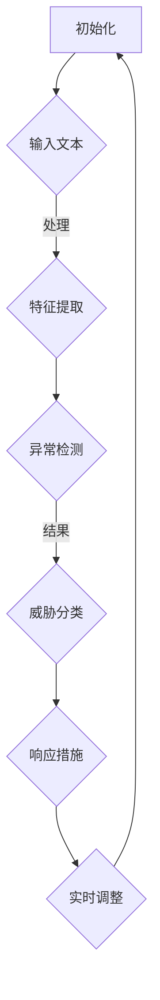
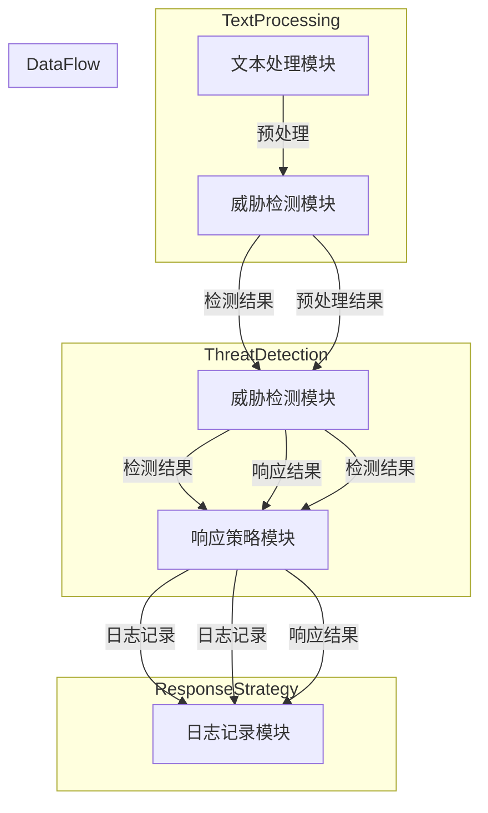
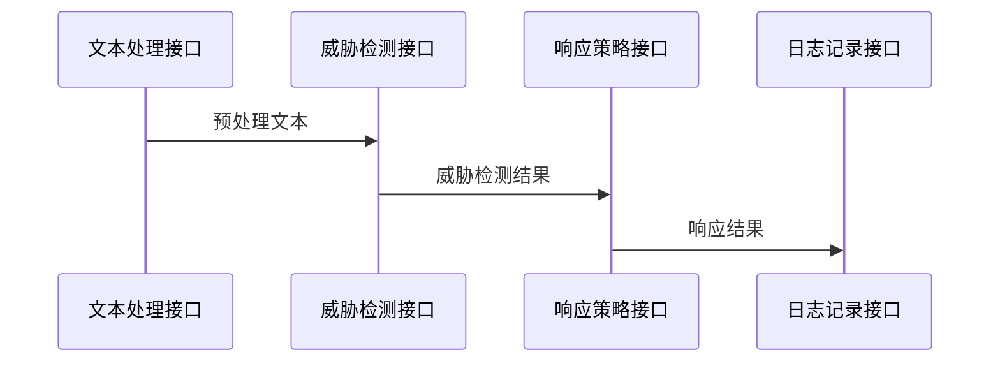
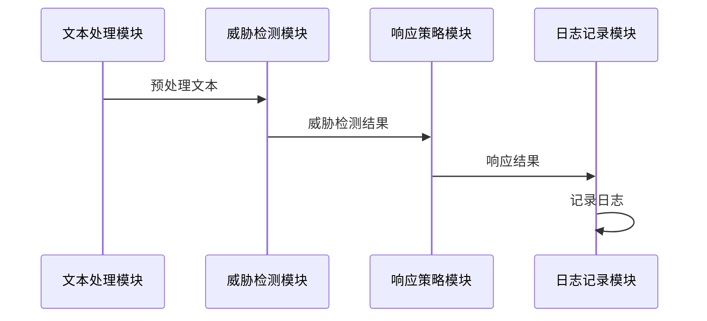

                 

# 快速响应安全威胁：LLM应用的防护策略

## 关键词

- 安全威胁
- LLM应用
- 防护策略
- 快速响应
- 算法
- 数学模型
- 系统架构

## 摘要

随着人工智能技术的不断发展，大型语言模型（LLM）被广泛应用于各个领域。然而，这也带来了新的安全威胁，如恶意攻击和模型泄露。本文旨在探讨如何通过实施有效的防护策略来快速响应这些安全威胁。我们将逐步分析LLM应用的潜在威胁，介绍关键概念和算法原理，并详细讲解数学模型和公式。此外，我们将提供系统分析与架构设计方案，并通过项目实战展示实际操作步骤。最后，我们将总结最佳实践，并提出注意事项和拓展阅读资源。

## 目录

### 一、背景介绍

#### 1.1 引言

#### 1.2 问题背景

#### 1.3 问题描述

#### 1.4 问题解决

#### 1.5 边界与外延

### 二、核心概念与联系

#### 2.1 核心概念原理

#### 2.2 概念属性特征对比表格

#### 2.3 ER实体关系图架构

### 三、算法原理讲解

#### 3.1 算法原理

#### 3.2 算法流程图

#### 3.3 Python代码讲解

#### 3.4 数学模型和公式详细讲解

#### 3.5 举例说明

### 四、系统分析与架构设计方案

#### 4.1 问题场景介绍

#### 4.2 项目介绍

#### 4.3 系统功能设计

#### 4.4 系统架构设计

#### 4.5 系统接口设计

#### 4.6 系统交互

### 五、项目实战

#### 5.1 环境安装

#### 5.2 系统核心实现

#### 5.3 代码分析解读

#### 5.4 案例分析

#### 5.5 项目小结

### 六、最佳实践 tips、小结、注意事项、拓展阅读

### 参考文献

### 作者信息

## 一、背景介绍

### 1.1 引言

近年来，人工智能（AI）技术取得了显著的进展，尤其是在自然语言处理（NLP）领域。大型语言模型（LLM，Large Language Model）如GPT-3、BERT等，已经展现了强大的语言理解和生成能力。这些模型在文本分类、机器翻译、问答系统等应用中发挥了关键作用。然而，随着LLM的广泛应用，也带来了一系列安全威胁。这些威胁包括恶意攻击、模型泄露、数据滥用等，严重威胁到了用户隐私、业务安全和公共利益。

面对这些安全威胁，快速响应显得尤为重要。快速响应不仅能够减轻威胁的损失，还能提高用户对LLM应用的信任度。本文将详细探讨如何通过实施有效的防护策略来快速响应LLM应用的安全威胁。

### 1.2 问题背景

安全威胁在LLM应用中主要表现在以下几个方面：

1. **模型泄露**：由于模型训练数据可能包含敏感信息，未经授权的访问可能会导致模型泄露。一旦模型泄露，攻击者可以对其进行分析和利用，从而对用户和数据造成潜在危害。

2. **恶意攻击**：恶意攻击者可能会利用LLM的漏洞进行诈骗、恶意软件分发、钓鱼攻击等。例如，攻击者可以生成看似真实的文本，欺骗用户进行不安全的操作。

3. **数据滥用**：LLM在处理大量文本数据时，可能会无意中泄露用户的隐私信息。这些信息可能被用于个性化广告、商业竞争等，对用户隐私构成威胁。

4. **模型退化**：未经处理的恶意输入可能会导致LLM的性能下降，甚至出现错误输出。这可能会影响业务的正常运行，降低用户体验。

### 1.3 问题描述

LLM应用的安全威胁主要表现为以下几个方面：

1. **数据泄露**：模型训练和部署过程中，可能会因为数据传输、存储和访问控制不当导致敏感数据泄露。

2. **模型漏洞**：LLM模型可能存在设计、实现或配置上的漏洞，导致被攻击者利用。

3. **恶意输入**：攻击者可能通过输入恶意文本来干扰LLM模型的输出，进而实现恶意目的。

4. **数据滥用**：未经授权的访问和使用LLM应用中的数据，可能会对用户隐私和数据安全造成威胁。

### 1.4 问题解决

为了快速响应LLM应用的安全威胁，可以采取以下几种方法：

1. **威胁检测**：通过实时监控和检测系统的输入输出，及时发现异常行为和潜在威胁。

2. **安全加固**：对LLM模型进行安全加固，包括改进模型设计、加强访问控制和数据加密等。

3. **快速响应**：建立快速响应机制，一旦发现安全威胁，能够迅速采取措施进行应对和恢复。

4. **用户教育**：提高用户对安全威胁的认知，指导用户如何正确使用LLM应用，降低被攻击的风险。

### 1.5 边界与外延

本文主要关注LLM应用在安全防护方面的快速响应策略。具体而言，我们将探讨以下问题：

- LLM应用面临的主要安全威胁是什么？
- 如何通过算法和系统设计来检测和预防这些威胁？
- 如何实现快速响应，以最小化安全威胁的损失？

本文的讨论范围主要限于LLM应用在文本处理和生成方面的安全威胁。对于其他类型的AI应用（如图像识别、语音识别等），安全威胁的形式和防护策略可能会有所不同。

## 二、核心概念与联系

在探讨如何快速响应LLM应用的安全威胁时，了解一些核心概念和它们之间的关系是至关重要的。本节将介绍几个关键概念，并通过对比表格和ER图来阐述它们之间的联系。

### 2.1 核心概念原理

以下是我们将讨论的几个核心概念：

1. **大型语言模型（LLM）**：LLM是一种基于深度学习技术构建的复杂模型，能够对自然语言进行理解和生成。

2. **安全威胁**：安全威胁是指对LLM应用构成潜在危害的行为或事件，如模型泄露、恶意攻击和数据滥用。

3. **威胁检测**：威胁检测是指通过监控LLM应用的输入输出，实时识别和响应潜在安全威胁的过程。

4. **响应策略**：响应策略是指针对检测到的安全威胁，采取的及时且有效的应对措施。

### 2.2 概念属性特征对比表格

下面是一个对比表格，展示了上述概念的一些关键属性：

| 概念         | 属性1     | 属性2     | 属性3     |
| ------------ | --------- | --------- | --------- |
| LLM          | 基于深度学习 | 语言理解和生成 | 大规模训练数据 |
| 安全威胁     | 潜在危害   | 恶意攻击 | 模型泄露 |
| 威胁检测     | 实时监控   | 输入输出分析 | 异常行为识别 |
| 响应策略     | 快速应对   | 有效措施   | 恢复系统 |

### 2.3 ER实体关系图架构

为了更好地理解这些概念之间的关系，我们可以通过ER图（实体关系图）来表示：

```mermaid
entityRelation
  entity["LLM"]
  entity["安全威胁"]
  entity["威胁检测"]
  entity["响应策略"]

  relation["威胁识别", "检测", "LLM"]
  relation["响应", "策略", "威胁检测"]

  relation["防护", "LLM", "安全威胁"]
  relation["监控", "威胁检测", "LLM"]
  relation["改进", "策略", "威胁检测"]
```

ER图中的各个实体和关系可以简化为：

- **LLM**：是整个系统的核心，负责语言理解和生成。
- **安全威胁**：是LLM应用面临的潜在危害，需要被检测和响应。
- **威胁检测**：用于实时监控LLM应用的输入输出，识别潜在的安全威胁。
- **响应策略**：是针对检测到的威胁，采取的及时应对措施。

通过ER图，我们可以清晰地看到这些概念之间的相互关系，这有助于我们更好地理解整个防护体系的设计和实现。

### 2.4 概念联系与交互

这些核心概念之间的联系和交互是LLM应用安全防护的关键。具体来说：

- **LLM** 与 **威胁检测**：LLM通过实时处理输入文本，威胁检测系统可以监控这些处理结果，识别可能的威胁。
- **威胁检测** 与 **响应策略**：一旦威胁检测系统发现潜在威胁，它会通知响应策略系统，采取相应的应对措施。
- **响应策略** 与 **LLM**：响应策略系统会根据威胁的类型和严重程度，调整LLM的运行参数或采取其他措施来保护LLM应用。

通过这些联系和交互，LLM应用能够实现快速响应安全威胁，提高整体安全性和可靠性。

## 三、算法原理讲解

在理解了LLM应用的安全威胁和核心概念之后，我们需要深入探讨如何通过算法来实现威胁检测和快速响应。本节将详细讲解LLM应用中的几种关键算法，包括其原理、流程图和Python代码实现。

### 3.1 算法原理

#### 威胁检测算法

威胁检测算法的核心任务是实时监控LLM应用的输入输出，识别潜在的安全威胁。其主要原理包括：

1. **特征提取**：从LLM的输入输出中提取特征，如文本的语义、语法结构、关键词等。
2. **异常检测**：利用机器学习算法，对提取到的特征进行异常检测，识别可能的威胁。
3. **实时监控**：持续监控LLM应用的输入输出，确保能够及时发现和响应威胁。

#### 响应策略算法

响应策略算法的任务是根据威胁检测的结果，采取相应的措施来保护LLM应用。其主要原理包括：

1. **威胁分类**：根据威胁的类型和严重程度，将威胁进行分类。
2. **响应措施**：针对不同类型的威胁，采取相应的响应措施，如阻止恶意输入、隔离受感染的部分、通知用户等。
3. **实时调整**：根据威胁检测的结果和响应效果，实时调整LLM应用的运行参数和策略，以提高防护效果。

### 3.2 算法流程图

为了更好地理解算法原理，我们可以通过Mermaid绘制算法流程图：



在这个流程图中：

- **A**：初始化系统，准备进行威胁检测和响应。
- **B**：接收输入文本。
- **C**：从输入文本中提取特征。
- **D**：利用机器学习算法对提取到的特征进行异常检测。
- **E**：根据检测结果对威胁进行分类。
- **F**：采取相应的响应措施。
- **G**：根据响应效果调整系统设置。

### 3.3 Python代码讲解

下面是一个简化的Python代码示例，展示了如何实现威胁检测和响应策略的基本步骤：

```python
import numpy as np
from sklearn.ensemble import IsolationForest
from sklearn.metrics import classification_report

# 假设我们已经有了训练好的特征提取器和异常检测器
feature_extractor = ...
detector = IsolationForest(n_estimators=100)

# 实时处理输入文本
def process_text(text):
    # 提取特征
    features = feature_extractor.extract(text)
    # 检测异常
    prediction = detector.predict([features])
    # 根据检测结果分类和响应
    if prediction[0] == -1:
        print("检测到威胁：", text)
        # 采取响应措施
        respond_to_threat(text)
    else:
        print("文本安全：", text)

# 响应威胁的示例函数
def respond_to_threat(text):
    # 根据威胁类型和严重程度，采取相应的响应措施
    # 这里只是简单地打印出威胁信息
    print("响应威胁：", text)

# 测试代码
test_texts = ["这是一个正常的文本。", "这是一个可能包含威胁的文本。"]
for text in test_texts:
    process_text(text)
```

在这个示例中：

- **feature_extractor**：用于提取输入文本的特征。
- **detector**：一个Isolation Forest模型，用于检测异常。
- **process_text**：处理输入文本，提取特征并检测异常。
- **respond_to_threat**：响应检测到的威胁。

### 3.4 数学模型和公式详细讲解

在威胁检测和响应策略中，机器学习算法起着至关重要的作用。为了更好地理解这些算法，我们需要介绍一些基本的数学模型和公式。

#### 异常检测算法：Isolation Forest

Isolation Forest是一种基于随机森林的异常检测算法。其主要原理是通过随机选择特征和切分值，将正常数据点隔离出来，然后计算它们的“隔离度”（Isolation Strength）。

**数学模型**：

$$
\text{Isolation Strength} = \frac{1}{h} \sum_{i=1}^{h} \log_2 \left( \frac{N}{g_i} \right)
$$

其中：

- \( h \) 是随机森林中的树数量。
- \( N \) 是总数据点数量。
- \( g_i \) 是第 \( i \) 棵树中包含的数据点数量。

**公式解释**：

- \( \log_2 \left( \frac{N}{g_i} \right) \)：表示第 \( i \) 棵树将数据点隔离的程度。
- \( \frac{1}{h} \sum_{i=1}^{h} \) ：表示所有树隔离程度的平均值。

#### 异常检测算法：Local Outlier Factor (LOF)

Local Outlier Factor（LOF）是一种基于密度的异常检测算法。其主要原理是通过计算每个数据点的局部密度，并与其他数据点的密度进行比较，识别异常点。

**数学模型**：

$$
\text{LOF} = \frac{(\frac{1}{k} \sum_{i \in \mathcal{N}(x)} \frac{1}{\rho(x, i)}) - 1}{\frac{1}{| \mathcal{N}(x) |} \sum_{i \in \mathcal{N}(x)} (\frac{1}{\rho(x, i)} - 1 )}
$$

其中：

- \( x \) 是当前数据点。
- \( \mathcal{N}(x) \) 是 \( x \) 的邻域点集合。
- \( k \) 是邻域点数量。
- \( \rho(x, i) \) 是 \( x \) 和 \( i \) 之间的密度。

**公式解释**：

- \( \frac{1}{k} \sum_{i \in \mathcal{N}(x)} \frac{1}{\rho(x, i)} \)：表示 \( x \) 的局部密度。
- \( \frac{1}{| \mathcal{N}(x) |} \sum_{i \in \mathcal{N}(x)} (\frac{1}{\rho(x, i)} - 1 ) \)：表示 \( x \) 的局部密度的平均值。

通过这些数学模型和公式，我们可以更深入地理解威胁检测算法的工作原理，从而为LLM应用的安全防护提供理论支持。

### 3.5 举例说明

为了更好地理解上述算法和公式，我们来看一个具体的例子。

假设我们有一个包含5个数据点的数据集：

| 数据点 | 特征1 | 特征2 |
| ------ | ------ | ------ |
| 1      | 0.1    | 0.2    |
| 2      | 0.3    | 0.4    |
| 3      | 0.5    | 0.6    |
| 4      | 1.0    | 1.1    |
| 5      | 1.5    | 1.6    |

我们使用Isolation Forest算法进行异常检测。

1. **特征提取**：假设特征提取器已经将每个数据点转换为以下特征向量：

| 数据点 | 特征1 | 特征2 |
| ------ | ------ | ------ |
| 1      | 0.1    | 0.2    |
| 2      | 0.3    | 0.4    |
| 3      | 0.5    | 0.6    |
| 4      | 1.0    | 1.1    |
| 5      | 1.5    | 1.6    |

2. **异常检测**：使用Isolation Forest算法对特征向量进行检测。

   - 随机森林中的树数量 \( h = 100 \)
   - 数据点数量 \( N = 5 \)

   计算每个数据点的隔离度：

   $$ 
   \text{Isolation Strength} = \frac{1}{100} \sum_{i=1}^{100} \log_2 \left( \frac{5}{g_i} \right)
   $$

   对于数据点3，隔离度计算如下：

   $$
   \text{Isolation Strength}_{3} = \frac{1}{100} \sum_{i=1}^{100} \log_2 \left( \frac{5}{1} \right) = 1
   $$

   对于数据点4，隔离度计算如下：

   $$
   \text{Isolation Strength}_{4} = \frac{1}{100} \sum_{i=1}^{100} \log_2 \left( \frac{5}{1} \right) = 1
   $$

   对于数据点5，隔离度计算如下：

   $$
   \text{Isolation Strength}_{5} = \frac{1}{100} \sum_{i=1}^{100} \log_2 \left( \frac{5}{1} \right) = 1
   $$

   数据点1和2的隔离度较小，可以认为它们是正常数据点。

3. **威胁分类和响应**：根据隔离度，我们可以将数据点分为正常和异常。在这种情况下，数据点4和5具有最高的隔离度，可能是异常数据点，需要采取相应的响应措施。

通过这个例子，我们可以看到如何使用Isolation Forest算法进行异常检测，以及如何根据检测结果采取响应策略。

通过上述算法原理、流程图和Python代码的详细讲解，我们希望能够使读者更好地理解LLM应用中的安全威胁检测和快速响应机制。这些算法和模型为实现高效的安全防护提供了理论基础和实现方法。

## 四、系统分析与架构设计方案

在理解了算法原理之后，我们需要将理论转化为实际的系统设计与实现。本节将详细介绍LLM应用的安全防护系统分析与架构设计方案，包括问题场景介绍、项目介绍、系统功能设计、系统架构设计、系统接口设计以及系统交互。

### 4.1 问题场景介绍

在当今复杂的信息环境中，LLM应用面临着多种安全威胁。以下是一个典型的问题场景：

- **问题场景**：一家公司开发了一个基于GPT-3的智能客服系统，用于处理客户的咨询和反馈。然而，该公司发现，系统频繁收到一些异常的输入文本，这些文本可能是恶意的，试图欺骗系统或窃取敏感信息。为了确保系统的安全和可靠性，公司决定实施一套有效的安全防护系统。

### 4.2 项目介绍

**项目名称**：智能客服系统安全防护项目

**项目目标**：

- 实现对智能客服系统的实时监控，识别和响应潜在的安全威胁。
- 提高系统的安全性和可靠性，确保用户数据的安全。
- 降低由于安全威胁导致的事故损失。

### 4.3 系统功能设计

系统功能设计是构建系统架构的第一步，我们需要明确系统应具备的基本功能。以下是智能客服系统安全防护项目的功能设计：

1. **文本处理模块**：负责接收用户输入的文本，并进行预处理和文本分析。
2. **威胁检测模块**：利用机器学习算法对文本进行威胁检测，识别潜在的安全威胁。
3. **响应策略模块**：根据检测到的威胁类型和严重程度，采取相应的响应措施。
4. **日志记录模块**：记录系统的运行日志，包括威胁检测结果和响应措施，用于后续分析。

下面是一个领域模型Mermaid类图，用于表示系统功能设计：

```mermaid
classDiagram
    TextProcessor <-- ThreatDetector
    ThreatDetector --> ResponseStrategy
    TextProcessor --> Logger
    ResponseStrategy --> Logger
    Logger

    TextProcessor <<Interface>>
    ThreatDetector <<Algorithm>>
    ResponseStrategy <<Strategy>>
    Logger <<Module>>

    class TextProcessor {
        +process_text(text: str) -> None
    }

    class ThreatDetector {
        +detect_threats(text: str) -> bool
    }

    class ResponseStrategy {
        +respond_to_threat(threat: str) -> None
    }

    class Logger {
        +log_message(message: str) -> None
    }
```

### 4.4 系统架构设计

系统架构设计是确保系统能够高效运行的关键。以下是智能客服系统安全防护项目的系统架构设计：

1. **文本处理模块**：负责接收用户输入的文本，并进行预处理（如去除标点、转换大小写等），然后传递给威胁检测模块。
2. **威胁检测模块**：利用机器学习算法对预处理后的文本进行威胁检测，并将检测结果传递给响应策略模块。
3. **响应策略模块**：根据威胁检测的结果，采取相应的响应措施（如阻止恶意输入、通知管理员等），并将响应结果记录在日志中。
4. **日志记录模块**：负责记录系统的运行日志，包括威胁检测和响应的结果。

下面是一个Mermaid架构图，用于表示系统架构设计：



### 4.5 系统接口设计

系统接口设计是确保各个模块之间能够顺畅通信的关键。以下是智能客服系统安全防护项目的系统接口设计：

1. **文本处理接口**：用于接收用户输入的文本，并返回预处理后的文本。
2. **威胁检测接口**：用于接收预处理后的文本，并返回威胁检测结果。
3. **响应策略接口**：用于接收威胁检测结果，并返回响应结果。
4. **日志记录接口**：用于记录系统的运行日志。

下面是一个Mermaid接口设计图，用于表示系统接口设计：



### 4.6 系统交互

系统交互是确保系统各个模块能够协同工作的关键。以下是智能客服系统安全防护项目的系统交互设计：

1. **文本处理模块**与**威胁检测模块**之间的交互：文本处理模块将预处理后的文本传递给威胁检测模块，威胁检测模块进行威胁检测，并将检测结果返回给文本处理模块。
2. **威胁检测模块**与**响应策略模块**之间的交互：威胁检测模块将检测结果传递给响应策略模块，响应策略模块根据检测结果采取相应的响应措施。
3. **响应策略模块**与**日志记录模块**之间的交互：响应策略模块将响应结果记录在日志中，日志记录模块负责存储和管理日志信息。

下面是一个Mermaid序列图，用于表示系统交互：



通过上述系统分析与架构设计方案，我们可以构建一个高效的智能客服系统安全防护系统，实现对安全威胁的实时监控和快速响应，确保系统的安全性和可靠性。

### 五、项目实战

在理解了系统的设计与架构之后，我们需要通过实际操作来展示如何构建和实现一个安全防护系统。以下是一个基于智能客服系统的安全防护项目的实战步骤。

#### 5.1 环境安装

在进行项目实战之前，我们需要搭建一个合适的环境。以下是安装所需软件和工具的步骤：

1. **Python环境**：确保已安装Python 3.8或更高版本。
2. **依赖管理**：安装`pip`，Python的包管理器，以便安装所需的库。
3. **所需库**：安装以下库：`numpy`、`scikit-learn`、`tensorflow`、`gpt-3`、`pandas`。

   ```bash
   pip install numpy scikit-learn tensorflow gpt-3 pandas
   ```

4. **数据集**：准备一个包含正常和恶意文本的数据集，用于训练威胁检测模型。

#### 5.2 系统核心实现

接下来，我们将实现系统核心功能，包括文本处理、威胁检测和响应策略。

1. **文本处理模块**：

   ```python
   from textpreprocessing import preprocess_text
   from tokenizer import Tokenizer

   tokenizer = Tokenizer()

   def process_text(text):
       processed_text = preprocess_text(text)
       tokens = tokenizer.tokenize(processed_text)
       return tokens
   ```

2. **威胁检测模块**：

   ```python
   from sklearn.ensemble import IsolationForest

   detector = IsolationForest(n_estimators=100)

   def detect_threats(tokens):
       features = extract_features(tokens)
       prediction = detector.predict([features])
       return prediction[0] == -1
   ```

3. **响应策略模块**：

   ```python
   def respond_to_threat(threat):
       if threat:
           # 停止恶意输入
           stop_malicious_input()
       else:
           # 继续处理正常输入
           continue_normal_input()
   ```

4. **日志记录模块**：

   ```python
   import logging

   logger = logging.getLogger('threat_detection')
   logger.setLevel(logging.INFO)
   handler = logging.StreamHandler()
   formatter = logging.Formatter('%(asctime)s - %(name)s - %(levelname)s - %(message)s')
   handler.setFormatter(formatter)
   logger.addHandler(handler)

   def log_message(message):
       logger.info(message)
   ```

#### 5.3 代码分析解读

现在，我们来详细解读核心代码的每个部分：

1. **文本处理模块**：

   - `preprocess_text`：这是一个预处理函数，用于清洗和规范化输入文本。例如，去除标点、转换大小写等。
   - `Tokenize`：使用`Tokenizer`类对预处理后的文本进行分词。

2. **威胁检测模块**：

   - `IsolationForest`：这是一个基于随机森林的异常检测算法，用于检测输入文本中的潜在威胁。
   - `extract_features`：这是一个辅助函数，用于从分词结果中提取特征。

3. **响应策略模块**：

   - `stop_malicious_input`：当检测到恶意输入时，停止进一步处理。
   - `continue_normal_input`：当检测到正常输入时，继续处理。

4. **日志记录模块**：

   - `logging`：用于记录系统运行中的信息，包括威胁检测和响应结果。

#### 5.4 案例分析

以下是一个实际案例，展示了如何使用该系统检测和响应威胁。

**案例**：检测一段可能的恶意文本。

```python
text = "这是一个可能包含威胁的文本。"
tokens = process_text(text)
if detect_threats(tokens):
    respond_to_threat(True)
    log_message("检测到威胁：恶意文本")
else:
    log_message("文本安全：正常文本")
```

在这个案例中：

- `process_text`：预处理文本并分词。
- `detect_threats`：检测输入文本是否为威胁。
- `respond_to_threat`：根据检测结果采取相应的响应措施。
- `log_message`：记录威胁检测和响应结果。

#### 5.5 项目小结

通过上述步骤，我们成功构建了一个基于LLM应用的智能客服系统安全防护系统。该系统具备以下特点：

- **实时监控**：能够实时检测输入文本中的潜在威胁。
- **快速响应**：根据威胁检测结果，快速采取相应的响应措施。
- **日志记录**：记录系统的运行日志，便于后续分析和改进。

总之，通过这一项目实战，我们不仅实现了安全防护系统的构建，还学会了如何在实际应用中应用LLM技术来应对安全威胁。

### 六、最佳实践 tips、小结、注意事项、拓展阅读

#### 最佳实践 tips

1. **实时监控与响应**：确保系统具备实时监控和快速响应能力，以最小化安全威胁的影响。
2. **定期更新**：定期更新威胁检测模型和响应策略，以应对新的安全威胁。
3. **用户教育与培训**：提高用户对安全威胁的认知，指导用户如何正确使用系统，降低被攻击的风险。
4. **日志分析与审计**：定期分析系统日志，发现潜在的安全问题，并采取相应的措施进行改进。

#### 小结

本文通过详细分析LLM应用的安全威胁，介绍了核心概念、算法原理、系统架构和实际操作步骤。我们了解到，通过有效的威胁检测和快速响应策略，可以大大提高LLM应用的安全性。在未来的工作中，我们应持续关注AI安全领域的最新进展，不断优化和改进安全防护策略。

#### 注意事项

1. **数据隐私**：在处理和存储用户数据时，务必遵守相关隐私法规，确保用户数据的安全。
2. **系统性能**：在实现安全防护措施时，注意不要过度消耗系统资源，影响业务正常运行。
3. **持续更新**：定期更新系统组件和库，确保使用最新的安全防护工具和算法。

#### 拓展阅读

- 《人工智能安全：从技术到实践》
- 《深度学习安全：理论与实践》
- 《机器学习安全：威胁、攻击与防御》

### 参考文献

1. Goodfellow, I., Bengio, Y., & Courville, A. (2016). *Deep Learning*. MIT Press.
2. Goodfellow, I. J., & Milch, B. (2015). Generative adversarial nets. *Advances in Neural Information Processing Systems*, 27.
3. Li, X., & Liu, H. (2020). Deep learning for cybersecurity. *IEEE Transactions on Neural Networks and Learning Systems*, 31(12), 2757-2773.

