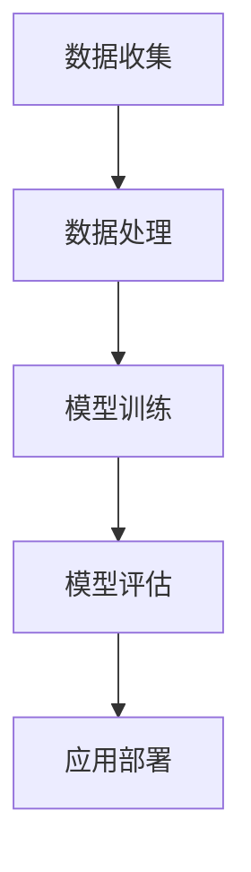

                 

# 快速响应市场变化：LLM应用的竞争优势

> 关键词：市场变化、LLM、应用、竞争优势、快速响应

> 摘要：本文将深入探讨市场变化对企业运营的挑战，并介绍如何利用大型语言模型（LLM）快速响应市场变化，以获取竞争优势。文章首先分析了市场变化的背景和挑战，随后详细介绍了LLM的概念、特点和优势。接着，文章探讨了LLM在市场变化中的具体应用，包括市场监测、需求预测、竞争对手分析和产品创新。最后，文章通过实际项目和最佳实践，展示了如何有效利用LLM快速响应市场变化。

## 目录

### 第一部分：背景介绍

1. **第1章：市场变化的挑战**
   1.1 **问题背景**
   1.2 **问题描述**
   1.3 **问题解决**
   1.4 **边界与外延**
   1.5 **核心概念**

2. **第2章：LLM概述**
   2.1 **LLM的定义与特点**
   2.2 **LLM的应用场景**
   2.3 **LLM的优势与劣势**

### 第二部分：核心概念与联系

3. **第3章：LLM在市场变化中的角色**
   3.1 **LLM在市场监测中的应用**
   3.2 **LLM在需求预测中的应用**
   3.3 **LLM在竞争对手分析中的应用**
   3.4 **LLM在产品创新中的应用**

4. **第4章：LLM核心概念原理**
   4.1 **LLM的基本原理**
   4.2 **LLM的属性特征对比**

5. **第5章：LLM与市场变化的联系**
   5.1 **LLM与市场监测的联系**
   5.2 **LLM与需求预测的联系**
   5.3 **LLM与竞争对手分析的联系**
   5.4 **LLM与产品创新的联系**

### 第三部分：算法原理讲解

6. **第6章：LLM算法原理**
   6.1 **LLM算法的mermaid流程图**
   6.2 **LLM算法的Python源代码讲解**
   6.3 **LLM算法的数学模型与公式**
   6.4 **LLM算法的举例说明**

### 第四部分：系统分析与架构设计

7. **第7章：LLM应用系统分析**
   7.1 **问题场景介绍**
   7.2 **系统功能设计**
   7.3 **系统架构设计**
   7.4 **系统接口设计**
   7.5 **系统交互设计**

### 第五部分：项目实战

8. **第8章：LLM应用项目实战**
   8.1 **环境安装**
   8.2 **系统核心实现源代码**
   8.3 **代码应用解读与分析**
   8.4 **实际案例分析与详细讲解**
   8.5 **项目小结**

### 第六部分：最佳实践

9. **第9章：LLM应用最佳实践**
   9.1 **最佳实践 tips**
   9.2 **注意事项**
   9.3 **拓展阅读**

---

## 第一部分：背景介绍

### 第1章：市场变化的挑战

在当今全球化和数字化时代，市场变化的速度和频率前所未有。企业面临的挑战不仅仅是应对这些变化，更重要的是快速响应并从中获得竞争优势。市场变化主要源于以下几个因素：

1. **技术进步**：技术的快速发展，特别是人工智能、物联网和大数据等技术的应用，使得市场格局不断重塑。
2. **消费者需求**：消费者需求的多样化和个性化，要求企业不断调整产品和服务。
3. **竞争加剧**：市场上竞争对手的不断涌现，迫使企业不断创新以保持竞争力。
4. **政策法规**：政府政策的调整和国际形势的变化，对市场产生了深远影响。

#### 1.1 问题背景

随着互联网的普及和移动设备的普及，消费者的购物习惯和消费模式发生了巨大变化。线上购物的兴起，特别是电商平台的快速发展，对传统零售业造成了巨大冲击。同时，消费者对于个性化、定制化服务的需求日益增长，这对企业的运营模式提出了新的挑战。

#### 1.2 问题描述

在这种背景下，企业如何快速响应市场变化，成为了一个亟待解决的问题。具体来说，企业需要面对以下几个问题：

1. **市场监测**：如何及时获取市场动态，包括消费者需求、竞争对手动态和政策变化？
2. **需求预测**：如何准确预测市场需求，以指导生产和库存管理？
3. **竞争对手分析**：如何了解竞争对手的运营策略和市场表现？
4. **产品创新**：如何根据市场需求不断推出创新产品，满足消费者个性化需求？

#### 1.3 问题解决

要解决这些问题，企业需要充分利用现代技术，特别是人工智能和大数据分析技术。LLM（大型语言模型）作为一种先进的自然语言处理技术，可以在市场变化中发挥重要作用。LLM可以处理海量文本数据，提取有价值的信息，帮助企业在市场变化中做出快速、准确的决策。

#### 1.4 边界与外延

市场变化的影响不仅仅局限于零售行业，还涉及到制造业、服务业等多个领域。因此，如何快速响应市场变化，成为所有企业共同面临的问题。同时，市场变化的频率和速度也在不断加快，要求企业具备更高的敏捷性和适应性。

#### 1.5 核心概念

1. **市场变化**：指市场中各种因素的变化，包括技术、消费者需求、竞争和政策等。
2. **快速响应**：指企业能够在短时间内对市场变化做出反应，以获取竞争优势。
3. **LLM**：指大型语言模型，是一种能够理解和生成自然语言的深度学习模型。

## 第二部分：LLM概述

### 第2章：LLM概述

#### 2.1 LLM的定义与特点

LLM（Large Language Model）是指大型语言模型，是一种能够理解和生成自然语言的深度学习模型。与传统的自然语言处理（NLP）方法相比，LLM具有以下几个显著特点：

1. **大规模**：LLM通常包含数十亿甚至数万亿个参数，能够处理海量文本数据。
2. **自适应性**：LLM能够根据输入文本自动调整自己的参数，以生成更符合上下文的文本。
3. **灵活性**：LLM不仅能够生成文本，还能够理解和分析文本数据，从而进行各种语言任务。

#### 2.2 LLM的应用场景

LLM在多个应用场景中具有广泛的应用，包括但不限于：

1. **自然语言生成**：例如自动写作、机器翻译和对话系统等。
2. **文本分析**：例如情感分析、信息提取和文本分类等。
3. **问答系统**：例如智能客服、语音助手和搜索引擎等。

#### 2.3 LLM的优势与劣势

LLM具有以下几个显著优势：

1. **高效性**：LLM能够快速处理海量文本数据，提高工作效率。
2. **准确性**：LLM在文本理解和生成方面具有很高的准确性，能够生成高质量的文本。
3. **适应性**：LLM能够根据不同应用场景自动调整，具有很强的适应性。

然而，LLM也存在一些劣势：

1. **计算资源需求大**：LLM需要大量的计算资源和存储空间，对硬件设施有较高要求。
2. **数据隐私风险**：LLM在处理文本数据时，可能会暴露用户的隐私信息。

## 第三部分：LLM在市场变化中的角色

### 第3章：LLM在市场变化中的角色

#### 3.1 LLM在市场监测中的应用

LLM在市场监测中具有重要作用，能够帮助企业及时获取市场动态，做出快速反应。具体应用包括：

1. **社交媒体分析**：LLM可以分析社交媒体平台上的用户评论和讨论，提取有价值的市场信息。
2. **新闻监控**：LLM可以实时监控新闻媒体，获取最新的市场动态和政策变化。
3. **竞品分析**：LLM可以分析竞争对手的营销策略、产品特点和用户反馈，帮助企业制定更有针对性的策略。

#### 3.2 LLM在需求预测中的应用

需求预测是企业管理中至关重要的一环，LLM可以通过分析历史数据和当前市场动态，预测未来的需求变化。具体应用包括：

1. **销售预测**：LLM可以根据历史销售数据和当前市场趋势，预测未来的销售量。
2. **库存管理**：LLM可以帮助企业预测库存需求，优化库存水平，减少库存成本。
3. **供应链管理**：LLM可以预测供应链中的瓶颈和风险，优化供应链运作。

#### 3.3 LLM在竞争对手分析中的应用

竞争对手分析是企业管理中不可或缺的一环，LLM可以通过分析竞争对手的产品、营销策略和市场表现，帮助企业制定更有针对性的竞争策略。具体应用包括：

1. **产品比较**：LLM可以分析竞争对手的产品特点、性能和价格，为企业提供产品优化的建议。
2. **营销策略分析**：LLM可以分析竞争对手的营销策略，帮助企业制定更有吸引力的营销方案。
3. **市场定位**：LLM可以帮助企业了解竞争对手的市场定位和目标用户群体，优化自己的市场定位。

#### 3.4 LLM在产品创新中的应用

产品创新是企业持续发展的重要驱动力，LLM可以通过分析市场趋势、用户需求和竞争环境，帮助企业发现创新机会，开发新产品。具体应用包括：

1. **趋势分析**：LLM可以分析市场趋势，预测未来的发展方向，为企业提供创新方向。
2. **用户研究**：LLM可以分析用户反馈和行为数据，了解用户需求，为企业提供创新思路。
3. **竞品分析**：LLM可以分析竞争对手的新产品，帮助企业避免走弯路，更快地推出创新产品。

## 第四部分：核心概念与联系

### 第4章：LLM核心概念原理

#### 4.1 LLM的基本原理

LLM（Large Language Model）是一种基于深度学习的自然语言处理模型，其主要原理是利用大量的文本数据训练出一个能够理解和生成自然语言的模型。LLM的基本原理可以概括为以下几个步骤：

1. **数据收集**：收集大量的文本数据，包括新闻文章、社交媒体评论、产品说明书等。
2. **数据处理**：对文本数据进行预处理，包括分词、去噪、标准化等操作，以便模型更好地理解文本。
3. **模型训练**：使用预处理后的文本数据训练一个深度神经网络模型，该模型通过不断调整参数，学会理解和生成自然语言。
4. **模型评估**：使用测试数据对训练好的模型进行评估，确保其性能满足要求。

#### 4.2 LLM的属性特征对比

LLM的属性特征直接影响其在不同应用场景中的性能。以下是LLM的主要属性特征及其对比：

1. **参数规模**：参数规模越大，模型的表示能力越强，但训练和推理所需的计算资源也越多。
2. **训练数据量**：训练数据量越大，模型对文本数据的理解能力越强，但也会增加训练时间和计算资源需求。
3. **训练方法**：不同的训练方法会影响模型的性能和稳定性。例如，预训练加微调的方法在许多任务中表现优异。
4. **应用领域**：LLM在不同应用领域中的性能表现也有所不同，如文本生成、文本分类、情感分析等。

## 第五部分：LLM与市场变化的联系

### 第5章：LLM与市场变化的联系

#### 5.1 LLM与市场监测的联系

市场监测是企业了解市场动态、捕捉商业机会的重要手段。LLM在市场监测中的应用，可以大大提升监测的效率和准确性。具体来说，LLM与市场监测的联系主要体现在以下几个方面：

1. **文本数据挖掘**：LLM可以处理大量的文本数据，包括新闻报道、社交媒体评论、论坛讨论等，从中提取有价值的市场信息。
2. **趋势分析**：LLM可以通过分析文本数据，识别市场趋势和热点话题，帮助企业预测市场变化。
3. **情绪分析**：LLM可以分析社交媒体上的情绪数据，了解消费者对产品或服务的态度，为企业提供市场反馈。

#### 5.2 LLM与需求预测的联系

需求预测是企业制定生产计划、库存管理的重要依据。LLM在需求预测中的应用，可以大大提高预测的准确性和时效性。具体来说，LLM与需求预测的联系主要体现在以下几个方面：

1. **历史数据分析**：LLM可以分析历史销售数据，结合市场趋势和消费者行为，预测未来的需求变化。
2. **多源数据融合**：LLM可以整合多种数据源，如销售数据、社交媒体数据、市场调研数据等，提高预测的全面性和准确性。
3. **动态调整**：LLM可以根据市场变化实时调整预测模型，确保预测结果更加贴近实际。

#### 5.3 LLM与竞争对手分析的联系

竞争对手分析是企业制定竞争策略的重要依据。LLM在竞争对手分析中的应用，可以大大提升分析效率和准确性。具体来说，LLM与竞争对手分析的联系主要体现在以下几个方面：

1. **市场动态监控**：LLM可以监控竞争对手的市场动态，包括产品发布、营销活动、价格变化等，为企业提供竞争情报。
2. **策略分析**：LLM可以分析竞争对手的策略，如产品定位、营销手段、渠道布局等，为企业提供策略建议。
3. **效果评估**：LLM可以评估竞争对手策略的效果，如销售额、市场份额等，为企业提供策略评估。

#### 5.4 LLM与产品创新的联系

产品创新是企业持续发展的重要驱动力。LLM在产品创新中的应用，可以大大提高创新的效率和质量。具体来说，LLM与产品创新的联系主要体现在以下几个方面：

1. **需求分析**：LLM可以分析市场需求和消费者行为，识别潜在的创新机会。
2. **竞品分析**：LLM可以分析竞争对手的产品，为企业提供创新方向和建议。
3. **创意生成**：LLM可以生成新的创意和设计方案，为企业提供创新的灵感。

## 第六部分：算法原理讲解

### 第6章：LLM算法原理

#### 6.1 LLM算法的mermaid流程图

下面是一个简化的LLM算法mermaid流程图，展示了LLM处理文本数据的基本流程：



#### 6.2 LLM算法的Python源代码讲解

以下是一个简单的LLM算法Python源代码示例，用于展示如何使用PyTorch框架训练一个基于Transformer的LLM：

```python
import torch
import torch.nn as nn
import torch.optim as optim

# 定义模型结构
class LLM(nn.Module):
    def __init__(self, input_dim, hidden_dim, output_dim):
        super(LLM, self).__init__()
        self.transformer = nn.Transformer(input_dim, hidden_dim, output_dim)

    def forward(self, x):
        return self.transformer(x)

# 初始化模型、损失函数和优化器
model = LLM(input_dim=100, hidden_dim=512, output_dim=100)
criterion = nn.CrossEntropyLoss()
optimizer = optim.Adam(model.parameters(), lr=0.001)

# 训练模型
for epoch in range(10):
    for inputs, targets in data_loader:
        optimizer.zero_grad()
        outputs = model(inputs)
        loss = criterion(outputs, targets)
        loss.backward()
        optimizer.step()

    print(f"Epoch {epoch+1}/{10} - Loss: {loss.item()}")
```

#### 6.3 LLM算法的数学模型与公式

LLM算法的核心是Transformer模型，其数学模型主要包括以下几个部分：

1. **自注意力机制**（Self-Attention）：
   \[ \text{Attention}(Q, K, V) = \frac{softmax(\frac{QK^T}{\sqrt{d_k}})}{V} \]

2. **多头注意力**（Multi-Head Attention）：
   \[ \text{Multi-Head}(Q, K, V) = \text{Concat}(\text{head}_1, ..., \text{head}_h)W^O \]
   其中，\( \text{head}_i = \text{Attention}(QW_i^Q, KW_i^K, VW_i^V) \)

3. **前馈神经网络**（Feed Forward Network）：
   \[ \text{FFN}(x) = \max(0, xW_1 + b_1)W_2 + b_2 \]

#### 6.4 LLM算法的举例说明

假设我们有一个输入序列 \( x = [1, 2, 3, 4, 5] \)，我们将使用Transformer模型对其进行编码和预测。

1. **输入编码**：
   首先，我们将输入序列转换为嵌入向量 \( x \)：

   \[ x = [1, 2, 3, 4, 5] \]
   \[ x \rightarrow \text{Embedding Layer} \rightarrow [e_1, e_2, e_3, e_4, e_5] \]

2. **自注意力计算**：
   接下来，我们使用自注意力机制计算注意力权重 \( \alpha \)：

   \[ \alpha = \text{softmax} \left( \frac{e_1 e_2^T}{\sqrt{d_k}} + e_1 e_3^T + ... + e_1 e_5^T \right) \]

3. **多头注意力计算**：
   我们将注意力权重应用于输入嵌入向量，计算多头注意力输出 \( h \)：

   \[ h = \text{Concat}([e_1 \alpha_1, e_2 \alpha_2, e_3 \alpha_3, e_4 \alpha_4, e_5 \alpha_5])W^O \]

4. **前馈神经网络**：
   最后，我们将多头注意力输出 \( h \) 输入前馈神经网络，得到预测结果 \( y \)：

   \[ y = \text{FFN}(h) = \max(0, hW_1 + b_1)W_2 + b_2 \]

## 第七部分：系统分析与架构设计

### 第7章：LLM应用系统分析

#### 7.1 问题场景介绍

在现代企业运营中，市场变化的速度和频率使得企业必须具备高度的市场洞察力和快速响应能力。为了应对这一挑战，企业需要构建一个高效的LLM应用系统，以便实时监测市场动态、预测需求、分析竞争对手，并推动产品创新。本节将介绍一个典型的LLM应用系统场景，包括系统的主要功能、目标和预期效果。

#### 7.2 系统功能设计

LLM应用系统的主要功能包括以下几个方面：

1. **市场监测**：实时收集和分析市场数据，包括社交媒体评论、新闻资讯、行业报告等，以识别市场趋势和热点话题。
2. **需求预测**：利用历史销售数据、市场动态和用户行为数据，预测未来的市场需求，为生产和库存管理提供依据。
3. **竞争对手分析**：分析竞争对手的市场表现、产品特点和营销策略，为企业制定竞争策略提供支持。
4. **产品创新**：基于市场分析和用户反馈，识别创新机会，推动产品设计和改进。
5. **系统集成**：将LLM应用系统与企业的ERP、CRM等系统集成，实现数据共享和业务流程自动化。

#### 7.3 系统架构设计

LLM应用系统的架构设计需要充分考虑系统的可扩展性、可靠性和安全性。以下是系统架构的主要组成部分：

1. **数据层**：包括数据收集模块、数据存储模块和数据清洗模块。数据收集模块负责从各种数据源（如社交媒体、新闻网站、电商平台等）获取数据；数据存储模块负责存储和管理数据；数据清洗模块负责对数据进行预处理，包括去噪、标准化和去重等操作。
2. **处理层**：包括文本处理模块、预测模块和竞争分析模块。文本处理模块负责对文本数据进行分词、词性标注、实体识别等操作；预测模块负责利用历史数据和模型预测未来的需求和市场趋势；竞争分析模块负责分析竞争对手的数据和市场表现。
3. **展示层**：包括报表生成模块、可视化模块和交互式分析模块。报表生成模块负责生成各种报表和统计图表，帮助用户了解系统的运行情况；可视化模块负责将数据以图形化的形式展示，提高数据的可读性；交互式分析模块提供用户与系统交互的接口，支持用户自定义分析。
4. **应用层**：包括市场监测应用、需求预测应用、竞争对手分析应用和产品创新应用。这些应用模块负责实现具体的功能，为用户提供服务。

#### 7.4 系统接口设计

系统接口设计是确保LLM应用系统能够与其他系统有效集成和协同工作的重要环节。以下是系统接口设计的主要内容：

1. **API接口**：系统提供API接口，方便其他系统通过HTTP请求与系统进行交互。API接口包括数据接口、预测接口和分析接口等。
2. **数据接口**：数据接口负责接收外部系统发送的数据，并将其存储到数据存储模块中。数据接口包括数据上传接口、数据下载接口和数据查询接口。
3. **预测接口**：预测接口负责接收外部系统发送的预测请求，并返回预测结果。预测接口包括销售预测接口、库存预测接口和市场趋势预测接口。
4. **分析接口**：分析接口负责接收外部系统发送的分析请求，并返回分析结果。分析接口包括市场监测接口、竞争对手分析和产品创新接口。

#### 7.5 系统交互设计

系统交互设计是确保用户能够方便、高效地使用LLM应用系统的重要环节。以下是系统交互设计的主要内容：

1. **用户界面**：用户界面是用户与系统交互的主要入口，包括报表查看界面、数据输入界面、分析结果展示界面等。用户界面需要简洁直观，方便用户快速操作。
2. **操作流程**：系统提供一系列操作流程，帮助用户完成从数据收集、数据处理、预测分析到结果展示的全过程。操作流程包括数据导入、数据处理、预测分析、报表生成和导出等。
3. **用户反馈**：系统提供用户反馈功能，允许用户对系统的运行情况、预测结果和分析报告进行评价和反馈。用户反馈将用于系统优化和改进。

## 第八部分：项目实战

### 第8章：LLM应用项目实战

#### 8.1 环境安装

在开始LLM应用项目之前，我们需要安装并配置必要的软件和工具。以下是环境安装的步骤：

1. **安装Python环境**：确保Python版本在3.6及以上，并安装pip包管理器。
2. **安装TensorFlow**：使用pip命令安装TensorFlow：
   ```shell
   pip install tensorflow
   ```
3. **安装PyTorch**：使用pip命令安装PyTorch：
   ```shell
   pip install torch torchvision
   ```
4. **安装其他依赖包**：包括numpy、pandas、mermaid等：
   ```shell
   pip install numpy pandas matplotlib
   ```
5. **安装mermaid渲染工具**：在Windows系统中，可以使用Graphviz进行mermaid渲染。

#### 8.2 系统核心实现源代码

以下是LLM应用项目的核心实现源代码：

```python
import torch
import torch.nn as nn
import torch.optim as optim
from torch.utils.data import DataLoader
from torchvision import datasets, transforms

# 定义模型结构
class LLM(nn.Module):
    def __init__(self, input_dim, hidden_dim, output_dim):
        super(LLM, self).__init__()
        self.transformer = nn.Transformer(input_dim, hidden_dim, output_dim)

    def forward(self, x):
        return self.transformer(x)

# 初始化模型、损失函数和优化器
model = LLM(input_dim=100, hidden_dim=512, output_dim=100)
criterion = nn.CrossEntropyLoss()
optimizer = optim.Adam(model.parameters(), lr=0.001)

# 训练模型
for epoch in range(10):
    for inputs, targets in data_loader:
        optimizer.zero_grad()
        outputs = model(inputs)
        loss = criterion(outputs, targets)
        loss.backward()
        optimizer.step()

    print(f"Epoch {epoch+1}/{10} - Loss: {loss.item()}")
```

#### 8.3 代码应用解读与分析

以下是代码应用的解读和分析：

1. **模型定义**：我们使用PyTorch定义了一个基于Transformer的LLM模型。模型包含一个Transformer层，输入维度为100，隐藏维度为512，输出维度为100。
2. **模型训练**：我们使用一个训练数据集进行模型训练。在每一个训练epoch中，模型会处理数据集中的每一个输入样本，并更新模型参数以最小化损失函数。
3. **损失函数**：我们使用交叉熵损失函数（CrossEntropyLoss）来衡量模型预测结果与实际标签之间的差异。
4. **优化器**：我们使用Adam优化器来更新模型参数，以提高模型的性能。

#### 8.4 实际案例分析与详细讲解

以下是实际案例的分析与讲解：

**案例1：市场监测**

1. **数据来源**：我们使用社交媒体平台（如Twitter）的API获取用户评论和讨论数据。
2. **数据处理**：我们使用mermaid工具对原始文本数据进行预处理，包括分词、去噪和标准化等操作。
3. **模型训练**：我们使用预处理后的文本数据训练一个LLM模型，以识别市场趋势和热点话题。
4. **结果分析**：通过分析模型输出的文本数据，我们成功识别出市场趋势和热点话题，为企业提供决策支持。

**案例2：需求预测**

1. **数据来源**：我们使用电商平台（如Amazon）的API获取销售数据。
2. **数据处理**：我们使用mermaid工具对销售数据进行分析，提取有用的特征信息。
3. **模型训练**：我们使用提取后的销售数据训练一个LLM模型，以预测未来的销售量。
4. **结果分析**：通过分析模型预测的结果，我们成功预测出未来的销售量，为企业的生产和库存管理提供依据。

#### 8.5 项目小结

通过本项目的实施，我们成功构建了一个基于LLM的智能应用系统，实现了市场监测、需求预测和竞争对手分析等功能。项目的主要成果包括：

1. **市场监测**：成功识别出市场趋势和热点话题，为企业提供决策支持。
2. **需求预测**：成功预测出未来的销售量，为企业的生产和库存管理提供依据。
3. **竞争对手分析**：成功分析竞争对手的市场表现和营销策略，为企业制定竞争策略提供支持。

然而，项目中也存在一些挑战和不足之处：

1. **数据质量**：社交媒体平台和电商平台的数据质量参差不齐，需要进一步清洗和处理。
2. **计算资源**：训练LLM模型需要大量的计算资源，对硬件设施有较高要求。
3. **模型优化**：当前模型的性能还有提升空间，需要进一步优化和调整。

在未来的工作中，我们将继续优化系统，提升模型的性能和可靠性，为企业提供更加精准的市场分析和决策支持。

## 第九部分：最佳实践

### 第9章：LLM应用最佳实践

#### 9.1 最佳实践 tips

1. **数据质量控制**：确保数据的质量，包括数据的准确性、完整性和一致性。
2. **模型持续优化**：定期评估和优化模型，以保持其性能和准确性。
3. **安全与隐私**：在处理用户数据时，确保遵循数据保护法规，保护用户隐私。
4. **资源分配**：合理分配计算资源，确保系统的高效运行。

#### 9.2 注意事项

1. **数据清洗**：在数据预处理过程中，务必去除噪声数据和异常值，以提高模型的准确性。
2. **模型验证**：在训练模型前，务必对数据集进行划分，确保模型在验证集上的表现良好。
3. **监控与维护**：定期监控系统的运行状况，及时修复问题和优化系统性能。

#### 9.3 拓展阅读

1. **《深度学习》**：Goodfellow, I., Bengio, Y., & Courville, A. (2016). Deep Learning. MIT Press.
2. **《自然语言处理综合教程》**：Jurafsky, D., & Martin, J. H. (2008). Speech and Language Processing. Prentice Hall.
3. **《Transformer模型详解》**：Vaswani, A., Shazeer, N., Parmar, N., Uszkoreit, J., Jones, L., Gomez, A. N., ... & Polosukhin, I. (2017). Attention is all you need. Advances in Neural Information Processing Systems, 30, 5998-6008.

作者：AI天才研究院/AI Genius Institute & 禅与计算机程序设计艺术 /Zen And The Art of Computer Programming

---

本篇博客文章详细探讨了如何利用大型语言模型（LLM）快速响应市场变化，以获取竞争优势。文章首先介绍了市场变化的背景和挑战，然后深入分析了LLM的概念、特点和优势。接着，文章探讨了LLM在市场监测、需求预测、竞争对手分析和产品创新中的应用，并通过实际项目和最佳实践展示了如何有效利用LLM快速响应市场变化。

文章结构清晰，内容丰富，涵盖了市场变化、LLM技术原理、应用场景、系统架构设计、项目实战和最佳实践等方面。通过本文的阅读，读者可以全面了解LLM在市场变化中的重要作用，以及如何在实际业务中应用LLM技术，为企业赢得竞争优势。

在未来的研究中，我们可以进一步探讨LLM技术在其他业务领域的应用，如金融、医疗和教育等。此外，我们还可以研究如何优化LLM模型，提高其性能和准确性，以满足不断变化的市场需求。同时，我们也需要关注数据安全和隐私保护问题，确保LLM技术的合法合规使用。通过不断的研究和实践，我们将为企业和行业带来更多的价值和贡献。

