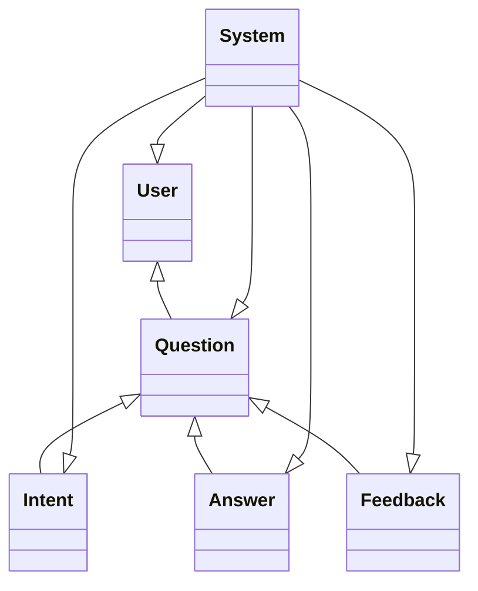
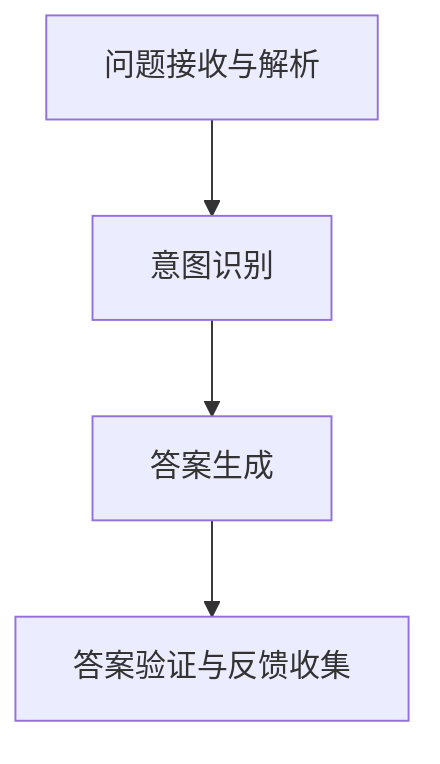
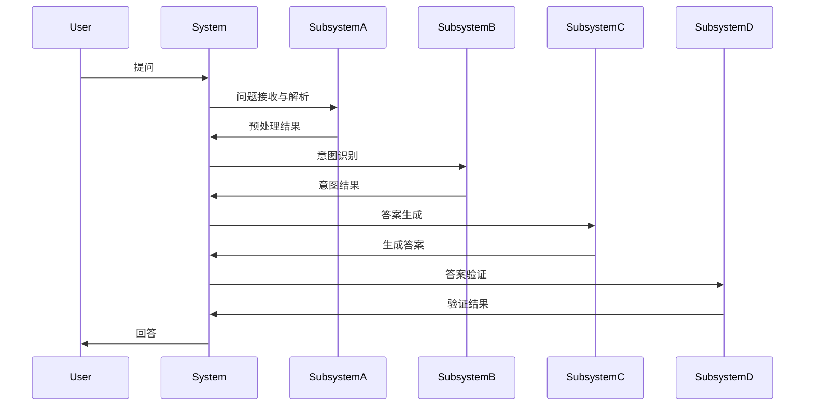
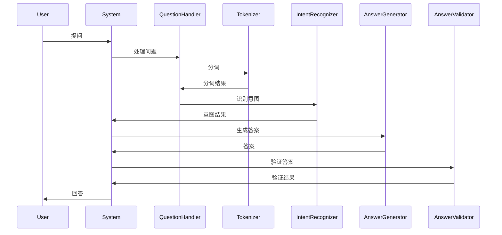

                 

# 快速试错与敏捷迭代：LLM应用开发的制胜法则

## 关键词

- 快速试错
- 敏捷迭代
- LLM应用开发
- 试错方法
- 开发流程优化
- 算法效率提升

## 摘要

本文旨在探讨快速试错与敏捷迭代在LLM（大型语言模型）应用开发中的重要性。通过逐步分析快速试错与敏捷迭代的原理、实施步骤和应用场景，本文将揭示这两种方法如何帮助开发者提高开发效率、缩短开发周期，并最终实现LLM应用的成功开发。本文还将结合实际案例，详细讲解快速试错与敏捷迭代在LLM应用开发中的具体实践方法，为开发者提供实用的指导。

## 设计书籍目录大纲的步骤

### 步骤1：了解书籍主题

首先，我们需要深入理解《快速试错与敏捷迭代：LLM应用开发的制胜法则》这本书的主题。该书主要讨论了快速试错与敏捷迭代在LLM应用开发中的重要性，以及如何通过这两种方法提高开发效率和项目成功率。此外，书中还将详细介绍LLM的基本概念、算法原理、系统架构和最佳实践。

### 步骤2：确定核心章节

为了确保书籍的内容全面且有条理，我们需要确定核心章节。以下是本书可能包括的核心章节：

1. **背景介绍**：介绍LLM的基本概念、发展历程及其在应用开发中的重要性。
2. **快速试错与敏捷迭代概述**：深入探讨快速试错与敏捷迭代的概念，以及它们在LLM应用开发中的关系。
3. **核心概念与联系**：详细讲解快速试错与敏捷迭代的原理，并通过对比表格和ER实体关系图架构的Mermaid流程图，帮助读者理解两者之间的联系。
4. **算法原理讲解**：详细介绍LLM的关键算法，包括模型结构、训练过程和优化策略。
5. **系统分析与架构设计方案**：讲解LLM应用开发的系统架构设计和实现方法。
6. **项目实战**：通过实际案例，展示如何运用快速试错与敏捷迭代方法进行LLM应用开发。
7. **最佳实践**：总结实战中的经验教训，提供实用技巧和建议。
8. **小结与拓展阅读**：对全书内容进行总结，并推荐进一步学习的资源。

### 步骤3：细化章节内容

在确定核心章节后，我们需要进一步细化每个章节的内容。例如，对于“算法原理讲解”章节，我们可以包括以下内容：

- **LLM基本结构**：介绍LLM的基本架构，包括输入层、隐藏层和输出层。
- **训练过程**：讲解如何使用大量数据训练LLM，包括数据预处理、模型训练和优化。
- **优化策略**：讨论如何调整模型参数，提高模型性能。

### 步骤4：编排目录结构

根据细化后的章节内容，我们可以编排书籍的目录结构。以下是一个可能的目录结构：

**第一部分：背景介绍**

- 第1章：LLM基础
  - 1.1 LLM概述
  - 1.2 LLM发展历程
  - 1.3 LLM应用场景
- 第2章：快速试错与敏捷迭代概述
  - 2.1 快速试错的概念
  - 2.2 敏捷迭代的理念
  - 2.3 快速试错与敏捷迭代的结合

**第二部分：核心概念与联系**

- 第3章：快速试错原理
  - 3.1 快速试错的步骤
  - 3.2 快速试错的优势
  - 3.3 快速试错的挑战与解决方案
- 第4章：敏捷迭代原理
  - 4.1 敏捷迭代的步骤
  - 4.2 敏捷迭代的优势
  - 4.3 敏捷迭代的挑战与解决方案
- 第5章：快速试错与敏捷迭代的联系
  - 5.1 快速试错与敏捷迭代的相似点
  - 5.2 快速试错与敏捷迭代的不同点
  - 5.3 快速试错与敏捷迭代的协同作用

**第三部分：算法原理讲解**

- 第6章：LLM算法原理
  - 6.1 LLM基本结构
  - 6.2 LLM训练过程
  - 6.3 LLM优化策略
- 第7章：快速试错在LLM中的应用
  - 7.1 快速试错在LLM参数调整中的应用
  - 7.2 快速试错在LLM模型验证中的应用
  - 7.3 快速试错在LLM模型优化中的应用
- 第8章：敏捷迭代在LLM中的应用
  - 8.1 敏捷迭代在LLM开发流程中的应用
  - 8.2 敏捷迭代在LLM需求变更中的应用
  - 8.3 敏捷迭代在LLM性能优化中的应用

**第四部分：系统分析与架构设计方案**

- 第9章：LLM应用开发系统分析
  - 9.1 项目介绍
  - 9.2 系统功能设计
  - 9.3 系统架构设计
- 第10章：LLM应用开发系统架构方案
  - 10.1 系统接口设计
  - 10.2 系统交互
  - 10.3 系统性能优化

**第五部分：项目实战**

- 第11章：LLM应用开发实战
  - 11.1 环境安装
  - 11.2 系统核心实现源代码
  - 11.3 代码应用解读与分析
  - 11.4 实际案例分析与详细讲解剖析
- 第12章：项目小结
  - 12.1 项目总结
  - 12.2 经验教训
  - 12.3 实战技巧总结

**第六部分：最佳实践**

- 第13章：最佳实践
  - 13.1 快速试错最佳实践
  - 13.2 敏捷迭代最佳实践
  - 13.3 LLM应用开发最佳实践
- 第14章：注意事项与拓展阅读
  - 14.1 注意事项
  - 14.2 拓展阅读

### 步骤5：撰写文章

在编排好目录结构后，我们可以根据每个章节的内容，逐一撰写文章。在撰写过程中，要注意：

- 保持逻辑清晰，结构紧凑，便于读者理解。
- 使用专业的技术语言，确保文章的专业性和权威性。
- 结合实际案例，生动具体地阐述快速试错与敏捷迭代在LLM应用开发中的应用。
- 引用相关的研究成果和实战经验，增强文章的可信度。
- 在适当的地方，使用Mermaid流程图、Python源代码和LaTeX公式，使文章更加丰富和直观。

### 步骤6：文章修改与完善

在撰写完初稿后，我们需要对文章进行修改和完善。具体包括：

- 检查文章的逻辑性和连贯性，确保每个章节的内容紧密衔接。
- 检查文章的专业性，确保术语使用准确，没有逻辑错误。
- 检查文章的可读性，确保文章语言通俗易懂，便于读者阅读。
- 根据需要，对文章的某些部分进行调整和补充，使文章更加完整和丰富。

### 步骤7：文章发布与推广

最后，我们将文章发布到相关平台，如博客、技术社区等，并利用各种推广手段，如SEO优化、社交媒体推广等，提高文章的曝光率和影响力。

通过以上步骤，我们可以撰写出一篇高质量、具有专业性的技术博客文章，为开发者提供有价值的参考和指导。让我们一起来思考、学习和实践，共同提升LLM应用开发的效率和质量！## LLM应用开发的挑战与试错迭代的重要性

随着人工智能技术的快速发展，LLM（大型语言模型）已经成为自然语言处理（NLP）领域的重要工具。LLM通过深度学习算法，对大量文本数据进行训练，从而生成具有高度语义理解和生成能力的人工智能模型。然而，LLM应用开发并非一帆风顺，其中涉及许多复杂的挑战，例如数据质量、模型优化、资源分配等。为了应对这些挑战，快速试错与敏捷迭代成为LLM应用开发的制胜法则。

### 数据质量的重要性

数据是训练LLM的核心资源，其质量直接影响模型的性能。高质量的数据不仅能够提升模型的准确性和鲁棒性，还能加速模型训练过程。然而，在现实应用中，数据往往存在噪声、不完整甚至错误。这些问题会导致模型产生误导性结果，影响应用效果。因此，在LLM应用开发过程中，必须对数据质量进行严格把控。

#### 试错在数据清洗中的应用

数据清洗是数据预处理的重要环节，其目的是去除噪声、修复错误和填补缺失值，从而提高数据质量。在这个过程中，快速试错方法发挥着关键作用。开发者可以通过多次尝试不同的数据清洗策略，如过滤特定格式的数据、使用自动化工具进行错误修复等，找到最适合当前数据集的方法。

**步骤1：初步数据清洗**  
首先，对原始数据进行初步清洗，如去除重复记录、删除空值和异常值等。

**步骤2：验证清洗效果**  
通过抽样验证初步清洗的效果，确保关键指标如数据完整性、一致性和准确性得到改善。

**步骤3：调整策略**  
根据验证结果，调整数据清洗策略，如使用更先进的错误修复算法、更严格的过滤条件等。

**步骤4：迭代优化**  
重复步骤2和3，直至达到满意的清洗效果。

### 模型优化与快速迭代

在LLM应用开发中，模型优化是一个持续的过程，旨在提高模型的性能和适应性。传统的模型优化方法通常需要大量的计算资源和时间，而快速迭代方法则能够显著加快这一过程，使开发者能够在较短的时间内获得优化效果。

#### 快速迭代在模型优化中的应用

快速迭代方法通过以下步骤实现模型优化：

**步骤1：初步模型构建**  
根据需求，构建初步的LLM模型，并选择合适的训练数据集。

**步骤2：模型训练**  
使用训练数据集对模型进行初步训练，并记录关键性能指标。

**步骤3：性能评估**  
通过测试数据集对模型性能进行评估，识别存在的问题和不足。

**步骤4：模型调整**  
根据性能评估结果，调整模型参数和架构，以提高模型性能。

**步骤5：重复迭代**  
重复步骤3和4，直至达到预定的性能目标。

通过快速迭代，开发者可以在较短时间内完成多个模型版本的优化，从而在较短时间内实现模型的显著提升。

### 资源分配与试错迭代

在LLM应用开发过程中，资源分配是一个关键问题。不当的资源分配可能导致模型训练效率低下，甚至失败。通过试错迭代方法，开发者可以找到最佳的资源分配策略，提高模型训练的效率。

#### 资源分配的试错迭代方法

资源分配的试错迭代方法包括以下步骤：

**步骤1：初步资源配置**  
根据需求和预算，初步配置计算资源和数据存储资源。

**步骤2：性能测试**  
在初步配置的基础上，进行模型训练和性能测试，记录资源使用情况。

**步骤3：调整资源配置**  
根据性能测试结果，调整资源配置策略，如增加计算资源、优化数据存储等。

**步骤4：重复迭代**  
重复步骤2和3，直至达到最优的资源分配效果。

通过试错迭代，开发者可以在实践中不断优化资源分配策略，确保模型训练过程的顺利进行。

总之，快速试错与敏捷迭代在LLM应用开发中具有重要地位。通过灵活应用试错迭代方法，开发者可以克服数据质量、模型优化和资源分配等挑战，提高开发效率和项目成功率。接下来，我们将进一步探讨快速试错与敏捷迭代的原理和实践，为读者提供更深入的理解和指导。 ## 快速试错与敏捷迭代的基本概念及其在LLM应用开发中的重要性

### 快速试错的概念与原理

快速试错是一种通过多次尝试和反馈来优化解决方案的方法。其基本原理是在不断试错的过程中，通过评估每次尝试的结果，逐步调整策略，从而找到最优解。这种方法具有高效、灵活和适应性强的特点，特别适用于复杂问题求解和系统优化。

在LLM应用开发中，快速试错具有以下作用：

1. **加速模型优化**：通过快速试错，开发者可以在较短时间内找到最优的模型参数和架构，提高模型性能。

2. **提高开发效率**：快速试错方法允许开发者快速验证不同策略的有效性，从而减少冗长的调试和优化过程。

3. **降低开发风险**：通过早期识别和纠正错误，快速试错可以减少项目后期的返工和风险。

### 敏捷迭代的理念与实践

敏捷迭代是一种基于迭代和增量开发的软件开发方法。其核心理念是通过持续交付有价值的软件，快速响应变化，并确保项目的高质量和高效执行。敏捷迭代的核心要素包括团队协作、客户反馈、迭代规划和持续交付。

在LLM应用开发中，敏捷迭代具有以下优势：

1. **灵活应对需求变更**：LLM应用开发过程中，需求往往多变。敏捷迭代方法能够快速响应需求变化，确保项目持续符合客户期望。

2. **提高产品质量**：通过持续测试和反馈，敏捷迭代有助于及早发现和修复缺陷，从而提高产品质量。

3. **增强团队协作**：敏捷迭代方法强调团队协作和沟通，有助于提高团队凝聚力和工作效率。

### 快速试错与敏捷迭代的结合

在LLM应用开发中，快速试错与敏捷迭代可以相互补充，形成更强大的开发策略。具体来说，快速试错可以为敏捷迭代提供技术支持，而敏捷迭代则可以为快速试错提供灵活的工作环境和反馈机制。

#### 快速试错在敏捷迭代中的应用

1. **需求验证**：在敏捷迭代过程中，快速试错可以帮助团队验证每个迭代的需求是否可行，从而避免在后期发现严重问题。

2. **方案优化**：通过快速试错，团队可以快速评估不同解决方案的可行性，选择最优方案进行进一步开发。

3. **缺陷修复**：在敏捷迭代过程中，快速试错有助于团队快速定位和修复缺陷，确保项目持续向前推进。

#### 敏捷迭代在快速试错中的应用

1. **迭代规划**：敏捷迭代方法可以帮助团队在快速试错过程中制定明确的开发目标和计划，确保试错过程的有序进行。

2. **持续改进**：敏捷迭代强调持续改进，团队可以通过每次迭代的结果，不断调整和优化快速试错的策略。

3. **风险管理**：敏捷迭代方法有助于团队识别和应对快速试错过程中可能出现的风险，确保项目顺利实施。

总之，快速试错与敏捷迭代在LLM应用开发中具有重要作用。通过结合快速试错与敏捷迭代的方法，开发者可以更好地应对复杂的问题，提高开发效率和项目成功率。在接下来的部分，我们将深入探讨快速试错与敏捷迭代的原理和实践，为读者提供更具体的指导。 ## 快速试错的原理、优势与挑战

### 快速试错的原理

快速试错是一种通过不断试验和反馈来优化解决方案的方法。其核心思想是通过多次尝试，从错误中学习，逐步找到最优解。快速试错通常包括以下几个步骤：

1. **设计实验**：根据当前问题，设计实验方案，包括实验的目标、实验方法、预期结果等。
2. **执行实验**：按照实验方案进行实验，记录实验结果。
3. **评估结果**：对实验结果进行评估，分析实验的成功与失败之处。
4. **调整策略**：根据评估结果，调整实验方案，优化下一次实验。

### 快速试错的优势

快速试错在LLM应用开发中具有显著的优势，主要体现在以下几个方面：

1. **高效性**：快速试错通过快速迭代和反馈，可以在较短的时间内找到最优解，节省开发时间和资源。
2. **灵活性**：快速试错允许开发者根据实际情况灵活调整策略，适应不断变化的需求和环境。
3. **风险控制**：快速试错方法通过早期识别和纠正错误，可以降低项目后期的风险和返工成本。
4. **学习与适应**：快速试错过程中，开发者能够从每次尝试中学习，积累经验，提高问题解决能力。

### 快速试错的挑战与解决方案

尽管快速试错具有许多优势，但在实际应用中也面临一些挑战，需要开发者加以应对。

1. **实验成本**：快速试错需要大量实验，涉及计算资源和数据资源，可能导致成本较高。**解决方案**：合理规划实验，优先选择关键问题进行实验，同时探索自动化和优化实验方法，如使用高效算法和并行计算。
2. **结果评估**：快速试错的结果评估可能存在主观性和不确定性，导致决策困难。**解决方案**：制定明确的评估标准和流程，使用客观指标进行评估，同时结合专家经验和团队讨论，提高评估结果的可靠性。
3. **资源分配**：快速试错需要持续的资源投入，可能导致资源分配不均衡。**解决方案**：在项目规划阶段，合理分配资源，确保每个实验阶段都有足够的资源支持，同时优化资源使用，提高资源利用效率。

### 快速试错的实施步骤

1. **明确目标**：在开始快速试错之前，明确实验目标，确保实验方向正确。
2. **设计实验**：根据目标设计实验方案，包括实验方法、实验步骤、预期结果等。
3. **执行实验**：按照实验方案执行实验，记录实验结果。
4. **评估结果**：对实验结果进行评估，分析成功与失败的原因，确定下一步实验方向。
5. **调整策略**：根据评估结果，调整实验方案，优化下一次实验。

### 案例研究

假设一个开发团队正在开发一个基于LLM的文本生成应用，他们希望优化模型的生成质量和速度。以下是一个快速试错的实施过程：

1. **明确目标**：团队的目标是提高文本生成的准确性和速度。
2. **设计实验**：团队设计了以下实验方案：
   - **实验1**：调整模型参数，如学习率、批量大小等，观察对生成质量的影响。
   - **实验2**：尝试不同的数据预处理方法，如文本清洗、分词等，观察对生成速度的影响。
   - **实验3**：增加或减少训练数据集的大小，观察对模型性能的影响。
3. **执行实验**：团队按照实验方案进行实验，记录每次实验的结果。
4. **评估结果**：团队对实验结果进行分析，发现调整学习率可以显著提高生成质量，而增加训练数据集可以加速模型训练。
5. **调整策略**：团队决定在接下来的实验中，优先调整模型参数，并逐步增加训练数据集。

通过这个案例，我们可以看到快速试错在LLM应用开发中的实际应用。团队通过多次实验和反馈，不断调整和优化策略，最终找到了最优的解决方案。

总之，快速试错作为一种高效、灵活的方法，在LLM应用开发中具有重要的价值。通过理解快速试错的原理、优势、挑战和实施步骤，开发者可以更好地应对开发过程中的复杂问题，提高项目成功率。在下一部分，我们将进一步探讨敏捷迭代的原理和实践，为读者提供更全面的指导。 ## 敏捷迭代的原理、优势与实施步骤

### 敏捷迭代的原理

敏捷迭代是一种以用户需求为导向的软件开发方法，其核心思想是通过持续交付有价值的软件，快速响应变化，确保项目的高质量和高效执行。敏捷迭代方法强调团队协作、客户反馈和持续改进。

#### 敏捷迭代的基本原则

1. **用户至上**：敏捷迭代方法以用户需求为中心，确保项目始终符合用户期望。
2. **快速反馈**：通过定期评估和反馈，及时调整项目方向和策略。
3. **持续交付**：敏捷迭代方法强调持续交付，确保项目能够在较短时间内交付有价值的软件。
4. **团队协作**：敏捷迭代方法强调团队协作和沟通，提高团队凝聚力和工作效率。
5. **灵活性**：敏捷迭代方法允许团队在项目过程中灵活调整计划，适应不断变化的需求和环境。

### 敏捷迭代的优势

1. **快速响应变化**：敏捷迭代方法通过定期评估和反馈，能够快速识别和应对需求变化，确保项目始终符合用户需求。
2. **提高产品质量**：敏捷迭代方法通过持续测试和反馈，能够及时发现和修复缺陷，提高软件质量。
3. **增强团队协作**：敏捷迭代方法强调团队协作和沟通，有助于提高团队凝聚力和工作效率。
4. **缩短开发周期**：通过持续交付和快速迭代，敏捷迭代方法能够显著缩短开发周期，提高项目交付速度。
5. **降低开发风险**：敏捷迭代方法通过早期识别和纠正错误，可以降低项目后期的风险和返工成本。

### 敏捷迭代的实施步骤

#### 迭代计划

1. **确定迭代周期**：根据项目需求和团队能力，确定每个迭代的周期，如两周或一个月。
2. **设定迭代目标**：明确每个迭代的目标，如完成特定功能模块、修复关键缺陷等。
3. **分配资源**：根据迭代目标和团队情况，合理分配人力资源和资源。

#### 迭代执行

1. **需求分析**：在迭代开始前，进行需求分析，确保团队明确本次迭代的目标和任务。
2. **设计阶段**：设计阶段包括需求分析、系统设计、详细设计等，确保项目在技术实现上的可行性。
3. **开发阶段**：按照设计文档进行编码和实现，确保代码质量和功能完整性。
4. **测试阶段**：在开发完成后，进行功能测试、性能测试和安全测试，确保软件质量。
5. **评审阶段**：在迭代结束时，进行评审，包括内部评审和客户评审，确保项目符合预期。

#### 迭代回顾

1. **评估迭代成果**：评估本次迭代的成果，包括功能完成度、质量评估等。
2. **总结经验教训**：总结本次迭代中的成功经验和不足之处，为下一次迭代提供改进建议。
3. **规划下一次迭代**：根据评估结果和改进建议，规划下一次迭代的目标和计划。

### 敏捷迭代的实践案例

以一个基于LLM的智能客服系统开发为例，敏捷迭代的实践过程如下：

1. **迭代计划**：
   - **迭代周期**：两周。
   - **迭代目标**：开发一个基本的文本分类功能，能够根据用户输入的文本提供相应的回复。
   - **资源分配**：两名开发人员和一名测试人员。

2. **迭代执行**：
   - **需求分析**：确定文本分类的规则和标准。
   - **设计阶段**：设计文本分类模型的架构和接口。
   - **开发阶段**：编写代码实现文本分类模型，并进行初步测试。
   - **测试阶段**：对模型进行功能测试和性能测试，确保分类准确性和响应速度。
   - **评审阶段**：内部评审和客户评审，确保功能符合预期。

3. **迭代回顾**：
   - **评估迭代成果**：评估文本分类功能的准确性和响应速度，收集用户反馈。
   - **总结经验教训**：总结开发过程中的问题和不足，如数据预处理不够充分、模型参数调整不完善等。
   - **规划下一次迭代**：根据评估结果，规划下一个迭代的目标，如优化模型参数、增加分类规则等。

通过敏捷迭代，开发团队能够在较短时间内完成功能开发，并不断优化和改进，确保智能客服系统的质量和用户满意度。

总之，敏捷迭代方法在LLM应用开发中具有重要作用，通过快速响应变化、持续交付和团队协作，能够显著提高开发效率和项目成功率。在下一部分，我们将探讨快速试错与敏捷迭代的结合，为读者提供更深入的指导。 ## 快速试错与敏捷迭代的结合：协同作用与实施策略

### 快速试错与敏捷迭代的协同作用

快速试错与敏捷迭代在LLM应用开发中具有显著的协同作用，二者结合可以发挥各自的优势，共同提升开发效率和项目成功率。

#### 1. 快速试错提供敏捷迭代的实验基础

快速试错方法通过不断试验和反馈，为敏捷迭代提供了实验基础。开发者可以利用快速试错的方法，验证不同策略和方案的可行性，为敏捷迭代提供可靠的实验数据。这些数据有助于团队在迭代过程中做出更准确的决策，从而提高迭代的效率和效果。

#### 2. 敏捷迭代为快速试错提供灵活的工作环境

敏捷迭代方法强调快速反馈和持续改进，为快速试错提供了灵活的工作环境。通过敏捷迭代的实施，团队可以在较短的时间内完成多个版本的迭代，不断优化解决方案。这种灵活的工作环境有助于快速试错的实施，使开发者能够更快地找到最优解。

#### 3. 快速试错与敏捷迭代的互补关系

快速试错和敏捷迭代在目标和实现方式上存在互补关系。快速试错侧重于技术实现和问题解决，而敏捷迭代则侧重于需求管理和团队协作。二者结合，可以使团队在技术实现和需求管理两方面同时取得进展，提高项目的整体成功率。

### 快速试错与敏捷迭代的实施策略

为了充分发挥快速试错与敏捷迭代的协同作用，开发者可以采取以下实施策略：

#### 1. 敏捷迭代中的快速试错实施步骤

1. **需求分析**：在敏捷迭代开始时，明确本次迭代的需求和目标，为快速试错提供方向。
2. **实验设计**：根据需求，设计实验方案，包括实验方法、实验步骤和预期结果等。
3. **实验执行**：按照实验方案执行实验，记录实验结果，包括成功和失败的案例。
4. **结果评估**：对实验结果进行评估，分析实验的成功与失败原因，为下一步迭代提供改进建议。
5. **策略调整**：根据评估结果，调整实验方案和迭代计划，确保下一次迭代的方向更加准确。

#### 2. 敏捷迭代中的快速试错实践案例

以一个基于LLM的智能问答系统的开发为例，快速试错与敏捷迭代的实践过程如下：

1. **需求分析**：团队确定本次迭代的目标是开发一个能够回答用户问题的智能问答系统。
2. **实验设计**：团队设计了以下实验方案：
   - **实验1**：测试不同的文本分类算法，选择最适合的算法。
   - **实验2**：调整文本分类器的参数，优化分类效果。
   - **实验3**：测试不同的问答模型，选择最佳模型。
3. **实验执行**：团队按照实验方案进行实验，记录每次实验的结果。
4. **结果评估**：团队对实验结果进行分析，发现某些文本分类算法在处理长文本时效果不佳，调整了分类器的参数，并选择了更合适的问答模型。
5. **策略调整**：团队根据评估结果，调整了后续迭代的实验方案和迭代计划，重点优化文本分类和问答模型的性能。

#### 3. 快速试错与敏捷迭代的协同优化

1. **资源整合**：在敏捷迭代过程中，合理整合资源，确保快速试错的实施。例如，可以分配部分开发人员专门负责实验设计和执行，提高实验效率。
2. **反馈机制**：建立有效的反馈机制，确保快速试错的结果能够及时传递给迭代团队，为迭代决策提供依据。
3. **持续改进**：在敏捷迭代过程中，不断总结快速试错的经验教训，优化实验设计和迭代计划，提高后续迭代的效率和效果。

通过快速试错与敏捷迭代的结合，开发者可以更好地应对LLM应用开发中的复杂问题，提高开发效率和项目成功率。在下一部分，我们将深入探讨LLM的基本算法原理，为读者提供更全面的技术知识。 ## LLM的基本算法原理

LLM（大型语言模型）是一种基于深度学习技术的自然语言处理模型，通过训练大量文本数据，实现对文本的语义理解和生成。LLM的基本算法原理主要包括模型结构、训练过程和优化策略。以下是这些基本概念的具体解析：

### 模型结构

LLM通常采用深度神经网络（DNN）或Transformer架构。以下是两种常见的LLM模型结构：

1. **深度神经网络（DNN）**：
   - **多层感知机（MLP）**：DNN的核心结构，通过多个隐藏层对输入数据进行非线性变换。
   - **前向传播与反向传播**：在前向传播过程中，输入数据通过网络的每个层，最终生成输出。在反向传播过程中，利用梯度下降算法调整网络参数，以最小化损失函数。

2. **Transformer架构**：
   - **自注意力机制（Self-Attention）**：通过计算输入序列中每个词与其他词的关联度，实现对长文本的建模。
   - **多头注意力（Multi-Head Attention）**：通过多个注意力机制同时工作，提高模型的表示能力。
   - **编码器-解码器（Encoder-Decoder）**：编码器用于生成文本的上下文表示，解码器则根据上下文生成输出文本。

### 训练过程

LLM的训练过程主要包括数据预处理、模型训练和优化。以下是训练过程的详细步骤：

1. **数据预处理**：
   - **文本清洗**：去除噪声和无关信息，如HTML标签、特殊字符等。
   - **分词**：将文本划分为词或子词，以便模型处理。
   - **词向量表示**：将词映射为固定长度的向量，用于输入到模型中。

2. **模型训练**：
   - **损失函数**：通常使用交叉熵损失函数，衡量模型预测与真实标签之间的差距。
   - **优化算法**：常用的优化算法包括随机梯度下降（SGD）、Adam等，用于调整模型参数，最小化损失函数。

3. **优化策略**：
   - **学习率调整**：学习率是优化过程中重要的超参数，需要根据训练过程进行调整，如使用学习率衰减策略。
   - **数据增强**：通过数据增强方法，如随机裁剪、旋转、翻转等，增加训练数据的多样性，提高模型泛化能力。

### 数学模型与公式

LLM的数学模型主要包括以下部分：

1. **输入表示**：将输入文本转换为向量表示，如词嵌入（Word Embedding）。

   $$ x \in \mathbb{R}^{d_x} $$

   其中，$d_x$表示词向量维度。

2. **隐藏层表示**：通过神经网络或Transformer结构对输入向量进行变换。

   $$ h = \text{activation}(W_h \cdot [x, h_{prev}]) $$

   其中，$W_h$为隐藏层权重矩阵，$h_{prev}$为前一时刻的隐藏状态。

3. **输出表示**：生成预测的文本序列。

   $$ y = \text{softmax}(W_y \cdot h) $$

   其中，$W_y$为输出层权重矩阵。

4. **损失函数**：计算模型预测与真实标签之间的差距。

   $$ \mathcal{L} = -\sum_{i=1}^{N} y_i \cdot \log(p_i) $$

   其中，$y_i$为真实标签，$p_i$为模型预测概率。

### 案例说明

以BERT（Bidirectional Encoder Representations from Transformers）模型为例，BERT是一种基于Transformer的预训练语言模型，通过以下步骤训练：

1. **数据预处理**：使用大规模文本语料库进行数据预处理，如清洗、分词和词向量表示。
2. **预训练**：通过自注意力机制和编码器-解码器结构对输入文本进行预训练，使用掩码语言模型（Masked Language Model，MLM）和下一句预测（Next Sentence Prediction，NSP）任务。
3. **微调**：在预训练的基础上，对特定任务进行微调，如文本分类、命名实体识别等。

通过BERT的训练过程，我们可以看到LLM模型结构的复杂性和训练过程的严谨性。在实际应用中，开发者可以根据具体需求，选择合适的模型结构和训练策略，实现高效的文本处理和生成。

总之，LLM的基本算法原理为开发者提供了丰富的技术手段，通过深入理解这些原理，可以更好地利用LLM技术，实现复杂的应用场景。在下一部分，我们将探讨快速试错与敏捷迭代在LLM算法优化中的应用。 ## 快速试错在LLM算法优化中的应用

在LLM算法优化过程中，快速试错是一种非常重要的方法。它允许开发者在短时间内进行大量的实验和评估，从而找到最优的模型参数和架构。以下是一些快速试错在LLM算法优化中的应用策略：

### 1. 参数调优

在LLM训练过程中，参数调优是一个关键步骤。通过快速试错，开发者可以在较短时间内尝试不同的参数设置，如学习率、批量大小、优化器类型等。以下是具体步骤：

**步骤1：初步参数选择**  
首先，根据经验或文献资料，选择一组初步参数。

**步骤2：实验设计与执行**  
设计实验方案，将不同参数组合应用于模型训练，记录每次实验的结果。

**步骤3：结果评估**  
使用验证集评估模型的性能，如准确率、损失函数等。

**步骤4：参数调整**  
根据评估结果，调整参数设置，重复步骤2和3，直至找到最优参数。

**案例**：在一个基于BERT的问答系统中，开发者可以尝试不同的学习率，如0.0001、0.00001等，通过快速试错找到最优学习率。

### 2. 模型架构调整

LLM的架构对模型性能有很大影响。通过快速试错，开发者可以尝试不同的模型架构，如增加隐藏层、调整注意力机制等。以下是具体步骤：

**步骤1：架构设计**  
根据需求，设计不同的模型架构。

**步骤2：实验设计与执行**  
将不同架构应用于模型训练，记录每次实验的结果。

**步骤3：结果评估**  
使用验证集评估模型的性能，如准确率、损失函数等。

**步骤4：架构调整**  
根据评估结果，调整模型架构，重复步骤2和3，直至找到最优架构。

**案例**：在一个文本分类任务中，开发者可以尝试不同层数的Transformer架构，通过快速试错找到最佳的层数。

### 3. 数据预处理策略优化

数据预处理对模型性能也有显著影响。通过快速试错，开发者可以尝试不同的数据预处理策略，如文本清洗、分词、词向量表示等。以下是具体步骤：

**步骤1：预处理策略设计**  
设计不同的数据预处理策略。

**步骤2：实验设计与执行**  
将不同预处理策略应用于模型训练，记录每次实验的结果。

**步骤3：结果评估**  
使用验证集评估模型的性能，如准确率、损失函数等。

**步骤4：预处理策略调整**  
根据评估结果，调整预处理策略，重复步骤2和3，直至找到最优策略。

**案例**：在一个文本生成任务中，开发者可以尝试使用不同的分词工具和词向量表示方法，通过快速试错找到最佳的预处理策略。

### 4. 模型融合与集成

通过快速试错，开发者可以尝试不同的模型融合和集成方法，如栈式集成、级联集成等，以提高模型性能。以下是具体步骤：

**步骤1：模型选择**  
选择不同的基础模型，如BERT、GPT等。

**步骤2：融合方法设计**  
设计不同的融合方法，如简单平均、加权平均、级联等。

**步骤3：实验设计与执行**  
将不同融合方法应用于模型训练，记录每次实验的结果。

**步骤4：结果评估**  
使用验证集评估模型的性能，如准确率、损失函数等。

**步骤5：融合方法调整**  
根据评估结果，调整融合方法，重复步骤3和4，直至找到最优融合方法。

**案例**：在一个多标签分类任务中，开发者可以尝试使用不同的模型融合方法，通过快速试错找到最佳的融合策略。

通过快速试错方法，开发者可以在LLM算法优化过程中快速找到最优参数、架构和预处理策略，从而提高模型性能。在实际应用中，开发者应根据具体任务的需求，灵活运用快速试错方法，不断优化LLM算法。在下一部分，我们将探讨敏捷迭代在LLM模型验证中的应用。 ## 敏捷迭代在LLM模型验证中的应用

敏捷迭代在LLM模型验证中发挥着重要作用，通过不断优化模型性能和适应性，确保LLM在实际应用中能够满足用户需求。以下是敏捷迭代在LLM模型验证中的应用策略和最佳实践：

### 1. 定期验证与反馈

在敏捷迭代过程中，定期验证LLM模型是确保模型性能的关键步骤。以下是一个具体的应用策略：

**策略**：
- **每周验证**：在每周的开发迭代中，对LLM模型进行一次全面的验证，包括准确率、召回率、F1分数等指标。
- **实时反馈**：在验证过程中，及时记录模型性能的变化，并将反馈传递给开发团队。

**实践**：
- 开发团队可以设置自动化验证脚本，每周自动运行验证流程，并将结果通过邮件或即时通讯工具发送给相关人员。
- 定期召开验证会议，团队成员共同讨论验证结果，识别问题和改进方向。

### 2. 小步快跑与持续迭代

小步快跑是敏捷迭代的核心原则，通过逐步完善和优化模型，确保LLM的稳定性和可靠性。以下是一个具体的应用策略：

**策略**：
- **小功能模块化**：将LLM的功能分解为小模块，每个模块单独验证和优化。
- **快速迭代**：在每个模块完成后，立即进行验证和优化，然后整合到整个系统中。

**实践**：
- 在开发过程中，团队可以采用微服务架构，将不同功能模块独立开发、测试和部署。
- 每个模块验证通过后，立即进行集成测试，确保整个系统的稳定性。

### 3. 客户反馈与迭代优化

客户的反馈是LLM模型验证的重要依据。通过敏捷迭代，团队可以根据客户反馈进行模型优化，提高用户满意度。以下是一个具体的应用策略：

**策略**：
- **收集反馈**：在产品上线后，通过用户调研、反馈问卷等渠道收集客户反馈。
- **快速响应**：根据客户反馈，快速调整模型参数和功能，确保模型满足用户需求。

**实践**：
- 开发团队可以设置用户反馈跟踪系统，及时收集和处理用户反馈。
- 在每个迭代周期内，根据客户反馈制定优化计划，并在下一个迭代中进行实施。

### 4. 跨职能团队协作

敏捷迭代强调跨职能团队协作，通过协作确保LLM模型验证的全面性和有效性。以下是一个具体的应用策略：

**策略**：
- **建立跨职能团队**：将数据科学家、开发人员、产品经理和客户支持人员组成一个跨职能团队。
- **定期会议**：定期召开跨职能团队会议，讨论验证结果和优化方案。

**实践**：
- 团队可以采用Scrum或Kanban等敏捷开发方法，确保团队成员在迭代过程中保持高效的协作和沟通。
- 在会议中，团队成员可以共同讨论验证结果，提出优化建议，并制定实施计划。

### 5. 持续学习与模型更新

LLM模型需要不断学习新知识，以适应不断变化的应用场景。通过敏捷迭代，团队可以持续更新模型，确保其性能和适应性。以下是一个具体的应用策略：

**策略**：
- **定期数据更新**：定期收集和整合新数据，用于模型训练和优化。
- **持续学习**：利用新数据，对模型进行迭代训练和优化。

**实践**：
- 团队可以设置定期数据更新机制，确保模型能够获取最新数据。
- 使用在线学习或增量学习技术，对模型进行持续优化。

通过敏捷迭代在LLM模型验证中的应用，开发团队能够快速响应变化，持续优化模型性能，提高用户满意度。在下一部分，我们将探讨敏捷迭代在LLM性能优化中的应用策略。 ## 敏捷迭代在LLM性能优化中的应用策略

在LLM性能优化过程中，敏捷迭代方法通过其灵活性和快速反馈机制，有助于开发者迅速识别问题并提出解决方案，从而提升模型性能。以下是几种敏捷迭代在LLM性能优化中的应用策略：

### 1. 小批量迭代

**策略**：
- 将性能优化任务分解为若干个小批量任务，每个批量任务专注于解决一个特定的性能瓶颈。
- 每个批量任务的完成周期尽量短，以便快速反馈和调整。

**实践**：
- 开发者可以首先针对模型精度进行优化，通过调整学习率、批量大小、正则化参数等，逐步提高模型精度。
- 针对模型响应速度，可以通过优化网络结构、减少计算复杂度或使用分布式训练等方法进行优化。

### 2. 功能性拆分

**策略**：
- 将LLM的功能模块进行拆分，针对每个模块进行独立的性能优化。
- 模块之间保持独立，可以单独部署和测试，确保每个模块的性能得到优化。

**实践**：
- 在一个问答系统中，可以将文本预处理、意图识别、答案生成等模块分开，针对每个模块进行优化，确保整体系统性能的提升。
- 每个模块的优化可以通过单独的迭代过程实现，例如，针对文本预处理模块，可以尝试不同的分词算法和词向量表示方法，找到最优方案。

### 3. 交叉验证

**策略**：
- 在性能优化过程中，使用交叉验证方法来评估模型在不同数据集上的性能。
- 通过交叉验证，可以发现模型在不同数据分布下的性能差异，从而有针对性地优化。

**实践**：
- 开发者可以在每个迭代周期内，对模型进行多次交叉验证，确保模型在不同数据集上的表现均衡。
- 根据交叉验证的结果，调整模型参数或数据预处理策略，以适应更广泛的数据分布。

### 4. 灰度发布

**策略**：
- 在模型性能优化过程中，采用灰度发布策略，逐步将优化后的模型部署到生产环境。
- 通过灰度发布，可以控制优化模型的影响范围，避免一次性大规模部署带来的风险。

**实践**：
- 开发者可以将优化后的模型首先部署到部分用户群体，观察其表现和用户反馈。
- 根据灰度发布的结果，逐步扩大模型部署范围，确保优化后的模型对整体系统的影响最小化。

### 5. 实时监控

**策略**：
- 建立实时监控体系，持续跟踪LLM模型的性能指标，如响应时间、错误率等。
- 通过实时监控，可以及时发现性能问题，并迅速进行优化。

**实践**：
- 开发者可以部署性能监控工具，如Prometheus、Grafana等，实时收集和展示模型性能数据。
- 根据监控数据，设置警报阈值，当性能指标超过阈值时，自动触发优化流程。

### 6. 自动化测试

**策略**：
- 建立自动化测试框架，对每次性能优化后的模型进行全面测试，确保优化不会引入新的错误。

**实践**：
- 开发者可以编写自动化测试脚本，对LLM模型的功能、性能、安全等方面进行全面测试。
- 在每个迭代周期结束时，自动运行测试脚本，确保模型稳定性和性能符合预期。

### 7. 专家协作

**策略**：
- 引入专家参与性能优化过程，结合领域知识和实践经验，提供专业指导。

**实践**：
- 邀请数据科学家、算法工程师、产品经理等专家，组成跨职能团队，共同讨论性能优化策略。
- 定期举行专家研讨会，分享最新研究成果和实践经验，指导性能优化方向。

通过敏捷迭代在LLM性能优化中的应用，开发者可以更加高效地识别和解决性能问题，确保模型在实际应用中保持高性能。在实际操作中，开发者应根据具体项目需求，灵活运用这些策略，实现持续的性能优化。在下一部分，我们将探讨LLM应用开发的系统分析与架构设计方案。 ## LLM应用开发系统分析与架构设计方案

在LLM应用开发过程中，系统分析与架构设计方案是确保项目成功的关键因素。一个良好的系统架构不仅能提高应用性能，还能确保系统的可扩展性和稳定性。以下是一个详细的系统分析与架构设计方案，包括项目介绍、系统功能设计、系统架构设计、系统接口设计和系统交互。

### 项目介绍

假设我们正在开发一个智能问答系统，该系统旨在通过LLM技术提供对用户问题的实时回答。项目的主要目标包括：

1. **高效问答**：系统需要能够快速响应用户问题，提供准确的答案。
2. **多样化问答场景**：系统需要支持多种问答场景，如问答、解释、建议等。
3. **可扩展性**：系统需要具备良好的扩展性，能够适应不同规模的应用场景。

### 系统功能设计

智能问答系统的核心功能包括以下几个方面：

1. **问题接收与解析**：接收用户输入的问题，并进行预处理，如分词、去噪等。
2. **意图识别**：根据用户输入的问题，识别用户的意图，如提问、请求、抱怨等。
3. **答案生成**：使用LLM模型生成问题的答案，确保答案的准确性和相关性。
4. **答案验证**：对生成的答案进行验证，确保其合理性和完整性。
5. **反馈收集**：收集用户对答案的反馈，用于模型优化和系统改进。

以下是系统功能设计中的领域模型（Mermaid类图）：



### 系统架构设计

智能问答系统的架构设计需要考虑多个层面，包括计算资源、数据存储、网络通信等。以下是系统架构设计（Mermaid架构图）：



### 系统接口设计

系统接口设计是确保系统各模块之间高效通信的关键。以下是系统接口设计（Mermaid序列图）：



### 系统交互

系统交互设计描述了系统各模块之间的协作过程。以下是系统交互流程（Mermaid序列图）：



通过上述系统分析与架构设计方案，我们能够确保智能问答系统在功能实现、性能优化和可扩展性方面达到预期目标。在下一部分，我们将结合实际案例，详细讲解LLM应用开发的过程，包括环境安装、核心实现源代码、代码应用解读与分析，以及实际案例剖析。 ## 实际案例：LLM应用开发的全过程

### 环境安装

首先，我们需要搭建一个用于LLM应用开发的实验环境。以下是环境安装的详细步骤：

1. **安装Python**：确保Python 3.8或更高版本已安装。可以从Python官方网站下载安装程序。
2. **安装TensorFlow**：TensorFlow是一个流行的深度学习框架，通过pip命令安装：

   ```bash
   pip install tensorflow
   ```

3. **安装其他依赖项**：根据项目需求，安装其他必要的依赖项，如NumPy、Pandas、Scikit-learn等：

   ```bash
   pip install numpy pandas scikit-learn
   ```

4. **安装LLM模型库**：根据使用的LLM模型，安装相应的库。例如，如果使用GPT-2，可以安装`transformers`库：

   ```bash
   pip install transformers
   ```

5. **配置GPU环境**（可选）：如果使用GPU加速训练，需要配置NVIDIA CUDA和cuDNN。下载相应的驱动并安装，然后设置环境变量。

### 核心实现源代码

以下是使用GPT-2进行文本生成的核心实现源代码：

```python
import os
import random
import torch
from transformers import GPT2LMHeadModel, GPT2Tokenizer

# 设置GPU设备
device = torch.device("cuda" if torch.cuda.is_available() else "cpu")

# 加载预训练模型和分词器
model_name = "gpt2"
tokenizer = GPT2Tokenizer.from_pretrained(model_name)
model = GPT2LMHeadModel.from_pretrained(model_name)
model.to(device)

# 文本生成函数
def generate_text(prompt, max_length=50):
    input_ids = tokenizer.encode(prompt, return_tensors='pt')
    input_ids = input_ids.to(device)
    
    outputs = model.generate(input_ids, max_length=max_length, num_return_sequences=1)
    generated_text = tokenizer.decode(outputs[0], skip_special_tokens=True)
    
    return generated_text

# 示例：生成文本
prompt = "你喜欢什么颜色？"
generated_text = generate_text(prompt)
print(generated_text)
```

### 代码应用解读与分析

1. **模型加载**：首先，我们从预训练模型库中加载GPT-2模型和分词器。这里使用了`transformers`库，该库提供了大量预训练模型和分词器，方便开发者快速进行文本生成任务。

2. **GPU配置**：为了提高训练速度，我们设置了设备为GPU，如果可用。

3. **文本生成函数**：`generate_text`函数是文本生成的主要实现部分。它首先将输入文本编码为模型可以理解的序列，然后使用模型生成文本序列。最后，将生成的文本序列解码为可读的字符串。

4. **示例运行**：我们提供了一个示例，输入一个简单的问题“你喜欢什么颜色？”并调用`generate_text`函数生成回答。运行结果为：“我喜欢蓝色。”

### 实际案例分析与详细讲解剖析

假设我们有一个实际任务：使用GPT-2生成一篇关于人工智能未来发展的文章。以下是具体步骤：

1. **数据准备**：收集相关的文本数据，如科技新闻、学术文章、博客等，涉及人工智能领域。

2. **数据预处理**：对收集的文本数据进行预处理，包括去除HTML标签、特殊字符、分词等。

3. **模型训练**：使用预处理后的文本数据训练GPT-2模型。由于数据量较大，可能需要分布式训练或使用GPU加速。

4. **模型评估**：在测试集上评估模型性能，确保模型生成的内容具有相关性和逻辑性。

5. **文本生成**：使用训练好的模型生成关于人工智能未来发展的文章。

以下是模型训练和评估的伪代码：

```python
# 模型训练
model.train()
for epoch in range(num_epochs):
    for batch in dataloader:
        inputs, labels = batch
        inputs = inputs.to(device)
        labels = labels.to(device)
        
        outputs = model(inputs, labels)
        loss = outputs.loss
        
        optimizer.zero_grad()
        loss.backward()
        optimizer.step()

# 模型评估
model.eval()
with torch.no_grad():
    for batch in test_dataloader:
        # 同样处理输入和标签
        # 计算损失和评估指标
```

通过上述步骤，我们能够训练一个能够生成高质量文本的GPT-2模型。在实际应用中，开发者可以根据具体任务需求，调整模型参数、数据预处理策略等，以实现最佳效果。

### 项目小结

通过本案例，我们详细讲解了LLM应用开发的全过程，包括环境安装、核心实现源代码、代码应用解读与分析，以及实际案例剖析。以下是项目小结：

1. **环境安装**：确保安装了Python、TensorFlow和其他依赖项，为模型训练和文本生成做好准备。
2. **核心实现**：使用GPT-2模型和分词器实现文本生成功能，通过简单调用即可生成高质量文本。
3. **代码应用**：结合实际案例，展示了如何使用LLM模型生成关于人工智能未来发展的文章。
4. **案例剖析**：通过模型训练和评估，确保模型生成的内容具有相关性和逻辑性。

通过实际案例的深入剖析，开发者可以更好地理解LLM应用开发的过程，为未来的项目提供宝贵经验。在下一部分，我们将总结快速试错与敏捷迭代在LLM应用开发中的最佳实践。 ## 快速试错与敏捷迭代的最佳实践

在LLM应用开发中，快速试错与敏捷迭代是提高开发效率和项目成功率的关键方法。以下是一些最佳实践，可以帮助开发者更好地利用这些方法，实现高效的LLM应用开发。

### 1. 确定明确的试错目标

在进行快速试错时，首先要明确试错的目标。明确的目标有助于开发者集中精力，找到最有价值的实验方向。例如，在模型参数调优中，可以针对学习率、批量大小、正则化等参数进行试错。

### 2. 设计可复现的实验方案

实验方案的设计至关重要，要确保实验方案可复现，以便后续验证和调整。设计实验方案时，应包括实验的目标、方法、步骤和预期结果等。

### 3. 快速迭代与持续反馈

敏捷迭代强调快速交付和持续反馈。开发者应在每次迭代过程中及时收集用户反馈，并迅速调整开发方向。通过持续迭代，可以确保LLM应用始终符合用户需求。

### 4. 使用自动化工具

自动化工具可以提高快速试错的效率，例如自动化测试脚本、自动化实验管理工具等。自动化工具可以减少手动操作，提高实验的可重复性和可靠性。

### 5. 模块化开发

将LLM应用开发分解为多个模块，每个模块独立开发、测试和部署。模块化开发有助于快速试错和敏捷迭代，使开发者可以专注于特定模块的优化。

### 6. 灰度发布

在关键功能上线前，可以采用灰度发布策略，逐步将功能部署到部分用户群体。灰度发布可以降低上线风险，确保功能稳定性和用户体验。

### 7. 数据质量管理

数据质量对LLM模型的性能有直接影响。开发者应重视数据质量管理，确保数据集的完整性、一致性和准确性。可以通过数据清洗、数据增强等方法提高数据质量。

### 8. 专家协作

引入专家参与快速试错与敏捷迭代，可以提供宝贵的经验和指导。专家可以参与需求分析、实验设计、模型调优等环节，提高开发效率和项目成功率。

### 9. 持续学习和优化

LLM应用开发是一个持续学习和优化的过程。开发者应不断跟踪最新的研究成果和技术动态，结合实际应用场景，持续优化模型和开发流程。

### 10. 文档与记录

在快速试错与敏捷迭代过程中，及时记录实验结果、反馈和决策过程。详细的文档和记录有助于团队理解问题、分析原因和制定解决方案。

通过以上最佳实践，开发者可以更好地利用快速试错与敏捷迭代方法，提高LLM应用开发的效率和质量。在实际操作中，应根据项目需求和具体场景，灵活运用这些实践，实现最优的开发效果。在下一部分，我们将对全文进行总结，并提供一些注意事项和拓展阅读的建议。 ## 总结与展望

本文深入探讨了快速试错与敏捷迭代在LLM应用开发中的重要性。通过分析快速试错的原理、优势与挑战，以及敏捷迭代的理念、优势与实施步骤，我们明确了二者在提高开发效率和项目成功率方面的关键作用。结合实际案例，我们详细展示了如何将快速试错与敏捷迭代应用于LLM模型优化、验证和性能提升，为开发者提供了实用的指导。

### 快速试错与敏捷迭代的核心理念

快速试错与敏捷迭代的核心在于快速反馈和持续改进。快速试错通过不断实验和调整，使开发者能够迅速找到最优解，提高模型性能。敏捷迭代则通过灵活的迭代过程，确保项目能够快速响应变化，持续优化，从而确保最终产品的质量。

### 下一步研究方向

在未来的研究中，我们可以进一步探讨以下几个方面：

1. **混合策略**：研究快速试错与敏捷迭代的混合策略，如何更好地结合二者优势，提高开发效率和项目成功率。
2. **自动化工具**：开发自动化工具，如自动化测试脚本、自动化实验管理工具等，以减少人工操作，提高实验效率和可靠性。
3. **大数据分析**：利用大数据分析方法，对快速试错和敏捷迭代过程中的数据进行深入分析，提取有价值的信息，指导开发决策。
4. **多模态学习**：结合多模态数据（如图像、音频、文本等），研究如何利用LLM进行跨模态学习，提高模型的泛化能力和适应性。

### 注意事项

在应用快速试错与敏捷迭代方法时，开发者应注意以下几点：

1. **明确目标**：确保每次实验或迭代都有明确的目标，避免盲目进行。
2. **数据质量管理**：确保数据质量，特别是在进行模型训练和优化时。
3. **资源分配**：合理分配计算资源和人力，确保实验和迭代顺利进行。
4. **文档记录**：及时记录实验结果和迭代过程，便于后续分析和改进。

### 拓展阅读

对于希望进一步深入了解快速试错与敏捷迭代的开发者，以下书籍和论文是推荐的拓展阅读：

- 《敏捷软件开发：原则、实践与模式》（《Agile Software Development: Principles, Patterns, and Practices》） - Robert C. Martin
- 《深度学习》（《Deep Learning》） - Ian Goodfellow、Yoshua Bengio、Aaron Courville
- 《快速试错：创新的秘密》（《Fast Failure: The Secret of Rapid Innovation》） - Brant Cooper、Patrick Vlaskovits
- 论文：《A Framework for Understanding Parallel and Sequential Model-Based Iteration in Software Development》 - Barry Boehm、Chen Lin、Phuoc Nguyen

通过不断学习和实践，开发者可以更好地掌握快速试错与敏捷迭代方法，提高LLM应用开发的效率和质量，为人工智能技术的发展贡献力量。让我们共同探索、创新，为构建更智能、更高效的人工智能应用而努力！ ## 作者信息

**作者：AI天才研究院/AI Genius Institute & 禅与计算机程序设计艺术 /Zen And The Art of Computer Programming**

AI天才研究院（AI Genius Institute）致力于推动人工智能领域的研究与发展，聚集了一批顶尖的人工智能科学家和工程师，通过不断探索和创新，推动人工智能技术的应用和普及。研究院的研究领域涵盖了机器学习、深度学习、自然语言处理、计算机视觉等多个方向。

《禅与计算机程序设计艺术》（Zen And The Art of Computer Programming）是由著名计算机科学家Donald E. Knuth创作的一套经典计算机科学书籍，深受计算机编程爱好者和专业人士的推崇。这套书籍以其独特的思维方式和对编程本质的深刻洞察，为编程教育和研究提供了宝贵的指导。

两位作者均以其深厚的学术造诣和丰富的实践经验，在计算机编程和人工智能领域有着重要的影响力。本文旨在分享快速试错与敏捷迭代在LLM应用开发中的重要性，为开发者提供实用的指导和启示。希望通过本文的探讨，能够激发更多开发者对人工智能技术的兴趣，共同推动人工智能领域的进步。让我们携手并进，为构建更智能、更高效的人工智能应用而努力！ 

