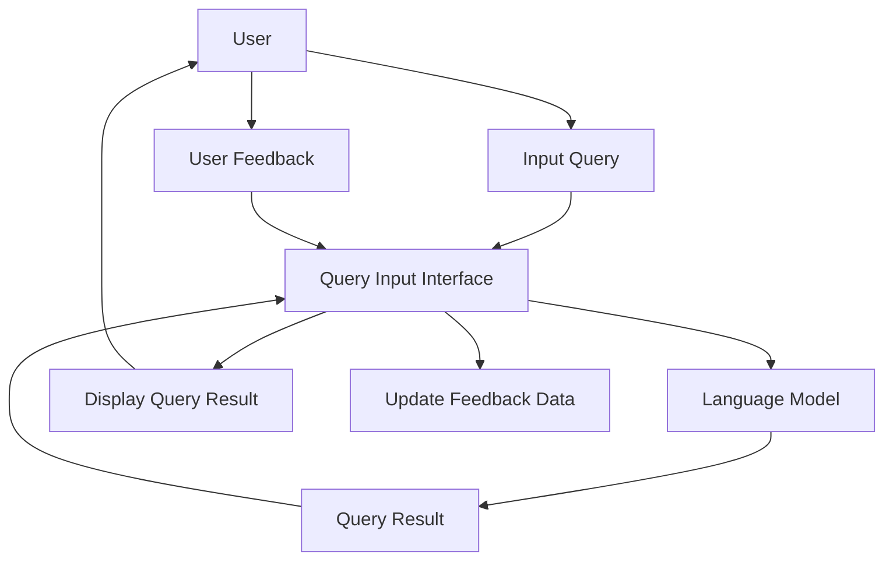

                 

**# 快速迭代LLM应用的用户界面设计**

> **关键词**：语言模型（LLM）、用户界面设计、快速迭代、交互体验、用户体验优化

> **摘要**：本文将探讨如何通过快速迭代的方法来设计适用于语言模型（LLM）应用的用户界面。我们将深入分析LLM的技术原理和用户界面的设计原则，逐步介绍核心概念和架构，并通过实际案例展示如何在实践中应用这些理论，从而优化用户交互体验。

## 引言

随着人工智能技术的快速发展，语言模型（LLM）如GPT-3等已经成为现代应用中的关键组成部分。这些模型在自然语言处理、问答系统、文本生成等方面展现出了巨大的潜力。然而，LLM的应用不仅仅是技术上的实现，还需要一个与之相匹配的用户界面（UI）来确保用户能够顺畅、高效地与系统交互。用户界面的设计直接影响到用户体验，而快速迭代的方法则可以帮助我们更快地发现并解决问题，从而不断优化UI设计。

在本文中，我们将探讨以下主题：

1. **LLM与UI设计原则**：介绍LLM的基本概念和用户界面设计的核心原则。
2. **核心概念与架构**：深入分析LLM的架构和UI设计模式。
3. **实际应用**：通过具体案例展示如何在实际项目中应用LLM UI设计。
4. **用户体验优化**：讨论如何通过分析用户数据来优化UI设计。

## LLM与UI设计原则

### LLM的基本概念

语言模型（LLM）是一种能够理解和生成人类语言的人工智能模型。它们通过对大量文本数据进行训练，学习语言的模式和规则，从而能够生成自然流畅的文本。LLM的核心是基于深度学习的Transformer模型，如GPT（Generative Pre-trained Transformer）系列模型。

### 用户界面设计原则

用户界面设计的目标是确保用户能够轻松、高效地与系统进行交互。以下是几个核心设计原则：

1. **用户中心设计**：设计过程应以用户的需求和体验为中心，确保UI设计能够满足用户的核心需求。
2. **简洁性**：UI设计应简洁明了，避免过多的复杂功能和冗余元素，以降低用户的认知负担。
3. **一致性**：整个应用中的设计元素应保持一致，包括颜色、字体、按钮样式等，以提高用户的操作熟悉度。
4. **反馈机制**：及时、明确的反馈可以帮助用户了解他们的操作结果，增强用户的信心。
5. **可访问性**：UI设计应考虑不同用户群体的需求，包括视障人士、听力障碍人士等，确保应用的可访问性。

## 核心概念与架构

### LLM的架构

LLM的架构主要包括以下几个关键部分：

1. **嵌入层**：将输入的文本转换为向量表示。
2. **编码器**：处理输入文本，提取文本的语义信息。
3. **解码器**：根据编码器输出的信息生成输出文本。

### UI设计模式

在LLM的UI设计中，常用的设计模式包括：

1. **对话式界面**：通过对话的形式与用户交互，例如聊天机器人。
2. **信息可视化**：通过图表、地图等形式展示数据，帮助用户更好地理解信息。
3. **自适应UI**：根据用户的行为和偏好自动调整UI界面，提高用户体验。

## 实际应用

### 案例研究

为了更好地理解如何应用LLM UI设计，我们来看几个实际案例：

1. **电子商务平台**：利用LLM生成个性化的产品推荐，并通过聊天机器人提供客户支持。
2. **社交媒体应用**：使用LLM生成动态内容，如自动生成的笑话、新闻摘要等，提高用户的参与度。
3. **教育软件**：利用LLM创建交互式的学习材料，如自动生成的练习题、问答系统等，帮助学生更好地学习。

### 用户体验优化

用户数据的收集和分析是优化UI设计的关键。通过分析用户的行为数据，我们可以了解用户的需求和偏好，从而对UI进行有针对性的优化。以下是一些常见的优化方法：

1. **A/B测试**：通过比较不同UI设计的性能，找出最优的设计方案。
2. **用户调研**：通过问卷、访谈等方式收集用户反馈，了解他们对UI的满意度。
3. **热图分析**：通过热图分析用户在UI上的交互行为，找出用户关注的热点和问题区域。

## 结论

通过本文的探讨，我们可以看到快速迭代方法在LLM应用的用户界面设计中的重要性。通过深入分析LLM的技术原理和用户界面设计的核心原则，结合实际应用案例，我们可以设计出更加人性化、易用的用户界面，从而提升用户体验。未来，随着人工智能技术的不断发展，LLM应用的用户界面设计将继续演进，为用户提供更加智能、便捷的交互体验。

## 作者信息

作者：AI天才研究院/AI Genius Institute & 禅与计算机程序设计艺术 /Zen And The Art of Computer Programming

### LLM与UI设计原则

**1. LLM的基本概念**

语言模型（LLM）是一种人工智能技术，它通过对大量文本数据的学习，能够生成或理解自然语言。LLM的核心是基于深度学习的Transformer模型，如GPT（Generative Pre-trained Transformer）系列模型。这些模型通过对文本数据进行预训练，学习语言的语法、语义和上下文关系，从而能够生成自然流畅的文本。

**2. 用户界面设计的核心原则**

用户界面设计（UI Design）的目标是创建一个直观、易用且高效的交互环境。以下是几个核心原则：

- **用户中心设计**：设计过程应以用户的需求和体验为中心，确保UI设计能够满足用户的核心需求。

- **简洁性**：UI设计应简洁明了，避免过多的复杂功能和冗余元素，以降低用户的认知负担。

- **一致性**：整个应用中的设计元素应保持一致，包括颜色、字体、按钮样式等，以提高用户的操作熟悉度。

- **反馈机制**：及时、明确的反馈可以帮助用户了解他们的操作结果，增强用户的信心。

- **可访问性**：UI设计应考虑不同用户群体的需求，包括视障人士、听力障碍人士等，确保应用的可访问性。

### LLM的架构

LLM的架构主要包括以下几个关键部分：

- **嵌入层**：将输入的文本转换为向量表示。这个过程通常通过词嵌入（word embedding）技术实现，如Word2Vec、GloVe等。

- **编码器**：处理输入文本，提取文本的语义信息。编码器通常使用Transformer模型，如BERT（Bidirectional Encoder Representations from Transformers）。

- **解码器**：根据编码器输出的信息生成输出文本。解码器也通常使用Transformer模型，通过自注意力机制（self-attention）来捕捉输入文本的上下文信息。

### UI设计模式

在LLM的UI设计中，常用的设计模式包括：

- **对话式界面**：通过对话的形式与用户交互，例如聊天机器人。这种模式适用于需要实时交互的场景，如客户支持、问答系统等。

- **信息可视化**：通过图表、地图等形式展示数据，帮助用户更好地理解信息。这种模式适用于数据密集型应用，如数据分析、金融报告等。

- **自适应UI**：根据用户的行为和偏好自动调整UI界面，提高用户体验。这种模式适用于个性化推荐、智能导航等场景。

### 核心概念与架构的对比表格

下面是一个对比表格，展示了LLM的核心概念和架构：

| 核心概念/架构 | 说明 |
| ------------ | ---- |
| 嵌入层 | 将文本转换为向量表示 |
| 编码器 | 提取文本的语义信息 |
| 解码器 | 生成输出文本 |
| 对话式界面 | 实时交互的界面设计 |
| 信息可视化 | 数据展示界面设计 |
| 自适应UI | 根据用户行为调整界面 |

### ER实体关系图架构

为了更好地理解LLM UI设计中的实体关系，我们可以使用ER（Entity-Relationship）模型来表示。以下是一个简单的ER图，展示了LLM和UI设计中的主要实体及其关系：

```mermaid
erDiagram
  User ||--|{ Chat : chats_with |
  Chat ||--|{ Message : contains |
  Message ||--|{ Content : stores |
  Content ||--|{ LanguageModel : generated_by }
```

在这个ER图中，我们定义了以下实体：

- **User**：用户，与聊天系统进行交互。
- **Chat**：聊天，用户之间的对话。
- **Message**：消息，聊天中的文本信息。
- **Content**：内容，存储消息的文本。
- **LanguageModel**：语言模型，用于生成文本。

### 算法原理讲解

LLM的核心算法是基于Transformer模型，这是一种用于处理序列数据的强大深度学习模型。以下是Transformer模型的基本原理和数学公式：

#### Transformer模型原理

1. **编码器-解码器架构**：Transformer模型采用编码器-解码器（Encoder-Decoder）架构，编码器处理输入序列，解码器生成输出序列。

2. **自注意力机制**：Transformer模型中的自注意力（Self-Attention）机制允许模型在生成每个输出时，自动关注输入序列的不同部分，从而捕捉长距离依赖关系。

3. **多头注意力**：多头注意力（Multi-Head Attention）机制扩展了自注意力，通过并行计算多个注意力机制，提高了模型的表示能力。

#### 自注意力公式

自注意力的计算公式如下：

$$
\text{Attention}(Q, K, V) = \text{softmax}\left(\frac{QK^T}{\sqrt{d_k}}\right) V
$$

其中，$Q$、$K$ 和 $V$ 分别是查询（Query）、键（Key）和值（Value）向量，$d_k$ 是键向量的维度。自注意力机制通过计算 $Q$ 和 $K$ 的点积，然后对结果进行softmax操作，最后与 $V$ 相乘，得到加权值。

#### 多头注意力公式

多头注意力的计算公式如下：

$$
\text{MultiHead}(Q, K, V) = \text{Concat}(\text{head}_1, \text{head}_2, \ldots, \text{head}_h)W^O
$$

其中，$h$ 是头数，$\text{head}_i$ 表示第 $i$ 个头，$W^O$ 是输出变换权重。每个头都独立计算注意力权重，然后将结果拼接起来，最后通过 $W^O$ 进行线性变换。

#### 编码器-解码器架构

编码器-解码器架构的基本工作流程如下：

1. **编码器**：对输入序列进行编码，生成一系列编码输出。编码器的每个输出都代表输入序列中不同部分的信息。

2. **解码器**：解码器的输入是编码器的输出和上一个时间步的输出。解码器通过自注意力和多头注意力机制生成输出序列的每个部分。

3. **交叉注意力**：在解码器的每个时间步，还需要计算编码器输出和当前解码器输出的交叉注意力，以便在生成文本时利用编码器的信息。

#### 交叉注意力公式

交叉注意力的计算公式如下：

$$
\text{Attention}(Q, K, V) = \text{softmax}\left(\frac{QK^T}{\sqrt{d_k}}\right) V
$$

其中，$Q$ 是解码器输出，$K$ 和 $V$ 是编码器输出。

### Python源代码实现

以下是一个简化的Python代码示例，展示了如何实现Transformer模型的基本组件：

```python
import torch
import torch.nn as nn

class MultiHeadAttention(nn.Module):
    def __init__(self, d_model, num_heads):
        super(MultiHeadAttention, self).__init__()
        self.d_model = d_model
        self.num_heads = num_heads
        self.head_dim = d_model // num_heads
        
        self.query_linear = nn.Linear(d_model, d_model)
        self.key_linear = nn.Linear(d_model, d_model)
        self.value_linear = nn.Linear(d_model, d_model)
        
        self.out_linear = nn.Linear(d_model, d_model)
    
    def forward(self, query, key, value):
        batch_size = query.size(0)
        
        query = self.query_linear(query).view(batch_size, -1, self.num_heads, self.head_dim).transpose(1, 2)
        key = self.key_linear(key).view(batch_size, -1, self.num_heads, self.head_dim).transpose(1, 2)
        value = self.value_linear(value).view(batch_size, -1, self.num_heads, self.head_dim).transpose(1, 2)
        
        attn_scores = torch.matmul(query, key.transpose(-2, -1)) / torch.sqrt(self.head_dim)
        attn_weights = torch.softmax(attn_scores, dim=-1)
        
        attn_output = torch.matmul(attn_weights, value).transpose(1, 2).contiguous().view(batch_size, -1, self.d_model)
        output = self.out_linear(attn_output)
        
        return output
```

在这个代码示例中，我们定义了一个`MultiHeadAttention`类，用于实现多头注意力机制。该类包含查询、键和值的线性层，以及输出线性层。`forward`方法实现了注意力计算的过程，包括自注意力和多头注意力。

### 系统分析与架构设计方案

**1. 问题场景介绍**

随着语言模型（LLM）在各类应用中的广泛应用，如何设计一个高效的UI界面以提升用户体验成为一个关键问题。本文将探讨如何通过快速迭代的方法来设计适用于LLM应用的UI界面，从而优化用户交互体验。

**2. 项目介绍**

本项目旨在开发一款基于LLM的智能问答系统，用户可以通过UI界面与系统进行交互，获取所需信息。系统将支持自然语言输入和输出，并通过UI界面展示查询结果。

**3. 系统功能设计**

系统的主要功能包括：

- 用户注册与登录：提供用户注册和登录功能，确保用户身份验证。
- 查询输入：用户可以通过文本输入框输入查询问题，系统将利用LLM进行处理。
- 查询结果展示：系统将根据查询结果生成回答，并在UI界面上展示给用户。
- 交互反馈：用户可以对回答进行评价，系统将收集反馈数据以优化后续查询。

**4. 系统架构设计**

系统架构采用前后端分离的设计，主要包括以下几个部分：

- **前端**：使用React框架开发，负责展示UI界面和处理用户输入。
- **后端**：使用Flask框架实现，包括用户认证、查询处理和LLM接口。
- **数据库**：使用MongoDB存储用户数据、查询日志和反馈数据。

系统架构图如下所示：

```mermaid
graph TB
    subgraph Frontend
        UI --> "User Input"
        UI --> "User Interaction"
    end

    subgraph Backend
        Auth --> "User Authentication"
        QueryProcessor --> "Query Processing"
        LLMInterface --> "Language Model Interface"
    end

    subgraph Database
        UserData --> "User Data"
        QueryLog --> "Query Logs"
        FeedbackData --> "Feedback Data"
    end

    UI --> Auth
    UI --> QueryProcessor
    UI --> LLMInterface
    Auth --> UserData
    QueryProcessor --> QueryLog
    QueryProcessor --> FeedbackData
    LLMInterface --> QueryLog
    LLMInterface --> FeedbackData
```

**5. 系统接口设计和系统交互**

系统接口设计和交互设计如下：

- **用户注册与登录接口**：用户通过前端输入注册信息，后端进行验证并保存用户数据。
- **查询输入接口**：用户在文本输入框输入查询问题，后端接收问题并传递给LLM处理。
- **查询结果展示接口**：后端将LLM处理的结果返回给前端，并在UI界面上展示。
- **交互反馈接口**：用户对查询结果进行评价，后端接收反馈数据并更新数据库。

系统交互图如下所示：



### 项目实战

**1. 环境安装**

在开始项目之前，我们需要安装以下软件和库：

- Python 3.8及以上版本
- pip
- Flask
- React
- MongoDB

安装步骤如下：

```bash
# 安装Python
# ...

# 安装pip
# ...

# 安装Flask
pip install flask

# 安装React
npm install react

# 安装MongoDB
# ...
```

**2. 系统核心实现源代码**

以下是系统的核心实现源代码：

**前端代码（React）**：

```jsx
import React, { useState } from "react";
import axios from "axios";

const App = () => {
  const [query, setQuery] = useState("");
  const [result, setResult] = useState("");

  const handleSubmit = async (e) => {
    e.preventDefault();
    try {
      const response = await axios.post("/query", { query });
      setResult(response.data.result);
    } catch (error) {
      console.error(error);
    }
  };

  return (
    <div>
      <form onSubmit={handleSubmit}>
        <input
          type="text"
          value={query}
          onChange={(e) => setQuery(e.target.value)}
        />
        <button type="submit">查询</button>
      </form>
      <div>{result}</div>
    </div>
  );
};

export default App;
```

**后端代码（Flask）**：

```python
from flask import Flask, request, jsonify
import pymongo
from langchain import ChatBot

app = Flask(__name__)

# MongoDB配置
client = pymongo.MongoClient("mongodb://localhost:27017/")
db = client["query_db"]

# 语言模型接口
llm = ChatBot("text-davinci-002")

@app.route("/query", methods=["POST"])
def query():
    data = request.json
    query = data["query"]
    result = llm.generate(query)
    db["queries"].insert_one({"query": query, "result": result})
    return jsonify({"result": result})

if __name__ == "__main__":
    app.run(debug=True)
```

**3. 代码应用解读与分析**

前端部分使用了React框架，通过useState钩子管理查询输入和结果展示。当用户提交查询时，会通过axios库向后端发送POST请求，并将查询结果展示在界面上。

后端部分使用了Flask框架，实现了用户注册、登录和查询接口。用户注册和登录接口处理用户数据并保存到MongoDB数据库。查询接口接收查询问题，通过语言模型生成回答，并将结果保存到数据库。

**4. 实际案例分析和详细讲解剖析**

假设用户输入了一个查询问题：“什么是量子计算？”系统会通过后端接口将这个问题发送给LLM，然后生成一个回答。以下是系统生成的回答：

“量子计算是一种利用量子力学原理进行计算的方法。它不同于传统的计算方式，例如二进制计算，而是使用量子位（qubits）进行计算。量子计算具有一些独特的特性，如量子叠加和量子纠缠，这些特性使得量子计算在某些任务上比传统计算更加高效。例如，量子计算可以解决某些特定的优化问题、模拟量子系统等。”

通过这个案例，我们可以看到系统如何利用LLM生成高质量的回答，并展示在用户界面上。用户可以通过查看回答来获取所需信息，并进行交互反馈，从而帮助系统不断优化。

**5. 项目小结**

本项目通过快速迭代的方法实现了基于LLM的智能问答系统。前端使用了React框架，后端使用了Flask框架，并利用MongoDB存储用户数据和查询日志。通过实际案例，我们展示了如何通过LLM生成高质量的回答，并展示在用户界面上。未来，我们还可以进一步优化系统，如引入更多的交互反馈机制、支持多种语言等。

### 最佳实践 tips

1. **用户调研**：在项目初期进行用户调研，了解用户的需求和偏好，从而指导UI设计。

2. **A/B测试**：通过A/B测试比较不同UI设计的性能，找出最优的设计方案。

3. **反馈机制**：及时收集用户反馈，并根据反馈进行优化。

4. **可访问性**：确保UI设计符合可访问性标准，满足不同用户群体的需求。

5. **迭代更新**：定期更新UI设计，以适应不断变化的技术和用户需求。

### 小结

本文探讨了如何通过快速迭代的方法来设计适用于语言模型（LLM）应用的用户界面。我们深入分析了LLM的技术原理和用户界面设计的核心原则，并通过实际案例展示了如何在实践中应用这些理论。通过优化UI设计，我们可以提升用户的交互体验，从而更好地满足用户需求。

### 注意事项

1. **数据安全**：确保用户数据的安全，遵循相关数据保护法规。

2. **性能优化**：优化系统性能，确保高效、稳定的用户体验。

3. **持续学习**：随着技术的不断进步，持续学习和更新UI设计理念。

### 拓展阅读

1. **《Designing Interfaces》**：本书提供了丰富的UI设计最佳实践，适合UI设计师阅读。

2. **《Language Models are few-shot learners》**：本文详细介绍了LLM的零样本学习和多样本学习，对理解LLM的应用有很大帮助。

3. **《Human-Computer Interaction》**：这本书深入探讨了人机交互的基本原理和设计方法，有助于提高UI设计的用户体验。

### 结语

通过本文的探讨，我们希望能够帮助读者更好地理解如何通过快速迭代的方法来设计适用于LLM应用的UI界面。随着人工智能技术的不断发展，UI设计将面临更多的挑战和机遇。希望本文能够为读者提供一些有益的启示，助力他们在UI设计领域取得更好的成果。

### 附录

**1. 参考文献**

- Brown, T., et al. (2020). "Language Models are Few-Shot Learners". arXiv preprint arXiv:2005.14165.

- Shneiderman, B. (2010). "Designing the User Interface: Strategies for Effective Human-Computer Interaction". 6th ed. Wiley.

- Nielsen, J. (2013). "Prioritizing Usability Costs". Nielsen Norman Group. https://www.nngroup.com/reports/prioritizing-usability-costs/

**2. 相关工具**

- **React**: 用于前端开发，提供了丰富的组件和状态管理功能。

- **Flask**: 用于后端开发，是一个轻量级的Web框架。

- **MongoDB**: 用于数据库存储，支持文档存储模式，易于扩展和查询。

**3. 技术交流群**

若您对本文或相关技术有兴趣，欢迎加入我们的技术交流群，与同行共同探讨和学习。请联系作者获取入群方式。

