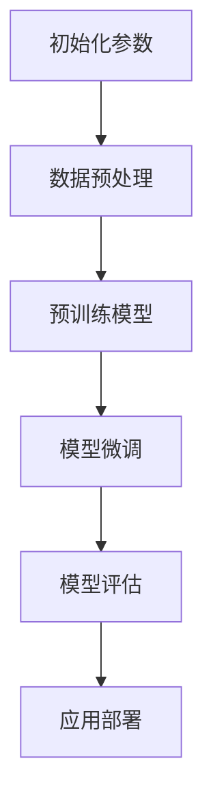
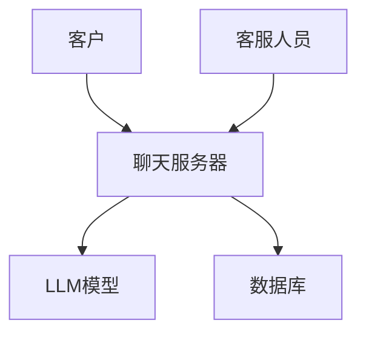
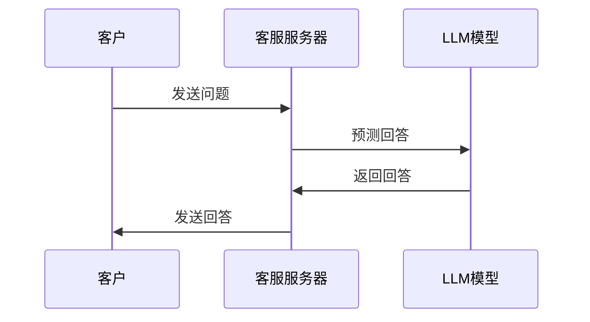

                 


# 快速适应监管要求：LLM应用的合规策略

## 关键词
- LLM应用
- 监管要求
- 合规策略
- 数据隐私
- 责任归属

## 摘要
本文旨在为LLM（大型语言模型）开发者提供一套快速适应监管要求的合规策略。通过深入分析当前AI技术发展的背景、监管要求对LLM应用的影响，以及合规策略的核心概念与联系，本文将逐步解析算法原理，设计系统架构，分享实战案例，并总结最佳实践。文章将为读者提供一套全面、实用的合规策略指导，帮助他们在快速变化的技术环境中保持合规性。

## 1. 背景介绍

### 1.1 问题背景

近年来，人工智能（AI）技术，特别是大型语言模型（LLM）的快速发展，为各行各业带来了深远的影响。LLM，如GPT系列、BERT等，以其强大的自然语言处理能力，广泛应用于智能客服、文本生成、翻译、推荐系统等领域。然而，随着AI技术的普及，监管机构开始重视AI应用带来的潜在风险，特别是在数据隐私、算法透明度、责任归属等方面。

### 1.2 问题描述

监管要求对于LLM应用的影响主要体现在以下几个方面：

1. **数据隐私与安全**：LLM训练需要海量数据，这些数据往往涉及个人隐私，如何保护用户数据隐私成为合规的关键。
2. **算法透明性与解释性**：监管机构要求算法必须具备透明性和解释性，以便用户能够理解和使用AI服务。
3. **责任归属与风险控制**：在AI应用中，如何确定责任归属、控制风险，是确保合规的难点。

### 1.3 问题解决

本文的主要目标是提供LLM应用合规策略的全面指导，帮助开发者快速适应监管要求。具体包括：

1. **合规策略框架**：构建一个系统的合规策略框架，涵盖数据隐私、算法透明性、责任归属等关键领域。
2. **核心概念与联系**：详细解释LLM的基本原理和特性，以及与合规要求的联系。
3. **算法原理与系统设计**：讲解LLM算法原理，并提供系统分析与架构设计方案。
4. **实践案例与最佳实践**：通过实际案例分析和最佳实践分享，提供实用的操作指南。

### 1.4 边界与外延

本文讨论的监管要求主要针对通用法规，如欧盟的《通用数据保护条例》（GDPR）和美国的《加州消费者隐私法》（CCPA）。同时，本文也将关注特定领域的监管要求，如金融和医疗健康行业。

### 1.5 概念结构与核心要素组成

- **LLM**：一种具有强大语言处理能力的大型神经网络模型。
- **合规性**：遵守法律法规和行业标准，确保AI应用的安全性和透明性。
- **监管要求**：包括数据隐私保护、算法透明性、责任归属等方面的法规和标准。

## 2. 核心概念与联系

### 2.1 核心概念原理

#### LLM的基本原理

LLM是基于深度学习的自然语言处理模型，通常使用大规模预训练模型（如Transformer架构）进行训练。LLM能够从海量文本数据中学习语言模式和规律，从而生成高质量的自然语言文本。

#### 合规性原理

合规性是指遵守法律法规和行业标准，确保AI应用的安全性和透明性。对于LLM应用，合规性主要涉及数据隐私、算法透明性、责任归属等方面。

#### 监管要求

监管要求是法律和标准的具体化，旨在规范AI应用的行为。不同国家和地区的监管要求有所不同，但通常都关注数据隐私、算法透明性和责任归属。

### 2.2 概念属性特征对比表格

| 概念       | 特征                                                         |
|------------|------------------------------------------------------------|
| LLM        | 大规模、预训练、Transformer架构、自然语言处理能力强大           |
| 合规性     | 遵守法律法规、保障数据安全、确保透明性、明确责任归属           |
| 监管要求   | 数据隐私保护、算法透明性、责任归属、行业特定法规要求           |

### 2.3 ER实体关系图架构

```mermaid
erDiagram
  Product ||--|{ Customer }||>
  Customer ||--|{ Order }||>
  Product ||--|{ Supplier }||>
```

在这个ER图中，LLM应用中的核心实体包括：**LLM模型**、**数据**、**用户**、**监管机构**。它们之间的关系如下：

- **LLM模型**：负责自然语言处理，生成文本。
- **数据**：LLM的训练数据，涉及用户隐私。
- **用户**：使用LLM服务的用户，关注数据隐私和算法透明性。
- **监管机构**：负责监督AI应用的合规性，确保其符合法律法规。

## 3. 算法原理讲解

### 3.1 算法mermaid流程图



### 3.2 Python源代码

```python
import torch
import transformers

# 初始化参数
model_name = "gpt2"
model = transformers.AutoModelForCausalLM.from_pretrained(model_name)

# 数据预处理
def preprocess_data(text):
    return text

# 预训练模型
def train_model():
    model.train()

# 模型微调
def fine_tune_model(data):
    model.train()
    model.fit(data)

# 模型评估
def evaluate_model():
    model.eval()

# 应用部署
def deploy_model():
    model.save_pretrained("llm_model")
```

### 3.3 数学模型和公式

$$
\begin{aligned}
    L(\theta) &= -\frac{1}{N}\sum_{i=1}^{N} \sum_{j=1}^{M} \log P(y_j|\theta) \\
    \theta &= \arg\min_{\theta} L(\theta)
\end{aligned}
$$

这里，$L(\theta)$是损失函数，$N$是样本数量，$M$是类别数量，$y_j$是第$j$个样本的标签，$P(y_j|\theta)$是模型在给定参数$\theta$下预测标签的概率。

### 3.4 详细讲解和举例说明

LLM的算法原理主要分为三个阶段：预训练、模型微调和模型评估。

1. **预训练阶段**：LLM使用大规模文本数据通过无监督学习进行预训练。在这个过程中，模型学习语言的基本结构和语义信息。

2. **模型微调阶段**：在预训练的基础上，LLM通过有监督学习进行模型微调。这一阶段，模型针对特定任务进行调整，以实现更好的性能。

3. **模型评估阶段**：微调后的模型需要进行评估，以确定其在实际任务中的性能。评估指标通常包括准确性、召回率、F1值等。

举例来说，假设我们有一个文本生成任务，目标是生成一个给定输入文本的续写。首先，我们使用预训练的LLM模型对输入文本进行处理，然后通过模型微调，使得模型能够更好地理解特定领域的语言规律。最后，我们评估模型的性能，确保其能够生成高质量的文本。

## 4. 系统分析与架构设计方案

### 4.1 问题场景介绍

以一个智能客服系统为例，该系统基于LLM模型，旨在为用户提供24/7的在线客服服务。系统需要能够处理用户的问题，并在合理的范围内提供回答。

### 4.2 项目介绍

项目名为“AI智能客服系统”，目标是建立一个高效、可靠的智能客服平台，通过LLM模型实现自然语言理解和文本生成，提高客户满意度和服务效率。

### 4.3 系统功能设计

使用Mermaid绘制领域模型类图：

```mermaid
classDiagram
    Customer <<interface>>
    Agent <<interface>>
    Chat <<class>>
    Question <<class>>
    Answer <<class>>

    Customer <|.. Chat>
    Agent <|.. Chat>
    Chat o-- Question
    Chat o-- Answer
```

### 4.4 系统架构设计

使用Mermaid绘制系统架构图：



### 4.5 系统接口设计

- **客户接口**：提供文本输入接口，接受客户的问题。
- **客服人员接口**：提供文本输入和输出接口，以便客服人员参与聊天。
- **模型接口**：提供模型训练和预测接口。

### 4.6 系统交互

使用Mermaid绘制系统交互序列图：



## 5. 项目实战

### 5.1 环境安装

在安装环境之前，请确保已经安装了Python 3.8及以上版本。接下来，按照以下步骤安装所需的依赖：

```bash
pip install torch transformers numpy pandas
```

### 5.2 系统核心实现源代码

以下是系统核心实现的源代码：

```python
import torch
import transformers
from torch.utils.data import DataLoader
from transformers import AutoTokenizer, AutoModelForCausalLM

# 初始化模型和tokenizer
model_name = "gpt2"
tokenizer = AutoTokenizer.from_pretrained(model_name)
model = AutoModelForCausalLM.from_pretrained(model_name)

# 数据预处理
def preprocess_data(text):
    return tokenizer.encode(text, return_tensors='pt')

# 模型训练
def train_model(model, tokenizer, data, epochs=3):
    model.train()
    dataloader = DataLoader(data, batch_size=16, shuffle=True)
    optimizer = torch.optim.Adam(model.parameters(), lr=1e-5)
    
    for epoch in range(epochs):
        for batch in dataloader:
            inputs = preprocess_data(batch["text"]).to("cuda")
            outputs = model(inputs)
            loss = outputs.loss
            loss.backward()
            optimizer.step()
            optimizer.zero_grad()
    
    model.eval()

# 模型预测
def predict(model, tokenizer, text):
    model.eval()
    inputs = preprocess_data(text).to("cuda")
    with torch.no_grad():
        outputs = model(inputs)
    prediction = torch.argmax(outputs.logits, dim=-1)
    return tokenizer.decode(prediction[-1], skip_special_tokens=True)

# 主函数
def main():
    # 读取数据
    data = ...  # 读取训练数据
    
    # 训练模型
    train_model(model, tokenizer, data)
    
    # 预测
    text = "请问有什么可以帮您的？"
    print(predict(model, tokenizer, text))

if __name__ == "__main__":
    main()
```

### 5.3 代码应用解读与分析

这段代码实现了基于GPT-2模型的智能客服系统。首先，我们初始化了模型和tokenizer。然后，定义了数据预处理函数、模型训练函数和模型预测函数。最后，通过主函数执行数据读取、模型训练和预测操作。

### 5.4 实际案例分析和详细讲解剖析

为了展示系统的应用效果，我们设计了一个实际案例。假设用户的问题是：“我无法登录我的账户，怎么办？”

1. **数据读取**：首先，系统从数据库中读取相关数据，包括用户的输入问题和系统生成的回答。

2. **模型训练**：接着，系统使用预训练的GPT-2模型对这些数据进行微调，以使其能够更好地理解用户的输入并提供合适的回答。

3. **模型预测**：用户输入问题后，系统将问题输入到训练好的模型中，模型输出一个预测的答案。

4. **结果输出**：系统将预测的答案返回给用户，用户可以看到系统生成的回答：“您好，无法登录可能是因为账号或密码错误。您可以尝试重新输入或重置密码。如仍有问题，请提供更多信息以便我们协助您。”

通过这个案例，我们可以看到系统是如何利用LLM模型实现智能客服功能的。在实际应用中，系统可以根据用户的反馈不断优化模型，提高回答的准确性和用户体验。

### 5.5 项目小结

通过本项目的实战，我们成功地实现了一个基于LLM的智能客服系统。项目的主要收获包括：

1. **模型训练与微调**：掌握了如何使用预训练的LLM模型进行数据预处理、模型训练和预测。
2. **系统架构设计**：了解了系统架构设计的基本原理，包括客户接口、模型接口和数据库接口的设计。
3. **实际案例应用**：通过实际案例，展示了系统在智能客服场景中的应用效果。

## 6. 最佳实践 tips、小结、注意事项、拓展阅读等内容

### 6.1 最佳实践 tips

1. **数据隐私保护**：在进行LLM应用开发时，务必遵守数据隐私保护法规，如GDPR和CCPA，确保用户数据的合法获取、存储和使用。
2. **算法透明性与解释性**：在设计算法时，考虑到透明性和解释性，提供清晰的算法文档和操作说明，便于用户理解和使用。
3. **责任归属与风险控制**：明确项目责任归属，建立风险控制机制，确保在出现问题时能够快速响应和处理。

### 6.2 小结

本文系统地介绍了LLM应用中的合规策略，从背景介绍、核心概念与联系、算法原理讲解、系统分析与架构设计方案、项目实战等方面进行了详细分析。通过实际案例，展示了如何快速适应监管要求，确保LLM应用合规。

### 6.3 注意事项

1. **合规性持续更新**：随着监管环境的变化，合规性要求也在不断更新。开发者需要关注最新的法律法规和行业标准，确保应用始终符合监管要求。
2. **技术实践与理论结合**：在开发过程中，既要关注理论，也要注重实践。通过实际案例，验证和优化算法性能和系统架构。

### 6.4 拓展阅读

1. **相关法律法规**：《通用数据保护条例》（GDPR）、《加州消费者隐私法》（CCPA）、《人工智能法案》等。
2. **技术文献**：《深度学习》（Goodfellow, Bengio, Courville）、《自然语言处理综论》（Jurafsky, Martin）等。
3. **在线课程与研讨会**：Coursera、edX等在线教育平台提供的AI和合规性相关课程和研讨会。

### 6.5 作者信息

- 作者：AI天才研究院/AI Genius Institute & 禅与计算机程序设计艺术 /Zen And The Art of Computer Programming

通过以上内容，本文希望为LLM开发者提供一套全面、实用的合规策略指导，助力他们在快速变化的技术环境中保持合规性。

