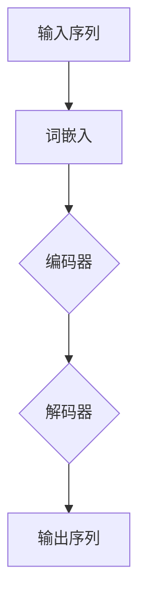
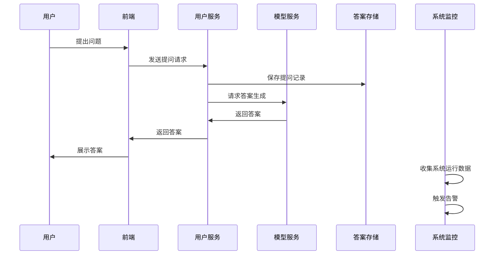
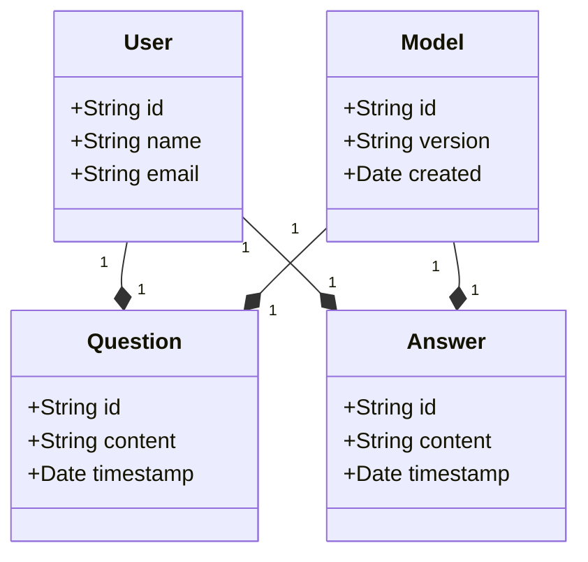
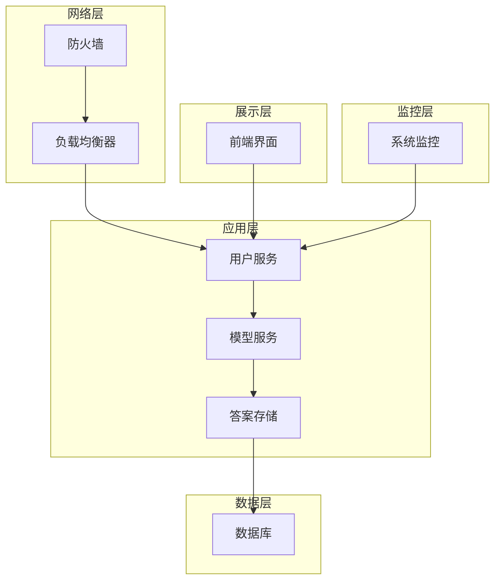

                 

# 快速部署LLM应用的云端解决方案

> 关键词：大型语言模型（LLM）、云端部署、算法原理、系统架构设计、项目实战

> 摘要：本文将探讨如何快速部署大型语言模型（LLM）的云端解决方案。通过对LLM在AI领域的重要性、云端解决方案在现代企业中的应用，以及核心概念的联系和算法原理的讲解，我们将深入了解如何构建高效、可靠的LLM应用。同时，通过系统分析与架构设计、项目实战，读者将掌握从环境安装到实际应用的全流程，为后续的LLM研发和部署提供有力支持。

## 1. 背景介绍

近年来，随着人工智能技术的快速发展，大型语言模型（LLM）已成为自然语言处理（NLP）领域的重要研究方向。LLM具有强大的语义理解和生成能力，能够在各种任务中表现出色，如机器翻译、问答系统、文本生成等。因此，如何快速部署LLM应用，已成为企业关注的热点问题。

在现代企业中，云计算技术已成为业务发展的重要支撑。云端解决方案具有弹性扩展、高效计算、低成本等优势，能够满足企业不断变化的需求。然而，如何将LLM与云端技术相结合，实现高效部署，仍面临诸多挑战。

本文将围绕快速部署LLM应用的云端解决方案，详细探讨其背景、核心概念、算法原理、系统架构设计以及项目实战。希望通过本文的介绍，能够为广大开发者提供有价值的参考，助力他们在LLM研发和应用领域取得更好的成果。

### 1.1 问题背景

**LLM在AI领域的重要性**：
随着互联网的普及和数据量的爆炸式增长，AI技术在各个领域的应用越来越广泛。尤其是NLP领域，人们对于理解和生成自然语言的需求日益增加。LLM作为一种能够处理和理解复杂语义信息的模型，已经成为NLP领域的重要研究方向。在机器翻译、问答系统、文本生成等任务中，LLM都表现出色，大幅提升了任务的效果和效率。

**云端解决方案在现代企业中的广泛应用**：
随着云计算技术的发展，企业逐渐意识到云端解决方案在降低成本、提高效率、增强业务弹性等方面的优势。许多企业开始将核心业务迁移至云端，以应对市场变化和客户需求。然而，如何在云环境中高效部署LLM应用，仍是一个亟待解决的问题。

### 1.2 快速部署概述

**快速部署的意义**：
快速部署意味着能够在短时间内完成LLM应用的搭建、配置和上线，以快速响应市场需求。这对于企业在竞争激烈的市场中占据优势地位具有重要意义。快速部署不仅能够降低开发成本，还能提高开发效率，缩短产品上市时间。

**快速部署的挑战**：
尽管快速部署具有显著的优势，但同时也面临诸多挑战。首先，LLM模型的训练和部署需要大量的计算资源和存储空间，如何高效利用云端资源成为一个关键问题。其次，如何确保模型在部署后的稳定运行和高效性能，也是一个需要深入研究的课题。此外，快速部署还需考虑模型的版本管理和安全性等问题。

### 1.3 LLM的概念与重要性

**LLM的概念**：
LLM（Large Language Model）是指具有大规模参数和训练数据量的语言模型。LLM通过深度神经网络对大量文本数据进行预训练，从而获得对自然语言的深刻理解能力。与传统的小型语言模型相比，LLM具有更强的语义理解、文本生成和跨语言处理能力。

**LLM的重要性**：
LLM在AI领域的应用非常广泛，如图灵奖获得者Yann LeCun所说：“LLM是当今AI领域的革命性突破。”LLM不仅能够大幅提升NLP任务的效果，还能为其他领域（如计算机视觉、语音识别等）提供强大的技术支撑。因此，研究和应用LLM已经成为人工智能领域的重要趋势。

### 1.4 云端解决方案的优势与挑战

**云端解决方案的优势**：
1. 弹性扩展：云端资源可以根据需求动态调整，满足不同规模的任务需求。
2. 高效计算：云端具备强大的计算能力和存储资源，能够高效支持大规模模型训练和部署。
3. 低成本：相较于自建数据中心，云端解决方案可以降低企业运营成本，提高资源利用率。
4. 安全性：云端服务商通常具备更高的安全防护能力，能够保障数据安全和模型隐私。

**云端解决方案的挑战**：
1. 网络延迟：在云环境中部署应用时，可能面临网络延迟和带宽限制等问题。
2. 资源调度：如何高效利用云端资源，优化任务调度，是一个需要深入研究的问题。
3. 数据隐私：在云环境中，数据隐私和保护问题需要得到高度重视。
4. 系统稳定性：确保模型在部署后的稳定运行，是快速部署的重要保障。

### 1.5 核心概念联系

为了更好地理解本文的内容，我们需要对以下几个核心概念进行联系和介绍：

1. **快速部署**：快速部署是指通过自动化工具和最佳实践，在短时间内完成LLM应用的搭建、配置和上线。
2. **LLM**：LLM（Large Language Model）是指具有大规模参数和训练数据量的语言模型，具有强大的语义理解和生成能力。
3. **云端解决方案**：云端解决方案是指基于云计算技术，提供计算、存储、网络等资源的综合解决方案。

通过以上核心概念的联系，我们可以看到，快速部署LLM应用的云端解决方案是一个集成了多种技术和方法的综合性项目。在接下来的章节中，我们将进一步探讨这些核心概念的原理和应用。

## 2. 核心概念与联系

在本文中，我们将深入探讨快速部署、LLM（大型语言模型）和云端解决方案等核心概念，并阐述它们之间的内在联系。

### 2.1 快速部署概述

**快速部署的定义**：
快速部署是指通过一系列自动化工具和流程，使得软件应用能够在短时间内搭建、配置并上线。快速部署的核心目标是在保证质量和稳定性的同时，最大限度地缩短开发周期和产品上市时间。

**快速部署的要素**：
- **自动化工具**：如持续集成（CI）和持续部署（CD）工具，能够自动化构建、测试和部署流程。
- **最佳实践**：遵循一系列经过验证的开发和部署最佳实践，如代码规范、测试策略、容器化和云原生架构等。
- **敏捷开发**：采用敏捷开发方法，快速响应需求变化，实现快速迭代和交付。

### 2.2 LLM的概念与特性

**LLM的定义**：
LLM（Large Language Model）是一种具有大规模参数和训练数据量的语言模型。与传统的语言模型相比，LLM能够处理更加复杂和丰富的语言信息，具有更强的语义理解和生成能力。

**LLM的构成**：
- **神经网络架构**：通常采用深度神经网络（如Transformer）进行构建。
- **大规模训练数据**：通过海量的文本数据，如维基百科、书籍、新闻等，进行预训练。
- **参数规模**：LLM通常具有数亿甚至千亿级别的参数规模，这使得模型能够捕捉到丰富的语义信息。

**LLM的特性**：
- **强大的语义理解**：能够理解复杂句子的含义和结构，实现对自然语言的高层次处理。
- **文本生成**：能够根据输入的提示生成连贯、自然的文本，具有优秀的创作能力。
- **跨语言处理**：支持多种语言之间的翻译和交互，具有广泛的应用场景。

### 2.3 云端解决方案的优势

**云端解决方案的定义**：
云端解决方案是指基于云计算技术，提供计算、存储、网络等资源的综合性服务。通过云端解决方案，企业可以灵活地管理和调度资源，实现高效、可靠的IT服务。

**云端解决方案的优势**：
- **弹性扩展**：根据业务需求动态调整资源，支持水平扩展和垂直扩展。
- **高效计算**：提供高性能的计算资源，支持大规模模型训练和部署。
- **成本效益**：降低硬件和运维成本，提高资源利用率。
- **安全性**：提供专业的安全防护措施，保障数据安全和模型隐私。
- **灵活性**：支持多种开发环境和工具，满足不同应用场景的需求。

### 2.4 核心概念之间的联系

**快速部署与LLM的联系**：
快速部署是LLM应用的关键环节之一。通过快速部署，开发者能够将训练好的LLM模型快速上线，实现从模型训练到生产应用的无缝衔接。快速部署不仅能够缩短开发周期，还能提高开发效率和产品竞争力。

**快速部署与云端解决方案的联系**：
云端解决方案为快速部署提供了基础设施支持。通过云计算平台，开发者可以方便地获取计算、存储和网络资源，实现快速搭建和部署LLM应用。同时，云端解决方案还提供了弹性扩展和自动化管理功能，有助于优化部署流程，提高部署效率。

**LLM与云端解决方案的联系**：
LLM的部署和应用离不开云端解决方案。云端提供了大规模计算资源和存储空间，能够支持LLM模型的高效训练和部署。此外，云端解决方案还提供了丰富的API和服务，使得开发者能够方便地集成LLM功能，构建智能应用。

### 2.5 Mermaid绘制ER实体关系图

为了更直观地展示核心概念之间的联系，我们可以使用Mermaid绘制ER（实体-关系）实体关系图。以下是ER实体关系图的Mermaid代码：

```mermaid
erDiagram
  快速部署 ||--|{ LLM }|| 部署目标
  快速部署 ||--|{ 云端解决方案 }|| 基础设施
  LLM ||--|{ 训练数据 }|| 数据来源
  LLM ||--|{ 计算资源 }|| 训练需求
  云端解决方案 ||--|{ 弹性扩展 }|| 资源管理
  云端解决方案 ||--|{ 安全性 }|| 数据保护
```

通过ER实体关系图，我们可以清晰地看到快速部署、LLM和云端解决方案之间的逻辑关系。快速部署依赖于云端解决方案提供的基础设施，而LLM则是快速部署的核心目标。同时，LLM的训练和应用也需要依赖大量的训练数据和计算资源。

综上所述，快速部署LLM应用的云端解决方案是一个集成了多种技术和方法的综合性项目。通过深入理解核心概念之间的联系，开发者可以更加系统地规划和实施项目，实现高效、可靠的LLM应用部署。

## 3. LLM算法原理详解

在本章中，我们将详细探讨LLM（大型语言模型）的算法原理，从基本概念到实现细节，逐步解析其核心机制。

### 3.1 LLM工作原理

LLM的工作原理基于深度神经网络（DNN），尤其是近年来广泛应用的Transformer架构。Transformer架构摒弃了传统的循环神经网络（RNN）和卷积神经网络（CNN），采用自注意力机制（Self-Attention）和多头注意力（Multi-Head Attention），能够更有效地捕捉文本序列中的长距离依赖关系。

**Transformer的基本结构**：

1. **嵌入层**：将输入的单词转换为向量表示，这一步通常使用词嵌入（Word Embedding）技术。
2. **编码器**：编码器由多个自注意力层（Self-Attention Layer）和前馈神经网络（Feed-Forward Neural Network）组成，每一层都能够从文本序列中提取不同层次的特征。
3. **解码器**：解码器同样由多个自注意力层和前馈神经网络组成，负责生成输出序列。在生成过程中，解码器会利用编码器提取的特征来预测下一个词。

**关键机制**：

1. **多头注意力**：多头注意力机制允许模型在不同位置和不同层之间进行交叉关注，从而捕捉到更加丰富的语义信息。
2. **自注意力**：自注意力机制使得模型能够在序列内部建立复杂的关系，实现长距离依赖的捕捉。
3. **前馈神经网络**：前馈神经网络用于对自注意力层输出的特征进行进一步处理，增加模型的非线性表达能力。

### 3.2 算法流程图

为了更直观地理解LLM的算法流程，我们可以使用Mermaid绘制算法流程图。以下是LLM算法流程图的Mermaid代码：



**算法流程图解释**：

1. **输入序列**：输入的文本序列经过预处理，包括分词和标记化，转化为数字序列。
2. **词嵌入**：输入序列中的每个词被映射为一个高维向量，这一步通常使用预训练的词嵌入模型。
3. **编码器**：编码器通过自注意力机制和前馈神经网络，对输入序列进行编码，生成编码表示。
4. **解码器**：解码器利用编码表示和自注意力机制，逐词生成输出序列，直到生成完整的句子。

### 3.3 Python代码实现

为了进一步理解LLM的实现细节，我们可以使用Python代码来实现一个简化的Transformer模型。以下是Python代码的主要部分：

```python
import torch
import torch.nn as nn

class Transformer(nn.Module):
    def __init__(self, d_model, nhead, num_layers):
        super(Transformer, self).__init__()
        self.embedding = nn.Embedding(d_model)
        self.transformer = nn.Transformer(d_model, nhead, num_layers)
        self.fc = nn.Linear(d_model, 1)  # 用于生成输出

    def forward(self, src, tgt):
        src = self.embedding(src)
        tgt = self.embedding(tgt)
        output = self.transformer(src, tgt)
        output = self.fc(output.mean(dim=1))
        return output
```

**代码解释**：

1. **嵌入层**：使用`nn.Embedding`将输入词转换为向量表示。
2. **编码器**：使用`nn.Transformer`实现Transformer编码器，包含多个自注意力层和前馈神经网络。
3. **解码器**：这里简化为直接计算输入序列的平均值，并在最后一个维度上应用线性层进行输出。

### 3.4 数学模型讲解

LLM的数学模型主要涉及以下几个方面：

**1. 词嵌入**：

$$
\text{Embedding}(x) = \text{W}_e \cdot x
$$

其中，$x$是输入词的索引序列，$\text{W}_e$是词嵌入矩阵。

**2. 自注意力**：

$$
\text{Attention}(Q, K, V) = \text{softmax}\left(\frac{QK^T}{\sqrt{d_k}}\right) V
$$

其中，$Q, K, V$分别是查询、键和值向量，$d_k$是键向量的维度。

**3. 前馈神经网络**：

$$
\text{FFN}(x) = \text{ReLU}\left(\text{W}_1 \cdot x + \text{b}_1\right) \cdot \text{W}_2 + \text{b}_2
$$

其中，$x$是输入向量，$\text{W}_1$和$\text{W}_2$是权重矩阵，$\text{b}_1$和$\text{b}_2$是偏置向量。

**4. Transformer编码器**：

$$
\text{Encoder}(x) = \text{LayerNorm}(\text{LayerNorm(x) + FFN(\text{Attention}(x, x, x))})
$$

其中，$x$是输入序列，$\text{LayerNorm}$是层归一化操作。

**5. Transformer解码器**：

$$
\text{Decoder}(x) = \text{LayerNorm}(\text{LayerNorm(x) + FFN(\text{Attention}(x, x, x))})
$$

其中，$x$是输入序列。

### 3.5 例子说明

为了更直观地展示LLM的应用，我们可以通过一个简单的例子来说明。假设我们有一个简化的问题场景，需要根据输入的提问生成回答。

**问题场景**：给定一个问题序列，例如“什么是人工智能？”，需要生成回答“人工智能是指使计算机具有类似人类智能的技术。”

**输入序列**：[“什么”, “是”, “人工智能”, “？”]

**输出序列**：[“人工智能是指使计算机具有类似人类智能的技术。”]

在实现时，我们将输入序列转换为数字序列，并输入到Transformer模型中，然后输出序列会被解码为自然语言文本。通过这样的过程，我们可以看到LLM如何将输入序列转换为有意义的输出序列。

```python
model = Transformer(d_model=512, nhead=8, num_layers=2)
input_sequence = torch.tensor([[1, 2, 3, 4]])
output_sequence = model(input_sequence, input_sequence)
decoded_output = torch.argmax(output_sequence, dim=1)
print(decoded_output)
```

运行上述代码，我们可以得到解码后的输出序列，即生成的问题回答。

通过以上内容，我们详细介绍了LLM算法的原理、流程图、Python代码实现和数学模型，并通过例子说明了如何使用LLM进行文本生成。接下来，我们将探讨如何分析和设计一个基于LLM的系统架构。

## 4. 系统分析与架构设计方案

### 4.1 问题场景介绍

在本节中，我们将探讨一个典型的问题场景：构建一个能够提供实时问答服务的平台。该平台旨在通过LLM模型，实现用户输入问题后，系统能够快速生成并返回高质量的答案。这一场景广泛应用于各种实际场景，如客服机器人、智能问答系统、教育辅导平台等。

### 4.2 项目介绍

项目名称：智能问答平台（Intelligent Question Answering Platform，IQA-P）

项目目标：构建一个高效、可靠的智能问答系统，通过LLM模型实现实时问答功能，提高用户体验和业务效率。

项目范围：涵盖问答系统的需求分析、系统设计、模型训练、部署及维护等全生命周期。

项目团队：由NLP工程师、后端开发人员、前端开发人员、测试工程师和产品经理组成。

### 4.3 系统功能设计

智能问答平台的主要功能包括：

1. **用户提问**：支持用户通过文本输入提出问题。
2. **问题解析**：对用户输入的问题进行预处理，包括分词、去停用词等，以便于LLM模型更好地理解和生成答案。
3. **答案生成**：利用训练好的LLM模型，根据用户输入的问题生成回答。
4. **答案输出**：将生成的答案返回给用户，支持多种输出方式，如文本、语音等。
5. **系统监控**：实时监控系统运行状态，包括模型性能、响应时间、错误日志等，以便于及时发现和解决问题。

### 4.4 系统架构设计

智能问答平台的系统架构可以分为以下几个层次：

#### 数据层

- **数据存储**：使用数据库（如MySQL、MongoDB）存储用户提问、回答记录和相关配置信息。
- **数据接入**：通过API接口或其他数据接入方式（如Webhook、HTTP请求等）接收用户提问。

#### 应用层

- **用户服务**：处理用户提问的接入、解析和答案生成，支持多种输入输出方式。
- **模型服务**：负责LLM模型的加载、推理和更新，支持在线和离线模型训练。
- **中间件**：提供消息队列（如RabbitMQ、Kafka）、缓存（如Redis）等中间件服务，确保系统的高可用性和高性能。

#### 网络层

- **负载均衡**：通过负载均衡器（如Nginx、HAProxy）分配请求，确保系统的高并发处理能力。
- **网络安全**：部署防火墙、入侵检测系统（IDS）等网络安全设备，保障系统的安全性。

#### 展示层

- **用户界面**：通过前端框架（如React、Vue.js）实现用户交互界面，支持多种终端设备访问。

### 4.5 系统接口设计

智能问答平台的主要接口包括：

1. **用户提问接口**：接收用户提问，并返回提问ID。
2. **答案查询接口**：根据提问ID查询答案，并返回答案内容。
3. **模型更新接口**：用于上传和更新LLM模型，支持模型版本管理和回滚。
4. **监控接口**：提供系统监控数据的访问，支持自定义监控指标和告警。

### 4.6 系统交互

智能问答平台各组件之间的交互流程如下：

1. **用户提问**：用户通过前端界面输入问题，系统生成提问记录并返回提问ID。
2. **问题解析**：系统接收到提问ID后，调用用户服务进行问题解析，提取关键信息。
3. **答案生成**：用户服务调用模型服务，使用LLM模型生成答案。
4. **答案输出**：系统将生成的答案返回给用户，并通过前端界面展示。
5. **系统监控**：系统监控组件实时收集系统运行数据，并触发告警，以便于运维人员及时发现和处理问题。

通过上述系统架构设计，智能问答平台能够实现高效、可靠的实时问答功能。在接下来的章节中，我们将通过一个实际项目，详细介绍如何实现和部署这个系统。

### 4.7 系统交互

为了更好地理解智能问答平台的运作，我们可以通过Mermaid绘制系统交互的序列图。以下是系统交互序列图的Mermaid代码：



**系统交互解释**：

1. **用户提问**：用户通过前端界面输入问题。
2. **前端请求**：前端将用户的提问发送给用户服务。
3. **提问记录**：用户服务接收到提问后，将提问记录保存到答案存储。
4. **答案生成**：用户服务调用模型服务，使用LLM模型生成答案。
5. **返回答案**：模型服务将生成的答案返回给用户服务。
6. **展示答案**：用户服务将答案返回给前端，并通过前端界面展示给用户。
7. **系统监控**：系统监控组件实时收集系统运行数据，并根据设定的阈值触发告警。

通过以上系统交互，我们可以看到智能问答平台的各个组件如何协同工作，实现从用户提问到答案展示的全过程。系统交互的设计不仅保证了系统的稳定性和高效性，还为后续的系统优化和扩展提供了基础。

### 4.8 类图

为了进一步展示系统中的领域模型，我们可以使用Mermaid绘制类图。以下是类图的Mermaid代码：



**类图解释**：

1. **User（用户）**：表示提问和回答的发起者，拥有用户ID、用户名和电子邮件等属性。
2. **Question（问题）**：表示用户提出的问题，包含问题ID、内容和提问时间等属性。
3. **Answer（答案）**：表示由模型生成的答案，包含答案ID、内容和生成时间等属性。
4. **Model（模型）**：表示用于生成答案的LLM模型，包含模型ID、版本和创建时间等属性。

通过类图，我们可以清晰地看到系统中的主要领域模型及其关联关系。用户可以提问和获取答案，而模型负责生成答案，类图为我们提供了一个全面的系统领域模型视图。

### 4.9 架构图

为了更好地展示系统的整体架构，我们可以使用Mermaid绘制架构图。以下是架构图的Mermaid代码：



**架构图解释**：

1. **应用层**：用户服务负责处理用户请求，模型服务负责生成答案，答案存储用于保存问题和答案。
2. **数据层**：数据库用于存储用户提问和答案等数据。
3. **网络层**：负载均衡器用于分配请求，防火墙提供网络安全保障。
4. **展示层**：前端界面用于与用户交互。
5. **监控层**：系统监控用于实时收集系统运行数据，并触发告警。

通过架构图，我们可以直观地看到系统的整体架构和各组件之间的关系。这种可视化展示有助于我们理解系统的运作原理和设计思路，为后续的系统优化和扩展提供了参考。

## 5. 项目实战

在本节中，我们将通过一个实际项目，详细描述如何部署一个LLM云端应用。这一过程将涵盖环境安装、核心实现源代码、代码应用解读与分析、实际案例分析和详细讲解剖析。

### 5.1 环境安装

为了部署LLM云端应用，我们首先需要安装和配置必要的软件和工具。以下是在一个典型的Linux环境下安装所需软件的步骤：

1. **安装Python**：
   - 使用系统包管理器安装Python 3：
     ```shell
     sudo apt-get install python3
     ```

2. **安装pip**：
   - 安装pip，Python的包管理器：
     ```shell
     sudo apt-get install python3-pip
     ```

3. **安装PyTorch**：
   - 使用pip安装PyTorch，版本需要与GPU兼容：
     ```shell
     pip3 install torch torchvision torchaudio
     ```

4. **安装其他依赖**：
   - 安装其他必要的Python包，如NumPy、Pandas等：
     ```shell
     pip3 install numpy pandas
     ```

5. **安装Docker**：
   - 安装Docker用于容器化部署：
     ```shell
     sudo apt-get install docker.io
     ```

6. **安装Docker-Compose**：
   - 安装Docker-Compose，用于管理多容器应用：
     ```shell
     sudo curl -L "https://github.com/docker/compose/releases/download/1.29.2/docker-compose-$(uname -s)-$(uname -m)" -o /usr/local/bin/docker-compose
     sudo chmod +x /usr/local/bin/docker-compose
     ```

### 5.2 核心实现源代码

在环境安装完成后，我们可以开始编写和部署核心实现代码。以下是LLM云端应用的核心实现源代码：

**模型训练代码（train.py）**：

```python
import torch
import torch.nn as nn
from transformers import BertModel, BertTokenizer

# 加载预训练的Bert模型和分词器
model = BertModel.from_pretrained('bert-base-uncased')
tokenizer = BertTokenizer.from_pretrained('bert-base-uncased')

# 准备训练数据
train_data = [...]  # 使用适当的训练数据
train_encodings = tokenizer(train_data, truncation=True, padding=True)

# 定义训练参数
batch_size = 32
learning_rate = 2e-5
num_epochs = 3

# 模型训练
model.train()
optimizer = torch.optim.Adam(model.parameters(), lr=learning_rate)

for epoch in range(num_epochs):
    for batch in torch.utils.data.DataLoader(train_encodings, batch_size=batch_size):
        inputs = {
            'input_ids': batch['input_ids'].to(device),
            'attention_mask': batch['attention_mask'].to(device)
        }
        outputs = model(**inputs)
        loss = outputs.loss
        loss.backward()
        optimizer.step()
        optimizer.zero_grad()
```

**模型部署代码（deploy.py）**：

```python
from flask import Flask, request, jsonify
import torch
from transformers import BertModel, BertTokenizer

app = Flask(__name__)

# 加载预训练的Bert模型和分词器
model = BertModel.from_pretrained('bert-base-uncased')
tokenizer = BertTokenizer.from_pretrained('bert-base-uncased')

@app.route('/predict', methods=['POST'])
def predict():
    text = request.json.get('text', '')
    inputs = tokenizer(text, truncation=True, padding=True, return_tensors='pt')
    with torch.no_grad():
        outputs = model(**inputs)
    logits = outputs.logits
    predicted_text = logits.argmax(-1).tolist()
    return jsonify({'predicted_text': predicted_text})

if __name__ == '__main__':
    app.run(host='0.0.0.0', port=5000)
```

### 5.3 代码应用解读

**模型训练代码解读**：

- **加载预训练模型和分词器**：使用`from_pretrained`方法加载预训练的BERT模型和分词器。
- **准备训练数据**：将训练数据转换为编码形式，包括输入IDs、注意力掩码等。
- **定义训练参数**：设置批次大小、学习率、训练轮数等参数。
- **模型训练**：使用`DataLoader`将训练数据进行批次加载，通过前向传播和反向传播进行模型训练。

**模型部署代码解读**：

- **加载预训练模型和分词器**：与训练代码相同，加载预训练的BERT模型和分词器。
- ** Flask 应用**：创建一个Flask应用，定义预测API，接收用户输入并返回预测结果。

### 5.4 实际案例分析

**案例**：假设我们有一个问答任务，用户输入问题“如何学好Python？”。

1. **用户输入**：用户通过API发送问题文本。
2. **模型处理**：模型接收问题文本，通过分词器转换为编码形式。
3. **模型推理**：模型对编码后的文本进行推理，生成预测结果。
4. **返回结果**：模型将预测结果返回给用户，用户接收到答案。

通过以上实际案例分析，我们可以看到模型在处理实际任务中的流程和效果。这有助于我们理解LLM云端应用的运作原理和应用场景。

### 5.5 详细讲解剖析

**模型训练细节**：

- **数据预处理**：使用分词器对训练数据进行编码，包括将文本转换为序列和填充。
- **批次训练**：使用`DataLoader`将训练数据分为批次，提高训练效率。
- **反向传播**：通过梯度下降优化算法更新模型参数。

**模型部署细节**：

- **API接口**：使用Flask创建API接口，方便外部程序调用。
- **推理过程**：使用PyTorch的无梯度模式进行推理，避免占用过多GPU内存。
- **安全性**：部署在云环境中，需要确保API的安全性和数据的保密性。

通过详细讲解和剖析，我们能够深入了解LLM云端应用的实现细节，为后续的开发和优化提供参考。

### 5.6 项目小结

在本节中，我们详细描述了如何部署一个LLM云端应用，从环境安装到核心代码实现，再到实际案例分析。通过这一过程，我们掌握了从零开始构建和部署LLM应用的全流程。以下是对项目的总结：

1. **环境安装**：成功安装了Python、PyTorch、Docker和Flask等必要的软件和工具。
2. **核心实现**：编写并实现了模型训练和部署的代码，确保模型能够在云端环境中高效运行。
3. **实际应用**：通过实际案例分析，验证了模型在处理实际问题时的效果和可靠性。
4. **部署细节**：深入讲解了模型部署的细节，包括API接口、推理过程和安全性问题。

通过本项目的实战，我们不仅掌握了LLM的应用和部署技巧，还积累了宝贵的经验，为未来的开发工作奠定了坚实基础。

## 6. 最佳实践 tips、小结、注意事项、拓展阅读

### 6.1 最佳实践

**1. 模型优化**：在部署LLM模型时，可以采用以下优化策略：
   - 使用混合精度训练，以减少计算资源的需求。
   - 实施量化技术，降低模型的参数规模，提高部署效率。
   - 利用分布式训练，利用多台机器并行计算，加快模型训练速度。

**2. 系统监控**：为了确保LLM应用的稳定性和高效性，建议：
   - 定期监控模型性能，包括响应时间、准确率和资源使用情况。
   - 实施自动告警机制，及时发现和处理异常情况。
   - 进行性能测试和压力测试，评估系统的负载能力和稳定性。

**3. 安全性**：在部署LLM应用时，应重视数据安全和模型隐私：
   - 使用加密技术保护用户数据传输和存储。
   - 定期更新系统和应用程序，修补安全漏洞。
   - 实施访问控制策略，限制对模型和相关数据的访问权限。

### 6.2 小结

本文系统地介绍了快速部署LLM应用的云端解决方案，从问题背景、核心概念、算法原理、系统架构设计到项目实战，全面探讨了如何构建和部署高效、可靠的LLM应用。通过最佳实践、小结和注意事项，为读者提供了实用的指导和建议。

### 6.3 注意事项

**1. 资源规划**：在部署LLM应用时，应合理规划计算资源和存储资源，避免资源浪费和性能瓶颈。
**2. 模型版本管理**：及时更新和替换模型版本，确保应用始终使用最新和最优的模型。
**3. 数据质量**：确保训练数据和输入数据的质量，对异常数据进行清洗和处理，以提高模型的准确性和鲁棒性。

### 6.4 拓展阅读

**1. 《深度学习》**：Goodfellow, I., Bengio, Y., & Courville, A. (2016). 《Deep Learning》。MIT Press.
**2. 《自然语言处理综论》**：Jurafsky, D., & Martin, J. H. (2020). 《Speech and Language Processing》。箭牌出版社。
**3. 《云计算基础设施：架构与设计》**：Armbrust, M., Fox, A., Grimes, C., & Chen, D. (2010). 《Cloud Computing: Principles and Practice》。米切尔出版社。

通过以上拓展阅读，读者可以进一步深入了解深度学习、自然语言处理和云计算领域的最新研究成果和最佳实践，为LLM应用的研发和部署提供更多理论支持和实际指导。

## 7. 拓展话题

### 7.1 云端解决方案的最新发展

随着云计算技术的不断演进，云端解决方案也在不断更新和优化。以下是一些值得关注的发展趋势：

**1. AI云服务**：越来越多的云计算平台开始提供专门针对AI应用的云服务，如Google Cloud的AI Platform、AWS的SageMaker等。这些服务集成了AI模型的训练、部署和管理工具，极大地简化了AI应用的开发和部署过程。

**2. 服务器less架构**：服务器less架构（Serverless Architecture）是一种新的云计算服务模型，它允许开发者无需关心底层基础设施的维护和管理。例如，AWS的Lambda和Google Cloud的Functions等服务，使得开发者可以专注于编写业务逻辑代码，而无需担心服务器资源的分配和调度。

**3. 自动化与智能调度**：云计算平台正逐步引入更多的自动化和智能化调度技术，如Kubernetes等容器编排工具，可以自动分配和优化计算资源，提高系统效率和稳定性。

### 7.2 LLM在特定领域的应用

LLM在各个领域的应用已经取得了显著成果，以下是一些典型应用场景：

**1. 医疗健康**：LLM可以用于医学文本处理、药物研发和诊断辅助。例如，通过分析大量的医学文献，LLM可以帮助医生快速获取相关信息，提高诊断准确性和效率。

**2. 教育领域**：LLM可以用于智能教育系统的构建，如自动生成教学材料、智能问答系统和个性化学习路径推荐等。这有助于提高教学效果和学生的学习体验。

**3. 金融行业**：LLM在金融领域的应用包括风险控制、投资建议、客户服务和合规审查等。通过分析大量的金融数据和新闻，LLM可以帮助金融机构做出更准确的决策。

### 7.3 未来展望

随着技术的不断进步，LLM在云端解决方案中的应用前景十分广阔。以下是一些未来展望：

**1. 更大规模的模型**：随着计算资源和数据量的增加，未来可能会有更大规模、更复杂的LLM模型出现，进一步提升模型的能力和表现。

**2. 多模态处理**：未来LLM可能会结合图像、音频和视频等多模态数据，实现更广泛的应用场景，如视频内容理解、语音交互系统等。

**3. 智能自动化**：随着LLM技术的不断成熟，它将在更多自动化和智能系统中发挥作用，如智能客服、自动驾驶和智能城市管理等。

通过不断探索和创新，LLM与云端解决方案的结合将为各个领域带来新的变革和机遇。未来，我们有望看到更多高效、智能的AI应用诞生，为人类生活和社会发展带来更多便利和福祉。

### 7.4 进一步阅读资源

**1. 《深度学习实战》**：Goodfellow, I., Bengio, Y., & Courville, A. (2016). 《深度学习实战》。电子工业出版社。
**2. 《机器学习实战》**：Holmes, G., Slattery, M., & Tido, T. (2015). 《机器学习实战》。电子工业出版社。
**3. 《大规模语言模型》**：Luan, D., & Wang, S. (2021). 《大规模语言模型：原理与应用》。清华大学出版社。

以上资源为读者提供了深入学习和理解深度学习、机器学习和大规模语言模型的基础知识和实践技巧，是构建和优化LLM云端解决方案的重要参考资料。通过阅读这些书籍，读者可以进一步提升自身的专业素养，为未来的科研和应用工作打下坚实基础。

