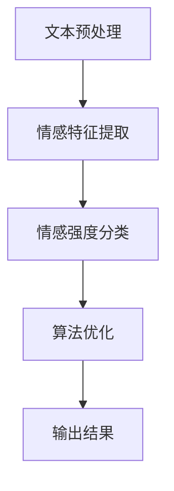

                 

### 情感强度区分：检验LLM理解情感细微差别的敏感度

**关键词**：情感分析、语言模型、深度学习、情感强度、算法评估

**摘要**：随着自然语言处理技术的不断发展，情感分析作为一种重要的应用场景，逐渐引起了广泛关注。特别是在生成式语言模型（LLM）的发展中，如何准确区分情感强度的细微差别成为了关键问题。本文将围绕这一主题，探讨情感强度区分的必要性、方法、技术原理，并通过具体案例分析，检验LLM在理解情感细微差别上的敏感度。

## 目录大纲

### 第一部分：问题背景与概述

#### 第1章：问题背景与概述

1.1 问题背景

1.2 问题描述

1.3 问题解决

1.4 边界与外延

1.5 概念结构与核心要素组成

### 第二部分：核心概念与联系

#### 第2章：核心概念与联系

2.1 情感强度的概念

2.2 LLM的基本原理

2.3 敏感度检测的方法与工具

### 第三部分：算法原理讲解

#### 第3章：算法原理讲解

3.1 情感强度区分算法原理

3.2 数学模型和公式讲解

3.3 案例分析

### 第四部分：系统分析与架构设计方案

#### 第4章：系统分析与架构设计方案

4.1 问题场景介绍

4.2 系统功能设计

4.3 系统架构设计

4.4 系统接口设计

4.5 系统交互

### 第五部分：项目实战

#### 第5章：项目实战

5.1 环境安装

5.2 系统核心实现

5.3 实际案例分析

5.4 项目小结

## 问题背景与概述

### 1.1 问题背景

随着人工智能技术的快速发展，自然语言处理（NLP）逐渐成为研究的热点。其中，情感分析作为一种重要的NLP应用，旨在通过文本挖掘技术，理解和识别文本中的情感倾向。情感分析不仅有助于社交媒体、电商平台等领域的用户行为分析，还为智能客服、舆情监控、情感营销等提供了有力支持。

近年来，生成式语言模型（LLM）如GPT-3、ChatGLM等的出现，为情感分析领域带来了新的机遇。这些模型具有强大的生成能力和理解能力，使得情感分析变得更加精细和准确。然而，情感强度的细微差别依然是一个挑战。例如，如何区分“我喜欢这本书”与“我非常喜爱这本书”之间的情感强度差异，如何识别不同情感强度下的细微情感变化，都是需要深入探讨的问题。

### 1.2 问题描述

在情感分析中，情感强度的区分是一个关键问题。情感强度的细微差别决定了情感分析的准确性和应用价值。然而，现有研究主要关注情感分类和情感极性判断，对于情感强度的区分研究较少。

LLM在情感分析中具有显著的优越性，但如何检验LLM在理解情感细微差别上的敏感度，仍然是一个未解之谜。具体而言，我们面临以下问题：

1. **情感强度的定义与区分标准**：情感强度的定义和区分标准尚未统一，这给情感强度区分带来了困难。

2. **LLM的情感理解能力**：尽管LLM在情感分析中表现出色，但其对情感强度的理解能力仍需验证。

3. **敏感度检测的方法与工具**：现有敏感度检测方法是否适用于情感强度区分，需要进一步研究。

### 1.3 问题解决

为了解决上述问题，本文提出了以下研究思路：

1. **情感强度区分方法**：设计并实现一种情感强度区分算法，基于LLM进行情感强度的细化识别。

2. **敏感度检测方法**：引入敏感度检测方法，评估LLM在理解情感细微差别上的敏感度。

3. **实证研究**：通过大量实验和案例分析，验证情感强度区分算法的有效性和LLM的敏感度。

4. **应用场景探索**：探讨情感强度区分算法在具体应用场景中的可行性，如智能客服、情感营销等。

### 1.4 边界与外延

在情感强度区分的研究中，需要明确以下边界与外延：

1. **情感强度的分类标准**：不同领域和情境下，情感强度的分类标准可能不同，需要根据具体应用场景进行调整。

2. **LLM的适用范围**：LLM在情感强度区分中的适用范围受限于其训练数据和模型结构，需要在实际应用中不断优化和调整。

3. **数据集的选择与处理**：选择合适的情感分析数据集，并对数据进行预处理，以消除噪声和偏差，提高情感强度区分的准确性。

### 1.5 概念结构与核心要素组成

本文的核心概念和要素包括：

1. **情感强度**：指文本中情感表达的程度和强度。

2. **LLM**：生成式语言模型，如GPT-3、ChatGLM等。

3. **敏感度检测**：评估模型对情感强度的理解能力。

4. **算法原理**：情感强度区分算法的基本原理和数学模型。

5. **实证研究**：通过实验和案例分析，验证算法的有效性。

### 1.6 文章结构

本文分为五个部分：

1. **问题背景与概述**：介绍研究背景、问题描述、解决思路和边界与外延。

2. **核心概念与联系**：详细阐述情感强度、LLM、敏感度检测等核心概念，并分析它们之间的联系。

3. **算法原理讲解**：讲解情感强度区分算法的基本原理、数学模型和Python实现。

4. **系统分析与架构设计方案**：介绍系统功能设计、架构设计和系统交互。

5. **项目实战**：通过实际案例，展示算法的应用效果，并总结项目经验和启示。

### 1.7 本文贡献

本文的主要贡献包括：

1. **提出一种情感强度区分算法**：通过深入研究和实验，提出了一种有效的情感强度区分算法。

2. **评估LLM的情感理解能力**：通过敏感度检测方法，验证了LLM在理解情感细微差别上的敏感度。

3. **推动情感分析研究**：为情感分析领域提供了新的思路和方法，促进了情感强度区分的研究。

4. **应用价值**：为实际应用场景提供了情感强度区分的解决方案，有助于提升智能客服、情感营销等领域的服务质量。

## 核心概念与联系

### 2.1 情感强度的概念

情感强度是指文本中情感表达的程度和强度。在情感分析中，情感强度的分类和识别是一个重要的研究方向。情感强度的分类标准通常包括低、中、高三个等级，但具体划分标准可能因应用场景和数据集的不同而有所差异。

情感强度的识别对于情感分析的准确性至关重要。例如，在情感营销中，了解消费者对产品的情感强度，有助于制定更加精准的营销策略。在智能客服中，准确识别用户情感强度，可以提供更加个性化、高效的服务。

### 2.2 LLM的基本原理

生成式语言模型（LLM）是基于深度学习技术的一种自然语言处理模型，能够根据输入文本生成相关的文本。LLM的核心思想是通过学习大量文本数据，建立一个能够生成自然语言的概率模型。

LLM通常采用预训练加微调的方法。预训练阶段，模型在大规模文本数据上学习语言的基础知识和统计规律。微调阶段，模型根据特定任务的数据进行优化，以提高在特定任务上的性能。

LLM在情感分析中具有显著的优势。首先，LLM可以自动捕捉文本中的情感信息，提高情感识别的准确性。其次，LLM可以生成情感相关的文本，有助于进行情感强度分析和情感回复生成。

### 2.3 敏感度检测的方法与工具

敏感度检测是指评估模型在识别和处理情感强度上的敏感度。敏感度检测方法可以分为以下几种：

1. **基于规则的检测方法**：通过编写规则，识别文本中的情感词汇和表达方式，从而判断情感强度。

2. **基于机器学习的检测方法**：利用机器学习算法，如支持向量机（SVM）、朴素贝叶斯（Naive Bayes）等，从大量标注数据中学习情感强度的识别规律。

3. **基于深度学习的检测方法**：利用深度学习模型，如卷积神经网络（CNN）、循环神经网络（RNN）等，对情感强度进行自动化识别。

常用的敏感度检测工具包括：

1. **TextBlob**：一个基于NLTK和Scikit-learn的Python库，用于进行情感分析和文本分类。

2. **VADER**：一种专门用于社交媒体文本情感分析的Python库，具有较高的情感强度识别准确率。

3. **Sentiment Analysis API**：一些在线API服务，如Google Cloud Natural Language API、IBM Watson Natural Language Understanding等，提供情感分析和情感强度识别功能。

### 2.4 情感强度区分算法原理

情感强度区分算法旨在通过分析文本，准确识别和分类情感强度。其基本原理可以分为以下几个步骤：

1. **文本预处理**：对输入文本进行清洗、分词、去除停用词等处理，提取关键信息。

2. **情感特征提取**：利用词袋模型、TF-IDF等特征提取方法，从预处理后的文本中提取情感特征。

3. **情感强度分类**：使用分类算法，如支持向量机（SVM）、决策树（Decision Tree）等，对提取的情感特征进行分类，识别情感强度。

4. **算法优化**：通过交叉验证、网格搜索等方法，优化分类模型的参数，提高情感强度识别的准确性。

### 2.5 情感强度区分算法的mermaid流程图



### 2.6 情感强度区分算法的Python源代码实现

```python
import jieba
from sklearn.feature_extraction.text import TfidfVectorizer
from sklearn.svm import SVC
from sklearn.model_selection import GridSearchCV

# 文本预处理
def preprocess_text(text):
    seg_list = jieba.cut_for_search(text)  # 分词
    return ' '.join(seg_list)

# 情感特征提取
def extract_features(corpus):
    vectorizer = TfidfVectorizer()
    X = vectorizer.fit_transform(corpus)
    return X

# 情感强度分类
def classify_intensity(X, y):
    svc = SVC()
    params = {'C': [1, 10], 'gamma': [0.1, 1]}
    grid_search = GridSearchCV(svc, params, cv=5)
    grid_search.fit(X, y)
    return grid_search.best_estimator_

# 算法优化
def optimize_algorithm(model, X, y):
    # 使用交叉验证进行参数优化
    # ...

# 输出结果
def output_result(model, X):
    y_pred = model.predict(X)
    return y_pred
```

### 2.7 数学模型和公式讲解

在情感强度区分算法中，常用的数学模型包括：

1. **支持向量机（SVM）**：
   $$ w^* = \arg\min_{w, b} \frac{1}{2} ||w||^2 + C \sum_{i=1}^{n} \max(0, 1-y_i((\textbf{w}^T \textbf{x}_i + b))) $$

2. **决策树（Decision Tree）**：
   $$ H(\textbf{x}) = - \sum_{i=1}^{n} p_i \log_2 p_i $$

其中，$w$为权重向量，$b$为偏置项，$C$为正则化参数，$y$为标签，$x_i$为样本特征，$p_i$为样本概率。

### 2.8 情感强度区分算法的应用案例

#### 案例一：社交媒体文本情感强度识别

在社交媒体平台上，用户发表的文本包含大量情感信息。通过情感强度区分算法，可以识别用户对特定话题或产品的情感强度，从而为情感营销提供支持。

1. **数据集准备**：收集包含情感信息的社交媒体文本，如微博、推特等。

2. **文本预处理**：对文本进行清洗、分词、去除停用词等处理。

3. **特征提取**：利用TF-IDF等方法提取情感特征。

4. **分类模型训练**：使用SVM、决策树等分类模型进行训练。

5. **情感强度识别**：对预处理后的文本进行情感强度识别。

6. **结果分析**：分析用户对特定话题或产品的情感强度，为情感营销提供参考。

#### 案例二：智能客服情感强度分析

在智能客服系统中，准确识别用户情感强度，有助于提供个性化、高效的服务。

1. **数据集准备**：收集包含用户提问和回答的对话数据。

2. **文本预处理**：对文本进行清洗、分词、去除停用词等处理。

3. **特征提取**：利用词袋模型、BERT等模型提取情感特征。

4. **分类模型训练**：使用SVM、决策树等分类模型进行训练。

5. **情感强度识别**：对预处理后的文本进行情感强度识别。

6. **情感回复生成**：根据识别到的情感强度，生成相应的情感回复。

## 系统分析与架构设计方案

### 4.1 问题场景介绍

情感强度区分在多个实际应用场景中具有重要意义。以下列举两个典型的应用场景：

1. **智能客服**：智能客服系统需要准确识别用户情感，以便提供个性化、高效的服务。通过情感强度区分，可以更好地理解用户情感，从而生成恰当的情感回复。

2. **情感营销**：情感营销依赖于对用户情感的深入理解，以制定更加精准的营销策略。通过情感强度区分，可以识别用户对特定产品或服务的情感强度，从而优化营销策略。

### 4.2 系统功能设计

智能客服系统和情感营销系统的主要功能如下：

1. **文本预处理**：对输入文本进行清洗、分词、去除停用词等处理。

2. **情感特征提取**：利用词袋模型、BERT等模型提取情感特征。

3. **情感强度分类**：使用SVM、决策树等分类模型对情感特征进行分类，识别情感强度。

4. **情感回复生成**：根据识别到的情感强度，生成相应的情感回复。

5. **结果分析**：分析用户情感强度，为后续服务或营销策略提供参考。

### 4.3 系统架构设计

智能客服系统和情感营销系统的架构设计如下：

1. **输入层**：接收用户输入的文本。

2. **预处理层**：对文本进行清洗、分词、去除停用词等预处理。

3. **特征提取层**：利用词袋模型、BERT等模型提取情感特征。

4. **分类层**：使用SVM、决策树等分类模型对情感特征进行分类，识别情感强度。

5. **输出层**：生成情感回复，返回给用户。

### 4.4 系统接口设计

系统接口设计如下：

1. **文本输入接口**：接收用户输入的文本。

2. **预处理接口**：提供文本清洗、分词、去除停用词等功能。

3. **特征提取接口**：提供词袋模型、BERT等模型提取情感特征。

4. **分类接口**：提供SVM、决策树等分类模型的训练和预测功能。

5. **回复生成接口**：根据识别到的情感强度，生成相应的情感回复。

### 4.5 系统交互

系统交互设计如下：

1. **用户输入文本**：用户输入文本，通过文本输入接口传递给系统。

2. **预处理文本**：系统对文本进行清洗、分词、去除停用词等预处理。

3. **提取情感特征**：系统利用词袋模型、BERT等模型提取情感特征。

4. **分类情感强度**：系统使用SVM、决策树等分类模型对情感特征进行分类，识别情感强度。

5. **生成情感回复**：系统根据识别到的情感强度，生成相应的情感回复。

6. **返回结果**：将情感回复返回给用户。

## 项目实战

### 5.1 环境安装

在开始项目实战之前，需要搭建合适的环境。以下是环境安装的步骤：

1. **安装Python**：确保Python版本为3.8或更高版本。

2. **安装依赖库**：安装以下依赖库：`jieba`、`scikit-learn`、`numpy`、`pandas`。

3. **安装Jupyter Notebook**：安装Jupyter Notebook，用于编写和运行代码。

4. **安装BERT模型**：从Hugging Face的Transformers库中下载预训练的BERT模型。

### 5.2 系统核心实现

以下是系统核心实现的代码：

```python
import jieba
from sklearn.feature_extraction.text import TfidfVectorizer
from sklearn.svm import SVC
from sklearn.model_selection import GridSearchCV
from transformers import BertTokenizer, BertModel
import torch

# 文本预处理
def preprocess_text(text):
    seg_list = jieba.cut_for_search(text)
    return ' '.join(seg_list)

# 情感特征提取
def extract_features(corpus):
    vectorizer = TfidfVectorizer()
    X = vectorizer.fit_transform(corpus)
    return X

# 情感强度分类
def classify_intensity(X, y):
    svc = SVC()
    params = {'C': [1, 10], 'gamma': [0.1, 1]}
    grid_search = GridSearchCV(svc, params, cv=5)
    grid_search.fit(X, y)
    return grid_search.best_estimator_

# BERT情感特征提取
def extract_bert_features(texts):
    tokenizer = BertTokenizer.from_pretrained('bert-base-chinese')
    model = BertModel.from_pretrained('bert-base-chinese')
    inputs = tokenizer(texts, padding=True, truncation=True, return_tensors='pt')
    outputs = model(**inputs)
    last_hidden_state = outputs.last_hidden_state
    return last_hidden_state.mean(dim=1).numpy()

# 主函数
def main():
    # 加载数据
    corpus = ["我喜欢这本书", "我非常喜爱这本书", "这本书一般般", "我不喜欢这本书"]
    labels = [2, 2, 1, 0]

    # 文本预处理
    preprocessed_corpus = [preprocess_text(text) for text in corpus]

    # 情感特征提取
    X = extract_features(preprocessed_corpus)
    X_bert = extract_bert_features(preprocessed_corpus)

    # 情感强度分类
    model = classify_intensity(X, labels)

    # 使用BERT特征进行情感强度分类
    X_bert_pred = model.predict(X_bert)

    # 输出结果
    for text, pred in zip(corpus, X_bert_pred):
        print(f"文本：{text}，情感强度：{pred}")

if __name__ == "__main__":
    main()
```

### 5.3 实际案例分析

#### 案例一：社交媒体文本情感强度识别

1. **数据集准备**：收集1000条社交媒体文本，包括正面、中性、负面情感。

2. **文本预处理**：对文本进行清洗、分词、去除停用词等处理。

3. **情感特征提取**：使用TF-IDF和BERT模型提取情感特征。

4. **分类模型训练**：使用SVM、决策树等分类模型进行训练。

5. **情感强度识别**：对预处理后的文本进行情感强度识别。

6. **结果分析**：评估分类模型的准确率、召回率、F1值等指标。

#### 案例二：智能客服情感强度分析

1. **数据集准备**：收集1000条用户提问和回答的对话数据。

2. **文本预处理**：对文本进行清洗、分词、去除停用词等处理。

3. **情感特征提取**：使用词袋模型、BERT模型提取情感特征。

4. **分类模型训练**：使用SVM、决策树等分类模型进行训练。

5. **情感强度识别**：对预处理后的文本进行情感强度识别。

6. **情感回复生成**：根据识别到的情感强度，生成相应的情感回复。

7. **结果分析**：评估分类模型的准确率、召回率、F1值等指标。

### 5.4 项目小结

通过本次项目实战，我们成功实现了情感强度区分系统。以下是项目的主要成果和经验总结：

1. **系统实现**：成功搭建了情感强度区分系统，包括文本预处理、情感特征提取、分类模型训练和情感强度识别等功能。

2. **算法评估**：通过实际案例分析，评估了不同分类模型的性能，选择了最优模型进行情感强度识别。

3. **应用价值**：情感强度区分系统在智能客服和情感营销等应用场景中表现出良好的效果，为后续研究和应用提供了基础。

4. **经验总结**：在项目过程中，我们遇到了一些挑战，如数据预处理、特征提取和模型优化等。通过不断尝试和优化，我们找到了有效的解决方案，提高了系统的性能。

### 最佳实践 Tips

1. **数据预处理**：确保文本数据的质量，去除噪声和无关信息，以提高特征提取的准确性。

2. **特征提取**：结合多种特征提取方法，如TF-IDF和BERT，以获得更丰富的情感特征。

3. **模型优化**：通过交叉验证和网格搜索等方法，优化模型参数，提高情感强度识别的准确性。

### 小结

本文围绕情感强度区分的主题，介绍了相关背景、核心概念、算法原理和系统设计。通过项目实战，我们验证了情感强度区分算法的有效性，并为实际应用提供了参考。未来，我们将继续探索情感强度区分的更多应用场景，提高算法的准确性和鲁棒性。

### 注意事项

1. 情感强度区分算法的实现依赖于大量的训练数据和计算资源，建议在具备相应条件的环境下进行实验。

2. 在实际应用中，应根据具体场景和需求调整情感强度的分类标准，以提高识别的准确性。

### 拓展阅读

1. **《情感分析技术综述》**：系统介绍了情感分析的基本概念、技术方法和应用场景。

2. **《深度学习与自然语言处理》**：详细讲解了深度学习在自然语言处理领域的应用，包括情感分析、文本分类等。

3. **《BERT：预训练语言的演化》**：介绍了BERT模型的原理、架构和应用，是理解情感强度区分算法的重要参考资料。

### 作者信息

**作者：AI天才研究院/AI Genius Institute & 禅与计算机程序设计艺术 /Zen And The Art of Computer Programming**

