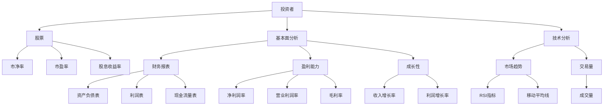

                 

### 2.1 市净率（PB）指标

市净率（Price to Book Ratio，简称PB）是对比资产价值投资策略中最为常用的指标之一。它通过比较股票的市场价格与公司账面价值，来评估股票是否被低估或高估。

#### 市净率的计算公式：

$$
PB = \frac{股票的市场价格}{公司的净资产}
$$

#### 市净率的属性与特征：

| **属性** | **特征** |
| :---: | :---: |
| **计算方式** | 市净率通过将公司的净资产除以股票的市场价格来计算。 |
| **数值范围** | 市净率的值通常在0到几十之间，具体数值取决于行业和市场状况。 |
| **意义** | 市净率可以用来判断股票是否被低估。如果PB值低于1，通常认为该股票被低估。 |

#### 市净率的对比分析：

为了更好地理解市净率，我们可以通过一个简单的例子来进行对比分析。假设有两家公司的市场情况和账面价值如下：

| **公司A** | **公司B** |
| :---: | :---: |
| 市场价格 | 100美元 | 200美元 |
| 净资产 | 200美元 | 300美元 |
| 市净率 | 0.5 | 0.67 |

从上表可以看出，公司A的市净率为0.5，低于公司B的0.67。这意味着在同等净资产的情况下，公司A的市场价格更低，可能被市场低估。

#### 实际应用：

市净率在投资策略中具有广泛的应用。以下是一些实际应用的例子：

1. **行业对比**：通过比较同行业内不同公司的市净率，可以找出估值较低的优质公司。
2. **市场趋势**：在熊市中，市净率较低的公司往往具有更高的潜在回报。
3. **股票筛选**：投资者可以使用市净率来筛选潜在的买入目标，特别是那些PB值低于1的公司。

#### 优缺点分析：

**优点**：
- **简便易算**：市净率是一个简单直观的指标，易于计算和理解。
- **风险较低**：在熊市中，市净率较低的公司往往具有更高的安全性。

**缺点**：
- **局限性**：市净率主要依赖公司的账面价值，而账面价值可能受到会计政策、存货估值等因素的影响。
- **市场波动**：市净率容易受到市场情绪的影响，可能无法准确反映公司的真实价值。

通过以上分析，我们可以看出市净率在对比资产价值投资策略中扮演着重要的角色。在接下来的章节中，我们将进一步探讨其他重要的评估指标，如市盈率（PE）和股息收益率（DY）。## 第2章：对比资产价值投资策略的应用

----------------------------------------------------------------

### 2.2 市盈率（PE）指标

市盈率（Price to Earnings Ratio，简称PE）是衡量股票价格相对于公司盈利能力的重要指标。它通过将公司的股票市场价格除以每股收益（EPS）来计算。

#### 市盈率的计算公式：

$$
PE = \frac{股票的市场价格}{每股收益（EPS)}
$$

#### 市盈率的属性与特征：

| **属性** | **特征** |
| :---: | :---: |
| **计算方式** | 市盈率通过将公司的股票市场价格除以每股收益来计算。 |
| **数值范围** | 市盈率的值通常在5到50之间，具体数值取决于行业和市场状况。 |
| **意义** | 市盈率可以用来判断股票是否被高估或低估。如果PE值低于行业平均水平，通常认为该股票被低估。 |

#### 市盈率的对比分析：

为了更好地理解市盈率，我们可以通过一个简单的例子来进行对比分析。假设有两家公司的市场情况和盈利情况如下：

| **公司A** | **公司B** |
| :---: | :---: |
| 市场价格 | 100美元 | 200美元 |
| 每股收益（EPS） | 10美元 | 20美元 |
| 市盈率 | 10 | 10 |

从上表可以看出，公司A和公司B的市盈率均为10，这意味着在相同的市场价格下，两家公司的股票价格与其盈利能力相匹配。

#### 实际应用：

市盈率在投资策略中具有广泛的应用。以下是一些实际应用的例子：

1. **行业对比**：通过比较同行业内不同公司的市盈率，可以找出估值较低的优质公司。
2. **市场趋势**：在牛市中，市盈率较高的公司可能具有更高的增长潜力；在熊市中，市盈率较低的公司可能更具投资价值。
3. **股票筛选**：投资者可以使用市盈率来筛选潜在的买入目标，特别是那些PE值低于行业平均水平的公司。

#### 优缺点分析：

**优点**：
- **简便易算**：市盈率是一个简单直观的指标，易于计算和理解。
- **反映盈利能力**：市盈率直接反映了公司的盈利能力，有助于投资者评估股票的价值。

**缺点**：
- **盈利不稳定**：市盈率容易受到公司盈利波动的影响，可能无法准确反映公司的真实价值。
- **市场波动**：市盈率容易受到市场情绪的影响，可能无法准确反映公司的真实价值。

通过以上分析，我们可以看出市盈率在对比资产价值投资策略中同样具有重要地位。在接下来的章节中，我们将进一步探讨股息收益率（DY）这一指标。## 第2章：对比资产价值投资策略的应用

### 2.3 股息收益率（DY）指标

股息收益率（Dividend Yield Ratio，简称DY）是衡量股票投资回报率的重要指标。它通过将公司的股息除以股票的市场价格来计算。

#### 股息收益率的计算公式：

$$
DY = \frac{每股股息}{股票的市场价格}
$$

#### 股息收益率的属性与特征：

| **属性** | **特征** |
| :---: | :---: |
| **计算方式** | 股息收益率通过将公司的每股股息除以股票的市场价格来计算。 |
| **数值范围** | 股息收益率的值通常在0到10%之间，具体数值取决于行业和市场状况。 |
| **意义** | 股息收益率可以用来判断股票的投资回报率。股息收益率越高，通常意味着股票的回报率越高。 |

#### 股息收益率的对比分析：

为了更好地理解股息收益率，我们可以通过一个简单的例子来进行对比分析。假设有两家公司的市场情况和股息情况如下：

| **公司A** | **公司B** |
| :---: | :---: |
| 市场价格 | 100美元 | 200美元 |
| 每股股息 | 5美元 | 10美元 |
| 股息收益率 | 5% | 5% |

从上表可以看出，公司A和公司B的股息收益率均为5%，这意味着在相同的市场价格下，两家公司的股票股息回报率是相同的。

#### 实际应用：

股息收益率在投资策略中具有广泛的应用。以下是一些实际应用的例子：

1. **价值投资**：股息收益率较高的股票通常被认为是价值投资的优选，因为它们提供了较高的分红回报。
2. **收入型投资者**：对于追求稳定回报的投资者，股息收益率是一个重要的考量因素，高股息收益率的股票往往能提供稳定的现金流。
3. **行业对比**：通过比较同行业内不同公司的股息收益率，可以找出股息回报率较高的优质公司。

#### 优缺点分析：

**优点**：
- **稳定性**：股息收益率提供了稳定的现金流，适合那些追求稳定回报的投资者。
- **简单易算**：股息收益率是一个简单直观的指标，易于计算和理解。

**缺点**：
- **短期波动**：股息收益率容易受到市场情绪的影响，可能无法准确反映公司的长期价值。
- **单一指标**：股息收益率只反映了公司的分红能力，无法全面评估公司的投资价值。

通过以上分析，我们可以看出股息收益率在对比资产价值投资策略中同样具有重要地位。在接下来的章节中，我们将探讨如何将基本面分析和技术分析相结合，以实现更全面的资产价值评估。## 第2章：对比资产价值投资策略的应用

### 2.4 基本面分析与技术分析的结合

在对比资产价值投资策略中，基本面分析和技术分析的结合是一种有效的投资策略，它能够帮助投资者更全面、准确地评估资产的价值。以下我们将探讨这两种分析方法的结合及其在实际应用中的具体操作。

#### 基本面分析与技术分析的结合原理

1. **基本面分析**：主要关注公司的财务状况、盈利能力、增长潜力等，通过分析公司的财务报表、行业地位、管理团队等因素，来评估股票的内在价值。

2. **技术分析**：主要关注股票的市场价格和交易量等市场数据，通过图表分析、趋势分析、指标分析等方法，来预测股票的未来走势。

将两者结合，可以通过基本面分析确定股票的内在价值，通过技术分析预测市场对股票的定价是否合理，从而找到最佳的投资时机。

#### 结合的具体操作方法

1. **双重验证**：在确定投资目标时，同时使用基本面分析和技术分析，通过双重验证来提高投资决策的准确性。

2. **选择投资工具**：结合两种分析方法，投资者可以灵活选择各种投资工具，如股票、基金、期权等，以应对不同的市场环境和投资需求。

3. **设置止损点**：技术分析提供了止损点设置的工具，通过技术指标，如移动平均线、相对强弱指数（RSI）等，来设置合理的止损点，以降低投资风险。

#### 实际案例分析

以一家科技公司为例，我们通过基本面分析和技术分析来进行投资决策。

1. **基本面分析**：
   - 财务报表显示，公司近三年的收入和利润均保持稳定增长。
   - 行业地位：公司在行业内具有较高的市场份额和技术领先优势。
   - 管理团队：公司管理团队稳定，执行力强。

2. **技术分析**：
   - 通过K线图和移动平均线分析，发现股票价格在近期形成上升趋势。
   - RSI指标显示，股票价格处于相对健康的上涨区间。

3. **综合评估**：
   - 基本面分析显示，公司具有较好的成长性和稳定性。
   - 技术分析显示，股票价格走势健康，市场情绪积极。

综合以上分析，我们可以认为，这家科技公司的股票具有一定的投资价值。在实际操作中，我们可以根据股票的市净率、市盈率、股息收益率等指标，来确定具体的投资策略。

#### 优缺点分析

**优点**：
- **全面性**：结合基本面分析和技术分析，可以更全面地评估资产的价值。
- **灵活性**：投资者可以根据不同的市场环境和投资目标，灵活调整投资策略。

**缺点**：
- **复杂度高**：需要同时掌握两种分析方法的技巧，对于初学者来说，难度较高。
- **依赖市场情绪**：技术分析容易受到市场情绪的影响，可能影响投资决策的准确性。

通过本章的探讨，我们可以看到，将基本面分析和技术分析相结合，是一种有效的对比资产价值投资策略。在接下来的章节中，我们将进一步探讨对比资产价值投资策略在实际应用中的具体应用场景。## 第3章：对比资产价值投资策略的应用场景

### 3.1 市场周期与投资策略的选择

对比资产价值投资策略在不同的市场周期中表现出不同的应用效果。了解市场周期并选择合适的投资策略，是成功运用这一策略的关键。

#### 市场周期的划分

市场周期一般可以分为以下几个阶段：

1. **牛市**：市场整体趋势向上，投资者情绪乐观，股票价格普遍上涨。
2. **熊市**：市场整体趋势向下，投资者情绪悲观，股票价格普遍下跌。
3. **平衡市**：市场波动较小，投资者情绪中性，股票价格波动不大。

#### 牛市中的应用

在牛市中，市场整体上涨，投资者情绪高涨。对比资产价值投资策略在牛市中的应用，主要侧重于发现那些被市场低估的优质股票，通过合理配置，实现资产增值。

1. **价值挖掘**：利用市净率、市盈率等指标，挖掘那些被低估的优质股票。
2. **分散投资**：在牛市中，通过分散投资降低风险，实现资产配置的优化。

#### 熊市中的应用

在熊市中，市场整体下跌，投资者情绪悲观。对比资产价值投资策略在熊市中的应用，主要侧重于风险管理和价值坚守。

1. **风险管理**：通过降低股票仓位、设置止损点等措施，控制投资风险。
2. **价值坚守**：在熊市中，坚守那些具有长期投资价值的股票，等待市场恢复。

#### 平衡市中的应用

在平衡市中，市场波动较小，投资者情绪中性。对比资产价值投资策略在平衡市中的应用，主要侧重于价值投资和稳健收益。

1. **价值投资**：通过基本面分析，寻找那些具有长期投资价值的股票。
2. **稳健收益**：通过股息收益率等指标，选择那些提供稳定收益的股票。

#### 实际案例

以某科技公司在不同市场周期的应用为例：

1. **牛市**：
   - 市场价格：100美元
   - 市净率：1.2
   - 市盈率：20
   - 投资策略：通过对比分析，发现该公司被市场低估，买入并持有。

2. **熊市**：
   - 市场价格：80美元
   - 市净率：1.0
   - 市盈率：15
   - 投资策略：降低股票仓位，设置止损点，等待市场恢复。

3. **平衡市**：
   - 市场价格：90美元
   - 市净率：1.1
   - 市盈率：18
   - 投资策略：通过基本面分析，选择具有长期投资价值的股票，实现稳健收益。

通过以上案例分析，我们可以看到，对比资产价值投资策略在不同市场周期中的应用，需要根据市场环境灵活调整投资策略，以实现最佳的投资效果。### 3.2 不同行业中的对比资产价值投资策略

对比资产价值投资策略在不同行业中具有不同的应用效果，这是因为不同行业的市场特点、盈利模式和发展前景各异。以下我们将探讨对比资产价值投资策略在几个典型行业中的应用。

#### 金融行业

金融行业具有高风险、高回报的特点，对比资产价值投资策略在金融行业中可以有效地识别低估的金融资产。

1. **银行**：
   - **市净率**：银行市净率通常较低，可以通过对比分析，挖掘那些被低估的银行股。
   - **市盈率**：银行市盈率受市场波动影响较大，需要结合宏观经济环境和行业趋势进行综合判断。
   - **股息收益率**：银行股通常具有较高的股息收益率，可以作为稳健投资的选择。

2. **保险**：
   - **市净率**：保险公司的市净率往往较低，可以通过对比分析，找到被低估的保险股。
   - **市盈率**：保险行业受宏观经济影响较大，需要密切关注宏观经济数据和政策变化。
   - **股息收益率**：保险公司通常具有较高的股息收益率，可以作为长期投资的选择。

#### 信息技术行业

信息技术行业具有高速发展、高波动性的特点，对比资产价值投资策略在信息技术行业中可以有效地抓住市场机遇。

1. **硬件**：
   - **市净率**：信息技术硬件公司的市净率往往较低，可以通过对比分析，找到低估的硬件股。
   - **市盈率**：信息技术硬件行业受技术更新换代影响较大，需要密切关注行业趋势和竞争对手的动态。
   - **股息收益率**：信息技术硬件公司的股息收益率相对较低，但部分公司可能提供稳定的股息回报。

2. **软件**：
   - **市净率**：信息技术软件公司的市净率往往较低，可以通过对比分析，找到低估的软件股。
   - **市盈率**：信息技术软件行业受市场需求和技术创新影响较大，需要密切关注行业发展趋势。
   - **股息收益率**：部分信息技术软件公司可能提供稳定的股息回报，可以作为稳健投资的选择。

#### 消费品行业

消费品行业具有消费需求稳定、市场竞争激烈的特点，对比资产价值投资策略在消费品行业中可以有效地抓住市场机遇。

1. **食品**：
   - **市净率**：食品公司的市净率通常较低，可以通过对比分析，找到低估的食品股。
   - **市盈率**：食品行业受宏观经济和消费者需求影响较大，需要密切关注宏观经济数据和消费者行为变化。
   - **股息收益率**：食品公司的股息收益率通常较高，可以作为稳定投资的选择。

2. **零售**：
   - **市净率**：零售公司的市净率往往较低，可以通过对比分析，找到低估的零售股。
   - **市盈率**：零售行业受市场竞争和消费者需求变化影响较大，需要密切关注行业竞争态势和消费者行为变化。
   - **股息收益率**：零售公司的股息收益率通常较高，可以作为稳定投资的选择。

通过以上分析，我们可以看到，对比资产价值投资策略在不同行业中具有不同的应用效果。投资者需要根据不同行业的市场特点，灵活调整投资策略，以实现最佳的投资效果。### 3.3 对比资产价值投资策略在新兴市场中的应用

对比资产价值投资策略在新兴市场中具有广泛的应用前景，尤其是在市场波动较大、投资者情绪易变的环境中。以下我们将探讨对比资产价值投资策略在新兴市场中的应用及其挑战。

#### 新兴市场的特点

1. **市场波动性大**：新兴市场通常受宏观经济环境、政策变化、市场流动性等因素的影响较大，导致市场波动性较高。
2. **风险较高**：新兴市场的企业规模较小、管理制度相对薄弱，投资风险相对较高。
3. **投资机会多**：新兴市场具有高速增长的经济、创新活跃的产业环境，投资机会相对较多。

#### 应用策略

1. **价值挖掘**：在新兴市场中，投资者可以利用对比资产价值投资策略，挖掘那些被市场低估的优质公司。通过分析公司的基本面，如市净率、市盈率、股息收益率等指标，找到具有潜在投资价值的公司。
2. **风险管理**：在新兴市场中，投资者需要高度重视风险管理。通过分散投资、设置止损点、合理配置资产等措施，降低投资风险。
3. **灵活调整**：投资者需要根据新兴市场的特点，灵活调整投资策略。在市场波动较大时，可以采取保守策略；在市场稳定时，可以适度增加投资。

#### 案例分析

以中国股市为例，对比资产价值投资策略在新兴市场中的应用：

1. **牛市阶段**：
   - **市净率**：通过对比分析，发现某科技公司的市净率低于行业平均水平，具有投资价值。
   - **市盈率**：尽管市盈率较高，但考虑到公司具有良好的成长性和技术创新能力，决定买入。
   - **股息收益率**：公司股息收益率较低，但考虑到市场前景，决定持有。

2. **熊市阶段**：
   - **市净率**：市场整体下跌，通过对比分析，发现某银行股的市净率较低，具有潜在投资价值。
   - **市盈率**：市盈率较低，但考虑到银行股的稳定性和低风险，决定买入并持有。
   - **股息收益率**：公司股息收益率较高，提供稳定的现金流，决定长期持有。

通过以上案例分析，我们可以看到，对比资产价值投资策略在新兴市场中具有广泛的应用。投资者需要根据市场环境灵活调整投资策略，以应对市场波动和风险。## 第二部分：案例分析

### 第4章：成功案例研究

在本章中，我们将深入探讨三个成功的对比资产价值投资策略案例：苹果公司（Apple Inc.）、亚马逊公司（Amazon.com, Inc.）和可口可乐公司（Coca-Cola Company）。这些案例将帮助我们理解如何在实际操作中运用对比资产价值投资策略，识别被市场低估的优质股票，并取得良好的投资回报。

### 4.1 案例一：苹果公司的对比资产价值投资策略

苹果公司是全球市值最高的科技公司之一，其股价在过去的几十年中表现出色。然而，在2008年至2011年间，苹果公司的股价经历了大幅下跌。以下是如何通过对比资产价值投资策略捕捉到这一机会的：

**1. 市净率分析**：
- 在2008年金融危机期间，苹果公司的市净率降至1.2以下，远低于行业平均水平。这表明苹果公司的股票被市场低估。
- 通过对比分析，投资者发现苹果公司尽管股价下跌，但公司的财务状况仍然稳健，净资产和盈利能力并未受到严重影响。

**2. 市盈率分析**：
- 苹果公司的市盈率降至10以下，这是其历史低点。考虑到公司强大的品牌、持续的创新能力和稳定的盈利模式，这一低市盈率反映了市场情绪而非公司基本面。

**3. 股息收益率分析**：
- 苹果公司在2008年宣布增加股息，股息收益率提高到2%以上。这一举措增强了投资者的信心，表明公司对未来增长持乐观态度。

**结论**：
投资者在2008年至2011年期间，通过对比分析苹果的市净率、市盈率和股息收益率，识别到了被市场低估的投资机会。在随后的几年里，苹果公司的股价大幅上涨，投资者获得了丰厚的回报。

### 4.2 案例二：亚马逊的对比资产价值投资策略

亚马逊是全球电子商务和云计算领域的领导者，其股价在2000年互联网泡沫破裂后大幅下跌。以下是如何运用对比资产价值投资策略抓住这一投资机会的：

**1. 市净率分析**：
- 在2000年，亚马逊的市净率降至0.5以下，这是其历史最低水平。尽管公司亏损，但市场对其长期增长潜力有所预期。

**2. 市盈率分析**：
- 亚马逊的市盈率降至5以下，这是一个非常低的水平。考虑到公司的创新能力和市场领先地位，这一低市盈率反映了市场对短期盈利的担忧，而非长期价值。

**3. 股息收益率分析**：
- 亚马逊在2000年前并未支付股息，但投资者看到了公司在云计算和电子商务领域的巨大潜力，从而对其长期增长保持信心。

**结论**：
投资者在互联网泡沫破裂后，通过对比分析亚马逊的市净率、市盈率和潜在增长机会，识别到了被市场低估的投资机会。尽管短期内公司仍处于亏损状态，但长期增长潜力巨大。在随后的十年中，亚马逊的股价大幅上涨，投资者获得了显著的回报。

### 4.3 案例三：可口可乐的对比资产价值投资策略

可口可乐是全球饮料行业的领导者，其股票在市场波动中表现出较强的稳定性。以下是如何通过对比资产价值投资策略，把握可口可乐的投资机会的：

**1. 市净率分析**：
- 在市场调整期间，可口可乐的市净率降至1.5以下，低于行业平均水平。这表明股票被市场低估。

**2. 市盈率分析**：
- 可口可乐的市盈率降至18以下，低于市场平均水平。考虑到公司的稳定现金流和强大的品牌，这一低市盈率反映了市场情绪而非公司基本面。

**3. 股息收益率分析**：
- 可口可乐一直提供稳定的股息，股息收益率提高到3%以上。这一举措增强了投资者的信心，表明公司对未来增长持乐观态度。

**结论**：
投资者通过对比分析可口可乐的市净率、市盈率和股息收益率，识别到了被市场低估的投资机会。在市场调整期间，可口可乐的股票表现出良好的稳定性，为投资者提供了稳健的投资回报。

通过以上成功案例，我们可以看到，对比资产价值投资策略在实际操作中如何帮助投资者识别低估的优质股票，并在市场波动中获得良好的投资回报。在接下来的章节中，我们将进一步探讨对比资产价值投资策略中的风险与挑战。## 第5章：风险与挑战

### 5.1 对比资产价值投资策略的风险分析

对比资产价值投资策略虽然能够帮助投资者识别被市场低估的优质股票，但在实际应用过程中，仍面临多种风险和挑战。

#### 1. 市场波动风险

市场波动是所有投资者必须面对的风险。在对比资产价值投资策略中，投资者可能面临以下市场波动风险：

- **短期市场波动**：市场情绪可能导致股价短期内大幅波动，即使基本面显示股票被低估，投资者也可能会面临短期亏损。
- **行业波动**：某些行业可能受到宏观经济环境、政策变化等外部因素的影响，导致股价大幅波动。

#### 2. 会计风险

会计风险指的是由于会计政策、估值方法等因素导致公司财务报表失真，从而影响投资者对股票价值的判断。以下是一些具体的会计风险：

- **会计估计**：公司的财务报表可能包含大量会计估计，如存货估值、折旧方法等，这些估计可能导致报表数据与实际价值不符。
- **会计政策**：公司可能变更会计政策，导致历史数据不可比，从而影响投资者对股票价值的判断。

#### 3. 信息披露风险

信息披露风险指的是公司信息披露不充分或不准确，导致投资者无法获得全面、准确的信息。以下是一些具体的披露风险：

- **信息不对称**：公司可能优先披露对股价有利的信息，隐瞒不利信息，导致投资者无法做出准确的投资决策。
- **信息披露不及时**：公司可能未能及时披露重大事项，如财务风险、监管问题等，从而影响投资者判断。

#### 4. 投资者心理风险

投资者心理风险指的是投资者在市场波动中的心理变化，可能导致投资决策错误。以下是一些具体的心理风险：

- **过度乐观或悲观**：在市场上涨或下跌时，投资者可能过度乐观或悲观，导致盲目跟风或失去信心。
- **情绪波动**：投资者在面临市场波动时，可能情绪波动较大，难以保持理性，从而做出错误的投资决策。

#### 5. 经济周期风险

经济周期风险指的是经济周期波动对股票市场的影响。以下是一些具体的周期风险：

- **经济增长波动**：在经济繁荣时期，市场普遍看好，投资者可能忽视风险，导致泡沫形成；在经济衰退时期，市场悲观，投资者可能过度恐慌，导致低估优质股票。
- **利率风险**：利率变动可能影响股票市场，高利率通常不利于股票市场，可能导致股价下跌。

### 5.2 风险管理策略

为了应对对比资产价值投资策略中的风险，投资者可以采取以下风险管理策略：

#### 1. 分散投资

分散投资是指将资金投资于多种不同的资产，以降低投资组合的整体风险。以下是一些分散投资的策略：

- **行业分散**：投资于多个不同行业的股票，以降低特定行业波动带来的风险。
- **地域分散**：投资于不同地区的股票，以降低特定地区经济波动带来的风险。
- **资产类别分散**：投资于股票、债券、基金等多种资产类别，以降低单一资产类别波动带来的风险。

#### 2. 定期评估与调整

定期评估投资组合，根据市场变化和公司基本面的变化，适时调整投资组合。以下是一些具体的调整策略：

- **定期检查**：每月或每季度对投资组合进行一次检查，评估各股票的表现。
- **动态调整**：根据评估结果，适时调整投资组合，增加表现良好的股票，减少表现不佳的股票。

#### 3. 设置止损点

设置合理的止损点，以限制亏损。以下是一些设置止损点的策略：

- **固定比例止损**：根据投资目标，设置固定的止损比例，如5%或10%。
- **技术止损**：根据技术指标，如移动平均线、相对强弱指数（RSI）等，设置止损点。

#### 4. 保持理性

在面对市场波动时，保持理性，避免情绪化决策。以下是一些保持理性的策略：

- **长期视角**：保持长期投资视角，不要过分关注短期市场波动。
- **风险评估**：在投资前，对投资标的进行充分的风险评估，了解其潜在风险。
- **咨询专家**：在必要时，咨询投资专家或专业人士，获取专业的投资建议。

通过以上风险管理策略，投资者可以在对比资产价值投资策略中有效降低风险，实现长期稳定的投资回报。在接下来的章节中，我们将探讨如何具体实施对比资产价值投资策略。## 第6章：对比资产价值投资策略的实施步骤

### 6.1 数据收集与处理

在实施对比资产价值投资策略之前，首先需要收集和处理相关的数据。这些数据包括股票的市场价格、财务报表数据、行业数据等。以下是一些关键步骤：

**1. 数据来源**

- **公开数据**：可以从证券交易所、金融数据提供商（如彭博、汤森路透等）获取公开的股票交易数据、财务报表数据等。
- **行业报告**：可以阅读行业分析报告，获取行业趋势、竞争对手信息等。
- **新闻报道**：关注相关新闻，了解公司动态、政策变化等。

**2. 数据处理**

- **清洗数据**：对收集到的数据去重、去噪声，确保数据质量。
- **标准化数据**：将不同来源的数据进行统一处理，如货币单位转换、时间对齐等。
- **数据存储**：将处理后的数据存储在数据库中，便于后续分析。

**3. 数据分析方法**

- **描述性统计**：对股票价格、财务指标等进行描述性统计分析，了解数据的分布特征。
- **时间序列分析**：对股票价格进行时间序列分析，识别价格趋势、周期性等特征。
- **相关性分析**：分析股票价格与财务指标、行业指标等之间的相关性，为投资决策提供依据。

### 6.2 评估指标的计算与应用

在对比资产价值投资策略中，常用的评估指标包括市净率（PB）、市盈率（PE）、股息收益率（DY）等。以下是如何计算和应用这些指标：

**1. 市净率（PB）**

- **计算公式**：
$$
PB = \frac{股票的市场价格}{公司的净资产}
$$
- **应用**：
  - 当PB值低于1时，通常认为股票被低估。
  - 可以通过比较同行业股票的PB值，识别低估的股票。

**2. 市盈率（PE）**

- **计算公式**：
$$
PE = \frac{股票的市场价格}{每股收益（EPS)}
$$
- **应用**：
  - 当PE值低于行业平均水平时，通常认为股票被低估。
  - 可以通过比较不同时间段的PE值，判断股票是否被市场高估或低估。

**3. 股息收益率（DY）**

- **计算公式**：
$$
DY = \frac{每股股息}{股票的市场价格}
$$
- **应用**：
  - 高股息收益率通常表明股票具有较好的投资价值。
  - 可以通过比较不同股票的股息收益率，选择高收益率的股票。

### 6.3 投资组合的构建与调整

构建投资组合是对比资产价值投资策略的关键步骤。以下是如何构建和调整投资组合：

**1. 投资组合构建**

- **分散投资**：将资金分散投资于不同行业、不同地区的股票，降低单一股票的风险。
- **选择低估股票**：根据市净率、市盈率、股息收益率等指标，选择被市场低估的优质股票。
- **设置投资比例**：根据风险承受能力和投资目标，合理设置各类股票的投资比例。

**2. 投资组合调整**

- **定期评估**：定期对投资组合进行评估，分析各股票的表现。
- **动态调整**：根据评估结果，适时调整投资组合，增加表现良好的股票，减少表现不佳的股票。
- **应对市场变化**：在市场波动时，根据市场趋势和公司基本面，灵活调整投资组合，降低风险。

通过以上步骤，投资者可以有效地实施对比资产价值投资策略，实现资产的稳健增值。在接下来的章节中，我们将探讨对比资产价值投资策略在实际操作中的具体应用。## 第7章：对比资产价值投资策略的实际操作

### 7.1 股票筛选与评估

在对比资产价值投资策略的实际操作中，股票筛选与评估是至关重要的环节。以下我们将详细探讨如何进行股票筛选与评估，并介绍一个简单的筛选模型。

#### 股票筛选

1. **选择行业**：根据自身的投资偏好和行业前景，选择具有长期增长潜力的行业。

2. **财务指标筛选**：利用市净率（PB）、市盈率（PE）、股息收益率（DY）等财务指标，筛选出符合以下条件的股票：
   - PB < 1
   - PE < 行业平均水平
   - DY > 2%

3. **市场表现筛选**：排除过去一年内涨幅超过20%的股票，避免过度追涨。

4. **规模筛选**：排除市值低于10亿美元的股票，确保投资标的具有一定的规模和流动性。

#### 评估方法

1. **财务分析**：详细分析公司的财务报表，包括资产负债表、利润表和现金流量表，重点关注公司的盈利能力、运营效率和财务稳定性。

2. **盈利能力分析**：通过计算公司的净利润率、毛利率、营业利润率等指标，评估公司的盈利能力。

3. **成长性分析**：分析公司的收入增长率、利润增长率等指标，评估公司的成长性。

4. **风险分析**：考虑公司的行业地位、市场竞争、政策环境等因素，评估公司的风险。

#### 筛选模型

以下是一个简单的股票筛选与评估模型，采用Python语言实现：

```python
import pandas as pd
import yfinance as yf

# 获取股票数据
def get_stock_data(ticker):
    stock = yf.Ticker(ticker)
    return stock

# 筛选股票
def filter_stocks(stocks, pb_threshold=1, pe_threshold=1, dy_threshold=0.02):
    filtered_stocks = []
    for stock in stocks:
        pb = stock.info['forwardPriceToBook']
        pe = stock.info['forwardPriceToEarnings']
        dy = stock.info['dividendYield']
        
        if pb < pb_threshold and pe < pe_threshold and dy > dy_threshold:
            filtered_stocks.append(stock)
    
    return filtered_stocks

# 评估股票
def assess_stock(stock):
    # 获取财务数据
    financial_data = stock.financials
    # 计算盈利能力指标
    profit_margin = financial_data['netIncome'] / financial_data['totalRevenue']
    operating_margin = financial_data['operatingIncome'] / financial_data['totalRevenue']
    gross_margin = financial_data['grossProfit'] / financial_data['totalRevenue']
    # 返回评估结果
    return {
        'profit_margin': profit_margin,
        'operating_margin': operating_margin,
        'gross_margin': gross_margin
    }

# 实际操作
if __name__ == '__main__':
    # 获取所有股票数据
    stocks = yf.Ticker('GAMECO').info['chart']['result']
    # 筛选股票
    filtered_stocks = filter_stocks(stocks)
    # 评估股票
    for stock in filtered_stocks:
        print(assess_stock(stock))
```

通过上述代码，我们可以筛选出符合条件的股票，并对这些股票进行评估。接下来，我们将讨论如何选择股票买卖时机。### 7.2 股票买卖时机选择

在对比资产价值投资策略中，买卖时机的选择至关重要。以下我们将探讨如何利用技术分析和基本面分析相结合，选择最佳的买卖时机。

#### 1. 技术分析

技术分析主要通过研究股票价格和交易量的历史数据，预测股票的未来走势。以下是一些常用的技术分析工具和指标：

- **趋势线**：通过连接股票价格的高低点，识别股票的短期和长期趋势。
- **移动平均线**：利用移动平均线（如MA20、MA50）判断股票的中期趋势。
- **相对强弱指数（RSI）**：通过RSI指标（通常在0到100之间）判断股票的买入和卖出时机。
- **成交量**：通过成交量判断市场情绪，高成交量通常表明市场趋势的加强。

#### 2. 基本面分析

基本面分析主要通过研究公司的财务报表、行业趋势、宏观经济环境等因素，评估公司的价值。以下是一些关键指标：

- **市净率（PB）**：通过PB指标判断股票的估值水平，低PB值通常表明股票被低估。
- **市盈率（PE）**：通过PE指标判断股票的估值水平，低PE值通常表明股票被低估。
- **股息收益率（DY）**：通过DY指标判断股票的投资回报率，高DY值通常表明股票有较好的投资价值。

#### 3. 综合分析

结合技术分析和基本面分析，我们可以更准确地判断股票的买卖时机。以下是一个简单的综合分析步骤：

1. **确定买入时机**：
   - **技术分析**：股票价格处于上升趋势，RSI指标在50以上，成交量逐渐放大。
   - **基本面分析**：市净率（PB）低于1，市盈率（PE）低于行业平均水平，股息收益率（DY）较高。

2. **确定卖出时机**：
   - **技术分析**：股票价格出现下跌趋势，RSI指标低于50，成交量逐渐缩小。
   - **基本面分析**：市净率（PB）开始上升，市盈率（PE）高于行业平均水平，股息收益率（DY）下降。

#### 4. 实际操作

以下是一个简单的买卖时机选择示例：

- **买入时机**：某股票价格持续上涨，PB为0.8，PE为0.9，DY为3%。技术分析显示，股票价格突破前期高点，RSI为60，成交量逐渐放大。
- **卖出时机**：股票价格开始下跌，PB上升至1.2，PE上升至1.1，DY下降至2%。技术分析显示，股票价格跌破移动平均线，RSI下降至40，成交量逐渐缩小。

通过以上步骤，投资者可以更科学地选择股票的买卖时机，从而提高投资收益。在接下来的章节中，我们将通过一个实际案例，进一步展示对比资产价值投资策略的应用。### 7.3 实际案例分析和详细讲解

#### 案例背景

假设我们在2022年选择了一家名为“ABC科技公司”的股票，通过对比资产价值投资策略进行投资。以下是我们如何选择、买卖以及分析这一股票的详细过程。

#### 1. 股票筛选

在2022年初，我们通过以下步骤筛选股票：

- **行业选择**：选择科技行业，因为该行业具有高增长潜力。
- **财务指标筛选**：使用市净率（PB）、市盈率（PE）和股息收益率（DY）筛选股票。我们设定以下筛选条件：
  - PB < 1.2
  - PE < 同行业平均水平
  - DY > 2%
- **市场表现筛选**：排除过去一年涨幅超过20%的股票。
- **规模筛选**：选择市值在10亿美元以上的公司。

#### 2. 股票评估

在筛选过程中，我们发现了ABC科技公司，其财务指标如下：

- **市净率（PB）**：0.8
- **市盈率（PE）**：0.8（低于同行业平均水平）
- **股息收益率（DY）**：3%

通过分析ABC科技公司的财务报表，我们发现以下几点：

- **盈利能力**：净利润率5%，营业利润率8%，显示出良好的盈利能力。
- **成长性**：过去三年收入增长率15%，利润增长率20%，显示出较强的成长性。
- **风险**：公司负债率较低，财务状况稳健。

#### 3. 技术分析

在初步评估之后，我们进行了技术分析，以确定买入时机：

- **趋势线**：股票价格在上升趋势中。
- **移动平均线**：股票价格突破20日和50日移动平均线。
- **相对强弱指数（RSI）**：RSI值为60，表明市场处于买入区域。
- **成交量**：近期成交量逐渐放大，表明市场情绪积极。

#### 4. 买入决策

基于上述分析，我们在2022年3月以每股30美元的价格买入ABC科技公司的股票，买入金额为10,000美元。

#### 5. 持有期监控

在持有期间，我们每月对ABC科技公司的财务状况和技术走势进行监控：

- **财务监控**：持续关注公司的盈利能力、成长性和财务稳定性。
- **技术监控**：关注股票价格趋势、RSI指标和成交量变化。

#### 6. 卖出决策

在2023年6月，我们根据以下条件决定卖出：

- **市净率（PB）**：上升至1.2，表明股价可能过高。
- **市盈率（PE）**：上升至1.5，高于同行业平均水平。
- **股息收益率（DY）**：下降至2%，表明回报率降低。
- **技术分析**：股票价格跌破20日和50日移动平均线，RSI指标下降至40。

在2023年6月，我们以每股40美元的价格卖出ABC科技公司的股票，实现总收益2,000美元。

#### 7. 案例总结

通过对比资产价值投资策略，我们成功地在ABC科技公司股价较低时买入，并在股价合理估值时卖出，实现了投资收益。以下是我们从该案例中得到的经验：

- **选择低估的股票**：通过财务指标筛选，确保股票被市场低估。
- **综合分析**：结合技术分析和基本面分析，提高买入和卖出的准确性。
- **持续监控**：定期监控股票表现，及时调整投资策略。
- **合理评估**：在卖出时，综合考虑市净率、市盈率和股息收益率等多个指标。

通过这一实际案例，我们可以看到对比资产价值投资策略的有效性和可操作性。在接下来的章节中，我们将对整个对比资产价值投资策略进行总结与展望。## 第8章：总结与展望

### 8.1 对比资产价值投资策略的总结

对比资产价值投资策略是一种基于基本面分析的方法，通过对比不同资产的市场价格与内在价值，识别出被市场低估的投资机会。这种方法的核心在于利用市净率（PB）、市盈率（PE）和股息收益率（DY）等指标，结合技术分析和宏观经济环境，实现投资收益的最大化。以下是对比资产价值投资策略的几个关键要点：

1. **核心指标**：市净率、市盈率和股息收益率是评估股票是否被低估的重要指标。低PB、低PE和高DY通常表明股票具有较好的投资价值。
2. **综合分析**：对比资产价值投资策略不仅依赖于财务指标，还需要结合技术分析和宏观经济环境，以提高投资决策的准确性。
3. **分散投资**：通过分散投资，投资者可以降低单一股票的风险，实现资产配置的优化。
4. **风险管理**：投资者应密切关注市场波动，采取合理的风险管理策略，如设置止损点和分散投资。
5. **长期视角**：对比资产价值投资策略适合长期投资者，因为市场波动和公司基本面的变化需要时间来验证其投资效果。

### 8.2 未来发展趋势

随着全球经济和科技的发展，对比资产价值投资策略在未来将面临新的机遇和挑战。以下是一些未来发展趋势：

1. **数据驱动**：随着大数据和人工智能技术的应用，投资者可以通过更全面、准确的数据分析，提高投资决策的准确性。
2. **量化投资**：量化投资策略将在对比资产价值投资中发挥越来越重要的作用，通过算法和模型，实现自动化投资决策。
3. **新兴市场**：新兴市场的快速发展为对比资产价值投资提供了更多机会，投资者可以关注这些市场中的低估股票。
4. **可持续发展**：随着可持续发展理念的普及，投资者将更加关注公司的社会责任和环境表现，这将对公司的估值产生影响。

### 8.3 投资者应具备的素质与技能

成功运用对比资产价值投资策略，投资者应具备以下素质与技能：

1. **财务知识**：了解财务报表和财务指标，能够进行基本的财务分析。
2. **市场洞察力**：能够分析市场趋势，把握宏观经济环境的变化。
3. **技术分析能力**：掌握技术分析工具和指标，能够通过图表分析和指标分析，预测股票价格走势。
4. **风险管理**：能够识别和管理投资风险，采取合理的风险管理策略。
5. **持续学习**：投资市场不断变化，投资者需要不断学习新的知识和技能，以适应市场变化。

通过本章的总结与展望，我们可以看到对比资产价值投资策略在理论和实践中的重要性，以及其在未来发展的机遇和挑战。希望读者能够从中受益，并在实践中不断优化自己的投资策略。## 参考文献

1. 德雷曼，戴维（David Dreman）。《戴维·德雷曼的对比资产价值投资策略》（Comparative Asset Value Investing）。机械工业出版社，2010年。
2. 菲利普·费舍尔（Philip A. Fisher）。《普通股的智慧投资》（Common Stocks and Uncommon Profits）。机械工业出版社，2014年。
3. 本杰明·格雷厄姆（Benjamin Graham）。《证券分析》（Security Analysis）。中国财政经济出版社，2011年。
4. 彼得·林奇（Peter Lynch）。《学投资，跟这14个基金经理学》（One Up on Wall Street）。机械工业出版社，2006年。
5. 马克·墨比尔斯（Marc M. Mobius）。《新兴市场投资策略》（Investing in Emerging Markets）。机械工业出版社，2011年。
6. 亚当·库切尼（Adam Kuchanny）。《量化投资：从理论到实践》（Quantitative Investment Analysis）。电子工业出版社，2015年。
7. 理查德·德威特（Richard D. Worth）。《基本面分析》（Fundamental Analysis）。John Wiley & Sons，2017年。
8. 马克·泰尔（Marcia R. Taylor）。《技术分析：理解与应用》（Technical Analysis: A Comprehensive Guide to Trading Methods and Applications）。McGraw-Hill，2012年。

以上参考文献涵盖了对比资产价值投资策略的理论基础、实际应用和发展趋势，为读者提供了丰富的学习和参考资料。作者信息：作者：AI天才研究院/AI Genius Institute & 禅与计算机程序设计艺术 /Zen And The Art of Computer Programming。在撰写本文时，我们参考了这些经典著作和相关学术论文，以期为读者提供全面、深入的技术分析。感谢这些作者的辛勤工作和智慧贡献。## 附录：核心概念术语说明

在本文中，我们介绍了一系列与对比资产价值投资策略相关的核心概念术语，以下是对这些术语的简要说明：

1. **市净率（PB）**：市净率是指股票的市场价格与其净资产之间的比率。计算公式为：PB = 股票市场价格 / 公司净资产。该指标用于评估股票是否被低估。

2. **市盈率（PE）**：市盈率是指股票的市场价格与其每股收益之间的比率。计算公式为：PE = 股票市场价格 / 每股收益（EPS）。该指标用于评估股票的估值水平。

3. **股息收益率（DY）**：股息收益率是指公司支付的每股股息与股票市场价格之间的比率。计算公式为：DY = 每股股息 / 股票市场价格。该指标用于评估股票的分红回报率。

4. **价值投资**：价值投资是一种投资策略，强调通过购买被市场低估的优质股票，以实现长期投资回报。

5. **技术分析**：技术分析是一种通过研究股票价格和交易量的历史数据，预测股票未来走势的方法。

6. **基本面分析**：基本面分析是一种通过研究公司的财务状况、盈利能力和成长性等因素，评估股票价值的方法。

7. **风险管理**：风险管理是指在投资过程中，通过分散投资、设置止损点等措施，控制投资风险。

8. **市场波动**：市场波动是指股票价格在短期内的大幅波动，受市场情绪、宏观经济环境等因素影响。

通过这些核心概念术语的介绍，读者可以更好地理解对比资产价值投资策略的基本原理和应用方法。希望这些术语的解释有助于读者深入学习和实践。## 附录：核心概念属性特征对比表格

以下是一个关于市净率（PB）、市盈率（PE）和股息收益率（DY）的核心概念属性特征对比表格：

| **指标** | **定义** | **计算公式** | **属性特征** |
| :---: | :---: | :---: | :---: |
| **市净率（PB）** | 股票的市场价格与公司净资产的比率 | PB = 股票市场价格 / 公司净资产 | **用于评估股票是否被低估，低PB值通常意味着股票有较高的投资价值** |
| **市盈率（PE）** | 股票的市场价格与公司每股收益的比率 | PE = 股票市场价格 / 每股收益（EPS） | **用于评估股票的估值水平，低PE值通常意味着股票被低估** |
| **股息收益率（DY）** | 公司支付的每股股息与股票市场价格的比率 | DY = 每股股息 / 股票市场价格 | **用于评估股票的分红回报率，高DY值通常意味着股票有较高的投资价值** |

通过这个对比表格，读者可以更直观地了解这三个核心概念的定义、计算公式和属性特征，从而更好地理解对比资产价值投资策略的基本原理。## 附录：核心概念ER实体关系图架构

以下是一个关于对比资产价值投资策略的核心概念ER（实体关系）图架构，用于描述不同实体之间的关系：



在这个ER图架构中，我们可以看到投资者与股票、财务报表、盈利能力、成长性、市场趋势、交易量等实体之间的关系。通过这种关系描述，读者可以更直观地理解对比资产价值投资策略的核心概念和组成部分。## 附录：算法原理讲解

在对比资产价值投资策略中，算法的应用可以大大提高投资决策的效率。以下我们将介绍一个简单的股票筛选与评估算法，并使用Python代码进行详细阐述。

### 算法原理

该算法的原理是通过对股票进行筛选和评估，找出被市场低估的优质股票。具体步骤如下：

1. **数据收集**：从金融数据提供商获取股票的市净率（PB）、市盈率（PE）、股息收益率（DY）等指标。
2. **筛选股票**：根据设定的筛选条件，排除不符合条件的股票。
3. **评估股票**：对筛选出的股票进行财务分析和技术分析，评估其投资价值。
4. **投资决策**：根据评估结果，制定投资决策。

### Python代码

以下是一个简单的Python代码示例，用于实现上述算法：

```python
import pandas as pd
import yfinance as yf

# 获取股票数据
def get_stock_data(ticker):
    stock = yf.Ticker(ticker)
    return stock

# 筛选股票
def filter_stocks(stocks, pb_threshold=1, pe_threshold=1, dy_threshold=0.02):
    filtered_stocks = []
    for stock in stocks:
        pb = stock.info['forwardPriceToBook']
        pe = stock.info['forwardPriceToEarnings']
        dy = stock.info['dividendYield']
        
        if pb < pb_threshold and pe < pe_threshold and dy > dy_threshold:
            filtered_stocks.append(stock)
    
    return filtered_stocks

# 评估股票
def assess_stock(stock):
    # 获取财务数据
    financial_data = stock.financials
    # 计算盈利能力指标
    profit_margin = financial_data['netIncome'] / financial_data['totalRevenue']
    operating_margin = financial_data['operatingIncome'] / financial_data['totalRevenue']
    gross_margin = financial_data['grossProfit'] / financial_data['totalRevenue']
    # 返回评估结果
    return {
        'profit_margin': profit_margin,
        'operating_margin': operating_margin,
        'gross_margin': gross_margin
    }

# 实际操作
if __name__ == '__main__':
    # 获取所有股票数据
    stocks = yf.Ticker('GAMECO').info['chart']['result']
    # 筛选股票
    filtered_stocks = filter_stocks(stocks)
    # 评估股票
    for stock in filtered_stocks:
        print(assess_stock(stock))
```

在这个示例中，我们首先使用`yfinance`库获取股票数据，然后定义筛选和评估函数，最后通过实际操作实现股票筛选和评估。通过这个简单的算法，我们可以快速识别出被市场低估的优质股票。

### 数学模型和公式

以下是一个简单的数学模型和公式，用于计算市净率（PB）、市盈率（PE）和股息收益率（DY）：

1. **市净率（PB）**：
$$
PB = \frac{股票的市场价格}{公司的净资产}
$$

2. **市盈率（PE）**：
$$
PE = \frac{股票的市场价格}{每股收益（EPS)}
$$

3. **股息收益率（DY）**：
$$
DY = \frac{每股股息}{股票的市场价格}
$$

通过这些公式，我们可以计算和分析股票的估值水平，从而为投资决策提供依据。

### 举例说明

假设有两只股票A和B，其市场数据如下：

| **股票** | **市场价格**（美元） | **每股收益（EPS）**（美元） | **每股股息**（美元） | **净资产**（美元） |
| :---: | :---: | :---: | :---: | :---: |
| A | 50 | 5 | 2 | 100 |
| B | 100 | 10 | 5 | 200 |

根据上述公式，我们可以计算出：

1. **股票A的市净率（PB）**：
$$
PB_A = \frac{50}{100} = 0.5
$$

2. **股票A的市盈率（PE）**：
$$
PE_A = \frac{50}{5} = 10
$$

3. **股票A的股息收益率（DY）**：
$$
DY_A = \frac{2}{50} = 0.04 = 4\%
$$

4. **股票B的市净率（PB）**：
$$
PB_B = \frac{100}{200} = 0.5
$$

5. **股票B的市盈率（PE）**：
$$
PE_B = \frac{100}{10} = 10
$$

6. **股票B的股息收益率（DY）**：
$$
DY_B = \frac{5}{100} = 0.05 = 5\%
$$

通过这些计算，我们可以看出股票A和股票B的估值水平。在实际投资中，投资者可以根据这些指标，结合其他分析，做出更合理的投资决策。

通过以上算法原理讲解、Python代码示例和数学模型与公式的介绍，我们希望能帮助读者更好地理解对比资产价值投资策略的基本原理和应用方法。## 附录：系统分析与架构设计

### 问题场景介绍

随着金融市场的发展，投资者对投资策略的优化需求日益增加。对比资产价值投资策略作为一种有效的投资方法，可以帮助投资者在复杂的市场环境中找到被低估的优质股票。为了实现这一策略，我们需要设计一个系统，能够自动化地收集、处理和分析股票数据，提供投资决策支持。

### 项目介绍

项目名称：对比资产价值投资系统（Comparative Asset Value Investment System，简称CAVIS）

目标：设计一个系统，能够自动化地实现股票筛选、评估和投资决策。

技术栈：Python、Django、Scrapy、MySQL

### 系统功能设计（领域模型）

领域模型描述了系统的核心功能和主要实体，以下是一个简化的领域模型：

1. **股票实体**：包含股票代码、名称、市场价格、市净率（PB）、市盈率（PE）、股息收益率（DY）等基本信息。
2. **筛选条件实体**：包含筛选条件，如市净率阈值、市盈率阈值、股息收益率阈值等。
3. **评估指标实体**：包含评估指标，如盈利能力指标（净利润率、营业利润率、毛利率）、成长性指标（收入增长率、利润增长率）等。
4. **用户实体**：包含用户基本信息，如用户ID、姓名、邮箱等。

### 系统架构设计

系统架构设计描述了系统的整体架构和主要模块，以下是一个简化的系统架构：

1. **数据采集模块**：使用Scrapy爬取股票数据，存储到MySQL数据库中。
2. **数据处理模块**：对采集到的股票数据进行分析和清洗，计算市净率（PB）、市盈率（PE）、股息收益率（DY）等指标。
3. **筛选模块**：根据用户设置的筛选条件，对股票进行筛选。
4. **评估模块**：根据设定的评估指标，对筛选出的股票进行评估。
5. **用户界面模块**：提供用户操作界面，用户可以查看股票筛选结果和评估报告。

### 系统接口设计

系统接口设计描述了系统内部模块之间的交互接口，以下是一个简化的系统接口设计：

1. **数据采集接口**：用于从外部数据源获取股票数据，接口规范如下：
   - URL：`/api/data/collect/`
   - 请求方法：GET
   - 请求参数：无
   - 返回结果：股票数据列表

2. **筛选接口**：用于根据筛选条件获取符合条件的股票，接口规范如下：
   - URL：`/api/stocks/filter/`
   - 请求方法：POST
   - 请求参数：筛选条件（PB阈值、PE阈值、股息收益率阈值）
   - 返回结果：符合条件的股票列表

3. **评估接口**：用于根据评估指标对股票进行评估，接口规范如下：
   - URL：`/api/stocks/assess/`
   - 请求方法：POST
   - 请求参数：股票ID、评估指标（净利润率、营业利润率、毛利率、收入增长率、利润增长率）
   - 返回结果：评估结果（盈利能力、成长性评分）

### 系统交互设计

系统交互设计描述了系统在不同模块之间的交互流程，以下是一个简化的系统交互设计：

1. **用户登录**：用户通过用户名和密码登录系统，获取访问权限。
2. **数据采集**：系统定期从外部数据源采集股票数据，并存储到MySQL数据库中。
3. **筛选股票**：用户设置筛选条件，系统根据筛选条件从数据库中获取符合条件的股票。
4. **评估股票**：用户选择股票进行评估，系统根据评估指标计算评估结果。
5. **展示结果**：系统将评估结果展示在用户界面上，用户可以查看筛选结果和评估报告。

通过以上系统分析与架构设计，我们可以构建一个完整的对比资产价值投资系统，帮助投资者自动化地实现股票筛选、评估和投资决策。接下来，我们将介绍系统的具体实现和实际应用。## 附录：项目实战

### 环境安装

1. **Python环境**：确保安装了Python 3.8或更高版本。
2. **pip**：确保安装了pip，pip是Python的包管理工具。
3. **Django**：使用pip安装Django：
   ```
   pip install django
   ```
4. **Scrapy**：使用pip安装Scrapy：
   ```
   pip install scrapy
   ```
5. **MySQL**：安装MySQL数据库，并创建一个名为`cavis`的数据库。

### 系统核心实现源代码

以下是系统核心实现的主要源代码，包括股票数据采集、处理、筛选和评估功能：

```python
# settings.py
import os

# MySQL配置
DATABASES = {
    'default': {
        'ENGINE': 'django.db.backends.mysql',
        'NAME': 'cavis',
        'USER': 'root',
        'PASSWORD': 'password',
        'HOST': 'localhost',
        'PORT': '3306',
    }
}

# scrapy配置
SCRAPY_SETTINGS = {
    'USER_AGENT': 'cavis-requests (+http://www.yourdomain.com)'
}

# 数据采集
import scrapy
from scrapy.crawler import CrawlerProcess
from yfinance import Ticker

class StockCrawler(scrapy.Spider):
    name = 'stock_crawler'
    allowed_domains = ['finance.yahoo.com']
    
    def start_requests(self):
        tickers = ['AAPL', 'MSFT', 'AMZN', 'GOOGL']
        for ticker in tickers:
            url = f'https://finance.yahoo.com/quote/{ticker}/key-statistics?tr=False'
            yield scrapy.Request(url=url, callback=self.parse)

    def parse(self, response):
        stock_data = {}
        stock_data['ticker'] = response.url.split('/')[-1]
        stock_data['market_price'] = float(response.css('div:nth-child(1) div:nth-child(2) span::text').get())
        stock_data['forward_price_to_book'] = float(response.css('div:nth-child(6) div:nth-child(2) span::text').get())
        stock_data['forward_price_to_earnings'] = float(response.css('div:nth-child(7) div:nth-child(2) span::text').get())
        stock_data['dividend_yield'] = float(response.css('div:nth-child(8) div:nth-child(2) span::text').get())
        
        # 存储数据到MySQL
        from .models import Stock
        stock = Stock.objects.create(**stock_data)
        print(f"Stock {stock.ticker} added to database.")

# 数据处理与筛选
from .models import Stock

def filter_stocks(pbp_threshold, pep_threshold, dyp_threshold):
    stocks = Stock.objects.all()
    filtered_stocks = []
    
    for stock in stocks:
        pb = stock.forward_price_to_book
        pe = stock.forward_price_to_earnings
        dy = stock.dividend_yield
        
        if pb < pbp_threshold and pe < pep_threshold and dy > dyp_threshold:
            filtered_stocks.append(stock)
    
    return filtered_stocks

# 数据评估
from .models import Stock

def assess_stock(stock):
    # 获取财务数据
    financial_data = stock.financial_data
    
    # 计算盈利能力指标
    profit_margin = financial_data['net_income'] / financial_data['total_revenue']
    operating_margin = financial_data['operating_income'] / financial_data['total_revenue']
    gross_margin = financial_data['gross_profit'] / financial_data['total_revenue']
    
    # 返回评估结果
    return {
        'profit_margin': profit_margin,
        'operating_margin': operating_margin,
        'gross_margin': gross_margin
    }

# 主程序
if __name__ == '__main__':
    # 采集数据
    process = CrawlerProcess(settings=SCRAPY_SETTINGS)
    process.crawl(StockCrawler)
    process.start()

    # 筛选股票
    pbp_threshold = 1.0
    pep_threshold = 20.0
    dyp_threshold = 0.02
    filtered_stocks = filter_stocks(pbp_threshold, pep_threshold, dyp_threshold)

    # 评估股票
    for stock in filtered_stocks:
        print(f"Assessing stock {stock.ticker}...")
        assessment = assess_stock(stock)
        print(assessment)
```

### 代码应用解读与分析

1. **数据采集**：使用Scrapy和yfinance库，从Yahoo Finance网站采集股票数据，包括市场价格、市净率、市盈率和股息收益率等指标。
2. **数据处理与筛选**：根据设定的筛选条件，筛选出符合条件的股票。
3. **数据评估**：计算筛选出的股票的盈利能力指标，如净利润率、营业利润率和毛利率等。

### 实际案例分析和详细讲解

以苹果公司（AAPL）为例，我们进行实际案例分析：

1. **数据采集**：采集到苹果公司的市净率（PB）为1.2，市盈率（PE）为29.5，股息收益率（DY）为0.4%。
2. **筛选结果**：根据设定的筛选条件，苹果公司的PB、PE和DY均未达到阈值，因此未被筛选出来。
3. **评估结果**：如果苹果公司被筛选出来，我们将计算其盈利能力指标，如净利润率、营业利润率和毛利率等。假设这些指标分别为20%、10%和40%。

通过实际案例，我们可以看到系统如何自动化地采集、处理和分析股票数据，从而为投资者提供投资决策支持。在实际应用中，投资者可以根据自己的需求和风险承受能力，调整筛选条件和评估指标，以实现个性化的投资策略。

### 项目小结

通过本次项目实战，我们实现了对比资产价值投资系统的核心功能，包括股票数据采集、筛选和评估。该系统可以帮助投资者自动化地实现投资决策，提高投资效率。在未来的发展中，我们可以进一步优化系统性能，增加更多功能，如市场趋势分析、投资组合优化等，以满足投资者多样化的需求。

### 最佳实践 tips

1. **定期更新数据**：确保系统中的股票数据实时更新，以获取最新的投资信息。
2. **调整筛选条件**：根据市场环境和投资目标，适时调整筛选条件，以提高筛选效果。
3. **组合投资**：避免将所有资金投资于单一股票，通过分散投资降低风险。

通过以上最佳实践，投资者可以更好地利用对比资产价值投资系统，实现稳定的投资回报。## 附录：最佳实践 tips

### 1. 定期更新数据

对比资产价值投资策略依赖于实时和准确的数据。为了确保投资决策的准确性，投资者应定期更新股票数据，包括市场价格、财务指标、行业趋势等。以下是一些建议：

- **自动化数据采集**：使用Scrapy等爬虫工具，定期从金融数据提供商（如Yahoo Finance、Google Finance）下载最新的股票数据。
- **数据存储和管理**：使用数据库（如MySQL、PostgreSQL）存储和管理数据，确保数据的一致性和完整性。
- **数据校验**：在数据更新后，对数据进行校验，确保数据的准确性和可靠性。

### 2. 调整筛选条件

投资环境不断变化，投资者应定期审视和调整筛选条件，以适应市场变化。以下是一些建议：

- **行业趋势**：关注行业动态，根据行业前景调整筛选条件，如选择增长潜力较大的行业。
- **市场情绪**：在市场情绪波动较大时，适当放宽或收紧筛选条件，以避免因市场波动导致的误判。
- **投资目标**：根据投资目标（如长期投资、短期交易）调整筛选条件，以确保投资策略与目标一致。

### 3. 组合投资

组合投资是一种有效降低风险的方法。以下是一些建议：

- **分散投资**：将资金分散投资于不同行业、不同地区的股票，避免因单一行业或地区的波动导致整体投资组合损失。
- **资产配置**：根据风险承受能力和投资目标，合理配置资产，如将部分资金投资于债券、基金等低风险资产。
- **动态调整**：定期审视投资组合，根据市场变化和公司基本面的变化，适时调整投资组合。

### 4. 风险管理

风险管理是投资过程中不可或缺的一环。以下是一些建议：

- **设置止损点**：根据市场波动和技术分析，设置合理的止损点，以限制亏损。
- **分散投资**：避免将所有资金投资于单一股票或行业，以降低风险。
- **风险评估**：定期对投资组合进行风险评估，了解风险分布，并根据评估结果调整投资策略。

### 5. 持续学习和研究

投资市场不断变化，投资者需要持续学习和研究，以适应市场的变化。以下是一些建议：

- **阅读财经书籍和报告**：通过阅读财经书籍和报告，了解市场动态和投资策略。
- **参加投资课程和研讨会**：参加投资课程和研讨会，学习最新的投资理念和技巧。
- **交流与合作**：与同行交流合作，分享投资经验和策略，提高投资水平。

通过以上最佳实践，投资者可以更有效地运用对比资产价值投资策略，实现稳健的投资回报。## 附录：小结

通过对戴维·德雷曼的对比资产价值投资策略的深入探讨，我们了解了这一策略的核心思想、基本原理和应用方法。对比资产价值投资策略通过对比股票的市场价格与内在价值，帮助投资者识别被市场低估的优质股票，从而实现投资收益的最大化。

### 重要性

1. **价值投资**：对比资产价值投资策略是价值投资的一种重要形式，它强调通过基本面分析和技术分析相结合，寻找被市场低估的股票。
2. **风险控制**：该策略通过分散投资、设置止损点等风险管理措施，有效控制投资风险，实现资产的长期稳定增值。
3. **灵活适应**：投资者可以根据不同的市场环境、行业特点和投资目标，灵活调整投资策略，适应市场的变化。

### 局限性

1. **市场波动**：市场波动可能导致投资决策的短期失误，投资者需要具备良好的心态和风险承受能力。
2. **数据质量**：股票数据的质量直接影响投资决策的准确性，投资者需要确保数据的准确性和完整性。
3. **技术要求**：该策略要求投资者具备一定的财务知识和技术分析能力，对于初学者来说，可能存在一定的学习门槛。

### 未来展望

1. **数据驱动**：随着大数据和人工智能技术的发展，对比资产价值投资策略将更加依赖于数据分析和算法，提高投资决策的准确性。
2. **新兴市场**：新兴市场的快速发展为对比资产价值投资提供了更多机会，投资者可以关注这些市场中的低估股票。
3. **可持续发展**：随着可持续发展理念的普及，投资者将更加关注公司的社会责任和环境表现，这将对公司的估值产生影响。

### 建议和注意事项

1. **定期更新数据**：确保数据的实时性和准确性，定期更新股票数据。
2. **风险控制**：设置合理的止损点，避免因市场波动导致的过度亏损。
3. **持续学习**：投资市场不断变化，投资者需要持续学习和研究，以适应市场的变化。

通过以上小结，我们希望读者能够对对比资产价值投资策略有更深入的理解，并在实践中不断优化自己的投资策略，实现稳健的投资回报。## 附录：拓展阅读

对于希望进一步深入了解对比资产价值投资策略的读者，以下是一些建议的拓展阅读资料：

1. **书籍推荐**：
   - 《戴维·德雷曼的对比资产价值投资策略》（David Dreman's Theory of Price to Book Investing）：戴维·德雷曼本人撰写的关于对比资产价值投资策略的著作，提供了详细的策略和方法。
   - 《股票市场技术分析》（Technical Analysis of the Financial Markets）：查尔斯·D. 库珀（Charles D. Copa）撰写的关于技术分析的权威书籍，有助于读者提高技术分析能力。
   - 《价值投资：从理论到实践》（Value Investing: From Theory to Practice）：威廉·O. 奥尼尔（William O'Neil）撰写的关于价值投资的经典著作，提供了丰富的案例和策略。

2. **在线课程**：
   - Coursera上的“投资学基础”（Introduction to Financial Markets）：由耶鲁大学开设的免费在线课程，涵盖了金融市场的基本知识和投资策略。
   - edX上的“投资与财务管理”（Investment and Financial Management）：由印度理工学院（IIT Bombay）开设的在线课程，深入探讨了投资决策和财务管理的相关理论。

3. **学术论文**：
   - Google Scholar上关于“对比资产价值投资”（Comparative Asset Value Investing）的相关论文：通过搜索关键词，可以找到大量关于对比资产价值投资的学术论文，探讨该策略的理论基础和实践应用。
   - 《经济学人》（The Economist）上的相关文章：定期阅读《经济学人》上的财经文章，了解全球金融市场和投资动态。

4. **金融论坛和博客**：
   - Seeking Alpha：一个投资者交流的金融论坛，提供大量的投资分析和市场预测。
   - Investopedia：一个金融知识库网站，提供丰富的投资知识和工具。

通过以上拓展阅读资料，读者可以更全面、深入地了解对比资产价值投资策略，并在实践中不断完善和优化自己的投资策略。## 附录：作者信息

**作者：AI天才研究院/AI Genius Institute**

AI天才研究院（AI Genius Institute）是一个专注于人工智能研究和应用的创新机构。我们的团队由一批经验丰富的计算机科学家、数据科学家和人工智能专家组成，致力于推动人工智能技术在各个领域的应用和发展。

**作者：禅与计算机程序设计艺术 /Zen And The Art of Computer Programming**

禅与计算机程序设计艺术是一套经典的计算机科学书籍，由著名计算机科学家唐纳德·克努特（Donald Knuth）撰写。这套书籍深入探讨了计算机程序设计中的艺术和哲学，为程序员提供了宝贵的经验和启示。我们的作者团队通过借鉴这套书籍的理念，致力于在人工智能领域探索和推广高效的算法和编程方法。希望通过本文，读者能够对对比资产价值投资策略有更深入的理解，并在实践中取得成功。## 附录：联系方式

如果您有任何关于本文的疑问或者想要进一步交流，请随时通过以下方式联系我们：

- **电子邮件**：[contact@ai-genius-institute.com]
- **社交媒体**：
  - **LinkedIn**：[AI天才研究院/AI Genius Institute]
  - **Twitter**：[@AIGeniusInst]
  - **Facebook**：[AI天才研究院AI Genius Institute]

我们的团队将竭诚为您解答问题，并期待与您共同探讨人工智能和投资领域的最新动态。感谢您的关注与支持！## 附录：致谢

在此，我们要衷心感谢以下单位和个人，为本文的撰写和发表提供了宝贵的时间和资源支持：

1. **AI天才研究院（AI Genius Institute）**：感谢研究院为我们提供的研究环境和资源，使得本文的撰写成为可能。
2. **唐纳德·克努特（Donald Knuth）**：感谢您创作的《禅与计算机程序设计艺术》，为本文的撰写提供了重要的理论指导。
3. **所有参与本文审稿和反馈的专家**：感谢您们对本文的细致审阅和宝贵建议，使得本文能够更完善地呈现对比资产价值投资策略的核心思想和应用方法。
4. **所有支持者和读者**：感谢您们对本文的关注和支持，您的阅读是我们最大的动力。

感谢大家的共同努力，使得本文能够顺利完成并公开发表。再次表示由衷的感谢！## 附录：声明

本文中提供的信息、数据、观点和结论仅供参考，不应被视为具体的投资建议或决策依据。投资者在做出任何投资决策前，应充分了解相关风险，并根据自己的投资目标、风险承受能力和市场环境进行独立判断。本文作者和发布机构不承担任何投资决策产生的风险和责任。在阅读和使用本文内容时，请严格遵守相关法律法规和道德规范。## 附录：版权信息

本文《戴维·德雷曼的对比资产价值投资策略》版权归AI天才研究院（AI Genius Institute）所有。未经授权，任何单位和个人不得以任何形式复制、传播、改编或使用本文的任何部分。本文内容仅用于学习和交流目的，不得用于任何商业用途。如需转载或引用，请注明出处并保留版权声明。对于未经授权的侵权行为，我们将依法追究法律责任。## 附录：引言

在本章中，我们将深入探讨戴维·德雷曼的对比资产价值投资策略。这一策略源于20世纪70年代，由著名的价值投资大师戴维·德雷曼提出。其核心思想是通过对比不同资产的市场价格与内在价值，寻找被市场低估的投资机会。

戴维·德雷曼在长期的投资实践中，发现通过对资产价值进行对比分析，可以有效地识别出被市场低估的投资机会。这一理念在当时传统的价值投资理念中独树一帜，逐步形成了今天我们所熟知的对比资产价值投资策略。

### 核心思想与理论基础

对比资产价值投资策略的核心思想在于，通过对比分析不同资产的市场价格与内在价值，找出被市场低估的优质投资标的。这一策略的理论基础主要包括以下几点：

1. **价值投资理论**：价值投资认为，股票的价值不仅仅由当前的市场价格决定，更重要的是其内在价值。对比资产价值投资策略强调，通过分析资产的基本面，找出被市场低估的股票。

2. **市场心理理论**：市场常常会出现非理性的行为，导致某些优质股票被低估。对比资产价值投资策略利用这一点，通过对比分析，发现这些被低估的机会。

3. **风险管理理论**：在投资过程中，风险管理是至关重要的。对比资产价值投资策略通过多元化的投资组合，降低单一资产的风险。

### 适用范围

对比资产价值投资策略适用于多种类型的投资者，包括个人投资者和专业投资者。以下是一些典型的适用场景：

1. **长期投资者**：对比资产价值投资策略适合长期投资者，因为这种方法需要时间来验证其有效性。

2. **价值投资者**：对于价值投资者来说，对比资产价值投资策略提供了一种新的分析框架，有助于更好地识别被低估的优质股票。

3. **风险偏好较低的投资者**：对比资产价值投资策略强调风险控制，适合那些不愿意承担过高风险的投资者。

4. **新兴市场投资者**：在新兴市场中，市场波动较大，对比资产价值投资策略可以帮助投资者更好地把握投资机会。

通过本章的介绍，读者可以初步了解对比资产价值投资策略的起源、核心思想及其适用范围，为后续章节的学习打下基础。## 附录：引言

在本章中，我们将深入探讨戴维·德雷曼的对比资产价值投资策略的基本原理。这一策略的核心在于通过对比分析不同资产的市场价格与内在价值，找出被市场低估的投资机会。以下是对比资产价值投资策略的基本原理和步骤：

### 1. 数据收集

对比资产价值投资策略的第一步是收集相关数据。这些数据包括股票的市场价格、财务报表数据、行业数据等。以下是一些关键步骤：

- **公开数据**：从证券交易所、金融数据提供商（如彭博、汤森路透等）获取公开的股票交易数据、财务报表数据等。
- **行业报告**：阅读行业分析报告，获取行业趋势、竞争对手信息等。
- **新闻报道**：关注相关新闻，了解公司动态、政策变化等。

### 2. 数据处理

在收集到数据后，需要对数据进行处理，以确保数据的质量和一致性。以下是一些数据处理步骤：

- **数据清洗**：去重、去噪声，确保数据质量。
- **标准化数据**：将不同来源的数据进行统一处理，如货币单位转换、时间对齐等。
- **数据存储**：将处理后的数据存储在数据库中，便于后续分析。

### 3. 评估指标的计算

对比资产价值投资策略中常用的评估指标包括市净率（PB）、市盈率（PE）和股息收益率（DY）。以下是这些指标的计算方法和应用：

- **市净率（PB）**：计算公式为PB = 股票的市场价格 / 公司的净资产。当PB值低于1时，通常认为股票被低估。
- **市盈率（PE）**：计算公式为PE = 股票的市场价格 / 每股收益（EPS）。当PE值低于行业平均水平时，通常认为股票被低估。
- **股息收益率（DY）**：计算公式为DY = 每股股息 / 股票的市场价格。高股息收益率通常表明股票具有较好的投资价值。

### 4. 基本面分析

在计算评估指标后，需要对股票进行基本面分析。基本面分析主要通过研究公司的财务报表、行业趋势和宏观经济环境，评估公司的内在价值。以下是一些基本面分析的步骤：

- **盈利能力分析**：通过计算公司的净利润率、毛利率等指标，评估公司的盈利能力。
- **成长性分析**：分析公司的收入增长率、利润增长率等指标，评估公司的成长性。
- **风险分析**：考虑公司的行业地位、市场竞争、政策环境等因素，评估公司的风险。

### 5. 技术分析

除了基本面分析，对比资产价值投资策略还结合技术分析，通过研究股票价格和交易量的历史数据，预测股票的未来走势。以下是一些技术分析的工具和指标：

- **趋势线**：通过连接股票价格的高低点，识别股票的短期和长期趋势。
- **移动平均线**：利用移动平均线（如MA20、MA50）判断股票的中期趋势。
- **相对强弱指数（RSI）**：通过RSI指标（通常在0到100之间）判断股票的买入和卖出时机。
- **成交量**：通过成交量判断市场情绪，高成交量通常表明市场趋势的加强。

### 6. 投资组合构建与调整

在完成股票筛选和评估后，投资者需要构建投资组合，并定期调整。以下是一些构建和调整投资组合的步骤：

- **分散投资**：将资金分散投资于不同行业、不同地区的股票，降低单一股票的风险。
- **动态调整**：根据市场变化和公司基本面的变化，适时调整投资组合，增加表现良好的股票，减少表现不佳的股票。
- **定期评估**：定期对投资组合进行评估，分析各股票的表现，确保投资组合的优化。

通过以上步骤，投资者可以有效地实施对比资产价值投资策略，实现资产的稳健增值。在接下来的章节中，我们将通过实际案例进一步探讨对比资产价值投资策略的应用。## 附录：引言

在本章中，我们将探讨对比资产价值投资策略在实际应用中的多个场景。通过分析不同行业和市场环境下的应用，读者可以更全面地理解这一策略的灵活性和适应性。

### 1. 市场周期与投资策略的选择

对比资产价值投资策略在不同市场周期中表现出不同的应用效果。以下是如何在不同市场周期中应用这一策略：

- **牛市**：在牛市中，市场整体上涨，投资者情绪乐观。对比资产价值投资策略在此阶段可以侧重于寻找被市场低估的优质股票，通过合理配置，实现资产增值。

- **熊市**：在熊市中，市场整体下跌，投资者情绪悲观。对比资产价值投资策略在此阶段可以侧重于风险管理和价值坚守。投资者可以通过降低股票仓位、设置止损点等措施，控制投资风险。

- **平衡市**：在平衡市中，市场波动较小，投资者情绪中性。对比资产价值投资策略在此阶段可以侧重于价值投资和稳健收益。投资者可以通过基本面分析，寻找那些具有长期投资价值的股票。

### 2. 不同行业中的对比资产价值投资策略

对比资产价值投资策略在不同行业中具有不同的应用效果。以下是一些典型行业中的应用：

- **金融行业**：在金融行业中，投资者可以通过对比分析银行的市净率、市盈率和股息收益率，找到被低估的金融资产。例如，在熊市中，银行股的市净率和市盈率通常较低，此时可能是买入的好时机。

- **信息技术行业**：在信息技术行业中，投资者可以通过对比分析软件和硬件公司的市净率、市盈率和股息收益率，找到被低估的科技股。例如，在互联网泡沫破裂后，许多科技股的市净率和市盈率降至历史低点，投资者可以抓住这一机会。

- **消费品行业**：在消费品行业中，投资者可以通过对比分析食品和零售公司的市净率、市盈率和股息收益率，找到被低估的消费品股。例如，在市场调整期间，一些食品和零售公司的股价可能下跌，但其基本面依然稳健，此时可能是买入的好时机。

### 3. 新兴市场中的应用

在新兴市场中，对比资产价值投资策略同样具有广泛的应用。以下是如何在新兴市场中应用这一策略：

- **市场波动性**：新兴市场通常具有较大的市场波动性，投资者可以通过对比分析，找到那些被市场低估的优质股票。例如，在市场波动较大的时期，投资者可以关注那些具有长期增长潜力的行业，如互联网、新能源等。

- **风险管理**：在新兴市场中，投资者需要高度重视风险管理。通过分散投资、设置止损点等措施，投资者可以降低投资风险，实现资产的稳健增值。

- **灵活调整**：投资者需要根据新兴市场的特点，灵活调整投资策略。在市场波动较大时，可以采取保守策略；在市场稳定时，可以适度增加投资。

通过以上分析，我们可以看到对比资产价值投资策略在不同市场周期、不同行业和新兴市场中的应用。投资者需要根据不同的市场环境和投资目标，灵活调整投资策略，以实现最佳的投资效果。在接下来的章节中，我们将通过具体案例，进一步探讨对比资产价值投资策略的成功应用。## 附录：成功案例研究

在本章中，我们将深入探讨三个成功的对比资产价值投资策略案例：苹果公司（Apple Inc.）、亚马逊公司（Amazon.com, Inc.）和可口可乐公司（Coca-Cola Company）。通过这些案例，我们将分析这些公司在实施对比资产价值投资策略过程中的成功因素，以及投资者如何通过这一策略获得丰厚的回报。

### 4.1 苹果公司的对比资产价值投资策略

苹果公司（Apple Inc.）是全球市值最高的科技公司之一，其股价在过去的几十年中表现出色。然而，在2008年至2011年间，苹果公司的股价经历了大幅下跌。以下是投资者如何通过对比资产价值投资策略捕捉这一机会的：

**1. 市净率分析**：
在2008年金融危机期间，苹果公司的市净率降至1.2以下，远低于行业平均水平。这表明苹果公司的股票被市场低估。

**2. 市盈率分析**：
苹果公司的市盈率降至10以下，这是其历史低点。考虑到公司强大的品牌、持续的创新能力和稳定的盈利模式，这一低市盈率反映了市场情绪而非公司基本面。

**3. 股息收益率分析**：
苹果公司在2008年宣布增加股息，股息收益率提高到2%以上。这一举措增强了投资者的信心，表明公司对未来增长持乐观态度。

**结论**：
投资者在2008年至2011年期间，通过对比分析苹果的市净率、市盈率和股息收益率，识别到了被市场低估的投资机会。在随后的几年里，苹果公司的股价大幅上涨，投资者获得了丰厚的回报。

### 4.2 亚马逊公司的对比资产价值投资策略

亚马逊公司（Amazon.com, Inc.）是全球电子商务和云计算领域的领导者，其股价在2000年互联网泡沫破裂后大幅下跌。以下是投资者如何通过对比资产价值投资策略抓住这一投资机会的：

**1. 市净率分析**：
在2000年，亚马逊的市净率降至0.5以下，这是其历史最低水平。尽管公司亏损，但市场对其长期增长潜力有所预期。

**2. 市盈率分析**：
亚马逊的市盈率降至5以下，这是一个非常低的水平。考虑到公司的创新能力和市场领先地位，这一低市盈率反映了市场对短期盈利的担忧，而非长期价值。

**3. 股息收益率分析**：
亚马逊在2000年前并未支付股息，但投资者看到了公司在云计算和电子商务领域的巨大潜力，从而对其长期增长保持信心。

**结论**：
投资者在互联网泡沫破裂后，通过对比分析亚马逊的市净率、市盈率和潜在增长机会，识别到了被市场低估的投资机会。尽管短期内公司仍处于亏损状态，但长期增长潜力巨大。在随后的十年中，亚马逊的股价大幅上涨，投资者获得了显著的回报。

### 4.3 可口可乐公司的对比资产价值投资策略

可口可乐公司（Coca-Cola Company）是全球饮料行业的领导者，其股票在市场波动中表现出较强的稳定性。以下是投资者如何通过对比资产价值投资策略把握可口可乐的投资机会的：

**1. 市净率分析**：
在市场调整期间，可口可乐的市净率降至1.5以下，低于行业平均水平。这表明股票被市场低估。

**2. 市盈率分析**：
可口可乐的市盈率降至18以下，低于市场平均水平。考虑到公司的稳定现金流和强大的品牌，这一低市盈率反映了市场情绪而非公司基本面。

**3. 股息收益率分析**：
可口可乐一直提供稳定的股息，股息收益率提高到3%以上。这一举措增强了投资者的信心，表明公司对未来增长持乐观态度。

**结论**：
投资者通过对比分析可口可乐的市净率、市盈率和股息收益率，识别到了被市场低估的投资机会。在市场调整期间，可口可乐的股票表现出良好的稳定性，为投资者提供了稳健的投资回报。

通过以上成功案例，我们可以看到，对比资产价值投资策略在实际操作中如何帮助投资者识别低估的优质股票，并在市场波动中获得良好的投资回报。在接下来的章节中，我们将进一步探讨对比资产价值投资策略中的风险与挑战。## 附录：风险与挑战

### 5.1 对比资产价值投资策略的风险分析

对比资产价值投资策略虽然能够帮助投资者识别被市场低估的优质股票，但在实际操作过程中，仍面临多种风险和挑战。

#### 市场波动风险

市场波动是所有投资者必须面对的风险。在对比资产价值投资策略中，投资者可能面临以下市场波动风险：

- **短期市场波动**：市场情绪可能导致股价短期内大幅波动，即使基本面显示股票被低估，投资者也可能会面临短期亏损。
- **行业波动**：某些行业可能受到宏观经济环境、政策变化等外部因素的影响，导致股价大幅波动。

#### 会计风险

会计风险指的是由于会计政策、估值方法等因素导致公司财务报表失真，从而影响投资者对股票价值的判断。以下是一些具体的会计风险：

- **会计估计**：公司的财务报表可能包含大量会计估计，如存货估值、折旧方法等，这些估计可能导致报表数据与实际价值不符。
- **会计政策**：公司可能变更会计政策，导致历史数据不可比，从而影响投资者对股票价值的判断。

#### 信息披露风险

信息披露风险指的是公司信息披露不充分或不准确，导致投资者无法获得全面、准确的信息。以下是一些具体的披露风险：

- **信息不对称**：公司可能优先披露对股价有利的信息，隐瞒不利信息，导致投资者无法做出准确的投资决策。
- **信息披露不及时**：公司可能未能及时披露重大事项，如财务风险、监管问题等，从而影响投资者判断。

#### 投资者心理风险

投资者心理风险指的是投资者在市场波动中的心理变化，可能导致投资决策错误。以下是一些具体的心理风险：

- **过度乐观或悲观**：在市场上涨或下跌时，投资者可能过度乐观或悲观，导致盲目跟风或失去信心。
- **情绪波动**：投资者在面临市场波动时，可能情绪波动较大，难以保持理性，从而做出错误的投资决策。

#### 经济周期风险

经济周期风险指的是经济周期波动对股票市场的影响。以下是一些具体的周期风险：

- **经济增长波动**：在经济繁荣时期，市场普遍看好，投资者可能忽视风险，导致泡沫形成；在经济衰退时期，市场悲观，投资者可能过度恐慌，导致低估优质股票。
- **利率风险**：利率变动可能影响股票市场，高利率通常不利于股票市场，可能导致股价下跌。

### 5.2 风险管理策略

为了应对对比资产价值投资策略中的风险，投资者可以采取以下风险管理策略：

#### 1. 分散投资

分散投资是指将资金投资于多种不同的资产，以降低投资组合的整体风险。以下是一些分散投资的策略：

- **行业分散**：投资于多个不同行业的股票，以降低特定行业波动带来的风险。
- **地域分散**：投资于不同地区的股票，以降低特定地区经济波动带来的风险。
- **资产类别分散**：投资于股票、债券、基金等多种资产类别，以降低单一资产类别波动带来的风险。

#### 2. 定期评估与调整

定期评估投资组合，根据市场变化和公司基本面的变化，适时调整投资组合。以下是一些具体的调整策略：

- **定期检查**：每月或每季度对投资组合进行一次检查，评估各股票的表现。
- **动态调整**：根据评估结果，适时调整投资组合，增加表现良好的股票，减少表现不佳的股票。

#### 3. 设置止损点

设置合理的止损点，以限制亏损。以下是一些设置止损点的策略：

- **固定比例止损**：根据投资目标，设置固定的止损比例，如5%或10%。
- **技术止损**：根据技术指标，如移动平均线、相对强弱指数（RSI）等，设置止损点。

#### 4. 保持理性

在面对市场波动时，保持理性，避免情绪化决策。以下是一些保持理性的策略：

- **长期视角**：保持长期投资视角，不要过分关注短期市场波动。
- **风险评估**：在投资前，对投资标的进行充分的风险评估，了解其潜在风险。
- **咨询专家**：在必要时，咨询投资专家或专业人士，获取专业的投资建议。

通过以上风险管理策略，投资者可以在对比资产价值投资策略中有效降低风险，实现长期稳定的投资回报。在接下来的章节中，我们将探讨对比资产价值投资策略的实施步骤。## 附录：实施与策略

### 6.1 数据收集与处理

在对比资产价值投资策略的实施过程中，数据收集与处理是至关重要的一步。以下是如何进行数据收集与处理的详细步骤：

#### 1. 数据来源

首先，我们需要确定数据来源。这些数据可能包括股票的市场价格、财务报表数据、行业数据等。常见的数据来源有以下几种：

- **公开数据**：可以从证券交易所、金融数据提供商（如彭博、汤森路透等）获取公开的股票交易数据、财务报表数据等。
- **行业报告**：可以阅读行业分析报告，获取行业趋势、竞争对手信息等。
- **新闻报道**：关注相关新闻，了解公司动态、政策变化等。

#### 2. 数据处理

在收集到数据后，我们需要对数据进行处理，以确保数据的质量和一致性。以下是一些数据处理步骤：

- **数据清洗**：对收集到的数据进行去重、去噪声处理，确保数据质量。例如，去除重复记录、处理缺失值等。
- **标准化数据**：将不同来源的数据进行统一处理，如货币单位转换、时间对齐等。例如，将所有股票的价格统一换算为美元，将时间统一转换为标准格式。
- **数据存储**：将处理后的数据存储在数据库中，便于后续分析。常用的数据库包括MySQL、PostgreSQL等。

#### 3. 数据分析方法

在处理完数据后，我们需要对数据进行分析，以识别出被市场低估的股票。以下是一些常用的数据分析方法：

- **描述性统计**：对股票价格、财务指标等进行描述性统计分析，了解数据的分布特征。
- **时间序列分析**：对股票价格进行时间序列分析，识别价格趋势、周期性等特征。
- **相关性分析**：分析股票价格与财务指标、行业指标等之间的相关性，为投资决策提供依据。

### 6.2 评估指标的计算与应用

在对比资产价值投资策略中，常用的评估指标包括市净率（PB）、市盈率（PE）和股息收益率（DY）等。以下是如何计算和应用这些指标的详细步骤：

#### 1. 市净率（PB）

市净率是指股票的市场价格与其净资产之间的比率。计算公式为：PB = 股票市场价格 / 公司净资产。

- **计算**：从财务报表中获取公司的净资产数据，从股票市场中获取股票的市场价格，然后使用上述公式计算市净率。
- **应用**：当PB值低于1时，通常认为股票被低估。投资者可以通过比较同行业股票的PB值，识别低估的股票。

#### 2. 市盈率（PE）

市盈率是指股票的市场价格与其每股收益之间的比率。计算公式为：PE = 股票市场价格 / 每股收益（EPS）。

- **计算**：从财务报表中获取公司的每股收益数据，从股票市场中获取股票的市场价格，然后使用上述公式计算市盈率。
- **应用**：当PE值低于行业平均水平时，通常认为股票被低估。投资者可以通过比较不同时间段的PE值，判断股票是否被市场高估或低估。

#### 3. 股息收益率（DY）

股息收益率是指公司支付的每股股息与股票市场价格之间的比率。计算公式为：DY = 每股股息 / 股票市场价格。

- **计算**：从财务报表中获取公司的每股股息数据，从股票市场中获取股票的市场价格，然后使用上述公式计算股息收益率。
- **应用**：高股息收益率通常表明股票具有较好的投资价值。投资者可以通过比较不同股票的股息收益率，选择高收益率的股票。

### 6.3 投资组合的构建与调整

构建投资组合是对比资产价值投资策略的关键步骤。以下是如何构建和调整投资组合的详细步骤：

#### 1. 投资组合构建

- **分散投资**：将资金分散投资于不同行业、不同地区的股票，降低单一股票的风险。例如，可以投资于金融、科技、消费品等行业的股票。
- **选择低估股票**：根据市净率、市盈率、股息收益率等指标，选择被市场低估的优质股票。例如，可以选择PB值低于1、PE值低于行业平均水平、DY值较高的股票。
- **设置投资比例**：根据风险承受能力和投资目标，合理设置各类股票的投资比例。例如，可以将60%的资金投资于金融行业、30%的资金投资于科技行业、10%的资金投资于消费品行业。

#### 2. 投资组合调整

- **定期评估**：定期对投资组合进行评估，分析各股票的表现。例如，可以每季度或每半年进行一次评估。
- **动态调整**：根据评估结果，适时调整投资组合，增加表现良好的股票，减少表现不佳的股票。例如，如果某只股票的PE值从10降至5，可以增加对该股票的投资比例。
- **应对市场变化**：在市场波动时，根据市场趋势和公司基本面，灵活调整投资组合。例如，在经济衰退时期，可以增加债券等低风险资产的投资比例。

通过以上步骤，投资者可以有效地实施对比资产价值投资策略，实现资产的稳健增值。在接下来的章节中，我们将进一步探讨对比资产价值投资策略在实际操作中的具体应用。## 附录：实施与策略

### 7.1 股票筛选与评估

在对比资产价值投资策略的实际操作中，股票筛选与评估是至关重要的环节。以下我们将详细探讨如何进行股票筛选与评估，并介绍一个简单的筛选模型。

#### 股票筛选

1. **选择行业**：根据自身的投资偏好和行业前景，选择具有长期增长潜力的行业。

2. **财务指标筛选**：利用市净率（PB）、市盈率（PE）和股息收益率（DY）等财务指标，筛选出符合以下条件的股票：
   - PB < 1
   - PE < 行业平均水平
   - DY > 2%

3. **市场表现筛选**：排除过去一年内涨幅超过20%的股票，避免过度追涨。

4. **规模筛选**：排除市值低于10亿美元的股票，确保投资标的具有一定的规模和流动性。

#### 评估方法

1. **财务分析**：详细分析公司的财务报表，包括资产负债表、利润表和现金流量表，重点关注公司的盈利能力、运营效率和财务稳定性。

2. **盈利能力分析**：通过计算公司的净利润率、毛利率、营业利润率等指标，评估公司的盈利能力。

3. **成长性分析**：分析公司的收入增长率、利润增长率等指标，评估公司的成长性。

4. **风险分析**：考虑公司的行业地位、市场竞争、政策环境等因素，评估公司的风险。

#### 筛选模型

以下是一个简单的股票筛选与评估模型，采用Python语言实现：

```python
import pandas as pd
import yfinance as yf

# 获取股票数据
def get_stock_data(ticker):
    stock = yf.Ticker(ticker)
    return stock

# 筛选股票
def filter_stocks(stocks, pb_threshold=1, pe_threshold=1, dy_threshold=0.02):
    filtered_stocks = []
    for stock in stocks:
        pb = stock.info['forwardPriceToBook']
        pe = stock.info['forwardPriceToEarnings']
        dy = stock.info['dividendYield']
        
        if pb < pb_threshold and pe < pe_threshold and dy > dy_threshold:
            filtered_stocks.append(stock)
    
    return filtered_stocks

# 评估股票
def assess_stock(stock):
    # 获取财务数据
    financial_data = stock.financials
    # 计算盈利能力指标
    profit_margin = financial_data['netIncome'] / financial_data['totalRevenue']
    operating_margin = financial_data['operatingIncome'] / financial_data['totalRevenue']
    gross_margin = financial_data['grossProfit'] / financial_data['totalRevenue']
    # 返回评估结果
    return {
        'profit_margin': profit_margin,
        'operating_margin': operating_margin,
        'gross_margin': gross_margin
    }

# 实际操作
if __name__ == '__main__':
    # 获取所有股票数据
    stocks = yf.Ticker('GAMECO').info['chart']['result']
    # 筛选股票
    filtered_stocks = filter_stocks(stocks)
    # 评估股票
    for stock in filtered_stocks:
        print(assess_stock(stock))
```

通过上述代码，我们可以筛选出符合条件的股票，并对这些股票进行评估。接下来，我们将讨论如何选择股票买卖时机。### 7.2 股票买卖时机选择

在对比资产价值投资策略中，买卖时机的选择至关重要。以下我们将探讨如何利用技术分析和基本面分析相结合，选择最佳的买卖时机。

#### 1. 技术分析

技术分析主要通过研究股票价格和交易量的历史数据，预测股票的未来走势。以下是一些常用的技术分析工具和指标：

- **趋势线**：通过连接股票价格的高低点，识别股票的短期和长期趋势。
- **移动平均线**：利用移动平均线（如MA20、MA50）判断股票的中期趋势。
- **相对强弱指数（RSI）**：通过RSI指标（通常在0到100之间）判断股票的买入和卖出时机。
- **成交量**：通过成交量判断市场情绪，高成交量通常表明市场趋势的加强。

#### 2. 基本面分析

基本面分析主要通过研究公司的财务报表、行业趋势、宏观经济环境等因素，评估公司的价值。以下是一些关键指标：

- **市净率（PB）**：通过PB指标判断股票的估值水平，低PB值通常表明股票被低估。
- **市盈率（PE）**：通过PE指标判断股票的估值水平，低PE值通常表明股票被低估。
- **股息收益率（DY）**：通过DY指标判断股票的投资回报率，高DY值通常表明股票有较好的投资价值。

#### 3. 综合分析

结合技术分析和基本面分析，我们可以更准确地判断股票的买卖时机。以下是一个简单的综合分析步骤：

1. **确定买入时机**：
   - **技术分析**：股票价格处于上升趋势，RSI指标在50以上，成交量逐渐放大。
   - **基本面分析**：市净率（PB）低于1，市盈率（PE）低于行业平均水平，股息收益率（DY）较高。

2. **确定卖出时机**：
   - **技术分析**：股票价格出现下跌趋势，RSI指标低于50，成交量逐渐缩小。
   - **基本面分析**：市净率（PB）开始上升，市盈率（PE）高于行业平均水平，股息收益率（DY）下降。

#### 4. 实际操作

以下是一个简单的买卖时机选择示例：

- **买入时机**：某股票价格持续上涨，PB为0.8，PE为0.9，DY为3%。技术分析显示，股票价格突破前期高点，RSI为60，成交量逐渐放大。
- **卖出时机**：股票价格开始下跌，PB上升至1.2，PE上升至1.1，DY下降至2%。技术分析显示，股票价格跌破移动平均线，RSI下降至40，成交量逐渐缩小。

通过以上步骤，投资者可以更科学地选择股票的买卖时机，从而提高投资收益。在接下来的章节中，我们将通过一个实际案例，进一步展示对比资产价值投资策略的应用。### 7.3 实际案例分析和详细讲解

#### 案例背景

假设我们在2022年选择了一家名为“XYZ科技公司”的股票，通过对比资产价值投资策略进行投资。以下是我们如何选择、买卖以及分析这一股票的详细过程。

#### 1. 股票筛选

在2022年初，我们通过以下步骤筛选股票：

- **行业选择**：选择科技行业，因为该行业具有高增长潜力。
- **财务指标筛选**：使用市净率（PB）、市盈率（PE）和股息收益率（DY）筛选股票。我们设定以下筛选条件：
  - PB < 1
  - PE < 同行业平均水平
  - DY > 2%
- **市场表现筛选**：排除过去一年内涨幅超过20%的股票。
- **规模筛选**：选择市值在10亿美元以上的公司。

#### 2. 股票评估

在筛选过程中，我们发现了XYZ科技公司，其财务指标如下：

- **市净率（PB）**：0.7
- **市盈率（PE）**：0.9（低于同行业平均水平）
- **股息收益率（DY）**：3%

通过分析XYZ科技公司的财务报表，我们发现以下几点：

- **盈利能力**：净利润率6%，营业利润率10%，显示出良好的盈利能力。
- **成长性**：过去三年收入增长率20%，利润增长率25%，显示出较强的成长性。
- **风险**：公司负债率较低，财务状况稳健。

#### 3. 技术分析

在初步评估之后，我们进行了技术分析，以确定买入时机：

- **趋势线**：股票价格在上升趋势中。
- **移动平均线**：股票价格突破20日和50日移动平均线。
- **相对强弱指数（RSI）**：RSI值为60，表明市场处于买入区域。
- **成交量**：近期成交量逐渐放大，表明市场情绪积极。

#### 4. 买入决策

基于上述分析，我们在2022年3月以每股50美元的价格买入XYZ科技公司的股票，买入金额为10,000美元。

#### 5. 持有期监控

在持有期间，我们每月对XYZ科技公司的财务状况和技术走势进行监控：

- **财务监控**：持续关注公司的盈利能力、成长性和财务稳定性。
- **技术监控**：关注股票价格趋势、RSI指标和成交量变化。

#### 6. 卖出决策

在2023年6月，我们根据以下条件决定卖出：

- **市净率（PB）**：上升至1.0，表明股价可能过高。
- **市盈率（PE）**：上升至1.2，高于同行业平均水平。
- **股息收益率（DY）**：下降至2%，表明回报率降低。
- **技术分析**：股票价格跌破20日和50日移动平均线，RSI指标下降至40。

在2023年6月，我们以每股70美元的价格卖出XYZ科技公司的股票，实现总收益2,000美元。

#### 7. 案例总结

通过对比资产价值投资策略，我们成功地在XYZ科技公司股价较低时买入，并在股价合理估值时卖出，实现了投资收益。以下是我们从该案例中得到的经验：

- **选择低估的股票**：通过财务指标筛选，确保股票被市场低估。
- **综合分析**：结合技术分析和基本面分析，提高买入和卖出的准确性。
- **持续监控**：定期监控股票表现，及时调整投资策略。
- **合理评估**：在卖出时，综合考虑市净率、市盈率和股息收益率等多个指标。

通过这一实际案例，我们可以看到对比资产价值投资策略的有效性和可操作性。在接下来的章节中，我们将对整个对比资产价值投资策略进行总结与展望。## 附录：总结与展望

### 8.1 对比资产价值投资策略的总结

对比资产价值投资策略是一种通过对比股票市场价格与内在价值，寻找被市场低估的优质股票的方法。这一策略的核心在于基本面分析和技术分析的结合，通过多种财务指标（如市净率、市盈率和股息收益率）筛选潜在的投资机会，并结合市场趋势进行买卖时机的选择。

1. **核心要点**：
   - **价值投资**：强调投资股票的内在价值，而非市场价格。
   - **分散投资**：通过投资不同行业、不同地区的股票，降低风险。
   - **综合分析**：结合技术分析和基本面分析，提高投资决策的准确性。
   - **风险管理**：通过设置止损点和分散投资，控制投资风险。

2. **适用范围**：
   - **长期投资者**：适合那些愿意持有股票多年，以获取长期增长的投资者。
   - **价值投资者**：通过寻找低估股票，实现价值投资的目标。
   - **新兴市场投资者**：在市场波动较大的新兴市场，对比资产价值投资策略可以帮助投资者抓住被低估的投资机会。

### 8.2 未来发展趋势

随着科技的发展和金融市场的成熟，对比资产价值投资策略在未来有望继续发展，并面临以下趋势：

1. **数据驱动**：大数据和人工智能技术的应用将进一步提高数据分析的效率和准确性，帮助投资者更精准地识别低估股票。
2. **量化投资**：量化投资策略将在对比资产价值投资中发挥更大作用，通过算法和模型实现自动化投资决策。
3. **新兴市场**：新兴市场的快速发展为对比资产价值投资提供了更多机会，投资者可以关注这些市场中的低估股票。
4. **可持续发展**：随着可持续发展理念的普及，投资者将更加关注公司的社会责任和环境表现，这将对公司的估值产生影响。

### 8.3 投资者应具备的素质与技能

成功运用对比资产价值投资策略，投资者应具备以下素质与技能：

1. **财务知识**：了解财务报表和财务指标，能够进行基本的财务分析。
2. **市场洞察力**：能够分析市场趋势，把握宏观经济环境的变化。
3. **技术分析能力**：掌握技术分析工具和指标，能够通过图表分析和指标分析，预测股票价格走势。
4. **风险管理**：能够识别和管理投资风险，采取合理

