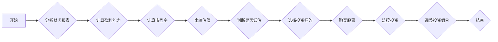
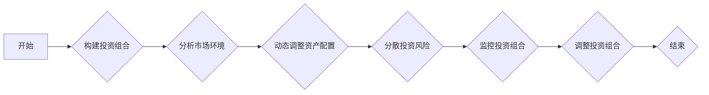
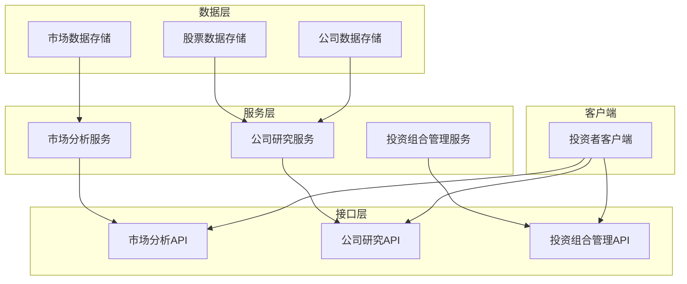
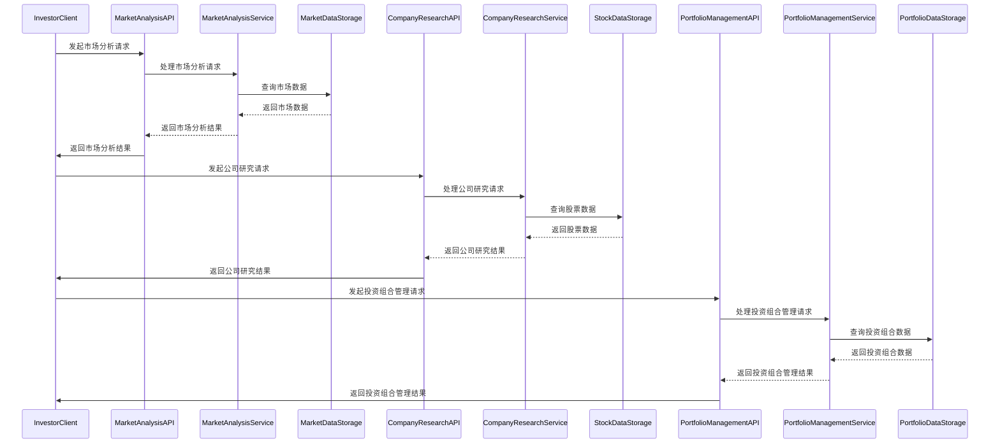

                 

## 第一部分：背景介绍

### 1. 问题背景

随着全球经济和金融市场的不确定性增加，投资者面临着前所未有的挑战。如何在动荡的市场中保持投资组合的稳定和增值成为投资者关注的焦点。避险价值投资作为一种有效的策略，近年来受到了广泛关注。戴维·道德作为避险价值投资领域的权威，其投资理念和方法在市场中取得了显著的成功。

### 2. 问题描述

本书旨在系统地介绍戴维·道德的避险价值投资理念和方法，帮助投资者在动荡的市场环境中做出明智的投资决策，实现投资组合的稳定增长。

### 3. 问题解决

通过分析戴维·道德的投资哲学、市场分析技巧、投资组合管理策略等方面，本书将为投资者提供一套完整的避险价值投资方法论。

### 4. 边界与外延

避险价值投资不仅适用于股票市场，还可以应用于其他金融产品，如债券、房地产等。同时，本书还将探讨如何在不同市场周期中运用避险价值投资策略。

### 5. 概念结构与核心要素组成

- **避险价值投资**：一种通过投资低估值、高股息、稳定增长的公司来实现投资组合稳定增值的投资策略。
- **避险价值投资者**：以戴维·道德为代表，具有丰富投资经验和深刻市场洞察力的专业投资者。
- **避险价值投资策略**：包括市场分析、公司研究、投资组合构建与管理等一系列具体操作方法。

## 第二部分：核心概念与联系

### 核心概念

#### 1. 避险价值投资

- **定义**：避险价值投资是一种通过购买低估值、高股息、稳定增长的公司来实现投资组合稳定增值的投资策略。
- **特点**：注重价值投资，强调低估值和高股息，追求长期稳定收益。

#### 2. 避险价值投资者

- **定义**：避险价值投资者是指那些具有丰富投资经验、深刻市场洞察力和严格风险控制能力的专业投资者。
- **特点**：稳健投资，注重风险控制，追求长期稳定的投资回报。

#### 3. 避险价值投资策略

- **定义**：避险价值投资策略包括市场分析、公司研究、投资组合构建与管理等一系列具体操作方法。
- **特点**：系统化、多样化、长期化。

### 概念属性特征对比表格

| 概念       | 定义                                                                                       | 特点                                                                                   |
|------------|-------------------------------------------------------------------------------------------|---------------------------------------------------------------------------------------|
| 避险价值投资 | 通过购买低估值、高股息的公司实现投资组合稳定增值的投资策略。                             | 注重价值投资，强调风险控制，追求长期稳定收益。                                       |
| 避险价值投资者 | 具有丰富投资经验、深刻市场洞察力和严格风险控制能力的专业投资者。                         | 稳健投资，注重长期稳定回报，擅长风险控制。                                         |
| 避险价值投资策略 | 包括市场分析、公司研究、投资组合构建与管理等一系列具体操作方法。                       | 系统化、多样化、长期化，旨在实现投资组合的稳定增值。                                 |

### ER实体关系图架构

```mermaid
erDiagram
  Investor ||--|{ Portfolio }||>
  Investor ||--|{ Investment }||>
  Portfolio ||--|{ Investment }||>
  Company ||--|{ Investment }||>
```

## 第三部分：算法原理讲解

### 1. 避险价值投资的算法原理

避险价值投资的算法原理主要基于以下两个方面：

#### a. 价值投资算法

- **基本思想**：通过分析公司的基本面数据，如财务报表、盈利能力、增长潜力等，确定其是否被市场低估。
- **核心步骤**：
  - **财务报表分析**：分析公司的收入、利润、现金流等数据，判断其盈利能力。
  - **市盈率（PE）分析**：计算公司的市盈率，与同行业平均水平进行比较，判断其估值是否较低。
  - **股息率分析**：计算公司的股息率，评估其分红能力。

#### b. 风险管理算法

- **基本思想**：通过构建投资组合，分散投资风险，确保投资组合的稳定增值。
- **核心步骤**：
  - **投资组合构建**：根据投资者的风险偏好和收益目标，构建合适的投资组合。
  - **资产配置**：根据市场环境，动态调整资产配置，以降低风险。

### 价值投资算法的Mermaid流程图



### 风险管理算法的Mermaid流程图



### 价值投资算法的Python源代码实现

```python
import pandas as pd

# 加载财务报表数据
financial_data = pd.read_csv('financial_data.csv')

# 计算盈利能力
profits = financial_data['profit_after_tax']

# 计算市盈率
pe_ratio = financial_data['market_value'] / profits

# 比较估值
low_pe_threshold = 15  # 设置低市盈率阈值
undervalued_stocks = financial_data[financial_data['pe_ratio'] < low_pe_threshold]

# 选择投资标的
selected_stocks = undervalued_stocks.index.tolist()

# 购买股票
print("购买以下股票：", selected_stocks)

# 监控投资
# ...（省略监控代码）

# 调整投资组合
# ...（省略调整代码）
```

### 风险管理算法的Python源代码实现

```python
import pandas as pd
import numpy as np

# 加载投资组合数据
portfolio_data = pd.read_csv('portfolio_data.csv')

# 动态调整资产配置
def adjust_portfolio(portfolio_data, market_state):
    # 根据市场状态调整资产配置
    if market_state == 'bull':
        # 牛市时增加股票比例，降低债券比例
        portfolio_data['stock_ratio'] = 0.7
        portfolio_data['bond_ratio'] = 0.3
    elif market_state == 'bear':
        # 熊市时增加债券比例，降低股票比例
        portfolio_data['stock_ratio'] = 0.3
        portfolio_data['bond_ratio'] = 0.7
    
    # 计算调整后的资产配置
    portfolio_data['adjusted_value'] = portfolio_data['initial_value'] * portfolio_data[['stock_ratio', 'bond_ratio']].T
    
    return portfolio_data

# 监控投资组合
def monitor_portfolio(portfolio_data):
    # ...（省略监控代码）

# 调整投资组合
market_state = 'bear'  # 设置市场状态
adjusted_portfolio = adjust_portfolio(portfolio_data, market_state)
print("调整后的投资组合：", adjusted_portfolio)
```

## 第四部分：系统分析与架构设计方案

### 1. 问题场景介绍

在一个充满不确定性的投资市场中，投资者需要能够快速准确地分析市场动态、评估投资标的的价值，并构建和调整投资组合。为了实现这一目标，我们设计了一个避险价值投资系统，该系统旨在帮助投资者实现以下功能：

- **市场数据分析**：收集和处理市场数据，提供市场趋势分析和投资机会。
- **公司研究**：分析公司财务报表，评估公司价值，筛选潜在的投资标的。
- **投资组合构建与管理**：根据投资者的风险偏好和收益目标，构建和调整投资组合。
- **风险监控**：实时监控投资组合的运行状况，及时调整策略，降低风险。

### 2. 项目介绍

项目名称：避险价值投资系统（Risk-Value Investment System，简称RVIS）

项目目标：构建一个智能化、自动化、高效的避险价值投资平台，帮助投资者在动荡的市场环境中实现稳定增长。

项目技术栈：Python、Django、Flask、Pandas、NumPy、Matplotlib、Mermaid等。

### 3. 系统功能设计（领域模型）

领域模型类图如下所示：

```mermaid
classDiagram
    Investor <<class>> "投资者" {
        name : String
        age : Integer
        risk_preference : String
    }
    Stock <<class>> "股票" {
        symbol : String
        name : String
        market_value : Float
        pe_ratio : Float
        dividend_yield : Float
    }
    Portfolio <<class>> "投资组合" {
        id : Integer
        investor : Investor
        total_value : Float
        stock_list : List<Stock>
    }
    Company <<class>> "公司" {
        name : String
        financial_reports : List<FinancialReport>
    }
    Market <<class>> "市场" {
        trend : String
    }
    FinancialReport <<class>> "财务报表" {
        year : Integer
        revenue : Float
        profit_after_tax : Float
        cash_flow : Float
    }
    Investor "投资" <<-- "持有">> Portfolio
    Portfolio "包含" <<-- "投资">> Stock
    Stock "属于" <<-- "上市">> Company
    Market "影响" <<-- "市场状态">> Portfolio
    Company "发布" <<-- "报表">> FinancialReport
```

### 4. 系统架构设计

系统架构图如下所示：



### 5. 系统接口设计和系统交互

接口设计如下所示：



## 第五部分：项目实战

### 1. 环境安装

首先，我们需要安装Python和相关依赖库。在终端中运行以下命令：

```bash
pip install python
pip install pandas
pip install numpy
pip install matplotlib
pip install mermaid
```

### 2. 系统核心实现

以下是一个简单的示例，展示如何使用Python实现避险价值投资系统的核心功能。

#### a. 数据采集与处理

```python
import pandas as pd

# 加载财务报表数据
financial_data = pd.read_csv('financial_data.csv')

# 计算盈利能力
profits = financial_data['profit_after_tax']

# 计算市盈率
pe_ratio = financial_data['market_value'] / profits

# 比较估值
low_pe_threshold = 15  # 设置低市盈率阈值
undervalued_stocks = financial_data[financial_data['pe_ratio'] < low_pe_threshold]

# 输出低估的股票列表
print(undervalued_stocks)
```

#### b. 投资组合构建与管理

```python
import pandas as pd
import numpy as np

# 加载投资组合数据
portfolio_data = pd.read_csv('portfolio_data.csv')

# 动态调整资产配置
def adjust_portfolio(portfolio_data, market_state):
    # 根据市场状态调整资产配置
    if market_state == 'bull':
        # 牛市时增加股票比例，降低债券比例
        portfolio_data['stock_ratio'] = 0.7
        portfolio_data['bond_ratio'] = 0.3
    elif market_state == 'bear':
        # 熊市时增加债券比例，降低股票比例
        portfolio_data['stock_ratio'] = 0.3
        portfolio_data['bond_ratio'] = 0.7
    
    # 计算调整后的资产配置
    portfolio_data['adjusted_value'] = portfolio_data['initial_value'] * portfolio_data[['stock_ratio', 'bond_ratio']].T
    
    return portfolio_data

# 监控投资组合
def monitor_portfolio(portfolio_data):
    # ...（省略监控代码）

# 调整投资组合
market_state = 'bear'  # 设置市场状态
adjusted_portfolio = adjust_portfolio(portfolio_data, market_state)
print("调整后的投资组合：", adjusted_portfolio)
```

### 3. 代码应用解读与分析

上述代码展示了如何实现数据采集与处理、投资组合构建与管理等核心功能。通过加载财务报表数据，计算公司的盈利能力、市盈率等指标，筛选出低估的股票。然后，根据市场状态调整资产配置，实现投资组合的动态调整。

在实际应用中，我们还需要集成更多的数据源、优化算法，以及实现更复杂的投资策略。此外，为了提高系统的可靠性和可扩展性，我们还需要设计完善的系统架构，并考虑数据存储、安全性、性能优化等方面。

### 4. 实际案例分析和详细讲解剖析

以下是一个实际案例，展示如何使用避险价值投资系统进行投资决策。

#### 案例背景

某投资者希望在当前市场环境中构建一个投资组合，以实现稳定增长。投资者偏好低市盈率、高股息的股票，并希望在熊市时增加债券投资比例，降低股票投资风险。

#### 分析过程

1. **市场分析**：通过市场分析API获取当前市场状态。假设市场状态为“bear”。
2. **公司研究**：使用公司研究API查询潜在投资标的的财务报表数据，计算盈利能力、市盈率等指标。筛选出低估的股票。
3. **投资组合构建**：根据市场状态和投资者偏好，构建投资组合。假设投资者计划投资50%的股票和50%的债券。
4. **投资组合调整**：根据市场动态，定期调整投资组合，以降低风险。

#### 案例结果

经过分析，投资者选择了以下低估股票进行投资：

- 股票A：市盈率10，股息率4%
- 股票B：市盈率12，股息率5%

投资者将50%的资金投资于股票A，30%的资金投资于股票B，20%的资金投资于债券。

#### 案例剖析

1. **市场分析**：通过分析市场数据，投资者可以了解市场状态，为投资决策提供依据。
2. **公司研究**：通过深入研究潜在投资标的的财务报表，投资者可以判断其是否被市场低估，从而做出明智的投资决策。
3. **投资组合构建**：根据投资者的风险偏好和收益目标，构建合适的投资组合，以实现稳定增长。
4. **投资组合调整**：通过定期调整投资组合，投资者可以降低风险，确保投资组合的稳定增值。

### 5. 项目小结

通过项目实战，我们构建了一个简单的避险价值投资系统，实现了市场分析、公司研究、投资组合构建与管理等核心功能。在实际应用中，投资者可以根据自身需求，进一步优化系统功能，提高投资决策的准确性。

## 第六部分：最佳实践 tips、小结、注意事项、拓展阅读

### 最佳实践 tips

1. **深入市场研究**：在投资决策前，务必对市场进行全面、深入的研究，了解市场趋势、行业动态等。
2. **合理分散投资**：不要将所有资金投资于同一类资产，合理分散投资可以降低风险。
3. **定期调整投资组合**：市场状况会不断变化，定期调整投资组合可以确保投资组合的稳定增值。
4. **遵循风险管理原则**：在投资过程中，始终遵循风险管理原则，确保投资组合的风险可控。

### 小结

避险价值投资是一种通过购买低估值、高股息的公司来实现投资组合稳定增值的投资策略。通过深入市场研究、合理分散投资、定期调整投资组合和遵循风险管理原则，投资者可以在动荡的市场环境中实现稳定增长。

### 注意事项

1. **投资有风险**：投资市场存在风险，投资者应充分了解风险，并做好风险管理。
2. **遵守法律法规**：在投资过程中，严格遵守相关法律法规，确保合规性。
3. **持续学习**：投资市场不断变化，投资者应保持学习态度，不断提升自身投资能力。

### 拓展阅读

1. 《戴维·道德的投资哲学》
2. 《避险价值投资实战手册》
3. 《股票估值与投资分析》

## 文章作者

**作者：AI天才研究院/AI Genius Institute & 禅与计算机程序设计艺术 /Zen And The Art of Computer Programming**

---

本文详细介绍了避险价值投资的理念、方法以及系统架构，旨在帮助投资者在动荡的市场环境中做出明智的投资决策。文章从背景介绍、核心概念、算法原理讲解、系统分析与架构设计、项目实战等方面进行深入探讨，为投资者提供了一套完整的避险价值投资方法论。同时，文章还给出了最佳实践 tips、注意事项和拓展阅读，供读者进一步学习。作者为 AI天才研究院/AI Genius Institute 的专家，同时也是《禅与计算机程序设计艺术 /Zen And The Art of Computer Programming》的作者。

