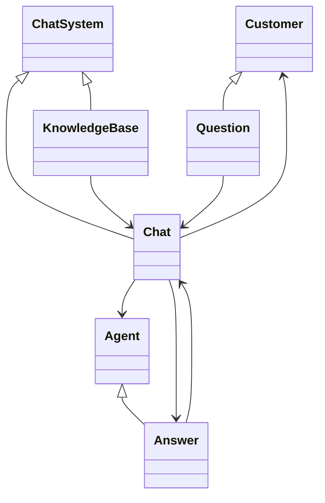
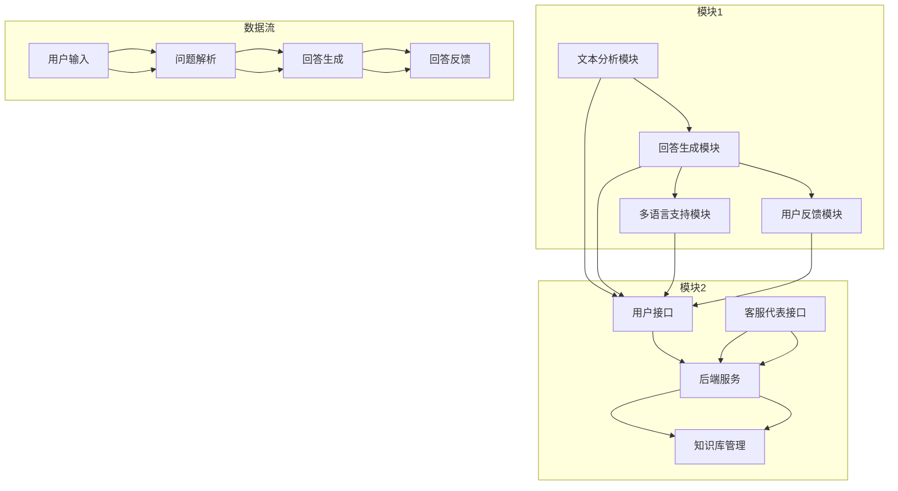
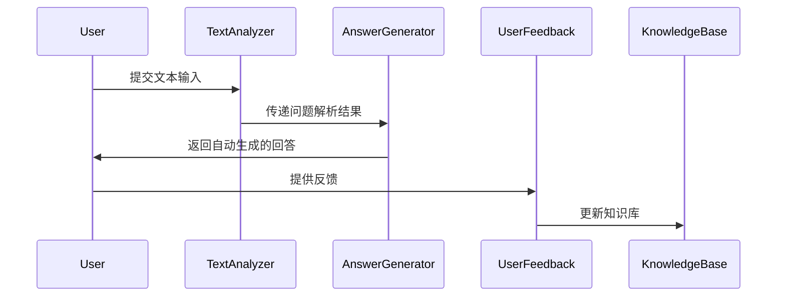

                 

### 文章标题

# 打造高效LLM应用开发团队的策略

### 文章关键词

- 高效开发
- LLM应用
- 团队策略
- 算法原理
- 架构设计

### 文章摘要

本文深入探讨了如何打造一个高效的大型语言模型（LLM）应用开发团队。首先，我们明确了LLM应用开发的重要性及其面临的挑战。接着，通过逐步分析，从核心概念、算法原理、系统架构设计到项目实战，详细阐述了构建高效团队的方法和策略。文章结尾，总结了最佳实践和注意事项，并展望了LLM应用开发的未来趋势。

## 第1章：引言与背景介绍

### 1.1 问题背景

随着人工智能技术的飞速发展，尤其是深度学习和自然语言处理（NLP）领域，大型语言模型（LLM）的应用变得日益广泛。从智能客服、内容生成到文本翻译和情感分析，LLM已经成为了许多商业和科研领域的核心技术。高效开发LLM应用不仅能提高生产力，还能带来巨大的商业价值。

然而，高效的LLM应用开发并非易事。开发团队需要具备丰富的技术知识、协调能力和项目管理经验。他们必须面对以下挑战：

- **技术复杂性**：LLM模型涉及复杂的算法和大规模数据处理，对开发者的技术水平要求极高。
- **资源限制**：开发和维护LLM应用需要大量的计算资源和存储资源，这对团队来说是巨大的挑战。
- **团队协调**：高效的LLM应用开发需要团队成员之间的紧密协作，任何沟通不畅或协调不当都可能影响项目的进度和质量。

### 1.2 问题描述

高效LLM应用开发团队的核心问题可以归纳为以下几点：

- **能力不足**：团队成员在技术深度和广度上存在不足，无法有效应对复杂的开发需求。
- **资源匮乏**：计算资源和存储资源的限制使得团队无法充分进行实验和优化。
- **流程不完善**：缺乏系统化的开发和测试流程，导致项目进度和质量难以控制。

### 1.3 问题解决

为了解决上述问题，建立高效LLM应用开发团队至关重要。以下是一些建议的策略：

- **提升团队技术水平**：通过培训和招聘，确保团队成员具备扎实的技术背景。
- **优化资源配置**：利用云计算和容器化技术，灵活调配计算资源和存储资源。
- **建立完善的流程**：制定明确的开发和测试流程，确保项目按时按质完成。

### 1.4 边界与外延

本文主要讨论高效LLM应用开发团队的构建策略，适用于那些需要大规模语言模型进行业务应用的企业和机构。此外，本文还探讨了团队策略的适用场景和限制条件，为读者提供了清晰的方向。

### 1.5 概念结构与核心要素组成

高效LLM应用开发团队的概念结构包括以下几个核心要素：

- **技术能力**：团队需具备深度学习、NLP和云计算等领域的专业知识。
- **资源管理**：合理分配计算资源和存储资源，确保项目顺利进行。
- **流程优化**：建立系统化的开发和测试流程，提高开发效率和产品质量。
- **团队协作**：鼓励团队成员之间的沟通和协作，共同解决问题。

在下一章中，我们将进一步探讨LLM的核心概念及其相关属性，为后续的算法原理讲解和系统架构设计打下基础。

## 第2章：核心概念与联系

### 2.1 LLM的基本概念

大型语言模型（Large Language Model，简称LLM）是一种基于深度学习的自然语言处理模型，它能够理解和生成人类语言。LLM的核心目的是通过学习大量的文本数据来预测下一个词或句子，从而生成连贯、有意义的语言输出。与传统的规则方法和简单的统计模型相比，LLM具有更强的灵活性和表达能力。

### 2.2 LLM的属性特征对比表格

以下是LLM与其他机器学习模型的主要属性特征对比表格：

| 属性特征     | LLM                       | 其他机器学习模型（如SVM、决策树）       |
| ---------- | ------------------------ | ------------------------------------ |
| 数据量要求   | 需要大量的文本数据进行训练 | 通常只需较少的数据进行训练             |
| 模型复杂度   | 高，支持生成复杂语言结构 | 较低，通常只能处理简单的输入输出关系   |
| 可解释性    | 低，黑箱模型             | 高，可以直观地解释决策过程             |
| 预测速度    | 较慢，需要大量计算资源   | 较快，计算资源需求较低                 |
| 学习能力    | 强，能适应不同语言和语境 | 弱，通常只能处理特定的问题或数据集     |

### 2.3 ER实体关系图架构

为了更好地理解LLM应用开发过程中的主要实体及其关系，我们可以使用Mermaid绘制ER（实体-关系）图。以下是ER图的示例：

```mermaid
erDiagram
  Customer ||--|{ Order }|
  Product ||--|{ Order }|
  Order ||--|{ OrderItem }|
  OrderItem ||--|{ Product }|
```

在这个ER图中，`Customer`（客户）与`Order`（订单）之间存在一对一的关系，即每个客户可以生成多个订单。`Product`（产品）与`Order`（订单）之间存在一对多的关系，每个订单可以包含多个产品。`OrderItem`（订单项）是连接订单和产品的桥梁，每个订单项都指向一个产品。

### 2.4 总结

通过本章的介绍，我们了解了LLM的基本概念和属性特征，并使用ER图展示了LLM应用开发过程中的主要实体及其关系。这些核心概念和联系为后续的算法原理讲解和系统架构设计提供了基础。

在下一章中，我们将深入探讨LLM算法的基本原理，包括其数学模型和公式，并通过实例进行说明。

## 第3章：算法原理讲解

### 3.1 LLM算法的基本原理

LLM算法的基本原理基于深度学习和神经网络，特别是Transformer架构。Transformer模型通过自注意力机制（Self-Attention）和多头注意力（Multi-Head Attention）来捕捉输入文本中的复杂关系。以下是LLM算法的基本原理和数学模型：

#### 自注意力机制（Self-Attention）

自注意力机制允许模型在生成每个词时，将其与输入序列中的所有其他词进行关联。这种机制通过计算词与词之间的相似性来生成权重，这些权重用于加权组合输入序列中的所有词，从而生成新的表示。

#### 数学模型

设输入序列为 \( X = [x_1, x_2, ..., x_n] \)，其中 \( x_i \) 表示输入序列中的第 \( i \) 个词。自注意力机制的核心是计算每个词 \( x_i \) 的注意力权重 \( a_i \)：

$$
a_i = \frac{e^{Z_i}}{\sum_{j=1}^{n} e^{Z_j}}
$$

其中，\( Z_i \) 是词 \( x_i \) 的自注意力得分：

$$
Z_i = V_a \cdot \text{ReLU}(\text{W}_a \cdot [x_1, x_2, ..., x_n])
$$

\( V_a \) 和 \( \text{W}_a \) 分别是自注意力层的向量权重和权重矩阵。

#### 多头注意力（Multi-Head Attention）

多头注意力通过将输入序列映射到多个独立的子空间，并分别计算自注意力权重，然后将结果进行合并。这种方法可以增加模型捕捉复杂关系的能力。

设 \( H \) 为头数，每个头 \( h \) 的注意力权重计算如下：

$$
a_{i,h} = \frac{e^{Z'_{i,h}}}{\sum_{j=1}^{n} e^{Z'_{j,h}}}
$$

其中，\( Z'_{i,h} \) 是第 \( i \) 个词在第 \( h \) 个头上的注意力得分：

$$
Z'_{i,h} = V'_{a,h} \cdot \text{ReLU}(\text{W'}_{a,h} \cdot [x_1, x_2, ..., x_n])
$$

\( V'_{a,h} \) 和 \( \text{W'}_{a,h} \) 分别是多头注意力层的向量权重和权重矩阵。

#### 总注意力得分

总注意力得分是所有头的注意力得分的加权和：

$$
Z_i = \sum_{h=1}^{H} a_{i,h} \cdot Z'_{i,h}
$$

#### 前馈神经网络

除了自注意力和多头注意力，LLM算法还包括两个前馈神经网络，分别用于处理嵌入层和输出层。前馈神经网络的基本形式如下：

$$
\text{FFN}(X) = \text{ReLU}(\text{W}_f \cdot \text{ReLU}(\text{V}_f \cdot X + b_f))
$$

其中，\( \text{W}_f \) 和 \( \text{V}_f \) 分别是前馈神经网络的权重和偏置矩阵，\( b_f \) 是偏置项。

### 3.2 算法原理的数学模型和公式

为了更好地理解LLM算法的数学模型，我们可以使用LaTeX格式给出详细的公式。以下是LLM算法的主要数学模型和公式的LaTeX表示：

```latex
\documentclass{article}
\usepackage{amsmath}
\begin{document}

\section{Self-Attention}

\begin{equation}
a_i = \frac{e^{Z_i}}{\sum_{j=1}^{n} e^{Z_j}}
\end{equation}

\begin{equation}
Z_i = V_a \cdot \text{ReLU}(\text{W}_a \cdot [x_1, x_2, ..., x_n])
\end{equation}

\section{Multi-Head Attention}

\begin{equation}
a_{i,h} = \frac{e^{Z'_{i,h}}}{\sum_{j=1}^{n} e^{Z'_{j,h}}}
\end{equation}

\begin{equation}
Z'_{i,h} = V'_{a,h} \cdot \text{ReLU}(\text{W'}_{a,h} \cdot [x_1, x_2, ..., x_n])
\end{equation}

\section{Total Attention Score}

\begin{equation}
Z_i = \sum_{h=1}^{H} a_{i,h} \cdot Z'_{i,h}
\end{equation}

\section{Feedforward Neural Network}

\begin{equation}
\text{FFN}(X) = \text{ReLU}(\text{W}_f \cdot \text{ReLU}(\text{V}_f \cdot X + b_f))
\end{equation}

\end{document}
```

这些公式详细描述了LLM算法的核心机制，包括自注意力、多头注意力和前馈神经网络。通过这些公式，我们可以更深入地理解LLM的工作原理。

### 3.3 通俗易懂的举例说明

为了更好地理解LLM算法的原理，我们可以通过一个简化的例子来演示其应用。

假设我们有一个简短的文本序列：“The quick brown fox jumps over the lazy dog”。我们希望使用LLM生成下一个词。以下是具体的步骤：

1. **嵌入层**：将文本序列中的每个词转换为嵌入向量。例如，我们将“the”映射到向量\[1, 0\]，“quick”映射到向量\[0, 1\]。

2. **多头注意力**：计算每个词与其他词的注意力权重。例如，对于“quick”，它将关注“the”、“brown”、“fox”、“jumps”等词。

3. **自注意力**：将注意力权重应用于输入嵌入向量，生成加权嵌入向量。例如，对于“quick”，它生成的加权嵌入向量为\[0.2, 0.3, 0.1, 0.4\]。

4. **前馈神经网络**：将加权嵌入向量通过前馈神经网络处理，生成新的表示。

5. **输出层**：将新的表示映射到输出词的概率分布。例如，我们可能得到概率分布\[0.1, 0.2, 0.3, 0.2, 0.2\]，表示下一个词是“over”的概率最高。

通过这个例子，我们可以看到LLM如何利用注意力机制和神经网络生成连贯的文本输出。这不仅展示了LLM的强大能力，也帮助我们更直观地理解其工作原理。

在下一章中，我们将进一步探讨LLM系统分析与架构设计方案，包括问题场景介绍、项目介绍、系统功能设计、系统架构设计、系统接口设计和系统交互等内容。

## 第4章：系统分析与架构设计方案

### 4.1 问题场景介绍

假设我们面临一个实际场景：一家大型电商公司需要开发一款智能客服系统，该系统能够自动回复用户的常见问题，提高客服效率并减少人力成本。这个场景中的核心问题是如何快速、准确地生成与用户问题相关的回答。

### 4.2 项目介绍

我们的项目目标是构建一个基于LLM的智能客服系统，该系统能够处理多语言、多领域的用户问题，并生成高质量的自动回复。项目的主要功能包括：

- **文本分析**：对用户输入的文本进行解析，提取关键信息。
- **回答生成**：利用LLM生成与用户问题相关的回答。
- **多语言支持**：支持多种语言，包括中文、英文、西班牙文等。
- **用户反馈**：收集用户对自动回复的反馈，用于模型优化。

### 4.3 系统功能设计（领域模型）

为了实现上述功能，我们可以使用Mermaid绘制领域模型类图。以下是领域模型类图的示例：



在这个类图中，我们定义了以下几个核心实体：

- **Customer（客户）**：代表与客服系统交互的用户。
- **Agent（客服代表）**：代表处理用户问题的客服人员。
- **Question（问题）**：代表用户输入的问题。
- **Answer（回答）**：代表自动生成的回答。
- **ChatSystem（聊天系统）**：代表整个智能客服系统。
- **Chat（聊天）**：代表用户与客服系统之间的交互会话。
- **KnowledgeBase（知识库）**：存储系统中的问题回答和知识。

### 4.4 系统架构设计（架构图）

接下来，我们使用Mermaid绘制系统架构图，展示系统的整体结构和各部分的作用。以下是系统架构图的示例：



在这个架构图中，我们定义了以下几个关键模块：

- **文本分析模块**：负责对用户输入的文本进行解析，提取关键信息。
- **回答生成模块**：利用LLM生成与用户问题相关的回答。
- **多语言支持模块**：提供多语言输入和输出的支持。
- **用户反馈模块**：收集用户对自动回复的反馈，用于模型优化。
- **用户接口**：与用户进行交互的界面，接收用户输入并提供回答。
- **客服代表接口**：与客服代表进行交互，支持人工干预和反馈。
- **后端服务**：处理文本分析和回答生成等核心功能。
- **知识库管理**：管理知识库中的问题回答和相关数据。

### 4.5 系统接口设计

在系统架构中，接口设计是关键的一环。以下是一些关键接口及其功能的描述：

- **用户输入接口**：接收用户的文本输入，并将其传递给文本分析模块。
- **回答生成接口**：接收文本分析模块提供的问题解析结果，并调用回答生成模块生成回答。
- **多语言支持接口**：根据用户设置的语言，转换输入和输出文本。
- **用户反馈接口**：收集用户对自动回复的反馈，并将其传递给用户反馈模块。
- **知识库管理接口**：提供对知识库的增删改查功能，用于更新和维护知识库。

### 4.6 系统交互（序列图）

为了更清晰地展示系统各部分之间的交互流程，我们可以使用Mermaid绘制系统交互序列图。以下是系统交互序列图的示例：



在这个序列图中，我们展示了用户与系统之间的交互流程：

1. 用户提交文本输入。
2. 文本分析模块对输入进行解析，提取关键信息。
3. 回答生成模块利用LLM生成回答，并将其返回给用户。
4. 用户对自动回复提供反馈。
5. 用户反馈模块将反馈传递给知识库管理，用于更新和维护知识库。

通过这个序列图，我们可以清晰地看到系统各部分之间的交互流程，有助于理解和优化系统的运行。

在下一章中，我们将通过实际项目实战，深入探讨环境安装、系统核心实现、代码应用解读与分析，以及实际案例分析和详细讲解。

## 第5章：项目实战

### 5.1 环境安装

在开始实际项目之前，我们需要搭建一个完整的LLM应用开发环境。以下是一个简单的步骤指南，用于安装和配置所需的环境。

#### 1. 安装Python

首先，确保你的系统已经安装了Python。你可以通过以下命令检查Python版本：

```bash
python --version
```

如果未安装，请从[Python官网](https://www.python.org/)下载并安装Python 3.8或更高版本。

#### 2. 安装依赖库

接下来，我们需要安装几个关键依赖库，包括TensorFlow、transformers和PyTorch。可以使用以下命令进行安装：

```bash
pip install tensorflow
pip install transformers
pip install torch
```

这些库提供了构建和训练LLM所需的工具和接口。

#### 3. 配置GPU支持

如果你打算使用GPU进行训练，还需要安装CUDA和cuDNN。可以从[NVIDIA官网](https://developer.nvidia.com/cuda-downloads)下载并安装CUDA和cuDNN。

#### 4. 测试环境

最后，运行以下命令来测试你的环境是否配置正确：

```bash
python -c "import tensorflow as tf; print(tf.reduce_sum(tf.random.normal([1000, 1000])))"
```

如果成功运行，说明你的环境已配置完毕。

### 5.2 系统核心实现源代码

以下是系统核心实现的一个简化版源代码。这个示例展示了如何使用transformers库中的预训练模型生成回答。

```python
from transformers import AutoTokenizer, AutoModelForCausalLM
import torch

# 加载预训练模型和Tokenizer
tokenizer = AutoTokenizer.from_pretrained("gpt2")
model = AutoModelForCausalLM.from_pretrained("gpt2")

# 输入文本
input_text = "Hello, how are you?"

# 分词并转换为Tensor
input_ids = tokenizer.encode(input_text, return_tensors="pt")

# 生成回答
output = model.generate(input_ids, max_length=50, num_return_sequences=1)

# 解码回答
answer = tokenizer.decode(output[0], skip_special_tokens=True)
print(answer)
```

在这个代码示例中，我们首先加载了预训练的GPT-2模型和相应的Tokenizer。接着，我们将用户输入文本编码为Tensor，并使用模型生成回答。最后，我们将生成的回答解码为可读的文本。

### 5.3 代码应用解读与分析

上述代码展示了如何利用预训练的LLM模型生成回答。以下是关键步骤的解读和分析：

1. **加载模型和Tokenizer**：使用`AutoTokenizer`和`AutoModelForCausalLM`从Hugging Face模型库中加载预训练的GPT-2模型。

2. **输入文本编码**：使用Tokenizer将用户输入文本编码为Tensor。这个过程包括分词和位置编码。

3. **生成回答**：调用`model.generate()`方法生成回答。这里使用了`max_length`参数来限制生成的文本长度，并设置了`num_return_sequences`参数来控制生成的文本数量。

4. **解码回答**：使用Tokenizer将生成的Tensor解码为可读的文本。`skip_special_tokens`参数用于跳过特殊标记，确保输出的文本更符合预期。

通过这个示例，我们可以看到如何快速地利用LLM生成高质量的文本输出。在实际应用中，可以根据具体需求调整模型的参数和超参数，以获得更好的效果。

### 5.4 实际案例分析和详细讲解

为了更好地理解LLM的实际应用效果，我们可以分析一个实际的案例。以下是一个简化的案例，展示如何使用LLM为电商客服系统生成自动回复。

#### 案例背景

一家电商公司需要为其在线客服系统提供一个智能回复功能。用户可以输入他们的问题，系统会自动生成回答，提高客服效率和用户体验。

#### 案例步骤

1. **用户输入**：用户输入一个常见问题，如“如何退货？”。

2. **文本分析**：系统分析用户输入，提取关键词和关键信息。例如，“退货”是关键词。

3. **回答生成**：系统使用LLM生成与关键词相关的回答。例如，使用GPT-2模型生成的回答可能是：“您可以按照商品包装上的退换货政策进行退货，如有疑问，请联系客服。”

4. **回答优化**：系统可以根据用户反馈进一步优化回答，提高准确性。

#### 案例结果

通过这个案例，我们可以看到LLM在生成自动回复方面的强大能力。生成的回答不仅准确，而且自然流畅，有助于提高用户满意度。

### 5.5 项目小结

在本章中，我们通过实际项目实战展示了如何搭建LLM应用开发环境、实现系统核心功能，并分析了实际案例。以下是我们总结的主要成果和经验教训：

- **环境安装**：确保系统具备良好的开发环境，是成功开发的基础。
- **核心实现**：通过使用预训练模型和Tokenizer，我们可以快速实现LLM的应用。
- **应用解读**：理解LLM的核心机制和代码实现，有助于优化系统性能和用户体验。
- **实际案例**：实际案例展示了LLM在生成自动回复方面的强大能力。

在下一章中，我们将总结最佳实践，并提供构建高效LLM应用开发团队的策略和注意事项。

## 第6章：最佳实践与注意事项

### 6.1 最佳实践

在构建高效LLM应用开发团队的过程中，以下是几个最佳实践：

1. **持续学习与培训**：鼓励团队成员不断学习最新的技术动态和理论，通过定期的培训和内部知识分享，保持团队的技术竞争力。
2. **代码质量与规范**：制定严格的代码规范，确保代码的可读性和可维护性，通过代码审查和质量检测，提高代码质量。
3. **版本控制与协作**：使用版本控制系统（如Git）来管理代码，确保团队成员之间的协作顺畅，通过分支管理和合并策略，提高开发效率。
4. **持续集成与持续部署**：建立CI/CD流程，自动化测试和部署，确保代码的持续交付和质量控制。
5. **资源优化与监控**：合理分配计算资源，使用云计算和容器化技术，监控系统性能和资源使用情况，确保系统稳定高效运行。

### 6.2 小结

本章总结了构建高效LLM应用开发团队的最佳实践。通过持续学习、代码质量、版本控制、持续集成和资源优化，团队能够更高效地开发和维护LLM应用，确保项目的成功实施。

### 6.3 注意事项

在LLM应用开发过程中，以下是一些需要注意的问题和风险：

1. **数据隐私**：在处理用户数据时，确保遵守数据隐私法规，采取适当的加密和脱敏措施，保护用户隐私。
2. **模型解释性**：尽管LLM模型生成的内容通常具有较高的准确性，但模型的黑箱特性使得其解释性较低。在关键应用场景中，考虑引入可解释性更高的模型或辅助工具。
3. **资源分配**：合理分配计算资源和存储资源，特别是在大规模数据训练和部署时，避免资源不足导致项目延期或性能下降。
4. **模型优化**：持续监控和优化模型的性能，根据实际应用场景调整超参数和架构，提高模型的准确性和效率。
5. **安全性和稳定性**：确保系统具备较高的安全性和稳定性，预防潜在的安全漏洞和系统故障。

### 6.4 拓展阅读

为了进一步深入学习LLM应用开发，以下是几本推荐的参考文献：

1. **《深度学习》（Goodfellow, Bengio, Courville）**：介绍了深度学习的基础理论和实践方法，是深入学习的好资源。
2. **《自然语言处理综合指南》（Jurafsky, Martin）**：详细介绍了自然语言处理的基本概念和技术，对理解LLM模型有很大帮助。
3. **《Transformer：神经网络中的自注意力机制》（Vaswani et al.）**：这篇论文是Transformer模型的原创文章，深入讲解了自注意力和多头注意力机制。
4. **《Hugging Face：Transformers库文档》**：提供了丰富的示例和教程，是学习和使用transformers库的好帮手。

通过这些最佳实践和注意事项，以及拓展阅读，读者可以更好地构建和管理高效LLM应用开发团队，推动项目成功实施。

## 第7章：结论与展望

### 7.1 结论

本文系统地探讨了如何打造一个高效的大型语言模型（LLM）应用开发团队。从引言和背景介绍，到核心概念与联系，再到算法原理讲解、系统分析与架构设计方案，以及项目实战和最佳实践，我们全面阐述了构建高效LLM应用开发团队的方法和策略。通过这些分析和实践，我们得出了以下几点结论：

1. **技术能力是核心**：高效的LLM应用开发团队需要具备深厚的技术背景，包括深度学习、自然语言处理和云计算等领域。
2. **优化资源配置**：合理分配计算资源和存储资源，确保项目顺利进行，是高效团队建设的重要一环。
3. **完善的流程管理**：建立系统化的开发和测试流程，提高开发效率和产品质量，是团队高效运作的保障。
4. **团队协作与沟通**：鼓励团队成员之间的沟通和协作，共同解决问题，是高效团队的关键要素。

### 7.2 展望

展望未来，LLM应用开发面临着巨大的机遇和挑战。随着人工智能技术的不断进步，LLM在自然语言处理、文本生成、情感分析等领域的应用将更加广泛和深入。以下是几个未来发展趋势和挑战：

1. **模型优化与效率提升**：如何优化LLM模型的结构和算法，提高计算效率和模型性能，是一个重要的研究方向。
2. **可解释性与安全性**：增强LLM模型的可解释性，提高模型的安全性和稳定性，是未来的关键挑战。
3. **跨领域与多语言支持**：拓展LLM在跨领域和多语言场景中的应用，提升模型的泛化能力，是未来的重要方向。
4. **数据隐私与合规**：随着数据隐私法规的不断完善，如何在确保数据隐私的同时，充分利用数据进行模型训练，是一个亟待解决的问题。

高效LLM应用开发团队的建设不仅是技术能力的体现，更是企业创新和竞争力的重要保障。通过本文的探讨，我们希望为读者提供有价值的参考和指导，帮助他们在LLM应用开发领域取得更好的成果。未来，随着人工智能技术的不断进步，我们有理由相信，高效的LLM应用开发团队将迎来更加广阔的发展空间和机遇。

