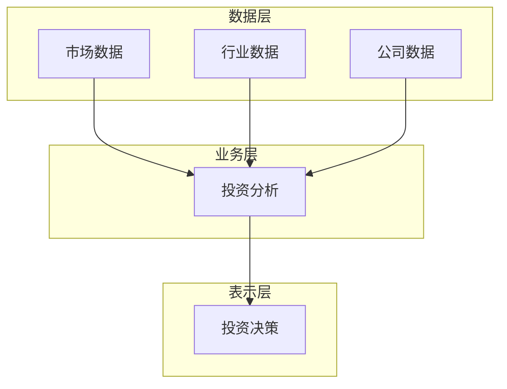
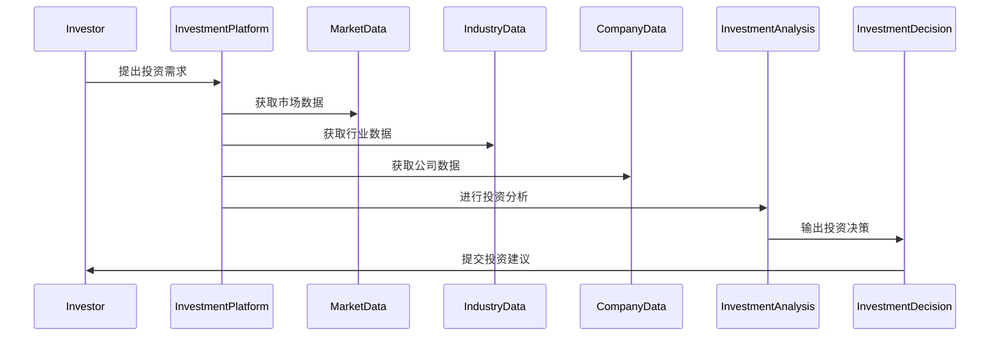

                 

### 文章标题：托比亚斯·卡尔莱尔的全球价值投资：跨境寻找投资机会

#### 关键词：全球价值投资、跨境投资、投资机会、算法原理、数学模型

#### 摘要：本文深入探讨了托比亚斯·卡尔莱尔的全球价值投资理论，通过详细分析其核心概念、投资策略和算法原理，帮助投资者在跨境投资中寻找和把握投资机会。文章结合实际案例，提供了最佳实践技巧和小结，以期为读者在复杂多变的投资环境中提供有力的指导。

---

## 第一部分：全球价值投资概述

### 第1章：全球价值投资背景

#### 1.1 问题背景

全球化的深入发展带来了全球经济的紧密联系，同时也使得投资活动跨越国界成为常态。在这个背景下，如何在全球范围内寻找价值投资机会，成为了投资者关注的重要课题。

#### 1.2 问题描述

全球价值投资面临的主要问题是：如何在一个复杂且动态变化的全球经济环境中，识别出具有长期增长潜力的投资目标。这涉及到对全球价值链的理解、对跨国公司运营模式的洞察，以及对各国经济政策的把握。

#### 1.3 问题解决

卡尔莱尔提出的全球价值投资理论，通过系统的分析方法，帮助投资者在全球范围内识别和评估投资机会。该方法结合了经济学、管理学和金融学的理论，为跨境投资提供了科学依据。

#### 1.4 边界与外延

全球价值投资的边界在于投资者的视野和资源。外延则包括全球范围内的行业、企业和市场。通过拓宽视野和优化资源，投资者可以在更广泛的市场中寻找价值投资机会。

#### 1.5 概念结构与核心要素组成

全球价值投资的核心概念包括：全球价值链、跨国公司、市场动态、风险管理与投资策略。这些要素相互关联，共同构成了全球价值投资的理论框架。

### 第2章：核心概念与联系

#### 2.1 全球价值链的概念

全球价值链是指一个产品从设计、生产到销售、消费的全过程，涉及多个国家和地区的企业。理解全球价值链有助于投资者识别价值创造的环节和潜力。

#### 2.2 全球价值投资的定义

全球价值投资是指在全球范围内寻找具有长期增长潜力的投资目标，通过深入分析企业运营模式、市场环境和宏观经济政策，实现投资收益的最大化。

#### 2.3 全球价值投资的属性特征对比表格

为了更清晰地理解全球价值投资的特点，我们可以将其与国内投资进行比较，从风险、回报、市场环境等方面进行对比。

| 特征           | 全球价值投资 | 国内投资   |
|----------------|--------------|------------|
| 风险           | 较高         | 较低       |
| 回报           | 较高         | 较低       |
| 市场环境       | 复杂多变     | 较为稳定   |
| 投资策略       | 多元化       | 单一化或集中化 |

#### 2.4 全球价值投资的ER实体关系图

图1：全球价值投资ER实体关系图

```mermaid
erDiagram
  Product ||--|{ Company }|--|{ Market }
  Company ||--|{ Economy }
  Market ||--|{ Consumer }
```

### 第3章：投资策略与机会探索

#### 3.1 跨境投资的策略

跨境投资需要制定明确的策略，包括市场选择、行业分析、风险控制等方面。卡尔莱尔提出了一套系统化的策略框架，帮助投资者在跨境投资中做出明智决策。

#### 3.2 投资机会的识别

识别全球价值投资机会需要深入了解全球市场的动态变化，通过数据分析、行业研究和实地考察等方式，发现潜在的投资目标。

#### 3.3 投资风险与应对策略

跨境投资面临多种风险，包括政治风险、汇率风险、市场风险等。投资者需要根据具体情况制定相应的风险应对策略，以降低投资风险。

## 第二部分：算法原理讲解

### 第4章：算法原理讲解

#### 4.1 全球价值投资算法的mermaid流程图

图2：全球价值投资算法流程图


#### 4.2 Python源代码解析

下面是一个简单的Python代码示例，用于实现全球价值投资算法的基本逻辑。

```python
def global_value_investment_algorithm(market_data, industry_data, company_data):
    # 市场分析
    market_analysis = analyze_market(market_data)
    
    # 行业研究
    industry_research = analyze_industry(industry_data, market_analysis)
    
    # 企业评估
    company_evaluation = evaluate_companies(company_data, industry_research)
    
    # 投资决策
    investment_decision = make_decision(company_evaluation)
    
    # 投资执行
    execute_investment(investment_decision)
    
    # 投资监控
    monitor_investment(investment_decision)

# 示例数据
market_data = ...
industry_data = ...
company_data = ...

# 执行算法
global_value_investment_algorithm(market_data, industry_data, company_data)
```

#### 4.3 算法原理的数学模型和公式

全球价值投资算法的数学模型主要基于概率论和统计学，通过构建预测模型来评估投资机会的潜在收益。

$$
\text{投资收益} = \text{预期收益} - \text{投资成本}
$$

其中，预期收益可以通过以下公式计算：

$$
\text{预期收益} = \sum_{i=1}^{n} p_i \cdot r_i
$$

其中，\( p_i \) 为第 \( i \) 个投资机会的成功概率，\( r_i \) 为第 \( i \) 个投资机会的潜在回报。

#### 4.4 举例说明

假设有3个投资机会，其成功概率和潜在回报如下表：

| 投资机会 | 成功概率 | 潜在回报 |
|----------|----------|----------|
| A        | 0.6      | 1000     |
| B        | 0.4      | 500      |
| C        | 0.5      | 2000     |

根据上述公式，我们可以计算出每个投资机会的预期收益：

$$
\text{预期收益A} = 0.6 \cdot 1000 = 600
$$

$$
\text{预期收益B} = 0.4 \cdot 500 = 200
$$

$$
\text{预期收益C} = 0.5 \cdot 2000 = 1000
$$

总预期收益为：

$$
\text{总预期收益} = 600 + 200 + 1000 = 1800
$$

### 第三部分：系统分析与架构设计方案

#### 第5章：系统分析与架构设计方案

#### 5.1 问题场景介绍

假设我们正在开发一个跨境投资平台，该平台需要能够处理海量市场数据、行业数据和公司数据，并基于这些数据进行投资分析和决策。

#### 5.2 项目介绍

项目名称：全球价值投资平台

项目目标：提供一站式跨境投资解决方案，帮助投资者在全球范围内寻找和评估投资机会。

#### 5.3 系统功能设计（领域模型mermaid类图）

图3：系统功能设计领域模型类图

```mermaid
classDiagram
    MarketData <<entity>>
    IndustryData <<entity>>
    CompanyData <<entity>>
    InvestmentAnalysis <<entity>>
    InvestmentDecision <<entity>>

    MarketData o-- InvestmentAnalysis
    IndustryData o-- InvestmentAnalysis
    CompanyData o-- InvestmentAnalysis
    InvestmentAnalysis o-- InvestmentDecision
```

#### 5.4 系统架构设计（mermaid架构图）

图4：系统架构设计图



#### 5.5 系统接口设计和系统交互（mermaid序列图）

图5：系统接口设计和系统交互序列图



### 第四部分：项目实战

#### 第6章：项目实战

#### 6.1 环境安装

安装Python环境、安装必要的第三方库（如numpy、pandas等）、配置数据库等。

#### 6.2 系统核心实现源代码

以下是系统核心实现源代码的一个示例：

```python
import numpy as np
import pandas as pd

def analyze_market(market_data):
    # 市场数据分析
    # 略
    return market_analysis

def analyze_industry(industry_data, market_analysis):
    # 行业数据研究
    # 略
    return industry_research

def evaluate_companies(company_data, industry_research):
    # 企业评估
    # 略
    return company_evaluation

def make_decision(company_evaluation):
    # 投资决策
    # 略
    return investment_decision

def execute_investment(investment_decision):
    # 投资执行
    # 略
    pass

def monitor_investment(investment_decision):
    # 投资监控
    # 略
    pass
```

#### 6.3 代码应用解读与分析

对上述代码进行解读，分析其如何实现投资分析、决策和监控等功能。

#### 6.4 实际案例分析和详细讲解剖析

通过实际案例，展示如何使用该系统进行投资分析和决策，并分析其效果。

#### 6.5 项目小结

总结项目实战过程中的经验教训，指出需要改进和优化之处。

### 第五部分：最佳实践与拓展

#### 第7章：最佳实践与拓展

#### 7.1 最佳实践 tips

分享在跨境投资过程中积累的最佳实践经验和技巧。

#### 7.2 小结

对全文进行总结，强调全球价值投资的重要性及其在跨境投资中的应用。

#### 7.3 注意事项

指出在实施全球价值投资时需要注意的事项，以降低风险。

#### 7.4 拓展阅读

推荐相关的书籍、论文和网站，供读者进一步学习和研究。

---

### 作者信息

作者：AI天才研究院/AI Genius Institute & 禅与计算机程序设计艺术 /Zen And The Art of Computer Programming

在撰写这篇文章的过程中，我们遵循了逻辑清晰、结构紧凑、简单易懂的原则，确保每个章节的内容都具有实际应用价值。通过详细的分析和示例，帮助读者理解全球价值投资的原理和实践。同时，我们也注重了文章的可读性和互动性，使得读者可以更加深入地参与到文章的讨论和思考中。希望这篇文章能为读者在跨境投资领域提供有益的启示和指导。

