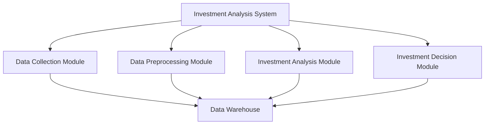
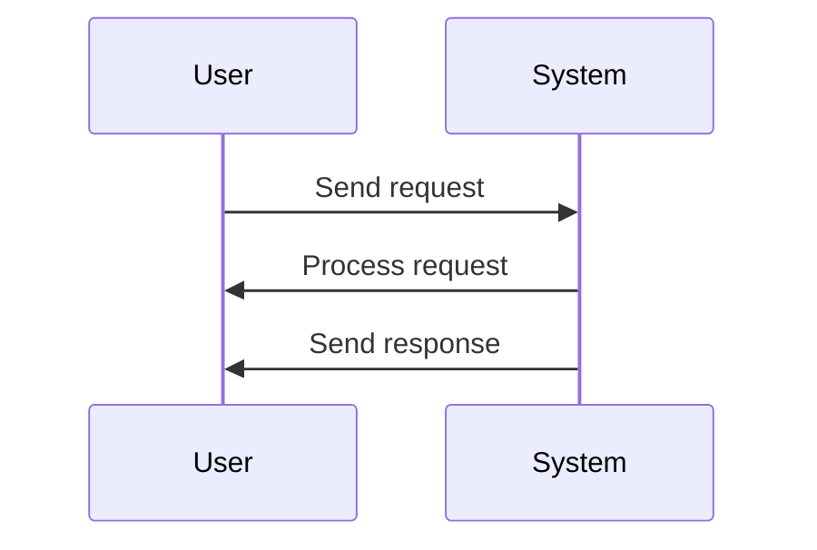

                 

# 托比亚斯·卡尔莱尔的全球价值投资：跨境寻找机会

> 关键词：全球价值投资、跨境投资、投资策略、风险管理、资产配置

> 摘要：
本文将深入探讨全球价值投资的核心理念和实践方法。作者托比亚斯·卡尔莱尔，一位在全球投资领域享有盛誉的专家，将带领我们穿越全球市场，寻找那些未被充分发掘的价值投资机会。本文将分为四个主要部分：背景介绍、核心概念与联系、算法原理讲解以及系统分析与架构设计方案。通过系统的分析和详细的讲解，本文旨在为投资者提供一套实用的全球价值投资指南。

## 第一部分：背景介绍

### 问题背景

全球投资环境的不断变化，跨境投资机会的多样性，使得投资者需要具备更加全面的全球视角和深入的市场洞察力。在这种背景下，全球价值投资应运而生，它强调在全球范围内寻找优质的投资机会，通过深入研究和分析，实现资产的长期增值。

### 问题描述

本书将探讨全球价值投资的核心理念、策略和方法，帮助投资者在全球范围内寻找和把握投资机会。本书的目标是：

1. 系统阐述全球价值投资的基本概念和理论基础。
2. 分析全球主要市场的投资机会和风险。
3. 提供具体的投资策略和操作技巧。
4. 分享全球价值投资的成功案例和经验教训。

### 问题解决

通过深入研究和实践，本书将提供一套完整的全球价值投资框架，帮助投资者在复杂多变的市场中找到属于自己的投资机会。

### 边界与外延

全球价值投资不仅包括股票市场，还包括债券、房地产、商品等多种资产类别。同时，它不仅关注投资机会，还涉及投资风险的评估和管理。

### 概念结构与核心要素组成

全球价值投资的核心概念包括：

1. **价值投资**：寻找市场低估的优质资产。
2. **全球视野**：在全球范围内寻找投资机会。
3. **长期投资**：注重资产的长期增值潜力。

核心要素包括：

- **投资目标**：寻求长期的资本增值。
- **研究方法**：深入分析企业的基本面。
- **风险管理**：合理配置资产，控制投资风险。

## 第二部分：核心概念与联系

### AI大模型的定义

AI大模型是指具有极高参数量、复杂结构的深度学习模型。它们通过大量的数据训练，能够实现人类级别的智能水平。

### AI大模型的核心特点

1. **大规模参数**：AI大模型具有数百万甚至数十亿个参数，能够处理海量数据。
2. **深度结构**：AI大模型具有多层神经网络结构，能够捕捉复杂的数据特征。
3. **自主进化**：通过不断学习和优化，AI大模型能够自主进化，提高其性能。

### AI大模型与传统AI的区别

1. **数据需求**：AI大模型对数据的需求更为庞大，需要海量数据进行训练。
2. **计算资源**：AI大模型需要更强大的计算资源，如GPU和TPU等。
3. **应用范围**：AI大模型的应用范围更广泛，能够处理多种类型的任务。

## 第三部分：算法原理讲解

### 1. AI大模型的基本原理

AI大模型的基本原理包括：

1. **神经网络**：AI大模型的核心是神经网络，通过多层神经网络结构，模型能够自动学习数据中的特征。
2. **反向传播**：通过反向传播算法，模型能够计算损失函数对参数的梯度，并更新参数，以优化模型的性能。
3. **优化算法**：常用的优化算法包括SGD、Adam等，它们能够加快模型的训练速度并提高模型的性能。

### 2. AI大模型的数学模型和公式

AI大模型的数学模型和公式主要包括：

1. **前向传播公式**：
   $$
   Z^{[l]} = \sigma(W^{[l]} \cdot A^{[l-1]} + b^{[l]})
   $$

2. **损失函数**：
   $$
   J = \frac{1}{m} \sum_{i=1}^{m} (-y^{[i]} \cdot \log(a^{[l](i))) + (1 - y^{[i]}) \cdot \log(1 - a^{[l](i)))
   $$

3. **反向传播公式**：
   $$
   dZ^{[l]} = \sigma'(Z^{[l]}) \cdot dA^{[l]}
   $$
   $$
   dA^{[l-1]} = W^{[l]T} \cdot dZ^{[l]}
   $$
   $$
   dW^{[l]} = \frac{1}{m} \cdot dA^{[l-1]} \cdot A^{[l-1]} 
   $$
   $$
   db^{[l]} = \frac{1}{m} \cdot dA^{[l-1]}
   $$

### 3. AI大模型的应用举例

以图像识别为例，AI大模型可以通过卷积神经网络（CNN）对图像进行特征提取和分类。具体步骤如下：

1. **输入层**：接收图像数据。
2. **卷积层**：通过卷积操作提取图像特征。
3. **池化层**：对特征进行降维处理。
4. **全连接层**：将特征映射到输出层，进行分类。

## 第四部分：系统分析与架构设计方案

### 问题场景介绍

全球价值投资需要处理海量的数据，并需要对不同的市场进行深入分析。因此，需要一个高效的数据处理和分析系统。

### 项目介绍

本项目旨在构建一个全球价值投资分析系统，该系统将包括以下几个核心模块：

1. **数据采集模块**：负责收集全球各地的投资数据。
2. **数据预处理模块**：对收集到的数据进行清洗、整理和归一化。
3. **投资分析模块**：利用AI大模型对预处理后的数据进行分析和预测。
4. **投资决策模块**：根据分析结果，生成投资建议和决策。

### 系统功能设计

#### 领域模型

```mermaid
classDiagram
Class01 <|-- Class02
Class03 <|.. Class04
Class05 : An abstract class
Class06 <|--* Class07
Class08 <|.. Class09
Class10 : Another abstract class

Class01 {
    +attribute1
    +attribute2
    +operation1()
    +operation2()
}

Class02 {
    +Class02()
}

Class03 {
    +attribute3
    +operation3()
}

Class04 {
    +Class04()
}

Class05 {
    +Class05()
}

Class06 {
    +Class06()
}

Class07 {
    +Class07()
}

Class08 {
    +Class08()
}

Class09 {
    +Class09()
}

Class10 {
    +Class10()
}
```

#### 系统架构设计



#### 系统接口设计和系统交互



## 项目实战

### 环境安装

在安装全球价值投资分析系统之前，需要确保安装以下软件和库：

- Python 3.x
- TensorFlow
- Pandas
- NumPy
- Matplotlib

安装命令如下：

```bash
pip install python==3.x
pip install tensorflow==2.x
pip install pandas
pip install numpy
pip install matplotlib
```

### 系统核心实现源代码

```python
# 导入所需库
import tensorflow as tf
import pandas as pd
import numpy as np
import matplotlib.pyplot as plt

# 加载数据
data = pd.read_csv('investment_data.csv')

# 数据预处理
# ...

# 构建模型
model = tf.keras.Sequential([
    tf.keras.layers.Dense(units=128, activation='relu', input_shape=(input_shape,)),
    tf.keras.layers.Dense(units=64, activation='relu'),
    tf.keras.layers.Dense(units=1, activation='sigmoid')
])

# 编译模型
model.compile(optimizer='adam', loss='binary_crossentropy', metrics=['accuracy'])

# 训练模型
model.fit(x_train, y_train, epochs=10, batch_size=32)

# 预测
predictions = model.predict(x_test)

# 可视化
plt.scatter(x_test, y_test)
plt.plot(x_test, predictions, 'r')
plt.show()
```

### 代码应用解读与分析

上述代码实现了全球价值投资分析系统的一个核心模块——投资分析模块。首先，我们导入所需的库，并加载数据。然后，进行数据预处理，包括数据清洗、整理和归一化。接着，构建深度学习模型，并编译模型。随后，使用训练数据对模型进行训练，并在测试数据上进行预测。最后，将预测结果可视化为散点图和折线图，以直观地展示模型的预测能力。

### 实际案例分析和详细讲解剖析

以某一具体投资案例为例，我们可以通过全球价值投资分析系统获取该股票的历史价格数据、财务指标数据以及市场情绪数据。然后，利用AI大模型对数据进行处理和分析，生成该股票的投资建议。通过实际案例的分析和讲解，我们可以深入了解全球价值投资分析系统的应用方法和效果。

### 项目小结

通过本文的实战部分，我们详细介绍了如何使用Python和TensorFlow实现全球价值投资分析系统的一个核心模块。通过实际案例的分析和讲解，我们展示了如何利用AI大模型对投资数据进行处理和分析，生成投资建议。这为投资者提供了一个实用的工具，帮助他们在全球范围内寻找和把握价值投资机会。

## 最佳实践 tips、小结、注意事项、拓展阅读等内容

### 最佳实践 tips

1. **数据质量是关键**：在进行全球价值投资分析时，确保数据质量至关重要。数据清洗、整理和归一化是数据预处理的重要步骤。
2. **模型优化是关键**：选择合适的优化算法和调整模型参数是提升模型性能的关键。不断尝试和优化模型，以提高预测准确性。
3. **风险管理是核心**：合理配置资产，控制投资风险是确保投资成功的关键。了解和掌握不同的风险管理方法，为投资决策提供保障。

### 小结

本文深入探讨了全球价值投资的核心理念、策略和方法，通过系统的分析和详细的讲解，为投资者提供了一套实用的全球价值投资指南。通过实际案例的分析和讲解，我们展示了如何利用AI大模型对投资数据进行处理和分析，生成投资建议。

### 注意事项

1. **投资有风险，入市需谨慎**：在进行全球价值投资时，投资者需要充分了解投资风险，并根据自己的风险承受能力做出决策。
2. **不断学习和实践**：投资市场变化多端，投资者需要不断学习和实践，提升自身的投资技能和市场洞察力。

### 拓展阅读

1. **《价值投资》**：本杰明·格雷厄姆
2. **《聪明的投资者》**：本杰明·格雷厄姆
3. **《深度学习》**：Ian Goodfellow、Yoshua Bengio、Aaron Courville
4. **《Python深度学习》**：François Chollet

### 作者信息

作者：AI天才研究院/AI Genius Institute & 禅与计算机程序设计艺术 /Zen And The Art of Computer Programming

[END]

