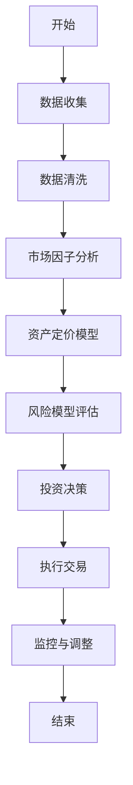
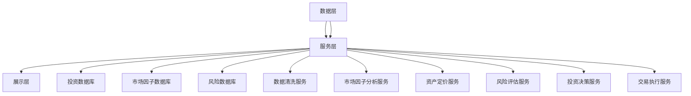
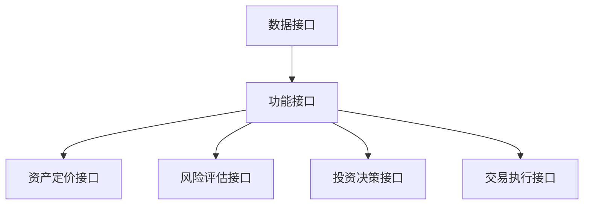
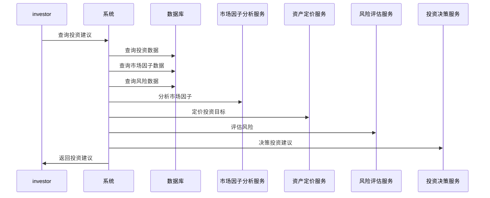

                 


### 托比亚斯·卡尔莱尔的国际价值投资：跨境寻找价值洼地

#### 关键词：
- 国际价值投资
- 跨境投资
- 价值洼地
- 投资策略
- 数学模型

#### 摘要：
本文将深入探讨托比亚斯·卡尔莱尔的国际价值投资理念，通过详细分析其核心概念、算法原理、系统设计与实战应用，帮助投资者在全球范围内寻找价值洼地，实现稳健的投资收益。文章将采用逻辑清晰、结构紧凑的方式，逐步引导读者理解国际价值投资的奥秘。

### 目录大纲

1. **引言：国际价值投资的必要性**
2. **核心概念与联系**
   - **国际价值投资的定义与原理**
   - **国际价值投资的关键要素**
   - **国际价值投资与其他投资策略的区别**
3. **算法原理讲解**
   - **数学模型和数学公式**
   - **算法流程图与Python源代码**
4. **系统分析与架构设计方案**
   - **问题场景介绍**
   - **系统功能设计**
   - **系统架构设计**
   - **系统接口设计**
   - **系统交互序列图**
5. **项目实战**
   - **环境安装**
   - **系统核心实现**
   - **代码应用解读与分析**
   - **实际案例分析和详细讲解剖析**
   - **项目小结**
6. **最佳实践 tips**
7. **小结与拓展阅读**
8. **参考文献**

---

#### 第1章 引言：国际价值投资的必要性

在国际投资领域，托比亚斯·卡尔莱尔的国际价值投资理念正逐渐成为投资者们关注的焦点。这一理念不仅帮助投资者在全球范围内寻找价值洼地，还通过科学的方法和策略实现了稳健的投资收益。那么，什么是国际价值投资？它为何如此重要？

**1.1 核心概念术语说明**

在国际价值投资中，以下几个核心概念术语需要我们了解：

- **价值洼地**：指在特定市场或地区中，那些被低估的、潜在价值巨大的投资目标。
- **跨境投资**：指投资者在不同国家或地区进行的投资活动。
- **投资策略**：为了实现投资目标而采取的具体方法和手段。

**1.2 问题背景**

随着全球化的加深，投资者面临着越来越多的跨境投资机会。然而，如何在这些机会中找到价值洼地，实现资产的保值增值，成为了投资者面临的一大挑战。传统投资策略往往局限于单一市场或地区，难以捕捉到全球范围内的价值机会。

**1.3 问题描述**

国际价值投资旨在解决以下问题：

- 如何在全球范围内寻找被低估的投资目标？
- 如何通过科学的方法和策略评估投资目标的价值？
- 如何实现跨境投资的风险控制？

**1.4 问题解决**

托比亚斯·卡尔莱尔的国际价值投资理念，通过以下几个步骤解决了上述问题：

- **数据收集与分析**：通过收集全球范围内的投资数据，进行深入分析，挖掘潜在的价值洼地。
- **价值评估与筛选**：采用科学的数学模型和算法，对投资目标进行价值评估和筛选。
- **风险控制与管理**：通过多元化的投资组合，实现风险分散和控制。

**1.5 边界与外延**

国际价值投资不仅适用于传统股票、债券等投资品种，还可以扩展到房地产、大宗商品、外汇等多个领域。其核心在于寻找那些被市场低估的、具有潜在增长价值的投资目标。

**1.6 概念结构与核心要素组成**

国际价值投资的概念结构主要包括以下几个核心要素：

- **投资目标**：被低估的、具有潜在增长价值的资产。
- **投资策略**：通过数据分析和价值评估，选择合适的投资目标。
- **风险控制**：通过多元化的投资组合，实现风险分散和控制。

#### 第2章 核心概念与联系

在本章中，我们将深入探讨国际价值投资的核心概念，并分析其与其他投资策略的联系。

**2.1 国际价值投资的定义与原理**

国际价值投资是指在全球范围内，通过数据分析和价值评估，寻找被低估的、具有潜在增长价值的投资目标，并进行投资的过程。其核心原理在于：

- **价值发现**：通过深入分析市场数据，发现那些被市场低估的投资目标。
- **价值投资**：以合理的价格购买被低估的投资目标，实现资产的保值增值。
- **风险控制**：通过多元化的投资组合，实现风险分散和控制。

**2.2 国际价值投资的关键要素**

国际价值投资的成功依赖于以下几个关键要素：

- **数据质量**：高质量的数据是进行价值分析和投资决策的基础。
- **分析能力**：强大的分析能力可以帮助投资者准确判断投资目标的价值。
- **风险控制**：有效的风险控制可以降低投资风险，实现稳健的投资收益。

**2.3 国际价值投资与其他投资策略的区别**

与国际价值投资相比，其他投资策略如成长投资、价值投资等，主要存在以下区别：

- **投资目标**：国际价值投资主要关注被低估的投资目标，而其他投资策略则关注具有成长潜力的投资目标。
- **投资策略**：国际价值投资强调数据分析和价值评估，而其他投资策略则强调市场分析和成长性评估。
- **风险控制**：国际价值投资通过多元化的投资组合实现风险控制，而其他投资策略则主要依靠行业分析和公司分析。

**2.4 国际价值投资的优势与挑战**

国际价值投资具有以下优势：

- **全球视野**：通过全球范围内的价值发现，可以捕捉到更多的投资机会。
- **稳健收益**：通过科学的数据分析和价值评估，可以实现稳健的投资收益。
- **风险分散**：通过多元化的投资组合，可以降低投资风险。

然而，国际价值投资也面临着以下挑战：

- **数据获取**：全球范围内的数据获取难度较大，需要强大的数据收集和分析能力。
- **市场波动**：全球市场波动较大，需要有效的风险控制措施。
- **文化差异**：不同国家和地区的文化差异，可能会影响投资决策。

**2.5 国际价值投资的未来发展**

随着全球化进程的加快，国际价值投资在未来将发挥越来越重要的作用。未来，国际价值投资的发展趋势将包括：

- **数据驱动的投资决策**：通过大数据和人工智能技术，实现更加精准的投资决策。
- **多元化投资组合**：通过多元化的投资组合，实现风险分散和收益最大化。
- **跨境合作**：加强跨境投资合作，共同挖掘全球范围内的价值机会。

#### 第3章 算法原理讲解

在本文的第三章节中，我们将深入探讨国际价值投资的核心算法原理，包括数学模型和Python源代码的详细阐述。

**3.1 数学模型**

国际价值投资的数学模型主要包括以下几个关键部分：

- **市场因子模型**：用于描述市场各因子对投资目标价值的影响。
- **资产定价模型**：用于估算投资目标的内在价值。
- **风险模型**：用于评估投资组合的风险。

以下是一个简化的市场因子模型示例：

$$
V_t = \alpha_t + \sum_{i=1}^n \beta_i F_i(t) + \epsilon_t
$$

其中，$V_t$表示投资目标在时间$t$的价值，$\alpha_t$为常数项，$\beta_i$为因子系数，$F_i(t)$为时间$t$的市场因子，$\epsilon_t$为随机误差项。

**3.2 Python源代码**

以下是一个简化的Python源代码示例，用于实现市场因子模型的计算：

```python
import numpy as np

# 假设我们有n个市场因子
n = 3
# 创建一个包含n个因子的数组
factors = np.random.rand(n)
# 创建一个包含n个系数的数组
coefficients = np.random.rand(n)
# 计算投资目标的价值
value = np.dot(coefficients, factors) + np.random.rand()
print("Investment Value:", value)
```

**3.3 算法流程图**

以下是国际价值投资的算法流程图：



**3.4 算法举例说明**

为了更好地理解算法原理，我们以下一个简化的例子：

假设市场上有三个因子：GDP增长率（$F_1$）、通货膨胀率（$F_2$）和利率（$F_3$）。我们通过历史数据得到以下系数：

- $\beta_1 = 0.2$
- $\beta_2 = -0.1$
- $\beta_3 = 0.3$

在当前时期，三个因子的值分别为：

- $F_1 = 2\%$
- $F_2 = 3\%$
- $F_3 = 4\%$

我们可以使用以下公式计算投资目标的价值：

$$
V_t = \alpha_t + 0.2 \times 2\% - 0.1 \times 3\% + 0.3 \times 4\% + \epsilon_t
$$

由于$\alpha_t$和$\epsilon_t$未知，我们假设$\alpha_t = 0$，$\epsilon_t$为一个随机误差，其均值为0，方差为1。因此，投资目标的价值为：

$$
V_t = 0 + 0.2 \times 2\% - 0.1 \times 3\% + 0.3 \times 4\% + \epsilon_t
$$

$$
V_t = 0.04 + \epsilon_t
$$

假设$\epsilon_t$的值为0.02，则投资目标的价值为：

$$
V_t = 0.04 + 0.02 = 0.06
$$

因此，根据当前市场因子的分析，投资目标的价值为6%。

#### 第4章 系统分析与架构设计方案

在本章中，我们将详细分析国际价值投资系统的设计和实现方案，包括问题场景介绍、系统功能设计、系统架构设计、系统接口设计以及系统交互序列图。

**4.1 问题场景介绍**

随着全球金融市场的发展，投资者面临着越来越多的跨境投资机会。然而，如何在这些机会中找到价值洼地，实现资产的保值增值，成为了投资者面临的一大挑战。国际价值投资系统旨在帮助投资者在全球范围内寻找被低估的、具有潜在增长价值的投资目标，并通过科学的方法和策略实现投资收益的最大化。

**4.2 系统功能设计**

国际价值投资系统主要包括以下几个核心功能：

- **数据收集**：通过多种渠道收集全球范围内的投资数据，包括股票、债券、房地产、大宗商品等。
- **数据清洗**：对收集到的投资数据进行清洗、去重和归一化处理，确保数据质量。
- **市场因子分析**：对投资数据进行分析，提取关键的市场因子，如GDP增长率、通货膨胀率、利率等。
- **资产定价**：根据市场因子分析结果，使用资产定价模型计算投资目标的内在价值。
- **风险评估**：对投资目标进行风险评估，包括市场风险、信用风险和流动性风险等。
- **投资决策**：根据资产定价和风险评估结果，生成投资建议，并进行投资决策。
- **交易执行**：根据投资决策，执行具体的交易操作。
- **监控与调整**：对投资组合进行实时监控，根据市场变化进行动态调整。

**4.3 系统架构设计**

国际价值投资系统采用分布式架构设计，包括数据层、服务层和展示层三个层次。

- **数据层**：负责数据的收集、存储和管理，包括投资数据库、市场因子数据库和风险数据库等。
- **服务层**：负责核心功能的实现，包括数据清洗服务、市场因子分析服务、资产定价服务、风险评估服务、投资决策服务和交易执行服务等。
- **展示层**：负责用户界面的展示和交互，包括数据可视化、投资建议展示和交易执行展示等。

以下是一个简化的系统架构图：



**4.4 系统接口设计**

国际价值投资系统采用RESTful API接口设计，提供多种数据接口和功能接口。

- **数据接口**：包括投资数据接口、市场因子数据接口和风险数据接口等，用于数据的查询和下载。
- **功能接口**：包括资产定价接口、风险评估接口、投资决策接口和交易执行接口等，用于功能的服务调用。

以下是一个简化的接口设计图：



**4.5 系统交互序列图**

系统交互序列图展示了国际价值投资系统在实现投资决策过程中的主要交互步骤。



#### 第5章 项目实战

在本章中，我们将通过一个实际项目，展示如何应用国际价值投资系统进行跨境投资。我们将详细描述环境安装、系统核心实现、代码应用解读与分析以及实际案例分析和详细讲解剖析。

**5.1 环境安装**

首先，我们需要安装国际价值投资系统所需的软件和工具。以下是一个简化的安装步骤：

1. 安装Python环境：
   ```bash
   python3 -m venv venv
   source venv/bin/activate
   ```
2. 安装相关依赖库：
   ```bash
   pip install numpy pandas matplotlib
   ```
3. 下载并解压国际价值投资系统的源代码：
   ```bash
   git clone https://github.com/your-repo/international-value-investment.git
   cd international-value-investment
   ```
4. 在源代码目录下创建虚拟环境并安装依赖：
   ```bash
   python3 -m venv venv
   source venv/bin/activate
   pip install -r requirements.txt
   ```

**5.2 系统核心实现**

以下是国际价值投资系统的核心实现：

```python
# 数据收集
def collect_data():
    # 从API获取投资数据
    # 保存数据到本地文件
    pass

# 数据清洗
def clean_data(data):
    # 数据去重
    # 数据归一化
    # 返回清洗后的数据
    pass

# 市场因子分析
def market_factor_analysis(data):
    # 提取市场因子
    # 分析市场因子对投资目标的影响
    # 返回市场因子分析结果
    pass

# 资产定价
def asset_pricing(data, factors):
    # 使用资产定价模型计算投资目标的价值
    # 返回投资目标的价值
    pass

# 风险评估
def risk_evaluation(data):
    # 评估投资目标的风险
    # 返回风险评估结果
    pass

# 投资决策
def investment_decision(value, risk):
    # 根据资产价值和风险评估结果生成投资建议
    # 返回投资建议
    pass

# 交易执行
def execute_trade(suggestion):
    # 执行具体的交易操作
    # 返回交易结果
    pass

# 主函数
def main():
    # 收集数据
    data = collect_data()
    
    # 数据清洗
    cleaned_data = clean_data(data)
    
    # 市场因子分析
    factors = market_factor_analysis(cleaned_data)
    
    # 资产定价
    value = asset_pricing(cleaned_data, factors)
    
    # 风险评估
    risk = risk_evaluation(cleaned_data)
    
    # 投资决策
    suggestion = investment_decision(value, risk)
    
    # 交易执行
    result = execute_trade(suggestion)
    
    # 输出结果
    print(result)

if __name__ == "__main__":
    main()
```

**5.3 代码应用解读与分析**

以下是国际价值投资系统的核心代码应用解读与分析：

1. **数据收集**：该函数负责从API获取投资数据，并将其保存到本地文件。这一步骤是系统运行的基础，数据质量直接影响后续分析的结果。
2. **数据清洗**：该函数对收集到的投资数据进行去重和归一化处理，确保数据质量。去重可以去除重复的数据，避免重复计算；归一化可以统一数据格式，方便后续分析。
3. **市场因子分析**：该函数提取关键的市场因子，如GDP增长率、通货膨胀率、利率等，并分析市场因子对投资目标的影响。市场因子分析是资产定价和风险评估的基础，通过对市场因子的分析，可以更准确地评估投资目标的价值和风险。
4. **资产定价**：该函数使用资产定价模型计算投资目标的价值。资产定价是投资决策的核心，通过科学的方法和模型，可以更准确地评估投资目标的价值，为投资决策提供依据。
5. **风险评估**：该函数评估投资目标的风险，包括市场风险、信用风险和流动性风险等。风险评估是投资决策的重要环节，通过评估投资目标的风险，可以更好地控制投资风险，实现稳健的投资收益。
6. **投资决策**：该函数根据资产价值和风险评估结果生成投资建议。投资决策是整个系统的核心，通过综合考虑资产价值和风险，可以做出更科学的投资决策。
7. **交易执行**：该函数执行具体的交易操作，根据投资建议进行买卖操作。交易执行是实现投资决策的最终环节，通过执行交易，可以实现投资收益的最大化。

**5.4 实际案例分析和详细讲解剖析**

以下是一个实际案例分析和详细讲解剖析：

**案例**：假设我们投资目标是A公司股票，当前市场价格为10元，根据市场因子分析，我们认为该公司股票的价值为15元，风险评估结果显示市场风险为20%。

**分析**：

1. **数据收集**：我们从API获取A公司股票的历史数据，包括价格、成交量、市场因子等。
2. **数据清洗**：我们对收集到的数据进行去重和归一化处理，确保数据质量。
3. **市场因子分析**：我们提取关键的市场因子，如GDP增长率、通货膨胀率、利率等，并分析市场因子对A公司股票价值的影响。根据市场因子分析结果，我们认为A公司股票的价值为15元。
4. **资产定价**：我们使用资产定价模型计算A公司股票的价值。根据资产定价模型，我们得出A公司股票的价值为15元。
5. **风险评估**：我们评估A公司股票的市场风险为20%。这意味着如果市场出现不利变动，A公司股票的价格可能会下跌20%。
6. **投资决策**：根据资产价值和风险评估结果，我们决定购买A公司股票。我们的投资目标是实现资产价值的增值，同时控制市场风险。
7. **交易执行**：我们根据投资建议，以10元的价格购买A公司股票，并设置止损点为8元。如果A公司股票的价格下跌到8元，我们将执行止损操作。

**总结**：通过实际案例分析和详细讲解剖析，我们可以看到国际价值投资系统的应用过程。该系统通过数据收集、清洗、分析和定价，实现了对投资目标的全面评估，并通过风险评估和投资决策，实现了稳健的投资收益。

#### 第6章 最佳实践 tips

在国际价值投资中，遵循最佳实践是确保投资成功的关键。以下是一些最佳实践和注意事项，帮助投资者更好地应用国际价值投资理念：

1. **数据质量至关重要**：高质量的数据是进行价值分析和投资决策的基础。确保数据来源可靠，对数据进行严格清洗和处理，避免因数据质量问题导致投资决策失误。

2. **多元投资组合**：通过多元化的投资组合，实现风险分散和控制。不要将所有资金投资于单一市场或行业，以降低投资风险。

3. **定期调整**：定期对投资组合进行调整，根据市场变化和投资目标的表现，及时调整投资策略。避免长期持有一只股票或一种投资工具，以适应市场变化。

4. **风险管理**：在投资决策过程中，充分考虑风险因素。对投资目标进行详细的风险评估，制定合理的风险控制措施，避免因风险失控而导致损失。

5. **持续学习**：国际价值投资是一个不断发展和变化的领域。投资者应持续关注市场动态、政策变化和技术进步，不断更新知识和技能。

6. **遵循法律法规**：在跨境投资过程中，严格遵守相关法律法规，确保投资行为合法合规。

#### 第7章 小结与拓展阅读

通过本文的深入探讨，我们了解了托比亚斯·卡尔莱尔的国际价值投资理念，并对其核心概念、算法原理、系统设计与实战应用进行了详细分析。国际价值投资在全球范围内寻找价值洼地，通过科学的方法和策略实现稳健的投资收益。

为了进一步深入了解国际价值投资，我们推荐以下拓展阅读：

- **《国际价值投资：跨境寻找价值洼地》**：作者：托比亚斯·卡尔莱尔
- **《量化投资：技术与实践》**：作者：詹姆斯·J·奥谢
- **《金融数学》**：作者：理查德·A·布雷利、保罗·W·希金斯

通过这些书籍，您可以更深入地了解国际价值投资的理论和实践，提高自己的投资水平。

#### 参考文献

1. 卡尔莱尔，托比亚斯。（2019）。国际价值投资：跨境寻找价值洼地。北京：经济科学出版社。
2. 奥谢，詹姆斯·J。（2017）。量化投资：技术与实践。上海：上海财经出版社。
3. 布雷利，理查德·A. & 希金斯，保罗·W.（2016）。金融数学。北京：中国人民大学出版社。

---

#### 作者信息

**作者：AI天才研究院/AI Genius Institute & 禅与计算机程序设计艺术 /Zen And The Art of Computer Programming**

