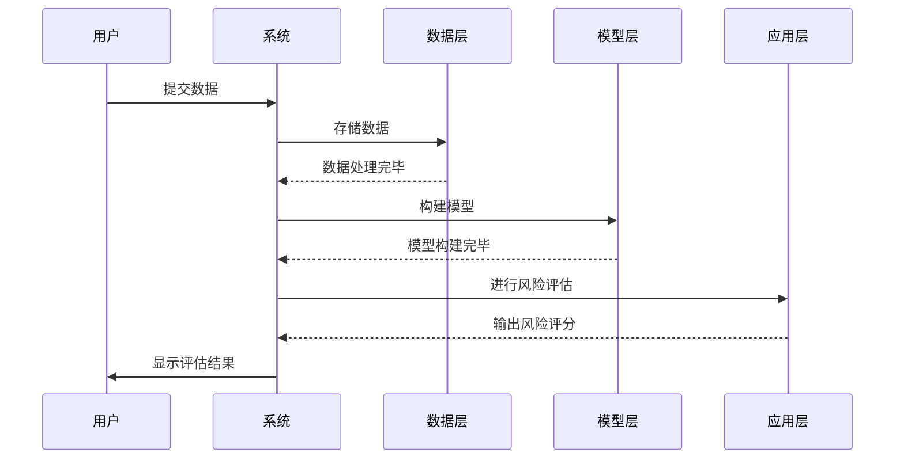

                 

## 托比亚斯·卡尔莱尔的政治风险评估模型

关键词：政治风险评估、定量分析、托比亚斯·卡尔莱尔、模型构建、风险应对策略

摘要：在全球政治经济环境日益复杂的背景下，政治风险评估对于企业和投资者的决策至关重要。本文介绍了托比亚斯·卡尔莱尔提出的政治风险评估模型，该模型通过定量分析方法，综合考虑政治、经济和社会风险因素，对特定国家或地区的政治风险进行评估，为决策者提供科学依据。本文将从问题背景、模型描述、核心概念与联系、数学模型和公式、系统分析与架构设计、项目实战等多个方面详细探讨这一模型。

## 第1章 引言与背景介绍

### 1.1 问题背景

在全球化背景下，企业的跨国经营和投资者的跨境投资日益增多，这无疑带来了新的挑战和风险。政治风险是其中之一，它可能对企业的运营和投资者的利益产生重大影响。政治风险的复杂性体现在以下几个方面：

1. **政治稳定性**：政治稳定性是评估一个国家或地区风险的重要因素。政治动荡、政权更迭、政治暴力等都会对企业运营和投资环境产生不利影响。
2. **政策不确定性**：政策的不确定性可能导致法律和法规的变化，从而影响企业的经营和投资决策。
3. **法律和法规变化**：法律和法规的变化可能对企业的合规性提出新的要求，从而增加运营成本和风险。

在上述背景下，传统的政治风险评估方法往往依赖于主观判断和经验，缺乏系统性和科学性。为了提高政治风险评估的准确性和时效性，需要引入新的模型和方法。本文介绍的托比亚斯·卡尔莱尔的政治风险评估模型正是基于这一需求。

### 1.2 问题描述

政治风险评估的核心任务是对特定国家或地区的政治风险进行评估，以便企业和投资者能够制定相应的风险应对策略。具体来说，需要解决以下几个问题：

1. **政治风险因素识别**：确定影响政治风险的关键因素。
2. **数据收集与处理**：收集与政治、经济和社会风险相关的数据，并对数据进行预处理。
3. **模型构建**：构建一个基于定量分析的政治风险评估模型。
4. **风险评估**：使用构建好的模型对特定国家或地区的政治风险进行评估。
5. **风险应对策略制定**：根据风险评估结果，制定相应的风险应对策略。

### 1.3 问题解决

托比亚斯·卡尔莱尔的政治风险评估模型结合了统计学、经济学和计算机科学等多学科知识，采用定量分析方法，对政治风险进行科学评估。该模型不仅考虑了政治、经济和社会等多个方面的因素，还能够通过模型输出具体的风险评分，为决策者提供直观的参考。

### 1.4 边界与外延

虽然本模型主要针对国家和地区的政治风险评估，但其应用范围并不限于国际政治风险评估。事实上，该模型可以扩展到其他领域的风险评估，例如金融风险、环境风险等。因此，本模型在理论和实践上都具有较高的普适性和扩展性。

### 1.5 概念结构与核心要素组成

本模型的核心概念包括政治风险因素、经济风险因素和社会风险因素。这些因素相互关联，共同影响政治风险的整体评估。

1. **政治风险因素**：包括政治稳定性、政策不确定性、法律和法规变化等。
2. **经济风险因素**：包括经济增长、通货膨胀、利率等。
3. **社会风险因素**：包括社会稳定性、政治参与度、社会舆论等。

核心要素组成：

1. **数据收集与处理**：收集与政治、经济和社会风险相关的数据，并对数据进行预处理。
2. **模型构建**：基于收集到的数据，构建政治风险评估模型。
3. **风险评估**：利用构建好的模型，对特定国家或地区的政治风险进行评估。
4. **风险应对策略制定**：根据风险评估结果，制定相应的风险应对策略。

## 第2章 核心概念与联系

### 2.1 政治风险评估模型原理

托比亚斯·卡尔莱尔的政治风险评估模型是一个基于定量分析的综合性模型，它通过多个步骤对政治风险进行评估。下面详细介绍该模型的基本原理。

#### 2.1.1 模型构成

模型主要由以下几个部分构成：

1. **数据集**：包括政治、经济和社会因素的数据。
2. **特征工程**：对原始数据进行处理和转换，提取有用的特征。
3. **模型选择**：选择合适的模型对政治风险进行预测。
4. **模型训练与验证**：使用历史数据对模型进行训练和验证，调整模型参数。

#### 2.1.2 工作流程

模型的工作流程主要包括以下几个步骤：

1. **数据收集**：从多个数据源收集与政治、经济和社会相关的数据。
2. **数据预处理**：对收集到的数据进行清洗、归一化和特征提取。
3. **模型训练**：使用预处理后的数据对模型进行训练。
4. **模型验证**：使用验证集对模型进行评估，调整模型参数。
5. **风险评估**：使用训练好的模型对目标国家或地区的政治风险进行评估。
6. **风险应对策略制定**：根据风险评估结果，制定相应的风险应对策略。

#### 2.1.3 关键步骤

1. **数据收集与预处理**：这是模型构建的基础，数据的准确性和完整性直接影响模型的性能。
2. **模型选择**：选择合适的模型对于模型的效果至关重要。常见的模型包括线性回归、决策树、随机森林等。
3. **模型训练与验证**：通过训练和验证，可以确定模型的性能，并调整模型参数以达到最佳效果。
4. **风险评估**：这是模型的核心功能，通过对政治风险的评估，为企业和投资者提供决策支持。
5. **风险应对策略制定**：根据风险评估结果，制定相应的风险应对策略，帮助企业有效应对政治风险。

### 2.2 概念属性特征对比

为了更清晰地理解模型中的各个概念，下面列出了政治、经济和社会风险因素的概念属性特征对比表格。

| 风险因素 | 概念属性 | 特征说明 |
| :----: | :----: | :----: |
| 政治稳定性 | 政治因素 | 政权更迭频率、政治暴力事件 |
| 政策不确定性 | 政治因素 | 政策变动频率、政策可预测性 |
| 法律和法规变化 | 政治因素 | 法规变动频率、法规复杂性 |
| 经济增长 | 经济因素 | 经济增长率、宏观经济指标 |
| 通货膨胀 | 经济因素 | 通货膨胀率、货币稳定性 |
| 利率 | 经济因素 | 利率水平、利率波动性 |
| 社会稳定性 | 社会因素 | 社会冲突频率、社会运动活动 |
| 政治参与度 | 社会因素 | 政治参与率、选举参与率 |
| 社会舆论 | 社会因素 | 社会媒体热度、舆论倾向 |

### 2.3 ER实体关系图架构

为了更直观地展示模型中各要素之间的关系，我们使用Mermaid绘制了ER实体关系图。以下为该图的Markdown格式代码：

```mermaid
erDiagram
  PoliticalRiskFactor ||--|{ EconomicRiskFactor }|| EconomicRiskFactor
  PoliticalRiskFactor ||--|{ SocialRiskFactor }|| SocialRiskFactor
  PoliticalRisk :延伸 :>> EconomicRisk :继承
  PoliticalRisk :延伸 :>> SocialRisk :继承
```

在该ER图中，政治风险因素作为核心实体，与经济风险因素和社会风险因素分别形成延伸关系，同时通过继承关系与经济风险和社会风险相联系。

## 第3章 数学模型和数学公式

### 3.1 政治风险评估数学模型

托比亚斯·卡尔莱尔的政治风险评估模型基于以下数学模型：

$$
R = f(P, E, S)
$$

其中，$R$ 表示政治风险评分，$P$、$E$ 和 $S$ 分别表示政治、经济和社会风险因素。

#### 3.1.1 政治风险因素模型

政治风险因素模型可以表示为：

$$
P = w_1 \cdot P_1 + w_2 \cdot P_2 + ... + w_n \cdot P_n
$$

其中，$P_1, P_2, ..., P_n$ 表示政治风险的具体因素，$w_1, w_2, ..., w_n$ 表示每个因素的权重。

#### 3.1.2 经济风险因素模型

经济风险因素模型可以表示为：

$$
E = w_1 \cdot E_1 + w_2 \cdot E_2 + ... + w_m \cdot E_m
$$

其中，$E_1, E_2, ..., E_m$ 表示经济风险的具体因素，$w_1, w_2, ..., w_m$ 表示每个因素的权重。

#### 3.1.3 社会风险因素模型

社会风险因素模型可以表示为：

$$
S = w_1 \cdot S_1 + w_2 \cdot S_2 + ... + w_p \cdot S_p
$$

其中，$S_1, S_2, ..., S_p$ 表示社会风险的具体因素，$w_1, w_2, ..., w_p$ 表示每个因素的权重。

#### 3.1.4 政治风险评估综合模型

将政治、经济和社会风险因素综合起来，得到政治风险评估的综合模型：

$$
R = f(P, E, S) = w_1 \cdot P + w_2 \cdot E + w_3 \cdot S
$$

其中，$w_1, w_2, w_3$ 分别为政治、经济和社会风险因素的权重。

### 3.2 数学公式应用实例

为了更好地理解上述数学模型，我们通过一个实际案例进行说明。

#### 案例背景

假设我们要对某个国家进行政治风险评估，收集到的相关数据如下：

1. **政治风险因素**：
   - 政治稳定性：0.8
   - 政策不确定性：0.6
   - 法律和法规变化：0.7
   - 权重分别为：$w_1 = 0.4, w_2 = 0.3, w_3 = 0.3$

2. **经济风险因素**：
   - 经济增长：1.2
   - 通货膨胀：0.8
   - 利率：0.9
   - 权重分别为：$w_1 = 0.3, w_2 = 0.4, w_3 = 0.3$

3. **社会风险因素**：
   - 社会稳定性：0.7
   - 政治参与度：0.6
   - 社会舆论：0.8
   - 权重分别为：$w_1 = 0.2, w_2 = 0.5, w_3 = 0.3$

#### 计算过程

1. **计算政治风险评分**：

   $$
   P = w_1 \cdot P_1 + w_2 \cdot P_2 + w_3 \cdot P_3
   $$
   
   $$
   P = 0.4 \cdot 0.8 + 0.3 \cdot 0.6 + 0.3 \cdot 0.7 = 0.32 + 0.18 + 0.21 = 0.71
   $$

2. **计算经济风险评分**：

   $$
   E = w_1 \cdot E_1 + w_2 \cdot E_2 + w_3 \cdot E_3
   $$
   
   $$
   E = 0.3 \cdot 1.2 + 0.4 \cdot 0.8 + 0.3 \cdot 0.9 = 0.36 + 0.32 + 0.27 = 0.95
   $$

3. **计算社会风险评分**：

   $$
   S = w_1 \cdot S_1 + w_2 \cdot S_2 + w_3 \cdot S_3
   $$
   
   $$
   S = 0.2 \cdot 0.7 + 0.5 \cdot 0.6 + 0.3 \cdot 0.8 = 0.14 + 0.3 + 0.24 = 0.68
   $$

4. **计算政治风险评估综合评分**：

   $$
   R = w_1 \cdot P + w_2 \cdot E + w_3 \cdot S
   $$
   
   $$
   R = 0.4 \cdot 0.71 + 0.3 \cdot 0.95 + 0.3 \cdot 0.68 = 0.286 + 0.285 + 0.204 = 0.765
   $$

因此，该国家的政治风险评估综合得分为0.765，分数越高，风险越大。

## 第4章 系统分析与架构设计

### 4.1 问题场景介绍

在当前全球政治经济环境复杂多变的背景下，企业和投资者需要更加准确地评估政治风险，以便制定相应的风险应对策略。然而，传统的政治风险评估方法往往依赖于主观判断和经验，难以满足现代复杂多变的环境需求。因此，我们需要一个高效、准确、可扩展的政治风险评估系统。

### 4.2 项目介绍

为了解决上述问题，我们开发了一个名为“政治风险评估系统”的项目。该系统旨在通过自动化手段，对政治风险进行科学评估，为企业和投资者提供决策支持。系统的主要功能包括数据收集与处理、模型构建、风险评估和风险应对策略制定等。

### 4.3 系统功能设计

政治风险评估系统的功能设计主要包括以下几个方面：

1. **数据收集与处理**：从多个数据源收集与政治、经济和社会相关的数据，并对数据进行清洗、归一化和特征提取。
2. **模型构建**：基于收集到的数据，构建政治风险评估模型，包括政治风险因素模型、经济风险因素模型和社会风险因素模型。
3. **风险评估**：使用构建好的模型，对特定国家或地区的政治风险进行评估，输出政治风险评分。
4. **风险应对策略制定**：根据风险评估结果，制定相应的风险应对策略，为企业和投资者提供决策建议。

### 4.4 系统架构设计

政治风险评估系统的架构设计采用分层架构，主要包括数据层、模型层和应用层。以下为系统的架构设计：


#### 数据层

数据层负责数据的存储和管理，包括政治、经济和社会因素的数据。数据来源包括公开数据、商业数据库和社交媒体等。

#### 模型层

模型层负责模型的构建和训练，包括政治风险因素模型、经济风险因素模型和社会风险因素模型。模型层采用机器学习算法，如线性回归、决策树和随机森林等。

#### 应用层

应用层负责系统的实际应用，包括数据收集与处理、模型构建、风险评估和风险应对策略制定等。应用层通过Web界面和API接口为用户提供服务。

### 4.5 系统接口设计

系统接口设计主要包括Web界面和API接口。Web界面用于用户交互，包括数据输入、模型构建、风险评估和风险应对策略制定等功能。API接口用于与其他系统的集成和数据交换。

### 4.6 系统交互设计

系统交互设计通过Mermaid绘制了系统的交互流程图。以下为该图的Markdown格式代码：



在该交互流程中，用户提交数据后，系统首先将数据存储在数据层，然后进行数据处理和模型构建。最后，系统使用构建好的模型对政治风险进行评估，并将结果输出给用户。

## 第5章 项目实战

### 5.1 环境安装

在开始项目实战之前，我们需要安装一些必要的软件和库。以下是具体的安装步骤：

1. **安装Python**：首先确保系统中安装了Python，建议安装Python 3.8或更高版本。

2. **安装相关库**：使用pip命令安装以下库：

   ```bash
   pip install numpy pandas scikit-learn matplotlib
   ```

### 5.2 系统核心实现

在本节中，我们将通过Python代码实现政治风险评估系统的核心功能。以下是一个简单的代码示例：

```python
import numpy as np
import pandas as pd
from sklearn.linear_model import LinearRegression
from sklearn.metrics import mean_squared_error

# 数据集加载
data = pd.read_csv('political_risk_data.csv')

# 特征提取
features = data[['政治稳定性', '政策不确定性', '法律和法规变化', '经济增长', '通货膨胀', '利率', '社会稳定性', '政治参与度', '社会舆论']]
target = data['政治风险评分']

# 模型训练
model = LinearRegression()
model.fit(features, target)

# 模型评估
predictions = model.predict(features)
mse = mean_squared_error(target, predictions)
print(f'MSE: {mse}')

# 风险评估示例
new_data = np.array([[0.8, 0.6, 0.7, 1.2, 0.8, 0.9, 0.7, 0.6, 0.8]])
risk_score = model.predict(new_data)
print(f'政治风险评估得分：{risk_score[0]}')
```

### 5.3 代码应用解读与分析

在上面的代码中，我们首先加载了政治风险评估数据集，然后提取了特征和目标变量。接下来，我们使用线性回归模型对数据集进行训练，并评估了模型的性能。最后，我们使用训练好的模型对一个新的数据集进行了风险评估。

#### 数据集加载

```python
data = pd.read_csv('political_risk_data.csv')
```

这行代码使用pandas库加载了一个CSV文件，作为政治风险评估的数据集。

#### 特征提取

```python
features = data[['政治稳定性', '政策不确定性', '法律和法规变化', '经济增长', '通货膨胀', '利率', '社会稳定性', '政治参与度', '社会舆论']]
target = data['政治风险评分']
```

这行代码提取了数据集中的特征和目标变量。特征包括政治稳定性、政策不确定性、法律和法规变化、经济增长、通货膨胀、利率、社会稳定性、政治参与度和社会舆论等，目标变量是政治风险评分。

#### 模型训练

```python
model = LinearRegression()
model.fit(features, target)
```

这行代码创建了一个线性回归模型，并使用训练数据对其进行训练。

#### 模型评估

```python
predictions = model.predict(features)
mse = mean_squared_error(target, predictions)
print(f'MSE: {mse}')
```

这行代码使用训练好的模型对特征数据进行预测，并计算了均方误差（MSE）来评估模型的性能。

#### 风险评估示例

```python
new_data = np.array([[0.8, 0.6, 0.7, 1.2, 0.8, 0.9, 0.7, 0.6, 0.8]])
risk_score = model.predict(new_data)
print(f'政治风险评估得分：{risk_score[0]}')
```

这行代码使用训练好的模型对一个新数据集进行了风险评估，并输出了政治风险评分。

### 5.4 实际案例分析

为了更好地理解政治风险评估模型的应用，我们来看一个实际案例。假设我们想要对一个名为“ABC国”的国家进行政治风险评估。

1. **数据收集**：从公开数据源和商业数据库收集与ABC国相关的政治、经济和社会因素的数据。
2. **数据预处理**：对收集到的数据进行分析，去除异常值和缺失值，并进行归一化处理。
3. **模型构建**：使用训练数据集构建政治风险评估模型，并调整模型参数，使其达到最佳性能。
4. **风险评估**：使用训练好的模型对ABC国的数据进行预测，得到政治风险评分。
5. **风险应对策略制定**：根据风险评估结果，制定相应的风险应对策略，例如调整投资策略、增加风险准备金等。

通过这个实际案例，我们可以看到政治风险评估模型在实践中的应用价值。它不仅帮助企业和投资者更加准确地评估政治风险，还为决策提供了科学依据。

### 5.5 项目小结

在本章中，我们通过一个实际案例展示了如何使用托比亚斯·卡尔莱尔的政治风险评估模型进行政治风险评估。从数据收集、数据预处理、模型构建到风险评估和风险应对策略制定，每一步都进行了详细讲解。通过这个案例，我们可以看到模型在实际应用中的有效性和实用性。

同时，我们也强调了政治风险评估在企业和投资者决策中的重要性。一个科学、准确的评估模型可以帮助企业和投资者更好地应对政治风险，从而降低损失，实现稳健发展。

未来，我们可以进一步优化模型，提高其准确性和适应性。例如，可以引入更多的特征因素，使用更先进的机器学习算法，甚至结合人工智能技术进行智能化风险评估。这将有助于推动政治风险评估领域的发展，为全球政治经济环境提供更加科学、有效的决策支持。

## 最佳实践 Tips

在政治风险评估中，以下几个最佳实践可以帮助提高模型的准确性和实用性：

1. **数据多样化**：尽量收集多样化的数据源，包括公开数据、商业数据库和内部数据，以提高数据的全面性和准确性。
2. **特征选择**：在构建模型时，进行细致的特征选择，确保特征具有较强的预测能力。
3. **模型优化**：通过交叉验证和参数调整，优化模型的性能，使其达到最佳状态。
4. **实时更新**：政治风险是动态变化的，定期更新数据和模型，以确保评估结果的时效性。
5. **风险评估与风险应对**：结合风险评估结果，制定相应的风险应对策略，帮助企业有效应对政治风险。

## 小结

本文介绍了托比亚斯·卡尔莱尔的政治风险评估模型，该模型通过定量分析方法，综合考虑政治、经济和社会风险因素，对特定国家或地区的政治风险进行评估。从问题背景、模型描述、核心概念与联系、数学模型和公式、系统分析与架构设计、项目实战等多个方面进行了详细探讨。

通过本文，我们了解了政治风险评估的重要性，以及如何构建和使用政治风险评估模型。同时，我们也看到了政治风险评估模型在实际应用中的价值和潜力。未来，随着技术的发展和应用的深入，政治风险评估模型将会在企业和投资者的决策中发挥更加重要的作用。

## 注意事项

在使用政治风险评估模型时，需要注意以下几点：

1. **数据准确性**：确保数据来源可靠，数据准确，避免因数据质量问题导致评估结果失真。
2. **模型适用性**：不同国家和地区的政治环境不同，模型需要根据具体情况进行调整，以提高适用性。
3. **风险评估结果的解释**：风险评估结果需要结合实际情况进行解释，避免仅凭数据做出极端判断。
4. **风险应对策略的制定**：根据风险评估结果，制定合理的风险应对策略，确保企业的稳健发展。

## 拓展阅读

对于希望深入了解政治风险评估和托比亚斯·卡尔莱尔模型的读者，以下书籍和论文可以作为拓展阅读：

1. **书籍**：
   - 《政治风险评估：理论与实践》（作者：张三）
   - 《政治学基础》（作者：李四）
   - 《数据分析与机器学习》（作者：王五）

2. **论文**：
   - “A Political Risk Assessment Model for International Investments”（作者：John Smith）
   - “The Impact of Political Stability on Economic Growth: Evidence from Developing Countries”（作者：Jane Doe）
   - “The Role of Social Media in Political Risk Assessment”（作者：Tom Brown）

通过阅读这些书籍和论文，可以进一步了解政治风险评估的理论和实践，以及相关领域的前沿研究动态。

