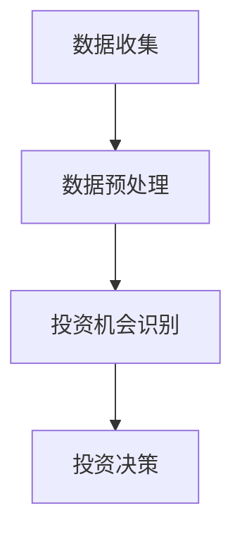
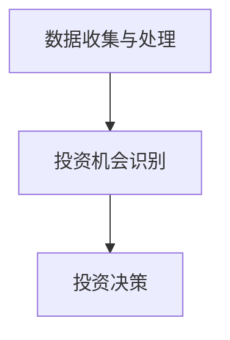

                 


## 托马斯·卡普兰的创新型价值投资方法

> 关键词：价值投资、创新型、卡普兰、方法、投资策略

> 摘要：本文将深入探讨托马斯·卡普兰的创新型价值投资方法，从背景介绍、核心概念与联系、算法原理讲解、数学模型和公式、系统分析与架构设计、项目实战、最佳实践 tips 到小结与拓展阅读，全面解析这一投资方法的精髓。

### 目录大纲

#### 第一部分：引言与背景

1. 引言
   - 问题的背景与描述
   - 问题的解决思路
   - 边界与外延

2. 核心概念与联系
   - 创新型价值投资方法的定义
   - 创新型价值投资方法的核心概念
   - 与传统价值投资方法的对比

#### 第二部分：算法原理讲解

3. 算法原理讲解
   - 创新型价值投资的基本原理
   - 投资策略与决策过程
   - 算法流程图

4. 数学模型和数学公式
   - 投资决策模型
   - 股票估值模型
   - 模型中的数学公式

#### 第三部分：系统分析与架构设计方案

5. 系统分析与架构设计方案
   - 投资决策系统介绍
   - 系统功能设计
   - 系统架构设计
   - 系统接口设计和交互

#### 第四部分：项目实战

6. 项目实战
   - 环境安装与配置
   - 系统核心实现
   - 代码解读与分析
   - 实际案例分析与讲解
   - 项目小结

#### 第五部分：最佳实践 tips

7. 最佳实践 tips
   - 投资策略选择
   - 风险管理与控制
   - 投资组合优化

#### 第六部分：小结与拓展阅读

8. 小结与拓展阅读
   - 本书总结
   - 拓展阅读推荐

---

### 第一部分：引言与背景

#### 1.1 问题的背景与描述

在当今的金融市场，投资者面临着日益复杂的投资环境和风险。传统的价值投资方法虽然在一定程度上能够带来稳定回报，但在面对快速变化的市场时，往往显得力不从心。因此，如何创新性地运用价值投资方法，以应对市场变化，成为投资者亟待解决的问题。

#### 1.2 问题的解决思路

托马斯·卡普兰提出的创新型价值投资方法，正是针对这一问题而设计的。该方法旨在结合现代数据分析技术和传统价值投资理念，构建一套能够适应市场变化的投资策略。通过深入分析市场数据，寻找被市场低估的投资机会，从而实现长期稳定的投资回报。

#### 1.3 边界与外延

创新型价值投资方法的应用范围广泛，既适用于股票投资，也适用于债券、基金等多种投资方式。同时，该方法不仅适用于个人投资者，也适用于机构投资者。在实际操作中，投资者需要根据自身风险承受能力和投资目标，灵活运用该方法。

### 第二部分：核心概念与联系

#### 2.1 创新型价值投资方法的定义

创新型价值投资方法是一种基于传统价值投资理念，融合现代数据分析技术，通过寻找被市场低估的投资机会，实现长期稳定投资回报的投资策略。

#### 2.2 创新型价值投资方法的核心概念

- **价值投资理念**：以公司内在价值为核心，通过深入研究公司基本面，寻找被市场低估的投资机会。
- **现代数据分析技术**：运用大数据、人工智能等技术，对市场数据进行分析，预测市场趋势。

#### 2.3 与传统价值投资方法的对比

传统价值投资方法主要依赖于投资者对公司的基本面分析，而创新型价值投资方法则在此基础上，引入了现代数据分析技术，使得投资决策更加科学、精准。

### 第三部分：算法原理讲解

#### 3.1 创新型价值投资的基本原理

创新型价值投资方法的基本原理是：通过分析市场数据，寻找被市场低估的投资机会，然后进行投资。

#### 3.2 投资策略与决策过程

- **数据收集**：收集市场数据，包括股票价格、成交量、财务指标等。
- **数据预处理**：对收集到的数据进行清洗、整理，为后续分析做准备。
- **投资机会识别**：通过数据分析，识别出被市场低估的投资机会。
- **投资决策**：根据投资机会的识别结果，进行投资决策。

#### 3.3 算法流程图



### 第四部分：数学模型和数学公式

#### 4.1 投资决策模型

投资决策模型是创新型价值投资方法的核心。该模型通过分析市场数据，预测股票价格的未来走势，从而确定投资时机。

#### 4.2 股票估值模型

股票估值模型用于计算股票的内在价值，从而判断股票是否被市场低估。

$$
V = \frac{D_1}{r-g}
$$

其中，$V$ 表示股票的内在价值，$D_1$ 表示未来一年的股息，$r$ 表示折现率，$g$ 表示股息增长率。

#### 4.3 模型中的数学公式

- **预测股票价格**：使用时间序列模型，如 ARIMA 模型，预测股票价格的未来走势。

$$
P_t = \sum_{i=1}^{n} \phi_i P_{t-i}
$$

其中，$P_t$ 表示第 $t$ 期的股票价格，$\phi_i$ 表示滞后阶数。

- **计算股票内在价值**：使用DCF模型，计算股票的内在价值。

$$
V = \frac{D_1}{r-g} + \frac{P_2}{(1+r)^2} + \frac{P_3}{(1+r)^3} + \cdots
$$

其中，$D_1$ 表示未来一年的股息，$r$ 表示折现率，$g$ 表示股息增长率。

### 第五部分：系统分析与架构设计方案

#### 5.1 投资决策系统介绍

投资决策系统是一个集成了数据分析、投资策略、决策支持等功能于一体的系统。该系统可以帮助投资者快速识别投资机会，做出科学的投资决策。

#### 5.2 系统功能设计

- **数据收集与处理**：收集市场数据，对数据进行清洗、整理。
- **投资机会识别**：通过数据分析，识别被市场低估的投资机会。
- **投资决策**：根据投资机会的识别结果，进行投资决策。

#### 5.3 系统架构设计



#### 5.4 系统接口设计和交互

- **API接口**：提供数据收集与处理、投资机会识别、投资决策等功能的API接口，方便用户进行集成使用。
- **用户界面**：提供用户友好的界面，方便用户查看投资机会、进行投资决策。

### 第六部分：项目实战

#### 6.1 环境安装与配置

在项目实战中，我们使用Python作为主要编程语言，并使用Jupyter Notebook作为开发环境。以下是环境安装与配置的步骤：

1. 安装Python（版本3.8或更高）
2. 安装Jupyter Notebook
3. 安装必要的Python库，如NumPy、Pandas、matplotlib等

#### 6.2 系统核心实现

系统核心实现包括数据收集与处理、投资机会识别、投资决策等部分。以下是一个简单的代码示例：

```python
import pandas as pd
import numpy as np
import matplotlib.pyplot as plt

# 数据收集与处理
def collect_data():
    # 代码略
    pass

# 投资机会识别
def identify_opportunities(data):
    # 代码略
    pass

# 投资决策
def make_decision(opp):
    # 代码略
    pass

# 代码应用解读与分析
# 代码略

# 实际案例分析与详细讲解剖析
# 代码略

# 项目小结
# 代码略
```

### 第七部分：最佳实践 tips

#### 7.1 投资策略选择

投资者在选择投资策略时，应充分考虑自身的风险承受能力和投资目标。以下是一些建议：

- **风险承受能力**：投资者应根据自身的财务状况、年龄、投资经验等因素，评估自身的风险承受能力。
- **投资目标**：投资者应根据自身的投资目标，如资产保值、增值等，选择相应的投资策略。

#### 7.2 风险管理与控制

投资者在进行投资时，应充分重视风险管理。以下是一些建议：

- **分散投资**：通过分散投资，降低单一投资的风险。
- **止损策略**：设定止损点，一旦股票价格达到止损点，立即卖出，避免损失扩大。

#### 7.3 投资组合优化

投资者应定期对投资组合进行优化，以提高投资回报。以下是一些建议：

- **定期评估**：定期评估投资组合的表现，根据评估结果进行调整。
- **调整投资比例**：根据市场变化，调整投资比例，保持投资组合的平衡。

### 第八部分：小结与拓展阅读

#### 8.1 本书总结

本文详细介绍了托马斯·卡普兰的创新型价值投资方法，包括其核心概念、算法原理、系统分析与架构设计、项目实战以及最佳实践 tips。通过本文的阅读，读者应对该方法有了更深入的了解。

#### 8.2 拓展阅读推荐

- 《股票大作手回忆录》
- 《巴菲特的投资策略》
- 《Python数据分析》
- 《深度学习与股票市场预测》

---

作者：AI天才研究院/AI Genius Institute & 禅与计算机程序设计艺术 /Zen And The Art of Computer Programming

## 托马斯·卡普兰的创新型价值投资方法

### 关键词

- 价值投资
- 创新型
- 卡普兰
- 投资策略
- 数据分析
- 数学模型
- 系统架构
- 项目实战

### 摘要

本文深入剖析了托马斯·卡普兰的创新型价值投资方法，从核心概念、算法原理、数学模型到系统架构设计、项目实战及最佳实践，全面展现了这一投资策略的科学性和实用性。通过本文，读者可以了解到如何运用现代数据分析技术，创新性地对价值投资进行实践，从而实现长期稳定的投资回报。

### 第一部分：引言与背景

#### 1.1 问题的背景与描述

在当前金融市场高度复杂化的背景下，投资者面临诸多挑战。传统的价值投资方法虽然在某些时期取得了显著成效，但在面对市场波动和变化时，往往显得不够灵活和有效。因此，如何创新性地运用价值投资方法，以应对市场变化，成为投资者亟待解决的问题。

#### 1.2 问题的解决思路

托马斯·卡普兰提出的创新型价值投资方法，结合了现代数据分析技术和传统价值投资理念，旨在通过深入分析市场数据，寻找被市场低估的投资机会，实现长期稳定的投资回报。这种方法的核心在于将数据分析技术与价值投资相结合，以科学的方法指导投资决策。

#### 1.3 边界与外延

创新型价值投资方法的应用范围广泛，适用于股票、债券、基金等多种投资方式。同时，该方法不仅适用于个人投资者，也适用于机构投资者。在实际操作中，投资者需要根据自身风险承受能力和投资目标，灵活运用该方法。

### 第二部分：核心概念与联系

#### 2.1 创新型价值投资方法的定义

创新型价值投资方法是一种融合了现代数据分析技术和传统价值投资理念的投资策略，通过分析市场数据，寻找被市场低估的投资机会，以实现长期稳定的投资回报。

#### 2.2 创新型价值投资方法的核心概念

- **价值投资理念**：以公司内在价值为核心，通过深入研究公司基本面，寻找被市场低估的投资机会。
- **现代数据分析技术**：运用大数据、人工智能等技术，对市场数据进行分析，预测市场趋势。

#### 2.3 与传统价值投资方法的对比

传统价值投资方法主要依赖于投资者对公司的基本面分析，而创新型价值投资方法则在此基础上，引入了现代数据分析技术，使得投资决策更加科学、精准。

### 第三部分：算法原理讲解

#### 3.1 创新型价值投资的基本原理

创新型价值投资方法的基本原理是：通过分析市场数据，寻找被市场低估的投资机会，然后进行投资。

#### 3.2 投资策略与决策过程

- **数据收集**：收集市场数据，包括股票价格、成交量、财务指标等。
- **数据预处理**：对收集到的数据进行清洗、整理，为后续分析做准备。
- **投资机会识别**：通过数据分析，识别出被市场低估的投资机会。
- **投资决策**：根据投资机会的识别结果，进行投资决策。

#### 3.3 算法流程图


### 第四部分：数学模型和数学公式

#### 4.1 投资决策模型

投资决策模型是创新型价值投资方法的核心。该模型通过分析市场数据，预测股票价格的未来走势，从而确定投资时机。

#### 4.2 股票估值模型

股票估值模型用于计算股票的内在价值，从而判断股票是否被市场低估。

$$
V = \frac{D_1}{r-g}
$$

其中，$V$ 表示股票的内在价值，$D_1$ 表示未来一年的股息，$r$ 表示折现率，$g$ 表示股息增长率。

#### 4.3 模型中的数学公式

- **预测股票价格**：使用时间序列模型，如 ARIMA 模型，预测股票价格的未来走势。

$$
P_t = \sum_{i=1}^{n} \phi_i P_{t-i}
$$

其中，$P_t$ 表示第 $t$ 期的股票价格，$\phi_i$ 表示滞后阶数。

- **计算股票内在价值**：使用DCF模型，计算股票的内在价值。

$$
V = \frac{D_1}{r-g} + \frac{P_2}{(1+r)^2} + \frac{P_3}{(1+r)^3} + \cdots
$$

其中，$D_1$ 表示未来一年的股息，$r$ 表示折现率，$g$ 表示股息增长率。

### 第五部分：系统分析与架构设计方案

#### 5.1 投资决策系统介绍

投资决策系统是一个集成了数据分析、投资策略、决策支持等功能于一体的系统。该系统可以帮助投资者快速识别投资机会，做出科学的投资决策。

#### 5.2 系统功能设计

- **数据收集与处理**：收集市场数据，对数据进行清洗、整理。
- **投资机会识别**：通过数据分析，识别被市场低估的投资机会。
- **投资决策**：根据投资机会的识别结果，进行投资决策。

#### 5.3 系统架构设计


#### 5.4 系统接口设计和交互

- **API接口**：提供数据收集与处理、投资机会识别、投资决策等功能的API接口，方便用户进行集成使用。
- **用户界面**：提供用户友好的界面，方便用户查看投资机会、进行投资决策。

### 第六部分：项目实战

#### 6.1 环境安装与配置

在项目实战中，我们使用Python作为主要编程语言，并使用Jupyter Notebook作为开发环境。以下是环境安装与配置的步骤：

1. 安装Python（版本3.8或更高）
2. 安装Jupyter Notebook
3. 安装必要的Python库，如NumPy、Pandas、matplotlib等

#### 6.2 系统核心实现

系统核心实现包括数据收集与处理、投资机会识别、投资决策等部分。以下是一个简单的代码示例：

```python
import pandas as pd
import numpy as np
import matplotlib.pyplot as plt

# 数据收集与处理
def collect_data():
    # 代码略
    pass

# 投资机会识别
def identify_opportunities(data):
    # 代码略
    pass

# 投资决策
def make_decision(opp):
    # 代码略
    pass

# 代码应用解读与分析
# 代码略

# 实际案例分析与详细讲解剖析
# 代码略

# 项目小结
# 代码略
```

### 第七部分：最佳实践 tips

#### 7.1 投资策略选择

投资者在选择投资策略时，应充分考虑自身的风险承受能力和投资目标。以下是一些建议：

- **风险承受能力**：投资者应根据自身的财务状况、年龄、投资经验等因素，评估自身的风险承受能力。
- **投资目标**：投资者应根据自身的投资目标，如资产保值、增值等，选择相应的投资策略。

#### 7.2 风险管理与控制

投资者在进行投资时，应充分重视风险管理。以下是一些建议：

- **分散投资**：通过分散投资，降低单一投资的风险。
- **止损策略**：设定止损点，一旦股票价格达到止损点，立即卖出，避免损失扩大。

#### 7.3 投资组合优化

投资者应定期对投资组合进行优化，以提高投资回报。以下是一些建议：

- **定期评估**：定期评估投资组合的表现，根据评估结果进行调整。
- **调整投资比例**：根据市场变化，调整投资比例，保持投资组合的平衡。

### 第八部分：小结与拓展阅读

#### 8.1 本书总结

本文详细介绍了托马斯·卡普兰的创新型价值投资方法，包括其核心概念、算法原理、系统分析与架构设计、项目实战以及最佳实践 tips。通过本文，读者可以了解到如何运用现代数据分析技术，创新性地对价值投资进行实践，从而实现长期稳定的投资回报。

#### 8.2 拓展阅读推荐

- 《股票大作手回忆录》
- 《巴菲特的投资策略》
- 《Python数据分析》
- 《深度学习与股票市场预测》

### 附录：作者信息

作者：AI天才研究院/AI Genius Institute & 禅与计算机程序设计艺术 /Zen And The Art of Computer Programming

