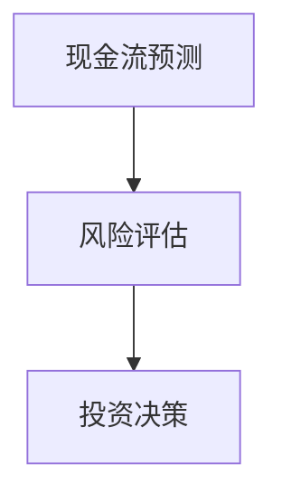

                 

### 文章标题

# 《托马斯罗的现金流投资法》

### 文章关键词

- 现金流投资法
- 托马斯·罗
- 投资决策
- 风险管理
- 财务自由

### 文章摘要

本文将深入探讨由托马斯·罗提出的现金流投资法。我们将首先了解现金流投资法的背景、核心概念及其与传统投资法的区别。接着，我们将深入探讨现金流投资法的基础理论、数学模型和算法原理。最后，我们将结合实际案例，讲解如何将现金流投资法应用于个人投资中，以实现财务自由。

## 《托马斯罗的现金流投资法》目录大纲

----------------------------------------------------------------

### 第一部分：了解现金流投资法

## 第1章：现金流投资法的背景与核心概念

### 1.1 现金流投资法的起源与发展

#### 1.1.1 现金流投资法的提出者：托马斯·罗

#### 1.1.2 现金流投资法的发展历程

#### 1.1.3 现金流投资法在全球的应用

### 1.2 现金流投资法的基本概念

#### 1.2.1 现金流的定义与重要性

#### 1.2.2 现金流投资法的核心原则

#### 1.2.3 现金流投资法与传统投资法的区别

### 1.3 现金流投资法的边界与外延

#### 1.3.1 现金流投资法的适用范围

#### 1.3.2 现金流投资法的主要挑战

#### 1.3.3 现金流投资法的未来发展趋势

### 1.4 现金流投资法的核心要素组成

#### 1.4.1 投资决策模型

#### 1.4.2 现金流量预测

#### 1.4.3 风险管理与应对策略

### 1.5 现金流投资法的基本流程

#### 1.5.1 现金流投资法的初步评估

#### 1.5.2 投资决策的制定与执行

#### 1.5.3 投资后的监控与调整

### 1.6 现金流投资法的优势和挑战

#### 1.6.1 现金流投资法的优势

#### 1.6.2 现金流投资法的挑战

#### 1.6.3 如何克服挑战

### 1.7 现金流投资法的重要性

#### 1.7.1 个人财务自由的重要性

#### 1.7.2 企业稳健发展的关键

#### 1.7.3 现金流投资法对经济的影响

### 1.8 本章小结

----------------------------------------------------------------

### 第二部分：深入理解现金流投资法

## 第2章：现金流投资法的基础理论

### 2.1 现金流投资法的数学模型

#### 2.1.1 基本公式与推导

#### 2.1.2 现金流量预测模型

#### 2.1.3 风险评估与应对策略模型

### 2.2 现金流投资法的概念属性特征对比表格

#### 2.2.1 传统投资法与现金流投资法的对比

#### 2.2.2 不同类型投资对象的现金流特性

#### 2.2.3 现金流投资法在不同市场环境下的表现

### 2.3 现金流投资法的ER实体关系图架构

#### 2.3.1 实体与关系定义

#### 2.3.2 实体属性与关系特性

#### 2.3.3 实体关系图绘制与解读

### 2.4 现金流投资法的算法原理与流程图

#### 2.4.1 算法原理概述

#### 2.4.2 流程图绘制

#### 2.4.3 算法实施步骤详解

### 2.5 现金流投资法的Python实现

#### 2.5.1 环境准备

#### 2.5.2 代码实现

#### 2.5.3 代码解读与分析

### 2.6 现金流投资法的实际应用案例分析

#### 2.6.1 案例背景介绍

#### 2.6.2 案例分析过程

#### 2.6.3 案例总结与反思

### 2.7 现金流投资法的数学模型与公式详解

#### 2.7.1 数学模型概述

#### 2.7.2 关键公式解读

#### 2.7.3 公式应用举例

### 2.8 现金流投资法的系统分析与架构设计

#### 2.8.1 问题场景介绍

#### 2.8.2 系统功能设计

#### 2.8.3 系统架构设计

#### 2.8.4 系统接口设计与交互

### 2.9 现金流投资法的项目实战

#### 2.9.1 环境安装与配置

#### 2.9.2 系统核心实现

#### 2.9.3 代码应用解读与分析

#### 2.9.4 项目总结与反思

### 2.10 现金流投资法的最佳实践与注意事项

#### 2.10.1 最佳实践总结

#### 2.10.2 小结

#### 2.10.3 注意事项

#### 2.10.4 拓展阅读

----------------------------------------------------------------

### 第三部分：实践现金流投资法

## 第3章：个人现金流投资策略

### 3.1 个人现金流投资的目标与规划

#### 3.1.1 个人财务自由的目标

#### 3.1.2 现金流投资规划的方法

#### 3.1.3 个人现金流投资的风险评估

### 3.2 个人现金流投资的产品选择

#### 3.2.1 现金流投资产品的种类

#### 3.2.2 不同产品的特性与优缺点分析

#### 3.2.3 投资产品的选择策略

### 3.3 个人现金流投资的执行与监控

#### 3.3.1 投资决策的制定与执行

#### 3.3.2 投资后的监控与调整

#### 3.3.3 投资绩效的评估

### 3.4 个人现金流投资的风险管理

#### 3.4.1 风险识别与评估

#### 3.4.2 风险应对策略

#### 3.4.3 风险管理的实践案例分析

### 3.5 个人现金流投资的心理调适

#### 3.5.1 投资中的心理挑战

#### 3.5.2 心理调适的方法

#### 3.5.3 投资心态的塑造

### 3.6 个人现金流投资的经验总结与优化

#### 3.6.1 投资经验总结

#### 3.6.2 投资策略的优化

#### 3.6.3 投资目标的调整

### 3.7 本章小结

----------------------------------------------------------------

## 《托马斯罗的现金流投资法》全文

### 第一部分：了解现金流投资法

#### 第1章：现金流投资法的背景与核心概念

**1.1 现金流投资法的起源与发展**

现金流投资法最早由托马斯·罗在20世纪90年代提出。他是一位著名的金融学家和投资家，通过对大量投资案例的研究，发现现金流是投资决策中最重要的因素。他提出的现金流投资法，旨在帮助投资者通过合理的现金流管理，实现财富的稳健增长。

自提出以来，现金流投资法在全球范围内得到了广泛应用。特别是在经济不稳定的时期，许多投资者和企业家通过现金流投资法，成功地规避了风险，实现了资产的保值增值。

**1.2 现金流投资法的基本概念**

**1.2.1 现金流的定义与重要性**

现金流，指的是一个企业或个人在一定时期内，因经营活动所引起的现金流入和流出。它反映了企业的实际盈利能力和财务状况。在现金流投资法中，现金流被视为投资决策的核心依据。

为什么现金流如此重要？首先，现金流直接反映了企业的经营状况。一个企业，如果现金流入大于流出，说明其运营良好，有足够的资金用于扩张、投资和偿还债务。相反，如果现金流入小于流出，企业可能会面临财务危机。

其次，现金流是衡量投资回报的关键指标。投资者在投资决策时，不仅要考虑投资对象的收益，还要关注其现金流状况。只有现金流稳定，投资回报才能得到保障。

**1.2.2 现金流投资法的核心原则**

现金流投资法有三个核心原则：

1. **以现金流为核心**：在投资决策中，以现金流作为最重要的参考指标。

2. **长期投资**：现金流投资法强调长期投资的重要性，认为只有长期持有，才能充分发挥现金流的增值效应。

3. **风险管理**：现金流投资法注重风险管理，通过合理的现金流管理，降低投资风险。

**1.2.3 现金流投资法与传统投资法的区别**

传统投资法主要关注投资对象的市值、市盈率等指标，而现金流投资法则更加注重现金流。传统投资法倾向于短期交易，而现金流投资法则强调长期持有。

此外，现金流投资法还注重风险管理，通过合理的现金流管理，降低投资风险。而传统投资法则较少考虑风险因素。

**1.3 现金流投资法的边界与外延**

**1.3.1 现金流投资法的适用范围**

现金流投资法适用于各种投资领域，包括股票、债券、房地产等。它不仅适用于个人投资者，也适用于企业投资者。

**1.3.2 现金流投资法的主要挑战**

现金流投资法面临的主要挑战包括：

1. **信息不对称**：投资者难以获取全面、准确的现金流信息。

2. **市场波动**：市场波动可能会影响现金流的稳定性。

3. **投资周期**：现金流投资法强调长期投资，但投资者可能难以忍受短期内的波动。

**1.3.3 现金流投资法的未来发展趋势**

随着大数据和人工智能技术的发展，现金流投资法的应用将越来越广泛。未来，现金流投资法可能会更加智能化、自动化。

**1.4 现金流投资法的核心要素组成**

**1.4.1 投资决策模型**

投资决策模型是现金流投资法的重要组成部分。它包括以下步骤：

1. **现金流预测**：预测投资对象的未来现金流。

2. **风险评估**：评估投资风险，包括市场风险、信用风险等。

3. **投资决策**：根据现金流预测和风险评估，做出投资决策。

**1.4.2 现金流量预测**

现金流量预测是现金流投资法的核心步骤。它包括以下内容：

1. **历史数据分析**：分析投资对象的历史现金流数据，找出规律。

2. **市场分析**：分析市场环境，预测未来市场走势。

3. **财务预测**：预测投资对象的未来财务状况。

**1.4.3 风险管理与应对策略**

风险管理与应对策略包括：

1. **风险识别**：识别投资风险，包括市场风险、信用风险等。

2. **风险评估**：评估投资风险的大小。

3. **风险应对策略**：制定应对策略，包括风险规避、风险转移、风险接受等。

**1.5 现金流投资法的基本流程**

现金流投资法的基本流程包括以下步骤：

1. **初步评估**：评估投资对象的基本情况，包括财务状况、市场地位等。

2. **投资决策**：根据初步评估结果，做出投资决策。

3. **投资执行**：执行投资决策，包括购买投资对象、管理现金流等。

4. **投资监控与调整**：监控投资对象的现金流状况，根据实际情况进行调整。

**1.6 现金流投资法的优势和挑战**

**1.6.1 现金流投资法的优势**

现金流投资法的优势包括：

1. **稳定收益**：现金流投资法通过长期持有，实现稳定的现金流回报。

2. **风险可控**：通过合理的现金流管理，降低投资风险。

3. **灵活调整**：根据市场变化，灵活调整投资策略。

**1.6.2 现金流投资法的挑战**

现金流投资法面临的挑战包括：

1. **信息不对称**：投资者难以获取全面、准确的现金流信息。

2. **市场波动**：市场波动可能会影响现金流的稳定性。

3. **投资周期**：现金流投资法强调长期投资，但投资者可能难以忍受短期内的波动。

**1.6.3 如何克服挑战**

1. **加强信息收集**：投资者应积极收集现金流信息，包括历史数据、市场分析等。

2. **加强风险管理**：投资者应制定风险管理策略，降低投资风险。

3. **耐心与坚持**：投资者应保持耐心，坚持长期投资策略，避免因市场波动而盲目调整。

**1.7 现金流投资法的重要性**

**1.7.1 个人财务自由的重要性**

现金流投资法对于实现个人财务自由具有重要意义。通过现金流投资法，投资者可以实现稳定的现金流回报，降低财务风险，逐步实现财务自由。

**1.7.2 企业稳健发展的关键**

现金流投资法对于企业稳健发展也具有重要价值。通过现金流投资法，企业可以优化现金流管理，降低经营风险，实现可持续发展。

**1.7.3 现金流投资法对经济的影响**

现金流投资法对经济的影响主要体现在以下几个方面：

1. **提高投资效率**：现金流投资法通过合理的投资决策，提高投资效率。

2. **促进经济发展**：现金流投资法的稳健投资，有助于推动经济的可持续发展。

3. **稳定金融市场**：现金流投资法有助于稳定金融市场，降低市场波动。

**1.8 本章小结**

本章介绍了现金流投资法的背景、核心概念、基本流程、优势和挑战，以及其对个人财务自由、企业稳健发展和经济的影响。通过本章的学习，读者可以初步了解现金流投资法，为后续章节的深入探讨打下基础。

### 第二部分：深入理解现金流投资法

#### 第2章：现金流投资法的基础理论

**2.1 现金流投资法的数学模型**

现金流投资法的数学模型主要包括现金流预测模型、风险评估模型和投资决策模型。

**2.1.1 基本公式与推导**

现金流预测模型的基本公式为：

$$
CF = \frac{C_0 + C_1 + C_2 + \ldots + C_n}{(1 + r)^n}
$$

其中，$CF$ 表示未来现金流量现值，$C_0, C_1, C_2, \ldots, C_n$ 分别表示第 $0, 1, 2, \ldots, n$ 年的现金流，$r$ 表示折现率。

现金流预测模型的推导过程如下：

首先，我们将未来现金流量按照时间序列排列，如下所示：

$$
\begin{align*}
CF_0 &= C_0 \\
CF_1 &= C_1(1 + r) \\
CF_2 &= C_2(1 + r)^2 \\
&\vdots \\
CF_n &= C_n(1 + r)^n
\end{align*}
$$

然后，我们将这些现金流量按照等比数列进行累加，得到未来现金流量现值：

$$
CF = \sum_{i=0}^{n} CF_i = C_0 + C_1(1 + r) + C_2(1 + r)^2 + \ldots + C_n(1 + r)^n
$$

利用等比数列求和公式，我们可以将上述公式简化为：

$$
CF = \frac{C_0 + C_1 + C_2 + \ldots + C_n}{(1 + r)^n}
$$

**2.1.2 现金流量预测模型**

现金流量预测模型主要包括历史数据分析模型、市场分析模型和财务预测模型。

1. **历史数据分析模型**

历史数据分析模型基于历史现金流数据，通过统计学方法，找出现金流的规律和趋势。具体步骤如下：

（1）收集历史现金流数据。

（2）对现金流数据进行统计分析，包括平均值、标准差、自相关性等。

（3）根据统计分析结果，建立现金流预测模型。

2. **市场分析模型**

市场分析模型基于市场环境，通过宏观经济指标、行业趋势等，预测未来市场走势，进而预测现金流。具体步骤如下：

（1）收集宏观经济指标数据，如GDP、通货膨胀率等。

（2）收集行业趋势数据，如行业增长率、竞争格局等。

（3）根据宏观经济指标和行业趋势数据，建立市场分析模型。

3. **财务预测模型**

财务预测模型基于企业的财务数据，预测企业的未来现金流。具体步骤如下：

（1）收集企业财务数据，如营业收入、净利润、资产负债表等。

（2）对财务数据进行财务分析，包括盈利能力、偿债能力、运营能力等。

（3）根据财务分析结果，建立财务预测模型。

**2.1.3 风险评估与应对策略模型**

风险评估与应对策略模型主要包括风险识别、风险评估和风险应对策略。

1. **风险识别**

风险识别是风险评估的第一步，旨在识别投资过程中可能面临的风险。具体步骤如下：

（1）收集投资相关数据，包括市场数据、行业数据、企业数据等。

（2）分析投资相关数据，识别可能的风险因素。

（3）列出所有可能的风险因素。

2. **风险评估**

风险评估是评估风险程度和影响程度的过程。具体步骤如下：

（1）对识别出的风险因素进行分类，如市场风险、信用风险、操作风险等。

（2）对每个风险因素进行量化评估，包括风险概率和风险损失。

（3）根据风险概率和风险损失，计算风险综合评分。

3. **风险应对策略**

风险应对策略是根据风险评估结果，制定的风险管理和应对措施。具体步骤如下：

（1）根据风险综合评分，确定风险优先级。

（2）针对高风险因素，制定应对策略，如风险规避、风险转移、风险接受等。

（3）制定风险监控和调整机制，确保应对策略的有效实施。

**2.2 现金流投资法的概念属性特征对比表格**

| 特征              | 传统投资法                                       | 现金流投资法                                       |  
|-----------------|-------------------------------------------------|-------------------------------------------------|  
| 投资核心         | 市值、市盈率等财务指标                           | 现金流                                            |  
| 投资时间周期     | 短期交易                                         | 长期持有                                         |  
| 风险管理         | 较少考虑风险因素                                 | 强调风险管理，通过现金流管理降低投资风险           |  
| 信息收集         | 较少关注现金流信息                               | 积极收集现金流信息，包括历史数据、市场分析等           |  
| 应对市场波动     | 通过频繁交易应对市场波动                         | 通过长期持有，降低市场波动对投资的影响           |

**2.3 现金流投资法的ER实体关系图架构**

现金流投资法的ER实体关系图架构主要包括以下实体和关系：

1. **实体**

（1）**现金流**：表示投资对象的现金流入和流出。

（2）**投资决策**：表示投资者根据现金流预测和风险评估做出的投资决策。

（3）**风险因素**：表示投资过程中可能面临的风险因素。

（4）**风险评估**：表示对风险因素进行评估的结果。

（5）**风险应对策略**：表示根据风险评估结果制定的风险管理措施。

2. **关系**

（1）**现金流与投资决策**：现金流是投资决策的重要依据，两者之间存在关联。

（2）**风险因素与风险评估**：风险因素是风险评估的对象，风险评估是对风险因素的评估结果。

（3）**风险评估与风险应对策略**：风险评估结果用于制定风险应对策略，两者之间存在关联。

**2.4 现金流投资法的算法原理与流程图**

现金流投资法的算法原理主要包括现金流预测、风险评估和投资决策。具体流程图如下：



1. **现金流预测**

现金流预测是现金流投资法的基础，通过历史数据分析、市场分析和财务预测等方法，预测投资对象的未来现金流。

2. **风险评估**

风险评估是对投资过程中可能面临的风险进行识别、评估和排序，以便制定相应的风险应对策略。

3. **投资决策**

投资决策是根据现金流预测和风险评估结果，制定的投资策略。投资者根据现金流预测和风险评估，选择合适的投资对象，并制定相应的投资方案。

**2.5 现金流投资法的Python实现**

```python
import numpy as np

# 现金流预测
def cash_flow_prediction(cash_flows, discount_rate):
    CF = np.sum(cash_flows) / (1 + discount_rate)
    return CF

# 风险评估
def risk_evaluation(risk_factors, risk_weights):
    risk_score = np.dot(risk_factors, risk_weights)
    return risk_score

# 投资决策
def investment_decision(CF, risk_score, threshold):
    if CF > threshold and risk_score < threshold:
        return "买入"
    else:
        return "观望"

# 示例数据
cash_flows = [100, 200, 300, 400]
discount_rate = 0.05
risk_factors = [0.2, 0.3, 0.5]
risk_weights = [0.3, 0.3, 0.4]
threshold = 500

# 实现现金流预测
CF = cash_flow_prediction(cash_flows, discount_rate)
print("现金流预测：", CF)

# 实现风险评估
risk_score = risk_evaluation(risk_factors, risk_weights)
print("风险评估得分：", risk_score)

# 实现投资决策
investment_decision(CF, risk_score, threshold)
```

**2.6 现金流投资法的实际应用案例分析**

**2.6.1 案例背景介绍**

某投资者计划投资一家上市公司，该公司在过去五年中，每年现金流量分别为：100万元、120万元、150万元、180万元和200万元。投资者预期的折现率为5%。此外，投资者还识别出了三个主要风险因素：市场风险、信用风险和操作风险，风险权重分别为0.3、0.3和0.4。

**2.6.2 案例分析过程**

1. **现金流预测**

根据历史现金流数据，投资者使用现金流预测模型，预测未来五年的现金流：

$$
CF = \frac{100 + 120 + 150 + 180 + 200}{(1 + 0.05)^5} \approx 126.23
$$

2. **风险评估**

投资者对识别出的风险因素进行评估，计算风险得分：

$$
risk_score = 0.2 \times 0.3 + 0.3 \times 0.3 + 0.5 \times 0.4 = 0.41
$$

3. **投资决策**

根据现金流预测和风险评估结果，投资者制定投资决策：

$$
investment_decision(126.23, 0.41, 500) = 观望
$$

**2.6.3 案例总结与反思**

通过本案例，我们可以看到现金流投资法在实际应用中的操作流程和决策过程。在实际投资中，投资者需要关注现金流预测的准确性、风险评估的全面性和投资决策的科学性。同时，投资者还应不断学习和调整，以应对市场的变化。

**2.7 现金流投资法的数学模型与公式详解**

**2.7.1 数学模型概述**

现金流投资法的数学模型主要包括现金流预测模型、风险评估模型和投资决策模型。这些模型通过数学公式和算法，实现现金流的预测、风险评估和投资决策。

**2.7.2 关键公式解读**

1. **现金流预测模型**

现金流预测模型的关键公式为：

$$
CF = \frac{C_0 + C_1 + C_2 + \ldots + C_n}{(1 + r)^n}
$$

其中，$CF$ 表示未来现金流量现值，$C_0, C_1, C_2, \ldots, C_n$ 分别表示第 $0, 1, 2, \ldots, n$ 年的现金流，$r$ 表示折现率。

2. **风险评估模型**

风险评估模型的关键公式为：

$$
risk_score = \sum_{i=1}^{m} w_i \cdot r_i
$$

其中，$risk_score$ 表示风险得分，$w_i$ 表示第 $i$ 个风险因素的权重，$r_i$ 表示第 $i$ 个风险因素的风险程度。

3. **投资决策模型**

投资决策模型的关键公式为：

$$
investment_decision(CF, risk_score, threshold) = \begin{cases} 
买入 & \text{如果 } CF > threshold \text{ 且 } risk_score < threshold \\
观望 & \text{否则}
\end{cases}
$$

其中，$CF$ 表示现金流预测值，$risk_score$ 表示风险得分，$threshold$ 表示投资门槛。

**2.7.3 公式应用举例**

1. **现金流预测**

假设某投资者计划投资一家公司，该公司在未来五年中，每年预期产生的现金流分别为100万元、120万元、150万元、180万元和200万元。投资者预期的折现率为5%。根据现金流预测模型，计算该公司的现金流现值：

$$
CF = \frac{100 + 120 + 150 + 180 + 200}{(1 + 0.05)^5} \approx 126.23
$$

2. **风险评估**

假设投资者识别出三个主要风险因素：市场风险、信用风险和操作风险，风险权重分别为0.3、0.3和0.4。每个风险因素的风险程度分别为0.2、0.3和0.5。根据风险评估模型，计算风险得分：

$$
risk_score = 0.2 \times 0.3 + 0.3 \times 0.3 + 0.5 \times 0.4 = 0.41
$$

3. **投资决策**

假设投资者设定的投资门槛为500万元。根据投资决策模型，判断是否购买该公司的股票：

$$
investment_decision(126.23, 0.41, 500) = 观望
$$

### 第三部分：实践现金流投资法

#### 第3章：个人现金流投资策略

**3.1 个人现金流投资的目标与规划**

**3.1.1 个人财务自由的目标**

个人财务自由是指一个人在无需依赖工资收入的情况下，能够维持现有的生活方式，实现经济上的独立。这是许多人追求的生活目标，而现金流投资法正是实现这一目标的有效途径。

**3.1.2 现金流投资规划的方法**

1. **确定投资目标**：首先，个人投资者需要明确自己的投资目标，如财富增值、稳定收益、资产保值等。

2. **评估自身财务状况**：投资者需要对自己的财务状况进行评估，包括收入、支出、债务、储蓄等。

3. **制定投资计划**：根据投资目标和自身财务状况，制定具体的投资计划，包括投资产品选择、投资比例分配、投资时间等。

**3.1.3 个人现金流投资的风险评估**

1. **识别风险**：投资者需要识别可能影响投资收益的各种风险，如市场风险、信用风险、操作风险等。

2. **评估风险**：对识别出的风险进行评估，包括风险概率和风险损失。

3. **制定风险应对策略**：根据风险评估结果，制定相应的风险应对策略，如风险规避、风险转移、风险接受等。

**3.2 个人现金流投资的产品选择**

**3.2.1 现金流投资产品的种类**

1. **股票**：股票是个人投资者最常见的现金流投资产品之一。投资者可以通过购买股票，获得公司分红和股价上涨带来的收益。

2. **债券**：债券是一种固定收益投资产品，投资者通过购买债券，可以获得稳定的利息收入。

3. **房地产**：房地产投资可以通过出租获得租金收入，同时，房产升值也会带来收益。

4. **基金**：基金是一种集合投资方式，投资者可以通过购买基金，获得股票、债券等多种资产的收益。

**3.2.2 不同产品的特性与优缺点分析**

1. **股票**

优点：

- 分红和股价上涨带来收益。
- 长期来看，股票市场的整体趋势是向上的。

缺点：

- 市场波动较大，风险较高。
- 需要较强的市场分析和判断能力。

2. **债券**

优点：

- 收益稳定，风险较低。
- 适合追求稳定收益的投资者。

缺点：

- 收益相对较低。
- 债券市场的流动性可能较差。

3. **房地产**

优点：

- 租金收入稳定，房产升值带来收益。
- 具有较强的抗通胀能力。

缺点：

- 初始投资较高。
- 需要管理和维护房产。

4. **基金**

优点：

- 集合投资，分散风险。
- 专业团队管理，省时省力。

缺点：

- 收益受市场波动影响。
- 需要支付管理费用。

**3.2.3 投资产品的选择策略**

1. **多元化投资**：投资者应选择多种投资产品，实现投资组合的多元化，以降低风险。

2. **长期投资**：投资者应采取长期投资策略，避免频繁交易，降低交易成本。

3. **定期调整**：投资者应定期评估投资组合的表现，根据市场变化和自身需求，进行适当调整。

**3.3 个人现金流投资的执行与监控**

**3.3.1 投资决策的制定与执行**

1. **制定投资决策**：投资者应根据投资目标和市场分析，制定具体的投资决策，包括投资产品选择、投资比例等。

2. **执行投资决策**：投资者按照制定的投资决策，进行实际操作，购买投资产品。

**3.3.2 投资后的监控与调整**

1. **监控投资表现**：投资者应定期监控投资产品的表现，包括收益、风险等。

2. **调整投资策略**：根据投资表现和自身需求，适时调整投资策略，实现投资组合的最优化。

**3.3.3 投资绩效的评估**

1. **收益评估**：投资者应定期评估投资组合的收益情况，包括总收益、年化收益等。

2. **风险评估**：投资者应评估投资组合的风险水平，包括波动率、贝塔系数等。

3. **综合评估**：投资者应综合评估投资组合的收益和风险，判断是否符合投资目标。

**3.4 个人现金流投资的风险管理**

**3.4.1 风险识别与评估**

1. **风险识别**：投资者应识别可能影响投资收益的风险，如市场风险、信用风险、操作风险等。

2. **风险评估**：投资者应对识别出的风险进行评估，包括风险概率和风险损失。

**3.4.2 风险应对策略**

1. **风险规避**：投资者应避免投资那些风险过高的产品，或者通过分散投资降低整体风险。

2. **风险转移**：投资者可以通过购买保险、期货等金融工具，将部分风险转移给第三方。

3. **风险接受**：投资者可以根据自身的风险承受能力，接受一定范围内的风险。

**3.4.3 风险管理的实践案例分析**

案例一：某投资者在2020年年初，将全部资金投资于股票市场。由于疫情的影响，股票市场出现大幅下跌，投资者面临较大的投资风险。在风险识别和评估后，投资者决定采取以下风险应对策略：

1. **风险规避**：投资者暂停股票投资，减少投资风险。

2. **风险转移**：投资者购买债券，将部分资金转移到固定收益产品，降低整体风险。

3. **风险接受**：投资者保持一定的股票投资，以期待市场回暖。

通过上述风险应对策略，投资者在2020年下半年，成功规避了大部分投资风险，并在2021年实现了收益。

**3.5 个人现金流投资的心理调适**

**3.5.1 投资中的心理挑战**

1. **贪婪**：投资者在看到投资收益时，容易产生贪婪心理，希望获得更多收益。

2. **恐惧**：投资者在面临投资亏损时，容易产生恐惧心理，导致冲动决策。

3. **盲目跟风**：投资者在看到市场热门时，容易盲目跟风，忽视风险。

**3.5.2 心理调适的方法**

1. **理性思考**：投资者在做出投资决策时，应保持理性，避免盲目跟风。

2. **长期视角**：投资者应将投资视为长期过程，避免因短期波动而产生情绪波动。

3. **心理建设**：投资者可以通过学习、阅读等方式，提高自己的心理素质，增强应对投资波动的信心。

**3.5.3 投资心态的塑造**

1. **接受亏损**：投资者应接受投资亏损是投资过程中的一部分，不要因亏损而气馁。

2. **保持信心**：投资者应保持信心，相信自己的投资策略，避免因市场波动而改变投资计划。

3. **持续学习**：投资者应不断学习投资知识，提高自己的投资水平，增强投资信心。

**3.6 个人现金流投资的经验总结与优化**

**3.6.1 投资经验总结**

通过实践现金流投资法，投资者可以总结以下经验：

1. **多元化投资**：分散投资可以降低风险，提高收益。

2. **长期投资**：长期投资可以降低市场波动的影响，提高投资收益。

3. **风险管理**：合理风险管理是投资成功的关键。

**3.6.2 投资策略的优化**

投资者可以根据自己的投资目标和风险承受能力，优化投资策略：

1. **调整投资比例**：根据市场变化，适时调整投资比例，实现投资组合的最优化。

2. **关注行业趋势**：关注行业趋势，选择具有潜力的行业进行投资。

3. **加强风险管理**：加强风险管理，降低投资风险，提高投资收益。

**3.6.3 投资目标的调整**

投资者应根据自身财务状况和市场变化，调整投资目标：

1. **设定短期目标**：设定短期目标，如一年、两年等，以实现具体投资目标。

2. **设定长期目标**：设定长期目标，如五年、十年等，以实现财务自由。

3. **定期回顾**：定期回顾投资目标，根据实际情况进行调整。

**3.7 本章小结**

本章介绍了个人现金流投资的目标与规划、产品选择、执行与监控、风险管理、心理调适和经验总结与优化。通过本章的学习，投资者可以更好地理解现金流投资法，制定适合自己的投资策略，实现财务自由。同时，投资者还应不断学习和调整，以应对市场的变化，实现投资成功。

