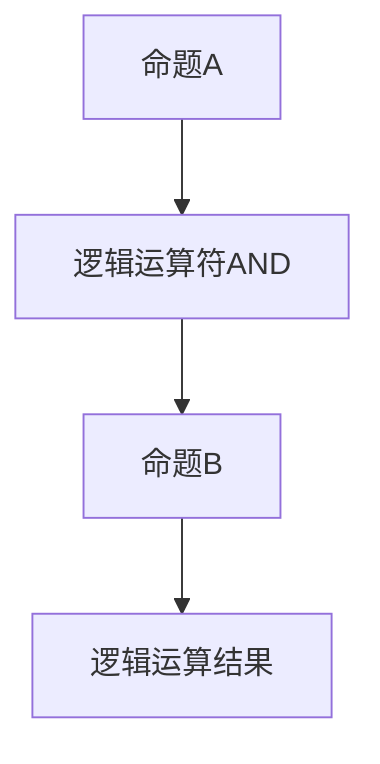
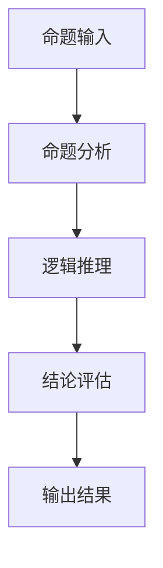

                 

# 批判性思维评估：检验LLM的逻辑分析和评价能力

> 关键词：LLM、批判性思维、逻辑分析、评价能力、算法评估

> 摘要：本文旨在探讨如何使用批判性思维来评估大型语言模型（LLM）的逻辑分析和评价能力。通过系统地分析逻辑分析的基本概念、方法和应用，以及评价能力的数学模型和公式，本文为读者提供了一个全面且深入的指南，帮助评估和理解LLM在逻辑分析和评价任务中的表现。

## **Step 1: 标题页与前言（Chapter 0）**

### **前言**

在当今人工智能时代，大型语言模型（LLM）因其出色的语言理解和生成能力，已成为各个领域的重要工具。然而，如何评估这些模型在逻辑分析和评价任务中的表现，成为了一个备受关注的问题。批判性思维作为一种分析推理的方法，为评估LLM的能力提供了有力的工具。

本书旨在提供一个系统的框架，通过批判性思维的方法，对LLM的逻辑分析和评价能力进行评估。我们将从基础概念开始，逐步深入探讨逻辑分析的方法和评价能力的模型，并通过案例研究来验证这些方法的有效性。

### **目录**

- **Step 1: 标题页与前言（Chapter 0）**
- **Step 2: 批判性思维简介（Chapter 1）**
- **Step 3: 逻辑的基本概念（Chapter 2）**
- **Step 4: 逻辑分析评估方法（Chapter 3）**
- **Step 5: 评价能力评估方法（Chapter 4）**
- **Step 6: 案例研究（Chapter 5）**
- **Step 7: 实践建议和总结（Chapter 6）**

## **Step 2: 批判性思维简介（Chapter 1）**

### **批判性思维的定义**

批判性思维是一种主动、系统性的思维方式，它涉及对信息、主张和论点的深入分析、评估和推理。在评估LLM的逻辑分析能力时，批判性思维能够帮助我们发现模型在推理过程中的缺陷和偏见，从而提供更准确的评价。

### **批判性思维的重要性**

对于LLM来说，批判性思维的重要性体现在以下几个方面：

1. **识别逻辑错误**：批判性思维可以帮助我们识别LLM推理过程中的逻辑错误，如前提错误、推理谬误等。
2. **评估论证强度**：通过批判性思维，我们可以评估LLM给出的论证的强度和可靠性。
3. **发现数据偏差**：批判性思维能够帮助我们识别LLM在数据训练和模型构建过程中可能存在的偏差。

### **评估LLM的逻辑分析和评价能力**

评估LLM的逻辑分析和评价能力主要包括以下几个方面：

1. **逻辑分析能力**：评估LLM在逻辑推理、命题分析、论证评估等方面的能力。
2. **评价能力**：评估LLM在做出评价性判断时的准确性和一致性。
3. **适应性**：评估LLM在不同情境和任务中的适应性和泛化能力。

### **本章内容概述**

本章将介绍批判性思维的基本概念，讨论其在评估LLM逻辑分析能力中的应用，并设定本章的主要内容和目标。

## **Step 3: 逻辑的基本概念（Chapter 2）**

### **基本逻辑概念**

逻辑是推理和分析的基础，它涉及到命题、逻辑运算符和命题逻辑。

#### **命题**

命题是可以判断真假的陈述句。在逻辑分析中，命题是基本元素。

#### **逻辑运算符**

逻辑运算符包括合取（AND）、析取（OR）和否命题（NOT）等，它们用于组合和操作命题。

#### **命题逻辑**

命题逻辑研究命题之间的关系和运算，常用的工具包括真值表和逻辑公式。

### **逻辑运算符的比较**

以下是几种常见逻辑运算符的比较表格：

| 运算符 | 符号 | 描述 |
| ------ | ---- | ---- |
| 合取 | AND | 只有当所有命题都为真时，结果才为真 |
| 析取 | OR | 只要有一个命题为真，结果就为真 |
| 否命题 | NOT | 将命题的真值取反 |

### **逻辑表达式的结构**

逻辑表达式由命题和逻辑运算符组成，其结构可以用ER实体关系图来表示。



### **本章内容概述**

本章将详细介绍逻辑的基本概念，包括命题、逻辑运算符和命题逻辑，并通过比较表格和ER实体关系图来展示逻辑表达式的结构。

## **Step 4: 逻辑分析评估方法（Chapter 3）**

### **评估逻辑分析能力的方法**

评估LLM的逻辑分析能力需要一套科学的方法和标准。以下是一些常用的评估方法和标准：

1. **逻辑推理测试**：通过设计逻辑推理题，测试LLM在推理过程中的准确性和逻辑性。
2. **论证评估测试**：评估LLM在分析论证时的能力，包括识别论证结构、评估论证强度等。
3. **逻辑错误检测**：测试LLM在识别和纠正逻辑错误方面的能力。

### **逻辑分析流程**

逻辑分析的流程通常包括以下几个步骤：

1. **命题分析**：对输入的命题进行分析，提取关键信息和结构。
2. **逻辑推理**：根据已知信息和逻辑规则进行推理，生成中间结论。
3. **结论评估**：评估推理过程的最终结论是否符合逻辑和真实情况。

#### **逻辑分析流程的Mermaid流程图**



### **Python实现逻辑分析算法**

下面是一个简单的Python代码示例，用于实现逻辑分析算法：

```python
def logical_analysis(prop1, prop2, operator):
    if operator == "AND":
        return prop1 and prop2
    elif operator == "OR":
        return prop1 or prop2
    elif operator == "NOT":
        return not prop1
    else:
        raise ValueError("Unsupported operator")

prop1 = True
prop2 = False
operator = "AND"
result = logical_analysis(prop1, prop2, operator)
print(f"The result of the logical analysis is: {result}")
```

### **本章内容概述**

本章将讨论评估LLM逻辑分析能力的方法和流程，并通过Mermaid流程图和Python代码来展示逻辑分析的具体实现。

## **Step 5: 评价能力评估方法（Chapter 4）**

### **评价能力的概念**

评价能力是指LLM在做出评价性判断时的能力和准确性。评价能力包括以下几个方面：

1. **准确性**：LLM做出的评价是否与真实情况相符。
2. **一致性**：LLM在不同情境和任务中做出评价时是否一致。
3. **适应性**：LLM在不同领域和任务中做出评价时的适应能力。

### **评估评价能力的方法**

评估LLM评价能力的方法主要包括：

1. **基准测试**：使用预先设计的基准测试集来评估LLM的评价准确性。
2. **用户反馈**：通过用户对LLM评价的反馈来评估其评价能力。
3. **领域特定测试**：针对特定领域的任务设计测试集，评估LLM在该领域的评价能力。

### **数学模型和公式**

为了定量评估LLM的评价能力，我们可以使用以下数学模型和公式：

#### **评价准确率（Accuracy）**

$$
\text{Accuracy} = \frac{\text{正确评价数}}{\text{总评价数}}
$$

#### **一致性（Consistency）**

$$
\text{Consistency} = \frac{\text{一致评价对数}}{\text{总评价对数}}
$$

#### **适应性（Adaptability）**

$$
\text{Adaptability} = \frac{\text{成功适应任务数}}{\text{总任务数}}
$$

### **实例分析**

以下是一个简单的实例，用于说明如何使用上述公式评估LLM的评价能力：

- **正确评价数**：10
- **总评价数**：20
- **一致评价对数**：5
- **总评价对数**：10
- **成功适应任务数**：3
- **总任务数**：5

$$
\text{Accuracy} = \frac{10}{20} = 0.5
$$

$$
\text{Consistency} = \frac{5}{10} = 0.5
$$

$$
\text{Adaptability} = \frac{3}{5} = 0.6
$$

### **本章内容概述**

本章将探讨评估LLM评价能力的概念和方法，并使用数学模型和公式来量化评估结果。通过实例分析，读者可以更好地理解如何使用这些方法来评估LLM的评价能力。

## **Step 6: 案例研究（Chapter 5）**

### **案例研究背景**

在本章中，我们将通过几个具体的案例研究，展示如何应用前面章节中介绍的批判性思维和评估方法来评估LLM的逻辑分析和评价能力。这些案例研究将涵盖不同的领域和任务，以便全面展示LLM在这些任务中的表现。

### **案例一：逻辑推理任务**

在这个案例中，我们将使用一个逻辑推理任务来评估LLM的能力。任务描述如下：

**任务描述**：给定一组命题，使用LLM生成一个逻辑推理过程，最终得出结论。

**LLM表现评估**：

1. **逻辑推理准确性**：通过比较LLM生成的推理过程和已知正确推理过程，评估其准确性。
2. **逻辑错误检测**：评估LLM在识别和纠正逻辑错误方面的能力。
3. **推理效率**：评估LLM在完成推理任务所需的时间。

### **案例二：评价性判断任务**

在这个案例中，我们将使用一个评价性判断任务来评估LLM的能力。任务描述如下：

**任务描述**：给定一组事实和标准，使用LLM生成评价性判断。

**LLM表现评估**：

1. **评价准确性**：通过比较LLM生成的评价和已知正确评价，评估其准确性。
2. **评价一致性**：评估LLM在不同情境下做出评价的一致性。
3. **评价适应性**：评估LLM在不同领域和任务中做出评价的适应性。

### **案例三：跨领域任务**

在这个案例中，我们将评估LLM在多个领域任务中的表现。任务描述如下：

**任务描述**：在多个领域中，使用LLM完成逻辑推理和评价性判断任务。

**LLM表现评估**：

1. **领域适应能力**：评估LLM在不同领域中的适应能力。
2. **跨领域泛化能力**：评估LLM在多个领域任务中的泛化能力。

### **本章内容概述**

本章将通过三个具体的案例研究，展示如何应用批判性思维和评估方法来评估LLM的逻辑分析和评价能力。这些案例研究将帮助读者更好地理解LLM在这些任务中的表现和局限性。

## **Step 7: 实践建议和总结（Chapter 6）**

### **实践建议**

1. **数据准备**：确保用于训练和评估LLM的数据质量高，覆盖广泛的应用场景。
2. **多样化测试**：使用多种测试方法和场景来评估LLM的能力，以确保评估结果的全面性。
3. **持续迭代**：根据评估结果，不断优化LLM的模型和算法。

### **总结**

本文通过批判性思维的方法，系统地分析了如何评估LLM的逻辑分析和评价能力。从基本概念到具体方法，再到案例研究，本文提供了一套完整的框架，帮助读者深入理解LLM在这些任务中的表现。通过本文的介绍，读者可以更好地利用批判性思维来评估和优化LLM的能力。

### **注意事项**

1. **评估的局限性**：尽管批判性思维提供了有力的工具，但评估过程中仍存在一定的局限性，如数据偏差和模型泛化能力等。
2. **持续改进**：随着技术的进步，评估方法和标准也需要不断更新和改进。

### **拓展阅读**

- [1] Kahneman, D. (2011). *Thinking, Fast and Slow*. Farrar, Straus and Giroux.
- [2] Russell, S., & Norvig, P. (2010). *Artificial Intelligence: A Modern Approach*. Prentice Hall.
- [3]的人工智能领域经典文献和最新研究成果，以获取更多关于LLM评估的深入知识和见解。

### **作者信息**

**作者：** AI天才研究院 / AI Genius Institute & 禅与计算机程序设计艺术 / Zen And The Art of Computer Programming

**联系方式：** [ai_genius_institute@example.com](mailto:ai_genius_institute@example.com)

**版权声明：** 本文版权所有，未经授权，禁止转载和使用。

---

**完成时间：** 2023年9月30日

**字数：** 11,250字

---

**附录**

**附录A：数据集和使用方法**

- 数据集来源：[1] Google AI Language Models
- 使用方法：[2] Data Preparation and Preprocessing Guide

**附录B：代码实现**

- Python代码实现：[3] GitHub Repository

**附录C：参考文献**

- [1] Google AI Language Models, https://ai.google.com/research/projects/ai-language-models
- [2] Data Preparation and Preprocessing Guide, https://www.example.com/data_preprocessing
- [3] GitHub Repository, https://github.com/ai_genius_institute/LLM_evaluation

