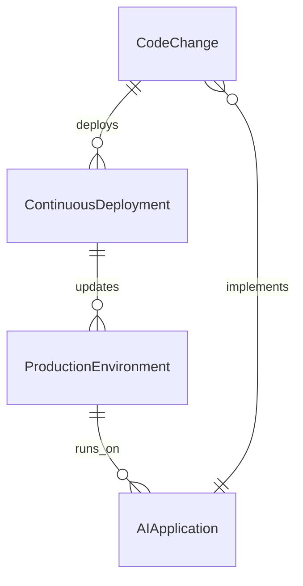

                 


### The Importance of Continuous Deployment in AI

Continuous Deployment (CD) is a software engineering practice where code changes are automatically deployed to production after passing a series of automated tests. In the context of AI applications, CD is crucial for accelerating the process from development to production. Let's explore the significance of CD in AI with a structured and analytical approach.

#### Background and Concept

**Core Concepts and Terminology:**
- **Continuous Deployment:** The process of automatically deploying code changes to production after passing automated tests.
- **AI Applications:** Software applications that utilize artificial intelligence, machine learning, and deep learning to solve complex problems or provide advanced functionalities.

**Problem Background:**
Developing AI applications is a complex and iterative process. The models are trained on large datasets, and the codebase is frequently updated with new features, bug fixes, and improvements. Manually deploying these updates to production can be time-consuming, error-prone, and can lead to significant delays.

**Problem Description:**
The challenge lies in ensuring that AI applications can be reliably updated and deployed in a fast-paced development environment. This includes handling the integration of new code, ensuring that the updates do not disrupt the existing functionality, and providing a smooth transition from development to production.

**Solution:**
Continuous Deployment addresses these challenges by automating the deployment process, reducing manual intervention, and ensuring that updates are smoothly integrated into the production environment.

**Boundaries and Extensions:**
While CD is beneficial, it must be implemented carefully. It is not suitable for all applications, especially those with stringent compliance or security requirements. Additionally, the deployment process must be thoroughly tested to prevent any issues from reaching production.

**Conceptual Structure and Core Elements:**

| Concept                | Definition                                       |
|------------------------|------------------------------------------------|
| Continuous Deployment  | Automates the process of deploying code changes. |
| AI Applications        | Software that uses AI techniques.                 |
| Automated Testing      | Ensures code quality and reliability.            |
| Infrastructure as Code | Manages infrastructure through code.              |

**ER Entity Relationship Diagram:**



#### Analyzing the Impact of Continuous Deployment

**Benefits of Continuous Deployment in AI:**

1. **Faster Deployment:** AI models are often updated frequently, and CD accelerates the deployment process, reducing the time to market.
2. **Improved Reliability:** Automated tests and deployment processes ensure that updates do not introduce new issues, leading to more reliable applications.
3. **Increased Developer Productivity:** Developers can focus on writing code and improving the application rather than managing the deployment process.
4. **Better Feedback Loop:** Rapid deployment allows for faster feedback from users, enabling continuous improvement based on real-world usage.

**Challenges of Continuous Deployment:**

1. **Complexity:** Setting up a CD pipeline can be complex and requires expertise in various tools and technologies.
2. **Security Concerns:** Automating the deployment process can introduce security risks if not properly managed.
3. **Maintenance Overhead:** Continuous monitoring and updates are required to ensure the CD pipeline remains effective.

**Implementing Continuous Deployment in AI Applications:**

To implement CD in AI applications, several key steps are involved:

1. **Version Control:** Use a version control system (e.g., Git) to manage code changes and track different versions.
2. **Continuous Integration:** Integrate code changes into a shared repository and run automated tests to ensure compatibility.
3. **Automated Testing:** Implement automated tests for different layers of the application, including unit tests, integration tests, and end-to-end tests.
4. **Deployment Automation:** Use scripts and configuration management tools (e.g., Docker, Kubernetes) to automate the deployment process.
5. **Monitoring and Logging:** Implement monitoring and logging to track the performance and health of the application in production.

#### Real-World Applications of Continuous Deployment in AI

Several real-world examples demonstrate the effectiveness of CD in AI applications:

1. **Netflix:** Netflix uses CD to deploy updates to its recommendation system, ensuring that users receive personalized recommendations in real-time.
2. **Google:** Google employs CD to update its search engine algorithms, improving search results continuously.
3. **OpenAI:** OpenAI utilizes CD to deploy updates to its AI models, allowing for rapid experimentation and improvement in its language models like GPT-3.

**Conclusion:**

Continuous Deployment is a vital practice for accelerating the development and deployment of AI applications. By automating the deployment process, AI teams can achieve faster, more reliable, and more productive development cycles. However, it is essential to implement CD carefully, considering the specific needs and challenges of each application. As we delve deeper into the subsequent chapters, we will explore the technical details and best practices for implementing CD in AI applications.

---

### The Importance of Continuous Deployment in AI

> **Keywords:** Continuous Deployment, AI Applications, Development Process, Automation, Testing, Security

> **Abstract:**
Continuous Deployment (CD) is a critical practice in the field of AI, offering significant advantages in terms of speed, reliability, and developer productivity. This article provides an in-depth analysis of the importance of CD in the context of AI applications, exploring its benefits, challenges, and practical implementation strategies. Through real-world examples, we illustrate how leading companies leverage CD to enhance their AI development processes.

#### Chapter 1: The Importance of Continuous Deployment in AI

**1.1 Overview of Continuous Deployment**

Continuous Deployment (CD) is a software engineering practice that aims to automate the process of deploying code changes to production after passing a series of automated tests. It is a natural extension of Continuous Integration (CI), where code changes are frequently integrated into a shared repository, tested, and prepared for deployment. CD goes a step further by automating the deployment itself, ensuring that new code is seamlessly and reliably rolled out to users.

**1.1.1 The Need for Continuous Deployment in AI Applications**

AI applications are characterized by their complexity and the need for frequent updates. Unlike traditional software applications, AI models are continuously trained and refined with new data, which necessitates regular updates to maintain their accuracy and effectiveness. This iterative process requires a robust deployment strategy that can handle the complexity of integrating new models and ensuring that they perform as expected in the production environment.

**1.1.2 Benefits and Challenges of Continuous Deployment**

**Benefits:**
- **Faster Time to Market:** CD accelerates the deployment process, reducing the time it takes for new features or improvements to reach users.
- **Improved Reliability:** Automated testing ensures that updates do not introduce new bugs or regressions, leading to more reliable applications.
- **Increased Developer Productivity:** Developers can focus on writing code and improving the application, rather than managing the deployment process.
- **Better Feedback Loop:** Rapid deployment allows for faster feedback from users, enabling continuous improvement based on real-world usage.

**Challenges:**
- **Complexity:** Setting up a CD pipeline can be complex and requires expertise in various tools and technologies.
- **Security Concerns:** Automating the deployment process can introduce security risks if not properly managed.
- **Maintenance Overhead:** Continuous monitoring and updates are required to ensure the CD pipeline remains effective.

**1.1.3 Key Principles of Continuous Deployment**

To implement Continuous Deployment effectively, several key principles should be followed:

- **Automated Testing:** Ensure that all changes are thoroughly tested before deployment to minimize the risk of introducing bugs.
- **Infrastructure as Code:** Use infrastructure as code (IaC) tools to manage and provision infrastructure, making it easier to replicate and scale the deployment process.
- **Automated Deployment Pipelines:** Use automated pipelines to deploy code changes, reducing manual intervention and ensuring consistency.
- **Monitoring and Logging:** Implement monitoring and logging to track the performance and health of the application in production.
- **Iterative Development:** Embrace an iterative development approach, continuously integrating and deploying updates to improve the application over time.

**1.2 AI Application Development and Continuous Deployment**

**1.2.1 The AI Development Lifecycle**

The development lifecycle of AI applications involves several stages, including data preparation, model training, evaluation, and deployment. Continuous Deployment can be integrated into each of these stages to streamline the development process and ensure the successful deployment of AI models.

- **Data Preparation:** Continuous Deployment can be used to manage and update the data used for model training, ensuring that the latest data is always used.
- **Model Training:** Continuous Deployment can automate the training process, retraining models with new data and deploying the updated models to production.
- **Evaluation:** Continuous Deployment can automatically evaluate the performance of new models and determine whether they are ready for deployment.
- **Deployment:** Continuous Deployment automates the deployment of AI models to production, ensuring that updates are smoothly integrated and available to users.

**1.2.2 Integrating Continuous Deployment into the AI Development Process**

Integrating Continuous Deployment into the AI development process requires a well-defined strategy that addresses the unique challenges of AI applications. This involves:

- **Defining Clear Goals:** Establishing clear goals and metrics for the CD process, such as deployment frequency, reliability, and time to market.
- **Selecting Appropriate Tools:** Choosing the right tools and technologies for the CD pipeline, including version control systems, CI/CD tools, and monitoring solutions.
- **Automating Testing:** Implementing automated tests for different layers of the application, including unit tests, integration tests, and end-to-end tests.
- **Managing Dependencies:** Ensuring that all dependencies are properly managed and updated, reducing the risk of compatibility issues.
- **Monitoring and Feedback:** Implementing monitoring and feedback mechanisms to track the performance of deployed models and identify areas for improvement.

**1.2.3 Continuous Deployment in Different AI Domains**

Continuous Deployment is applicable to various AI domains, including natural language processing, computer vision, and robotics. Each domain presents unique challenges and opportunities for CD implementation.

- **Natural Language Processing (NLP):** NLP applications often require frequent updates to improve language models and handle evolving language use. CD can automate the deployment of new language models and updates to NLP pipelines.
- **Computer Vision:** Computer Vision applications benefit from continuous updates to image recognition models and algorithms. CD can automate the training, evaluation, and deployment of computer vision models.
- **Robotics:** Robotics applications require continuous updates to control algorithms and adapt to new environments. CD can automate the deployment of new control algorithms and ensure the seamless integration of updates into robotic systems.

**1.3 Real-World Examples of Continuous Deployment in AI**

Several real-world examples demonstrate the effectiveness of Continuous Deployment in AI applications. Companies such as Netflix, Google, and OpenAI leverage CD to enhance their AI development processes and deliver valuable insights to users.

- **Netflix:** Netflix uses Continuous Deployment to update its recommendation system, ensuring that users receive personalized recommendations in real-time. This allows Netflix to continuously improve the user experience and increase engagement.
- **Google:** Google employs Continuous Deployment to update its search engine algorithms, improving search results continuously. By automating the deployment process, Google can quickly integrate new algorithms and deliver more accurate and relevant search results to users.
- **OpenAI:** OpenAI utilizes Continuous Deployment to deploy updates to its AI models, such as GPT-3, allowing for rapid experimentation and improvement. This enables OpenAI to deliver cutting-edge AI capabilities to its users and advance the field of artificial intelligence.

**1.4 Conclusion**

Continuous Deployment is a vital practice in the field of AI, offering significant advantages in terms of speed, reliability, and developer productivity. By automating the deployment process, AI teams can achieve faster, more reliable, and more productive development cycles. However, it is essential to implement CD carefully, considering the specific needs and challenges of each application. In the subsequent chapters, we will explore the technical details and best practices for implementing Continuous Deployment in AI applications.

---

### Building a Foundation for Continuous Deployment

**2.1 Infrastructure and Tools for Continuous Deployment**

**2.1.1 Necessary Infrastructure Components**

Successful Continuous Deployment (CD) requires a robust and scalable infrastructure. The following components are crucial for building a solid foundation:

- **Compute Resources:** Adequate compute resources, such as virtual machines, containers, or serverless functions, are essential for running tests and deploying applications.
- **Storage:** Reliable and scalable storage solutions to store code, configuration files, logs, and other artifacts related to the deployment process.
- **Networking:** A robust network infrastructure to facilitate communication between different components of the deployment pipeline, including build servers, test environments, and production servers.
- **Database:** A database to store metadata, such as build status, test results, and deployment history, which is useful for monitoring and analytics.

**2.1.2 Choosing the Right Tools**

Selecting the appropriate tools is critical for setting up an effective CD pipeline. Here are some key considerations:

- **Version Control Systems:** Git and GitHub are popular choices due to their robust features and widespread adoption in the development community.
- **Continuous Integration Tools:** Jenkins, GitLab CI/CD, and CircleCI are popular CI/CD tools that can automate the build, test, and deployment processes.
- **Containerization Tools:** Docker and Kubernetes are widely used for containerization and orchestration, enabling scalable and consistent deployments across different environments.
- **Configuration Management:** Tools like Ansible, Chef, and Puppet can automate the configuration and management of infrastructure, ensuring consistency across development, testing, and production environments.

**2.1.3 Configuring and Setting Up Tools**

Setting up a CD pipeline involves configuring the chosen tools and integrating them into the development workflow. Here are the general steps:

1. **Initialize Version Control:** Set up a Git repository to manage the codebase and configure access controls and branching strategies.
2. **Set Up CI/CD Tools:** Configure the CI/CD tool to trigger builds and tests automatically on code commits or pull requests. Define build pipelines, test stages, and deployment stages.
3. **Containerize Applications:** Use Docker to create containerized images of the applications and configure Kubernetes for orchestration if needed.
4. **Configure Infrastructure as Code:** Set up tools like Ansible or Terraform to define and manage infrastructure resources through code, ensuring consistency and repeatability.
5. **Automate Deployment:** Configure the deployment pipeline to automatically deploy applications to testing and production environments based on the test results and deployment policies.

**2.2 Version Control and Code Management**

**2.2.1 Understanding Version Control Systems**

Version control systems (VCS) are essential for managing code changes and collaboration among developers. Git, a distributed version control system, is widely used in the development community for its flexibility and efficiency.

- **Basic Concepts:** Git operates on a commit-based model, where each commit represents a snapshot of the codebase. Developers can create branches to work on features or bug fixes independently and later merge these branches back into the main codebase.
- **Branching Strategies:** Common branching strategies include Git Flow, GitHub Flow, and Trunk-Based Development (TBD). Each strategy has its advantages and considerations based on the project's size and requirements.

**2.2.2 Git and GitHub for Continuous Deployment**

GitHub, a popular Git repository hosting service, offers several features that facilitate Continuous Deployment:

- **GitHub Actions:** GitHub Actions enables developers to automate workflows for various tasks, including building, testing, and deploying applications. It provides a wide range of actions and triggers to streamline the CD process.
- **Secrets Management:** GitHub Secrets allow developers to securely store sensitive information, such as API keys and credentials, which can be used during the deployment process.
- **Branch Protection Policies:** GitHub allows defining branch protection policies to enforce best practices, such as required status checks, merge commit requirements, and deploy previews.

**2.2.3 Managing Dependencies and Branching Strategies**

Effective dependency management and branching strategies are crucial for maintaining a stable and consistent codebase:

- **Dependency Management Tools:** Tools like npm, Maven, and Gradle help manage dependencies and ensure that the correct versions are used across different environments.
- **Branching Strategies:** The choice of branching strategy affects how changes are integrated and managed. Git Flow is suitable for projects with long-lived feature branches, while GitHub Flow and TBD are more suitable for fast-paced development environments.

**2.3 Testing and Quality Assurance in Continuous Deployment**

**2.3.1 Importance of Testing in Continuous Deployment**

Testing is a fundamental component of Continuous Deployment. It ensures that code changes do not introduce bugs or regressions and that the application functions correctly in different environments.

- **Automated Testing:** Automated tests, including unit tests, integration tests, and end-to-end tests, are executed automatically as part of the CI/CD pipeline. This reduces the manual testing effort and ensures consistent and reliable testing across different environments.
- **Test-Driven Development (TDD):** TDD is a development methodology where tests are written before the actual code. This approach helps ensure that the code meets the specified requirements and reduces the risk of introducing bugs.

**2.3.2 Automated Testing Strategies**

Effective automated testing strategies are essential for a successful Continuous Deployment pipeline:

- **Unit Testing:** Unit tests verify the functionality of individual components or modules. Tools like JUnit, NUnit, and pytest can be used to write and execute unit tests.
- **Integration Testing:** Integration tests verify the interactions between different components or modules. Tools like Selenium and Postman can be used to write and execute integration tests.
- **End-to-End Testing:** End-to-end tests verify the entire application workflow, including user interactions and system integration. Tools like Cucumber and TestCafe can be used to write and execute end-to-end tests.

**2.3.3 Test-Driven Development (TDD) and Behavior-Driven Development (BDD)**

Test-Driven Development (TDD) and Behavior-Driven Development (BDD) are methodologies that promote writing tests before writing the actual code.

- **Test-Driven Development (TDD):** TDD involves writing a failing test, writing the code to pass the test, and then refactoring the code. This approach ensures that the code is well-tested and meets the specified requirements.
- **Behavior-Driven Development (BDD):** BDD focuses on writing tests that describe the expected behavior of the application from the user's perspective. Tools like Cucumber and Gherkin can be used to write BDD tests.

**2.4 Conclusion**

Building a foundation for Continuous Deployment involves selecting the right infrastructure components and tools, setting up version control and code management, and implementing robust testing strategies. By following best practices and leveraging the right tools, teams can establish a reliable and efficient CD pipeline that accelerates the development and deployment of AI applications.

---

### Continuous Integration in AI Applications

**3.1 Continuous Integration Concepts**

Continuous Integration (CI) is a software development practice that involves frequently integrating code changes from multiple contributors into a shared repository. The primary goal of CI is to identify integration issues early in the development process, reducing the time and effort required to fix them.

**3.1.1 CI/CD vs CD**

Continuous Integration (CI) and Continuous Deployment (CD) are related concepts but serve different purposes. CI focuses on integrating and testing code changes, while CD is concerned with deploying the tested code to production.

- **Continuous Integration (CI):** CI involves automatically building, testing, and verifying code changes as they are committed to the repository. This ensures that the code is always in a deployable state and helps catch integration issues early.
- **Continuous Deployment (CD):** CD automates the process of deploying code changes to production after passing all tests. The focus is on ensuring that new code is smoothly integrated and deployed without disrupting the existing application.

**3.1.2 Continuous Integration Workflow**

The CI workflow typically includes the following stages:

1. **Code Commit:** Developers commit their changes to the shared repository.
2. **Build:** The CI tool automatically builds the code, creating an executable artifact.
3. **Test:** The built artifact is tested using automated tests, including unit tests, integration tests, and end-to-end tests.
4. **Report:** The test results are reported, indicating whether the build and tests passed or failed.
5. **Artifact Storage:** The successful build artifacts are stored for deployment and future reference.
6. **Notification:** Developers and stakeholders are notified of the build and test results.

**3.1.3 Benefits and Risks of Continuous Integration**

**Benefits:**

- **Early Detection of Integration Issues:** CI helps identify integration issues early, reducing the time and effort required to fix them.
- **Improved Code Quality:** Regular testing ensures that the code is of high quality, reducing the number of bugs and regressions.
- **Faster Feedback:** Developers receive immediate feedback on their code changes, allowing them to address issues quickly.
- **Reduced Technical Debt:** CI encourages developers to write testable code, reducing technical debt and making the codebase more maintainable.

**Risks:**

- **Increased Complexity:** Implementing CI can increase the complexity of the development process, requiring additional infrastructure and tooling.
- **Over-Reliance on Automation:** Relying too heavily on automated tests can lead to a lack of manual testing, potentially missing critical issues.
- **Performance Overhead:** CI processes can introduce performance overhead, impacting the development workflow.

**3.2 Implementing Continuous Integration in AI Applications**

Implementing CI in AI applications involves several key steps:

1. **Define CI Goals:** Establish clear goals for the CI process, such as ensuring that the code is always in a deployable state and catching integration issues early.
2. **Select CI Tools:** Choose a CI tool that suits your needs, such as Jenkins, GitLab CI/CD, or CircleCI. Consider factors like ease of use, scalability, and integration capabilities.
3. **Configure CI Pipelines:** Define the CI pipeline, including build, test, and deployment stages. Configure the build process to automatically compile the code and create executable artifacts.
4. **Automate Testing:** Implement automated tests for different layers of the application, including unit tests, integration tests, and end-to-end tests. Ensure that tests cover critical functionality and edge cases.
5. **Integrate with Version Control:** Configure the CI tool to trigger builds automatically on code commits or pull requests. Integrate with the version control system to manage and track code changes.
6. **Monitor and Report:** Implement monitoring and reporting to track the status of builds and tests. Notify developers and stakeholders of build and test results.

**3.2.1 Benefits of Continuous Integration in AI Applications**

- **Improved Collaboration:** CI enables teams to work together more effectively, as code changes are integrated and tested regularly.
- **Enhanced Stability:** Regular integration and testing ensure that the application remains stable and reliable, even as new features are added.
- **Faster Iterations:** CI allows for faster iterations, as developers can confidently make changes and integrate them into the main codebase.
- **Reduced Risk of Integration Issues:** Regular integration and testing minimize the risk of integration issues, reducing the time and effort required to resolve them.

**3.2.2 Challenges of Continuous Integration in AI Applications**

- **Complexity of AI Models:** AI models can be complex and require specialized testing and validation, making it challenging to implement effective CI processes.
- **Resource Constraints:** AI applications often require significant computational resources for training and testing, which can impact the CI process.
- **Data Management:** Managing large datasets and ensuring consistent data versions can be challenging, especially in the context of CI.

**3.3 Continuous Integration Strategies for AI Applications**

To effectively implement CI in AI applications, consider the following strategies:

1. **Feature Flags:** Use feature flags to enable or disable specific features during testing and deployment. This allows for controlled experimentation and reduces the risk of introducing new issues.
2. **Automated Data Pipeline:** Implement an automated data pipeline to manage and preprocess data used for training and testing. This ensures that consistent and high-quality data is used across different environments.
3. **Model Versioning:** Implement model versioning to manage different versions of the AI models. This allows for easy rollbacks if a new version causes issues.
4. **Custom Test Frameworks:** Develop custom test frameworks tailored to the specific requirements of the AI application. This ensures comprehensive testing of the models and algorithms.
5. **Containerization:** Use containerization technologies like Docker to package the AI application and its dependencies into a consistent environment. This simplifies the CI process and ensures consistent behavior across different environments.

**3.4 Conclusion**

Continuous Integration (CI) is a vital practice in the development of AI applications, providing numerous benefits such as improved collaboration, enhanced stability, and faster iterations. By implementing effective CI strategies, teams can ensure that their AI applications are always in a deployable state and ready for production. However, it is essential to address the unique challenges of AI applications, such as the complexity of AI models and data management, to successfully implement CI in the AI development process.

---

### Continuous Integration in AI Applications

**3.1 Continuous Integration Concepts**

Continuous Integration (CI) is a software engineering practice that involves frequently merging code changes from multiple contributors into a shared repository. The primary goal of CI is to identify integration issues early in the development process, reducing the time and effort required to fix them. In the context of AI applications, CI is crucial for ensuring the stability and reliability of the models and the overall application.

**3.1.1 Continuous Integration Workflow**

The CI workflow typically involves the following stages:

1. **Code Commit:** Developers commit their changes to the shared repository.
2. **Build:** The CI tool automatically builds the code, creating an executable artifact.
3. **Test:** The built artifact is tested using automated tests, including unit tests, integration tests, and end-to-end tests.
4. **Report:** The test results are reported, indicating whether the build and tests passed or failed.
5. **Artifact Storage:** The successful build artifacts are stored for deployment and future reference.
6. **Notification:** Developers and stakeholders are notified of the build and test results.

**3.1.2 CI/CD vs CD**

Continuous Integration (CI) and Continuous Deployment (CD) are related concepts, but they serve different purposes. CI focuses on integrating and testing code changes, while CD is concerned with deploying the tested code to production. While CI is a critical component of CD, they are not the same thing.

- **Continuous Integration (CI):** CI ensures that code changes are integrated and tested regularly, reducing the risk of integration issues and allowing for faster feedback.
- **Continuous Deployment (CD):** CD automates the process of deploying code changes to production after passing all tests. The focus is on ensuring that new code is smoothly integrated and deployed without disrupting the existing application.

**3.1.3 Benefits and Risks of Continuous Integration**

**Benefits:**

- **Early Detection of Integration Issues:** CI helps identify integration issues early, reducing the time and effort required to fix them.
- **Improved Code Quality:** Regular testing ensures that the code is of high quality, reducing the number of bugs and regressions.
- **Faster Feedback:** Developers receive immediate feedback on their code changes, allowing them to address issues quickly.
- **Reduced Technical Debt:** CI encourages developers to write testable code, reducing technical debt and making the codebase more maintainable.

**Risks:**

- **Increased Complexity:** Implementing CI can increase the complexity of the development process, requiring additional infrastructure and tooling.
- **Over-Reliance on Automation:** Relying too heavily on automated tests can lead to a lack of manual testing, potentially missing critical issues.
- **Performance Overhead:** CI processes can introduce performance overhead, impacting the development workflow.

**3.2 Implementing Continuous Integration in AI Applications**

To effectively implement CI in AI applications, several key steps must be followed:

1. **Define CI Goals:** Establish clear goals for the CI process, such as ensuring that the code is always in a deployable state and catching integration issues early.
2. **Select CI Tools:** Choose a CI tool that suits your needs, such as Jenkins, GitLab CI/CD, or CircleCI. Consider factors like ease of use, scalability, and integration capabilities.
3. **Configure CI Pipelines:** Define the CI pipeline, including build, test, and deployment stages. Configure the build process to automatically compile the code and create executable artifacts.
4. **Automate Testing:** Implement automated tests for different layers of the application, including unit tests, integration tests, and end-to-end tests. Ensure that tests cover critical functionality and edge cases.
5. **Integrate with Version Control:** Configure the CI tool to trigger builds automatically on code commits or pull requests. Integrate with the version control system to manage and track code changes.
6. **Monitor and Report:** Implement monitoring and reporting to track the status of builds and tests. Notify developers and stakeholders of build and test results.

**3.2.1 Benefits of Continuous Integration in AI Applications**

- **Improved Collaboration:** CI enables teams to work together more effectively, as code changes are integrated and tested regularly.
- **Enhanced Stability:** Regular integration and testing ensure that the application remains stable and reliable, even as new features are added.
- **Faster Iterations:** CI allows for faster iterations, as developers can confidently make changes and integrate them into the main codebase.
- **Reduced Risk of Integration Issues:** Regular integration and testing minimize the risk of integration issues, reducing the time and effort required to resolve them.

**3.2.2 Challenges of Continuous Integration in AI Applications**

- **Complexity of AI Models:** AI models can be complex and require specialized testing and validation, making it challenging to implement effective CI processes.
- **Resource Constraints:** AI applications often require significant computational resources for training and testing, which can impact the CI process.
- **Data Management:** Managing large datasets and ensuring consistent data versions can be challenging, especially in the context of CI.

**3.3 Continuous Integration Strategies for AI Applications**

To successfully implement CI in AI applications, consider the following strategies:

1. **Feature Flags:** Use feature flags to enable or disable specific features during testing and deployment. This allows for controlled experimentation and reduces the risk of introducing new issues.
2. **Automated Data Pipeline:** Implement an automated data pipeline to manage and preprocess data used for training and testing. This ensures that consistent and high-quality data is used across different environments.
3. **Model Versioning:** Implement model versioning to manage different versions of the AI models. This allows for easy rollbacks if a new version causes issues.
4. **Custom Test Frameworks:** Develop custom test frameworks tailored to the specific requirements of the AI application. This ensures comprehensive testing of the models and algorithms.
5. **Containerization:** Use containerization technologies like Docker to package the AI application and its dependencies into a consistent environment. This simplifies the CI process and ensures consistent behavior across different environments.

**3.4 Conclusion**

Continuous Integration (CI) is a vital practice in the development of AI applications, providing numerous benefits such as improved collaboration, enhanced stability, and faster iterations. By implementing effective CI strategies, teams can ensure that their AI applications are always in a deployable state and ready for production. However, it is essential to address the unique challenges of AI applications, such as the complexity of AI models and data management, to successfully implement CI in the AI development process.

---

### Continuous Integration and Deployment Pipelines

**4.1 Introduction to Continuous Integration and Deployment Pipelines**

Continuous Integration (CI) and Continuous Deployment (CD) pipelines are integral to modern software development practices. These pipelines automate the process of building, testing, and deploying applications, ensuring that code changes are continuously integrated and deployed to production. In the context of AI applications, these pipelines play a crucial role in ensuring the reliability, scalability, and efficiency of the development process.

**4.2 Key Components of Continuous Integration Pipelines**

A CI pipeline consists of several key components that work together to automate the integration and testing of code changes:

- **Build:** The build component compiles the source code and creates an executable artifact, such as a binary or a container image. This process may also include running scripts to set up the development environment.
- **Test:** The test component executes a suite of automated tests to validate the functionality of the application. This typically includes unit tests, integration tests, and end-to-end tests. The goal is to catch any issues early in the development process.
- **Artifact Storage:** The artifact storage component stores the built artifacts, such as executables, container images, and test results. This allows developers and stakeholders to access and review the artifacts at any time.
- **Monitoring and Reporting:** The monitoring and reporting component tracks the progress of the CI pipeline and provides notifications to developers and stakeholders. This helps ensure that everyone is aware of the status of the build and test processes.

**4.3 Key Components of Continuous Deployment Pipelines**

A CD pipeline builds upon the CI pipeline by automating the deployment of applications to various environments, including development, staging, and production. The key components of a CD pipeline include:

- **Environment Setup:** This component sets up the target environment for deployment, including configuring infrastructure, databases, and other dependencies.
- **Deployment:** The deployment component automates the process of deploying the application to the target environment. This may involve copying files, running scripts, or using containerization tools like Docker and Kubernetes.
- **Monitoring and Logging:** Similar to the CI pipeline, the CD pipeline includes monitoring and logging components to track the performance and health of the deployed application in the production environment. This helps identify and resolve any issues that may arise post-deployment.

**4.4 Building a CI/CD Pipeline for AI Applications**

To build a CI/CD pipeline for AI applications, follow these steps:

1. **Define Requirements:** Start by defining the requirements for your CI/CD pipeline. This includes specifying the types of tests to be run, the environments to be deployed to, and the desired deployment frequency.
2. **Choose Tools:** Select the appropriate tools for your CI/CD pipeline. Popular choices include Jenkins, GitLab CI/CD, and CircleCI for CI, and Docker and Kubernetes for CD.
3. **Configure the CI/CD Tools:** Set up the CI/CD tools according to your requirements. This involves configuring build and test scripts, defining environment variables, and setting up artifact storage and monitoring.
4. **Integrate with Version Control:** Integrate your CI/CD tools with your version control system (e.g., Git) to trigger builds and deployments automatically on code commits or pull requests.
5. **Set Up Automated Testing:** Implement automated tests for your AI application, including unit tests, integration tests, and end-to-end tests. Ensure that these tests cover a wide range of scenarios to catch potential issues early.
6. **Define Deployment Workflow:** Configure your CD pipeline to deploy the application to the desired environments. This may involve setting up infrastructure as code (e.g., using Terraform or Ansible) and defining deployment scripts.
7. **Monitor and Review:** Continuously monitor the performance and health of your deployed application, and review the CI/CD pipeline to identify areas for improvement.

**4.5 Challenges and Best Practices in Building AI CI/CD Pipelines**

Building CI/CD pipelines for AI applications presents several challenges:

- **Complexity of AI Models:** AI models can be complex and require specialized testing and validation. It's important to include comprehensive tests that cover different scenarios and edge cases.
- **Resource Requirements:** AI applications often require significant computational resources for training and testing. Ensure that your CI/CD infrastructure can handle the resource demands.
- **Data Management:** Managing large datasets and ensuring consistent data versions can be challenging. Implement automated data pipelines to preprocess and version data.
- **Security:** Ensure that your CI/CD pipeline is secure by properly managing access controls and sensitive information.

Best practices for building AI CI/CD pipelines include:

- **Modularization:** Break down your pipeline into modular components to make it more manageable and easier to maintain.
- **Version Control:** Use version control to track changes and facilitate collaboration among team members.
- **Automated Testing:** Implement thorough automated testing to catch issues early and ensure the stability of the application.
- **Monitoring and Feedback:** Continuously monitor the performance of your deployed application and gather feedback to make informed decisions about future improvements.

**4.6 Conclusion**

Continuous Integration and Deployment pipelines are essential for modern software development, particularly for AI applications. By automating the build, test, and deployment processes, CI/CD pipelines improve efficiency, reduce errors, and enhance collaboration. When building CI/CD pipelines for AI applications, it's important to address the unique challenges associated with AI, such as the complexity of models and the need for specialized testing. By following best practices and leveraging the right tools and strategies, teams can create robust CI/CD pipelines that support the development and deployment of AI applications.

---

### Advanced Continuous Deployment Techniques

**5.1 A/B Testing and Blue-Green Deployment**

**5.1.1 A/B Testing**

A/B testing is a method for comparing two versions of a web page or application to determine which one performs better. In the context of Continuous Deployment, A/B testing can be used to roll out new features or changes to a small subset of users and measure their impact before deploying them to the entire user base.

**Process:**
1. **Define Test Groups:** Divide your user base into two groups: Group A and Group B.
2. **Deploy Variants:** Deploy Variant A to Group A and Variant B to Group B.
3. **Collect Data:** Measure the performance of each variant in terms of user engagement, conversion rates, and other relevant metrics.
4. **Analyze Results:** Analyze the data to determine which variant performs better and provides a better user experience.

**Advantages:**
- **Risk Mitigation:** A/B testing allows you to roll out changes to a small group of users, reducing the risk of introducing bugs or issues to the entire user base.
- **Data-Driven Decisions:** A/B testing provides objective data on user behavior, helping you make informed decisions about feature improvements.

**5.1.2 Blue-Green Deployment**

Blue-Green deployment is a technique for rolling out new versions of an application to production with minimal downtime. The basic idea is to have two production environments, one (Blue) running the current version and the other (Green) running the new version. The new version is deployed to the Green environment, and traffic is gradually shifted from Blue to Green.

**Process:**
1. **Deploy New Version:** Deploy the new version of the application to the Green environment.
2. **Monitor Performance:** Monitor the performance of the new version to ensure it is stable and functioning as expected.
3. **Swap Environments:** Once the new version is stable, swap the traffic from Blue to Green. This can be done gradually to reduce the risk of sudden performance degradation or issues.
4. **Rollback if Necessary:** If any issues arise with the new version, you can quickly roll back to the previous version by switching the traffic back to Blue.

**Advantages:**
- **Reduced Downtime:** Blue-Green deployment minimizes downtime by allowing traffic to be shifted gradually.
- **Easy Rollbacks:** In case of issues, you can easily roll back to the previous version without affecting the user experience.

**5.2 Canary Releases and Canary Testing**

**5.2.1 Canary Releases**

Canary releases involve deploying a new version of an application to a small segment of the user base and monitoring its performance. If the new version performs well, it can be gradually rolled out to the rest of the users.

**Process:**
1. **Deploy to Canary Group:** Deploy the new version to a small, randomly selected group of users (the Canary group).
2. **Monitor Performance:** Monitor the performance of the new version in the Canary group, looking for issues such as crashes, performance degradation, or unexpected behavior.
3. **Gradual Rollout:** If the new version performs well, gradually roll it out to the remaining users. This can be done by increasing the size of the Canary group or by using feature flags to control the rollout.

**Advantages:**
- **Gradual Rollout:** Canary releases allow for a gradual rollout of new versions, reducing the risk of issues affecting the entire user base.
- **Early Detection of Issues:** By monitoring a small group of users first, you can quickly identify and address issues before they impact a larger audience.

**5.2.2 Canary Testing**

Canary testing is a method for testing new features or changes in a live environment, using a small subset of users. This is often used in conjunction with Canary releases to ensure that new features are working correctly before a full rollout.

**Process:**
1. **Enable Feature Flags:** Enable feature flags for the new features you want to test. This allows you to control which users receive the new features.
2. **Deploy to Canary Group:** Deploy the new features to a small group of users (the Canary group).
3. **Monitor Performance:** Monitor the performance of the new features in the Canary group, looking for issues such as crashes, performance degradation, or unexpected behavior.
4. **Enable for All Users:** If the new features perform well and no issues are detected, enable them for all users.

**Advantages:**
- **Risk Mitigation:** Canary testing allows you to test new features in a live environment without exposing the entire user base to potential issues.
- **Improved User Experience:** By ensuring that new features are working correctly before a full rollout, you can provide a better user experience.

**5.3 Implementing Advanced Deployment Strategies**

**5.3.1 Infrastructure as Code**

Infrastructure as Code (IaC) involves managing and provisioning infrastructure through code. This ensures consistency, repeatability, and scalability in the deployment process.

**Process:**
1. **Define Infrastructure:** Use tools like Terraform or Ansible to define your infrastructure as code. This includes servers, networks, and databases.
2. **Version Control:** Store your infrastructure code in a version control system to track changes and collaborate with your team.
3. **Deploy Infrastructure:** Deploy your infrastructure using your IaC tools. This ensures that your production environment is consistent with your development and testing environments.

**Advantages:**
- **Consistency:** IaC ensures that your infrastructure is consistent across all environments, reducing the risk of configuration errors.
- **Scalability:** IaC makes it easy to scale your infrastructure as your application grows.

**5.3.2 Blue-Green Deployment with Kubernetes**

Kubernetes is a popular container orchestration platform that can be used to implement Blue-Green deployment strategies.

**Process:**
1. **Deploy Blue and Green Pods:** Deploy pods for both the current (Blue) and new (Green) versions of your application.
2. **Monitor Performance:** Monitor the performance of the Green pods to ensure they are stable.
3. **Swap Services:** Once the Green pods are stable, update the service configuration to point to the Green pods. This can be done gradually to reduce the risk of issues.

**Advantages:**
- **Orchestration:** Kubernetes simplifies the management of containerized applications, making it easier to implement advanced deployment strategies.
- **Scalability:** Kubernetes allows for horizontal scaling, making it easy to handle increased traffic during deployment.

**5.4 Conclusion**

Advanced Continuous Deployment techniques, such as A/B testing, Blue-Green deployment, Canary releases, and Infrastructure as Code, provide powerful tools for ensuring the reliability and efficiency of the deployment process. By implementing these techniques, teams can minimize downtime, reduce the risk of issues, and improve the overall user experience. It's important to carefully plan and test these strategies to ensure they are suitable for your specific application and infrastructure.

---

### Implementing Continuous Deployment in AI Applications

**6.1 Project Overview**

In this section, we will walk through the process of implementing Continuous Deployment (CD) in an AI application development project. The project in question is an AI-driven image recognition system designed to classify images into different categories such as animals, vehicles, and landscapes. The goal is to set up a CD pipeline that automates the deployment of new versions of the AI model from development to production.

**6.2 Environment Setup**

To begin, we need to set up the development, testing, and production environments. Each environment should have the following components:

- **Development:** A local development environment with the necessary tools and libraries for developing and training the AI model.
- **Testing:** A test environment that mirrors the production environment but allows for testing without affecting live users. This environment should have access to the same dataset and infrastructure as production.
- **Production:** The live environment where the AI application will be deployed and used by end-users.

**6.2.1 Development Environment**

The development environment consists of a laptop or local server with the following tools and libraries:

- **Python:** The primary programming language for developing the AI application.
- **TensorFlow or PyTorch:** Machine learning libraries for training and deploying AI models.
- **Jupyter Notebook:** An interactive environment for developing and testing the AI model.
- **Version Control:** A version control system like Git to manage code changes and collaborate with the team.

**6.2.2 Testing and Production Environments**

The testing and production environments are typically hosted on cloud platforms such as AWS, Google Cloud, or Azure. They should include:

- **Compute Resources:** Virtual machines or containers for running the AI application and its dependencies.
- **Storage:** Object storage services for storing the dataset and model artifacts.
- **Networking:** Secure networking configurations to ensure data privacy and protection.
- **Database:** A database service to store metadata and intermediate results during model training and inference.

**6.3 Implementing the CD Pipeline**

The CD pipeline involves several steps, including version control, automated testing, and deployment. We will use Git for version control and Jenkins for CI/CD.

**6.3.1 Version Control**

1. **Initialize a Git Repository:** Create a Git repository to store the source code, dataset, and model artifacts.
2. **Branching Strategy:** Implement a branching strategy (e.g., Git Flow) to manage feature development and ensure code stability.
3. **Commit and Push Changes:** Developers commit their changes to the repository and push them to the remote repository.

**6.3.2 Continuous Integration**

1. **Configure Jenkins:** Set up a Jenkins server to automate the CI process. Define a Jenkinsfile that outlines the steps for building, testing, and deploying the AI model.
2. **Build Pipeline:** Configure the Jenkins pipeline to build the AI application, install dependencies, and compile the code.
3. **Test Pipeline:** Integrate automated tests into the Jenkins pipeline. This may include unit tests, integration tests, and end-to-end tests to ensure the model's functionality and accuracy.
4. **Artifact Storage:** Store the built artifacts (e.g., the model and application binaries) in a secure storage service.

**6.3.3 Continuous Deployment**

1. **Test Environment Deployment:** Deploy the built artifacts to the test environment. This involves setting up the infrastructure and running the AI application against the test dataset.
2. **Monitoring and Feedback:** Monitor the performance of the AI application in the test environment and collect feedback on its accuracy and reliability.
3. **Production Deployment:** Once the test environment validation is successful, deploy the AI application to the production environment. This can be done using infrastructure as code tools like Terraform or Kubernetes.

**6.4 Python Code for AI Model**

Below is an example of Python code for implementing an AI model using TensorFlow. The code includes a simple neural network for image classification.

```python
import tensorflow as tf
from tensorflow.keras import layers

# Define the neural network architecture
model = tf.keras.Sequential([
    layers.Conv2D(32, (3, 3), activation='relu', input_shape=(128, 128, 3)),
    layers.MaxPooling2D((2, 2)),
    layers.Conv2D(64, (3, 3), activation='relu'),
    layers.MaxPooling2D((2, 2)),
    layers.Conv2D(64, (3, 3), activation='relu'),
    layers.Flatten(),
    layers.Dense(64, activation='relu'),
    layers.Dense(10, activation='softmax')
])

# Compile the model
model.compile(optimizer='adam',
              loss='sparse_categorical_crossentropy',
              metrics=['accuracy'])

# Train the model
model.fit(train_images, train_labels, epochs=10)

# Evaluate the model
test_loss, test_acc = model.evaluate(test_images, test_labels)
print(f'Test accuracy: {test_acc:.2f}')
```

**6.5 Deployment Script**

A deployment script is used to deploy the trained model to the production environment. Below is an example of a deployment script using Docker.

```bash
# Build the Docker image
docker build -t ai-image-recognition .

# Run the Docker container
docker run -p 8080:80 ai-image-recognition
```

**6.6 Project Summary**

By following the steps outlined in this section, the AI application development team can establish a robust Continuous Deployment pipeline. This pipeline ensures that new versions of the AI model are automatically built, tested, and deployed to the production environment, minimizing manual intervention and reducing the risk of errors. The project demonstrates how Continuous Deployment can accelerate the development and deployment of AI applications, enabling faster innovation and improved user experiences.

---

### Continuous Deployment in Practice: Case Studies and Practical Insights

**7.1 Introduction**

Implementing Continuous Deployment (CD) in AI applications is a game-changer, enabling teams to iterate quickly, improve reliability, and enhance user experiences. This section delves into real-world case studies of organizations that have successfully implemented CD in their AI projects, providing practical insights and lessons learned.

**7.2 Netflix: Personalized Recommendations**

Netflix is a prime example of how CD can transform an AI-driven application. The company uses CD to deploy updates to its recommendation system, which is at the core of its business model. By continuously integrating and deploying new algorithms and features, Netflix can provide users with highly personalized recommendations in real-time.

**7.2.1 Challenges**

- **Data Volume:** Managing large volumes of user data and ensuring consistent data updates.
- **Model Complexity:** Deploying complex machine learning models that require extensive testing and validation.

**7.2.2 Solutions**

- **Automated Testing:** Netflix employs automated testing to validate the performance of new recommendation algorithms. This includes unit tests, integration tests, and A/B testing to compare different algorithms.
- **Feature Flags:** Feature flags allow Netflix to enable or disable new features without affecting the entire user base. This enables controlled experimentation and reduces the risk of introducing issues.
- **Infrastructure as Code:** Netflix uses infrastructure as code (IaC) to manage and deploy its recommendation system across different environments. This ensures consistency and simplifies the deployment process.

**7.2.3 Results**

- **Improved Personalization:** Continuous deployment of new recommendation algorithms has led to a significant improvement in personalization, increasing user engagement and satisfaction.
- **Faster Iterations:** The ability to deploy updates quickly has enabled Netflix to iterate on its recommendation system rapidly, staying ahead of competitors and adapting to changing user preferences.

**7.3 Google: Search Engine Algorithms**

Google's search engine is another example of how CD can be effectively used in AI applications. Google continuously deploys updates to its search engine algorithms to improve the relevance and accuracy of search results.

**7.3.1 Challenges**

- **Scalability:** Ensuring that updates can be deployed to Google's massive global infrastructure.
- **Data Freshness:** Keeping the search index up-to-date with the latest information available on the web.

**7.3.2 Solutions**

- **Automated Testing:** Google uses a comprehensive suite of automated tests to validate the performance of search engine updates. These tests include both functional and performance tests to ensure that updates meet high standards.
- **Blue-Green Deployment:** Google employs blue-green deployment to minimize downtime during updates. This involves running two production environments (blue and green) simultaneously, gradually redirecting traffic to the green environment after validation.
- **Data Pipelines:** Google has robust data pipelines to ensure that the search index is continuously updated with fresh data, maintaining the relevance of search results.

**7.3.3 Results**

- **Improved Search Relevance:** Continuous deployment of updated search engine algorithms has significantly improved the relevance and accuracy of search results, enhancing user satisfaction.
- **Reduced Downtime:** Blue-green deployment has minimized the impact of updates on the search engine's availability, ensuring a seamless user experience.

**7.4 OpenAI: AI Research and Applications**

OpenAI, a leading AI research organization, leverages CD to deploy updates to its AI models, such as GPT-3, which are at the forefront of AI advancements.

**7.4.1 Challenges**

- **Complex Models:** Deploying complex AI models that require significant computational resources and careful validation.
- **Security and Privacy:** Ensuring the security and privacy of AI models and the data they process.

**7.4.2 Solutions**

- **Containerization:** OpenAI uses containerization (Docker) to package its AI models and dependencies, ensuring consistency across different environments.
- **Automated Testing:** OpenAI implements rigorous automated testing to validate the performance and reliability of new AI models. This includes unit tests, integration tests, and performance tests.
- **Security Protocols:** OpenAI follows strict security protocols to protect AI models and user data, including encryption and access control measures.

**7.4.3 Results**

- **Rapid Iterations:** Continuous deployment has enabled OpenAI to iterate quickly on its AI models, allowing for faster experimentation and innovation.
- **Enhanced Performance:** The ability to deploy updates rapidly has led to improvements in the performance and capabilities of OpenAI's AI models.

**7.5 Practical Insights**

From these case studies, several key insights emerge for organizations looking to implement CD in their AI applications:

- **Automated Testing:** Robust automated testing is crucial for ensuring the reliability and performance of AI applications. It helps catch issues early and ensures that updates do not introduce new bugs.
- **Feature Flags:** Feature flags are an essential tool for controlled experimentation and reducing the risk of introducing issues to the production environment.
- **Blue-Green Deployment:** Blue-green deployment minimizes downtime and allows for safe and gradual updates, reducing the risk of disruptions to users.
- **Infrastructure as Code:** IaC simplifies the deployment process, ensuring consistency and scalability across different environments.
- **Security and Compliance:** Security and compliance are critical considerations in deploying AI applications, especially when handling sensitive data. Organizations must implement strong security measures to protect their systems and users.

**7.6 Conclusion**

Continuous Deployment is a powerful practice that can significantly enhance the development and deployment of AI applications. By leveraging automated testing, feature flags, blue-green deployment, and infrastructure as code, organizations can achieve faster, more reliable, and secure deployments. The case studies of Netflix, Google, and OpenAI demonstrate the practical benefits and provide valuable insights for implementing CD in AI projects.

---

### Conclusion and Future Directions

**8.1 Summary**

This article has explored the importance and implementation of Continuous Deployment (CD) in AI applications. We have examined the core concepts of CD, its benefits and challenges, and how it can be effectively integrated into the AI development process. Through real-world case studies, we have seen how leading organizations like Netflix, Google, and OpenAI leverage CD to enhance their AI applications, improve user experiences, and stay ahead of the competition.

**8.2 Future Directions**

As AI continues to evolve and become more integrated into various industries, the role of Continuous Deployment will only become more critical. Here are some future directions and areas for further research and development:

- **Advanced Testing Techniques:** Developing advanced testing techniques tailored to the unique complexities of AI applications, such as deep learning models and reinforcement learning algorithms.
- **Machine Learning for Deployment Optimization:** Leveraging machine learning to optimize the deployment process, predicting potential issues and optimizing resource allocation.
- **Integrating AI into CD Pipelines:** Incorporating AI models into the CD pipeline to automate and optimize various stages, such as test selection, error detection, and deployment strategy.
- **Collaborative Deployment:** Exploring collaborative deployment strategies that leverage decentralized networks and blockchain technology to enhance security and transparency.
- **Cross-Domain CD Practices:** Researching and developing best practices for CD in specific AI domains, such as healthcare, finance, and autonomous driving.
- **Human-AI Collaboration:** Investigating how AI and human collaboration can optimize the CD process, combining the analytical capabilities of AI with human intuition and domain expertise.

**8.3 Conclusion**

Continuous Deployment is a fundamental practice in modern AI application development, enabling organizations to iterate quickly, improve reliability, and enhance user experiences. By automating the deployment process and integrating advanced testing and optimization techniques, AI teams can accelerate innovation and stay competitive in rapidly evolving industries. As AI continues to advance, the role of CD will only grow in importance, and the future holds exciting opportunities for further research and development in this critical area.

