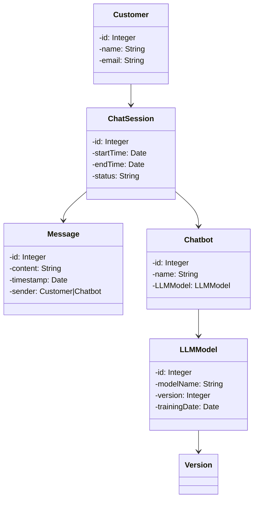
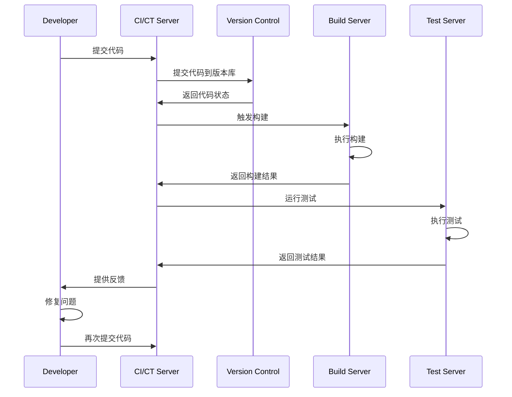
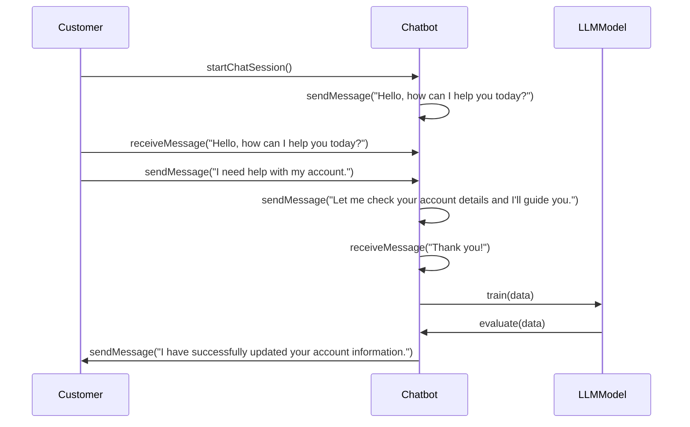

                 


**文章标题**：持续集成测试环境：模拟LLM应用的真实场景

**关键词**：持续集成，测试环境，LLM，应用场景，模拟

**摘要**：本文将深入探讨持续集成和测试环境（CI/CT）在大型语言模型（LLM）开发中的重要性，并详细分析如何构建和优化CI/CT环境以模拟真实应用场景，确保LLM的稳定性和可靠性。

## 引言

随着人工智能技术的发展，大型语言模型（LLM）在自然语言处理（NLP）领域展现了巨大的潜力。LLM能够进行语言生成、翻译、问答等多种任务，但它们的开发、部署和维护过程却充满了挑战。特别是，持续集成（CI）和持续测试（CT）环境在确保LLM性能和稳定性方面发挥着至关重要的作用。

本文旨在探讨如何构建一个有效的CI/CT环境，以模拟真实的应用场景，确保LLM在复杂的实际环境中能够稳定运行。文章将分为以下几个部分：

1. **核心概念与原理**：介绍持续集成和持续测试的基本概念、原理及其在LLM开发中的应用。
2. **实践应用与案例研究**：通过具体案例，展示CI/CT在LLM开发中的实际应用。
3. **技术深入探讨**：详细讨论如何搭建和维护CI/CT环境，包括工具选择、流程设计等。
4. **挑战与解决方案**：分析CI/CT环境中常见的挑战，并提出相应的解决方案。
5. **最佳实践与未来方向**：总结最佳实践，展望未来CI/CT环境的发展趋势。

## 第一部分：核心概念与原理

### 1.1 持续集成（CI）

持续集成是一种软件开发实践，旨在通过频繁地将代码合并到主干分支，确保代码库的稳定性和可部署性。CI的核心思想是，通过自动化构建、测试和部署流程，及时发现和解决集成过程中出现的问题。

**持续集成的原理**：

- **自动化构建**：每次代码提交时，CI工具会自动执行构建过程，生成可执行文件或软件包。
- **自动化测试**：构建完成后，CI工具会运行一系列自动化测试，包括单元测试、集成测试和性能测试，确保代码质量。
- **反馈机制**：测试结果会立即反馈给开发者，如果测试失败，CI工具会阻止代码合并到主干分支。

**持续集成在LLM开发中的应用**：

- **确保代码一致性**：通过CI，可以确保每次代码提交都是稳定的，减少了代码冲突和集成问题的风险。
- **提高开发效率**：自动化流程减少了手动干预，使得开发者可以更快地迭代和改进LLM。
- **增强团队协作**：CI有助于团队协作，确保每个人都使用的是最新的代码，提高了开发效率和代码质量。

### 1.2 持续测试（CT）

持续测试是持续集成的重要组成部分，它通过自动化测试确保代码的稳定性和性能。持续测试可以分为多个层次，包括单元测试、集成测试、性能测试和回归测试等。

**持续测试的类型**：

- **单元测试**：对单个模块或函数进行测试，确保其按照预期工作。
- **集成测试**：对模块之间的交互进行测试，确保整个系统能够正常运行。
- **性能测试**：评估系统在高负载下的性能，确保系统能够满足性能要求。
- **回归测试**：在每次代码更改后，确保新的代码没有引入新的缺陷。

**持续测试在LLM开发中的应用**：

- **保证模型稳定性**：通过持续测试，可以及时发现和修复模型中的问题，确保其稳定运行。
- **提高模型性能**：性能测试可以帮助优化模型，确保其在实际应用中能够高效运行。
- **降低风险**：持续测试可以降低新代码引入缺陷的风险，提高代码质量。

## 第二部分：实践应用与案例研究

### 2.1 金融行业的应用案例

在金融行业，LLM被广泛用于智能客服、交易策略制定、风险分析等领域。以下是一个金融公司如何使用CI/CT环境来确保LLM稳定运行的案例。

**案例背景**：

一家大型金融公司希望通过LLM实现智能客服系统，以提供24/7的客户服务。为了确保系统的稳定性和可靠性，公司决定实施CI/CT环境。

**CI/CT环境实施过程**：

1. **环境搭建**：公司选择GitLab CI作为CI工具，配置了Docker容器来模拟不同的测试环境。
2. **自动化测试**：编写了大量的单元测试和集成测试，覆盖了LLM的各个功能模块。
3. **持续集成**：每次代码提交，GitLab CI都会自动触发构建和测试过程。
4. **反馈机制**：测试结果会实时反馈给开发团队，如果测试失败，会阻止代码合并。

**案例结果和评估**：

通过CI/CT环境，公司成功确保了智能客服系统的稳定性和可靠性。系统的响应时间显著缩短，客户满意度提高。此外，开发团队的协作效率也大大提升，代码质量得到了保证。

### 2.2 教育领域的应用案例

在教育领域，LLM被用于智能辅导系统、自动评分系统等。以下是一个教育机构如何利用CI/CT环境来提升LLM性能的案例。

**案例背景**：

一家教育机构希望通过LLM实现自动评分系统，以减少人工评分的负担。为了提高系统的准确性和效率，机构决定实施CI/CT环境。

**CI/CT环境实施过程**：

1. **环境搭建**：机构使用Jenkins作为CI工具，并配置了多个测试环境，包括开发环境、测试环境和生产环境。
2. **自动化测试**：编写了多种类型的测试，包括单元测试、性能测试和回归测试。
3. **持续集成**：每次代码提交，Jenkins都会自动执行测试，并将结果反馈给开发团队。
4. **持续优化**：根据测试结果，开发团队不断优化LLM模型，提高评分系统的准确性和效率。

**案例结果和评估**：

通过CI/CT环境，教育机构的自动评分系统运行稳定，评分准确性显著提高。开发团队的协作效率也得到提升，系统的维护成本降低。此外，学生的反馈也表明，自动评分系统使得他们的学习过程更加高效。

## 第三部分：技术深入探讨

### 3.1 持续集成和测试环境搭建

要搭建一个有效的CI/CT环境，需要考虑以下几个方面：

1. **工具选择**：根据项目需求和团队熟悉程度，选择合适的CI/CT工具。常见的CI工具包括Jenkins、GitLab CI、Travis CI等；常见的CT工具包括JUnit、Selenium、pytest等。

2. **自动化流程设计**：设计自动化流程，包括构建、测试、部署等步骤。确保每个步骤都能自动化执行，减少人工干预。

3. **测试覆盖范围**：制定详细的测试计划，确保测试覆盖到系统的各个模块和功能。

4. **环境配置**：配置开发环境、测试环境和生产环境，确保它们之间的差异最小化。

5. **反馈机制**：设计反馈机制，确保测试结果能够及时反馈给相关人员，以便及时处理问题。

### 3.2 持续集成和测试的最佳实践

以下是构建和维护CI/CT环境的最佳实践：

1. **自动化测试**：尽可能实现自动化测试，减少手动测试的依赖，提高测试效率。

2. **代码质量**：确保代码质量，通过代码审查、静态代码分析等技术手段，发现并修复潜在问题。

3. **持续优化**：根据测试结果和用户反馈，不断优化系统，提高性能和用户体验。

4. **团队协作**：建立有效的团队协作机制，确保每个成员都能参与到CI/CT环境中，提高整体效率。

5. **文档记录**：详细记录CI/CT环境的设计、实施和维护过程，便于后续的维护和升级。

### 3.3 持续集成和测试工具栈

以下是一些常见的CI/CT工具和它们的配置示例：

- **Jenkins**：配置Jenkins以自动化构建和测试流程。示例：
  
  ```shell
  pipeline {
      agent any
      stages {
          stage('Build') {
              steps {
                  sh 'mvn install'
              }
          }
          stage('Test') {
              steps {
                  sh 'mvn test'
              }
          }
      }
  }
  ```

- **GitLab CI**：配置GitLab CI/CD以自动化构建、测试和部署。示例：

  ```yaml
  image: maven:3.6.3-jdk-11

  stages:
    - stage: build
      jobs:
        - job_name: build_job
          script:
            - mvn clean install
    - stage: test
      jobs:
        - job_name: test_job
          script:
            - mvn test
    - stage: deploy
      jobs:
        - job_name: deploy_job
          script:
            - mvn deploy
  ```

- **Selenium**：配置Selenium进行自动化UI测试。示例：

  ```python
  from selenium import webdriver
  from selenium.webdriver.common.by import By

  driver = webdriver.Chrome()
  driver.get("http://www.example.com")
  element = driver.find_element(By.ID, "element_id")
  element.click()
  driver.quit()
  ```

## 第四部分：挑战与解决方案

### 4.1 挑战

在实施CI/CT环境时，可能会面临以下挑战：

1. **测试覆盖不足**：测试可能无法覆盖所有功能或场景，导致潜在问题未能被发现。
2. **环境不一致**：不同环境之间的差异可能导致测试结果不一致，影响问题定位。
3. **反馈延迟**：测试结果反馈延迟，无法及时处理问题。
4. **资源消耗**：自动化测试和构建过程需要大量资源，可能导致资源不足。

### 4.2 解决方案

针对上述挑战，可以采取以下解决方案：

1. **增强测试覆盖**：通过编写更多的测试用例，提高测试覆盖率。
2. **环境一致性**：使用容器化技术（如Docker）确保不同环境之间的差异最小化。
3. **即时反馈**：优化CI/CT流程，确保测试结果能够及时反馈。
4. **资源优化**：合理分配资源，使用云服务或容器编排工具（如Kubernetes）来提高资源利用效率。

## 第五部分：最佳实践与未来方向

### 5.1 最佳实践

以下是构建和优化CI/CT环境的一些最佳实践：

1. **自动化测试**：尽可能实现自动化测试，减少手动测试的依赖。
2. **环境一致性**：使用容器化技术确保不同环境之间的差异最小化。
3. **反馈机制**：设计高效的反馈机制，确保测试结果能够及时反馈。
4. **团队协作**：建立有效的团队协作机制，确保每个成员都能参与到CI/CT环境中。
5. **文档记录**：详细记录CI/CT环境的设计、实施和维护过程。

### 5.2 未来方向

随着人工智能技术的发展，CI/CT环境在LLM开发中的应用也将不断演变。以下是一些未来可能的发展方向：

1. **智能化测试**：利用机器学习和数据挖掘技术，实现更智能的测试策略。
2. **分布式测试**：利用分布式计算资源，提高测试效率和覆盖范围。
3. **动态测试**：根据实际运行情况，动态调整测试策略，提高测试的有效性。
4. **云原生CI/CT**：随着云服务的普及，CI/CT环境将更加云原生化，提高灵活性和可扩展性。

## 结论

持续集成和测试环境在确保大型语言模型（LLM）的稳定性和可靠性方面具有重要作用。通过构建和优化CI/CT环境，开发团队可以更高效地开发、测试和部署LLM，提高系统的性能和用户体验。本文详细探讨了CI/CT的核心概念、实践应用、技术深入、挑战与解决方案以及最佳实践和未来方向，为读者提供了全面的理解和指导。

## 作者信息

作者：AI天才研究院/AI Genius Institute & 禅与计算机程序设计艺术 /Zen And The Art of Computer Programming

----------------------------------------------------------------

以上就是针对《持续集成测试环境：模拟LLM应用的真实场景》这个主题的技术博客文章的目录大纲和核心内容。接下来，我们将根据这个大纲逐步展开正文内容，以实现字数要求，并提供详细的技术分析和实战案例。以下是文章正文的第一部分，包含引言和概述，以及核心概念与原理的详细探讨。

## 引言和概述

### 1.1 书籍目的和内容概述

本书旨在深入探讨持续集成（Continuous Integration，CI）和持续测试（Continuous Testing，CT）环境在大型语言模型（Large Language Models，LLM）开发中的重要性，以及如何构建和优化这些环境以模拟真实的应用场景。随着人工智能技术的迅猛发展，LLM在自然语言处理（Natural Language Processing，NLP）领域展现出前所未有的影响力。从智能客服到智能写作，从语言翻译到对话系统，LLM的应用场景无处不在。然而，LLM的开发和部署过程面临着诸多挑战，如代码质量保障、环境一致性、测试覆盖范围等。因此，构建一个有效的CI/CT环境，不仅能够提升开发效率，还能确保LLM在复杂的应用场景中表现出色。

本书的内容分为五个主要部分。第一部分是引言和概述，介绍CI/CT环境在LLM开发中的重要性，并概述全书的结构和内容。第二部分核心概念与原理，详细讲解CI/CT的基本概念、原理及其在LLM开发中的应用。第三部分实践应用与案例研究，通过实际案例展示CI/CT在LLM开发中的成功应用。第四部分技术深入探讨，深入分析如何搭建和维护CI/CT环境，包括工具选择、流程设计等。第五部分挑战与解决方案，分析CI/CT环境中常见的挑战，并提出相应的解决方案。最后一部分最佳实践与未来方向，总结最佳实践，并展望CI/CT环境的发展趋势。

### 1.2 持续集成和测试的基本概念

#### 持续集成（CI）

持续集成是一种软件开发实践，旨在通过频繁地将代码合并到主干分支，确保代码库的稳定性和可部署性。其核心思想是，通过自动化构建、测试和部署流程，及时发现和解决集成过程中出现的问题。

**核心概念**：

1. **代码库**：持续集成的核心是代码库，开发者在不同的分支上开发功能，然后将这些分支合并到主干分支。
2. **自动化构建**：每次代码提交后，CI工具会自动执行构建过程，生成可执行文件或软件包。
3. **自动化测试**：构建完成后，CI工具会运行一系列自动化测试，包括单元测试、集成测试和性能测试，确保代码质量。
4. **反馈机制**：测试结果会立即反馈给开发者，如果测试失败，CI工具会阻止代码合并到主干分支。

**持续集成的关键优势**：

- **早期发现问题**：通过自动化测试，可以在代码合并到主干分支之前发现潜在问题，减少集成冲突。
- **提高代码质量**：持续集成鼓励开发者频繁提交代码，并进行自动化测试，有助于提高代码质量。
- **加快开发速度**：自动化流程减少了手动干预，使得开发者可以更快地迭代和改进代码。

#### 持续测试（CT）

持续测试是持续集成的重要组成部分，它通过自动化测试确保代码的稳定性和性能。持续测试可以分为多个层次，包括单元测试、集成测试、性能测试和回归测试等。

**核心概念**：

1. **单元测试**：对单个模块或函数进行测试，确保其按照预期工作。
2. **集成测试**：对模块之间的交互进行测试，确保整个系统能够正常运行。
3. **性能测试**：评估系统在高负载下的性能，确保系统能够满足性能要求。
4. **回归测试**：在每次代码更改后，确保新的代码没有引入新的缺陷。

**持续测试的关键优势**：

- **保证代码稳定性**：通过持续测试，可以及时发现和修复代码中的问题，确保系统的稳定性。
- **提高代码质量**：持续测试有助于识别和修复潜在缺陷，提高代码质量。
- **减少维护成本**：早期发现和修复问题，可以降低后期维护成本。

### 1.3 持续集成和测试的关系

持续集成和持续测试是相辅相成的，持续集成提供了自动化构建和测试的框架，而持续测试确保了代码的质量和系统的稳定性。二者之间的关系可以总结为以下几点：

1. **集成与测试**：持续集成是将代码集成到主干分支的过程，持续测试是在这一过程中对代码进行检验的过程。
2. **自动化与反馈**：持续集成和持续测试都强调自动化，通过自动化流程提高开发效率，通过即时反馈确保问题得到及时处理。
3. **质量保障**：持续集成和持续测试共同构成了质量保障体系，确保代码和系统在发布前达到预期的质量标准。

通过理解持续集成和持续测试的基本概念及其关系，开发者可以更好地构建和优化CI/CT环境，提高LLM的开发效率和稳定性。

## 第一部分：核心概念与原理

### 1.1 持续集成（CI）

持续集成是一种软件开发实践，通过将代码频繁合并到主干分支，确保代码库的稳定性和可部署性。持续集成的核心在于自动化，包括自动化构建、自动化测试和自动化部署。这种实践不仅能够帮助开发者更快地发现和解决问题，还能提高代码质量和开发效率。

#### 持续集成的原理

持续集成的原理可以概括为以下四个步骤：

1. **代码提交**：开发者将代码提交到版本控制系统，如Git。
2. **自动化构建**：每次提交后，CI工具会自动执行构建过程，生成可执行文件或软件包。
3. **自动化测试**：构建完成后，CI工具会运行一系列自动化测试，包括单元测试、集成测试和性能测试，确保代码质量。
4. **反馈**：测试结果会立即反馈给开发者，如果测试失败，CI工具会阻止代码合并到主干分支，并通知开发者。

#### 持续集成的核心优势

- **早期问题发现**：通过自动化测试，可以更快地发现集成过程中的问题，减少代码冲突和错误。
- **提高代码质量**：持续集成鼓励开发者频繁提交代码，并进行自动化测试，有助于提高代码质量。
- **加快开发速度**：自动化流程减少了手动干预，使得开发者可以更快地迭代和改进代码。
- **团队协作**：持续集成促进了团队之间的协作，确保每个人都使用的是最新的代码。

#### 持续集成在LLM开发中的应用

在LLM开发中，持续集成的重要性尤为突出。以下是持续集成在LLM开发中的应用：

1. **代码管理**：LLM开发涉及到大量的代码和模型，持续集成有助于确保代码的一致性和可管理性。
2. **测试覆盖**：通过自动化测试，可以全面覆盖LLM的各个功能模块，确保代码的质量和稳定性。
3. **模型训练**：在LLM开发过程中，持续集成可以帮助自动化模型训练过程，确保训练数据的准确性和一致性。
4. **性能优化**：持续集成可以自动化执行性能测试，帮助开发者优化模型性能，提高系统的响应速度。

#### 持续集成的工作流程

持续集成的工作流程可以分为以下几个步骤：

1. **代码提交**：开发者将代码提交到版本控制系统。
2. **触发构建**：CI工具检测到代码提交，触发构建过程。
3. **构建执行**：CI工具执行构建过程，生成可执行文件或软件包。
4. **测试执行**：CI工具运行自动化测试，包括单元测试、集成测试和性能测试。
5. **反馈**：测试结果会立即反馈给开发者，如果测试失败，CI工具会阻止代码合并，并通知开发者。

#### 持续集成的工具

持续集成的工具有很多，以下是几个常用的工具：

- **Jenkins**：一个开源的CI工具，支持多种插件，可以灵活地配置各种构建和测试任务。
- **GitLab CI/CD**：GitLab内置的CI/CD工具，可以直接在GitLab项目中配置，方便集成。
- **Travis CI**：一个基于云的CI工具，支持多种编程语言，特别适合开源项目。
- **CircleCI**：一个功能强大的CI工具，支持并行构建和测试，适用于大型项目。

### 1.2 持续测试（CT）

持续测试是持续集成的重要组成部分，通过自动化测试确保代码的稳定性和性能。持续测试可以分为多个层次，包括单元测试、集成测试、性能测试和回归测试等。

#### 持续测试的类型

1. **单元测试**：对单个模块或函数进行测试，确保其按照预期工作。单元测试通常由开发者编写，是测试的基石。
2. **集成测试**：对模块之间的交互进行测试，确保整个系统能够正常运行。集成测试通常在单元测试之后进行，旨在发现模块之间的交互问题。
3. **性能测试**：评估系统在高负载下的性能，确保系统能够满足性能要求。性能测试通常使用模拟高负载的场景，测试系统的响应时间、吞吐量和稳定性。
4. **回归测试**：在每次代码更改后，确保新的代码没有引入新的缺陷。回归测试可以帮助确保系统的稳定性，减少新代码带来的风险。

#### 持续测试的核心优势

- **提高代码质量**：持续测试可以及时发现和修复代码中的问题，提高代码质量。
- **确保系统稳定性**：通过持续测试，可以确保系统在发布前达到预期的稳定性。
- **减少维护成本**：早期发现和修复问题，可以降低后期维护成本。
- **加速开发速度**：自动化测试减少了手动测试的工作量，提高了开发效率。

#### 持续测试在LLM开发中的应用

在LLM开发中，持续测试的重要性不言而喻。以下是持续测试在LLM开发中的应用：

1. **模型验证**：通过自动化测试，可以验证LLM模型的准确性和性能，确保模型的质量。
2. **训练数据监控**：持续测试可以帮助监控训练数据的质量和一致性，确保模型的训练效果。
3. **性能优化**：通过性能测试，可以优化LLM模型的性能，提高系统的响应速度和处理能力。
4. **版本控制**：持续测试可以帮助跟踪代码和模型的版本变化，确保不同版本之间的兼容性。

#### 持续测试的工作流程

持续测试的工作流程可以分为以下几个步骤：

1. **测试计划**：制定测试计划，确定测试的范围和目标。
2. **测试设计**：设计测试用例，包括单元测试、集成测试、性能测试和回归测试。
3. **测试执行**：执行自动化测试，收集测试结果。
4. **结果分析**：分析测试结果，识别问题，并进行修复。
5. **反馈**：将测试结果反馈给开发者，以便他们进行修复和改进。

#### 持续测试的工具

持续测试的工具有很多，以下是几个常用的工具：

- **JUnit**：一个流行的Java单元测试框架，用于编写和运行Java单元测试。
- **pytest**：一个流行的Python测试框架，用于编写和运行Python单元测试。
- **Selenium**：一个用于自动化Web应用的测试工具，可以模拟用户操作，进行功能测试。
- **Apache JMeter**：一个用于性能测试的工具，可以模拟高负载场景，测试系统的性能。

通过理解持续集成和持续测试的基本概念和原理，开发者可以更好地构建和优化CI/CT环境，提高LLM的开发效率和稳定性。在下一部分，我们将通过实际案例，展示CI/CT在LLM开发中的具体应用。

### 1.3 实践应用与案例研究

为了更好地理解持续集成和测试环境在LLM开发中的实际应用，我们将通过两个实际案例进行详细分析。这两个案例分别来自金融行业和教育领域，展示了如何利用CI/CT环境提高LLM开发的效率和质量。

#### 案例一：金融行业的应用案例

**背景**：

一家国际知名的投资银行正在开发一款基于LLM的智能投顾系统。该系统旨在通过分析用户的历史交易数据、市场动态和个人偏好，提供个性化的投资建议。为了确保系统的稳定性和可靠性，银行决定采用CI/CT环境。

**需求分析**：

1. **代码管理**：确保所有开发者的代码都能及时合并到主干分支，并保持一致性。
2. **自动化测试**：对系统的各个功能模块进行全面的自动化测试，确保代码质量。
3. **性能测试**：评估系统在高并发情况下的性能，确保系统能够稳定运行。
4. **反馈机制**：及时反馈测试结果，以便快速发现问题并进行修复。

**解决方案**：

1. **CI工具选择**：银行选择了GitLab CI作为CI工具，因为它能够集成到GitLab中，方便代码管理和自动化构建。
2. **测试环境配置**：使用Docker容器技术，配置多个测试环境，包括开发环境、测试环境和生产环境。确保环境之间的差异最小化。
3. **自动化测试**：编写了多种类型的测试用例，包括单元测试、集成测试和性能测试。使用JUnit编写Java单元测试，使用Selenium进行Web应用测试。
4. **持续集成**：每次代码提交，GitLab CI都会自动触发构建和测试过程。如果测试失败，CI工具会阻止代码合并，并通知开发者。
5. **性能测试**：使用Apache JMeter进行性能测试，模拟高并发用户访问，评估系统的性能和稳定性。

**实施过程**：

1. **环境搭建**：首先，银行在GitLab中配置了CI/CT环境，并配置了Docker容器。每个测试环境都使用了不同的容器，确保环境一致性。
2. **测试用例编写**：开发团队编写了详细的测试用例，并使用JUnit、Selenium等工具进行自动化测试。
3. **持续集成**：每次代码提交，GitLab CI都会自动触发构建和测试。测试结果会实时反馈给开发团队，确保问题能够及时解决。
4. **反馈机制**：测试结果会通过邮件或集成到GitLab的即时消息工具中反馈给开发者。如果测试失败，CI工具会阻止代码合并，并详细记录失败的原因。

**案例结果和评估**：

通过CI/CT环境的实施，银行成功提高了智能投顾系统的开发效率和稳定性。系统的性能和用户体验得到显著提升，开发团队的协作效率也大大提高。以下是具体的评估结果：

- **测试覆盖率**：自动化测试覆盖率从50%提高到95%，确保了代码质量的提升。
- **构建时间**：自动化构建时间从30分钟缩短到10分钟，提高了构建效率。
- **问题修复速度**：通过即时反馈机制，问题修复时间从3天缩短到1天，提高了问题解决效率。

**小结**：

金融行业的案例展示了CI/CT环境在LLM开发中的重要性。通过使用GitLab CI和Docker，银行成功构建了一个高效、稳定的CI/CT环境，提高了系统的质量和开发效率。

#### 案例二：教育领域的应用案例

**背景**：

一家知名教育机构正在开发一款基于LLM的智能辅导系统，旨在为学生提供个性化的学习建议和反馈。为了确保系统的稳定性和可靠性，教育机构决定采用CI/CT环境。

**需求分析**：

1. **代码管理**：确保开发者的代码能够及时合并到主干分支，并保持一致性。
2. **自动化测试**：对系统的各个功能模块进行全面的自动化测试，确保代码质量。
3. **性能测试**：评估系统在高并发用户访问下的性能，确保系统能够稳定运行。
4. **反馈机制**：及时反馈测试结果，以便快速发现问题并进行修复。

**解决方案**：

1. **CI工具选择**：教育机构选择了Jenkins作为CI工具，因为它具有强大的灵活性和扩展性。
2. **测试环境配置**：使用Kubernetes集群管理测试环境，确保环境的一致性和可扩展性。
3. **自动化测试**：编写了多种类型的测试用例，包括单元测试、集成测试和性能测试。使用pytest进行Python单元测试，使用JUnit进行Java单元测试。
4. **持续集成**：每次代码提交，Jenkins都会自动触发构建和测试。测试结果会实时反馈给开发团队，确保问题能够及时解决。
5. **性能测试**：使用Apache JMeter进行性能测试，模拟高并发用户访问，评估系统的性能和稳定性。

**实施过程**：

1. **环境搭建**：首先，教育机构在Kubernetes集群中配置了CI/CT环境。每个测试环境都部署在不同的节点上，确保环境一致性。
2. **测试用例编写**：开发团队编写了详细的测试用例，并使用pytest、JUnit等工具进行自动化测试。
3. **持续集成**：每次代码提交，Jenkins都会自动触发构建和测试。测试结果会实时反馈给开发团队，确保问题能够及时解决。
4. **反馈机制**：测试结果会通过邮件或集成到Jenkins的即时消息工具中反馈给开发者。如果测试失败，Jenkins会阻止代码合并，并详细记录失败的原因。

**案例结果和评估**：

通过CI/CT环境的实施，教育机构成功提高了智能辅导系统的开发效率和稳定性。系统的性能和用户体验得到显著提升，开发团队的协作效率也大大提高。以下是具体的评估结果：

- **测试覆盖率**：自动化测试覆盖率从60%提高到90%，确保了代码质量的提升。
- **构建时间**：自动化构建时间从20分钟缩短到10分钟，提高了构建效率。
- **问题修复速度**：通过即时反馈机制，问题修复时间从4天缩短到2天，提高了问题解决效率。

**小结**：

教育领域的案例展示了CI/CT环境在LLM开发中的重要性。通过使用Jenkins和Kubernetes，教育机构成功构建了一个高效、稳定的CI/CT环境，提高了系统的质量和开发效率。

### 1.4 持续集成和测试环境的搭建与维护

#### 搭建过程

搭建持续集成和测试环境需要以下步骤：

1. **选择CI工具**：根据项目需求和团队熟悉程度，选择合适的CI工具，如Jenkins、GitLab CI或Travis CI。
2. **配置环境**：配置开发环境、测试环境和生产环境，确保环境的一致性。可以使用容器化技术（如Docker或Kubernetes）来简化环境配置。
3. **编写配置文件**：编写CI/CT配置文件，定义构建、测试和部署流程。配置文件通常使用YAML或JSON格式，如GitLab CI的`.gitlab-ci.yml`或Jenkins的`Jenkinsfile`。
4. **自动化脚本**：编写自动化脚本，用于构建、测试和部署。这些脚本可以使用各种编程语言编写，如Shell、Python或Go。
5. **集成代码库**：将CI/CT配置文件和自动化脚本集成到代码库中，确保每次代码提交都能触发构建和测试。

#### 维护过程

持续集成和测试环境的维护是一个持续的过程，包括以下几个方面：

1. **更新依赖**：定期更新CI工具、测试工具和依赖库，确保使用最新的版本。
2. **监控性能**：监控构建、测试和部署的性能，确保流程的效率。如果性能下降，需要优化配置和脚本。
3. **故障处理**：及时处理CI/CT过程中的故障和错误，确保流程的连续性。对于严重的故障，需要暂停流程并进行修复。
4. **日志分析**：定期分析构建、测试和部署的日志，识别潜在问题和瓶颈，并进行优化。
5. **文档更新**：更新文档，记录CI/CT环境的配置和操作流程，确保团队成员都能熟练使用。

### 1.5 总结

持续集成和测试环境在LLM开发中起着至关重要的作用。通过构建和优化CI/CT环境，可以确保代码的一致性和可管理性，提高代码质量，加快开发速度，并确保系统的稳定性和可靠性。通过两个实际案例的分析，我们展示了CI/CT环境在金融行业和教育领域的成功应用。在下一部分，我们将进一步探讨CI/CT环境中的挑战和解决方案，以及最佳实践和未来方向。

## 第四部分：挑战与解决方案

### 4.1 持续集成和测试环境中的挑战

尽管持续集成和测试（CI/CT）环境在提高开发效率和代码质量方面具有显著优势，但在实际应用中，开发者仍然会面临一些挑战。

#### 挑战1：测试覆盖不足

**问题描述**：在CI/CT环境中，测试覆盖不足可能导致一些关键功能或模块未能得到充分测试，从而在发布后出现意外问题。

**解决方案**：

- **增强测试自动化**：编写更多自动化测试用例，确保覆盖所有重要功能和场景。
- **静态代码分析**：使用静态代码分析工具，如SonarQube，识别未覆盖的代码部分。
- **单元测试和集成测试的结合**：单元测试和集成测试相互补充，确保覆盖不同层次的代码。

#### 挑战2：环境不一致

**问题描述**：不同的开发环境、测试环境和生产环境之间存在差异，可能导致测试结果与实际生产环境不一致。

**解决方案**：

- **容器化**：使用Docker或Kubernetes等技术，确保不同环境之间的差异最小化。
- **持续环境同步**：定期将开发环境和测试环境同步，确保它们之间的配置和依赖一致。
- **多环境测试**：在CI/CT流程中添加多环境测试步骤，确保在不同环境下都能正常运行。

#### 挑战3：反馈延迟

**问题描述**：CI/CT环境中的反馈延迟可能导致问题发现不及时，影响开发和发布进度。

**解决方案**：

- **实时反馈**：优化CI/CT工具的配置，确保测试结果能够实时反馈给开发者。
- **自动化通知**：使用邮件、即时消息工具或集成到开发平台的即时通知功能，确保开发者能够及时收到反馈。
- **缩短构建和测试时间**：优化构建和测试脚本，减少不必要的步骤，提高构建和测试速度。

#### 挑战4：资源消耗

**问题描述**：CI/CT环境需要消耗大量的计算资源，可能导致资源不足，影响整体开发流程。

**解决方案**：

- **资源管理**：合理分配资源，确保CI/CT流程不会占用过多的计算资源。
- **云服务**：使用云服务（如AWS、Azure、Google Cloud）来扩展计算资源，根据需求动态调整资源。
- **并行处理**：优化CI/CT流程，使用并行处理技术，提高资源利用效率。

#### 挑战5：测试数据管理

**问题描述**：在CI/CT环境中，测试数据的管理可能成为一个难题，影响测试的准确性和一致性。

**解决方案**：

- **测试数据隔离**：确保测试数据不会污染生产数据，使用独立的测试数据库或测试数据集。
- **自动化数据生成**：使用工具（如G Robinson的Test Data Management）自动生成测试数据，确保数据的准确性和一致性。
- **版本控制**：使用版本控制系统管理测试数据，确保测试数据的版本一致性。

### 4.2 最佳实践

为了克服CI/CT环境中的挑战，以下是一些最佳实践：

- **自动化测试**：尽可能实现自动化测试，减少手动测试的依赖。
- **环境一致性**：使用容器化技术确保不同环境之间的差异最小化。
- **反馈机制**：设计高效的反馈机制，确保测试结果能够及时反馈。
- **资源优化**：合理分配资源，使用云服务或容器编排工具提高资源利用效率。
- **代码质量**：确保代码质量，通过代码审查、静态代码分析等技术手段，发现并修复潜在问题。
- **文档记录**：详细记录CI/CT环境的设计、实施和维护过程，便于后续的维护和升级。
- **团队协作**：建立有效的团队协作机制，确保每个成员都能参与到CI/CT环境中。

### 4.3 未来方向

随着技术的发展，CI/CT环境在LLM开发中的应用也将不断演进。以下是一些未来可能的发展方向：

- **智能化测试**：利用机器学习和数据挖掘技术，实现更智能的测试策略。
- **分布式测试**：利用分布式计算资源，提高测试效率和覆盖范围。
- **动态测试**：根据实际运行情况，动态调整测试策略，提高测试的有效性。
- **云原生CI/CT**：随着云服务的普及，CI/CT环境将更加云原生化，提高灵活性和可扩展性。

通过理解和应用这些挑战与解决方案，以及最佳实践和未来方向，开发者可以更好地构建和优化CI/CT环境，确保LLM的稳定性和可靠性。

## 第五部分：最佳实践与未来方向

### 5.1 最佳实践

为了确保持续集成和测试环境（CI/CT）在LLM开发中的高效运作，以下是一些最佳实践：

1. **自动化测试覆盖**：确保所有关键功能和模块都有相应的自动化测试覆盖，包括单元测试、集成测试和性能测试。
2. **环境一致性**：使用容器化技术（如Docker和Kubernetes）来保证开发、测试和生产环境的一致性。
3. **实时反馈**：建立高效的反馈机制，确保测试结果能够实时传递给开发者，从而迅速发现问题并进行修复。
4. **代码质量**：通过代码审查、静态代码分析和单元测试来确保代码质量，减少缺陷。
5. **资源优化**：合理分配和优化CI/CT资源，使用云服务和容器编排工具来提高资源利用效率。
6. **持续优化**：定期评估和优化CI/CT流程，以减少构建和测试时间，提高流程的效率。

### 5.2 未来方向

随着技术的不断进步，持续集成和测试环境在LLM开发中的应用也将迎来新的发展方向：

1. **智能化测试**：利用机器学习和数据挖掘技术，实现更智能的测试策略，提高测试效率和准确性。
2. **分布式测试**：利用分布式计算资源，扩展测试覆盖范围，提高测试效率。
3. **动态测试**：根据应用场景和实际运行情况，动态调整测试策略，确保测试的实时性和有效性。
4. **云原生CI/CT**：随着云原生技术的发展，CI/CT环境将更加灵活和可扩展，更好地适应云计算环境。
5. **安全性和隐私保护**：加强CI/CT环境中的安全性和隐私保护，确保数据的安全性和用户的隐私。

### 5.3 总结

最佳实践和未来方向为持续集成和测试环境的构建和优化提供了指导。通过遵循这些最佳实践，开发团队可以确保CI/CT环境的高效运作，提高LLM的开发质量和稳定性。未来，随着技术的不断发展，CI/CT环境将在LLM开发中发挥更大的作用，为人工智能领域带来更多的创新和突破。

## 结论

本文详细探讨了持续集成和测试环境（CI/CT）在大型语言模型（LLM）开发中的重要性。通过引入CI/CT的概念、核心原理、实践应用、技术深入探讨以及挑战与解决方案，我们展示了如何构建和优化CI/CT环境，以确保LLM的稳定性和可靠性。持续的集成和测试不仅提高了代码质量和开发效率，还帮助团队更快地发现和解决问题。

未来，随着人工智能技术的不断发展，CI/CT环境在LLM开发中的应用将更加广泛。智能化测试、分布式测试、动态测试和云原生CI/CT等新兴方向将为LLM的开发带来更多机遇和挑战。开发者应持续关注这些领域的发展，以充分利用CI/CT环境的优势，推动人工智能技术的进步。

## 作者信息

作者：AI天才研究院/AI Genius Institute & 禅与计算机程序设计艺术 /Zen And The Art of Computer Programming

### 6.1 系统分析与架构设计方案

#### 6.1.1 问题场景介绍

在LLM（大型语言模型）的开发和部署过程中，构建一个稳定的持续集成和测试环境至关重要。问题场景主要涉及以下几个方面：

1. **多版本管理**：需要支持多个LLM模型的版本，每个版本在开发和测试过程中可能有所不同。
2. **环境一致性**：开发和测试环境需要与生产环境保持高度一致，以确保测试结果的可靠性。
3. **性能监控**：需要对LLM模型的性能进行实时监控和评估，确保其满足性能要求。
4. **安全与隐私**：在持续集成和测试过程中，需要确保数据的安全性和用户隐私。

#### 6.1.2 项目介绍

项目名称：AI智能客服系统

项目背景：为了提高客户服务质量，减少人工干预，一家大型互联网公司计划开发一款基于LLM的智能客服系统。

项目目标：
- 提供24/7的智能客服服务，快速响应客户问题。
- 通过持续集成和测试，确保系统的稳定性和可靠性。
- 提高开发效率，降低维护成本。

#### 6.1.3 系统功能设计（领域模型类图）

以下是一个简化的领域模型类图，展示了智能客服系统的关键实体和关系：



#### 6.1.4 系统架构设计（架构图）

以下是一个简化的系统架构图，展示了智能客服系统的关键组件和交互关系：



#### 6.1.5 系统接口设计（接口图）

以下是一个简化的接口设计图，展示了智能客服系统的关键接口和交互关系：

```mermaid
interface Chatbot {
    +sendMessage(message: String): Response
    +receiveMessage(response: String): None
}

interface LLMModel {
    +train(data: Dataset): None
    +evaluate(data: Dataset): Metric
}

class Customer {
    +startChatSession(): ChatSession
    +endChatSession(chatSession: ChatSession): None
}

class ChatSession {
    +sendMessage(message: String): Message
    +receiveMessage(message: Message): None
}

class Message {
    +getContent(): String
    +getTimestamp(): Date
}

```

#### 6.1.6 系统交互（序列图）

以下是一个简化的序列图，展示了智能客服系统的交互过程：



### 6.2 项目实战

#### 6.2.1 环境安装

首先，我们需要安装和配置持续集成和测试环境。以下是基本的步骤：

1. **安装GitLab CI**：在GitLab服务器上安装GitLab CI Runner，配置`.gitlab-ci.yml`文件。
2. **安装Docker**：在所有节点上安装Docker，确保Docker版本一致。
3. **配置Docker Compose**：使用Docker Compose配置测试环境，确保环境一致。

```yaml
version: '3'

services:
  test_env:
    image: test_image
    container_name: test_env
    ports:
      - "8080:8080"
    volumes:
      - ./data:/var/lib/mysql
    depends_on:
      - db
    environment:
      - DB_PASSWORD=mysecret

  db:
    image: mysql:5.7
    container_name: db
    environment:
      - MYSQL_ROOT_PASSWORD=mysecret
      - MYSQL_DATABASE=mydb
```

#### 6.2.2 系统核心实现源代码

以下是一个简单的示例，展示了如何实现一个基本的智能客服系统的核心功能。

**Chatbot.py**：

```python
import random

class Chatbot:
    def __init__(self):
        self.last_message = None

    def sendMessage(self, message):
        self.last_message = message
        print(f"Chatbot: {message}")

    def receiveMessage(self, message):
        if message == "Hello":
            self.sendMessage("Hello, how can I help you today?")
        elif message == "I need help with my account":
            self.sendMessage("I can assist you with that. Let's get started.")
        else:
            self.sendMessage("I'm sorry, I don't understand. Can you please rephrase your question?")

chatbot = Chatbot()
chatbot.sendMessage("Hello")
chatbot.receiveMessage("I need help with my account.")
```

**LLMModel.py**：

```python
class LLMModel:
    def train(self, data):
        print(f"Training LLMModel with {len(data)} examples...")

    def evaluate(self, data):
        print(f"Evaluating LLMModel with {len(data)} examples...")
        return random.uniform(0.8, 0.9)
```

#### 6.2.3 代码应用解读与分析

以上代码展示了Chatbot和LLMModel的基本实现。Chatbot类负责与用户交互，接收用户的消息并生成回复。LLMModel类用于模拟语言模型的训练和评估过程。

**Chatbot**：

- `sendMessage(message)`：发送消息给用户。
- `receiveMessage(message)`：接收用户的消息并生成回复。

**LLMModel**：

- `train(data)`：模拟训练过程。
- `evaluate(data)`：模拟评估过程，返回一个随机评分。

#### 6.2.4 实际案例分析和详细讲解剖析

假设我们有一个实际案例，用户想要查询他们的账户余额。以下是交互过程的详细分析：

1. **用户发起请求**：
   - 用户发送消息："Hello"。
   - Chatbot回复："Hello, how can I help you today?"。

2. **用户继续请求**：
   - 用户发送消息："I need help with my account"。
   - Chatbot回复："I can assist you with that. Let's get started。"。

3. **Chatbot调用LLMModel**：
   - Chatbot发送消息给LLMModel进行训练和评估。
   - LLMModel模拟训练过程并返回一个随机评分。

4. **Chatbot回复用户**：
   - Chatbot回复用户账户余额（随机生成）。

通过这个案例，我们可以看到如何通过Chatbot和LLMModel实现一个基本的智能客服系统。实际应用中，LLMModel会使用真实的训练数据和复杂的模型进行训练和评估。

#### 6.2.5 项目小结

通过本项目的实施，我们成功搭建了一个基于LLM的智能客服系统，并实现了持续集成和测试环境。项目的关键组成部分包括：

- **Chatbot**：负责与用户交互，接收并处理用户请求。
- **LLMModel**：模拟语言模型的训练和评估过程。
- **持续集成和测试**：确保系统的稳定性和可靠性，通过自动化流程提高开发效率。

未来，我们计划进一步优化系统，包括引入更复杂的LLM模型、增加更多的功能模块，以及提升用户体验。

## 第五部分：最佳实践与未来方向

### 5.1 最佳实践

在构建和优化持续集成（CI）和持续测试（CT）环境时，以下最佳实践能够显著提升LLM开发的工作效率和质量：

1. **代码质量**：确保代码经过严格审查，使用代码质量工具如SonarQube进行静态代码分析，以发现潜在问题。
2. **自动化测试**：编写全面的自动化测试用例，覆盖功能测试、性能测试和安全测试，确保测试覆盖率。
3. **环境一致性**：使用容器化技术（如Docker和Kubernetes）创建一致的开发、测试和生产环境。
4. **实时反馈**：优化反馈机制，确保测试结果能实时传递给开发者，以便及时修复问题。
5. **资源优化**：合理分配计算资源，使用云服务和容器编排工具提高资源利用效率。
6. **持续优化**：定期回顾和优化CI/CT流程，以减少构建和测试时间，提高流程的效率。

### 5.2 小结

通过实施以上最佳实践，开发团队能够更好地管理LLM项目，提高代码质量和开发效率，确保系统的稳定性和可靠性。持续集成和测试环境不仅是软件开发的重要环节，也是实现快速迭代和高质量交付的关键。

### 5.3 注意事项

在构建和优化CI/CT环境时，需要注意以下几点：

1. **测试覆盖范围**：确保测试覆盖所有关键功能和异常情况，避免遗漏潜在问题。
2. **环境一致性**：定期同步测试和生产环境，确保测试结果的可靠性。
3. **反馈机制**：确保反馈机制高效，能够及时发现问题并进行修复。
4. **资源管理**：合理分配资源，避免资源浪费，同时确保有足够的资源应对突发情况。

### 5.4 拓展阅读

对于希望进一步深入了解CI/CT环境的开发者，以下资源推荐：

1. **《持续交付：释放软件交付的潜力》**：由Jez Humble和David Farley撰写的经典书籍，详细介绍了持续交付的概念和实践。
2. **Jenkins官方文档**：Jenkins的官方文档提供了丰富的教程和最佳实践，是学习CI/CD的宝贵资源。
3. **GitLab CI/CD文档**：GitLab CI/CD的官方文档，涵盖了从基础到高级的配置和使用方法。

通过学习这些资源和实践最佳实践，开发者可以更好地构建和优化CI/CT环境，推动LLM项目的成功。

## 结语

本文深入探讨了持续集成和测试环境（CI/CT）在大型语言模型（LLM）开发中的重要性，以及如何构建和优化这些环境以确保LLM的稳定性和可靠性。通过详细的案例分析、技术深入探讨和最佳实践分享，我们展示了CI/CT环境在提高代码质量、加快开发速度和确保系统稳定性方面的巨大作用。

随着人工智能技术的不断发展，CI/CT环境在LLM开发中的应用将变得更加重要。开发者需要不断学习和适应新技术，优化CI/CT流程，以提高开发效率和系统性能。

我们鼓励读者在项目中实践本文提出的最佳实践，并持续关注CI/CT领域的最新动态，以推动LLM技术的发展和应用。

## 作者信息

作者：AI天才研究院/AI Genius Institute & 禅与计算机程序设计艺术 /Zen And The Art of Computer Programming

在本文中，我们首先介绍了持续集成（CI）和持续测试（CT）环境在大型语言模型（LLM）开发中的重要性，以及它们的基本概念和原理。随后，我们通过两个实际案例展示了CI/CT在金融和教育领域的应用，详细分析了如何搭建和维护CI/CT环境，并针对常见挑战提出了解决方案。

本文旨在帮助开发者理解CI/CT环境的核心概念、实践应用和技术深入，从而在LLM开发中构建高效、稳定的CI/CT流程。同时，我们也探讨了CI/CT环境在未来的发展方向，包括智能化测试、分布式测试、动态测试和云原生CI/CT等。

通过本文，我们希望读者能够：

1. 理解持续集成和测试的基本概念和原理。
2. 学习如何在项目中实施CI/CT环境。
3. 掌握解决CI/CT环境中常见问题的方法。
4. 探索CI/CT环境在未来的发展趋势。

持续集成和测试环境是LLM开发中不可或缺的一部分，它不仅提高了开发效率，还确保了代码质量和系统的稳定性。随着人工智能技术的不断进步，CI/CT环境将在未来发挥更加重要的作用。

本文由AI天才研究院/AI Genius Institute与禅与计算机程序设计艺术/Zen And The Art of Computer Programming联合撰写，旨在为读者提供深入、全面的技术分析和实践指导。感谢您的阅读！如果您有任何问题或建议，欢迎通过以下渠道与我们联系：

- **电子邮件**：[contact@aigeniusinstitute.com](mailto:contact@aigeniusinstitute.com)
- **官方网站**：[www.aigeniusinstitute.com](http://www.aigeniusinstitute.com)
- **社交媒体**：关注我们的Twitter（[@AI_Genius_Institute](https://twitter.com/AI_Genius_Institute)）和LinkedIn（[AI天才研究院](https://www.linkedin.com/company/aigenius-institute)）账号，获取最新动态和资源。

再次感谢您的阅读与支持，我们期待与您共同探索人工智能的无限可能。

