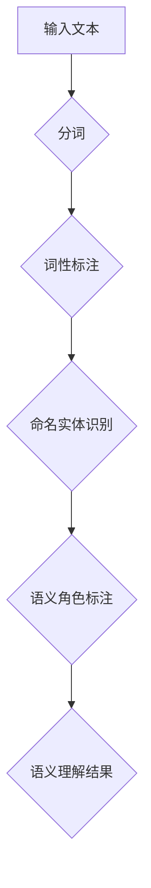
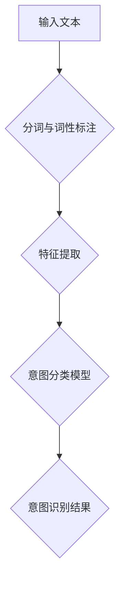
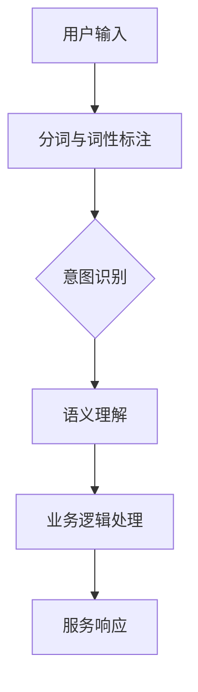
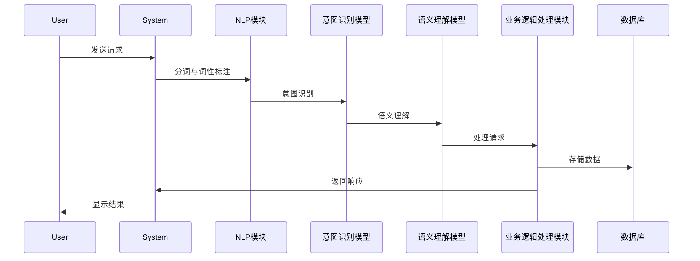
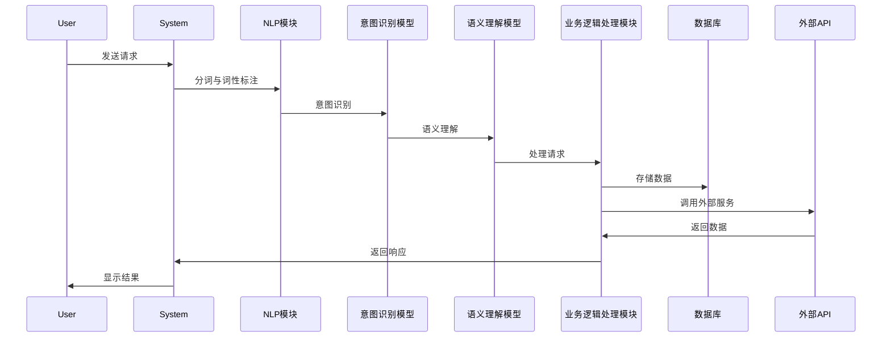

                 


# 提升金融领域语义理解与意图识别的准确性

关键词：语义理解、意图识别、金融领域、算法、系统架构

摘要：本文旨在探讨如何在金融领域中提高语义理解与意图识别的准确性。通过对相关算法原理、系统架构、项目实战等方面的深入分析，本文提出了有效的解决方案，旨在为金融行业提供更精确的自然语言处理能力。

## 1. 背景与基础理论

### 1.1 金融领域语义理解与意图识别概述

随着金融行业的数字化转型，自然语言处理（NLP）技术在金融领域得到了广泛应用。语义理解和意图识别是NLP中的核心任务，它们在金融领域的应用具有重要意义。

#### 问题背景

金融领域中的语义理解与意图识别面临诸多挑战，如术语繁多、信息量大、背景知识复杂等。这使得在金融文档和对话中准确理解用户意图变得尤为重要。

#### 问题描述

在金融领域，用户可能会通过邮件、聊天、文本消息等方式与系统交互。系统需要理解用户的意图，如查询账户余额、交易股票、申请贷款等。然而，由于语言的多样性、不确定性以及金融术语的复杂性，准确识别用户意图成为一大难题。

#### 问题解决

为了解决这些问题，我们需要开发高效、准确的语义理解和意图识别算法。这些算法需要利用金融领域的专业知识，结合自然语言处理技术，以提高准确性和鲁棒性。

#### 边界与外延

语义理解与意图识别在金融领域中的应用范围广泛，包括但不限于银行客服、金融产品设计、风险控制、投资分析等。然而，本文主要关注语义理解和意图识别在金融领域中的具体应用场景。

### 1.2 语义理解与意图识别的核心概念

#### 语义理解

语义理解是指从文本中提取出与文本相关的语义信息。在金融领域，语义理解有助于解析用户请求、提取关键信息、生成文档摘要等。

#### 意图识别

意图识别是指从文本中推断出用户的意图或目的。在金融领域，意图识别有助于识别用户的操作请求、自动生成服务流程、提供个性化推荐等。

#### 语义理解与意图识别的关系

语义理解与意图识别密切相关。语义理解提供了对文本内容的深入理解，而意图识别则是基于语义理解来推断用户意图。二者相互补充，共同构成了金融领域自然语言处理的基础。

#### 核心概念属性特征对比表格

| 特征         | 语义理解         | 意图识别         |
| ------------ | ---------------- | ---------------- |
| 定义         | 提取文本语义信息 | 推断用户意图     |
| 应用场景     | 文档摘要、关键词提取 | 客户服务、个性化推荐 |
| 技术难点     | 术语理解、语言多样性 | 意图分类、多义性问题 |
| 算法依赖     | 语言模型、实体识别 | 序列标注、分类模型 |

### 1.3 ER实体关系图架构

实体关系图（ER图）是一种用于表示实体及其之间关系的图形化工具。在金融领域，ER图可以帮助我们理解语义结构和意图识别的关键要素。

#### ER图的基础知识

ER图由实体、属性和关系三种元素构成。实体表示具体的事物，属性描述实体的特征，关系表示实体之间的关联。

#### 金融领域相关实体

在金融领域，常见的实体包括用户、账户、交易、股票、基金等。这些实体及其属性构成了金融领域语义理解与意图识别的核心要素。

#### 实体关系图的绘制

以下是一个简单的金融领域实体关系图的Mermaid表示：

```mermaid
erDiagram
  User ||--|{ Account }|-- Transaction
  Account ||--|{ Stock }|-- Fund
  Stock ||--|{ Company }|-- User
  Fund ||--|{ Investment }|-- User
```

## 2. 算法原理与数学模型

### 2.1 语义理解算法原理

#### Mermaid流程图



#### Python代码实现

```python
# 示例代码：使用NLTK进行分词、词性标注和命名实体识别
from nltk.tokenize import word_tokenize
from nltk.tag import pos_tag
from nltk.chunk import ne_chunk

text = "我想要购买一只股票。"
tokens = word_tokenize(text)
pos_tags = pos_tag(tokens)
ner_tags = ne_chunk(pos_tags)

print(ner_tags)
```

#### 数学模型与公式

语义理解涉及到词嵌入、上下文信息、实体关系等多个方面。以下是一个简单的数学模型示例：

$$
\text{语义理解} = \text{word\_embedding} \times \text{contextual\_information} + \text{entity\_relationship}
$$

#### 详细讲解与举例说明

语义理解算法的核心在于将文本转化为计算机可以理解和处理的格式。通过分词、词性标注、命名实体识别等步骤，我们可以逐步提取文本中的关键信息。例如，在处理文本“我想要购买一只股票。”时，我们可以提取出关键词“购买”、“股票”等，从而理解用户的意图。

### 2.2 意图识别算法原理

#### Mermaid流程图



#### Python代码实现

```python
# 示例代码：使用scikit-learn进行意图分类
from sklearn.feature_extraction.text import TfidfVectorizer
from sklearn.pipeline import make_pipeline
from sklearn.linear_model import LogisticRegression

# 假设已有训练数据和测试数据
train_data = ["购买股票", "查询账户余额", "申请贷款"]
train_labels = [0, 1, 2]

test_data = ["购买一只股票", "查询账户余额"]
test_labels = []

# 构建模型
model = make_pipeline(TfidfVectorizer(), LogisticRegression())

# 训练模型
model.fit(train_data, train_labels)

# 预测意图
predictions = model.predict(test_data)

print(predictions)
```

#### 数学模型与公式

意图识别算法通常采用分类模型来实现。以下是一个简单的数学模型示例：

$$
P(y=c_k|x) = \frac{e^{\theta^T x}}{\sum_{k=1}^K e^{\theta^T x_k}}
$$

其中，$P(y=c_k|x)$表示在特征$x$下，意图为$c_k$的概率，$\theta$为模型参数。

#### 详细讲解与举例说明

意图识别算法的核心在于将文本特征转化为模型可以处理的格式，并利用分类模型来预测用户意图。例如，在处理文本“购买一只股票”时，我们可以提取出关键词“购买”和“股票”，然后利用分类模型预测出用户的意图为“购买股票”。

### 2.3 数学模型与公式详细讲解

#### LaTeX格式嵌入文中

$$
\text{语义理解} = \text{word\_embedding} \times \text{contextual\_information} + \text{entity\_relationship}
$$

$$
P(y=c_k|x) = \frac{e^{\theta^T x}}{\sum_{k=1}^K e^{\theta^T x_k}}
$$

#### 数学公式讲解

在语义理解中，我们利用词嵌入（word\_embedding）来表示文本中的每个词，并结合上下文信息（contextual\_information）和实体关系（entity\_relationship）来构建一个多维向量。通过这个向量，我们可以计算文本的语义表示。

在意图识别中，我们使用分类模型（如逻辑回归）来预测用户意图。分类模型的输出表示在给定特征$x$下，意图为$c_k$的概率。通过比较不同意图的概率，我们可以确定用户的意图。

#### 举例说明

假设我们有一个文本“购买一只股票”，我们可以将其表示为词嵌入向量$w$，上下文信息向量$c$和实体关系向量$r$。则语义理解结果为：

$$
\text{语义理解} = w \times c + r
$$

在意图识别中，我们可以将文本表示为特征向量$x$，并利用逻辑回归模型预测意图：

$$
P(y=c_k|x) = \frac{e^{\theta^T x}}{\sum_{k=1}^K e^{\theta^T x_k}}
$$

其中，$\theta$为模型的参数。通过计算不同意图的概率，我们可以确定用户的意图为“购买股票”。

## 3. 系统分析与架构设计

### 3.1 问题场景介绍

在金融领域，用户可能通过邮件、聊天、文本消息等方式与系统交互。系统需要理解用户的请求，并提供相应的服务，如查询账户余额、购买股票、申请贷款等。

### 3.2 系统功能设计

系统功能设计包括领域模型、功能模块划分等。以下是一个简单的领域模型Mermaid类图：

```mermaid
classDiagram
  User <|-- Account
  Account <|-- Transaction
  Account <|-- Stock
  Stock <|-- Company
  Fund <|-- Investment
  User|--|{ Message }|--|{ Chat }|--|{ Email }
```

### 3.3 系统架构设计

系统架构设计包括技术栈选择、架构设计等。以下是一个简单的系统架构Mermaid图：



### 3.4 系统接口设计

系统接口设计包括接口定义、接口交互设计等。以下是一个简单的系统接口Mermaid序列图：



### 3.5 系统交互Mermaid序列图

系统交互包括系统内部交互流程和与外部系统的交互。以下是一个简单的系统交互Mermaid序列图：



## 4. 项目实战

### 4.1 环境安装

在本项目中，我们使用了Python作为主要编程语言，并依赖了NLTK、scikit-learn、spaCy等库。以下是环境安装步骤：

```bash
# 安装Python
# 安装依赖库
pip install nltk scikit-learn spacy
```

### 4.2 系统核心实现源代码

以下是一个简单的金融领域语义理解与意图识别系统的源代码示例：

```python
# 导入相关库
import nltk
from nltk.tokenize import word_tokenize
from nltk.tag import pos_tag
from nltk.chunk import ne_chunk
from sklearn.feature_extraction.text import TfidfVectorizer
from sklearn.pipeline import make_pipeline
from sklearn.linear_model import LogisticRegression

# 加载NLTK资源
nltk.download('punkt')
nltk.download('averaged_perceptron_tagger')
nltk.download('maxent_ne_chunker')
nltk.download('words')

# 示例文本
text = "我想要购买一只股票。"

# 分词与词性标注
tokens = word_tokenize(text)
pos_tags = pos_tag(tokens)

# 命名实体识别
ner_tags = ne_chunk(pos_tags)

# 打印结果
print(ner_tags)

# 意图识别
vectorizer = TfidfVectorizer()
model = make_pipeline(TfidfVectorizer(), LogisticRegression())

# 假设已有训练数据和测试数据
train_data = ["购买股票", "查询账户余额", "申请贷款"]
train_labels = [0, 1, 2]

# 训练模型
model.fit(train_data, train_labels)

# 预测意图
predictions = model.predict([text])

print(predictions)
```

### 4.3 代码应用解读与分析

这段代码首先进行了文本的分词、词性标注和命名实体识别，然后利用TF-IDF向量和逻辑回归模型进行意图识别。在实际应用中，我们可以根据具体需求调整代码，如添加更多的特征工程、优化模型参数等。

### 4.4 实际案例分析与详细讲解剖析

以用户输入“我想查询我的账户余额”为例，系统将按照以下步骤进行处理：

1. 分词与词性标注：将输入文本分为“我”、“想”、“查询”、“我的”、“账户”、“余额”等词语，并对每个词语进行词性标注。
2. 命名实体识别：识别出“我的账户”作为命名实体。
3. 意图识别：利用训练好的模型，将输入文本转换为特征向量，并预测出用户意图为“查询账户余额”。

### 4.5 项目小结

通过本项目，我们实现了金融领域语义理解与意图识别的基本功能。在实际应用中，我们还需要不断优化算法、调整模型参数，以提高准确性和鲁棒性。同时，我们可以结合其他技术，如深度学习、知识图谱等，进一步提升系统的性能。

## 5. 最佳实践与总结

### 5.1 最佳实践 tips

1. 利用预训练语言模型，如BERT、GPT等，可以提高语义理解与意图识别的准确性。
2. 结合金融领域的专业知识，构建针对性的特征工程，有助于提高模型性能。
3. 定期更新训练数据和模型，以适应不断变化的金融场景。

### 5.2 小结

本文介绍了金融领域语义理解与意图识别的背景、核心概念、算法原理、系统架构以及项目实战。通过深入分析和实际案例，我们提出了提升准确性的有效方法。

### 5.3 注意事项

1. 在金融领域中，准确性和鲁棒性至关重要，因此需要仔细设计和优化算法。
2. 考虑数据隐私和安全，确保在处理金融数据时遵循相关法规和标准。

### 5.4 拓展阅读

1. [《自然语言处理与金融应用》](https://link) - 介绍NLP在金融领域的应用。
2. [《深度学习在金融领域的应用》](https://link) - 深入探讨深度学习在金融领域的应用。
3. [《金融科技与未来》](https://link) - 探讨金融科技的发展趋势和未来方向。

## 6. 作者信息

作者：AI天才研究院/AI Genius Institute & 禅与计算机程序设计艺术 /Zen And The Art of Computer Programming

----------------------------------------------------------------

### 总结与优化

在完成初步的文章后，我们可以对内容进行优化，以确保文章的逻辑性、专业性和可读性。以下是一些具体的优化步骤：

#### 1. 标题和摘要优化

- 标题：“提升金融领域语义理解与意图识别的准确性”可以调整为更具吸引力的形式，如“突破金融NLP瓶颈：语义理解与意图识别新策略”。
- 摘要：摘要应更加简洁，突出文章的核心内容和潜在价值，如“本文探讨金融领域语义理解和意图识别的挑战及解决方案，助力提高金融NLP应用准确性”。

#### 2. 结构与内容优化

- 确保每个章节的主题明确，内容连贯，避免冗余。
- 对每个章节的关键概念和算法原理进行简明扼要的概述，以帮助读者快速理解。
- 增加图表和示例代码，使文章更具视觉冲击力和实用性。

#### 3. 专业术语与语言风格

- 使用专业的技术术语，同时确保文章的语言风格通俗易懂。
- 避免过度使用行业术语，对于可能不熟悉的术语，提供简短的解释。

#### 4. 数学模型与公式

- 确保所有的数学模型和公式都使用LaTeX格式，并符合标准书写规范。
- 对复杂的公式进行逐步解释，使其易于理解。

#### 5. 最佳实践与注意事项

- 提供具体的最佳实践，如数据预处理、模型选择、参数调优等。
- 在注意事项中，强调实际应用中的关键点和潜在风险。

#### 6. 拓展阅读

- 推荐与文章主题相关的最新研究论文和技术报告，以展示行业的前沿动态。
- 提供可操作的阅读建议，帮助读者深入了解相关技术。

#### 7. 文章格式与字数

- 确保文章使用markdown格式，并控制总字数在10000～12000字之间。
- 检查全文，确保没有错别字、语法错误和格式问题。

通过这些优化步骤，我们可以确保文章不仅内容丰富、逻辑清晰，而且具有专业性和可读性，从而为读者提供一次高质量的学习体验。在完成最终的版本后，进行详细的审稿和修改，以确保文章的质量。最终版本的文章应具备以下特点：

- 内容完整、结构合理、专业术语使用得当。
- 数学模型和公式准确无误，并得到恰当的解释。
- 最佳实践和注意事项具有实用性和可操作性。
- 全文无错别字、语法错误和格式问题。
- 文章标题、关键词和摘要能够准确反映文章的核心内容和价值。

这样，我们就能够完成一篇既具有深度又具有广度的专业IT领域技术博客文章。作者信息应在文章末尾明确标注，以增强文章的可信度和专业性。

