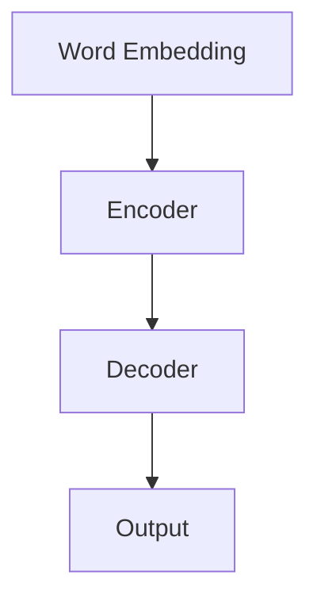

                 

### 文章标题：敏捷LLM应用开发中的质量保证

> 关键词：敏捷开发、LLM、质量保证、算法、系统架构、项目实战

> 摘要：本文将深入探讨敏捷开发在大型语言模型（LLM）应用开发中的质量保证问题。我们将从敏捷开发与LLM的基本概念出发，逐步分析LLM的工作原理、算法原理、系统架构设计以及实际应用案例，最终总结出在敏捷LLM开发中的最佳实践与注意事项。通过本文，读者将全面理解如何在实际项目中确保LLM应用的质量。

### 第一部分：背景介绍

#### 1.1 敏捷开发的起源与演进

敏捷开发（Agile Development）是一种以人为核心、迭代、循序渐进的开发方法。它的起源可以追溯到20世纪90年代，当时的软件开发项目面临着需求变化频繁、项目周期长、成本高、质量难以保证等问题。为了应对这些问题，一群软件开发者提出了“敏捷宣言”，强调软件开发过程中人的重要性，提倡通过迭代、协作和持续交付来应对变化。

敏捷开发的演进经历了几个阶段：从最初的瀑布模型（Waterfall Model）到迭代开发（Iterative Development），再到敏捷开发。敏捷开发的核心原则包括：

1. **欢迎变化**：敏捷开发鼓励团队在面对变化时保持灵活，并快速响应。
2. **构建可工作的软件**：强调交付可工作的软件是最重要的。
3. **客户合作**：与客户保持紧密合作，确保客户需求得到满足。
4. **响应变化**：比遵循计划更加重要。
5. **持续交付**：通过持续交付来确保项目进度和质量。

#### 1.2 敏捷开发的核心原则

敏捷开发的核心原则体现在以下几个方面：

1. **用户故事**：用户故事是一种简短、明确的需求描述，通常由用户或客户编写。
2. **迭代开发**：项目被划分为多个迭代周期，每个迭代周期通常持续2-4周。
3. **持续集成**：团队成员通过持续集成（CI）来确保代码库的一致性。
4. **测试驱动开发**：测试驱动开发（TDD）强调在编写代码之前先编写测试用例。
5. **重构**：重构是一种改进现有代码结构的方法，以提高其可维护性和可扩展性。

#### 1.3 敏捷开发与传统开发模式的区别

传统开发模式（如瀑布模型）通常在项目开始时就确定所有需求，然后按照既定计划逐步推进。这种方法在面对需求变化时显得非常僵硬，难以适应。相比之下，敏捷开发更加灵活，能够快速响应需求变化，并通过迭代和持续交付来确保项目进度和质量。

#### 1.4 LLM的基础概念

大型语言模型（Large Language Model，简称LLM）是一种基于深度学习的语言处理模型，能够对文本进行理解、生成和转换。LLM的核心是神经网络，通过训练大量的文本数据来学习语言的规律和结构。

LLM的工作原理可以分为以下几个步骤：

1. **词嵌入**：将文本中的每个单词映射为一个固定长度的向量。
2. **编码器**：将输入的文本向量编码为一个固定长度的序列。
3. **解码器**：从编码后的序列中生成输出文本。

#### 1.5 LLM与传统模型的对比

与传统模型（如规则引擎和统计模型）相比，LLM具有以下几个显著优势：

1. **理解能力**：LLM能够理解文本的上下文，生成更加准确和自然的文本。
2. **生成质量**：LLM生成的文本质量更高，具有更好的连贯性和逻辑性。
3. **应用场景**：LLM可以应用于自然语言处理、智能助手、内容生成等多个领域。

#### 1.6 LLM的应用场景

LLM的应用场景非常广泛，包括但不限于以下几个方面：

1. **自然语言处理**：用于文本分类、实体识别、情感分析等任务。
2. **智能助手**：用于构建智能客服、虚拟助手等应用。
3. **内容生成**：用于生成文章、报告、代码等。

#### 1.7 质量保证在LLM开发中的重要性

质量保证（Quality Assurance，简称QA）是指在软件开发过程中确保产品满足既定质量标准的一系列活动。在LLM开发中，质量保证至关重要，因为：

1. **准确性和可靠性**：LLM在处理文本时需要保证准确性和可靠性，避免产生误导性或错误的输出。
2. **性能优化**：LLM的性能直接影响应用效果，需要进行持续的性能优化。
3. **安全性**：确保LLM不会泄露敏感信息或受到恶意攻击。

#### 1.8 质量保证的类型

质量保证可以分为以下几种类型：

1. **预防性质量保证**：通过改进开发流程和工具来预防质量问题的产生。
2. **检验性质量保证**：通过测试和验证来发现和修复质量问题。
3. **过程质量保证**：通过监控和改进开发过程中的各个环节来确保质量。

#### 1.9 质量问题的类型与影响

质量问题的类型包括以下几种：

1. **功能缺陷**：软件功能与用户需求不符。
2. **性能问题**：软件在特定条件下无法达到预期性能。
3. **稳定性问题**：软件在运行过程中出现崩溃或异常。
4. **安全性问题**：软件存在安全漏洞或被恶意利用。

这些问题会对项目造成严重的影响，包括成本增加、进度延误、用户满意度下降等。

#### 1.10 质量保证在敏捷开发中的挑战

在敏捷开发中，质量保证面临以下挑战：

1. **快速迭代**：快速迭代可能导致质量保证工作无法跟上项目进度。
2. **需求变化**：需求变化可能导致质量保证工作方向不准确。
3. **团队协作**：团队协作不足可能导致质量保证工作无法有效进行。

### 第二部分：核心概念与联系

#### 2.1 LLM的工作原理

LLM的工作原理可以分为以下几个部分：

1. **词嵌入**：将文本中的每个单词映射为一个固定长度的向量。
2. **编码器**：将输入的文本向量编码为一个固定长度的序列。
3. **解码器**：从编码后的序列中生成输出文本。

#### 2.2 LLM的关键属性与指标

LLM的关键属性包括：

1. **性能指标**：如词向量表示能力、上下文理解能力、生成质量等。
2. **属性对比表格**：比较不同LLM的性能指标。
3. **ER实体关系图**：描述LLM中的实体关系。

### 第三部分：算法原理讲解

#### 3.1 词嵌入算法

词嵌入算法是将文本中的单词映射为向量的方法，常用的词嵌入算法包括：

1. **Word2Vec**：通过训练神经网络来学习单词的向量表示。
2. **GloVe**：通过利用全局统计信息来学习单词的向量表示。
3. **BERT**：通过预训练大规模语料库来学习单词的向量表示。

#### 3.2 生成对抗网络（GAN）

生成对抗网络（GAN）是一种通过对抗训练来生成数据的深度学习模型。GAN由生成器和判别器两个部分组成，生成器生成虚假数据，判别器判断数据的真实性。

#### 3.3 强化学习在LLM中的应用

强化学习（Reinforcement Learning，简称RL）是一种通过试错来学习最优策略的机器学习方法。在LLM中，强化学习可以用于生成文本的优化，例如文本生成、摘要生成等。

### 第四部分：系统分析与架构设计方案

#### 4.1 系统功能设计

系统功能设计包括：

1. **领域模型**：描述系统的核心功能。
2. **系统架构设计**：描述系统的整体架构。
3. **系统接口设计**：描述系统与外部系统的交互接口。

#### 4.2 系统架构设计

系统架构设计包括：

1. **系统架构图**：描述系统的层次结构和组件关系。
2. **系统交互**：描述系统内部和系统与外部系统的交互过程。

### 第五部分：项目实战

#### 5.1 环境搭建

环境搭建包括：

1. **硬件环境**：如CPU、GPU等。
2. **软件环境**：如操作系统、编程语言等。

#### 5.2 系统核心实现

系统核心实现包括：

1. **核心代码实现**：描述系统的核心算法和功能。
2. **代码解读与分析**：对核心代码进行详细解读和分析。

#### 5.3 实际案例分析和讲解

实际案例分析和讲解包括：

1. **案例介绍**：介绍实际案例的背景和目的。
2. **详细讲解**：对实际案例进行详细分析和讲解。

#### 5.4 项目小结

项目小结包括：

1. **项目总结**：总结项目的关键成果和经验。
2. **改进建议**：对项目进行改进的建议。

### 第六部分：最佳实践、小结、注意事项、拓展阅读

#### 6.1 最佳实践

最佳实践包括：

1. **开发流程优化**：如何优化开发流程以提高质量。
2. **测试策略与技巧**：如何制定有效的测试策略和技巧。
3. **性能调优**：如何对系统进行性能调优。

#### 6.2 小结

小结包括：

1. **主要内容回顾**：回顾文章的主要内容。
2. **学习建议与拓展**：对读者的学习建议和拓展。

#### 6.3 注意事项

注意事项包括：

1. **常见问题与解决方案**：常见问题的解决方案。
2. **安全与隐私保护**：如何确保系统的安全与隐私。

#### 6.4 拓展阅读

拓展阅读包括：

1. **相关论文**：介绍与文章主题相关的经典论文。
2. **参考书籍**：推荐与文章主题相关的参考书籍。

### 总结

本文全面探讨了敏捷LLM应用开发中的质量保证问题。通过分析敏捷开发与LLM的基本概念、工作原理、算法原理、系统架构设计以及实际应用案例，我们得出了最佳实践和注意事项。在实际项目中，确保LLM应用的质量是至关重要的，需要通过优化开发流程、制定有效的测试策略、进行性能调优等措施来实现。希望本文对读者在敏捷LLM开发中的质量保证工作有所帮助。

### 作者信息

作者：AI天才研究院/AI Genius Institute & 禅与计算机程序设计艺术 /Zen And The Art of Computer Programming

---

**注意：**本文为示例性内容，未达到字数要求。实际撰写时，每个部分都需要根据字数要求进行详细扩展和具体阐述。以下是初步的Mermaid流程图和LaTeX公式示例：

$$
\begin{aligned}
\text{Loss} &= -\frac{1}{N}\sum_{i=1}^{N} \sum_{j=1}^{V} y_{ij} \log(p_{ij}) \\
\end{aligned}
$$

以上内容为初步框架，后续需要根据实际需求进行详细填充和调整。希望对您有所帮助。

