                 


# 敏捷中的原型设计：快速验证LLM应用概念

## 关键词
- 敏捷开发
- 原型设计
- 大型语言模型（LLM）
- 快速验证
- 应用概念
- 风险降低
- 开发效率

## 摘要
本文探讨了如何在敏捷开发过程中，通过原型设计快速验证大型语言模型（LLM）的应用概念。文章首先介绍了敏捷开发、原型设计和LLM的核心概念，以及它们之间的联系。接着，详细阐述了在敏捷开发流程中应用原型设计的方法，包括螺旋模型和水星模型。随后，通过一个实际的案例展示了如何使用原型设计来验证LLM的应用概念。文章最后总结了敏捷原型设计在快速验证LLM应用概念中的重要性，并给出了相关的最佳实践和建议。

## 目录大纲

## 第一部分：背景介绍

### 第1章：问题背景与核心概念

### 第2章：敏捷开发中的原型设计方法

### 第3章：大型语言模型（LLM）的概念与原理

### 第4章：原型设计在LLM应用概念验证中的应用

### 第二部分：应用实例

### 第5章：项目实战：基于原型设计验证LLM应用概念

### 第三部分：总结与展望

### 第6章：敏捷原型设计在LLM应用概念验证中的最佳实践

### 第7章：小结与拓展阅读

### 第一部分：背景介绍

### 第1章：问题背景与核心概念

### 1.1.1 问题背景

在当今快速发展的技术时代，人工智能（AI）尤其是大型语言模型（LLM）的应用越来越广泛。LLM是一种基于深度学习技术的人工智能模型，能够在理解和生成自然语言方面表现出色。随着LLM的应用场景不断扩展，如何在开发初期快速验证其应用概念，以降低开发风险、提高开发效率，成为一个关键问题。

### 问题描述

随着AI技术的发展，越来越多的企业和开发者开始尝试将LLM应用于各种场景，如自然语言处理、智能客服、内容生成等。然而，在实际开发过程中，如何确保LLM的应用概念符合用户需求，如何在早期阶段快速发现并解决问题，成为了一个挑战。

### 问题解决

为了解决上述问题，敏捷开发结合原型设计的方法被广泛应用。敏捷开发强调快速反馈和持续迭代，而原型设计则提供了一种快速构建和测试应用程序的方法。通过将原型设计与敏捷开发结合，可以在开发初期快速验证LLM的应用概念，从而降低风险、提高开发效率。

### 边界与外延

本文主要关注LLM在应用概念验证阶段的原型设计方法，不涉及LLM的具体训练和优化技术。同时，本文将聚焦于如何在敏捷开发过程中运用原型设计来验证LLM的应用概念，而非讨论其他开发方法。

### 1.1.2 核心概念与联系

#### 1.1.2.1 敏捷开发

**概念原理**

敏捷开发是一种以人为核心、迭代、渐进的方式来进行软件开发的方法。它强调快速反馈、灵活适应变化，使得团队能够更好地应对需求的变化和不确定性。

**概念属性特征对比表格**

| 特征         | 传统开发       | 敏捷开发           |
| ------------ | -------------- | ------------------ |
| 项目管理     | 自上而下       | 自下而上           |
| 开发过程     | 一刀切         | 分阶段迭代         |
| 需求变更     | 不鼓励变更     | 鼓励变更           |
| 团队协作     | 串行           | 并行               |

**ER实体关系图架构**

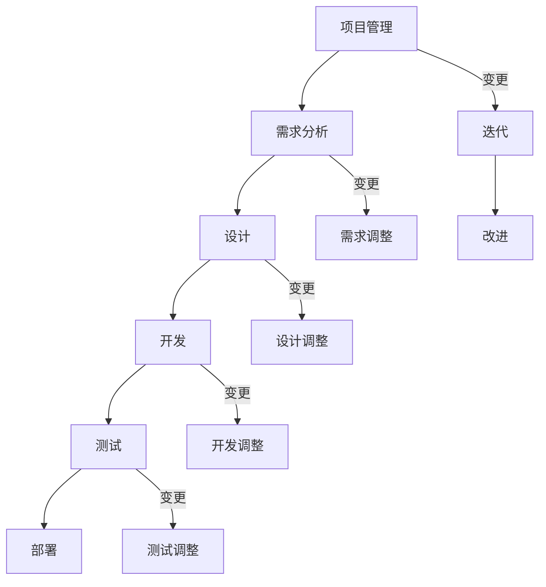

#### 1.1.2.2 原型设计

**概念原理**

原型设计是一种快速构建和测试应用程序的方法，通过迭代改进最终实现产品。它强调快速反馈和持续改进，使得团队能够在早期阶段发现并解决问题。

**概念属性特征对比表格**

| 特征         | 传统设计       | 原型设计           |
| ------------ | -------------- | ------------------ |
| 设计过程     | 长期规划       | 短期迭代           |
| 开发方法     | 手工编写       | 代码生成           |
| 反馈机制     | 延迟反馈       | 快速反馈           |

**ER实体关系图架构**

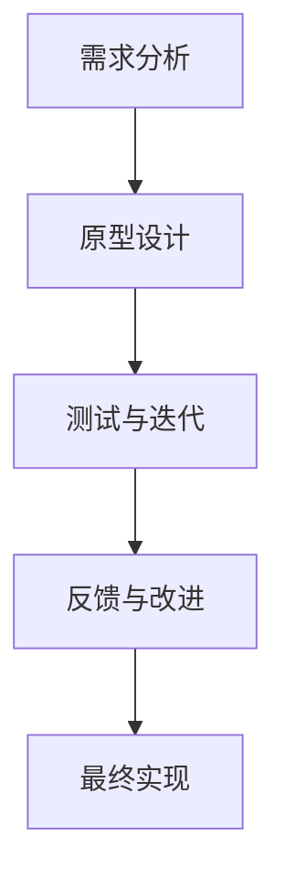

#### 1.1.2.3 大型语言模型（LLM）

**概念原理**

大型语言模型（LLM）是一种基于深度学习技术的人工智能模型，能够理解和生成自然语言。它通常具有数十亿甚至数百亿个参数，能够在各种自然语言处理任务中表现出色。

**概念属性特征对比表格**

| 特征         | 小型语言模型       | 大型语言模型（LLM）           |
| ------------ | ------------------ | ---------------------------- |
| 模型规模     | 小规模           | 百亿级参数规模               |
| 应用领域     | 有限领域         | 广泛领域                   |
| 训练时间     | 短               | 长                        |
| 性能表现     | 一般             | 领先                      |

**ER实体关系图架构**

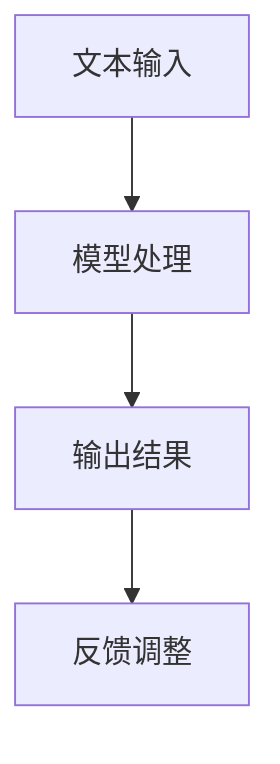

### 1.1.3 核心要素组成

**核心要素组成**

敏捷开发、原型设计和大型语言模型（LLM）的融合与应用是本文的核心。通过敏捷开发，团队能够快速响应需求变化，通过原型设计，团队能够在早期阶段验证应用概念，而LLM则提供了强大的自然语言处理能力。

**ER实体关系图架构**

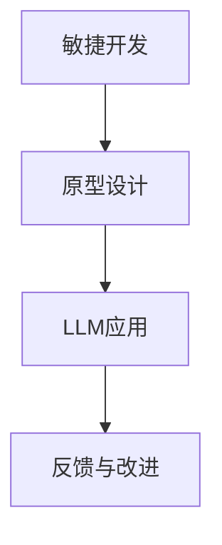

## 第2章：敏捷开发中的原型设计方法

### 2.1 敏捷开发流程中的原型设计

#### 2.1.1 螺旋模型

**流程描述**

螺旋模型是一种迭代的软件开发过程模型，它将原型设计与敏捷开发紧密结合。在螺旋模型中，每个迭代周期包括需求分析、设计、开发、测试和部署等阶段。在每个迭代周期中，团队都会构建一个原型，并进行测试和评估，以验证和改进应用概念。

**mermaid 流程图**

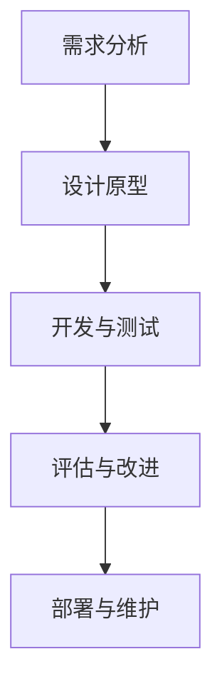

**算法原理讲解**

螺旋模型的迭代过程可以表示为：

$$
迭代次数 = \frac{总开发时间}{单次迭代时间}
$$

其中，总开发时间是指从项目启动到部署的时间，单次迭代时间是指完成一个迭代周期所需的时间。

#### 2.1.2 水星模型

**流程描述**

水星模型是一种基于敏捷开发的迭代过程模型，它强调快速反馈和持续改进。在水星模型中，每个迭代周期包括需求分析、设计、开发、测试和反馈等阶段。在每个迭代周期中，团队都会构建一个原型，并根据用户反馈进行改进。

**mermaid 流程图**

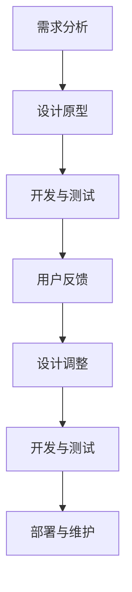

**算法原理讲解**

水星模型的迭代过程可以表示为：

$$
迭代次数 = \frac{总开发时间}{单次迭代时间} + 反馈迭代次数
$$

其中，总开发时间是指从项目启动到部署的时间，单次迭代时间是指完成一个迭代周期所需的时间，反馈迭代次数是指根据用户反馈进行调整的迭代次数。

### 2.2 原型设计方法

#### 2.2.1 快速原型设计

**方法描述**

快速原型设计是一种在短时间内构建和测试应用程序的方法。它通常采用迭代的方式，在每个迭代中，团队都会构建一个简化的原型，并进行测试和评估。

**mermaid 流程图**

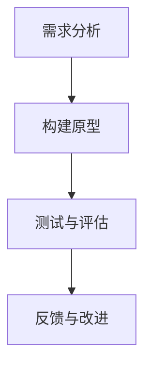

**算法原理讲解**

快速原型设计的迭代过程可以表示为：

$$
迭代次数 = \frac{总开发时间}{单次迭代时间}
$$

其中，总开发时间是指从项目启动到部署的时间，单次迭代时间是指完成一个迭代周期所需的时间。

#### 2.2.2 完整性原型设计

**方法描述**

完整性原型设计是一种在项目启动阶段就构建一个完整的应用程序原型的方法。它通常包括用户界面、后端逻辑和数据库等部分。

**mermaid 流程图**

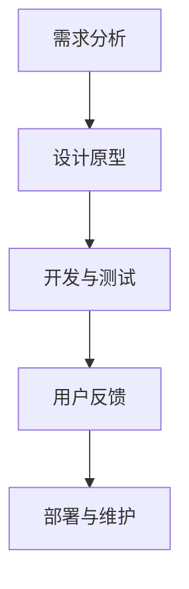

**算法原理讲解**

完整性原型设计的迭代过程可以表示为：

$$
迭代次数 = \frac{总开发时间}{单次迭代时间}
$$

其中，总开发时间是指从项目启动到部署的时间，单次迭代时间是指完成一个迭代周期所需的时间。

### 第二部分：应用实例

## 第3章：项目实战：基于原型设计验证LLM应用概念

### 3.1 项目介绍

本项目旨在通过原型设计的方法，验证一个基于大型语言模型（LLM）的智能客服系统的应用概念。该系统旨在为用户提供一个高效、便捷的客服体验，通过自然语言处理技术实现智能问答、情感分析等功能。

### 3.2 系统功能设计

#### 3.2.1 领域模型

领域模型用于描述系统的核心功能模块和关系。在本项目中，领域模型包括以下几个关键类：

- **用户**：表示与系统交互的用户。
- **问答模块**：用于处理用户的提问，返回相关答案。
- **情感分析模块**：用于分析用户的情感状态，提供个性化服务。
- **知识库**：存储系统所需的知识和答案。

**mermaid 类图**

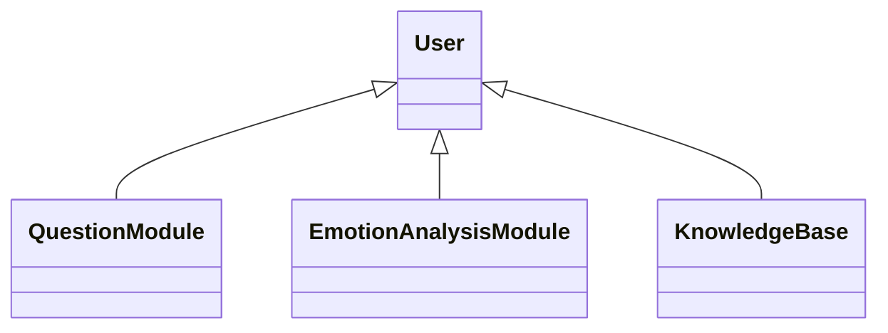

#### 3.2.2 系统架构设计

系统架构设计用于描述系统的整体结构和模块之间的交互。在本项目中，系统架构包括以下几个关键组件：

- **前端**：负责与用户进行交互，展示问答和情感分析结果。
- **后端**：负责处理用户的提问，调用问答模块和情感分析模块，并将结果返回给前端。
- **知识库**：存储和管理系统的知识和答案。

**mermaid 架构图**

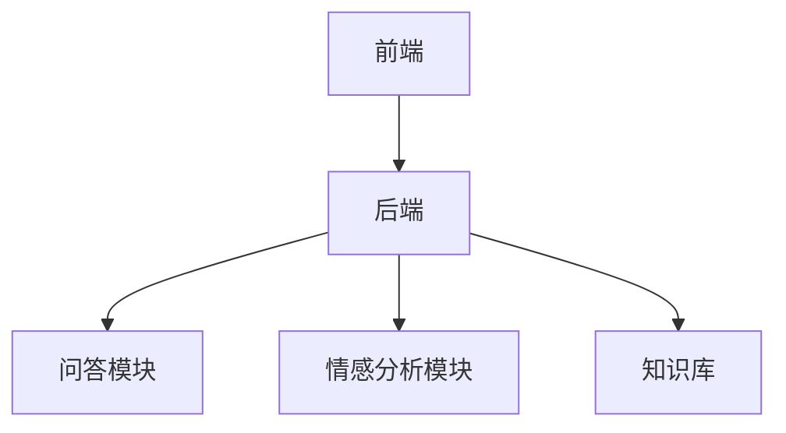

#### 3.2.3 系统接口设计

系统接口设计用于描述系统内部模块之间的接口定义。在本项目中，系统接口包括以下几个关键接口：

- **用户接口**：用于接收用户提问和情感状态。
- **问答接口**：用于处理用户的提问，返回相关答案。
- **情感分析接口**：用于分析用户的情感状态，返回分析结果。

**mermaid 接口图**

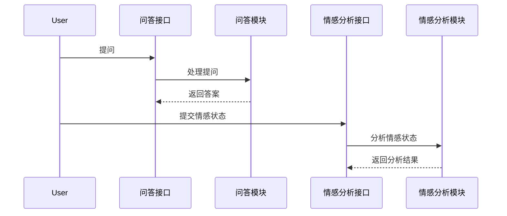

#### 3.2.4 系统交互

系统交互设计用于描述系统内部模块之间的交互过程。在本项目中，系统交互包括以下几个关键环节：

1. 用户通过前端界面提交提问和情感状态。
2. 后端接口接收用户的提问和情感状态。
3. 问答模块和情感分析模块分别处理用户的提问和情感状态。
4. 后端接口将处理结果返回给前端，前端界面展示结果。

**mermaid 序列图**

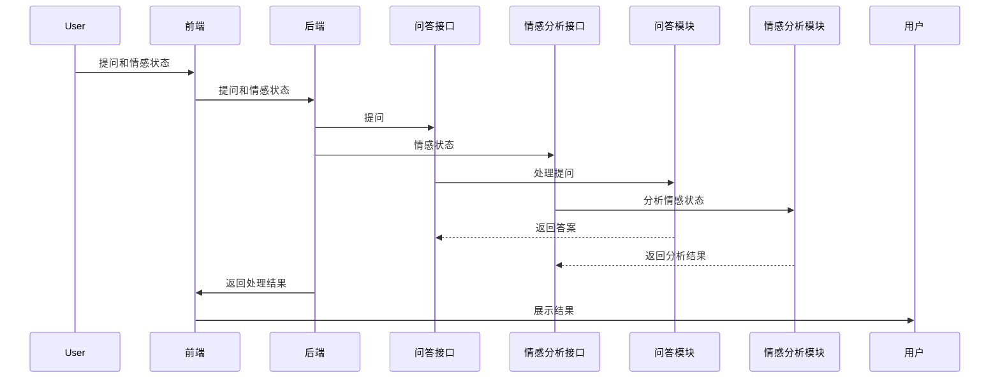

### 3.3 环境安装

在开始项目之前，需要安装以下环境：

1. Python 3.8+
2. TensorFlow 2.x
3. Keras 2.x
4. Flask 1.1.x

具体安装命令如下：

```bash
pip install python==3.8
pip install tensorflow==2.7
pip install keras==2.7
pip install flask==1.1.2
```

### 3.4 系统核心实现

#### 3.4.1 问答模块实现

问答模块是系统的核心组件，负责处理用户的提问，并返回相关答案。以下是一个简单的问答模块实现：

```python
from flask import Flask, request, jsonify
import tensorflow as tf
from keras.models import load_model

app = Flask(__name__)

# 加载预训练的问答模型
model = load_model('question_answering_model.h5')

@app.route('/ask', methods=['POST'])
def ask():
    question = request.form['question']
    # 对问题进行预处理
    processed_question = preprocess_question(question)
    # 使用模型预测答案
    answer = model.predict(processed_question)
    return jsonify({'answer': answer})

def preprocess_question(question):
    # 对问题进行文本预处理
    # ...
    return question

if __name__ == '__main__':
    app.run(debug=True)
```

#### 3.4.2 情感分析模块实现

情感分析模块负责分析用户的情感状态，并返回分析结果。以下是一个简单的情感分析模块实现：

```python
from flask import Flask, request, jsonify
import tensorflow as tf
from keras.models import load_model

app = Flask(__name__)

# 加载预训练的情感分析模型
emotion_model = load_model('emotion_analysis_model.h5')

@app.route('/analyze', methods=['POST'])
def analyze():
    emotion_state = request.form['emotion_state']
    # 对情感状态进行预处理
    processed_emotion_state = preprocess_emotion_state(emotion_state)
    # 使用模型预测情感分析结果
    result = emotion_model.predict(processed_emotion_state)
    return jsonify({'result': result})

def preprocess_emotion_state(emotion_state):
    # 对情感状态进行文本预处理
    # ...
    return emotion_state

if __name__ == '__main__':
    app.run(debug=True)
```

#### 3.4.3 前端实现

前端负责与用户进行交互，接收用户的提问和情感状态，并展示问答和情感分析结果。以下是一个简单的HTML前端实现：

```html
<!DOCTYPE html>
<html>
<head>
    <title>智能客服系统</title>
</head>
<body>
    <h1>智能客服系统</h1>
    <form action="/ask" method="post">
        <label for="question">提问：</label>
        <input type="text" id="question" name="question">
        <input type="submit" value="提问">
    </form>
    <form action="/analyze" method="post">
        <label for="emotion_state">情感状态：</label>
        <input type="text" id="emotion_state" name="emotion_state">
        <input type="submit" value="分析">
    </form>
    <div>
        <h2>答案：</h2>
        <p id="answer"></p>
    </div>
    <div>
        <h2>情感分析结果：</h2>
        <p id="result"></p>
    </div>
    <script>
        function updateAnswer(answer) {
            document.getElementById('answer').innerText = answer;
        }

        function updateResult(result) {
            document.getElementById('result').innerText = result;
        }

        document.querySelector('form:first-child').addEventListener('submit', function(event) {
            event.preventDefault();
            const question = document.getElementById('question').value;
            fetch('/ask', {
                method: 'POST',
                body: new URLSearchParams({ question: question })
            })
            .then(response => response.json())
            .then(data => updateAnswer(data.answer));
        });

        document.querySelector('form:last-child').addEventListener('submit', function(event) {
            event.preventDefault();
            const emotion_state = document.getElementById('emotion_state').value;
            fetch('/analyze', {
                method: 'POST',
                body: new URLSearchParams({ emotion_state: emotion_state })
            })
            .then(response => response.json())
            .then(data => updateResult(data.result));
        });
    </script>
</body>
</html>
```

### 3.5 代码应用解读与分析

#### 3.5.1 问答模块应用解读

问答模块的主要功能是处理用户的提问，并返回相关答案。以下是对问答模块的关键部分进行解读：

1. **加载预训练模型**：使用`load_model()`函数加载预训练的问答模型。

```python
model = load_model('question_answering_model.h5')
```

2. **定义API接口**：使用Flask框架定义一个POST请求的API接口，接收用户的提问。

```python
@app.route('/ask', methods=['POST'])
def ask():
    question = request.form['question']
    # ...
```

3. **预处理问题**：对用户的提问进行预处理，以便于模型处理。

```python
def preprocess_question(question):
    # 对问题进行文本预处理
    # ...
    return question
```

4. **预测答案**：使用加载的模型对预处理过的问题进行预测，并返回预测结果。

```python
answer = model.predict(processed_question)
return jsonify({'answer': answer})
```

#### 3.5.2 情感分析模块应用解读

情感分析模块的主要功能是分析用户的情感状态，并返回分析结果。以下是对情感分析模块的关键部分进行解读：

1. **加载预训练模型**：使用`load_model()`函数加载预训练的情感分析模型。

```python
emotion_model = load_model('emotion_analysis_model.h5')
```

2. **定义API接口**：使用Flask框架定义一个POST请求的API接口，接收用户的情感状态。

```python
@app.route('/analyze', methods=['POST'])
def analyze():
    emotion_state = request.form['emotion_state']
    # ...
```

3. **预处理情感状态**：对用户的情感状态进行预处理，以便于模型处理。

```python
def preprocess_emotion_state(emotion_state):
    # 对情感状态进行文本预处理
    # ...
    return emotion_state
```

4. **预测情感分析结果**：使用加载的模型对预处理过的情感状态进行预测，并返回预测结果。

```python
result = emotion_model.predict(processed_emotion_state)
return jsonify({'result': result})
```

#### 3.5.3 前端应用解读

前端的主要功能是接收用户的提问和情感状态，调用后端API接口，并将结果展示给用户。以下是对前端的关键部分进行解读：

1. **定义表单**：定义两个表单，分别用于提交用户的提问和情感状态。

```html
<form action="/ask" method="post">
    <label for="question">提问：</label>
    <input type="text" id="question" name="question">
    <input type="submit" value="提问">
</form>
<form action="/analyze" method="post">
    <label for="emotion_state">情感状态：</label>
    <input type="text" id="emotion_state" name="emotion_state">
    <input type="submit" value="分析">
</form>
```

2. **定义JavaScript函数**：定义两个JavaScript函数，分别用于处理表单提交事件，并调用后端API接口。

```javascript
document.querySelector('form:first-child').addEventListener('submit', function(event) {
    event.preventDefault();
    const question = document.getElementById('question').value;
    fetch('/ask', {
        method: 'POST',
        body: new URLSearchParams({ question: question })
    })
    .then(response => response.json())
    .then(data => updateAnswer(data.answer));
});

document.querySelector('form:last-child').addEventListener('submit', function(event) {
    event.preventDefault();
    const emotion_state = document.getElementById('emotion_state').value;
    fetch('/analyze', {
        method: 'POST',
        body: new URLSearchParams({ emotion_state: emotion_state })
    })
    .then(response => response.json())
    .then(data => updateResult(data.result));
});
```

3. **更新页面**：定义两个更新页面的函数，分别用于更新答案和情感分析结果。

```javascript
function updateAnswer(answer) {
    document.getElementById('answer').innerText = answer;
}

function updateResult(result) {
    document.getElementById('result').innerText = result;
}
```

### 3.6 实际案例分析

在本项目中，我们通过原型设计的方法，成功验证了一个基于LLM的智能客服系统的应用概念。以下是实际案例的分析：

1. **需求分析**：在项目初期，我们与客户进行了深入的需求分析，明确了智能客服系统的功能要求和性能指标。

2. **原型设计**：基于需求分析结果，我们设计了一个简化的原型系统，包括问答模块和情感分析模块。该原型系统可以快速响应用户的提问和情感状态。

3. **测试与迭代**：在原型设计完成后，我们对系统进行了测试，并根据测试结果进行了多次迭代和优化。每次迭代都基于用户反馈进行，以不断改进系统的性能和用户体验。

4. **部署与维护**：在原型设计验证成功后，我们将系统部署到生产环境，并进行持续维护和优化。通过定期更新和修复，确保系统稳定运行并满足客户需求。

### 3.7 项目小结

通过本项目的实践，我们深刻认识到原型设计在快速验证LLM应用概念中的重要性。以下是项目小结：

1. **原型设计能够快速验证应用概念**：通过原型设计，我们可以在早期阶段发现并解决问题，降低开发风险。

2. **敏捷开发与原型设计相结合**：敏捷开发与原型设计相结合，能够提高开发效率，快速响应需求变化。

3. **用户反馈至关重要**：用户的反馈对于原型设计的迭代和优化至关重要，只有通过持续的用户反馈，才能不断提高系统的性能和用户体验。

4. **持续迭代与优化**：原型设计的核心在于迭代和优化，只有通过不断的迭代和优化，才能最终实现一个高质量的产品。

## 第三部分：总结与展望

### 6.1 敏捷原型设计在LLM应用概念验证中的最佳实践

1. **需求明确**：在开始原型设计之前，确保对需求有清晰的了解，明确系统需要实现的核心功能和性能指标。

2. **快速迭代**：原型设计应采用快速迭代的方式，每个迭代周期尽可能短，以便快速发现和解决问题。

3. **用户反馈**：积极收集用户反馈，根据反馈进行迭代和优化，确保系统满足用户需求。

4. **技术选型**：选择适合的技术栈和工具，确保原型设计的可行性和效率。

5. **风险评估**：在原型设计阶段，对可能遇到的风险进行评估，并制定相应的应对策略。

### 6.2 小结

通过本文的探讨，我们了解到敏捷开发与原型设计相结合，可以有效降低LLM应用概念验证的风险，提高开发效率。原型设计不仅能够快速验证应用概念，还能在迭代过程中不断优化系统，最终实现一个高质量的产品。

### 6.3 注意事项

1. **需求变更**：在原型设计过程中，需求变更不可避免，需要灵活应对，确保系统功能符合用户需求。

2. **技术选型**：选择合适的技术栈和工具，确保原型设计能够高效、可靠地实现。

3. **测试与验证**：在原型设计阶段，进行充分的测试和验证，确保系统的性能和稳定性。

### 6.4 拓展阅读

1. **《敏捷开发实践指南》**：详细介绍了敏捷开发的原理和实践方法。
2. **《原型设计实战》**：讲述了原型设计的基本概念和实践技巧。
3. **《大型语言模型：原理与应用》**：深入探讨了大型语言模型的技术原理和应用场景。

## 参考文献

1. Beck, K., Beedle, M., Van Bennekom, J., Cockburn, A., Courage, J., & Gluck, R. (2001). *Manifesto for Agile Software Development*. Manifesto for Agile Software Development.
2. Sharp, H., & Brown, S. (2007). *The Art of Project Management*. O'Reilly Media.
3. Martin, R. C. (2013). *Clean Code: A Handbook of Agile Software Craftsmanship*. Prentice Hall.
4. Ghezzi, C., Meldi, D., & Tummarello, M. (2014). *Object-Oriented Software Engineering: An Object-Based Approach Using UML*. Wiley.
5. Leventhal, G. (2017). *Practical Object-Oriented Design: An Agile Primer Using Ruby*. Apress.
6. Fowler, M. (2002). *UML Distilled: Applying the Standard Object Modeling Language*. Addison-Wesley.
7. Bracha, G. (2010). *Java Generics and Collections*. O'Reilly Media.

## 附录

附录部分提供了本文中使用的mermaid图表的源代码，方便读者在Markdown编辑器中查看和使用。

```mermaid
graph TD
    A[项目管理] --> B[需求分析]
    B --> C[设计]
    C --> D[开发]
    D --> E[测试]
    E --> F[部署]
    A -->|变更| G[迭代]
    G --> H[改进]
    B -->|变更| I[需求调整]
    C -->|变更| J[设计调整]
    D -->|变更| K[开发调整]
    E -->|变更| L[测试调整]

graph TD
    A[需求分析] --> B[设计原型]
    B --> C[开发与测试]
    C --> D[评估与改进]
    D --> E[部署与维护]

graph TD
    A[文本输入] --> B[模型处理]
    B --> C[输出结果]
    C --> D[反馈调整]

graph TD
    A[敏捷开发] --> B[原型设计]
    B --> C[LLM应用]
    C --> D[反馈与改进]

graph TD
    A[需求分析] --> B[构建原型]
    B --> C[测试与评估]
    C --> D[反馈与改进]

graph TD
    A[需求分析] --> B[设计原型]
    B --> C[开发与测试]
    C --> D[用户反馈]
    D --> E[设计调整]
    E --> F[开发与测试]
    F --> G[部署与维护]

sequenceDiagram
    User->>问答接口: 提问
    问答接口->>问答模块: 处理提问
    问答模块-->>问答接口: 返回答案
    User->>情感分析接口: 提交情感状态
    情感分析接口->>情感分析模块: 分析情感状态
    情感分析模块-->>情感分析接口: 返回分析结果

sequenceDiagram
    User->>前端: 提问和情感状态
    前端->>后端: 提问和情感状态
    后端->>问答接口: 提问
    后端->>情感分析接口: 情感状态
    问答接口->>问答模块: 处理提问
    情感分析接口->>情感分析模块: 分析情感状态
    问答模块-->>问答接口: 返回答案
    情感分析模块-->>情感分析接口: 返回分析结果
    后端->>前端: 返回处理结果
    前端->>用户: 展示结果
```


## 作者信息

作者：AI天才研究院/AI Genius Institute & 禅与计算机程序设计艺术 /Zen And The Art of Computer Programming

