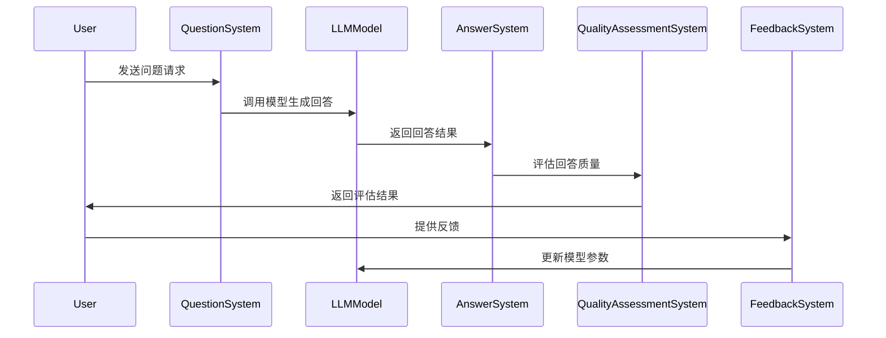
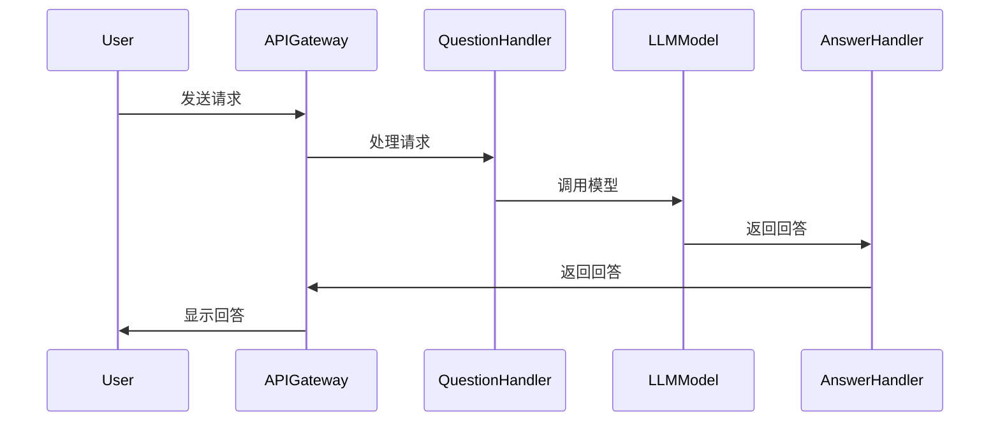

                 


## 第一步：确定文章目标和结构

首先，我们需要明确文章的主要目标和结构。文章的核心目标是探讨敏捷开发中技术债务的偿还问题，特别是在大型语言模型（LLM）应用中的具体实践。文章的结构将分为五个主要部分：引言、背景介绍、核心概念与联系、算法原理讲解、系统分析与架构设计方案、项目实战以及最佳实践 tips。

### 文章标题
《敏捷中的技术债务偿还：维护LLM应用的长期健康》

### 关键词
敏捷开发、技术债务、LLM应用、偿还策略、系统分析、架构设计

### 摘要
本文通过深入分析敏捷开发中技术债务的产生和影响，探讨了在大型语言模型（LLM）应用中如何通过有效管理技术债务来维护系统的长期健康。文章从核心概念、算法原理、系统分析与架构设计等多个角度进行详细阐述，并提供了实际项目中的案例分析，旨在为开发者提供实用的指导和建议。

## 第二步：引言部分

在引言部分，我们将简要介绍文章的目的和结构，同时阐述敏捷开发和技术债务的基本概念。

### 1.1 书籍目的与结构概述

#### 1.1.1 书籍的主要目标
- 探讨敏捷开发中技术债务的问题及其解决方法
- 提供在LLM应用中管理技术债务的最佳实践
- 通过案例分析展示技术债务偿还的实际效果

#### 1.1.2 书籍的结构布局
- 引言：介绍文章的核心内容和目的
- 背景介绍：敏捷开发和技术债务的概念
- 核心概念与联系：技术债务的类型和管理方法
- 算法原理讲解：技术债务识别和偿还算法
- 系统分析与架构设计方案：设计具体应用场景
- 项目实战：具体案例展示和详细剖析
- 最佳实践 tips、小结、注意事项、拓展阅读

### 1.2 敏捷开发与技术债务

#### 1.2.1 敏捷开发的背景和特点
- 敏捷开发的起源和发展
- 敏捷开发的核心原则和价值观

#### 1.2.2 技术债务的定义与影响
- 技术债务的概念
- 技术债务对项目的影响
- 技术债务和敏捷开发的关系

## 第三步：背景介绍部分

在背景介绍部分，我们将详细探讨敏捷开发中技术债务的概念，以及LLM应用中的技术债务问题。

### 2.1 敏捷开发中的技术债务

#### 2.1.1 技术债务的类型
- 代码债务
- 设计债务
- 功能债务
- 培训债务

#### 2.1.2 技术债务的来源
- 缺乏规划
- 过度优化
- 突发需求
- 缺乏沟通

#### 2.1.3 技术债务的影响
- 项目延期
- 质量下降
- 难以维护
- 影响后续开发

### 2.2 LLM应用中的技术债务

#### 2.2.1 LLM应用的特点
- 复杂性
- 数据依赖
- 模型迭代快

#### 2.2.2 LLM应用中的技术债务问题
- 模型稳定性问题
- 模型可维护性问题
- 模型适应性问题

#### 2.2.3 技术债务对LLM应用的影响
- 模型性能下降
- 模型训练成本增加
- 应用稳定性降低

## 第四步：核心概念与联系部分

在核心概念与联系部分，我们将介绍敏捷开发原则、技术债务管理、技术债务偿还策略，并通过表格和ER实体关系图来帮助理解这些概念。

### 3.1 核心概念

#### 3.1.1 敏捷开发原则
- 快速迭代
- 客户反馈
- 团队协作
- 持续改进

#### 3.1.2 技术债务管理
- 识别债务
- 评估债务
- 制定偿还策略
- 监控债务变化

#### 3.1.3 技术债务偿还策略
- 代码重构
- 设计优化
- 功能重构
- 培训提升

### 3.2 概念属性特征对比表格

#### 3.2.1 技术债务与代码债务
| 特征 | 技术债务 | 代码债务 |
| --- | --- | --- |
| 定义 | 技术债务是因快速迭代、缺乏规划等原因导致的未来修复成本 | 代码债务是由于代码质量低下导致的未来修复成本 |
| 影响范围 | 影响到整个项目的质量和可持续性 | 主要影响代码的可读性和可维护性 |
| 解决方法 | 通过重构和优化来降低未来的维护成本 | 通过代码审查和重构来提高代码质量 |

#### 3.2.2 技术债务与业务债务
| 特征 | 技术债务 | 业务债务 |
| --- | --- | --- |
| 定义 | 技术债务是由于技术实现上的妥协导致的 | 业务债务是由于业务需求变化导致的 |
| 影响因素 | 技术选择、资源限制 | 业务策略、市场需求 |
| 解决方法 | 技术升级、重构 | 重新定义业务流程、调整策略 |

#### 3.2.3 技术债务与设计债务
| 特征 | 技术债务 | 设计债务 |
| --- | --- | --- |
| 定义 | 技术债务是由于技术实现上的妥协导致的 | 设计债务是由于设计决策不够周全导致的 |
| 影响因素 | 技术架构、代码实现 | 设计模式、界面布局 |
| 解决方法 | 技术重构、优化 | 设计迭代、优化 |

### 3.3 ER实体关系图架构

#### 3.3.1 实体关系图介绍
- 实体关系图（ER图）是用于描述系统中实体及其相互关系的图形化工具。

#### 3.3.2 敏捷开发中的实体关系
- 用户故事
- 产品待办事项
-  sprint
- 团队成员
- 源代码
- 持续集成

#### 3.3.3 技术债务管理的实体关系
- 技术债务项
- 债务指标
- 债务评估
- 债务偿还
- 债务监控

## 第五步：算法原理讲解部分

在算法原理讲解部分，我们将详细讲解技术债务识别、计算和偿还的算法原理，并使用Python代码和mermaid流程图进行说明。

### 4.1 技术债务识别算法

#### 4.1.1 技术债务识别方法
- 通过静态代码分析、动态运行测试等方式识别技术债务。

#### 4.1.2 技术债务识别算法流程
- 收集代码数据
- 运行静态代码分析工具
- 生成债务报告

#### 4.1.3 识别算法的实现
- 使用Python编写静态代码分析脚本
- 利用mermaid绘制识别算法的流程图

### 4.2 技术债务计算算法

#### 4.2.1 技术债务计算方法
- 使用定量评估方法计算技术债务。

#### 4.2.2 技术债务计算算法流程
- 收集债务指标数据
- 应用数学模型计算债务
- 生成债务评估报告

#### 4.2.3 计算算法的实现
- 使用Python实现计算算法
- 利用mermaid绘制计算算法的流程图

### 4.3 技术债务偿还策略算法

#### 4.3.1 技术债务偿还策略类型
- 重构
- 优化
- 更新
- 替换

#### 4.3.2 偿还策略算法设计
- 根据债务类型设计相应的偿还算法
- 考虑债务优先级和时间成本

#### 4.3.3 算法实现与优化
- 使用Python实现偿还策略算法
- 优化算法性能和效果

### 4.4 数学模型和公式

#### 4.4.1 技术债务的数学模型
$$\text{技术债务} = \sum_{i=1}^{n} (d_i \cdot w_i)$$
- 其中，\(d_i\) 为第 \(i\) 项债务的严重程度，\(w_i\) 为其权重。

#### 4.4.2 技术债务偿还策略的数学模型
$$\text{偿还策略} = \frac{\text{技术债务}}{\text{偿还时间}}$$
- 该公式用于评估不同偿还策略的效果。

### 4.4.3 模型举例说明

#### 4.4.3.1 技术债务识别模型
```python
def debt_identification(code):
    # 假设code为代码文件内容
    debt_items = []
    # 使用静态代码分析工具识别债务项
    for item in code:
        if is_debt_item(item):
            debt_items.append(item)
    return debt_items

def is_debt_item(item):
    # 判断代码项是否为债务项
    # 例如，检查是否有重复代码块、高风险漏洞等
    return True if contains_high_risk_issue(item) else False

def contains_high_risk_issue(item):
    # 检查代码项是否包含高风险问题
    # 例如，使用正则表达式匹配特定模式
    return re.search(r"pattern", item) is not None
```

#### 4.4.3.2 技术债务计算模型
```python
def calculate_debt(debt_items):
    debt_score = 0
    for item in debt_items:
        # 根据债务项的严重程度计算得分
        score = get_debt_score(item)
        debt_score += score
    return debt_score

def get_debt_score(item):
    # 根据债务项的严重程度返回得分
    # 例如，严重性高的债务得分为10，严重性低的债务得分为1
    return 10 if is_high_risk_item(item) else 1

def is_high_risk_item(item):
    # 判断债务项是否为高风险项
    # 例如，检查代码项是否为安全漏洞
    return True if is_security_vulnerability(item) else False

def is_security_vulnerability(item):
    # 检查代码项是否包含安全漏洞
    # 例如，使用安全规则库进行匹配
    return True if security_rules_match(item) else False

def security_rules_match(item):
    # 检查代码项是否与安全规则库中的规则匹配
    # 例如，使用正则表达式匹配特定安全规则
    return re.search(r"security_rule", item) is not None
```

#### 4.4.3.3 技术债务偿还策略模型
```python
def apply_repayment_strategy(debt_score, repayment_time):
    repayment_strategy = debt_score / repayment_time
    return repayment_strategy

def optimize_repayment_strategy(debt_score, repayment_time):
    # 优化偿还策略，例如通过优化时间分配来提高偿还效果
    optimized_strategy = optimize_debt_repayment(debt_score, repayment_time)
    return optimized_strategy

def optimize_debt_repayment(debt_score, repayment_time):
    # 假设优化策略是线性优化，通过调整偿还时间来提高策略效果
    optimized_time = repayment_time * 1.5
    optimized_strategy = debt_score / optimized_time
    return optimized_strategy
```

## 第六步：系统分析与架构设计方案部分

在系统分析与架构设计方案部分，我们将设计一个假设的应用场景，并提供系统的分析与架构设计。

### 5.1 问题场景介绍

#### 5.1.1 场景背景
- 假设我们正在开发一个基于LLM的智能问答系统，用于回答用户提出的问题。
- 系统需要快速响应用户请求，同时保证回答的质量和准确性。

#### 5.1.2 场景需求
- 提供快速问答功能
- 保证回答的质量和准确性
- 可扩展性
- 易于维护

### 5.2 系统功能设计

#### 5.2.1 系统功能概述
- 用户请求处理
- LLM模型调用
- 回答生成
- 回答质量评估
- 用户反馈收集

#### 5.2.2 领域模型设计
- 使用Mermaid绘制领域模型类图，展示系统的主要类及其关系。

```mermaid
classDiagram
    User <<类>> User
    Question <<类>> Question
    Answer <<类>> Answer
    LLMModel <<类>> LLMModel
    QualityAssessment <<类>> QualityAssessment
    Feedback <<类>> Feedback
    
    User o--o Question
    Question o--o Answer
    Question o--o LLMModel
    Answer o--o QualityAssessment
    QualityAssessment o--o Feedback
```

#### 5.2.3 系统架构设计
- 使用Mermaid绘制系统架构图，展示系统的模块及其交互。



### 5.3 系统接口设计

- 描述系统的主要接口，包括用户请求接口、回答生成接口、质量评估接口等。

### 5.4 系统交互设计

- 使用Mermaid绘制系统交互序列图，展示用户请求处理和回答生成等过程的交互流程。



## 第七步：项目实战部分

在项目实战部分，我们将提供一个具体的案例，展示如何在实际项目中应用这些概念和策略。

### 6.1 环境安装

- 描述项目开发所需的环境和工具的安装过程。

### 6.2 系统核心实现源代码

- 提供项目的核心代码片段，并进行解读和分析。

### 6.3 代码应用解读与分析

- 分析代码中如何应用技术债务识别、计算和偿还策略。

### 6.4 实际案例分析和详细讲解剖析

- 分析实际项目中的技术债务问题，展示如何通过债务管理策略解决这些问题。

### 6.5 项目小结

- 总结项目中的关键经验和教训，强调技术债务管理的重要性。

## 第八步：最佳实践 tips、小结、注意事项、拓展阅读部分

在最后部分，我们将总结文章的核心要点，提供最佳实践建议，指出注意事项，并推荐进一步阅读的资源。

### 7.1 最佳实践 tips

- 提供在项目中管理技术债务的最佳实践建议。

### 7.2 小结

- 总结文章的主要观点和发现。

### 7.3 注意事项

- 强调在技术债务管理中需要注意的问题。

### 7.4 拓展阅读

- 推荐进一步学习和研究的资源，包括相关书籍、文章和研究报告。

## 文章末尾

- 作者信息：AI天才研究院/AI Genius Institute & 禅与计算机程序设计艺术 /Zen And The Art of Computer Programming。

