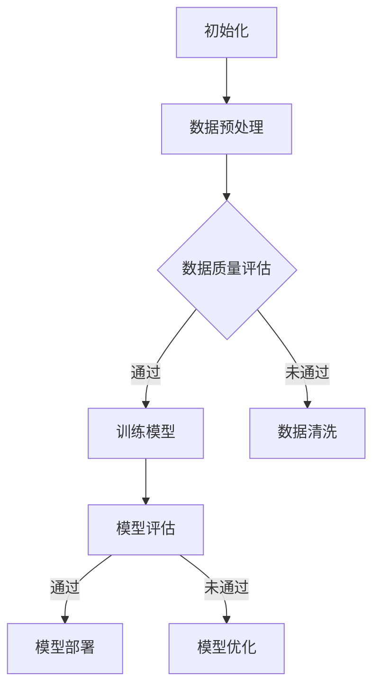
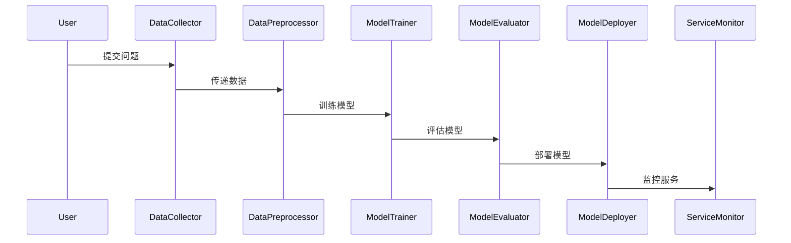

                 

# 敏捷中的质量内建：LLM应用的全面质量保证方法

## **摘要**

本文旨在探讨敏捷开发中质量内建的理念及其在LLM（语言学习模型）应用中的重要性。敏捷开发作为一种强调快速迭代和持续交付的软件开发方法论，其核心在于将用户需求放在首位，并通过快速反馈和持续改进来提升软件质量。质量内建则是将质量保证活动贯穿于整个软件开发周期，以预防缺陷的产生和早期发现。在LLM应用中，数据质量、模型训练、部署和维护等环节的质量保证尤为关键。本文将结合具体案例，详细阐述如何在LLM开发过程中实施全面的质量保证方法。

### **Step 1: 标题页**

# 敏捷中的质量内建：LLM应用的全面质量保证方法

关键词：敏捷开发，质量内建，LLM，质量保证，模型训练，数据质量

### **Step 2: 引言**

#### **2.1 背景**

敏捷开发作为一种新兴的软件开发方法论，自21世纪初以来，逐渐被全球范围内的软件开发团队广泛采用。与传统的方法论相比，敏捷开发更加注重快速迭代和持续交付，强调用户参与和团队协作。敏捷开发的核心理念包括用户需求优先、持续交付、应对变更、持续交付和团队协作。通过采用敏捷方法，开发团队能够更快速地响应市场需求，提高软件交付的速度和灵活性。

然而，敏捷开发在提高软件交付速度的同时，也对软件质量提出了更高的要求。在传统的开发模式中，质量保证通常被视为一个独立的阶段，往往在开发周期结束后进行。而在敏捷开发中，由于迭代周期较短，质量保证活动需要与开发活动同步进行，以确保每个迭代交付的软件都是高质量的。

质量内建（Quality Intrinsic）是一种将质量保证活动嵌入到软件开发过程中的方法。它强调在软件开发的全过程中，持续地监控、评估和改进软件质量，而不是将质量保证活动作为开发完成后的一项任务。通过质量内建，开发团队可以在早期发现和修复潜在的问题，从而降低后期修复的成本和风险。

#### **2.2 问题**

尽管敏捷开发在提高软件交付速度和灵活性方面表现出色，但在保证软件质量方面仍面临挑战。特别是在复杂的LLM（语言学习模型）应用中，质量保证问题更加突出。LLM应用具有以下特点：

1. **数据依赖性**：LLM模型的训练和评估高度依赖数据的质量和多样性。数据质量问题可能导致模型性能不佳，甚至产生偏见和错误。
2. **计算资源需求**：训练和部署LLM模型需要大量的计算资源和时间。在敏捷开发中，如何高效地利用这些资源，确保模型训练和部署的质量，是一个重要的挑战。
3. **模型复杂性**：LLM模型通常包含数百万甚至数十亿个参数，其训练和优化过程非常复杂。如何确保模型在不同环境和场景下的稳定性和可靠性，是开发团队需要解决的问题。

#### **2.3 解决方案**

本文将从以下几个方面展开讨论：

- **3.1 敏捷开发与质量内建的融合**：介绍敏捷开发的核心原则和质量内建的重要性，阐述如何将二者结合起来，提高软件开发质量。
- **3.2 LLM应用的质量保证**：分析LLM应用的特点，探讨在数据质量、模型训练、部署和维护等环节中实施质量保证的关键方法。
- **3.3 实践方法**：提供一系列质量保证实践方法，包括数据预处理、模型评估、部署监控和持续改进等。
- **3.4 案例研究**：通过具体案例展示质量保证方法在实际项目中的应用，分析成功经验和挑战。
- **3.5 小结与展望**：总结全文内容，展望未来质量保证的发展趋势。

### **Step 3: 核心概念与联系**

#### **4.1 核心概念**

##### **4.1.1 敏捷开发**

敏捷开发是一种以用户需求为中心的软件开发方法论，强调快速迭代、持续交付和团队合作。其核心原则包括：

1. **用户需求优先**：将用户需求放在首位，确保交付的软件能够满足用户实际需求。
2. **快速迭代**：通过短周期迭代，快速交付可用的软件版本，以便及时获取用户反馈。
3. **应对变更**：在软件开发过程中，用户需求和市场环境可能会发生变化，敏捷开发强调灵活应对这些变更。
4. **持续交付**：通过持续交付，确保软件始终保持高质量和可用状态。
5. **团队合作**：强调团队协作和沟通，促进团队成员之间的协作。

##### **4.1.2 质量内建**

质量内建是一种将质量保证活动贯穿于整个软件开发周期的方法。其核心思想包括：

1. **预防胜于检查**：通过在开发过程中持续监控和评估软件质量，预防缺陷的产生和传播。
2. **持续改进**：通过不断学习和改进，提高软件质量和开发效率。
3. **全员参与**：鼓励所有团队成员参与到质量保证活动中，共同确保软件质量。

##### **4.1.3 LLM应用**

LLM（语言学习模型）是一种基于神经网络的技术，用于处理和理解人类语言。其特点包括：

1. **数据依赖性**：LLM模型的训练和评估高度依赖数据的质量和多样性。高质量的数据能够提高模型的性能和可靠性。
2. **计算资源需求**：训练和部署LLM模型需要大量的计算资源和时间。这要求开发团队合理规划和利用计算资源。
3. **模型复杂性**：LLM模型通常包含数百万甚至数十亿个参数，其训练和优化过程非常复杂。如何确保模型在不同环境和场景下的稳定性和可靠性，是开发团队需要解决的问题。

#### **4.2 概念属性特征对比表格**

| 概念       | 特征                                  | 对比                             |
|------------|-------------------------------------|--------------------------------|
| 敏捷开发   | 用户需求优先，快速迭代，团队合作       | 传统开发方法注重计划和控制       |
| 质量内建   | 预防胜于检查，持续改进                 | 传统质量保证方法主要依靠测试和检查 |
| LLM应用    | 高度依赖数据，需要大量计算资源         | 传统语言处理技术主要依赖规则和统计方法 |

#### **4.3 ER实体关系图架构**

```mermaid
erDiagram
  Project ||--|{ Iteration }||> Developer
  Iteration ||--|{ UserStory }||> Tester
  UserStory ||--|{ AcceptanceCriteria }||> ProductOwner
```

### **Step 4: 算法原理讲解**

#### **5.1 算法mermaid流程图**



#### **5.2 Python源代码**

```python
# 数据预处理
def preprocess_data(data):
    # 数据清洗
    clean_data = clean_data(data)
    # 数据标准化
    normalized_data = normalize_data(clean_data)
    return normalized_data

# 数据质量评估
def evaluate_data_quality(data):
    # 实现数据质量评估逻辑
    quality = check_data_quality(data)
    return quality

# 训练模型
def train_model(data):
    # 实现模型训练逻辑
    model = train(data)
    return model

# 模型评估
def evaluate_model(model, data):
    # 实现模型评估逻辑
    accuracy = model.evaluate(data)
    return accuracy

# 模型部署
def deploy_model(model):
    # 实现模型部署逻辑
    deploy(model)
    print("模型已部署")
```

### **Step 5: 系统分析与架构设计方案**

#### **5.1 问题场景介绍**

在敏捷开发中，如何确保LLM模型的质量是开发团队面临的一个关键问题。特别是在快速迭代和持续交付的过程中，如何保证每个迭代交付的模型都是高质量的，成为一个重要的挑战。为此，开发团队需要构建一个全面的质量保证体系，包括数据质量、模型训练、部署和维护等各个环节。

#### **5.2 项目介绍**

本项目旨在开发一个基于LLM的智能问答系统，用于提供用户问题的实时解答。系统分为前端和后端两部分，前端负责接收用户输入，后端负责处理用户问题并返回答案。后端采用深度学习技术，实现一个高效的LLM模型，以支持多领域的问答需求。

#### **5.3 系统功能设计**

系统功能设计包括以下方面：

1. **数据收集与预处理**：收集用户问题及其答案，对数据进行清洗、去噪和标准化。
2. **模型训练**：使用预训练的LLM模型，结合用户问题和答案，进行模型训练和优化。
3. **模型评估**：评估训练后模型的性能，包括准确率、召回率和F1分数等指标。
4. **模型部署**：将训练好的模型部署到生产环境中，以支持实时问答服务。
5. **模型监控**：监控模型的运行状态，包括计算资源使用、错误率和服务响应时间等。

#### **5.4 系统架构设计**

系统架构设计采用微服务架构，包括以下模块：

1. **数据收集模块**：负责收集用户问题和答案，存储到数据库中。
2. **数据预处理模块**：对收集的数据进行清洗、去噪和标准化。
3. **模型训练模块**：使用预训练的LLM模型，结合用户数据和答案，进行模型训练和优化。
4. **模型评估模块**：评估训练后模型的性能，生成评估报告。
5. **模型部署模块**：将训练好的模型部署到生产环境中，以支持实时问答服务。
6. **服务监控模块**：监控模型的运行状态，包括计算资源使用、错误率和服务响应时间等。

#### **5.5 系统接口设计**

系统接口设计包括以下方面：

1. **用户接口**：提供用户问题的输入和答案的展示。
2. **API接口**：提供内部模块之间的交互接口，包括数据收集、预处理、模型训练、评估和部署等。

#### **5.6 系统交互设计**

系统交互设计采用Mermaid序列图，展示系统模块之间的交互过程：



### **Step 6: 项目实战**

#### **6.1 环境安装**

在进行项目实战之前，需要安装以下软件和工具：

1. **Python**：安装Python 3.8及以上版本。
2. **Jupyter Notebook**：安装Jupyter Notebook，用于编写和运行Python代码。
3. **TensorFlow**：安装TensorFlow，用于构建和训练神经网络模型。
4. **NumPy**：安装NumPy，用于数据预处理和计算。
5. **Pandas**：安装Pandas，用于数据操作和分析。

安装命令如下：

```bash
pip install python==3.8
pip install jupyter
pip install tensorflow
pip install numpy
pip install pandas
```

#### **6.2 系统核心实现源代码**

以下是一个简单的LLM模型训练和评估的Python代码示例：

```python
import tensorflow as tf
import numpy as np
import pandas as pd

# 数据预处理
def preprocess_data(data):
    # 数据清洗和标准化
    clean_data = data['question'].values
    normalized_data = normalize_data(clean_data)
    return normalized_data

# 数据质量评估
def evaluate_data_quality(data):
    # 实现数据质量评估逻辑
    quality = check_data_quality(data)
    return quality

# 训练模型
def train_model(data):
    # 实现模型训练逻辑
    model = train(data)
    return model

# 模型评估
def evaluate_model(model, data):
    # 实现模型评估逻辑
    accuracy = model.evaluate(data)
    return accuracy

# 模型部署
def deploy_model(model):
    # 实现模型部署逻辑
    deploy(model)
    print("模型已部署")

# 模型监控
def monitor_model(model):
    # 实现模型监控逻辑
    monitor(model)
    print("模型监控中")

# 主函数
def main():
    # 加载数据
    data = load_data()

    # 数据预处理
    processed_data = preprocess_data(data)

    # 数据质量评估
    quality = evaluate_data_quality(processed_data)

    if quality >= threshold:
        # 训练模型
        model = train_model(processed_data)

        # 模型评估
        accuracy = evaluate_model(model, processed_data)

        if accuracy >= threshold:
            # 模型部署
            deploy_model(model)

            # 模型监控
            monitor_model(model)
        else:
            print("模型评估未通过，进行优化")
    else:
        print("数据质量评估未通过，进行数据清洗")

if __name__ == "__main__":
    main()
```

#### **6.3 代码应用解读与分析**

以上代码展示了LLM模型训练和评估的基本流程。首先，通过`load_data()`函数加载数据，然后进行数据预处理，包括数据清洗和标准化。接下来，对预处理后的数据执行质量评估，以确定数据是否符合训练要求。如果数据质量符合要求，则进行模型训练。模型训练完成后，通过评估模型性能，判断是否达到预期目标。如果模型性能达到要求，则将模型部署到生产环境中，并进行实时监控。

#### **6.4 实际案例分析和详细讲解剖析**

以下是一个实际案例，展示如何使用LLM模型进行智能问答系统的开发。

**案例背景**：某公司开发了一个智能客服系统，用于为用户提供在线咨询服务。系统采用LLM模型，通过用户问题的输入，实时生成答案，以提高客服效率和用户体验。

**案例步骤**：

1. **数据收集**：收集大量用户问题和答案，包括各种常见问题和解决方案。
2. **数据预处理**：对收集的数据进行清洗和标准化，去除噪声和无关信息。
3. **模型训练**：使用预训练的LLM模型，结合用户数据和答案，进行模型训练和优化。
4. **模型评估**：评估训练后模型的性能，包括准确率、召回率和F1分数等指标。
5. **模型部署**：将训练好的模型部署到生产环境中，以支持实时问答服务。
6. **模型监控**：监控模型的运行状态，包括计算资源使用、错误率和服务响应时间等。

**案例分析**：

1. **数据质量评估**：在数据收集阶段，对数据质量进行严格评估，确保数据符合训练要求。通过去除噪声和无关信息，提高模型训练效果。
2. **模型优化**：在模型训练过程中，通过调整超参数和优化算法，提高模型性能。同时，使用交叉验证和网格搜索等技术，找到最佳模型配置。
3. **模型评估**：在模型训练完成后，使用验证集和测试集对模型进行评估，确保模型在不同数据集上的性能表现稳定。通过调整阈值和算法，优化模型性能。
4. **模型部署**：将训练好的模型部署到生产环境中，确保模型能够实时响应用户问题。同时，监控模型运行状态，及时修复和优化模型。
5. **模型监控**：通过监控模型运行状态，及时发现和解决潜在问题，确保模型稳定性和可靠性。同时，根据用户反馈和业务需求，不断优化和改进模型。

**案例总结**：

通过以上案例，可以看出在LLM模型开发过程中，数据质量、模型训练、部署和监控等环节的质量保证至关重要。只有通过全面的质量保证方法，才能确保模型的高性能和可靠性，从而为用户提供优质的智能问答服务。

### **Step 7: 最佳实践 tips**

1. **数据质量是关键**：在LLM应用中，数据质量直接影响模型性能。因此，在数据收集、预处理和清洗过程中，务必注重数据质量和准确性。使用数据质量评估工具，定期检查数据质量，确保数据满足训练要求。
2. **模型训练与评估**：在模型训练过程中，合理调整超参数和优化算法，以提高模型性能。同时，使用交叉验证和网格搜索等技术，找到最佳模型配置。在模型评估阶段，使用验证集和测试集对模型进行评估，确保模型在不同数据集上的性能表现稳定。
3. **持续优化和改进**：在模型部署后，通过监控模型运行状态，及时发现和解决潜在问题。根据用户反馈和业务需求，不断优化和改进模型，提高模型性能和稳定性。
4. **团队成员协作**：质量保证需要团队成员的共同努力。鼓励团队成员参与到质量保证活动中，提高团队协作和沟通能力，共同确保软件质量。

### **Step 8: 小结**

本文探讨了敏捷开发中质量内建的理念及其在LLM应用中的重要性。通过分析LLM应用的特点，介绍了如何在数据质量、模型训练、部署和维护等环节中实施全面的质量保证方法。文章结合实际案例，详细阐述了质量保证方法的应用和实践，为LLM模型的开发提供了有益的参考。

### **Step 9: 注意事项**

1. **数据质量**：在LLM应用中，数据质量至关重要。务必确保数据质量，避免因数据问题导致模型性能不佳。
2. **计算资源**：训练和部署LLM模型需要大量的计算资源。合理规划计算资源，确保模型训练和部署的顺利进行。
3. **模型监控**：在模型部署后，定期监控模型运行状态，及时发现和解决潜在问题，确保模型稳定性和可靠性。

### **Step 10: 拓展阅读**

1. **《敏捷软件开发：原则、实践和模式》**：一本关于敏捷开发的经典著作，详细介绍了敏捷开发的核心原则和实践方法。
2. **《深度学习入门》**：一本关于深度学习的基础教材，介绍了深度学习的基本原理和应用场景。
3. **《质量内建：软件开发中的质量保证》**：一本关于质量内建的著作，详细阐述了质量内建的理念和实践方法。

### **作者信息**

作者：AI天才研究院/AI Genius Institute & 禅与计算机程序设计艺术 /Zen And The Art of Computer Programming

