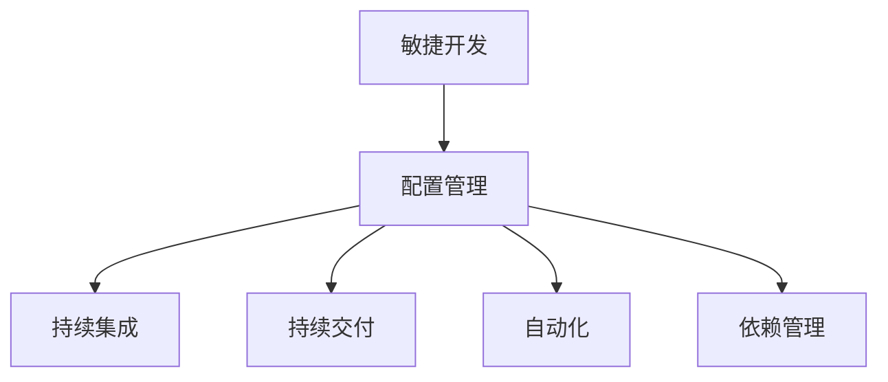

                 

# 敏捷中的配置管理：管理LLM应用的复杂依赖

关键词：敏捷开发、配置管理、持续集成、持续交付、自动化、依赖管理

摘要：本文将探讨在敏捷开发环境中进行配置管理的重要性，以及如何通过最佳实践和工具技术解决复杂依赖问题。本文首先介绍了敏捷开发和配置管理的背景和核心概念，随后详细讨论了敏捷配置管理的基本原理、最佳实践、工具和技术，最后分析了敏捷配置管理的挑战和实践，为开发者提供了实用的指导。

## 1. 背景介绍

### 1.1 问题背景

配置管理是软件开发和维护中不可或缺的一部分。随着敏捷开发方法在软件开发领域的广泛应用，传统的配置管理方法已不再适用。敏捷开发强调快速迭代、持续交付和客户满意度，这对配置管理的效率和灵活性提出了更高的要求。然而，在敏捷开发中，如何有效地进行配置管理仍然是一个挑战。

### 1.2 问题描述

敏捷开发中的配置管理面临以下问题：

- 快速迭代的节奏使得配置变化频繁，如何确保配置的一致性和稳定性？
- 多个项目、多团队的协同开发，如何确保各个团队之间的配置同步？
- 高度动态的环境和依赖关系，如何快速定位和解决问题？
- 如何平衡配置管理的灵活性和控制性？

### 1.3 问题解决

本书旨在提供一套敏捷开发中的配置管理解决方案，包括：

- 敏捷配置管理的基本原理和最佳实践
- 配置管理工具和技术选择
- 配置管理流程和策略设计
- 配置管理的自动化和持续集成

### 1.4 边界与外延

本书讨论的范围主要涵盖以下方面：

- 敏捷开发方法的基本概念和实践
- 配置管理的基本原理和方法
- 常见的配置管理工具和技术
- 敏捷开发中的配置管理挑战和实践

## 2. 核心概念与联系

### 2.1 核心概念

本书涉及的核心概念包括：

- 敏捷开发
- 配置管理
- 持续集成
- 持续交付
- 自动化
- 依赖管理

### 2.2 概念属性特征对比表格

| 概念          | 定义                                                         | 属性特征对比 |
|---------------|--------------------------------------------------------------|-------------|
| 敏捷开发      | 一种以人为核心、迭代、互动和适应性强的软件开发方法         |             |
| 配置管理      | 管理软件开发过程中所有配置项的过程                      |             |
| 持续集成      | 将代码频繁地合并到主干分支，快速发现和解决问题           |             |
| 持续交付      | 自动化部署和交付代码，确保软件始终处于可部署状态       |             |
| 自动化        | 使用工具和脚本自动化软件开发过程中的重复任务             |             |
| 依赖管理      | 管理项目中各种依赖关系，确保依赖项的正确性和一致性     |             |

### 2.3 概念关系图

## 3. 敏捷开发中的配置管理

### 3.1 敏捷配置管理的基本原理

敏捷配置管理强调灵活性和快速响应变化，以下是其核心原则：

- 配置项的快速迭代：频繁发布和版本控制
- 配置项的全生命周期管理：从需求到部署的整个流程
- 配置项的可见性和透明性：团队成员可以轻松访问和了解配置项
- 配置项的版本控制：确保配置项的可追溯性和可恢复性

### 3.2 敏捷配置管理的最佳实践

以下是一些敏捷配置管理的最佳实践：

- 采用版本控制系统：如Git，确保代码和配置项的版本管理
- 实施自动化测试：确保配置项的正确性和稳定性
- 使用持续集成/持续交付（CI/CD）工具：如Jenkins，实现自动化构建、测试和部署
- 保持配置项的简化和标准化：减少配置项的复杂度，提高维护效率
- 定期进行配置审核：确保配置项的一致性和准确性

### 3.3 敏捷配置管理工具和技术

以下是一些常用的敏捷配置管理工具和技术：

- 版本控制系统：如Git、SVN等
- 配置管理工具：如Ansible、Puppet等
- 持续集成工具：如Jenkins、Travis CI等
- 持续交付工具：如Docker、Kubernetes等

## 4. 敏捷配置管理的挑战和实践

### 4.1 敏捷配置管理的挑战

敏捷配置管理面临以下挑战：

- 高度动态的环境：频繁的变更和迭代导致环境不稳定
- 多团队协作：如何确保多个团队之间的配置同步
- 配置项的复杂性：如何简化配置项，提高可维护性
- 自动化：如何有效地实现配置项的自动化管理

### 4.2 敏捷配置管理的实践

为了解决敏捷配置管理的挑战，可以采取以下实践：

- 实施持续集成和持续交付：自动化构建、测试和部署，确保配置项的一致性和稳定性
- 建立明确的配置管理流程：定义配置项的管理规范，确保团队之间的协作顺畅
- 采用配置管理工具：使用Ansible、Puppet等工具简化配置管理流程
- 定期进行配置审核：检查配置项的一致性和准确性，确保项目的稳定性

### 4.3 案例分析

以一个大型人工智能语言模型（LLM）项目为例，该项目涉及多个团队、多个模块和多种依赖关系。为了实现敏捷配置管理，项目团队采取了以下措施：

- 采用Git进行版本控制：确保代码和配置项的版本管理
- 使用Ansible进行自动化部署：简化部署流程，提高部署效率
- 实施持续集成和持续交付：自动化构建、测试和部署，确保项目的稳定性
- 建立明确的配置管理流程：确保团队之间的协作顺畅，配置项的一致性和准确性

通过以上措施，项目团队成功实现了敏捷配置管理，提高了项目的开发效率和稳定性。

## 5. 总结与展望

本文探讨了敏捷开发中的配置管理问题，提出了解决方案和实践方法。敏捷配置管理的关键在于灵活性和快速响应变化，通过采用版本控制系统、配置管理工具、持续集成和持续交付等技术，可以有效地解决配置管理的挑战。

未来，随着敏捷开发方法的进一步普及，配置管理将变得更加重要。开发者应持续关注配置管理技术的发展，不断完善配置管理策略和实践，以提高项目的开发效率和质量。

作者：AI天才研究院/AI Genius Institute & 禅与计算机程序设计艺术 /Zen And The Art of Computer Programming

（完）

