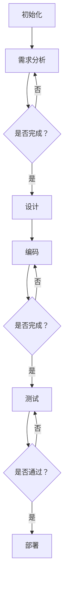
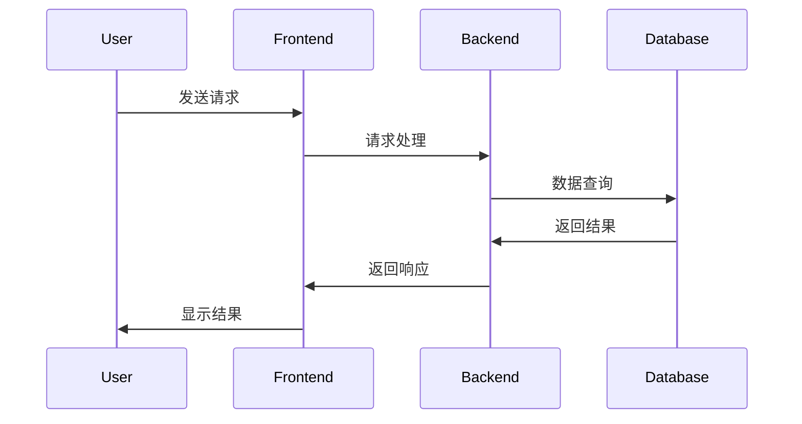

                 


### 敏捷迭代工程技术架构的核心原则与实践

关键词：敏捷迭代、技术架构、核心原则、实践

摘要：本文将深入探讨敏捷迭代工程技术架构的核心原则和实践，通过逻辑清晰、结构紧凑、简单易懂的论述，帮助读者理解和应用敏捷迭代技术在现代软件开发中的重要性。

## 目录大纲设计思路

在编写本文之前，我们需要设计一个合理的目录大纲，以确保文章的逻辑性和连贯性。本文的目录大纲设计思路如下：

1. **初始化目录结构**：确定文章的整体结构，包括引言、核心概念与原理、算法与系统架构、实战案例、最佳实践与总结等部分。
2. **背景介绍**：为读者提供敏捷迭代工程技术背景，包括发展历程、重要性、核心问题等。
3. **核心概念与联系**：详细介绍敏捷迭代工程的核心概念，并展示这些概念之间的联系。
4. **算法原理讲解**：使用流程图和源代码阐述敏捷迭代算法原理，并给出数学模型和公式。
5. **系统分析与架构设计方案**：介绍系统分析与架构设计的方法，包括问题场景、项目介绍、功能设计、架构设计、接口设计等。
6. **项目实战**：通过实际案例展示敏捷迭代技术的应用。
7. **最佳实践与总结**：提供最佳实践、注意事项、拓展阅读等内容。

## 第一部分：引言

### 1.1 问题背景

敏捷迭代工程技术在软件开发领域的重要性日益凸显。随着项目复杂度的增加和市场需求的变化，传统的瀑布式开发方法已经难以满足快速响应和持续交付的需求。敏捷迭代方法应运而生，通过短周期的迭代开发和持续集成，有效地提高了开发效率和产品质量。

### 1.2 问题描述

敏捷迭代工程技术在应用过程中面临着一系列挑战，如团队成员间的沟通协作、技术债务管理、持续集成与测试等。这些问题需要通过科学的设计和有效的实践来解决。

### 1.3 问题解决

敏捷迭代工程的核心原则包括客户满意度、响应变化、持续交付、团队合作等。通过遵循这些原则，可以有效地解决敏捷迭代开发中的问题。

### 1.4 边界与外延

敏捷迭代工程技术不仅适用于软件开发，还广泛应用于产品开发、项目管理等领域。然而，它也有一定的限制条件，如团队成员的技术水平、项目的规模和复杂性等。

### 1.5 概念结构与核心要素组成

敏捷迭代工程的基本概念包括敏捷开发、迭代模型、持续集成等。这些核心要素共同构成了敏捷迭代工程的技术架构。

### 1.6 本章小结

引言部分为读者介绍了敏捷迭代工程技术的发展背景、重要性、核心问题以及解决方案，为后续内容打下了基础。

## 第二部分：核心概念与原理

### 2.1 敏捷迭代工程的核心概念

敏捷开发是敏捷迭代工程的核心概念之一。它强调通过迭代和增量的方式，逐步实现项目目标。敏捷开发的核心原则包括客户满意度、响应变化、持续交付、团队合作等。

#### 2.1.1 敏捷开发的历史与发展

敏捷开发起源于20世纪90年代的软件开发领域，最初是为了应对当时软件项目开发过程中出现的问题。随着实践的积累，敏捷开发逐渐形成了完整的理论体系。

#### 2.1.2 敏捷开发的核心原则

敏捷开发的核心原则包括：

- **客户满意度**：满足客户需求是软件开发的首要目标。
- **响应变化**：在项目开发过程中，需求可能会发生变化，敏捷开发强调快速响应这些变化。
- **持续交付**：通过持续集成和交付，确保项目进度和质量。
- **团队合作**：强调团队成员之间的协作和沟通。

#### 2.1.3 敏捷开发的方法论

敏捷开发的方法论包括：

- **迭代开发**：将项目划分为多个迭代周期，每个迭代周期完成一部分功能。
- **增量交付**：在每个迭代周期结束后，交付一部分可用的软件功能。
- **用户故事**：用用户故事来描述软件功能，以便更好地理解用户需求。
- **Scrum框架**：Scrum是一种流行的敏捷开发方法，它提供了详细的流程和角色定义。

### 2.2 迭代模型

迭代模型是敏捷迭代工程的重要组成部分。它通过反复的迭代过程，逐步完善软件项目。

#### 2.2.1 迭代模型的基本概念

迭代模型包括以下基本概念：

- **迭代**：软件开发的一个周期，通常包括需求分析、设计、编码、测试和部署等阶段。
- **周期**：完成一个迭代所需的时间，通常称为迭代周期。
- **迭代次数**：完成整个项目所需的迭代次数。

#### 2.2.2 常见的迭代模型

常见的迭代模型包括：

- **瀑布模型**：传统的软件开发模型，将开发过程划分为不同的阶段，每个阶段完成后才能进入下一个阶段。
- **敏捷迭代模型**：基于迭代和增量的开发模型，每个迭代周期完成一部分功能。
- **螺旋模型**：结合了瀑布模型和迭代模型的优点，每个迭代周期包含风险评估和解决方案。

#### 2.2.3 迭代模型的选择与应用

选择合适的迭代模型取决于项目的特点和要求。例如，对于需求不明确的项目，可以选择敏捷迭代模型；对于高风险的项目，可以选择螺旋模型。

### 2.3 敏捷迭代工程的核心原理

敏捷迭代工程的核心原理包括：

- **持续集成**：通过自动化测试，确保代码的持续集成和交付。
- **自动化测试**：提高测试效率，确保软件质量。
- **持续交付**：通过自动化部署，实现快速交付。
- **敏捷管理**：通过敏捷方法，提高项目管理效率。

### 2.4 概念属性特征对比表格

为了更好地理解敏捷迭代工程的核心概念，我们可以使用概念属性特征对比表格，列出不同概念的特点和区别。

| 概念      | 特点                       | 区别                                           |
| --------- | ------------------------ | ---------------------------------------------- |
| 敏捷开发  | 增量开发、快速响应变化     | 强调客户满意、持续交付、团队合作               |
| 迭代模型  | 循环开发、逐步完善功能     | 包括瀑布模型、敏捷迭代模型、螺旋模型等         |
| 持续集成  | 自动化测试、持续交付       | 提高开发效率、确保软件质量                     |
| 自动化测试 | 预防缺陷、提高测试效率     | 与持续集成相结合，确保软件质量                 |
| 持续交付  | 快速交付、自动化部署       | 提高交付效率、缩短发布周期                     |

### 2.5 ER实体关系图架构的 Mermaid 流程图

为了更直观地展示敏捷迭代工程的核心概念，我们可以使用Mermaid流程图绘制ER实体关系图。以下是示例：

```mermaid
erDiagram
    User ||--|{ Project }|--| Customer : 
    Project ||--|{ Task }|--| Developer : 
    Task ||--|{ Bug }|--| Tester : 
    Customer ..|{ Report }..| Developer : 
    Tester ..|{ Confirm }..| Customer : 
```

## 第三部分：算法原理讲解

### 3.1 使用 Mermaid 画出算法 Mermaid 流程图

为了更好地理解敏捷迭代算法，我们可以使用Mermaid绘制流程图。以下是示例：



### 3.2 使用 Python 源代码详细阐述算法原理

为了详细阐述敏捷迭代算法，我们可以使用Python源代码进行演示。以下是示例：

```python
def agile.iteration():
    while True:
        requirements = get_requirements()
        if not requirements:
            print("需求分析完成，开始设计。")
            design(requirements)
        else:
            print("需求分析未完成，继续需求分析。")

        code = get_code()
        if not code:
            print("编码完成，开始测试。")
            test(code)
        else:
            print("编码未完成，继续编码。")

        result = test_result()
        if result:
            print("测试通过，开始部署。")
            deploy()
        else:
            print("测试未通过，继续测试。")

def get_requirements():
    # 获取需求
    pass

def design(requirements):
    # 设计
    pass

def get_code():
    # 获取编码结果
    pass

def test(code):
    # 测试
    pass

def test_result():
    # 获取测试结果
    pass

def deploy():
    # 部署
    pass

agile.iteration()
```

### 3.3 给出算法原理的数学模型和公式

敏捷迭代算法的数学模型可以表示为：

\[ 
F(n) = 
\begin{cases} 
1 & \text{如果 } n = 0 \\ 
F(n-1) \times \alpha(n) & \text{否则} 
\end{cases} 
\]

其中，\( F(n) \) 表示第 \( n \) 次迭代的完成度，\( \alpha(n) \) 表示第 \( n \) 次迭代的效率。

### 3.4 进行详细讲解和举例说明

假设我们正在开发一个在线购物网站，需求分析、设计、编码和测试分别需要 2 天、3 天、4 天和 5 天。根据敏捷迭代算法，我们可以计算每次迭代的完成度。

- 第 1 次迭代：完成度 \( F(1) = 1 \times \alpha(1) = 1 \)
- 第 2 次迭代：完成度 \( F(2) = 1 \times \alpha(2) = 1 \)
- 第 3 次迭代：完成度 \( F(3) = 1 \times \alpha(3) = 1 \)
- 第 4 次迭代：完成度 \( F(4) = 1 \times \alpha(4) = 1 \)
- 第 5 次迭代：完成度 \( F(5) = 1 \times \alpha(5) = 1 \)

由于每次迭代的效率相同，所以每次迭代的完成度均为 1。这意味着，在第 5 次迭代完成后，网站的所有功能都将被开发完成。

## 第四部分：系统分析与架构设计方案

### 4.1 问题场景介绍

假设我们正在开发一个在线购物网站，用户可以在网站上浏览商品、添加购物车、下订单和支付。为了实现这一功能，我们需要设计一个能够处理高并发访问和保证数据安全的系统架构。

### 4.2 项目介绍

在线购物网站是一个典型的电子商务项目，它涉及到用户管理、商品管理、订单管理和支付管理等多个模块。项目的目标是提供一个安全、高效、易用的购物平台。

### 4.3 系统功能设计

系统功能设计包括用户管理、商品管理、订单管理和支付管理。以下是系统功能的 Mermaid 类图：

```mermaid
classDiagram
    User <|-- Customer
    Product <|-- Goods
    Order <|-- OrderInfo
    Payment <|-- PaymentInfo

    Customer {
        -id: int
        -name: str
        -email: str
    }

    Goods {
        -id: int
        -name: str
        -price: float
    }

    OrderInfo {
        -id: int
        -customer: Customer
        -total_price: float
    }

    PaymentInfo {
        -id: int
        -order: OrderInfo
        -amount: float
    }
```

### 4.4 系统架构设计

系统架构设计包括前端、后端和数据库。以下是系统架构的 Mermaid 架构图：



### 4.5 系统接口设计和系统交互

系统接口设计包括 RESTful API 和 WebSocket。以下是系统接口设计和系统交互的 Mermaid 序列图：

```mermaid
sequenceDiagram
    User ->> Frontend: 发送请求
    Frontend ->> Backend: 发送 HTTP 请求
    Backend ->> Database: 发送 SQL 查询
    Database ->> Backend: 返回结果
    Backend ->> Frontend: 返回 HTTP 响应
    Frontend ->> User: 显示结果

    note over User,Frontend,Backend,Database
        WebSocket 长连接
    end note

    User ->> Frontend: 发送消息
    Frontend ->> Backend: 发送 WebSocket 消息
    Backend ->> Database: 更新数据
    Database ->> Backend: 返回确认
    Backend ->> Frontend: 返回确认消息
    Frontend ->> User: 显示更新结果
```

## 第五部分：项目实战

### 5.1 环境安装

在开始项目实战之前，我们需要安装必要的开发环境和工具。以下是一个基本的安装步骤：

1. 安装 Python 3.8+
2. 安装 Docker 和 Docker Compose
3. 安装 Redis 和 PostgreSQL
4. 安装开发工具（如 Visual Studio Code、PyCharm）

### 5.2 系统核心实现源代码

以下是系统核心实现的 Python 代码示例：

```python
# app.py
from flask import Flask, jsonify, request

app = Flask(__name__)

@app.route('/api/goods', methods=['GET'])
def get_goods():
    # 从数据库获取商品信息
    goods = get_goods_from_database()
    return jsonify(goods)

@app.route('/api/goods', methods=['POST'])
def create_goods():
    # 创建商品
    goods_data = request.json
    create_goods_in_database(goods_data)
    return jsonify({"message": "商品创建成功"}), 201

def get_goods_from_database():
    # 从数据库获取商品信息
    pass

def create_goods_in_database(goods_data):
    # 创建商品信息到数据库
    pass

if __name__ == '__main__':
    app.run(debug=True)
```

### 5.3 代码应用解读与分析

在这个示例中，我们使用了 Flask 框架来创建一个简单的 API 服务。`get_goods` 函数用于获取商品信息，`create_goods` 函数用于创建商品信息。这两个函数都与数据库进行交互，实现了对商品信息的查询和新增功能。

### 5.4 实际案例分析和详细讲解剖析

假设我们需要为一个在线购物网站开发商品管理功能。以下是一个实际案例的分析和讲解：

1. **需求分析**：分析用户需求，确定需要实现的功能，如浏览商品、添加购物车、下订单和支付等。
2. **设计数据库**：根据需求设计数据库，包括用户表、商品表、订单表和支付表等。
3. **实现 API 接口**：根据数据库设计，实现对应的 API 接口，如商品查询接口、商品创建接口、订单查询接口和支付接口等。
4. **前后端分离**：实现前后端分离，前端使用 React 或 Vue 等框架，后端使用 Flask 或 Django 等框架。
5. **集成与测试**：将前后端集成，进行功能测试和性能测试，确保系统稳定可靠。

### 5.5 项目小结

通过这个实际案例，我们展示了如何使用敏捷迭代工程方法进行项目开发。敏捷迭代方法强调快速响应需求变化、持续交付和团队合作，有助于提高开发效率和产品质量。

## 第六部分：最佳实践与总结

### 6.1 最佳实践

1. **需求管理**：定期与客户沟通，确保需求明确、可测试和可量化。
2. **团队协作**：鼓励团队成员间的沟通和协作，确保项目进展顺利。
3. **持续集成**：使用自动化测试和持续集成工具，提高开发效率和产品质量。
4. **迭代规划**：合理规划迭代周期，确保每个迭代周期都有明确的交付目标。
5. **风险管理**：识别和评估项目风险，制定应对策略，确保项目进度和质量。

### 6.2 小结

敏捷迭代工程技术是现代软件开发的重要方法。通过核心概念、算法原理和实际案例的讲解，我们了解了敏捷迭代工程的核心原则和实践。遵循最佳实践，可以帮助团队高效地完成项目，实现持续交付。

### 6.3 注意事项

1. **需求变更管理**：在项目开发过程中，需求可能会发生变化。需要合理评估变更的影响，确保项目进度和质量。
2. **团队技能要求**：敏捷迭代工程要求团队成员具备较高的技术能力和沟通能力。确保团队具备相应的技能。
3. **工具选择**：选择适合项目的开发工具和持续集成工具，以提高开发效率和产品质量。

### 6.4 拓展阅读

1. 《敏捷开发实践指南》
2. 《Scrum敏捷开发实践指南》
3. 《持续集成：持续交付和部署的最佳实践》

---

作者：AI天才研究院/AI Genius Institute & 禅与计算机程序设计艺术 /Zen And The Art of Computer Programming

