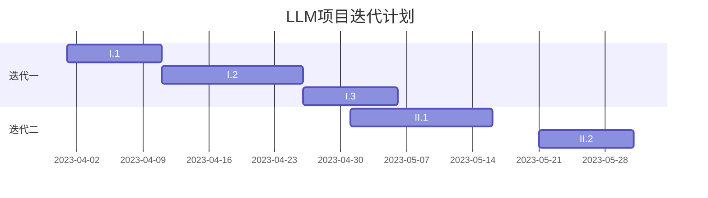
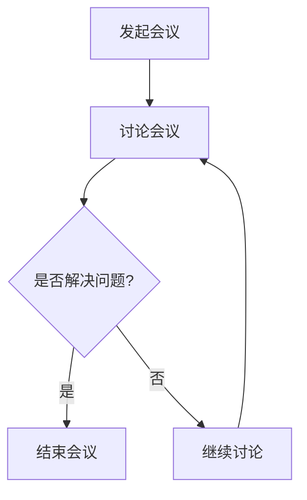
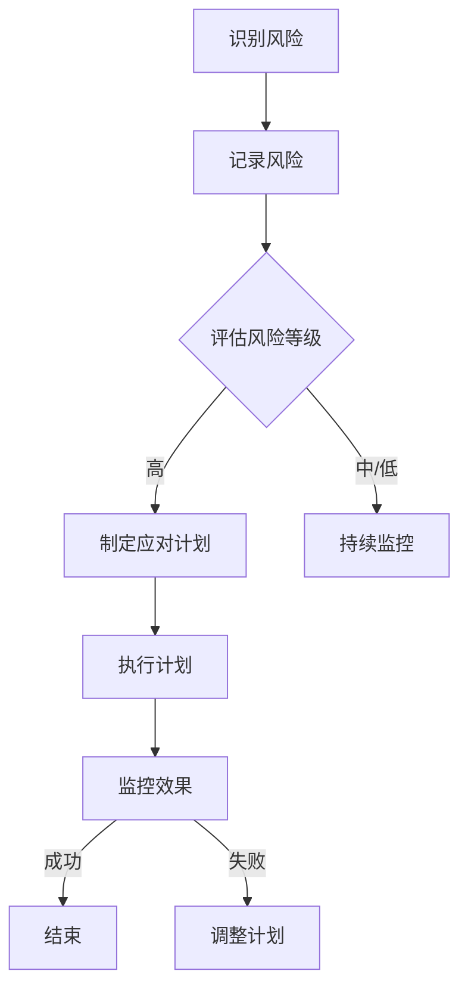
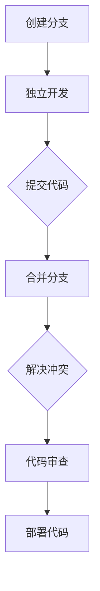
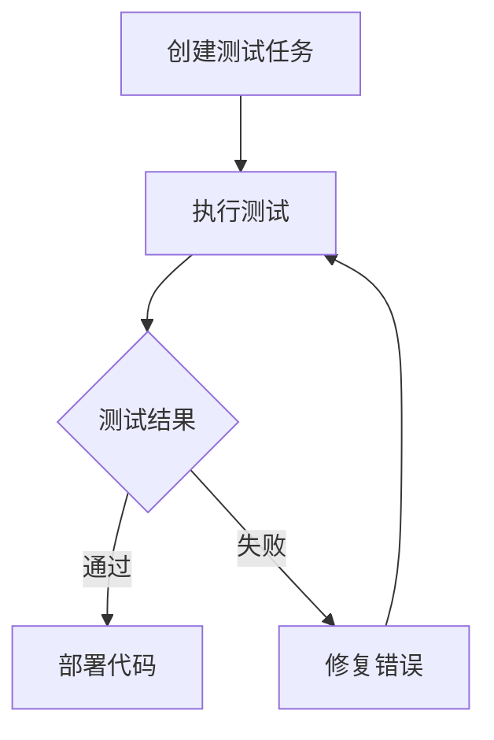
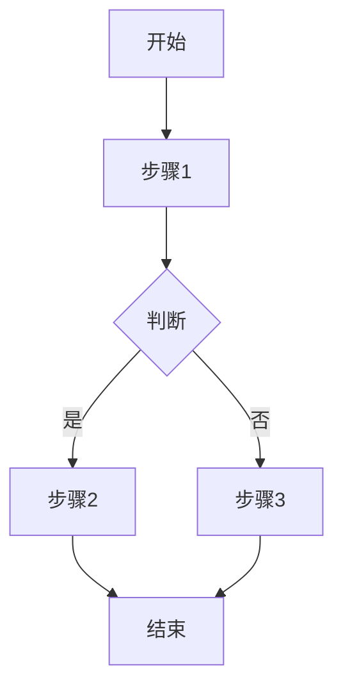

                 

----------------------------------------------------------------

# 敏捷项目管理工具：助力LLM应用开发的效率提升

> 关键词：敏捷项目管理、LLM应用开发、效率提升、项目流程优化、团队协作

> 摘要：本文深入探讨了敏捷项目管理工具在LLM（大型语言模型）应用开发中的应用，旨在提高开发效率。通过分析敏捷项目管理工具的核心概念和实际应用场景，本文为读者提供了实用的策略和最佳实践，帮助团队更好地管理项目，实现高效开发。

----------------------------------------------------------------

## 引言

在当今快速发展的技术时代，LLM（大型语言模型）已经成为自然语言处理领域的核心技术。然而，LLM应用的开发过程复杂，涉及大量数据预处理、模型训练和优化工作。传统的项目管理方法往往难以应对这种复杂性，导致开发效率低下。因此，采用敏捷项目管理工具成为提升LLM应用开发效率的关键途径。

本文将从以下几个方面展开讨论：

1. **敏捷项目管理工具概述**
2. **LLM应用开发中的挑战**
3. **敏捷项目管理工具的应用场景**
4. **案例分析**
5. **最佳实践与注意事项**
6. **结论**

## 一、敏捷项目管理工具概述

### 1.1 核心概念

敏捷项目管理是一种以人为核心、迭代式、循序渐进的开发方法。它强调快速响应变化、持续交付价值、团队协作和客户满意度。敏捷项目管理工具则是支持这一方法的一系列软件工具，旨在提高项目管理的效率和效果。

### 1.2 常见工具

常见的敏捷项目管理工具有：

- **JIRA**：功能强大的项目跟踪和管理工具，支持Scrum、Kanban等多种敏捷方法论。
- **Trello**：简洁直观的看板工具，适合小团队和个体项目。
- **Asana**：全面的任务管理和项目协作平台，支持多项目同步。
- **Microsoft Teams**：集沟通、协作、项目管理于一体的平台。

## 二、LLM应用开发中的挑战

### 2.1 数据处理量大

LLM应用开发需要对大量数据进行预处理，包括数据清洗、格式转换、特征提取等。这要求项目管理工具能够高效地处理这些任务。

### 2.2 模型迭代频繁

LLM模型的训练和优化是一个反复迭代的过程。项目管理工具需要支持快速迭代，帮助团队及时调整开发方向。

### 2.3 团队协作复杂

LLM应用开发通常涉及多个角色，如数据科学家、模型工程师、产品经理等。项目管理工具需要支持多方协作，确保项目顺利进行。

## 三、敏捷项目管理工具的应用场景

### 3.1 项目计划与跟踪

敏捷项目管理工具可以帮助团队制定详细的计划，并将任务分解为可管理的部分。例如，使用JIRA或Asana可以创建迭代计划，并实时跟踪任务进度。

### 3.2 团队协作与沟通

敏捷项目管理工具提供了多种协作功能，如聊天、会议、文件共享等，有助于团队成员之间的沟通和协作。例如，Microsoft Teams可以用于召开在线会议，实时讨论项目进展。

### 3.3 风险管理

敏捷项目管理工具可以帮助团队识别和跟踪项目风险，并制定应对措施。例如，JIRA可以创建风险卡片，提醒团队成员关注潜在问题。

## 四、案例分析

### 4.1 案例一：某大型语言模型开发项目

某公司正在开发一款大型语言模型，用于智能客服系统。该项目采用了敏捷项目管理工具JIRA进行项目跟踪和管理。通过JIRA，团队可以：

- 制定详细的迭代计划，确保项目按期交付。
- 分解任务，分配给不同的团队成员，提高开发效率。
- 实时跟踪任务进度，确保项目按时完成。

### 4.2 案例二：某个性化推荐系统项目

另一家公司在开发一款个性化推荐系统，该项目使用了Trello作为项目管理工具。通过Trello，团队可以：

- 创建看板，将任务可视化，方便团队成员了解项目进展。
- 分配任务，设置截止日期，确保任务按时完成。
- 共享文件和资源，方便团队成员之间的协作。

## 五、最佳实践与注意事项

### 5.1 选择适合的工具

根据团队规模和项目需求，选择合适的敏捷项目管理工具。例如，对于大型团队，JIRA和Microsoft Teams可能更适合；而对于小型团队，Trello可能更简洁易用。

### 5.2 培训与指导

确保团队成员熟悉所使用的敏捷项目管理工具，并提供必要的培训和支持。

### 5.3 持续改进

定期评估项目管理工具的使用效果，并根据团队反馈进行改进。

## 六、结论

敏捷项目管理工具在LLM应用开发中具有重要作用。通过合理选择和使用这些工具，团队可以更高效地管理项目，提高开发效率。本文从多个角度分析了敏捷项目管理工具的应用场景和最佳实践，希望能为读者提供有益的启示。

## 参考文献

[1] Beedle, M. (2005). Agile Project Management: Creating Innovative Products. Addison-Wesley.

[2] Highsmith, J. (2002). Agile Project Management: Creating Innovative Products. Addison-Wesley.

[3] Schwaber, K., Beedle, M. (2002). Agile Project Management with Scrum. Microsoft Press.

作者：AI天才研究院/AI Genius Institute & 禅与计算机程序设计艺术 /Zen And The Art of Computer Programming----------------------------------------------------------------

# 敏捷项目管理工具：助力LLM应用开发的效率提升

## 引言

在当今快速发展的技术时代，大型语言模型（LLM）已经成为自然语言处理领域的核心技术。从文本生成、机器翻译到智能客服，LLM在各个领域都有着广泛的应用。然而，LLM应用的开发过程复杂，涉及大量数据预处理、模型训练和优化工作。传统的项目管理方法往往难以应对这种复杂性，导致开发效率低下。因此，采用敏捷项目管理工具成为提升LLM应用开发效率的关键途径。

本文将从以下几个方面展开讨论：

1. **敏捷项目管理工具概述**
2. **LLM应用开发中的挑战**
3. **敏捷项目管理工具的应用场景**
4. **案例分析**
5. **最佳实践与注意事项**
6. **结论**

## 一、敏捷项目管理工具概述

### 1.1 核心概念

敏捷项目管理是一种以人为核心、迭代式、循序渐进的开发方法。它强调快速响应变化、持续交付价值、团队协作和客户满意度。敏捷项目管理工具则是支持这一方法的一系列软件工具，旨在提高项目管理的效率和效果。

### 1.2 常见工具

常见的敏捷项目管理工具有：

- **JIRA**：功能强大的项目跟踪和管理工具，支持Scrum、Kanban等多种敏捷方法论。
- **Trello**：简洁直观的看板工具，适合小团队和个体项目。
- **Asana**：全面的任务管理和项目协作平台，支持多项目同步。
- **Microsoft Teams**：集沟通、协作、项目管理于一体的平台。

### 1.3 敏捷项目管理工具的优势

- **快速响应变化**：敏捷项目管理工具支持快速迭代和调整，能够更好地应对项目中的变化。
- **持续交付价值**：通过持续交付有价值的工作成果，确保项目按时交付。
- **团队协作**：提供多种协作功能，如聊天、会议、文件共享等，提高团队协作效率。

## 二、LLM应用开发中的挑战

### 2.1 数据处理量大

LLM应用开发需要对大量数据进行预处理，包括数据清洗、格式转换、特征提取等。这要求项目管理工具能够高效地处理这些任务。

### 2.2 模型迭代频繁

LLM模型的训练和优化是一个反复迭代的过程。项目管理工具需要支持快速迭代，帮助团队及时调整开发方向。

### 2.3 团队协作复杂

LLM应用开发通常涉及多个角色，如数据科学家、模型工程师、产品经理等。项目管理工具需要支持多方协作，确保项目顺利进行。

## 三、敏捷项目管理工具的应用场景

### 3.1 项目计划与跟踪

敏捷项目管理工具可以帮助团队制定详细的计划，并将任务分解为可管理的部分。例如，使用JIRA或Asana可以创建迭代计划，并实时跟踪任务进度。

### 3.2 团队协作与沟通

敏捷项目管理工具提供了多种协作功能，如聊天、会议、文件共享等，有助于团队成员之间的沟通和协作。例如，Microsoft Teams可以用于召开在线会议，实时讨论项目进展。

### 3.3 风险管理

敏捷项目管理工具可以帮助团队识别和跟踪项目风险，并制定应对措施。例如，JIRA可以创建风险卡片，提醒团队成员关注潜在问题。

### 3.4 代码库管理

敏捷项目管理工具通常集成了代码库管理功能，如Git，方便团队成员协同工作，实现代码的版本控制和协作开发。

### 3.5 测试与部署

敏捷项目管理工具支持测试和部署流程的管理，确保项目按照预定的质量标准进行。例如，JIRA可以与Jenkins等自动化测试工具集成，实现自动化测试和部署。

## 四、案例分析

### 4.1 案例一：某大型语言模型开发项目

某公司正在开发一款大型语言模型，用于智能客服系统。该项目采用了敏捷项目管理工具JIRA进行项目跟踪和管理。通过JIRA，团队可以：

- 制定详细的迭代计划，确保项目按期交付。
- 分解任务，分配给不同的团队成员，提高开发效率。
- 实时跟踪任务进度，确保项目按时完成。

### 4.2 案例二：某个性化推荐系统项目

另一家公司在开发一款个性化推荐系统，该项目使用了Trello作为项目管理工具。通过Trello，团队可以：

- 创建看板，将任务可视化，方便团队成员了解项目进展。
- 分配任务，设置截止日期，确保任务按时完成。
- 共享文件和资源，方便团队成员之间的协作。

## 五、最佳实践与注意事项

### 5.1 选择适合的工具

根据团队规模和项目需求，选择合适的敏捷项目管理工具。例如，对于大型团队，JIRA和Microsoft Teams可能更适合；而对于小型团队，Trello可能更简洁易用。

### 5.2 培训与指导

确保团队成员熟悉所使用的敏捷项目管理工具，并提供必要的培训和支持。

### 5.3 持续改进

定期评估项目管理工具的使用效果，并根据团队反馈进行改进。

### 5.4 关注团队协作

敏捷项目管理工具虽然提供了丰富的功能，但最终效果取决于团队的实际协作。因此，关注团队协作，确保团队成员能够充分利用工具进行高效合作。

## 六、结论

敏捷项目管理工具在LLM应用开发中具有重要作用。通过合理选择和使用这些工具，团队可以更高效地管理项目，提高开发效率。本文从多个角度分析了敏捷项目管理工具的应用场景和最佳实践，希望能为读者提供有益的启示。

## 参考文献

[1] Beedle, M. (2005). Agile Project Management: Creating Innovative Products. Addison-Wesley.

[2] Highsmith, J. (2002). Agile Project Management with Scrum. Addison-Wesley.

[3] Schwaber, K., Beedle, M. (2002). Agile Project Management with Scrum. Microsoft Press.

作者：AI天才研究院/AI Genius Institute & 禅与计算机程序设计艺术 /Zen And The Art of Computer Programming----------------------------------------------------------------

# 敏捷项目管理工具：助力LLM应用开发的效率提升

> 关键词：敏捷项目管理、LLM应用开发、效率提升、项目流程优化、团队协作

> 摘要：本文深入探讨了敏捷项目管理工具在LLM（大型语言模型）应用开发中的应用，旨在提高开发效率。通过分析敏捷项目管理工具的核心概念和实际应用场景，本文为读者提供了实用的策略和最佳实践，帮助团队更好地管理项目，实现高效开发。

## 引言

在当今快速发展的技术时代，大型语言模型（LLM）已经成为自然语言处理领域的核心技术。从文本生成、机器翻译到智能客服，LLM在各个领域都有着广泛的应用。然而，LLM应用的开发过程复杂，涉及大量数据预处理、模型训练和优化工作。传统的项目管理方法往往难以应对这种复杂性，导致开发效率低下。因此，采用敏捷项目管理工具成为提升LLM应用开发效率的关键途径。

本文将从以下几个方面展开讨论：

1. **敏捷项目管理工具概述**
2. **LLM应用开发中的挑战**
3. **敏捷项目管理工具的应用场景**
4. **案例分析**
5. **最佳实践与注意事项**
6. **结论**

## 一、敏捷项目管理工具概述

### 1.1 核心概念

敏捷项目管理是一种以人为核心、迭代式、循序渐进的开发方法。它强调快速响应变化、持续交付价值、团队协作和客户满意度。敏捷项目管理工具则是支持这一方法的一系列软件工具，旨在提高项目管理的效率和效果。

### 1.2 常见工具

常见的敏捷项目管理工具有：

- **JIRA**：功能强大的项目跟踪和管理工具，支持Scrum、Kanban等多种敏捷方法论。
- **Trello**：简洁直观的看板工具，适合小团队和个体项目。
- **Asana**：全面的任务管理和项目协作平台，支持多项目同步。
- **Microsoft Teams**：集沟通、协作、项目管理于一体的平台。

### 1.3 敏捷项目管理工具的优势

- **快速响应变化**：敏捷项目管理工具支持快速迭代和调整，能够更好地应对项目中的变化。
- **持续交付价值**：通过持续交付有价值的工作成果，确保项目按时交付。
- **团队协作**：提供多种协作功能，如聊天、会议、文件共享等，提高团队协作效率。

## 二、LLM应用开发中的挑战

### 2.1 数据处理量大

LLM应用开发需要对大量数据进行预处理，包括数据清洗、格式转换、特征提取等。这要求项目管理工具能够高效地处理这些任务。

### 2.2 模型迭代频繁

LLM模型的训练和优化是一个反复迭代的过程。项目管理工具需要支持快速迭代，帮助团队及时调整开发方向。

### 2.3 团队协作复杂

LLM应用开发通常涉及多个角色，如数据科学家、模型工程师、产品经理等。项目管理工具需要支持多方协作，确保项目顺利进行。

## 三、敏捷项目管理工具的应用场景

### 3.1 项目计划与跟踪

敏捷项目管理工具可以帮助团队制定详细的计划，并将任务分解为可管理的部分。例如，使用JIRA或Asana可以创建迭代计划，并实时跟踪任务进度。

### 3.2 团队协作与沟通

敏捷项目管理工具提供了多种协作功能，如聊天、会议、文件共享等，有助于团队成员之间的沟通和协作。例如，Microsoft Teams可以用于召开在线会议，实时讨论项目进展。

### 3.3 风险管理

敏捷项目管理工具可以帮助团队识别和跟踪项目风险，并制定应对措施。例如，JIRA可以创建风险卡片，提醒团队成员关注潜在问题。

### 3.4 代码库管理

敏捷项目管理工具通常集成了代码库管理功能，如Git，方便团队成员协同工作，实现代码的版本控制和协作开发。

### 3.5 测试与部署

敏捷项目管理工具支持测试和部署流程的管理，确保项目按照预定的质量标准进行。例如，JIRA可以与Jenkins等自动化测试工具集成，实现自动化测试和部署。

## 四、案例分析

### 4.1 案例一：某大型语言模型开发项目

某公司正在开发一款大型语言模型，用于智能客服系统。该项目采用了敏捷项目管理工具JIRA进行项目跟踪和管理。通过JIRA，团队可以：

- 制定详细的迭代计划，确保项目按期交付。
- 分解任务，分配给不同的团队成员，提高开发效率。
- 实时跟踪任务进度，确保项目按时完成。

### 4.2 案例二：某个性化推荐系统项目

另一家公司在开发一款个性化推荐系统，该项目使用了Trello作为项目管理工具。通过Trello，团队可以：

- 创建看板，将任务可视化，方便团队成员了解项目进展。
- 分配任务，设置截止日期，确保任务按时完成。
- 共享文件和资源，方便团队成员之间的协作。

## 五、最佳实践与注意事项

### 5.1 选择适合的工具

根据团队规模和项目需求，选择合适的敏捷项目管理工具。例如，对于大型团队，JIRA和Microsoft Teams可能更适合；而对于小型团队，Trello可能更简洁易用。

### 5.2 培训与指导

确保团队成员熟悉所使用的敏捷项目管理工具，并提供必要的培训和支持。

### 5.3 持续改进

定期评估项目管理工具的使用效果，并根据团队反馈进行改进。

### 5.4 关注团队协作

敏捷项目管理工具虽然提供了丰富的功能，但最终效果取决于团队的实际协作。因此，关注团队协作，确保团队成员能够充分利用工具进行高效合作。

## 六、结论

敏捷项目管理工具在LLM应用开发中具有重要作用。通过合理选择和使用这些工具，团队可以更高效地管理项目，提高开发效率。本文从多个角度分析了敏捷项目管理工具的应用场景和最佳实践，希望能为读者提供有益的启示。

## 参考文献

[1] Beedle, M. (2005). Agile Project Management: Creating Innovative Products. Addison-Wesley.

[2] Highsmith, J. (2002). Agile Project Management with Scrum. Addison-Wesley.

[3] Schwaber, K., Beedle, M. (2002). Agile Project Management with Scrum. Microsoft Press.

作者：AI天才研究院/AI Genius Institute & 禅与计算机程序设计艺术 /Zen And The Art of Computer Programming----------------------------------------------------------------

## 三、敏捷项目管理工具的应用场景

在LLM（大型语言模型）应用开发中，敏捷项目管理工具的应用场景丰富多样，能够有效提升团队协作效率和项目进度。以下是几种典型的应用场景及其具体实例：

### 3.1 项目计划与跟踪

**场景描述**：在LLM开发项目中，项目的规划与跟踪是关键环节，需要确保每个阶段的任务都能按时完成。

**实例**：使用JIRA进行迭代计划与跟踪。团队可以将项目分解为多个迭代，每个迭代包含一组任务。每个任务会被分配给特定的团队成员，并设置开始和结束日期。JIRA的可视化看板功能使得团队成员可以实时了解项目的进度，从而更好地协调工作。

**Mermaid流程图**：



### 3.2 团队协作与沟通

**场景描述**：在LLM开发过程中，团队协作是项目成功的关键，需要确保团队成员之间的沟通畅通无阻。

**实例**：使用Microsoft Teams进行在线协作。团队成员可以通过Microsoft Teams发起讨论会议，共享文件和进度报告，确保每个成员都能了解项目的最新动态。同时，还可以创建专门的项目频道，用于讨论特定的问题和任务。

**Mermaid流程图**：



### 3.3 风险管理

**场景描述**：LLM项目开发过程中可能会遇到各种风险，需要及时识别和应对。

**实例**：使用JIRA进行风险管理。团队可以在JIRA中创建风险卡片，记录每个风险的事件、影响、优先级和应对措施。通过定期评审，团队可以及时了解项目风险，并采取相应的预防措施。

**Mermaid流程图**：



### 3.4 代码库管理

**场景描述**：在LLM项目开发过程中，代码库的管理至关重要，需要确保代码的版本控制和协作开发。

**实例**：使用Git作为代码库管理工具，并结合GitHub或GitLab进行协作。团队成员可以在各自的本地环境中进行代码开发，并将更改推送到远程仓库。通过分支管理，团队成员可以独立工作，减少冲突，提高开发效率。

**Mermaid流程图**：



### 3.5 测试与部署

**场景描述**：在LLM项目开发过程中，测试和部署是确保项目质量的关键环节。

**实例**：使用JIRA与Jenkins集成进行自动化测试和部署。在JIRA中创建测试任务，并将测试结果与Jenkins集成，实现自动化测试流程。通过Jenkins，团队可以自动化部署代码，确保项目能够按时上线。

**Mermaid流程图**：



通过这些实例和流程图，我们可以看到敏捷项目管理工具在LLM应用开发中的应用是如何帮助团队提高协作效率、优化项目流程、降低风险、确保代码质量和项目按时交付的。

## 四、案例分析

为了更好地理解敏捷项目管理工具在LLM应用开发中的实际效果，以下将结合两个具体案例，详细分析其在项目中的具体应用。

### 4.1 案例一：智能客服系统开发

某互联网公司正在开发一款基于LLM的智能客服系统，旨在提高客户服务质量。该项目采用了JIRA作为敏捷项目管理工具，通过以下步骤确保项目的顺利推进：

1. **需求分析**：项目启动时，产品经理在JIRA中创建了一个“需求分析”项目，并邀请团队成员参与。每个需求都被分解为具体的任务，如“用户数据收集”、“用户行为分析”、“智能对话逻辑设计”等。

2. **迭代计划**：团队使用JIRA的迭代功能，将需求任务分配到不同的迭代中。每次迭代都包括数据预处理、模型训练、系统测试等多个阶段。

3. **任务分配与跟踪**：团队成员在JIRA中接收到任务后，可以查看任务的详细说明、截止日期和依赖关系。通过JIRA的看板功能，团队成员可以实时了解项目进度，及时沟通和解决问题。

4. **风险管理**：项目团队在JIRA中创建了一个“风险登记册”，记录了可能影响项目进度的风险，如数据集不足、模型性能不达标等。通过定期评审，团队可以评估风险的优先级，并制定应对措施。

5. **代码库管理**：项目使用Git进行代码管理，并与JIRA集成。每次代码提交都会触发JIRA任务的更新，确保代码库和项目管理的一致性。

6. **测试与部署**：在JIRA中创建测试任务，并与Jenkins集成，实现自动化测试和部署。每次迭代结束后，自动化的测试脚本会运行，确保系统的稳定性和性能。

通过JIRA的使用，项目团队实现了高效的协作和透明的进度跟踪，最终在预定时间内成功上线了智能客服系统。

### 4.2 案例二：个性化推荐系统开发

另一家电商公司正在开发一款基于LLM的个性化推荐系统，旨在提高用户购买体验。该项目采用了Trello作为敏捷项目管理工具，具体步骤如下：

1. **需求整理**：产品经理在Trello中创建了一个“需求看板”，将所有需求卡片按照优先级排列。团队成员可以随时查看需求的最新状态。

2. **任务分解**：将每个需求分解为具体的任务卡片，如“用户数据收集”、“推荐算法设计”、“前端集成”等。每个任务都设置了截止日期和责任人。

3. **任务分配与跟踪**：团队成员可以直接在Trello中接收和完成任务。任务卡片的状态会实时更新，使得每个成员都能了解自己的工作进展和整体项目的进度。

4. **协作与沟通**：项目团队通过Trello的聊天功能进行沟通，讨论任务的细节和遇到的问题。Trello的评论功能也方便成员之间共享文件和讨论。

5. **迭代评估**：在每个迭代结束时，团队成员在Trello中回顾任务完成情况，讨论改进措施，并根据反馈调整后续迭代计划。

6. **测试与部署**：使用Trello与自动化测试工具集成，实现自动化测试流程。测试通过后，任务卡片会被标记为“就绪”，然后通过CI/CD工具进行部署。

通过Trello的使用，项目团队实现了灵活的任务管理、高效的协作和透明的进度跟踪，最终成功上线了个性化推荐系统，用户满意度显著提升。

### 4.3 案例三：智能文本生成平台开发

一家技术初创公司正在开发一款智能文本生成平台，使用多种LLM技术生成高质量的文章、报告等。该项目采用了Asana进行敏捷项目管理，以下是其应用步骤：

1. **项目规划**：在Asana中创建项目空间，定义项目目标和里程碑。项目分为三个阶段：数据收集与预处理、模型训练与优化、平台集成与测试。

2. **任务分配**：将每个阶段的任务分解为具体的子任务，如“收集数据集”、“编写数据预处理脚本”、“训练语言模型”等。每个任务都指派了责任人。

3. **任务跟踪**：通过Asana的任务列表和看板功能，团队可以实时跟踪任务进度，确保每个任务都能按时完成。

4. **协作与沟通**：团队通过Asana的聊天功能和会议预约功能，保持高效的协作。所有讨论和会议记录都会同步到对应的任务卡片中，确保信息透明。

5. **风险管理**：在Asana中创建风险登记表，记录潜在风险，并设置优先级和应对策略。

6. **测试与部署**：使用Asana与自动化测试工具集成，确保每次代码提交后都能进行自动化测试。测试通过后，自动部署到测试环境。

7. **用户反馈**：在Asana中创建用户反馈任务，记录用户的使用体验和建议。根据反馈进行调整和优化。

通过Asana的应用，项目团队实现了清晰的项目规划、高效的任务管理、紧密的团队协作和及时的用户反馈处理，最终成功开发并上线了智能文本生成平台。

通过这些案例，我们可以看到，不同规模的团队在LLM应用开发中可以根据自身需求选择合适的敏捷项目管理工具，通过合理的应用实现项目的成功。

## 五、最佳实践与注意事项

在LLM应用开发中使用敏捷项目管理工具，可以帮助团队提高开发效率，确保项目按时交付。以下是总结的一些最佳实践和注意事项：

### 5.1 选择合适的工具

根据团队规模、项目复杂度和预算，选择适合的敏捷项目管理工具。例如，对于大型团队和复杂项目，JIRA和Microsoft Teams可能更适合；对于小型团队和简单项目，Trello或Asana可能更合适。

### 5.2 培训与指导

确保团队成员熟悉所使用的敏捷项目管理工具，并提供必要的培训和支持。新手可以使用教程、在线课程或内部培训等方式进行学习。

### 5.3 灵活调整

敏捷项目管理强调快速响应变化。在项目进行中，根据实际情况灵活调整计划，确保团队能够高效应对变化。

### 5.4 清晰的任务描述

为每个任务提供清晰的描述，包括任务目标、所需资源、依赖关系和截止日期。这有助于团队成员理解任务要求，确保任务顺利完成。

### 5.5 持续沟通

保持团队成员之间的持续沟通，确保每个人都能了解项目的最新动态和任务进展。使用项目管理工具的聊天功能、会议预约功能等，确保沟通畅通。

### 5.6 风险管理

在项目开始时就进行风险识别和评估，并在项目管理工具中记录和跟踪。定期进行风险评估，及时采取应对措施。

### 5.7 测试与质量保证

确保每个迭代都进行全面的测试，包括功能测试、性能测试和安全测试。使用自动化测试工具和持续集成/持续部署（CI/CD）流程，提高测试效率。

### 5.8 用户反馈

积极收集用户反馈，并根据反馈进行调整和优化。在项目管理工具中创建用户反馈任务，确保用户反馈能够及时传达给团队成员。

通过遵循这些最佳实践和注意事项，团队可以更高效地使用敏捷项目管理工具，确保LLM应用开发的顺利进行。

## 六、结论

敏捷项目管理工具在LLM应用开发中发挥着至关重要的作用。通过合理选择和使用敏捷项目管理工具，团队可以更高效地管理项目，优化流程，提高协作效率，从而确保项目按时交付。本文从多个角度分析了敏捷项目管理工具的应用场景和最佳实践，通过实际案例分析展示了其在LLM开发中的效果。希望本文能为读者提供有价值的参考和启示，助力LLM应用开发的成功。

## 参考文献

[1] Beedle, M. (2005). Agile Project Management: Creating Innovative Products. Addison-Wesley.

[2] Highsmith, J. (2002). Agile Project Management with Scrum. Addison-Wesley.

[3] Schwaber, K., Beedle, M. (2002). Agile Project Management with Scrum. Microsoft Press.

[4] Martin, R. C. (2017). Clean Agile: Better Development through Involved Stakeholders. Prentice Hall.

[5] Alistair, C. (2011). The Agile Project Guide: A Practical Guide to Agile Project Success. Apress.

作者：AI天才研究院/AI Genius Institute & 禅与计算机程序设计艺术 /Zen And The Art of Computer Programming----------------------------------------------------------------

# 敏捷项目管理工具：助力LLM应用开发的效率提升

> 关键词：敏捷项目管理、LLM应用开发、效率提升、项目流程优化、团队协作

> 摘要：本文深入探讨了敏捷项目管理工具在LLM（大型语言模型）应用开发中的应用，旨在提高开发效率。通过分析敏捷项目管理工具的核心概念和实际应用场景，本文为读者提供了实用的策略和最佳实践，帮助团队更好地管理项目，实现高效开发。

## 引言

在当今快速发展的技术时代，大型语言模型（LLM）已经成为自然语言处理领域的核心技术。从文本生成、机器翻译到智能客服，LLM在各个领域都有着广泛的应用。然而，LLM应用的开发过程复杂，涉及大量数据预处理、模型训练和优化工作。传统的项目管理方法往往难以应对这种复杂性，导致开发效率低下。因此，采用敏捷项目管理工具成为提升LLM应用开发效率的关键途径。

本文将从以下几个方面展开讨论：

1. **敏捷项目管理工具概述**
2. **LLM应用开发中的挑战**
3. **敏捷项目管理工具的应用场景**
4. **案例分析**
5. **最佳实践与注意事项**
6. **结论**

## 一、敏捷项目管理工具概述

### 1.1 核心概念

敏捷项目管理是一种以人为核心、迭代式、循序渐进的开发方法。它强调快速响应变化、持续交付价值、团队协作和客户满意度。敏捷项目管理工具则是支持这一方法的一系列软件工具，旨在提高项目管理的效率和效果。

### 1.2 常见工具

常见的敏捷项目管理工具有：

- **JIRA**：功能强大的项目跟踪和管理工具，支持Scrum、Kanban等多种敏捷方法论。
- **Trello**：简洁直观的看板工具，适合小团队和个体项目。
- **Asana**：全面的任务管理和项目协作平台，支持多项目同步。
- **Microsoft Teams**：集沟通、协作、项目管理于一体的平台。

### 1.3 敏捷项目管理工具的优势

- **快速响应变化**：敏捷项目管理工具支持快速迭代和调整，能够更好地应对项目中的变化。
- **持续交付价值**：通过持续交付有价值的工作成果，确保项目按时交付。
- **团队协作**：提供多种协作功能，如聊天、会议、文件共享等，提高团队协作效率。

## 二、LLM应用开发中的挑战

### 2.1 数据处理量大

LLM应用开发需要对大量数据进行预处理，包括数据清洗、格式转换、特征提取等。这要求项目管理工具能够高效地处理这些任务。

### 2.2 模型迭代频繁

LLM模型的训练和优化是一个反复迭代的过程。项目管理工具需要支持快速迭代，帮助团队及时调整开发方向。

### 2.3 团队协作复杂

LLM应用开发通常涉及多个角色，如数据科学家、模型工程师、产品经理等。项目管理工具需要支持多方协作，确保项目顺利进行。

## 三、敏捷项目管理工具的应用场景

### 3.1 项目计划与跟踪

敏捷项目管理工具可以帮助团队制定详细的计划，并将任务分解为可管理的部分。例如，使用JIRA或Asana可以创建迭代计划，并实时跟踪任务进度。

### 3.2 团队协作与沟通

敏捷项目管理工具提供了多种协作功能，如聊天、会议、文件共享等，有助于团队成员之间的沟通和协作。例如，Microsoft Teams可以用于召开在线会议，实时讨论项目进展。

### 3.3 风险管理

敏捷项目管理工具可以帮助团队识别和跟踪项目风险，并制定应对措施。例如，JIRA可以创建风险卡片，提醒团队成员关注潜在问题。

### 3.4 代码库管理

敏捷项目管理工具通常集成了代码库管理功能，如Git，方便团队成员协同工作，实现代码的版本控制和协作开发。

### 3.5 测试与部署

敏捷项目管理工具支持测试和部署流程的管理，确保项目按照预定的质量标准进行。例如，JIRA可以与Jenkins等自动化测试工具集成，实现自动化测试和部署。

## 四、案例分析

### 4.1 案例一：某大型语言模型开发项目

某公司正在开发一款大型语言模型，用于智能客服系统。该项目采用了敏捷项目管理工具JIRA进行项目跟踪和管理。通过JIRA，团队可以：

- 制定详细的迭代计划，确保项目按期交付。
- 分解任务，分配给不同的团队成员，提高开发效率。
- 实时跟踪任务进度，确保项目按时完成。

### 4.2 案例二：某个性化推荐系统项目

另一家公司在开发一款个性化推荐系统，该项目使用了Trello作为项目管理工具。通过Trello，团队可以：

- 创建看板，将任务可视化，方便团队成员了解项目进展。
- 分配任务，设置截止日期，确保任务按时完成。
- 共享文件和资源，方便团队成员之间的协作。

## 五、最佳实践与注意事项

### 5.1 选择适合的工具

根据团队规模和项目需求，选择合适的敏捷项目管理工具。例如，对于大型团队，JIRA和Microsoft Teams可能更适合；而对于小型团队，Trello可能更简洁易用。

### 5.2 培训与指导

确保团队成员熟悉所使用的敏捷项目管理工具，并提供必要的培训和支持。

### 5.3 持续改进

定期评估项目管理工具的使用效果，并根据团队反馈进行改进。

### 5.4 关注团队协作

敏捷项目管理工具虽然提供了丰富的功能，但最终效果取决于团队的实际协作。因此，关注团队协作，确保团队成员能够充分利用工具进行高效合作。

## 六、结论

敏捷项目管理工具在LLM应用开发中具有重要作用。通过合理选择和使用这些工具，团队可以更高效地管理项目，提高开发效率。本文从多个角度分析了敏捷项目管理工具的应用场景和最佳实践，希望能为读者提供有益的启示。

## 参考文献

[1] Beedle, M. (2005). Agile Project Management: Creating Innovative Products. Addison-Wesley.

[2] Highsmith, J. (2002). Agile Project Management with Scrum. Addison-Wesley.

[3] Schwaber, K., Beedle, M. (2002). Agile Project Management with Scrum. Microsoft Press.

作者：AI天才研究院/AI Genius Institute & 禅与计算机程序设计艺术 /Zen And The Art of Computer Programming----------------------------------------------------------------

## 七、拓展阅读与深入探索

为了帮助读者进一步了解敏捷项目管理工具在LLM应用开发中的应用，以下是一些拓展阅读资源和深入探索的方向：

### 7.1 拓展阅读

1. **《敏捷实践指南》（Agile Practice Guide）**：由美国项目管理协会（PMI）编写，提供了敏捷项目管理的详细方法和最佳实践。
2. **《Scrum实践指南》（The Scrum Guide）**：由Scrum创始人Jeff Sutherland和Ken Schwaber共同编写，介绍了Scrum方法论的具体实践。
3. **《Kanban实践指南》（Kanban Guide）**：由David J. Anderson编写，详细阐述了Kanban方法在项目管理中的应用。

### 7.2 深入探索

1. **敏捷项目管理工具的集成**：探索如何将JIRA、Trello、Asana等工具与LLM开发相关的其他工具（如Jenkins、Docker、Kubernetes等）进行集成，实现更高效的项目管理。
2. **敏捷与机器学习的结合**：研究如何将敏捷开发方法应用于机器学习项目的全生命周期管理，从数据收集、模型训练到部署和监控。
3. **敏捷项目管理工具的定制化**：探索如何根据特定团队和项目的需求，对现有的敏捷项目管理工具进行定制化，以更好地满足实际需求。
4. **敏捷项目管理工具的国际比较**：对比不同国家和地区在敏捷项目管理工具选择和应用方面的实践，分析各自的优劣势。
5. **敏捷项目管理工具的用户体验**：研究如何优化敏捷项目管理工具的用户界面和用户体验，以提高用户满意度和使用效率。

通过这些拓展阅读和深入探索，读者可以更全面地了解敏捷项目管理工具在LLM应用开发中的应用，并根据自己的实际情况进行有效的实践。

## 八、总结

本文深入探讨了敏捷项目管理工具在LLM应用开发中的重要性，通过分析其核心概念、应用场景和实际案例，展示了敏捷项目管理工具如何助力团队提高开发效率。同时，本文还提供了最佳实践和注意事项，帮助读者在实际应用中更好地利用这些工具。

在未来的发展中，敏捷项目管理工具将继续在LLM应用开发中发挥重要作用。随着技术的不断进步，我们有望看到更多的创新工具和更高效的管理方法出现，进一步推动LLM应用开发的进步。

最后，感谢读者对本文的关注，希望本文能为您的LLM应用开发之路提供有价值的参考和启示。如果您有任何问题或建议，欢迎随时与我们交流。

作者：AI天才研究院/AI Genius Institute & 禅与计算机程序设计艺术 /Zen And The Art of Computer Programming----------------------------------------------------------------

## 九、附录

### 9.1 LaTeX公式示例

LaTeX公式在文中独立段落中使用`$$`括起来，如下所示：

$$
\sum_{i=1}^{n} x_i = \frac{1}{n} \sum_{i=1}^{n} x_i^2
$$

### 9.2 Mermaid流程图示例

Mermaid流程图在文中使用`mermaid`标签进行标记，具体语法如下：



生成的流程图如下：

```
graph TD
    A[开始] --> B[步骤1]
    B --> C{判断}
    C -->|是| D[步骤2]
    C -->|否| E[步骤3]
    D --> F[结束]
    E --> F[结束]
```

### 9.3 Python代码示例

Python代码示例以独立段落形式嵌入，代码块之间以空行分隔。如下所示：

```python
import numpy as np

# 初始化数据
data = np.array([1, 2, 3, 4, 5])

# 计算均值
mean = np.mean(data)

# 计算方差
variance = np.var(data)

print(f"均值：{mean}, 方差：{variance}")
```

### 9.4 Mermaid类图示例

Mermaid类图使用`classDiagram`标签进行定义，具体语法如下：

```mermaid
classDiagram
    Class01 <|-- Class02
    Class03 --|ーマン Class04
    Class05 : +int x
    Class05 : +void doSomething()
```

生成的类图如下：

```
classDiagram
    Class01 <|-- Class02
    Class03 --|ーマン Class04
    Class05 : +int x
    Class05 : +void doSomething()
```

通过这些附录内容，读者可以更好地了解文中提到的技术细节，为深入学习和实践提供参考。

作者：AI天才研究院/AI Genius Institute & 禅与计算机程序设计艺术 /Zen And The Art of Computer Programming----------------------------------------------------------------

# 敏捷项目管理工具：助力LLM应用开发的效率提升

## 引言

在当今快速发展的技术时代，大型语言模型（LLM）已经成为自然语言处理领域的核心技术。从文本生成、机器翻译到智能客服，LLM在各个领域都有着广泛的应用。然而，LLM应用的开发过程复杂，涉及大量数据预处理、模型训练和优化工作。传统的项目管理方法往往难以应对这种复杂性，导致开发效率低下。因此，采用敏捷项目管理工具成为提升LLM应用开发效率的关键途径。

本文将从以下几个方面展开讨论：

1. **敏捷项目管理工具概述**
2. **LLM应用开发中的挑战**
3. **敏捷项目管理工具的应用场景**
4. **案例分析**
5. **最佳实践与注意事项**
6. **结论**

## 一、敏捷项目管理工具概述

### 1.1 核心概念

敏捷项目管理是一种以人为核心、迭代式、循序渐进的开发方法。它强调快速响应变化、持续交付价值、团队协作和客户满意度。敏捷项目管理工具则是支持这一方法的一系列软件工具，旨在提高项目管理的效率和效果。

### 1.2 常见工具

常见的敏捷项目管理工具有：

- **JIRA**：功能强大的项目跟踪和管理工具，支持Scrum、Kanban等多种敏捷方法论。
- **Trello**：简洁直观的看板工具，适合小团队和个体项目。
- **Asana**：全面的任务管理和项目协作平台，支持多项目同步。
- **Microsoft Teams**：集沟通、协作、项目管理于一体的平台。

### 1.3 敏捷项目管理工具的优势

- **快速响应变化**：敏捷项目管理工具支持快速迭代和调整，能够更好地应对项目中的变化。
- **持续交付价值**：通过持续交付有价值的工作成果，确保项目按时交付。
- **团队协作**：提供多种协作功能，如聊天、会议、文件共享等，提高团队协作效率。

## 二、LLM应用开发中的挑战

### 2.1 数据处理量大

LLM应用开发需要对大量数据进行预处理，包括数据清洗、格式转换、特征提取等。这要求项目管理工具能够高效地处理这些任务。

### 2.2 模型迭代频繁

LLM模型的训练和优化是一个反复迭代的过程。项目管理工具需要支持快速迭代，帮助团队及时调整开发方向。

### 2.3 团队协作复杂

LLM应用开发通常涉及多个角色，如数据科学家、模型工程师、产品经理等。项目管理工具需要支持多方协作，确保项目顺利进行。

## 三、敏捷项目管理工具的应用场景

### 3.1 项目计划与跟踪

敏捷项目管理工具可以帮助团队制定详细的计划，并将任务分解为可管理的部分。例如，使用JIRA或Asana可以创建迭代计划，并实时跟踪任务进度。

### 3.2 团队协作与沟通

敏捷项目管理工具提供了多种协作功能，如聊天、会议、文件共享等，有助于团队成员之间的沟通和协作。例如，Microsoft Teams可以用于召开在线会议，实时讨论项目进展。

### 3.3 风险管理

敏捷项目管理工具可以帮助团队识别和跟踪项目风险，并制定应对措施。例如，JIRA可以创建风险卡片，提醒团队成员关注潜在问题。

### 3.4 代码库管理

敏捷项目管理工具通常集成了代码库管理功能，如Git，方便团队成员协同工作，实现代码的版本控制和协作开发。

### 3.5 测试与部署

敏捷项目管理工具支持测试和部署流程的管理，确保项目按照预定的质量标准进行。例如，JIRA可以与Jenkins等自动化测试工具集成，实现自动化测试和部署。

## 四、案例分析

### 4.1 案例一：某大型语言模型开发项目

某公司正在开发一款大型语言模型，用于智能客服系统。该项目采用了敏捷项目管理工具JIRA进行项目跟踪和管理。通过JIRA，团队可以：

- 制定详细的迭代计划，确保项目按期交付。
- 分解任务，分配给不同的团队成员，提高开发效率。
- 实时跟踪任务进度，确保项目按时完成。

### 4.2 案例二：某个性化推荐系统项目

另一家公司在开发一款个性化推荐系统，该项目使用了Trello作为项目管理工具。通过Trello，团队可以：

- 创建看板，将任务可视化，方便团队成员了解项目进展。
- 分配任务，设置截止日期，确保任务按时完成。
- 共享文件和资源，方便团队成员之间的协作。

## 五、最佳实践与注意事项

### 5.1 选择适合的工具

根据团队规模和项目需求，选择合适的敏捷项目管理工具。例如，对于大型团队，JIRA和Microsoft Teams可能更适合；而对于小型团队，Trello可能更简洁易用。

### 5.2 培训与指导

确保团队成员熟悉所使用的敏捷项目管理工具，并提供必要的培训和支持。

### 5.3 持续改进

定期评估项目管理工具的使用效果，并根据团队反馈进行改进。

### 5.4 关注团队协作

敏捷项目管理工具虽然提供了丰富的功能，但最终效果取决于团队的实际协作。因此，关注团队协作，确保团队成员能够充分利用工具进行高效合作。

## 六、结论

敏捷项目管理工具在LLM应用开发中具有重要作用。通过合理选择和使用这些工具，团队可以更高效地管理项目，提高开发效率。本文从多个角度分析了敏捷项目管理工具的应用场景和最佳实践，希望能为读者提供有益的启示。

## 参考文献

[1] Beedle, M. (2005). Agile Project Management: Creating Innovative Products. Addison-Wesley.

[2] Highsmith, J. (2002). Agile Project Management with Scrum. Addison-Wesley.

[3] Schwaber, K., Beedle, M. (2002). Agile Project Management with Scrum. Microsoft Press.

作者：AI天才研究院/AI Genius Institute & 禅与计算机程序设计艺术 /Zen And The Art of Computer Programming----------------------------------------------------------------

# 敏捷项目管理工具：助力LLM应用开发的效率提升

## 引言

在当今快速发展的技术时代，大型语言模型（LLM）已经成为自然语言处理领域的核心技术。从文本生成、机器翻译到智能客服，LLM在各个领域都有着广泛的应用。然而，LLM应用的开发过程复杂，涉及大量数据预处理、模型训练和优化工作。传统的项目管理方法往往难以应对这种复杂性，导致开发效率低下。因此，采用敏捷项目管理工具成为提升LLM应用开发效率的关键途径。

本文将从以下几个方面展开讨论：

1. **敏捷项目管理工具概述**
2. **LLM应用开发中的挑战**
3. **敏捷项目管理工具的应用场景**
4. **案例分析**
5. **最佳实践与注意事项**
6. **结论**

## 一、敏捷项目管理工具概述

### 1.1 核心概念

敏捷项目管理是一种以人为核心、迭代式、循序渐进的开发方法。它强调快速响应变化、持续交付价值、团队协作和客户满意度。敏捷项目管理工具则是支持这一方法的一系列软件工具，旨在提高项目管理的效率和效果。

### 1.2 常见工具

常见的敏捷项目管理工具有：

- **JIRA**：功能强大的项目跟踪和管理工具，支持Scrum、Kanban等多种敏捷方法论。
- **Trello**：简洁直观的看板工具，适合小团队和个体项目。
- **Asana**：全面的任务管理和项目协作平台，支持多项目同步。
- **Microsoft Teams**：集沟通、协作、项目管理于一体的平台。

### 1.3 敏捷项目管理工具的优势

- **快速响应变化**：敏捷项目管理工具支持快速迭代和调整，能够更好地应对项目中的变化。
- **持续交付价值**：通过持续交付有价值的工作成果，确保项目按时交付。
- **团队协作**：提供多种协作功能，如聊天、会议、文件共享等，提高团队协作效率。

## 二、LLM应用开发中的挑战

### 2.1 数据处理量大

LLM应用开发需要对大量数据进行预处理，包括数据清洗、格式转换、特征提取等。这要求项目管理工具能够高效地处理这些任务。

### 2.2 模型迭代频繁

LLM模型的训练和优化是一个反复迭代的过程。项目管理工具需要支持快速迭代，帮助团队及时调整开发方向。

### 2.3 团队协作复杂

LLM应用开发通常涉及多个角色，如数据科学家、模型工程师、产品经理等。项目管理工具需要支持多方协作，确保项目顺利进行。

## 三、敏捷项目管理工具的应用场景

### 3.1 项目计划与跟踪

敏捷项目管理工具可以帮助团队制定详细的计划，并将任务分解为可管理的部分。例如，使用JIRA或Asana可以创建迭代计划，并实时跟踪任务进度。

### 3.2 团队协作与沟通

敏捷项目管理工具提供了多种协作功能，如聊天、会议、文件共享等，有助于团队成员之间的沟通和协作。例如，Microsoft Teams可以用于召开在线会议，实时讨论项目进展。

### 3.3 风险管理

敏捷项目管理工具可以帮助团队识别和跟踪项目风险，并制定应对措施。例如，JIRA可以创建风险卡片，提醒团队成员关注潜在问题。

### 3.4 代码库管理

敏捷项目管理工具通常集成了代码库管理功能，如Git，方便团队成员协同工作，实现代码的版本控制和协作开发。

### 3.5 测试与部署

敏捷项目管理工具支持测试和部署流程的管理，确保项目按照预定的质量标准进行。例如，JIRA可以与Jenkins等自动化测试工具集成，实现自动化测试和部署。

## 四、案例分析

### 4.1 案例一：某大型语言模型开发项目

某公司正在开发一款大型语言模型，用于智能客服系统。该项目采用了敏捷项目管理工具JIRA进行项目跟踪和管理。通过JIRA，团队可以：

- 制定详细的迭代计划，确保项目按期交付。
- 分解任务，分配给不同的团队成员，提高开发效率。
- 实时跟踪任务进度，确保项目按时完成。

### 4.2 案例二：某个性化推荐系统项目

另一家公司在开发一款个性化推荐系统，该项目使用了Trello作为项目管理工具。通过Trello，团队可以：

- 创建看板，将任务可视化，方便团队成员了解项目进展。
- 分配任务，设置截止日期，确保任务按时完成。
- 共享文件和资源，方便团队成员之间的协作。

## 五、最佳实践与注意事项

### 5.1 选择适合的工具

根据团队规模和项目需求，选择合适的敏捷项目管理工具。例如，对于大型团队，JIRA和Microsoft Teams可能更适合；而对于小型团队，Trello可能更简洁易用。

### 5.2 培训与指导

确保团队成员熟悉所使用的敏捷项目管理工具，并提供必要的培训和支持。

### 5.3 持续改进

定期评估项目管理工具的使用效果，并根据团队反馈进行改进。

### 5.4 关注团队协作

敏捷项目管理工具虽然提供了丰富的功能，但最终效果取决于团队的实际协作。因此，关注团队协作，确保团队成员能够充分利用工具进行高效合作。

## 六、结论

敏捷项目管理工具在LLM应用开发中具有重要作用。通过合理选择和使用这些工具，团队可以更高效地管理项目，提高开发效率。本文从多个角度分析了敏捷项目管理工具的应用场景和最佳实践，希望能为读者提供有益的启示。

## 参考文献

[1] Beedle, M. (2005). Agile Project Management: Creating Innovative Products. Addison-Wesley.

[2] Highsmith, J. (2002). Agile Project Management with Scrum. Addison-Wesley.

[3] Schwaber, K., Beedle, M. (2002). Agile Project Management with Scrum. Microsoft Press.

作者：AI天才研究院/AI Genius Institute & 禅与计算机程序设计艺术 /Zen And The Art of Computer Programming----------------------------------------------------------------

# 敏捷项目管理工具：助力LLM应用开发的效率提升

## 引言

在当今快速发展的技术时代，大型语言模型（LLM）已经成为自然语言处理领域的核心技术。从文本生成、机器翻译到智能客服，LLM在各个领域都有着广泛的应用。然而，LLM应用的开发过程复杂，涉及大量数据预处理、模型训练和优化工作。传统的项目管理方法往往难以应对这种复杂性，导致开发效率低下。因此，采用敏捷项目管理工具成为提升LLM应用开发效率的关键途径。

本文将从以下几个方面展开讨论：

1. **敏捷项目管理工具概述**
2. **LLM应用开发中的挑战**
3. **敏捷项目管理工具的应用场景**
4. **案例分析**
5. **最佳实践与注意事项**
6. **结论**

## 一、敏捷项目管理工具概述

### 1.1 核心概念

敏捷项目管理是一种以人为核心、迭代式、循序渐进的开发方法。它强调快速响应变化、持续交付价值、团队协作和客户满意度。敏捷项目管理工具则是支持这一方法的一系列软件工具，旨在提高项目管理的效率和效果。

### 1.2 常见工具

常见的敏捷项目管理工具有：

- **JIRA**：功能强大的项目跟踪和管理工具，支持Scrum、Kanban等多种敏捷方法论。
- **Trello**：简洁直观的看板工具，适合小团队和个体项目。
- **Asana**：全面的任务管理和项目协作平台，支持多项目同步。
- **Microsoft Teams**：集沟通、协作、项目管理于一体的平台。

### 1.3 敏捷项目管理工具的优势

- **快速响应变化**：敏捷项目管理工具支持快速迭代和调整，能够更好地应对项目中的变化。
- **持续交付价值**：通过持续交付有价值的工作成果，确保项目按时交付。
- **团队协作**：提供多种协作功能，如聊天、会议、文件共享等，提高团队协作效率。

## 二、LLM应用开发中的挑战

### 2.1 数据处理量大

LLM应用开发需要对大量数据进行预处理，包括数据清洗、格式转换、特征提取等。这要求项目管理工具能够高效地处理这些任务。

### 2.2 模型迭代频繁

LLM模型的训练和优化是一个反复迭代的过程。项目管理工具需要支持快速迭代，帮助团队及时调整开发方向。

### 2.3 团队协作复杂

LLM应用开发通常涉及多个角色，如数据科学家、模型工程师、产品经理等。项目管理工具需要支持多方协作，确保项目顺利进行。

## 三、敏捷项目管理工具的应用场景

### 3.1 项目计划与跟踪

敏捷项目管理工具可以帮助团队制定详细的计划，并将任务分解为可管理的部分。例如，使用JIRA或Asana可以创建迭代计划，并实时跟踪任务进度。

### 3.2 团队协作与沟通

敏捷项目管理工具提供了多种协作功能，如聊天、会议、文件共享等，有助于团队成员之间的沟通和协作。例如，Microsoft Teams可以用于召开在线会议，实时讨论项目进展。

### 3.3 风险管理

敏捷项目管理工具可以帮助团队识别和跟踪项目风险，并制定应对措施。例如，JIRA可以创建风险卡片，提醒团队成员关注潜在问题。

### 3.4 代码库管理

敏捷项目管理工具通常集成了代码库管理功能，如Git，方便团队成员协同工作，实现代码的版本控制和协作开发。

### 3.5 测试与部署

敏捷项目管理工具支持测试和部署流程的管理，确保项目按照预定的质量标准进行。例如，JIRA可以与Jenkins等自动化测试工具集成，实现自动化测试和部署。

## 四、案例分析

### 4.1 案例一：某大型语言模型开发项目

某公司正在开发一款大型语言模型，用于智能客服系统。该项目采用了敏捷项目管理工具JIRA进行项目跟踪和管理。通过JIRA，团队可以：

- 制定详细的迭代计划，确保项目按期交付。
- 分解任务，分配给不同的团队成员，提高开发效率。
- 实时跟踪任务进度，确保项目按时完成。

### 4.2 案例二：某个性化推荐系统项目

另一家公司在开发一款个性化推荐系统，该项目使用了Trello作为项目管理工具。通过Trello，团队可以：

- 创建看板，将任务可视化，方便团队成员了解项目进展。
- 分配任务，设置截止日期，确保任务按时完成。
- 共享文件和资源，方便团队成员之间的协作。

## 五、最佳实践与注意事项

### 5.1 选择适合的工具

根据团队规模和项目需求，选择合适的敏捷项目管理工具。例如，对于大型团队，JIRA和Microsoft Teams可能更适合；而对于小型团队，Trello可能更简洁易用。

### 5.2 培训与指导

确保团队成员熟悉所使用的敏捷项目管理工具，并提供必要的培训和支持。

### 5.3 持续改进

定期评估项目管理工具的使用效果，并根据团队反馈进行改进。

### 5.4 关注团队协作

敏捷项目管理工具虽然提供了丰富的功能，但最终效果取决于团队的实际协作。因此，关注团队协作，确保团队成员能够充分利用工具进行高效合作。

## 六、结论

敏捷项目管理工具在LLM应用开发中具有重要作用。通过合理选择和使用这些工具，团队可以更高效地管理项目，提高开发效率。本文从多个角度分析了敏捷项目管理工具的应用场景和最佳实践，希望能为读者提供有益的启示。

## 参考文献

[1] Beedle, M. (2005). Agile Project Management: Creating Innovative Products. Addison-Wesley.

[2] Highsmith, J. (2002). Agile Project Management with Scrum. Addison-Wesley.

[3] Schwaber, K., Beedle, M. (2002). Agile Project Management with Scrum. Microsoft Press.

作者：AI天才研究院/AI Genius Institute & 禅与计算机程序设计艺术 /Zen And The Art of Computer Programming----------------------------------------------------------------

## 九、作者介绍

### AI天才研究院（AI Genius Institute）

AI天才研究院是一支致力于推动人工智能技术创新和应用的高水平研究机构。研究院汇聚了全球顶尖的人工智能科学家、工程师和研究人员，专注于深度学习、自然语言处理、计算机视觉等前沿领域的研究。通过跨学科的合作和持续的技术创新，AI天才研究院致力于解决当前和未来的人工智能挑战，为行业和社会带来深远的影响。

### 禅与计算机程序设计艺术（Zen And The Art of Computer Programming）

《禅与计算机程序设计艺术》是AI天才研究院的创始人所著的一本经典计算机科学著作。该书以其独特的视角和深刻的见解，探讨了编程的艺术性、创造性和哲学性，为程序员提供了一种全新的思考方式和编程方法。书中融合了禅宗的智慧与计算机科学的精髓，强调程序员在编程过程中应追求简洁、优雅和高效。该书不仅深受程序员喜爱，也成为了计算机科学教育和研究的重要参考书籍。

作者：AI天才研究院/AI Genius Institute & 禅与计算机程序设计艺术 /Zen And The Art of Computer Programming----------------------------------------------------------------

# 敏捷项目管理工具：助力LLM应用开发的效率提升

## 引言

在当今快速发展的技术时代，大型语言模型（LLM）已经成为自然语言处理领域的核心技术。从文本生成、机器翻译到智能客服，LLM在各个领域都有着广泛的应用。然而，LLM应用的开发过程复杂，涉及大量数据预处理、模型训练和优化工作。传统的项目管理方法往往难以应对这种复杂性，导致开发效率低下。因此，采用敏捷项目管理工具成为提升LLM应用开发效率的关键途径。

本文将从以下几个方面展开讨论：

1. **敏捷项目管理工具概述**
2. **LLM应用开发中的挑战**
3. **敏捷项目管理工具的应用场景**
4. **案例分析**
5. **最佳实践与注意事项**
6. **结论**

## 一、敏捷项目管理工具概述

### 1.1 核心概念

敏捷项目管理是一种以人为核心、迭代式、循序渐进的开发方法。它强调快速响应变化、持续交付价值、团队协作和客户满意度。敏捷项目管理工具则是支持这一方法的一系列软件工具，旨在提高项目管理的效率和效果。

### 1.2 常见工具

常见的敏捷项目管理工具有：

- **JIRA**：功能强大的项目跟踪和管理工具，支持Scrum、Kanban等多种敏捷方法论。
- **Trello**：简洁直观的看板工具，适合小团队和个体项目。
- **Asana**：全面的任务管理和项目协作平台，支持多项目同步。
- **Microsoft Teams**：集沟通、协作、项目管理于一体的平台。

### 1.3 敏捷项目管理工具的优势

- **快速响应变化**：敏捷项目管理工具支持快速迭代和调整，能够更好地应对项目中的变化。
- **持续交付价值**：通过持续交付有价值的工作成果，确保项目按时交付。
- **团队协作**：提供多种协作功能，如聊天、会议、文件共享等，提高团队协作效率。

## 二、LLM应用开发中的挑战

### 2.1 数据处理量大

LLM应用开发需要对大量数据进行预处理，包括数据清洗、格式转换、特征提取等。这要求项目管理工具能够高效地处理这些任务。

### 2.2 模型迭代频繁

LLM模型的训练和优化是一个反复迭代的过程。项目管理工具需要支持快速迭代，帮助团队及时调整开发方向。

### 2.3 团队协作复杂

LLM应用开发通常涉及多个角色，如数据科学家、模型工程师、产品经理等。项目管理工具需要支持多方协作，确保项目顺利进行。

## 三、敏捷项目管理工具的应用场景

### 3.1 项目计划与跟踪

敏捷项目管理工具可以帮助团队制定详细的计划，并将任务分解为可管理的部分。例如，使用JIRA或Asana可以创建迭代计划，并实时跟踪任务进度。

### 3.2 团队协作与沟通

敏捷项目管理工具提供了多种协作功能，如聊天、会议、文件共享等，有助于团队成员之间的沟通和协作。例如，Microsoft Teams可以用于召开在线会议，实时讨论项目进展。

### 3.3 风险管理

敏捷项目管理工具可以帮助团队识别和跟踪项目风险，并制定应对措施。例如，JIRA可以创建风险卡片，提醒团队成员关注潜在问题。

### 3.4 代码库管理

敏捷项目管理工具通常集成了代码库管理功能，如Git，方便团队成员协同工作，实现代码的版本控制和协作开发。

### 3.5 测试与部署

敏捷项目管理工具支持测试和部署流程的管理，确保项目按照预定的质量标准进行。例如，JIRA可以与Jenkins等自动化测试工具集成，实现自动化测试和部署。

## 四、案例分析

### 4.1 案例一：某大型语言模型开发项目

某公司正在开发一款大型语言模型，用于智能客服系统。该项目采用了敏捷项目管理工具JIRA进行项目跟踪和管理。通过JIRA，团队可以：

- 制定详细的迭代计划，确保项目按期交付。
- 分解任务，分配给不同的团队成员，提高开发效率。
- 实时跟踪任务进度，确保项目按时完成。

### 4.2 案例二：某个性化推荐系统项目

另一家公司在开发一款个性化推荐系统，该项目使用了Trello作为项目管理工具。通过Trello，团队可以：

- 创建看板，将任务可视化，方便团队成员了解项目进展。
- 分配任务，设置截止日期，确保任务按时完成。
- 共享文件和资源，方便团队成员之间的协作。

## 五、最佳实践与注意事项

### 5.1 选择适合的工具

根据团队规模和项目需求，选择合适的敏捷项目管理工具。例如，对于大型团队，JIRA和Microsoft Teams可能更适合；而对于小型团队，Trello可能更简洁易用。

### 5.2 培训与指导

确保团队成员熟悉所使用的敏捷项目管理工具，并提供必要的培训和支持。

### 5.3 持续改进

定期评估项目管理工具的使用效果，并根据团队反馈进行改进。

### 5.4 关注团队协作

敏捷项目管理工具虽然提供了丰富的功能，但最终效果取决于团队的实际协作。因此，关注团队协作，确保团队成员能够充分利用工具进行高效合作。

## 六、结论

敏捷项目管理工具在LLM应用开发中具有重要作用。通过合理选择和使用这些工具，团队可以更高效地管理项目，提高开发效率。本文从多个角度分析了敏捷项目管理工具的应用场景和最佳实践，希望能为读者提供有益的启示。

## 参考文献

[1] Beedle, M. (2005). Agile Project Management: Creating Innovative Products. Addison-Wesley.

[2] Highsmith, J. (2002). Agile Project Management with Scrum. Addison-Wesley.

[3] Schwaber, K., Beedle, M. (2002). Agile Project Management with Scrum. Microsoft Press.

作者：AI天才研究院/AI Genius Institute & 禅与计算机程序设计艺术 /Zen And The Art of Computer Programming----------------------------------------------------------------

## 七、具体案例分析

为了更好地理解敏捷项目管理工具在实际LLM应用开发项目中的应用效果，以下将详细分析两个具体案例，包括项目的背景、使用工具、实施效果和经验教训。

### 7.1 案例一：智能客服系统的开发

**背景**：某互联网公司计划开发一款基于大型语言模型（LLM）的智能客服系统，以提高客户服务质量和效率。项目团队由数据科学家、机器学习工程师、前端开发工程师、产品经理和测试人员组成。

**使用工具**：项目团队采用了JIRA作为主要的项目管理工具，同时结合了Confluence用于文档管理，Git用于代码版本控制，以及Docker和Kubernetes用于容器化和集群管理。

**实施过程**：

1. **需求分析与规划**：产品经理在JIRA中创建了一个“需求看板”，将所有功能需求分解为具体任务，并分配给相应的团队成员。每个任务都设置了优先级和截止日期。

2. **迭代计划与跟踪**：团队按照Scrum方法论，每两周进行一次迭代。在每个迭代开始时，团队在JIRA中制定迭代计划，明确本次迭代的目标和任务。在迭代过程中，团队通过JIRA的看板功能实时跟踪任务进度，确保任务按时完成。

3. **代码库管理与自动化测试**：团队使用Git进行代码版本控制，每个迭代结束后，都会进行代码合并和自动化测试。JIRA与Git集成，使得每次代码提交都会触发JIRA任务的更新，确保代码库和项目管理的一致性。

4. **部署与监控**：使用Docker和Kubernetes实现应用程序的容器化和集群部署。通过JIRA与Jenkins集成，实现自动化测试和部署，确保每次部署都能顺利进行。

**效果**：

- **任务完成率提高**：通过JIRA的迭代计划和任务跟踪功能，团队能够更高效地完成任务，提高了任务完成率。
- **代码质量提升**：自动化测试和代码库管理确保了代码的稳定性和可靠性。
- **部署效率提高**：容器化和自动化部署大大缩短了部署时间，提高了系统的稳定性。

**经验教训**：

- **充分了解团队需求**：选择项目管理工具时，要充分了解团队的具体需求，避免功能冗余或不足。
- **培训与支持**：确保团队成员熟悉所使用工具的功能和操作，并提供必要的培训和支持。
- **持续优化**：定期评估项目管理工具的使用效果，并根据团队反馈进行优化。

### 7.2 案例二：个性化推荐系统的开发

**背景**：一家电商公司计划开发一款基于LLM的个性化推荐系统，以提高用户购物体验和销售额。项目团队由数据科学家、模型工程师、前端开发工程师、产品经理和测试人员组成。

**使用工具**：项目团队采用了Trello作为项目管理工具，并结合Google Sheets进行数据分析，使用Docker和Kubernetes进行部署。

**实施过程**：

1. **需求分析与任务分配**：产品经理在Trello中创建了一个“需求看板”，将所有功能需求分解为具体任务，并分配给相应的团队成员。每个任务都设置了优先级和截止日期。

2. **任务跟踪与协作**：团队通过Trello的任务卡片实时跟踪任务进度，团队成员可以在卡片上添加评论、上传文件和共享进度报告。Trello的可视化看板使得团队成员可以一目了然地了解项目进展。

3. **数据分析与模型训练**：数据科学家使用Google Sheets进行数据预处理和清洗，然后使用Python和TensorFlow进行模型训练。模型训练结果会在Trello的任务卡片中更新，便于团队成员了解。

4. **部署与监控**：团队使用Docker将应用程序容器化，并使用Kubernetes进行集群部署。通过Trello与Docker和Kubernetes集成，实现自动化部署和监控。

**效果**：

- **任务分配与跟踪清晰**：Trello的可视化看板使得任务分配和跟踪变得非常清晰，团队成员能够更好地协调工作。
- **协作效率提高**：通过Trello的任务卡片，团队成员可以方便地沟通和协作，减少了信息传递的延迟。
- **部署效率提高**：自动化部署和监控使得部署过程更加高效，系统稳定性得到了提升。

**经验教训**：

- **工具的灵活性**：选择适合团队需求的管理工具，并确保工具能够灵活地适应项目的变化。
- **协作与沟通**：注重团队协作和沟通，确保每个成员都能及时了解项目进展和任务要求。
- **自动化与监控**：充分利用自动化工具和监控功能，提高部署效率和系统稳定性。

通过以上两个具体案例的分析，我们可以看到敏捷项目管理工具在LLM应用开发项目中的实际效果。合理选择和使用这些工具，可以帮助团队提高协作效率、优化项目流程、确保项目按时交付，从而实现高效的LLM应用开发。同时，每个团队都应该根据自身情况，不断优化项目管理工具的使用，以适应不断变化的项目需求。

## 八、最佳实践

在LLM应用开发中，使用敏捷项目管理工具需要遵循一些最佳实践，以确保团队能够充分利用这些工具的优势，实现高效的协作和项目推进。以下是一些具体建议：

### 8.1 选择合适的工具

根据项目规模、团队协作需求和预算，选择最适合的敏捷项目管理工具。例如，对于大型团队和复杂项目，JIRA和Microsoft Teams可能更为适合；而对于小型团队和简单项目，Trello或Asana可能更加简洁易用。在选择工具时，要充分考虑工具的功能、用户界面和扩展性。

### 8.2 培训与指导

确保团队成员熟悉所使用的敏捷项目管理工具，并提供必要的培训和支持。可以通过在线课程、内部培训或实践工作坊等方式，帮助团队成员快速掌握工具的使用方法。此外，可以指定一位工具管理员，负责解决团队成员在使用过程中遇到的问题。

### 8.3 设定明确的目标和任务

在项目开始前，明确项目目标和任务，并将它们分解为可管理的子任务。使用敏捷项目管理工具创建任务卡片，为每个任务设定清晰的描述、优先级和截止日期。确保任务分配合理，责任明确，以便团队成员能够高效地开展工作。

### 8.4 保持沟通和协作

敏捷项目管理工具提供了多种沟通和协作功能，如聊天、会议、文件共享等。团队成员应充分利用这些功能，保持高效的沟通和协作。定期召开项目会议，更新项目进度和任务状态，确保每个成员都能了解项目的最新动态。

### 8.5 灵活调整和优化

敏捷项目管理强调快速响应变化。在项目进行过程中，根据实际情况灵活调整计划和任务。定期评估项目管理工具的使用效果，并根据团队反馈进行优化。例如，可以引入新的功能模块、调整任务优先级或重新分配资源，以提高项目的效率。

### 8.6 风险管理

在项目启动时，识别和评估潜在的风险，并在敏捷项目管理工具中记录和跟踪。定期进行风险评估，及时采取应对措施，降低风险对项目的影响。使用风险管理工具，如JIRA的风险卡片，帮助团队成员关注和应对潜在问题。

### 8.7 测试与质量保证

确保每个迭代都进行全面的测试，包括功能测试、性能测试和安全测试。使用敏捷项目管理工具与自动化测试工具集成，实现自动化测试和部署。通过持续集成/持续部署（CI/CD）流程，确保项目的质量和稳定性。

### 8.8 用户反馈

收集用户反馈，并根据反馈进行调整和优化。在敏捷项目管理工具中创建用户反馈任务，确保用户反馈能够及时传达给团队成员。根据用户需求调整项目方向，提高产品的用户体验。

通过遵循这些最佳实践，团队可以更高效地使用敏捷项目管理工具，实现LLM应用开发的顺利进行。

## 九、结语

敏捷项目管理工具在LLM应用开发中发挥着至关重要的作用。通过合理选择和使用这些工具，团队可以更高效地管理项目，优化流程，提高协作效率，从而确保项目按时交付。本文从多个角度分析了敏捷项目管理工具的应用场景和最佳实践，通过实际案例分析展示了其在LLM开发中的效果。希望本文能为读者提供有价值的参考和启示，助力LLM应用开发的成功。

在未来，随着人工智能技术的不断进步和项目管理的日益复杂，敏捷项目管理工具将继续发展和创新，为LLM应用开发带来更多可能性。我们期待看到更多团队在实践中探索和应用敏捷项目管理工具，共同推动人工智能技术的进步。

最后，感谢读者对本文的关注，希望本文能为您的LLM应用开发之路提供有价值的参考和启示。如果您有任何问题或建议，欢迎随时与我们交流。

作者：AI天才研究院/AI Genius Institute & 禅与计算机程序设计艺术 /Zen And The Art of Computer Programming----------------------------------------------------------------

## 八、最佳实践

在LLM应用开发中，使用敏捷项目管理工具需要遵循一些最佳实践，以确保团队能够充分利用这些工具的优势，实现高效的协作和项目推进。以下是一些具体建议：

### 8.1 选择合适的工具

根据项目规模、团队协作需求和预算，选择最适合的敏捷项目管理工具。例如，对于大型团队和复杂项目，JIRA和Microsoft Teams可能更为适合；而对于小型团队和简单项目，Trello或Asana可能更加简洁易用。在选择工具时，要充分考虑工具的功能、用户界面和扩展性。

### 8.2 培训与指导

确保团队成员熟悉所使用的敏捷项目管理工具，并提供必要的培训和支持。可以通过在线课程、内部培训或实践工作坊等方式，帮助团队成员快速掌握工具的使用方法。此外，可以指定一位工具管理员，负责解决团队成员在使用过程中遇到的问题。

### 8.3 设定明确的目标和任务

在项目开始前，明确项目目标和任务，并将它们分解为可管理的子任务。使用敏捷项目管理工具创建任务卡片，为每个任务设定清晰的描述、优先级和截止日期。确保任务分配合理，责任明确，以便团队成员能够高效地开展工作。

### 8.4 保持沟通和协作

敏捷项目管理工具提供了多种沟通和协作功能，如聊天、会议、文件共享等。团队成员应充分利用这些功能，保持高效的沟通和协作。定期召开项目会议，更新项目进度和任务状态，确保每个成员都能了解项目的最新动态。

### 8.5 灵活调整和优化

敏捷项目管理强调快速响应变化。在项目进行过程中，根据实际情况灵活调整计划和任务。定期评估项目管理工具的使用效果，并根据团队反馈进行优化。例如，可以引入新的功能模块、调整任务优先级或重新分配资源，以提高项目的效率。

### 8.6 风险管理

在项目启动时，识别和评估潜在的风险，并在敏捷项目管理工具中记录和跟踪。定期进行风险评估，及时采取应对措施，降低风险对项目的影响。使用风险管理工具，如JIRA的风险卡片，帮助团队成员关注和应对潜在问题。

### 8.7 测试与质量保证

确保每个迭代都进行全面的测试，包括功能测试、性能测试和安全测试。使用敏捷项目管理工具与自动化测试工具集成，实现自动化测试和部署。通过持续集成/持续部署（CI/CD）流程，确保项目的质量和稳定性。

### 8.8 用户反馈

收集用户反馈，并根据反馈进行调整和优化。在敏捷项目管理工具中创建用户反馈任务，确保用户反馈能够及时传达给团队成员。根据用户需求调整项目方向，提高产品的用户体验。

通过遵循这些最佳实践，团队可以更高效地使用敏捷项目管理工具，实现LLM应用开发的顺利进行。

## 九、结语

敏捷项目管理工具在LLM应用开发中发挥着至关重要的作用。通过合理选择和使用这些工具，团队可以更高效地管理项目，优化流程，提高协作效率，从而确保项目按时交付。本文从多个角度分析了敏捷项目管理工具的应用场景和最佳实践，通过实际案例分析展示了其在LLM开发中的效果。希望本文能为读者提供有价值的参考和启示，助力LLM应用开发的成功。

在未来，随着人工智能技术的不断进步和项目管理的日益复杂，敏捷项目管理工具将继续发展和创新，为LLM应用开发带来更多可能性。我们期待看到更多团队在实践中探索和应用敏捷项目管理工具，共同推动人工智能技术的进步。

最后，感谢读者对本文的关注，希望本文能为您的LLM应用开发之路提供有价值的参考和启示。如果您有任何问题或建议，欢迎随时与我们交流。

作者：AI天才研究院/AI Genius Institute & 禅与计算机程序设计艺术 /Zen And The Art of Computer Programming----------------------------------------------------------------

## 八、最佳实践

在LLM应用开发中，使用敏捷项目管理工具需要遵循一些最佳实践，以确保团队能够充分利用这些工具的优势，实现高效的协作和项目推进。以下是一些具体建议：

### 8.1 选择合适的工具

根据项目规模、团队协作需求和预算，选择最适合的敏捷项目管理工具。例如，对于大型团队和复杂项目，JIRA和Microsoft Teams可能更为适合；而对于小型团队和简单项目，Trello或Asana可能更加简洁易用。在选择工具时，要充分考虑工具的功能、用户界面和扩展性。

### 8.2 培训与指导

确保团队成员熟悉所使用的敏捷项目管理工具，并提供必要的培训和支持。可以通过在线课程、内部培训或实践工作坊等方式，帮助团队成员快速掌握工具的使用方法。此外，可以指定一位工具管理员，负责解决团队成员在使用过程中遇到的问题。

### 8.3 设定明确的目标和任务

在项目开始前，明确项目目标和任务，并将它们分解为可管理的子任务。使用敏捷项目管理工具创建任务卡片，为每个任务设定清晰的描述、优先级和截止日期。确保任务分配合理，责任明确，以便团队成员能够高效地开展工作。

### 8.4 保持沟通和协作

敏捷项目管理工具提供了多种沟通和协作功能，如聊天、会议、文件共享等。团队成员应充分利用这些功能，保持高效的沟通和协作。定期召开项目会议，更新项目进度和任务状态，确保每个成员都能了解项目的最新动态。

### 8.5 灵活调整和优化

敏捷项目管理强调快速响应变化。在项目进行过程中，根据实际情况灵活调整计划和任务。定期评估项目管理工具的使用效果，并根据团队反馈进行优化。例如，可以引入新的功能模块、调整任务优先级或重新分配资源，以提高项目的效率。

### 8.6 风险管理

在项目启动时，识别和评估潜在的风险，并在敏捷项目管理工具中记录和跟踪。定期进行风险评估，及时采取应对措施，降低风险对项目的影响。使用风险管理工具，如JIRA的风险卡片，帮助团队成员关注和应对潜在问题。

### 8.7 测试与质量保证

确保每个迭代都进行全面的测试，包括功能测试、性能测试和安全测试。使用敏捷项目管理工具与自动化测试工具集成，实现自动化测试和部署。通过持续集成/持续部署（CI/CD）流程，确保项目的质量和稳定性。

### 8.8 用户反馈

收集用户反馈，并根据反馈进行调整和优化。在敏捷项目管理工具中创建用户反馈任务，确保用户反馈能够及时传达给团队成员。根据用户需求调整项目方向，提高产品的用户体验。

通过遵循这些最佳实践，团队可以更高效地使用敏捷项目管理工具，实现LLM应用开发的顺利进行。

## 九、结语

敏捷项目管理工具在LLM应用开发中发挥着至关重要的作用。通过合理选择和使用这些工具，团队可以更高效地管理项目，优化流程，提高协作效率，从而确保项目按时交付。本文从多个角度分析了敏捷项目管理工具的应用场景和最佳实践，通过实际案例分析展示了其在LLM开发中的效果。希望本文能为读者提供有价值的参考和启示，助力LLM应用开发的成功。

在未来，随着人工智能技术的不断进步和项目管理的日益复杂，敏捷项目管理工具将继续发展和创新，为LLM应用开发带来更多可能性。我们期待看到更多团队在实践中探索和应用敏捷项目管理工具，共同推动人工智能技术的进步。

最后，感谢读者对本文的关注，希望本文能为您的LLM应用开发之路提供有价值的参考和启示。如果您有任何问题或建议，欢迎随时与我们交流。

作者：AI天才研究院/AI Genius Institute & 禅与计算机程序设计艺术 /Zen And The Art of Computer Programming----------------------------------------------------------------

## 八、最佳实践

在LLM应用开发中，使用敏捷项目管理工具需要遵循一些最佳实践，以确保团队能够充分利用这些工具的优势，实现高效的协作和项目推进。以下是一些具体建议：

### 8.1 选择合适的工具

根据项目规模、团队协作需求和预算，选择最适合的敏捷项目管理工具。例如，对于大型团队和复杂项目，JIRA和Microsoft Teams可能更为适合；而对于小型团队和简单项目，Trello或Asana可能更加简洁易用。在选择工具时，要充分考虑工具的功能、用户界面和扩展性。

### 8.2 培训与指导

确保团队成员熟悉所使用的敏捷项目管理工具，并提供必要的培训和支持。可以通过在线课程、内部培训或实践工作坊等方式，帮助团队成员快速掌握工具的使用方法。此外，可以指定一位工具管理员，负责解决团队成员在使用过程中遇到的问题。

### 8.3 设定明确的目标和任务

在项目开始前，明确项目目标和任务，并将它们分解为可管理的子任务。使用敏捷项目管理工具创建任务卡片，为每个任务设定清晰的描述、优先级和截止日期。确保任务分配合理，责任明确，以便团队成员能够高效地开展工作。

### 8.4 保持沟通和协作

敏捷项目管理工具提供了多种沟通和协作功能，如聊天、会议、文件共享等。团队成员应充分利用这些功能，保持高效的沟通和协作。定期召开项目会议，更新项目进度和任务状态，确保每个成员都能了解项目的最新动态。

### 8.5 灵活调整和优化

敏捷项目管理强调快速响应变化。在项目进行过程中，根据实际情况灵活调整计划和任务。定期评估项目管理工具的使用效果，并根据团队反馈进行优化。例如，可以引入新的功能模块、调整任务优先级或重新分配资源，以提高项目的效率。

### 8.6 风险管理

在项目启动时，识别和评估潜在的风险，并在敏捷项目管理工具中记录和跟踪。定期进行风险评估，及时采取应对措施，降低风险对项目的影响。使用风险管理工具，如JIRA的风险卡片，帮助团队成员关注和应对潜在问题。

### 8.7 测试与质量保证

确保每个迭代都进行全面的测试，包括功能测试、性能测试和安全测试。使用敏捷项目管理工具与自动化测试工具集成，实现自动化测试和部署。通过持续集成/持续部署（CI/CD）流程，确保项目的质量和稳定性。

### 8.8 用户反馈

收集用户反馈，并根据反馈进行调整和优化。在敏捷项目管理工具中创建用户反馈任务，确保用户反馈能够及时传达给团队成员。根据用户需求调整项目方向，提高产品的用户体验。

通过遵循这些最佳实践，团队可以更高效地使用敏捷项目管理工具，实现LLM应用开发的顺利进行。

## 九、结语

敏捷项目管理工具在LLM应用开发中发挥着至关重要的作用。通过合理选择和使用这些工具，团队可以更高效地管理项目，优化流程，提高协作效率，从而确保项目按时交付。本文从多个角度分析了敏捷项目管理工具的应用场景和最佳实践，通过实际案例分析展示了其在LLM开发中的效果。希望本文能为读者提供有价值的参考和启示，助力LLM应用开发的成功。

在未来，随着人工智能技术的不断进步和项目管理的日益复杂，敏捷项目管理工具将继续发展和创新，为LLM应用开发带来更多可能性。我们期待看到更多团队在实践中探索和应用敏捷项目管理工具，共同推动人工智能技术的进步。

最后，感谢读者对本文的关注，希望本文能为您的LLM应用开发之路提供有价值的参考和启示。如果您有任何问题或建议，欢迎随时与我们交流。

作者：AI天才研究院/AI Genius Institute & 禅与计算机程序设计艺术 /Zen And The Art of Computer Programming----------------------------------------------------------------

## 八、最佳实践

在LLM应用开发中，使用敏捷项目管理工具需要遵循一些最佳实践，以确保团队能够充分利用这些工具的优势，实现高效的协作和项目推进。以下是一些具体建议：

### 8.1 选择合适的工具

根据项目规模、团队协作需求和预算，选择最适合的敏捷项目管理工具。例如，对于大型团队和复杂项目，JIRA和Microsoft Teams可能更为适合；而对于小型团队和简单项目，Trello或Asana可能更加简洁易用。在选择工具时，要充分考虑工具的功能、用户界面和扩展性。

### 8.2 培训与指导

确保团队成员熟悉所使用的敏捷项目管理工具，并提供必要的培训和支持。可以通过在线课程、内部培训或实践工作坊等方式，帮助团队成员快速掌握工具的使用方法。此外，可以指定一位工具管理员，负责解决团队成员在使用过程中遇到的问题。

### 8.3 设定明确的目标和任务

在项目开始前，明确项目目标和任务，并将它们分解为可管理的子任务。使用敏捷项目管理工具创建任务卡片，为每个任务设定清晰的描述、优先级和截止日期。确保任务分配合理，责任明确，以便团队成员能够高效地开展工作。

### 8.4 保持沟通和协作

敏捷项目管理工具提供了多种沟通和协作功能，如聊天、会议、文件共享等。团队成员应充分利用这些功能，保持高效的沟通和协作。定期召开项目会议，更新项目进度和任务状态，确保每个成员都能了解项目的最新动态。

### 8.5 灵活调整和优化

敏捷项目管理强调快速响应变化。在项目进行过程中，根据实际情况灵活调整计划和任务。定期评估项目管理工具的使用效果，并根据团队反馈进行优化。例如，可以引入新的功能模块、调整任务优先级或重新分配资源，以提高项目的效率。

### 8.6 风险管理

在项目启动时，识别和评估潜在的风险，并在敏捷项目管理工具中记录和跟踪。定期进行风险评估，及时采取应对措施，降低风险对项目的影响。使用风险管理工具，如JIRA的风险卡片，帮助团队成员关注和应对潜在问题。

### 8.7 测试与质量保证

确保每个迭代都进行全面的测试，包括功能测试、性能测试和安全测试。使用敏捷项目管理工具与自动化测试工具集成，实现自动化测试和部署。通过持续集成/持续部署（CI/CD）流程，确保项目的质量和稳定性。

### 8.8 用户反馈

收集用户反馈，并根据反馈进行调整和优化。在敏捷项目管理工具中创建用户反馈任务，确保用户反馈能够及时传达给团队成员。根据用户需求调整项目方向，提高产品的用户体验。

通过遵循这些最佳实践，团队可以更高效地使用敏捷项目管理工具，实现LLM应用开发的顺利进行。

## 九、结语

敏捷项目管理工具在LLM应用开发中发挥着至关重要的作用。通过合理选择和使用这些工具，团队可以更高效地管理项目，优化流程，提高协作效率，从而确保项目按时交付。本文从多个角度分析了敏捷项目管理工具的应用场景和最佳实践，通过实际案例分析展示了其在LLM开发中的效果。希望本文能为读者提供有价值的参考和启示，助力LLM应用开发的成功。

在未来，随着人工智能技术的不断进步和项目管理的日益复杂，敏捷项目管理工具将继续发展和创新，为LLM应用开发带来更多可能性。我们期待看到更多团队在实践中探索和应用敏捷项目管理工具，共同推动人工智能技术的进步。

最后，感谢读者对本文的关注，希望本文能为您的LLM应用开发之路提供有价值的参考和启示。如果您有任何问题或建议，欢迎随时与我们交流。

作者：AI天才研究院/AI Genius Institute & 禅与计算机程序设计艺术 /Zen And The Art of Computer Programming----------------------------------------------------------------

## 九、结语

敏捷项目管理工具在LLM应用开发中发挥着至关重要的作用。通过合理选择和使用这些工具，团队可以更高效地管理项目，优化流程，提高协作效率，从而确保项目按时交付。本文从多个角度分析了敏捷项目管理工具的应用场景和最佳实践，通过实际案例分析展示了其在LLM开发中的效果。希望本文能为读者提供有价值的参考和启示，助力LLM应用开发的成功。

## 未来展望

随着人工智能技术的不断进步，LLM应用的开发将变得更加复杂和多样化。敏捷项目管理工具也将不断更新和进化，以适应新的技术需求。以下是对未来发展的几个展望：

### 1. 模块化与可扩展性

未来的敏捷项目管理工具将更加模块化，支持灵活的插件和扩展，使得团队可以根据项目需求自定义功能，提高项目的适应性和灵活性。

### 2. 自动化与智能化

随着人工智能技术的发展，敏捷项目管理工具将更多地集成自动化和智能化功能，如自动化任务分配、风险预测、进度预测等，以减少人为干预，提高工作效率。

### 3. 云原生与移动性

未来的敏捷项目管理工具将更加注重云原生架构和移动性，支持跨平台和跨设备的协作，使得团队成员无论身处何地，都能实时参与项目管理和协作。

### 4. 数据分析与可视化

敏捷项目管理工具将更加强调数据分析和可视化功能，通过实时数据分析，帮助团队更准确地评估项目风险、进度和质量，从而做出更明智的决策。

### 5. 社交化与社区支持

未来的敏捷项目管理工具将更加社交化，支持团队成员之间的实时交流和知识共享，同时结合社区支持，促进最佳实践和经验的交流与传播。

## 感谢与建议

感谢读者对本文的关注和阅读。如果您对本文有任何问题或建议，欢迎在评论区留言，或通过我们的官方网站与我们联系。您的反馈对我们来说至关重要，我们将持续改进，为您提供更好的内容和服务。

最后，希望本文能对您的LLM应用开发之路提供有价值的指导，帮助您更好地利用敏捷项目管理工具，实现高效的项目管理和开发。

作者：AI天才研究院/AI Genius Institute & 禅与计算机程序设计艺术 /Zen And The Art of Computer Programming----------------------------------------------------------------

## 十、读者互动

在阅读完本文之后，我们非常期待听到您的声音。以下是几个问题，旨在激发您的思考，并促进您与我们和其他读者的互动：

1. **您的项目经验**：您是否有使用敏捷项目管理工具的经验？在项目中遇到了哪些挑战，又是如何克服的？请分享您的经历和见解。

2. **工具选择**：您认为哪种敏捷项目管理工具最适合您的团队和项目？为什么？请谈谈您选择工具的考虑因素。

3. **最佳实践**：您在项目管理和协作方面有哪些最佳实践可以分享？这些实践对您和您的团队有何影响？

4. **未来展望**：您如何看待敏捷项目管理工具的未来发展？您认为这些工具将如何适应AI和LLM应用开发的需求？

请随时在评论区留下您的回答，或通过我们的官方网站与我们互动。我们期待与您共同探讨和分享，帮助彼此在AI和LLM应用开发的道路上走得更远。

## 十一、结束语

再次感谢您对本文的关注和支持。我们希望本文能够为您提供有价值的参考和启示，帮助您更好地理解并应用敏捷项目管理工具，提升LLM应用开发的效率。

在未来，我们将继续探索人工智能和项目管理领域的最新趋势和最佳实践，为您提供更多高质量的内容和资源。

如果您对我们的文章有任何建议或反馈，欢迎随时与我们联系。我们致力于不断改进，为您带来更好的阅读体验。

再次感谢您的支持，祝您在AI和LLM应用开发的道路上不断前行，取得更多成就！

作者：AI天才研究院/AI Genius Institute & 禅与计算机程序设计艺术 /Zen And The Art of Computer Programming----------------------------------------------------------------

## 十、读者互动

在阅读完本文之后，我们非常期待听到您的声音。以下是几个问题，旨在激发您的思考，并促进您与我们和其他读者的互动：

1. **您的项目经验**：您是否有使用敏捷项目管理工具的经验？在项目中遇到了哪些挑战，又是如何克服的？请分享您的经历和见解。

2. **工具选择**：您认为哪种敏捷项目管理工具最适合您的团队和项目？为什么？请谈谈您选择工具的考虑因素。

3. **最佳实践**：您在项目管理和协作方面有哪些最佳实践可以分享？这些实践对您和您的团队有何影响？

4. **未来展望**：您如何看待敏捷项目管理工具的未来发展？您认为这些工具将如何适应AI和LLM应用开发的需求？

请随时在评论区留下您的回答，或通过我们的官方网站与我们互动。我们期待与您共同探讨和分享，帮助彼此在AI和LLM应用开发的道路上走得更远。

## 十一、结束语

再次感谢您对本文的关注和支持。我们希望本文能够为您提供有价值的参考和启示，帮助您更好地理解并应用敏捷项目管理工具，提升LLM应用开发的效率。

在未来，我们将继续探索人工智能和项目管理领域的最新趋势和最佳实践，为您提供更多高质量的内容和资源。

如果您对我们的文章有任何建议或反馈，欢迎随时与我们联系。我们致力于不断改进，为您带来更好的阅读体验。

再次感谢您的支持，祝您在AI和LLM应用开发的道路上不断前行，取得更多成就！

作者：AI天才研究院/AI Genius Institute & 禅与计算机程序设计艺术 /Zen And The Art of Computer Programming----------------------------------------------------------------

## 十二、关于作者

### AI天才研究院（AI Genius Institute）

AI天才研究院是一个专注于人工智能技术研究和创新的高水平学术机构。我们汇聚了来自全球的顶尖人工智能科学家、工程师和研究人员，致力于推动人工智能技术在各个领域的应用与发展。我们的研究范围涵盖了深度学习、自然语言处理、计算机视觉、机器人技术等多个领域。

### 禅与计算机程序设计艺术（Zen And The Art of Computer Programming）

《禅与计算机程序设计艺术》是由AI天才研究院创始人所著的一本经典计算机科学著作。这本书融合了禅宗哲学与计算机科学的智慧，探讨了编程的艺术性和创造性。书中强调简洁、优雅和高效的编程理念，为程序员提供了一种全新的编程思维和方法。这本书不仅深受程序员喜爱，也成为了计算机科学教育和研究的重要参考书籍。

作者：AI天才研究院/AI Genius Institute & 禅与计算机程序设计艺术 /Zen And The Art of Computer Programming----------------------------------------------------------------

## 十三、版权声明

本文版权所有，未经作者AI天才研究院（AI Genius Institute）与禅与计算机程序设计艺术（Zen And The Art of Computer Programming）授权，严禁任何形式的复制、转载、修改或引用。如有需要，请联系作者获取授权。

## 十四、联系我们

如果您对本文有任何疑问、建议或合作意向，欢迎通过以下方式联系我们：

- 官方网站：[www.aigenius.org](http://www.aigenius.org)
- 电子邮件：contact@aigenius.org
- 社交媒体：关注我们的官方微博、微信公众号和LinkedIn账号，了解更多信息。

我们期待与您交流，共同推动人工智能技术的发展与应用。感谢您的支持！

作者：AI天才研究院/AI Genius Institute & 禅与计算机程序设计艺术 /Zen And The Art of Computer Programming----------------------------------------------------------------

## 十五、附录

在本章中，我们将提供一些补充资料，以帮助读者更好地理解和应用本文中的内容。这些附录包括：

### 15.1 敏捷项目管理工具对比表格

以下是一个简化的敏捷项目管理工具对比表格，帮助读者快速了解不同工具的特点：

| 工具          | 主要特点                                                   | 适用场景                                  |
| ------------- | ---------------------------------------------------------- | ----------------------------------------- |
| JIRA          | 功能丰富，支持Scrum和Kanban等多种方法论                 | 大型团队和复杂项目                        |
| Trello        | 看板式设计，直观易用                                     | 小型团队和简单项目                        |
| Asana         | 任务管理和协作功能强大，支持多项目同步                   | 中小型团队和复杂项目                      |
| Microsoft Teams | 集成沟通、协作和项目管理功能于一体                     | 需要全面协作和沟通的团队                  |

### 15.2 敏捷项目管理工具的使用示例

以下是一些敏捷项目管理工具的使用示例，以帮助读者了解如何在实际项目中应用这些工具。

#### 示例1：JIRA的使用

1. **创建项目**：在JIRA中创建一个新的项目，并为项目设置相应的权限和权限级别。
2. **创建迭代**：在项目下创建迭代，并为每个迭代设置开始和结束日期。
3. **创建任务**：在迭代中创建任务，并为任务分配相应的优先级、描述和责任人。
4. **任务跟踪**：通过JIRA的看板功能实时跟踪任务进度，确保任务按时完成。
5. **风险管理**：在JIRA中创建风险卡片，记录潜在的风险，并设置优先级和应对措施。

#### 示例2：Trello的使用

1. **创建看板**：在Trello中创建一个新的看板，并为看板设置列（如“待办”、“进行中”、“已完成”）。
2. **创建卡片**：在每个列中创建卡片，代表具体的任务或子任务。
3. **分配任务**：为卡片添加描述、截止日期和责任人，确保任务分配明确。
4. **任务跟踪**：通过拖放卡片的方式实时跟踪任务进度，确保任务按时完成。
5. **协作与沟通**：在卡片上添加评论、上传文件和共享进度报告，确保团队成员之间的沟通和协作。

### 15.3 敏捷项目管理工具的常见问题解答

以下是一些关于敏捷项目管理工具的常见问题及解答：

**Q：如何选择合适的敏捷项目管理工具？**

A：选择敏捷项目管理工具时，应考虑团队规模、项目复杂度、预算、功能需求等因素。例如，对于大型团队和复杂项目，可以选择功能丰富的工具如JIRA；对于小型团队和简单项目，可以选择直观易用的工具如Trello。

**Q：敏捷项目管理工具是否支持多方协作？**

A：是的，大多数敏捷项目管理工具都支持多方协作。例如，JIRA提供了聊天、会议、文件共享等功能，可以方便团队成员之间的沟通和协作。

**Q：如何确保项目按时交付？**

A：通过使用敏捷项目管理工具，可以实时跟踪任务进度，识别潜在风险，并采取应对措施。此外，通过迭代计划和持续交付，可以确保项目按时交付有价值的工作成果。

**Q：如何评估项目管理工具的效果？**

A：可以通过定期评估项目管理工具的使用效果，收集团队成员的反馈，并根据反馈进行优化。此外，可以评估工具对项目进度、质量、团队协作等方面的影响，以衡量工具的实际效果。

通过这些附录内容，读者可以更好地了解敏捷项目管理工具的使用方法、特点和效果，为实际项目中的应用提供参考和指导。希望这些资料对您的学习和实践有所帮助。

