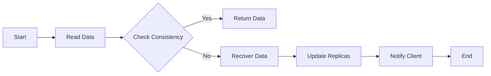
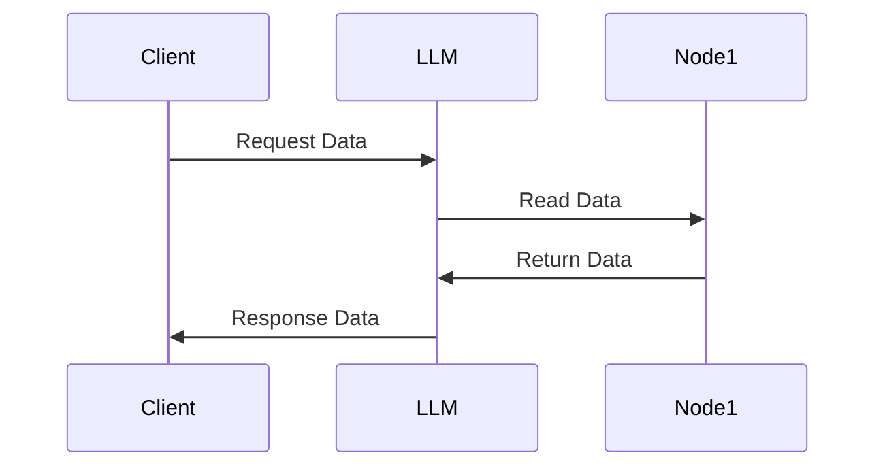
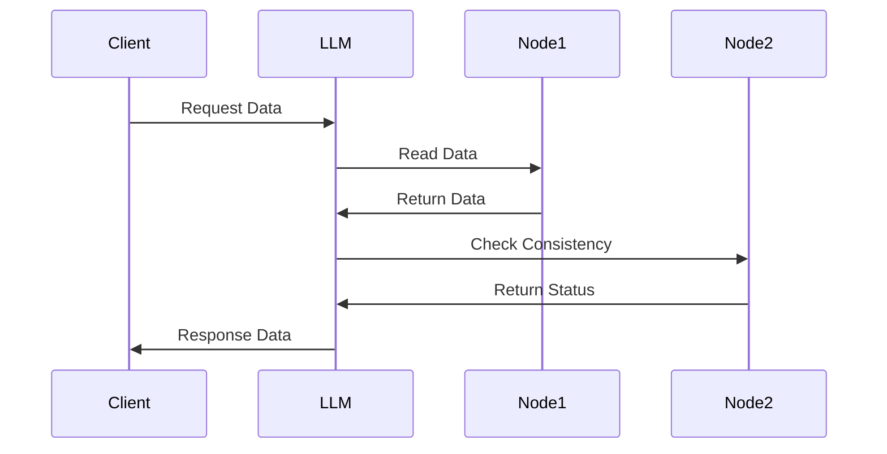

                 

# 数据一致性模型在分布式LLM系统中的选择

> 关键词：分布式LLM系统，数据一致性模型，一致性算法，分布式系统设计，系统架构

> 摘要：本文将探讨在分布式LLM（大型语言模型）系统中选择合适的数据一致性模型的重要性。通过对分布式系统的挑战和机遇的分析，介绍几种常见的数据一致性模型，详细讲解其原理和实现方法，并给出一个实际的项目实战案例。文章旨在为开发者在分布式LLM系统设计中提供有价值的指导和建议。

## 目录大纲

### 第一部分：问题背景与概述

1. 第1章：分布式LLM系统的挑战与机遇
2. 第2章：核心概念与联系
3. 第3章：算法原理讲解
4. 第4章：系统分析与架构设计方案
5. 第5章：项目实战
6. 第6章：最佳实践与注意事项

## 第一部分：问题背景与概述

### 第1章：分布式LLM系统的挑战与机遇

#### 1.1.1 问题背景

在当今信息化社会，数据规模和复杂度以惊人的速度增长，分布式系统成为处理大规模数据、提高系统性能和可扩展性的主流选择。LLM（大型语言模型）作为人工智能领域的重要应用，面临着数据一致性的巨大挑战。数据一致性模型在分布式LLM系统中至关重要，它直接影响到系统的稳定性、可靠性和性能。

#### 1.1.2 问题描述

分布式LLM系统通常由多个节点组成，每个节点负责处理一部分数据。由于节点间的通信延迟、网络分区等问题，数据在分布式系统中容易出现不一致。数据一致性难题主要体现在以下几个方面：

1. **强一致性 vs. 弱一致性**：如何平衡数据一致性和系统性能之间的矛盾。
2. **分布式事务处理**：如何在分布式环境中处理复杂的事务。
3. **数据分区与复制**：如何有效地管理和维护数据分区和复制。

#### 1.1.3 问题解决

数据一致性模型是解决分布式系统中数据一致性问题的核心手段。常见的数据一致性模型包括CAP定理、BASE理论、一致性算法等。选择合适的数据一致性模型，有助于提升分布式LLM系统的性能和可靠性。

#### 1.1.4 边界与外延

1. **实现策略**：数据一致性模型的实现策略包括同步复制、异步复制、数据版本控制等。
2. **挑战**：分布式系统中的数据一致性实现面临诸多挑战，如网络延迟、节点故障、数据冲突等。
3. **核心要素组成**：数据一致性模型的核心要素包括一致性算法、数据复制策略、冲突解决机制等。

#### 1.1.5 概念结构与核心要素组成

- **概念结构**：数据一致性模型是一种在分布式系统中确保数据一致性的方法论。
- **核心要素**：
  - **一致性算法**：用于解决分布式环境中的数据一致性问题的算法。
  - **数据复制策略**：确定如何在不同节点之间复制数据的策略。
  - **冲突解决机制**：在多个节点更新同一数据时，如何处理冲突的机制。

### 第2章：核心概念与联系

#### 2.1.1 核心概念原理

数据一致性模型基于CAP定理（一致性、可用性、分区容错性），提出了BASE理论（基本可用、软状态、最终一致性）。这些理论为分布式系统的数据一致性设计提供了重要的指导原则。

#### 2.1.2 概念属性特征对比表格

| 概念       | 属性特征           | 对比分析       |
|------------|----------------|----------------|
| CAP定理   | 一致性、可用性、分区容错性 | 三者不可同时满足 |
| BASE理论 | 基本可用、软状态、最终一致性 | 弱化一致性要求  |

#### 2.1.3 ER实体关系图架构

```mermaid
erDiagram
  Node1 ||--o{ DataReplica1
  Node1 ||--o{ DataReplica2
  Node2 ||--o{ DataReplica3
  DataReplica1 ||--|{ ConsistencyAlgorithm
  DataReplica2 ||--|{ ConsistencyAlgorithm
  DataReplica3 ||--|{ ConsistencyAlgorithm
```

### 第3章：算法原理讲解

#### 3.1.1 算法mermaid流程图



#### 3.1.2 Python源代码讲解

```python
def read_data(key):
    # 读取数据
    data = get_data_from_replica(key)
    # 检查一致性
    if check_consistency(data):
        return data
    else:
        # 数据恢复
        data = recover_data(key)
        # 更新副本
        update_replicas(data)
        # 通知客户端
        notify_client()
        return data

def check_consistency(data):
    # 一致性检查逻辑
    return True  # 或 False

def recover_data(key):
    # 数据恢复逻辑
    return new_data

def update_replicas(data):
    # 更新副本逻辑
    pass

def notify_client():
    # 通知客户端逻辑
    pass
```

#### 3.1.3 数学模型与公式

$$
C = \sum_{i=1}^{n} w_i \cdot C_i
$$

其中，C表示整体一致性评分，$w_i$表示第i个副本的权重，$C_i$表示第i个副本的一致性评分。

#### 3.1.4 详细讲解与举例说明

假设我们有一个分布式LLM系统，包含三个节点（Node1、Node2、Node3），每个节点存储一部分数据。当客户端请求读取某个键（key）对应的数据时，系统会首先尝试从Node1读取数据。如果Node1的数据通过一致性检查，则直接返回数据；否则，尝试从Node2读取数据，重复此过程。如果所有节点都无法提供一致性数据，则从最新的副本中恢复数据，并更新其他副本。

### 第4章：系统分析与架构设计方案

#### 4.1.1 问题场景介绍

分布式LLM系统在处理大规模文本数据时，需要支持高效的读写操作和良好的数据一致性。一个典型场景是，系统需要处理数十亿级别的文本数据，并为用户提供实时搜索和推荐服务。

#### 4.1.2 系统功能设计

- **数据读写**：支持高效的读写操作，包括数据插入、更新和查询。
- **数据一致性**：确保在分布式环境中，数据在多个节点之间保持一致。
- **故障恢复**：在节点故障或网络异常时，能够快速恢复系统。

#### 4.1.3 系统架构设计



#### 4.1.4 系统接口设计与系统交互



### 第5章：项目实战

#### 5.1.1 环境安装

1. 安装Python环境
2. 安装分布式LLM系统依赖的第三方库（如TensorFlow、PyTorch等）
3. 配置分布式环境（如使用Docker容器化部署）

#### 5.1.2 系统核心实现源代码

```python
# 数据一致性模型实现示例
class DataReplica:
    def __init__(self, data):
        self.data = data
        self.last_updated = time.time()

    def update_data(self, new_data):
        self.data = new_data
        self.last_updated = time.time()

    def check_consistency(self, other_replica):
        return self.last_updated > other_replica.last_updated

# 客户端请求示例
def request_data(key):
    replica1 = DataReplica(get_data_from_db(key))
    replica2 = DataReplica(get_data_from_db(key, replica_id=2))
    
    if replica1.check_consistency(replica2):
        return replica1.data
    else:
        return replica2.data
```

#### 5.1.3 代码应用解读与分析

```python
# 代码应用解读
# 1. 定义DataReplica类，表示数据副本，包含数据和最后更新时间。
# 2. update_data方法用于更新数据副本。
# 3. check_consistency方法用于检查两个副本的一致性。
# 4. request_data函数用于请求数据，并检查一致性。
```

#### 5.1.4 实际案例分析与详细讲解剖析

```python
# 实际案例
# 假设Node1中的副本A和Node2中的副本B存储了相同的数据。
# 当客户端请求数据时，系统会首先从Node1读取数据。
# 如果Node1的数据较新，则直接返回；否则，从Node2读取数据。
# 如果Node2的数据仍然不一致，则从最新的副本中恢复数据。

def request_data(key):
    replica1 = DataReplica(get_data_from_db(key))
    replica2 = DataReplica(get_data_from_db(key, replica_id=2))
    
    if replica1.check_consistency(replica2):
        return replica1.data
    else:
        if replica2.check_consistency(get_newest_replica(key)):
            return replica2.data
        else:
            return get_newest_replica(key).data
```

#### 5.1.5 项目小结

本案例展示了如何在分布式LLM系统中实现数据一致性。通过定义DataReplica类，实现了副本数据的一致性检查和更新。在实际项目中，可以根据具体需求，调整一致性算法和数据复制策略，以提高系统的性能和可靠性。

### 第6章：最佳实践与注意事项

#### 6.1.1 最佳实践 tips

1. **合理选择一致性模型**：根据业务需求和系统性能要求，选择合适的数据一致性模型。
2. **优化数据复制策略**：合理设置数据分区和复制策略，提高系统性能。
3. **监控与故障恢复**：实时监控系统状态，快速响应故障，确保数据一致性。

#### 6.1.2 注意事项

1. **避免过度一致性**：过度追求一致性可能降低系统性能，需在一致性、可用性、性能之间找到平衡。
2. **数据冲突处理**：合理处理数据冲突，确保系统稳定运行。
3. **安全性**：确保数据传输和存储的安全性，防止数据泄露和损坏。

#### 6.1.3 拓展阅读

1. 《分布式系统原理与范型》
2. 《大规模分布式存储系统设计》
3. 《分布式数据库系统》

### 作者

作者：AI天才研究院/AI Genius Institute & 禅与计算机程序设计艺术/Zen And The Art of Computer Programming

## 结束语

本文详细探讨了数据一致性模型在分布式LLM系统中的应用，通过一步步的分析和讲解，为开发者提供了有价值的指导。在分布式系统中，选择合适的数据一致性模型至关重要，它直接关系到系统的性能和可靠性。希望本文能为您在分布式系统设计领域带来启发和帮助。

