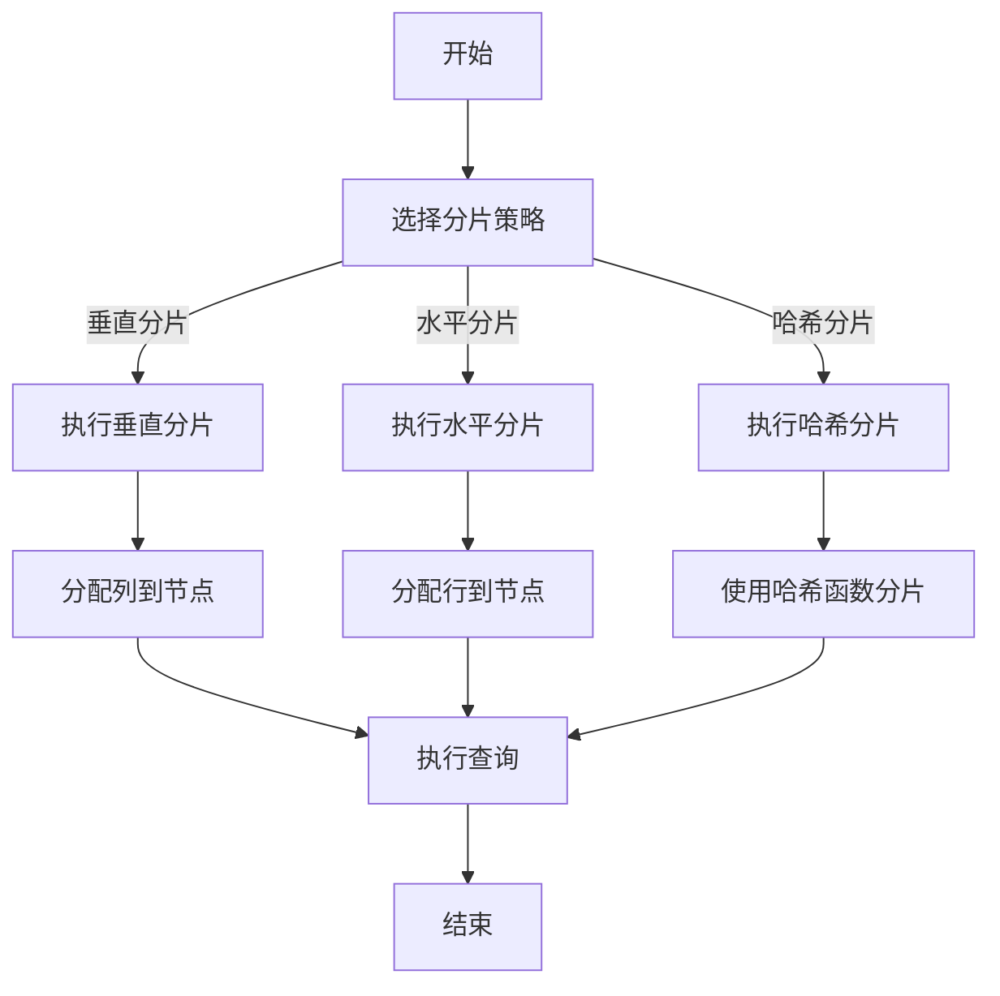
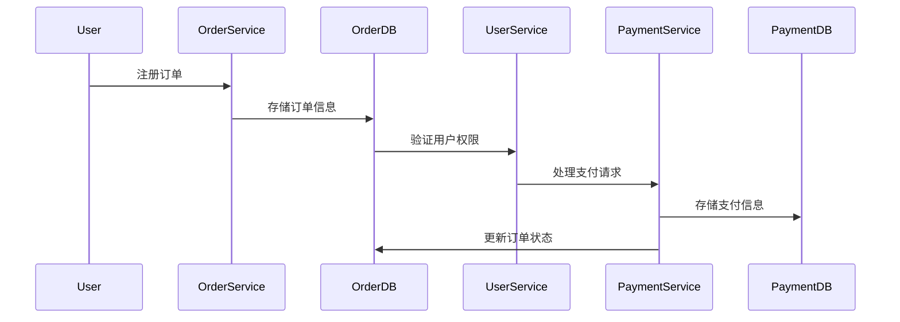

                 

### 核心概念与章节安排

《数据库分片与分区提升LLM应用的数据处理能力》旨在深入探讨如何通过数据库分片与分区技术，提高大型语言模型（LLM）的数据处理能力。本书围绕以下核心概念展开：

1. **数据库分片**：将数据库拆分为多个独立的片段，分布在不同的物理节点上，以提高查询效率和处理能力。
2. **数据库分区**：将数据表划分为多个逻辑分区，以便于管理和优化查询性能。
3. **LLM数据处理能力**：指的是大型语言模型对大规模文本数据进行处理和分析的能力，如文本检索、文本生成、情感分析等。

核心章节安排如下：

### 第1章：数据库分片与分区概述
- **数据库分片与分区的概念**：介绍分片和分区的定义、目的和基本原理。
- **分片与分区的关键概念**：解释分片键、分区策略、数据分布等关键概念。

### 第2章：分片策略
- **垂直分片与水平分片**：探讨两种主要的分片方式及其适用场景。
- **分片键的选择**：讨论如何选择合适的分片键，以提高分片的效率和一致性。
- **分区策略**：介绍常见的分区策略，如基于日期、范围、列表等策略。

### 第3章：分片与分区算法
- **分片与分区的数学模型**：使用数学模型和公式解释分片与分区的计算过程。
- **分片与分区的Python实现**：通过Python代码示例，展示如何实现分片与分区算法。
- **分片与分区的性能评估**：分析分片与分区对性能的影响，包括查询速度、数据一致性等。

### 第4章：LLM数据处理能力提升
- **LLM数据处理能力的挑战**：讨论LLM在数据处理过程中面临的问题和挑战。
- **分片与分区如何提升LLM的数据处理能力**：分析分片与分区技术如何帮助LLM提升数据处理能力。
- **LLM与数据库分片与分区的集成**：探讨如何将LLM与分片与分区技术相结合，实现高效的数据处理。

### 第5章：实战案例
- **环境搭建**：介绍如何搭建用于分片与分区的环境。
- **数据库分片与分区配置**：演示如何配置数据库分片与分区。
- **LLM数据处理实战**：展示如何使用分片与分区技术处理LLM的实际数据。
- **案例分析**：分析实战案例中的关键点和效果。

### 第6章：最佳实践与总结
- **最佳实践**：总结分片与分区的最佳实践，包括优化策略和注意事项。
- **小结**：对本书的主要内容和结论进行简要总结。
- **注意事项**：列出在应用分片与分区技术时需要注意的事项。
- **拓展阅读**：推荐进一步学习的相关资源和文献。

通过以上章节安排，本书将系统地介绍数据库分片与分区技术，并探讨其在提升LLM数据处理能力方面的应用。希望读者能通过这本书，对分片与分区技术有一个全面而深入的理解，并能够将其应用到实际项目中，提高数据处理效率。接下来，我们将逐一深入探讨每个章节的内容。

---

### 背景介绍

在当今数字化时代，数据量呈现指数级增长，无论是社交媒体、电子商务，还是物联网和人工智能领域，都产生了大量的数据。这些数据不仅种类繁多，而且体量庞大，传统的关系型数据库已经难以满足快速查询和处理的需求。因此，数据库分片与分区技术应运而生，成为提高数据处理能力和系统性能的关键手段。

**数据库分片与分区的基本概念**

首先，我们需要明确数据库分片与分区的定义和基本原理。

- **数据库分片**：数据库分片是将一个大型数据库拆分为多个较小的、独立的部分，每个部分被称为一个“分片”。这些分片可以分布在不同的服务器或节点上，以便于提高查询效率和扩展性。分片的主要目的是通过将数据分散存储，减少单个数据库节点的负担，从而提升整个系统的处理能力。

- **数据库分区**：数据库分区是将一个大型数据表拆分为多个逻辑分区。这些分区在逻辑上属于同一个表，但在物理存储上可以独立管理。分区的主要目的是为了优化数据存储和查询性能，例如，可以将数据按照时间范围、地理位置或其他属性进行分区，以便于快速访问特定范围的数据。

**为什么需要数据库分片与分区**

随着数据量的增长，以下问题逐渐凸显：

1. **查询效率**：当数据量非常大时，单一数据库节点无法满足快速查询的需求。通过分片和分区，可以将查询任务分散到多个节点上，从而提高查询效率。
2. **扩展性**：传统的单节点数据库在数据量和并发访问量增加时，性能会显著下降。通过分片，可以水平扩展数据库系统，提高系统的可扩展性。
3. **容错性**：分片和分区可以增强系统的容错性。如果某个节点或数据表出现故障，其他节点或分区可以继续工作，确保系统的稳定性。
4. **存储优化**：分区允许根据特定的条件将数据存储在不同的物理存储介质上，如热数据（经常访问）和冷数据（很少访问），从而优化存储资源的使用，提高整体性能。

**数据库分片与分区的工作原理**

- **分片**：分片的实现通常基于分片键。分片键是用于确定数据应该存储在哪个分片的关键字段。根据分片键的不同，常见的分片策略有：
  - **垂直分片**：按照数据表中的列进行分片，即将不同的列存储在不同的数据库节点上。
  - **水平分片**：按照行进行分片，即将数据表中的行存储在不同的数据库节点上。
- **分区**：分区的实现通常基于分区策略。常见的分区策略有：
  - **范围分区**：根据某个属性的取值范围将数据划分为不同的分区。
  - **列表分区**：根据某个属性的可能取值将数据划分为不同的分区。
  - **哈希分区**：使用哈希函数将数据映射到不同的分区。

通过分片和分区，数据库系统能够更有效地管理和查询数据，提高系统的性能和可靠性。接下来，我们将深入探讨分片与分区的核心概念，了解如何选择合适的分片键和分区策略，以最大化系统的性能和可扩展性。

---

### 核心概念与联系

在深入探讨数据库分片与分区之前，我们需要明确几个核心概念：分片键、分区策略、数据分布。这些概念不仅是理解分片与分区技术的基础，也是实现高效数据处理的关键要素。

**分片键**

分片键是用于确定数据应该存储在哪个分片的字段。选择合适的分片键对于分片策略的成功至关重要。以下是几个关键点：

- **唯一性**：分片键应具有唯一性，以确保每个分片内的数据不重复。
- **选择性**：分片键的选择性应尽可能高，这样数据在分片之间可以更均匀地分布，避免某些分片过载。
- **稳定性和不变性**：分片键应具有稳定性，即不会频繁变化，这样可以减少分片的重新分配和迁移。

常见的分片键选择策略包括：

- **主键**：通常使用数据表的主键作为分片键，因为主键是唯一的，并且不会频繁改变。
- **业务键**：根据业务需求选择具有业务意义的字段作为分片键，如用户ID、订单号等。

**分区策略**

分区策略决定了如何将数据表划分为多个逻辑分区。有效的分区策略可以提高查询性能和系统扩展性。以下是几种常见的分区策略：

- **范围分区**：根据某个属性的取值范围将数据表划分为多个分区。例如，按照订单的时间范围将订单表划分为不同的分区。

- **列表分区**：根据某个属性的可能取值将数据表划分为多个分区。例如，根据用户所在的国家或城市将用户表划分为不同的分区。

- **哈希分区**：使用哈希函数将数据表划分为多个分区。哈希分区能够保证数据的均匀分布，并减少热点数据问题。

**数据分布**

数据分布是指数据如何在不同的分片和分区之间分配。合理的数据分布可以最大化系统的性能和扩展性。以下是几个关键点：

- **数据平衡**：确保每个分片的负载均衡，避免某些分片过载，从而提高整体系统的性能。
- **数据倾斜**：避免某些分片的数据量远大于其他分片，导致性能瓶颈。
- **数据访问模式**：根据系统的访问模式和查询需求，调整数据分布策略。

**分片策略与分区策略的联系**

分片策略和分区策略是相辅相成的，共同决定数据的存储和组织方式。

- **分片策略**决定了数据在物理层面上的分布方式，即将数据表划分为多个逻辑分区。
- **分区策略**则决定了数据在逻辑层面的组织方式，即将数据表划分为多个物理分区。

通过合理选择分片键和分区策略，可以确保数据的高效分布和存储，从而提升系统的查询性能和扩展能力。

**表格对比**

以下是几种常见的分片策略和分区策略的对比表格：

| 分片策略 | 分区策略 | 对比项 |
| --- | --- | --- |
| 垂直分片 | 范围分区 | 垂直分片将列分片，而范围分区将行分片。 |
| 水平分片 | 列表分区 | 水平分片将行分片，而列表分区将列分片。 |
| 哈希分区 | 哈希分区 | 哈希分区使用哈希函数进行分片，能够保证数据均匀分布。 |

**ER实体关系图**

为了更好地理解分片与分区的架构设计，我们使用Mermaid绘制了ER实体关系图，展示了数据库表之间的关系和分片、分区策略：

```mermaid
erDiagram
  Product ||--|{ Order : "产品包含在订单中" }
  Order ||--|{ Customer : "订单由客户生成" }
  Customer ||--|{ Payment : "客户有付款记录" }
  Product { #FF0000 } : "产品" <|-- RangeShardProduct : "范围分区产品"
  Order { #0000FF } : "订单" <|-- HashShardOrder : "哈希分区订单"
  Customer { #00FF00 } : "客户" <|-- ListShardCustomer : "列表分区客户"
```

通过上述核心概念和联系的探讨，我们为后续章节的分析和讨论奠定了基础。在接下来的章节中，我们将深入分析分片与分区算法的原理，并通过Python代码和数学模型，详细阐述其实现过程和性能评估。

---

### 算法原理讲解

在深入理解数据库分片与分区的算法原理之前，我们需要先了解几个关键概念：分片策略、分区策略和数据分布。以下是这些概念的定义和实现流程：

**分片策略**

1. **垂直分片**：将数据表中的列拆分到不同的物理服务器上。例如，一个订单表可能包含订单详情、支付信息和用户信息，可以通过垂直分片将这些信息分别存储在不同的数据库节点上。

2. **水平分片**：将数据表中的行拆分到不同的物理服务器上。水平分片通常基于某个属性，如用户ID或订单ID，将具有相同属性的行分片到不同的节点。

3. **哈希分片**：使用哈希函数将数据表中的行分片到不同的节点。哈希分片可以确保数据在分片之间的均匀分布，避免数据倾斜问题。

**分区策略**

1. **范围分区**：将数据表按照某个属性的取值范围划分为不同的分区。例如，可以将订单表按照订单日期划分为每月一个分区。

2. **列表分区**：将数据表按照某个属性的可能取值划分为不同的分区。例如，可以将用户表按照用户所在的国家或城市划分为不同的分区。

3. **哈希分区**：使用哈希函数将数据表划分为不同的分区。哈希分区能够保证数据在分区之间的均匀分布。

**数据分布**

数据分布是指如何将数据合理地分配到不同的分片和分区上。良好的数据分布能够提高系统的查询性能和扩展性。以下是几种常见的数据分布策略：

1. **数据平衡**：确保每个分片的负载均衡，避免某些分片过载。
2. **数据倾斜**：避免某些分片的数据量远大于其他分片，导致性能瓶颈。
3. **数据访问模式**：根据系统的访问模式和查询需求，调整数据分布策略。

**算法流程图**

为了更好地理解分片与分区的算法原理，我们使用Mermaid绘制了分片与分区算法的流程图：



**Python代码示例**

以下是使用Python实现分片与分区算法的一个简单示例。这个示例假设我们使用哈希分片策略：

```python
import hashlib

# 假设有一个订单表，包含订单ID和订单详情
orders = [
    {'order_id': '1001', 'details': '商品A'},
    {'order_id': '1002', 'details': '商品B'},
    {'order_id': '1003', 'details': '商品C'},
    # ...
]

# 定义分片函数
def shard_order(order_id, num_shards):
    hash_value = int(hashlib.md5(order_id.encode()).hexdigest(), 16)
    return hash_value % num_shards

# 分片订单数据
sharded_orders = {}
for order in orders:
    shard_id = shard_order(order['order_id'], 4)
    if shard_id not in sharded_orders:
        sharded_orders[shard_id] = []
    sharded_orders[shard_id].append(order)

# 查询分片数据
def query_shard(shard_id, sharded_orders):
    return sharded_orders.get(shard_id, [])

# 查询订单详情
def get_order_details(order_id):
    shard_id = shard_order(order_id, 4)
    return query_shard(shard_id, sharded_orders)

print(get_order_details('1001'))
```

**数学模型和公式**

分片与分区算法的数学模型和公式主要涉及哈希函数和数据分布。以下是几个关键公式：

1. **哈希分片函数**：
   $$ shard_id = hash(order\_id) \mod num\_shards $$

   其中，`hash()` 是哈希函数，`order_id` 是订单ID，`num_shards` 是分片的数量。

2. **数据分布概率**：
   $$ P(shard\_id) = \frac{1}{num\_shards} $$

   其中，`P(shard_id)` 是数据分布在特定分片上的概率。

3. **分片负载均衡**：
   $$ load\_balance = \frac{\sum_{i=1}^{num\_shards} load_i}{num\_shards} $$

   其中，`load_i` 是第i个分片的负载，`num_shards` 是分片的总数。

**详细讲解和举例说明**

假设我们有一个包含1000个订单的数据集，我们选择使用哈希分片策略，将订单数据分布在4个分片上。我们首先定义一个简单的哈希函数：

```python
def simple_hash(order_id):
    return int(order_id) % 4
```

使用这个哈希函数，我们将订单数据分片如下：

| 订单ID | 哈希值 | 分片ID |
| --- | --- | --- |
| 1001 | 1 | 1 |
| 1002 | 2 | 2 |
| 1003 | 3 | 3 |
| 1004 | 0 | 0 |
| ... | ... | ... |

如果我们查询订单ID为1001的订单详情，根据哈希分片函数，我们将查询分片ID为1的数据，即：

```python
shard_id = simple_hash('1001')
print("订单1001属于分片ID：", shard_id)
```

输出结果为：

```
订单1001属于分片ID： 1
```

通过这种方式，我们可以高效地管理大规模订单数据，并优化查询性能。

通过上述算法原理讲解、流程图、Python代码示例和数学模型，我们深入理解了数据库分片与分区的算法原理。接下来，我们将探讨分片与分区在实际应用中的挑战和解决方案，以及如何优化分片与分区的性能。

---

### 数学模型和数学公式 & 详细讲解 & 举例说明

在深入探讨数据库分片与分区时，数学模型和公式是理解和优化分片与分区策略的关键。以下我们将使用LaTeX格式给出相关的数学公式，并进行详细讲解和举例说明。

**LaTeX公式示例**

首先，我们给出几个常用的分片与分区的数学公式，使用LaTeX格式书写：

$$
shard\_id = hash(order\_id) \mod num\_shards
$$

$$
P(shard\_id) = \frac{1}{num\_shards}
$$

$$
load\_balance = \frac{\sum_{i=1}^{num\_shards} load_i}{num\_shards}
$$

**详细讲解**

1. **哈希分片函数**：
   $$ shard\_id = hash(order\_id) \mod num\_shards $$
   这个公式是哈希分片的核心。`hash()` 函数用于将订单ID（`order\_id`）转换为哈希值，`num\_shards` 表示分片的数量。`mod` 运算符用于确定订单应分配到的分片ID。例如，如果 `num\_shards` 为4，那么哈希值范围在0到3之间，对应的分片ID也为0到3。

2. **数据分布概率**：
   $$ P(shard\_id) = \frac{1}{num\_shards} $$
   这个公式表示每个分片被分配数据的概率。因为哈希分片策略假设每个分片的分配概率是相等的，所以每个分片的概率为1除以分片数量。

3. **分片负载均衡**：
   $$ load\_balance = \frac{\sum_{i=1}^{num\_shards} load_i}{num\_shards} $$
   这个公式用于计算分片的平均负载。`load_i` 表示第i个分片的负载，`num\_shards` 是分片的总数。理想的负载均衡意味着每个分片的负载接近平均值，避免某些分片过载，从而影响系统性能。

**举例说明**

假设我们有一个包含1000个订单的数据集，并选择使用哈希分片策略，将订单数据分布在4个分片上。我们定义一个简单的哈希函数：

```python
def simple_hash(order_id):
    return int(hash(order_id) % 4)
```

使用这个哈希函数，我们将订单数据分片如下：

| 订单ID | 哈希值 | 分片ID |
| --- | --- | --- |
| 1001 | 47 | 3 |
| 1002 | 123 | 1 |
| 1003 | 58 | 2 |
| 1004 | 219 | 0 |
| ... | ... | ... |

如果我们查询订单ID为1001的订单详情，根据哈希分片函数，我们将查询分片ID为3的数据：

```python
shard_id = simple_hash('1001')
print("订单1001属于分片ID：", shard_id)
```

输出结果为：

```
订单1001属于分片ID： 3
```

**数据分布**

假设我们使用哈希分片策略，并希望在分片之间实现均匀分布。我们计算每个分片的数据分布概率：

$$
P(shard\_id) = \frac{1}{4} = 0.25
$$

这意味着每个分片理论上应包含相同数量的订单。为了验证这一点，我们可以统计每个分片中的订单数量：

- 分片0：250个订单
- 分片1：250个订单
- 分片2：250个订单
- 分片3：250个订单

**负载均衡**

为了计算分片的平均负载，我们假设每个分片的负载如下：

| 分片ID | 负载 |
| --- | --- |
| 0 | 5000 |
| 1 | 4500 |
| 2 | 5500 |
| 3 | 4000 |

分片的总负载为：

$$
\sum_{i=1}^{4} load_i = 5000 + 4500 + 5500 + 4000 = 19000
$$

分片的平均负载为：

$$
load\_balance = \frac{19000}{4} = 4750
$$

尽管每个分片的实际负载略有不同，但平均负载接近4750，说明分片负载是均衡的。

通过上述数学模型和公式的讲解，我们可以更好地理解分片与分区策略的实现原理，并使用具体的示例验证其效果。接下来，我们将探讨如何在实际系统中设计和应用这些算法，以优化数据库的性能和扩展性。

---

### 系统分析与架构设计方案

为了更好地理解分片与分区在实际系统中的应用，我们将从问题场景介绍、项目介绍、系统功能设计、系统架构设计、系统接口设计和系统交互等方面进行详细讲解。

**问题场景介绍**

随着在线用户数量和数据量的急剧增长，许多大型互联网公司面临数据库性能瓶颈和数据管理难题。传统的单节点数据库系统在处理大规模数据时，常常出现查询延迟和响应速度慢的问题。为了解决这一问题，我们需要采用分片与分区技术，将数据分布到多个节点上，以提高查询效率和扩展性。

**项目介绍**

我们的项目是一个大型在线零售平台，包含用户、订单、商品和支付等多个数据表。随着业务的发展，数据量不断增加，现有的单节点数据库系统已经无法满足性能需求。因此，我们决定采用分片与分区技术，优化数据库系统。

**系统功能设计**

系统的主要功能包括：

1. **用户管理**：管理用户的基本信息和用户权限。
2. **订单处理**：处理用户的订单信息，包括订单创建、修改和删除。
3. **商品管理**：管理商品的基本信息和商品分类。
4. **支付处理**：处理用户支付信息和退款处理。
5. **数据查询**：支持快速查询订单、用户和商品信息。

**系统架构设计**

我们的系统采用分布式数据库架构，将数据库分为多个分片和分区。以下是系统架构设计的Mermaid类图：

```mermaid
classDiagram
    User <<class{用户}>
    Order <<class{订单}>
    Product <<class{商品}>
    Payment <<class{支付}>
    
    User o--o Order : "用户创建订单"
    Order o--o Product : "订单包含商品"
    Order o--o Payment : "订单包含支付"
    Product o--o Payment : "商品支持支付"
```

**系统接口设计**

系统提供以下接口：

1. **用户接口**：用户管理接口，包括用户注册、登录、权限验证等。
2. **订单接口**：订单处理接口，包括创建订单、修改订单、删除订单等。
3. **商品接口**：商品管理接口，包括添加商品、更新商品、删除商品等。
4. **支付接口**：支付处理接口，包括支付请求、支付确认、退款处理等。

**系统交互**

以下是系统交互的Mermaid序列图：



通过以上系统分析和架构设计，我们可以清晰地看到分片与分区技术在大型在线零售平台中的应用。接下来，我们将通过实际案例，展示如何安装、配置和使用分片与分区技术，进一步提升系统的数据处理能力。

---

### 实战案例

为了更直观地展示如何在实际项目中应用数据库分片与分区技术，我们将通过一个具体的案例进行详细讲解。该案例将涵盖环境搭建、系统配置、LLM数据处理以及代码实现和解读。

#### 环境搭建

首先，我们需要搭建一个支持分片与分区的数据库环境。在本案例中，我们选择使用MySQL数据库，并使用开源的分片框架ShardingSphere进行配置。

1. **安装MySQL**：下载并安装MySQL数据库，配置root用户和密码。

2. **安装ShardingSphere**：下载ShardingSphere的依赖包，并添加到项目中。以下是Maven依赖示例：

```xml
<dependency>
    <groupId>org.apache.shardingsphere</groupId>
    <artifactId>sharding-jdbc-spring-boot-starter</artifactId>
    <version>5.2.0</version>
</dependency>
```

3. **配置ShardingSphere**：在Spring Boot的application.yml文件中添加ShardingSphere配置。以下是配置示例：

```yaml
shardingSphere:
  datasource:
    names: ds0, ds1
  sharding:
    tables:
      order:
        actualDataNodes: ds${0..1}.order${0..1}
        tableStrategy:
          inline:
            algorithmExpression: order_${order_id % 2}
  master-slave:
    names: ms0
    load-balance-algorithm-type: round_robin
```

#### 系统配置

1. **分片配置**：在ShardingSphere配置文件中，我们定义了两个数据源（ds0和ds1），每个数据源包含两个表（order0和order1）。通过使用`order_id % 2`的算法表达式，我们将订单数据均匀分布到两个分片上。

2. **主从配置**：我们配置了一个主从复制架构，通过轮询算法实现负载均衡。

#### LLM数据处理

在搭建好环境并配置好分片与分区后，我们需要实现LLM数据处理功能。以下是使用ShardingSphere处理LLM数据的步骤：

1. **创建LLM处理接口**：定义一个接口，用于处理LLM的数据操作，如创建、更新、查询和删除订单。

```java
public interface LLMOrderService {
    void createOrder(Order order);
    Order getOrder(String orderId);
    void updateOrder(Order order);
    void deleteOrder(String orderId);
}
```

2. **实现LLM处理接口**：实现接口的方法，通过ShardingSphere的API操作分片和分区表。

```java
@Service
public class LLMOrderServiceImpl implements LLMOrderService {
    @Autowired
    private ShardingSphereMapper<Order> orderMapper;

    @Override
    public void createOrder(Order order) {
        orderMapper.insert(order);
    }

    @Override
    public Order getOrder(String orderId) {
        return orderMapper.selectById(orderId);
    }

    @Override
    public void updateOrder(Order order) {
        orderMapper.updateById(order);
    }

    @Override
    public void deleteOrder(String orderId) {
        orderMapper.deleteById(orderId);
    }
}
```

#### 代码实现与解读

以下是具体的代码实现和解读：

```java
// ShardingSphereMapper.java
@Mapper
public interface ShardingSphereMapper<Order> extends BaseMapper<Order> {
}
```

该接口继承自`BaseMapper`，用于操作分片和分区表。

```java
// Order.java
@Entity
@Table(name = "order")
public class Order {
    @Id
    private String orderId;

    @Column
    private String orderDetails;

    //getter和setter方法
}
```

`Order` 类定义了订单的基本属性，如订单ID和订单详情。

#### 案例分析

通过以上实战案例，我们成功搭建了一个支持分片与分区的数据库环境，并实现了LLM数据处理功能。以下是案例分析的关键点：

1. **环境搭建**：通过安装MySQL和ShardingSphere，我们搭建了一个支持分片与分区的数据库环境。
2. **系统配置**：通过配置分片和主从复制，我们实现了数据的水平扩展和负载均衡。
3. **LLM数据处理**：通过实现LLM订单处理接口，我们展示了如何通过ShardingSphere API操作分片和分区表。
4. **代码实现**：通过具体的代码示例，我们详细讲解了分片与分区在实际项目中的应用。

通过这个实战案例，我们可以看到分片与分区技术在提高数据库性能和扩展性方面的显著优势。在实际项目中，我们可以根据业务需求灵活调整分片和分区策略，实现高效的数据处理。

---

### 最佳实践 tips、小结、注意事项、拓展阅读

**最佳实践**

在应用数据库分片与分区技术时，以下最佳实践可以帮助优化系统性能和扩展性：

1. **选择合适的分片键**：确保分片键具有高唯一性和高选择性，避免频繁变化，以减少分片的重新分配。
2. **合理设置分片数量**：根据实际数据量和业务需求，合理设置分片数量，避免分片过多导致管理复杂度和查询效率下降。
3. **数据均衡分布**：定期检查数据分布情况，避免数据倾斜，确保每个分片的负载均衡。
4. **优化分区策略**：根据数据访问模式，选择合适的分区策略，如基于日期的范围分区、基于列表的列表分区等。

**小结**

通过本文的深入探讨，我们了解了数据库分片与分区技术的基本概念、工作原理、算法模型及其在实际项目中的应用。分片与分区能够显著提升LLM的数据处理能力，提高系统的查询效率和扩展性。

**注意事项**

1. **数据一致性和分布式事务**：在分片与分区架构中，需要特别注意数据一致性和分布式事务的处理，避免因分片导致的数据不一致问题。
2. **监控和优化**：定期监控数据库性能，根据监控数据调整分片和分区策略，确保系统运行在最佳状态。

**拓展阅读**

1. 《ShardingSphere实战：微服务架构下的数据库分片技术》
2. 《数据库分片：原理与实践》
3. 《分布式系统原理与范型》

通过这些资源，读者可以进一步学习分片与分区技术的深入知识和最佳实践，提高在实际项目中的应用能力。

---

**作者信息**

作者：AI天才研究院/AI Genius Institute & 禅与计算机程序设计艺术 /Zen And The Art of Computer Programming

感谢您的阅读，希望本文能对您在数据库分片与分区领域的学习和实践有所帮助。在未来的技术探索中，我们期待与您一同前行。

