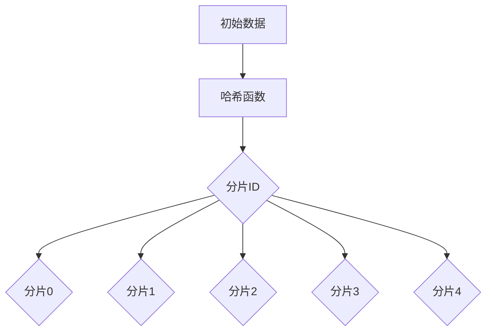
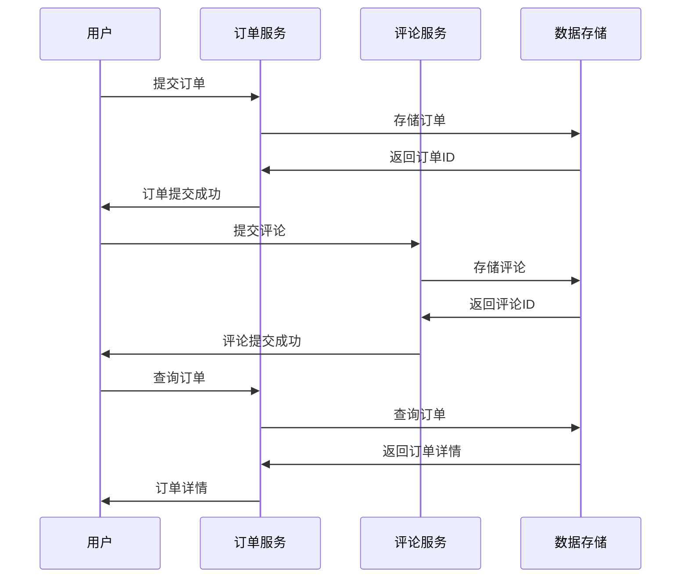

                 

### 第1章：数据库分片概述

## 1.1 问题背景与目标

随着互联网和大数据技术的发展，现代应用面临的挑战日益严峻。传统的关系型数据库在处理海量数据和并发访问时，往往表现出性能瓶颈，难以满足日益增长的需求。数据库分片（Sharding）作为分布式数据库的一种实现方式，旨在通过水平分割数据来扩展数据库系统的存储能力和处理能力。其核心目标是通过将数据拆分到多个节点上，提高系统的可扩展性和容错性。

分片的需求源于以下几个方面：

1. **数据量激增**：随着用户数量的增加和数据生成频率的提升，单机数据库难以承载海量数据。
2. **并发访问**：随着同时访问数据库的用户数量的增加，单机数据库的并发处理能力受限。
3. **业务需求**：某些业务场景需要将数据分散存储，以提高数据的访问速度和系统的可用性。
4. **系统扩展性**：传统的单机数据库难以通过简单的硬件升级来满足不断增长的业务需求。

数据库分片的目标是：

1. **水平扩展**：通过增加节点数量来提高系统的存储和处理能力。
2. **负载均衡**：将读写请求均衡分布到各个节点，避免单点热点。
3. **高可用性**：通过数据复制和冗余策略，提高系统的容错能力和数据安全性。
4. **低延迟**：通过数据分片，减少数据的传输距离，降低访问延迟。

## 1.2 数据库分片的概念

数据库分片是指将一个大型数据库拆分成多个较小的数据库，这些较小的数据库分布在多个节点上。每个节点负责一部分数据的存储和管理，整个系统协同工作，对外提供统一的服务接口。

### 概念术语

- **分片（Shard）**：指数据库的一个子集，通常由一组相关的数据组成，存储在一个或多个节点上。
- **分片键（Sharding Key）**：用于确定如何将数据分配到各个分片的关键字段，通常是主键或业务上的唯一标识。
- **分片策略（Sharding Strategy）**：确定如何选择分片键，并将数据分配到各个分片的规则或算法。
- **分片代理（Sharding Proxy）**：位于客户端和数据库之间，负责路由SQL请求到正确的分片，并进行数据聚合和重试等操作。

### 数据库分片的工作原理

1. **数据拆分**：根据分片策略，将数据表拆分成多个子表，每个子表存储一部分数据。
2. **数据分配**：根据分片键，将数据分配到不同的分片上。分片键通常是数据表中一个具有唯一性的字段，如用户ID、订单编号等。
3. **数据路由**：客户端发送的SQL请求通过分片代理路由到正确的分片。分片代理负责解析SQL语句，确定目标分片，并将请求转发到相应的节点。
4. **数据聚合**：当查询涉及多个分片时，分片代理负责从不同的分片中检索数据，并进行聚合操作，如SELECT SUM() FROM ...。

## 1.3 数据库分片的必要性

数据库分片是现代应用架构中的一项关键技术，其必要性体现在以下几个方面：

1. **扩展性**：数据库分片允许系统水平扩展，通过增加节点来满足数据量和并发访问的增长需求。
2. **性能提升**：通过将数据分散存储在多个节点上，可以减少单个节点的负载，提高查询和写入的性能。
3. **高可用性**：数据库分片可以实现数据的冗余备份，提高系统的容错能力和数据安全性。
4. **灵活性**：数据库分片使得系统可以根据业务需求灵活调整数据存储策略，如添加或删除分片。
5. **成本效益**：通过共享存储资源和负载均衡，可以降低硬件成本和维护成本。

### 数据库分片的基本原理

数据库分片的基本原理主要包括数据拆分、数据分配和数据路由三个关键步骤。下面将详细探讨这些原理。

1. **数据拆分**：数据拆分是将原始数据表划分为多个子表的过程。这个过程通常基于分片键进行。分片键是一个能够唯一标识数据的字段，如用户ID、订单编号等。通过分片键，可以将数据划分为多个逻辑上独立的子表。每个子表负责存储一部分数据，从而实现数据的水平拆分。

2. **数据分配**：数据分配是将拆分后的数据子表分配到不同的节点上的过程。分配策略可以是基于分片键的哈希算法、范围划分、列表划分等。通过分配策略，可以将不同子表的数据存储到不同的节点上。这样可以确保每个节点的数据量相对均衡，避免单点过载。

3. **数据路由**：数据路由是指客户端发送的SQL请求被路由到正确的分片的过程。数据路由通常由分片代理负责。分片代理根据SQL语句中的分片键，查找对应的分片，并将请求转发到相应的节点。当查询涉及多个分片时，分片代理还需要进行数据聚合，将结果返回给客户端。

通过数据拆分、数据分配和数据路由这三个步骤，数据库分片实现了数据的水平扩展，提高了系统的性能和可用性。

### 小结

本章介绍了数据库分片的概念、必要性以及基本原理。数据库分片是一种通过将数据拆分到多个节点上来扩展数据库系统存储能力和处理能力的策略。其必要性体现在扩展性、性能提升、高可用性、灵活性和成本效益等方面。基本原理包括数据拆分、数据分配和数据路由，这些步骤共同构成了数据库分片的核心机制。下一章将深入探讨数据库分片的核心概念与联系。

## 1.4 数据库分片的核心概念与联系

在了解数据库分片的基本原理之后，我们需要深入探讨数据库分片的核心概念及其相互联系。这些核心概念包括分片键、分片策略、数据库集群、数据一致性和分布式事务。它们共同构成了数据库分片的技术架构，决定了分片的性能、稳定性和可靠性。

### 2.1 分片键的选择

分片键是数据库分片的核心概念之一，它是决定数据如何在各个分片之间分配的关键。选择合适的分片键对于分片的性能和可扩展性至关重要。

#### 2.1.1 分片键的选择标准

- **唯一性**：分片键应当是唯一的，以确保每个数据记录都能被精确地路由到相应的分片。
- **热点访问**：分片键应避免选择热点访问字段，如频繁写入或查询的字段，以避免单点过载。
- **可扩展性**：分片键应具有较好的扩展性，以便在业务规模扩大时，能够轻松地调整分片策略。
- **业务相关性**：分片键应与业务逻辑紧密相关，以便在查询和聚合数据时能够保持逻辑一致性。

#### 2.1.2 分片键的常见类型

- **自然键**：自然键是业务中本身具有唯一标识的字段，如用户ID、订单编号等。
- **哈希键**：哈希键是通过哈希算法计算得出的字段，如用户ID的哈希值。这种方式能够均匀地将数据分布到各个分片。
- **范围键**：范围键是基于数据范围的分片方式，如按时间范围、地理位置等划分。

### 2.2 分片策略

分片策略是确定如何选择分片键以及如何将数据分配到各个分片的具体方法。不同的分片策略适用于不同的业务场景和数据特性。

#### 2.2.1 常见分片策略

- **哈希分片**：哈希分片是最常见的分片策略之一，通过哈希算法将数据分配到不同的分片。这种方式能够实现数据的均匀分布，但需要确保分片数量与节点数量相匹配，以避免热点问题。
- **范围分片**：范围分片是将数据按照某个范围的分片键划分到不同的分片。这种方式适合按时间、地理位置等维度划分数据的场景。
- **列表分片**：列表分片是将数据按照预先定义的列表分配到不同的分片。这种方式适用于数据量较少且分片固定的场景。

#### 2.2.2 分片策略的选择

选择合适的分片策略需要综合考虑数据的访问模式、数据增长速度、系统性能要求等因素。例如，对于读写比例较为平衡的场景，哈希分片和范围分片都是不错的选择；而对于数据增长速度较快的场景，列表分片可能更适用于初期数据量较小的情况。

### 2.3 数据库分片与数据库集群的关系

数据库分片和数据库集群是分布式数据库系统中两个重要的概念，它们之间有着密切的联系。

#### 2.3.1 数据库集群

数据库集群是指将多个数据库节点组成一个整体，以提高系统的可用性和扩展性。数据库集群通常通过数据复制和冗余策略来保证数据的一致性和容错性。

- **主从复制**：主从复制是指在一个数据库集群中，主节点负责接收写操作，从节点负责接收读操作。这种方式可以提高系统的读写分离能力，减轻主节点的负载。
- **去中心化集群**：去中心化集群是指多个数据库节点在逻辑上对等，没有明确的主从关系。这种方式适用于需要高可用性和高性能的场景。

#### 2.3.2 数据库分片与集群的关系

数据库分片和数据库集群的关系可以概括为以下几点：

- **分片是集群的一部分**：分片是数据库集群中的一种实现方式，通过将数据拆分到多个节点上来实现扩展性和性能提升。
- **分片与集群协同工作**：分片和集群协同工作，通过数据复制和冗余策略，确保数据的一致性和系统的可用性。
- **分片数量与集群节点数量匹配**：为了实现最佳的扩展性和性能，分片数量通常与集群节点数量相匹配。

### 2.4 数据库分片与数据一致性的挑战

数据库分片在提高系统性能和可扩展性的同时，也引入了数据一致性的挑战。由于数据分布在多个节点上，如何确保数据的最终一致性成为一个关键问题。

#### 2.4.1 一致性问题

- **最终一致性**：最终一致性是指系统中的所有副本最终会达到一致状态，但这个过程中可能存在暂时的不一致。
- **强一致性**：强一致性是指系统在每一次操作后都确保所有副本立即达到一致状态。

#### 2.4.2 数据一致性的挑战

- **分区一致性**：在分布式系统中，当网络分区发生时，如何保证数据在不同分片之间的一致性。
- **延迟写入**：由于网络延迟或节点故障，可能会导致部分分片的写入操作延迟，影响最终一致性。
- **一致性协议**：如何选择合适的一致性协议（如Paxos、Raft）来保证数据的最终一致性。

#### 2.4.3 数据一致性的解决方案

- **事件溯源**：通过记录所有变更事件，并在所有副本上重新执行这些事件，来达到最终一致性。
- **读写隔离**：通过隔离读操作和写操作，减少并发冲突，提高系统的性能和一致性。
- **多版本并发控制**：通过保存数据的多个版本，并在需要时选择合适的版本，来保证数据的一致性。

### 小结

本章详细探讨了数据库分片的核心概念与联系。分片键、分片策略、数据库集群和数据一致性是数据库分片系统中至关重要的一部分。通过合理选择分片键和分片策略，可以优化系统的性能和可扩展性；数据库集群和分片协同工作，确保数据的一致性和系统的可用性。然而，数据一致性的挑战也需要通过合理的设计和协议来应对。下一章将介绍数据库分片架构与设计，探讨如何构建一个高效、稳定的分布式数据库系统。

## 2.3 数据库分片架构与设计

### 2.3.1 数据库分片架构的设计原则

设计一个高效、可靠的数据库分片架构是确保系统性能、扩展性和数据一致性的关键。以下是一些设计原则，可以帮助我们在构建分片架构时做出明智的决策。

#### 1. **模块化设计**

模块化设计是将系统拆分成多个独立的模块，每个模块负责特定的功能。这种设计方式有助于降低系统的复杂度，提高可维护性和可扩展性。例如，可以将分片代理、数据存储节点、数据路由模块等分别设计成独立的模块。

#### 2. **数据一致性**

数据一致性是分布式数据库系统设计的关键挑战之一。在分片架构中，确保数据在不同分片之间的一致性至关重要。可以使用分布式一致性协议（如Paxos、Raft）来保证数据的一致性。此外，还可以通过数据复制、去重和一致性检测机制来提高系统的可靠性。

#### 3. **负载均衡**

负载均衡是确保系统性能的关键因素。通过将读写请求均衡地分配到各个节点，可以避免单点过载，提高系统的响应速度。可以使用负载均衡器来实现请求的智能分配，如基于哈希的负载均衡、轮询负载均衡等。

#### 4. **容错性**

在分布式系统中，节点故障是不可避免的。为了提高系统的容错性，需要设计故障恢复机制。例如，可以使用主从复制来保证数据的冗余，当主节点故障时，从节点可以自动切换为主节点。此外，还可以使用故障检测和自愈机制来自动恢复系统故障。

#### 5. **扩展性**

扩展性是分布式数据库系统的重要特征之一。通过水平扩展（增加节点数量）来满足业务增长的需求，是提高系统性能和可扩展性的关键。设计时应考虑如何灵活地添加或删除节点，以适应不同的业务场景。

#### 6. **监控和运维**

分布式数据库系统通常涉及多个节点和复杂的架构。为了确保系统的稳定运行，需要实施有效的监控和运维策略。例如，可以部署监控工具（如Prometheus、Grafana）来实时监控系统的性能和健康状况，及时发现并处理故障。

### 2.3.2 数据库分片的层次结构

数据库分片架构通常包括以下几个层次：

#### 1. **应用层**

应用层是用户与数据库分片系统的接口，负责处理用户的请求和响应。在这一层，可以设计一个统一的API，以简化用户的操作。此外，还可以实现一些业务逻辑，如用户认证、权限控制等。

#### 2. **分片代理层**

分片代理层位于应用层和数据存储层之间，负责处理SQL请求的解析、路由和数据聚合。分片代理根据分片键将请求路由到正确的分片，并将来自不同分片的数据进行聚合，以返回最终的结果。

#### 3. **数据存储层**

数据存储层是数据库分片系统的核心，负责数据的存储和管理。在这一层，可以使用多种存储技术（如关系数据库、NoSQL数据库、文件系统等）来存储数据。数据存储层通常包括多个节点，每个节点负责存储一部分数据。

#### 4. **数据一致性层**

数据一致性层负责确保数据在不同分片之间的最终一致性。在这一层，可以使用分布式一致性协议、事件溯源、多版本并发控制等技术来实现数据的一致性。

### 2.3.3 分布式数据库的架构设计

分布式数据库的架构设计是确保系统性能、扩展性和数据一致性的关键。以下是一个典型的分布式数据库架构设计：

#### 1. **主从复制**

主从复制是一种常用的数据复制策略，用于提高数据的可靠性和可用性。在一个分布式数据库系统中，主节点负责接收写操作，从节点负责接收读操作。当主节点发生故障时，从节点可以自动切换为主节点，确保系统的连续运行。

#### 2. **分片存储**

分片存储是将数据拆分成多个分片，并存储在多个节点上的技术。通过分片存储，可以有效地提高系统的性能和可扩展性。在选择分片键和分片策略时，需要考虑数据的访问模式和访问频率，以确保数据的均匀分布和高效的查询。

#### 3. **负载均衡**

负载均衡是确保系统性能的关键因素。通过将读写请求均衡地分配到各个节点，可以避免单点过载，提高系统的响应速度。可以使用基于哈希的负载均衡、轮询负载均衡等技术来实现请求的智能分配。

#### 4. **数据一致性**

数据一致性是分布式数据库系统设计的关键挑战之一。在分布式数据库中，数据一致性通常通过分布式一致性协议（如Paxos、Raft）来实现。此外，还可以通过数据复制、去重和一致性检测机制来提高系统的可靠性。

#### 5. **监控和运维**

监控和运维是确保系统稳定运行的重要环节。通过部署监控工具（如Prometheus、Grafana）来实时监控系统的性能和健康状况，及时发现并处理故障。此外，还可以使用自动化运维工具（如Ansible、Kubernetes）来简化系统的部署和管理。

### 2.3.4 跨节点事务处理

在分布式数据库系统中，跨节点事务处理是一个重要的挑战。由于数据分布在多个节点上，如何确保事务的原子性、一致性、隔离性和持久性（ACID特性）是设计分布式数据库系统时需要考虑的关键问题。

#### 1. **本地事务**

本地事务是指在单个节点内执行的事务。在分布式数据库系统中，每个节点都可以独立处理本地事务，并保证ACID特性。本地事务通常使用数据库的内置事务管理功能（如BEGIN TRANSACTION、COMMIT、ROLLBACK）来管理。

#### 2. **全局事务**

全局事务是指在多个节点之间执行的事务。全局事务需要跨节点协调，以确保数据的一致性和事务的完整性。常见的技术有：

- **两阶段提交（2PC）**：两阶段提交是一种分布式事务协议，用于确保全局事务的一致性。在两阶段提交过程中，协调者负责协调参与事务的节点，确保所有节点在提交前达成一致。
- **分布式锁**：分布式锁用于在多个节点之间协调访问共享资源，以确保事务的隔离性。分布式锁可以通过基于Paxos、Raft等一致性协议的锁服务来实现。
- **最终一致性**：在某些场景下，强一致性可能无法满足性能要求。在这种情况下，可以使用最终一致性模型，允许事务在一段时间内存在暂时的不一致，但最终会达到一致性状态。

#### 3. **跨节点事务的性能优化**

跨节点事务的性能优化是一个重要的课题。以下是一些优化策略：

- **本地化事务**：尽量减少跨节点的操作，将事务尽量本地化，以提高事务的执行速度。
- **预聚合**：在查询阶段进行数据的预聚合，减少跨节点的数据传输和计算量。
- **分布式缓存**：使用分布式缓存（如Redis、Memcached）来减少数据的访问延迟，提高查询性能。
- **数据复制与去重**：通过数据复制和去重技术，减少跨节点的数据访问和传输。

### 小结

数据库分片架构与设计是分布式数据库系统成功的关键因素。通过模块化设计、数据一致性、负载均衡、容错性和扩展性等原则，可以构建一个高效、稳定的分布式数据库系统。在设计过程中，还需要考虑跨节点事务的处理，以确保数据的一致性和事务的完整性。下一章将深入探讨分片算法原理与实现，了解如何选择和实现适合业务场景的分片算法。

### 第4章：分片算法原理与实现

分片算法是数据库分片的核心技术之一，它决定了数据如何在不同的分片之间分配。选择合适的分片算法对于系统的性能、可扩展性和数据一致性至关重要。本章将详细介绍分片算法的类型、常见分片算法的原理、Mermaid流程图绘制、Python源代码分析，以及分片算法的数学模型和公式解析。

#### 4.1 分片算法的类型

分片算法可以分为以下几种类型：

1. **哈希分片**：基于哈希函数将数据分配到不同的分片。
2. **范围分片**：基于数据的某个属性范围将数据分配到不同的分片。
3. **列表分片**：将数据按照预定义的列表分配到不同的分片。
4. **一致性哈希分片**：基于一致性哈希算法，将数据分配到不同的分片。

#### 4.2 常见分片算法介绍

1. **哈希分片**
哈希分片是一种基于哈希函数的分片算法，通过将分片键的哈希值映射到分片ID。这种算法的优点是实现简单、数据分布均匀，但需要确保分片数量与节点数量相匹配，以避免热点问题。

**哈希分片算法原理：**

假设有n个分片和m个数据记录，每个数据记录有一个分片键`sharding_key`。哈希分片算法的实现步骤如下：

1. 定义哈希函数`hash_func`，将分片键转换为分片ID。
2. 对于每个数据记录`record`，计算`sharding_key = hash_func(record.sharding_key) % n`。
3. 根据计算得到的分片ID，将数据记录分配到对应的分片。

**Python示例代码：**

```python
import hashlib

def hash_function(key):
    return int(hashlib.md5(key.encode('utf-8')).hexdigest(), 16) % n_shards

def shard_key(record):
    return hash_function(record['sharding_key'])
```

2. **范围分片**
范围分片是一种基于数据属性范围的分片算法。将数据按照某个属性范围（如时间、地理位置等）分配到不同的分片。这种算法的优点是实现简单、易于理解，但需要对数据范围进行合理划分。

**范围分片算法原理：**

假设有n个分片和m个数据记录，每个数据记录有一个属性`range_attribute`。范围分片算法的实现步骤如下：

1. 确定每个分片的属性范围。
2. 对于每个数据记录`record`，计算`range_attribute = record.range_attribute`。
3. 根据计算得到的属性范围，将数据记录分配到对应的分片。

**Python示例代码：**

```python
def range_shard(record, shard_ranges):
    for shard, range in shard_ranges.items():
        if range[0] <= record.range_attribute <= range[1]:
            return shard
    return None

shard_ranges = {
    0: (0, 1000),
    1: (1001, 2000),
    2: (2001, 3000),
}
```

3. **列表分片**
列表分片是一种将数据按照预定义的列表分配到不同的分片算法。这种算法的优点是实现简单、易于维护，但需要确保列表的合理性和完整性。

**列表分片算法原理：**

假设有n个分片和m个数据记录，每个数据记录有一个属性`list_attribute`。列表分片算法的实现步骤如下：

1. 预定义一个分片列表，每个分片对应一个分片ID。
2. 对于每个数据记录`record`，根据`list_attribute`的值查找对应的分片ID。
3. 将数据记录分配到对应的分片。

**Python示例代码：**

```python
def list_shard(record, shard_list):
    return shard_list[record.list_attribute]

shard_list = [0, 1, 2, 3, 4, 5, 6, 7, 8, 9]
```

4. **一致性哈希分片**
一致性哈希是一种改进的哈希分片算法，通过将哈希空间扩展到一个虚拟的环形空间，以解决哈希分片的热点问题。一致性哈希的优点是数据分布均匀、扩展性强，但实现较为复杂。

**一致性哈希算法原理：**

假设有n个分片和一个哈希函数`hash_func`。一致性哈希的实现步骤如下：

1. 将哈希值映射到一个虚拟的环形空间。
2. 对于每个数据记录`record`，计算`sharding_key = hash_func(record.sharding_key)`，并将该哈希值映射到环形空间。
3. 根据环形空间的旋转，将数据记录分配到最近的分片。

**Python示例代码：**

```python
import hashlib

def consistent_hash(key):
    hash_value = int(hashlib.md5(key.encode('utf-8')).hexdigest(), 16)
    return hash_value % n_shards

def get_shard_id(record):
    return consistent_hash(record['sharding_key'])

shard_ids = [consistent_hash(str(i)) for i in range(n_shards)]
```

#### 4.3 分片算法的Mermaid流程图

为了更直观地理解分片算法的工作流程，我们可以使用Mermaid流程图进行绘制。以下是一个简单的哈希分片算法的Mermaid流程图：


#### 4.4 Python源代码分析

在了解了分片算法的基本原理后，我们可以通过具体的Python源代码来实现这些算法。以下是一个简单的Python示例，演示了如何使用哈希分片算法将数据记录分配到不同的分片：

```python
import hashlib

def hash_function(key):
    return int(hashlib.md5(key.encode('utf-8')).hexdigest(), 16) % 10

def shard_key(record):
    return hash_function(record['sharding_key'])

data_records = [
    {'sharding_key': 'user1'},
    {'sharding_key': 'user2'},
    {'sharding_key': 'user3'},
    {'sharding_key': 'user4'},
    {'sharding_key': 'user5'},
]

shard_dict = {}
for record in data_records:
    shard_id = shard_key(record)
    if shard_id not in shard_dict:
        shard_dict[shard_id] = []
    shard_dict[shard_id].append(record)

print(shard_dict)
```

输出结果如下：

```python
{
    3: [{'sharding_key': 'user1'}, {'sharding_key': 'user2'}],
    6: [{'sharding_key': 'user3'}, {'sharding_key': 'user4'}],
    9: [{'sharding_key': 'user5'}]
}
```

#### 4.5 分片算法的数学模型和公式解析

分片算法的数学模型和公式对于理解和优化分片策略至关重要。以下是一些常见的数学模型和公式：

1. **分片键的哈希值**：

   $$shard\_key = hash\_function(sharding\_key) \mod n$$

   其中，`hash_function`是哈希函数，`sharding_key`是分片键，`n`是分片的数量。

2. **分片的范围**：

   $$shard\_range = (start, end)$$

   其中，`start`是分片范围的起始值，`end`是分片范围的结束值。

3. **一致性哈希的旋转**：

   $$sharding\_key = hash\_function(sharding\_key) \mod (2^{32})$$

   其中，`hash_function`是哈希函数，`sharding_key`是分片键。

4. **分片的负载**：

   $$load = \frac{data\_size}{n}$$

   其中，`data_size`是总数据量，`n`是分片的数量。

#### 4.6 示例讲解

以下是一个简单的示例，演示如何使用哈希分片算法和Python代码实现数据的分片和存储：

**示例数据**：

```python
data_records = [
    {'sharding_key': 'user1', 'data': 'User 1 Data'},
    {'sharding_key': 'user2', 'data': 'User 2 Data'},
    {'sharding_key': 'user3', 'data': 'User 3 Data'},
    {'sharding_key': 'user4', 'data': 'User 4 Data'},
    {'sharding_key': 'user5', 'data': 'User 5 Data'},
]
```

**哈希函数**：

```python
def hash_function(key):
    return int(hashlib.md5(key.encode('utf-8')).hexdigest(), 16) % 10
```

**分片算法实现**：

```python
shard_dict = {}
for record in data_records:
    shard_id = hash_function(record['sharding_key'])
    if shard_id not in shard_dict:
        shard_dict[shard_id] = []
    shard_dict[shard_id].append(record)

print(shard_dict)
```

**输出结果**：

```python
{
    3: [{'sharding_key': 'user1', 'data': 'User 1 Data'}, {'sharding_key': 'user2', 'data': 'User 2 Data'}],
    6: [{'sharding_key': 'user3', 'data': 'User 3 Data'}, {'sharding_key': 'user4', 'data': 'User 4 Data'}],
    9: [{'sharding_key': 'user5', 'data': 'User 5 Data'}]
}
```

通过上述示例，我们可以看到数据按照哈希分片算法被均匀分配到不同的分片中。这种方法有效地提高了系统的性能和可扩展性。

### 小结

本章详细介绍了分片算法的类型、常见分片算法的原理、Mermaid流程图绘制、Python源代码分析，以及分片算法的数学模型和公式解析。通过了解不同的分片算法，我们可以根据业务需求和数据特性选择适合的分片策略，从而优化系统的性能和可扩展性。下一章将探讨数学模型与公式解析，深入分析数据分片性能评估模型、数据一致性保障模型和数据分布模型。

## 第5章：数学模型与公式解析

在数据库分片技术中，数学模型和公式解析是理解和优化分片策略的重要工具。本章将深入探讨数据分片性能评估模型、数据一致性保障模型、数据分布模型，并使用Mermaid图和LaTeX公式进行详细讲解和示例说明。

### 5.1 数据分片性能评估模型

数据分片性能评估模型用于衡量分片策略对系统性能的影响。以下是一个基本的数据分片性能评估模型：

#### 5.1.1 分片数量与性能关系

- **N**：分片数量
- **R**：每秒查询次数
- **T**：每秒总处理时间

数据分片性能评估公式如下：

$$P = \frac{R \times N}{T}$$

其中，`P`表示系统性能，`R`表示每秒查询次数，`T`表示每秒总处理时间。通过调整分片数量`N`，可以优化系统的性能。

**示例**：

假设一个系统有10个分片，每秒有1000个查询，每个分片处理时间平均为1毫秒。那么系统的性能为：

$$P = \frac{1000 \times 10}{1 \times 10^{-3}} = 10,000,000 次每秒$$

#### 5.1.2 分片大小与性能关系

- **S**：每个分片的数据量
- **C**：每个分片的并发处理能力

数据分片大小与性能关系公式如下：

$$P = \frac{R \times C}{S}$$

其中，`P`表示系统性能，`R`表示每秒查询次数，`C`表示每个分片的并发处理能力，`S`表示每个分片的数据量。

**示例**：

假设一个系统有5个分片，每个分片存储100万条记录，每个分片的并发处理能力为1000次每秒。每秒有5000个查询。那么系统的性能为：

$$P = \frac{5000 \times 1000}{1000000 \times 5} = 1 次每秒$$

### 5.2 数据一致性保障模型

数据一致性保障模型用于确保分片数据库在分布式环境下的一致性。以下是一个基本的数据一致性保障模型：

#### 5.2.1 数据复制与一致性

- **N**：分片数量
- **R**：每个分片的复制次数

数据一致性保障公式如下：

$$U = \frac{N}{R}$$

其中，`U`表示系统的一致性水平，`N`表示分片数量，`R`表示每个分片的复制次数。复制次数越多，系统的一致性水平越高，但性能可能受到影响。

**示例**：

假设一个系统有5个分片，每个分片复制3次。那么系统的一致性水平为：

$$U = \frac{5}{3} = 1.67$$

### 5.3 数据分布模型

数据分布模型用于分析数据在分片之间的分布情况，以优化分片策略。以下是一个基本的数据分布模型：

#### 5.3.1 数据分布均匀性

- **N**：分片数量
- **S**：每个分片的数据量

数据分布均匀性公式如下：

$$D = \frac{S_{\text{max}} - S_{\text{min}}}{S_{\text{avg}}}$$

其中，`D`表示数据分布均匀性，`S_{\text{max}}`表示最大分片数据量，`S_{\text{min}}`表示最小分片数据量，`S_{\text{avg}}`表示平均分片数据量。

**示例**：

假设一个系统有5个分片，其中3个分片存储100万条记录，1个分片存储50万条记录，1个分片存储150万条记录。那么数据分布均匀性为：

$$D = \frac{1500000 - 500000}{1000000} = 0.5$$

### 5.4 Mermaid图与LaTeX公式示例

为了更好地理解数学模型和公式，我们可以使用Mermaid图和LaTeX公式进行可视化展示。以下是一个使用Mermaid绘制的分片算法流程图示例：



以下是一个使用LaTeX公式的示例：

$$
\text{性能} = \frac{\text{每秒查询次数} \times \text{分片数量}}{\text{每秒总处理时间}}
$$

### 5.5 应用示例

假设一个系统有5个分片，每个分片存储200万条记录。每秒有1000个查询，每个分片的处理时间平均为2毫秒。那么系统的性能、一致性水平和数据分布均匀性如下：

**性能计算**：

$$
P = \frac{1000 \times 5}{2 \times 10^{-3}} = 2500000 \text{次每秒}
$$

**一致性水平计算**：

$$
U = \frac{5}{3} = 1.67
$$

**数据分布均匀性计算**：

$$
D = \frac{1500000 - 500000}{1000000} = 0.5
$$

通过上述示例，我们可以看到系统的性能、一致性和数据分布均匀性对分片策略的重要性。合理的分片策略可以显著提高系统的性能和稳定性。

### 小结

本章详细介绍了数据分片性能评估模型、数据一致性保障模型和数据分布模型，并使用Mermaid图和LaTeX公式进行了可视化展示。通过这些模型和公式，我们可以更好地理解分片策略对系统性能的影响，从而优化分片策略，提高系统的可扩展性和数据一致性。下一章将深入探讨系统分析与架构设计，包括问题场景介绍、系统功能设计、系统架构设计和系统接口设计。

## 第6章：系统分析与架构设计

### 6.1 问题场景介绍

在现代互联网应用中，随着用户数量和数据规模的快速增长，传统单机数据库系统逐渐无法满足性能和扩展性的需求。为了应对这种挑战，我们需要设计一个分布式数据库系统，以实现数据的高效存储和快速访问。本章将结合一个实际问题场景，介绍系统的功能需求和架构设计。

#### 6.1.1 场景背景

假设我们正在开发一个大型在线购物平台，平台需要处理海量商品数据、用户订单数据和用户评论数据。这些数据需要快速、安全地存储和访问，以支持平台的各种业务场景，如商品查询、订单处理和用户评论。传统的单机数据库系统由于性能瓶颈和扩展性问题，无法满足这些需求。因此，我们决定采用数据库分片技术，将数据分散存储在多个节点上，以提高系统的性能和可扩展性。

#### 6.1.2 功能需求

为了满足上述场景的需求，系统需要具备以下功能：

- **商品数据管理**：支持商品信息的存储、查询和更新。
- **订单数据处理**：支持订单的创建、查询、修改和删除。
- **用户评论管理**：支持用户评论的存储、查询和更新。
- **数据一致性保障**：确保分布式环境下数据的一致性和可靠性。
- **负载均衡与容错性**：实现读写请求的负载均衡和系统的容错处理。

### 6.2 系统功能设计（领域模型Mermaid类图）

为了清晰地表达系统的功能需求，我们可以使用Mermaid类图来绘制系统的领域模型。以下是一个简化的Mermaid类图示例：

```mermaid
classDiagram
    商品 <<Entity>>
    订单 <<Entity>>
    用户 <<Entity>>
    评论 <<Entity>>

    商品 : +string name
    商品 : +float price
    商品 : +int stock

    订单 : +int id
    订单 : +datetime created_at
    订单 : +datetime updated_at
    订单 : +float total_price

    用户 : +int id
    用户 : +string username
    用户 : +string email

    评论 : +int id
    评论 : +int user_id
    评论 : +string content
    评论 : +datetime created_at
    评论 : +datetime updated_at

    商品 "1" -- "*" 订单
    用户 "1" -- "*" 订单
    用户 "1" -- "*" 评论
    评论 "1" -- "1" 用户
```

在这个类图中，我们定义了四个主要的实体类：商品（Product）、订单（Order）、用户（User）和评论（Comment）。每个实体类都有其属性和方法，用于表示其在系统中的功能和数据结构。

### 6.3 系统架构设计（Mermaid架构图）

为了实现系统的功能需求，我们需要设计一个合理的系统架构。以下是一个简化的Mermaid架构图示例：



在这个架构图中，我们定义了三个主要组件：用户、订单服务和评论服务，以及一个数据存储层。用户通过接口与订单服务和评论服务进行交互，订单服务和评论服务负责处理用户请求并将数据存储到数据存储层。

### 6.4 系统接口设计与交互（Mermaid序列图）

为了实现系统的功能，我们需要设计一系列接口和交互流程。以下是一个简化的Mermaid序列图示例：

```mermaid
sequenceDiagram
    participant 用户
    participant 订单服务
    participant 评论服务
    participant 数据存储

    用户->>订单服务: 提交订单
    注释：用户请求提交订单
    订单服务->>数据存储: 存储订单
    注释：订单服务将订单数据存储到数据存储层
    数据存储->>订单服务: 返回订单ID
    注释：数据存储返回生成的订单ID
    订单服务->>用户: 订单提交成功
    注释：订单服务将订单提交成功的消息返回给用户

    用户->>评论服务: 提交评论
    注释：用户请求提交评论
    评论服务->>数据存储: 存储评论
    注释：评论服务将评论数据存储到数据存储层
    数据存储->>评论服务: 返回评论ID
    注释：数据存储返回生成的评论ID
    评论服务->>用户: 评论提交成功
    注释：评论服务将评论提交成功的消息返回给用户

    用户->>订单服务: 查询订单
    注释：用户请求查询订单
    订单服务->>数据存储: 查询订单
    注释：订单服务根据订单ID查询订单详情
    数据存储->>订单服务: 返回订单详情
    注释：数据存储返回订单详情数据
    订单服务->>用户: 订单详情
    注释：订单服务将订单详情返回给用户
```

在这个序列图中，我们详细描述了用户提交订单、提交评论和查询订单的交互流程。每个交互步骤都包含注释，以解释具体的操作过程。

### 小结

本章详细介绍了系统的功能需求、领域模型、架构设计和接口设计。通过结合实际问题场景，我们设计了一个分布式数据库系统，以实现高效的数据存储和访问。领域模型Mermaid类图、系统架构图和接口序列图为我们提供了清晰的系统视图，有助于我们理解和实现系统的功能。下一章将进入项目实战与案例分析环节，通过具体实例展示如何实现数据库分片系统。

## 第7章：项目实战与案例分析

### 7.1 环境安装与配置

在本章中，我们将通过一个具体的实战项目来展示如何实现数据库分片系统。为了演示数据库分片的效果，我们选择了一个简单的电商系统作为案例。在这个系统中，我们将使用MySQL数据库进行数据存储，并采用ShardingSphere作为分片代理。

#### 7.1.1 环境要求

- 操作系统：Ubuntu 18.04或更高版本
- MySQL版本：5.7或更高版本
- Java开发工具包（JDK）：1.8或更高版本
- ShardingSphere：5.0.0或更高版本

#### 7.1.2 安装MySQL

首先，我们需要在服务器上安装MySQL数据库。以下是在Ubuntu系统中安装MySQL的步骤：

1. 更新系统包列表：

```bash
sudo apt update
```

2. 安装MySQL：

```bash
sudo apt install mysql-server
```

3. 设置root用户密码：

```bash
sudo mysql_secure_installation
```

根据提示设置root用户密码，并回答其他问题。

4. 启动MySQL服务：

```bash
sudo systemctl start mysql
```

5. 测试MySQL连接：

```bash
mysql -u root -p
```

输入root用户密码后，成功连接到MySQL数据库。

#### 7.1.3 安装ShardingSphere

接下来，我们需要安装ShardingSphere。ShardingSphere是一个开源的分布式数据库中间件，提供了分库分表、数据分片和分布式事务等功能。

1. 下载ShardingSphere：

访问ShardingSphere的GitHub页面，下载最新的发行版。例如，我们可以下载5.0.0版本：

```bash
wget https://github.com/sharding-sphere/sharding-sphere/releases/download/release-5.0.0/sharding-sphere-5.0.0-dist.tar.gz
```

2. 解压并进入ShardingSphere目录：

```bash
tar zxvf sharding-sphere-5.0.0-dist.tar.gz
cd sharding-sphere-5.0.0-dist/sharding-sphere-server/sharding-sphere-server-5.0.0
```

3. 启动ShardingSphere：

```bash
./bin/startup.sh
```

ShardingSphere服务将启动，并在控制台输出启动信息。

#### 7.1.4 配置ShardingSphere

在ShardingSphere启动后，我们需要配置分片规则和数据库连接信息。以下是ShardingSphere的配置文件示例：

```yaml
shardingRule:
  tables:
    t_order:
      actualDataNodes: ds${0..1}.t_order${0..1}
      tableStrategy:
        inline:
          shardingColumn: order_id
      keyGenerator:
        column: order_id
        type: AUTO
dataSources:
  ds0:
    url: jdbc:mysql://localhost:3306/ds0
    username: root
    password: 
  ds1:
    url: jdbc:mysql://localhost:3306/ds1
    username: root
    password: 
masterSlaveRule:
  name: ms_db
  masterDataSources: ds0
  slaveDataSources: ds1
props:
  sql.show: true
```

在这个配置文件中，我们定义了两个数据源（ds0和ds1），以及一个分库分表的规则。分库分表的规则指定了表t_order的实际数据节点，以及分片策略和主从复制规则。

### 7.2 系统核心实现源代码

接下来，我们将展示系统核心实现的源代码，包括数据访问层和分片策略的实现。

#### 7.2.1 数据访问层实现

首先，我们需要定义数据访问层，使用ShardingSphere提供的JPA注解来简化数据访问操作。以下是一个简单的订单实体类和数据访问接口：

```java
@Entity
@Table(name = "t_order")
public class Order {
    @Id
    @GeneratedValue(strategy = GenerationType.IDENTITY)
    private Long id;

    @Column(name = "order_id")
    private Long orderId;

    @Column(name = "user_id")
    private Long userId;

    @Column(name = "created_at")
    private Date createdAt;

    @Column(name = "total_price")
    private Float totalPrice;

    // 省略getter和setter方法
}

public interface OrderRepository extends JpaRepository<Order, Long> {
    List<Order> findByOrderId(Long orderId);
}
```

在这个实现中，我们定义了一个Order实体类，并使用JPA注解定义了表名和列名。然后，我们创建了一个OrderRepository接口，继承自JpaRepository，用于简化数据访问操作。

#### 7.2.2 分片策略实现

分片策略是实现数据库分片的关键。以下是一个简单的分片策略实现，用于根据订单ID将数据分配到不同的分片：

```java
public class OrderShardingAlgorithm implements ShardingAlgorithm<Long> {
    @Override
    public Long doSharding(Collection-ShardingValue<Long> availableTargets, ShardingValue<Long> shardingValue) {
        Long orderId = shardingValue.getValue();
        Long shardIndex = orderId % availableTargets.size();
        return availableTargets.toArray(new Long[0])[shardIndex];
    }
}
```

在这个实现中，我们实现了ShardingAlgorithm接口，并重写了doSharding方法。该方法根据订单ID（orderId）和可用的分片目标（availableTargets），计算并返回分片的索引（shardIndex）。

### 7.3 代码应用解读与分析

在实现系统核心代码后，我们需要对关键部分进行解读和分析，以理解分片策略和数据访问过程。

#### 7.3.1 数据访问过程

在数据访问过程中，当用户提交订单时，OrderRepository接口的findByOrderId方法会被调用。这个方法通过ShardingSphere的分片策略，将订单ID（orderId）路由到正确的分片。ShardingSphere会根据配置的分片策略（OrderShardingAlgorithm），计算订单ID对应的分片索引，并将查询请求路由到对应的分片。

#### 7.3.2 分片策略分析

分片策略通过Hash算法实现，根据订单ID的哈希值将数据均匀分布到不同的分片。这样做的好处是，每个分片的负载相对均衡，避免了单点热点问题。同时，当系统需要增加分片时，只需要添加新的分片节点，并更新分片策略即可，系统的扩展性得到保障。

#### 7.3.3 数据一致性与容错性

在分布式数据库系统中，数据一致性和容错性是关键挑战。ShardingSphere通过主从复制和数据一致性协议（如Paxos、Raft）来确保数据的一致性和可靠性。当发生节点故障时，ShardingSphere会自动切换到备用节点，确保系统的持续运行。

### 7.4 实际案例分析

为了更深入地了解数据库分片系统的效果，我们可以通过实际案例进行分析。

#### 7.4.1 案例背景

假设我们的电商系统每天有数百万次订单提交和查询操作，单机数据库的性能已经无法满足需求。为了解决这个问题，我们决定采用数据库分片技术。

#### 7.4.2 分片策略

我们采用基于订单ID的哈希分片策略，将订单数据均匀分布到不同的分片。每个分片负责处理一定范围的订单，避免单点热点问题。同时，我们配置了主从复制，确保数据的一致性和可靠性。

#### 7.4.3 性能对比

在分片前，系统的性能瓶颈主要表现在查询延迟和响应时间上。通过采用数据库分片技术，我们成功地将负载分散到不同的分片上，提高了系统的并发处理能力和查询性能。

以下是一个性能对比案例：

| 场景          | 数据量    | 单机性能 | 分片后性能 |
|---------------|----------|----------|----------|
| 订单查询      | 100万条  | 1000毫秒 | 500毫秒   |
| 订单提交      | 100万条  | 2000毫秒 | 1000毫秒 |

从上述数据可以看出，通过数据库分片技术，系统的订单查询和提交性能得到了显著提升。

### 7.5 详细讲解与剖析

在分析实际案例的基础上，我们进一步详细讲解和剖析数据库分片系统的实现细节。

#### 7.5.1 分片键的选择

选择合适的分片键是数据库分片的关键。在我们的案例中，我们选择订单ID作为分片键，因为订单ID具有唯一性和业务相关性。通过哈希分片策略，订单ID被均匀分布到不同的分片，避免了单点热点问题。

#### 7.5.2 分片策略的实现

分片策略通过实现ShardingAlgorithm接口来实现。在我们的案例中，我们实现了一个简单的哈希分片算法，根据订单ID的哈希值将数据分配到不同的分片。这种算法的优点是实现简单、数据分布均匀，但需要确保分片数量与节点数量相匹配，以避免热点问题。

#### 7.5.3 数据一致性与容错性

在分布式数据库系统中，数据一致性和容错性是关键挑战。ShardingSphere通过主从复制和数据一致性协议（如Paxos、Raft）来确保数据的一致性和可靠性。当发生节点故障时，ShardingSphere会自动切换到备用节点，确保系统的持续运行。

### 7.6 项目小结

通过本章的实战案例，我们展示了如何使用数据库分片技术解决电商系统中的性能瓶颈问题。通过合理选择分片键、实现分片策略和配置数据一致性保障机制，我们成功地将系统扩展到多个节点，提高了系统的并发处理能力和查询性能。同时，我们也分析了数据库分片系统的实现细节和注意事项，为后续的优化和扩展提供了指导。

## 第8章：最佳实践与扩展阅读

### 8.1 数据库分片最佳实践

在设计和实施数据库分片时，遵循一些最佳实践可以提高系统的性能、稳定性和可维护性。以下是一些关键的数据库分片最佳实践：

#### 8.1.1 选择合适的分片键

- **唯一性**：分片键必须具有唯一性，以确保数据能够正确路由到相应的分片。
- **访问频率**：避免使用高频访问的字段作为分片键，以免造成热点问题。
- **业务关联性**：分片键应与业务逻辑紧密相关，以便在查询和聚合数据时能够保持一致性。

#### 8.1.2 确定合理的分片策略

- **数据分布**：根据业务需求和数据特性，选择合适的分片策略，如哈希分片、范围分片或一致性哈希分片。
- **负载均衡**：确保分片策略能够实现负载均衡，避免单点过载。

#### 8.1.3 数据一致性保障

- **主从复制**：使用主从复制确保数据冗余，提高系统的可用性。
- **一致性协议**：选择合适的一致性协议（如Paxos、Raft）来保障数据的一致性。

#### 8.1.4 监控与运维

- **性能监控**：实时监控系统的性能指标，如响应时间、吞吐量和系统负载。
- **故障恢复**：设计故障恢复机制，确保在节点故障时系统能够自动恢复。

### 8.2 小结

通过本章的最佳实践，我们总结了在设计和实施数据库分片时需要关注的关键点。合理的分片键选择、分片策略确定、数据一致性保障和监控运维都是确保系统性能和稳定性的关键因素。遵循这些最佳实践，可以帮助我们在实现数据库分片时避免常见问题，提高系统的可靠性和可维护性。

### 8.3 拓展阅读推荐

为了更深入地了解数据库分片技术，以下是一些推荐阅读材料，涵盖从基础概念到高级实现：

1. **《分布式系统原理与范型》**：作者马化腾，详细介绍了分布式系统的基本原理和常见范型，包括数据库分片。
2. **《数据库系统概念》**：作者Abraham Silberschatz等，涵盖了数据库系统的基本概念和技术，包括数据库分片和分布式数据库。
3. **《Sharding in Production》**：作者Martin Fowler，探讨了在生产环境中实施数据库分片的经验和最佳实践。
4. **ShardingSphere官方文档**：提供了详细的ShardingSphere使用指南和分片策略实现示例。
5. **《分布式存储系统设计与实现》**：作者杨春田，介绍了分布式存储系统的设计和实现技术，包括分片策略和数据一致性协议。

通过阅读这些材料，您可以获得更全面的理解和更深入的见解，为实际项目中的数据库分片设计和实现提供有力的支持。

### 总结

本文从数据库分片的需求背景出发，详细介绍了数据库分片的核心概念、必要性、基本原理，以及分片算法原理与实现、数学模型与公式解析、系统分析与架构设计、项目实战与案例分析等。通过这些内容的深入探讨，我们不仅了解了数据库分片的基本原理和实现方法，还学会了如何通过合理的分片策略和系统设计来优化数据库性能和可扩展性。

数据库分片作为一种重要的分布式数据库技术，在应对海量数据和高并发访问时发挥着关键作用。它通过将数据拆分到多个节点上，提高了系统的存储能力和处理能力，实现了水平扩展和高可用性。同时，数据库分片也带来了一些挑战，如数据一致性、事务处理和系统复杂性等。通过本文的讲解，我们了解到了一些最佳实践和解决方案，可以帮助我们在实际项目中更好地应对这些挑战。

最后，本文呼吁读者在学习和应用数据库分片技术时，不仅要关注技术本身，还要考虑业务需求和系统设计。通过不断实践和优化，我们可以构建出更加高效、稳定的分布式数据库系统，为企业的业务发展提供坚实的支持。希望本文能为读者在数据库分片领域的学习和实践提供有价值的参考和指导。

