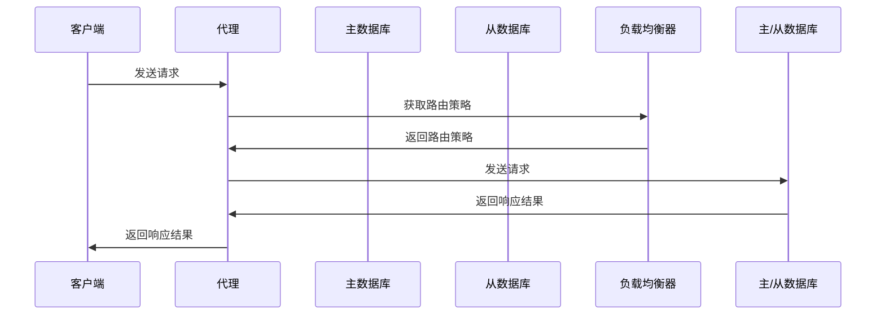
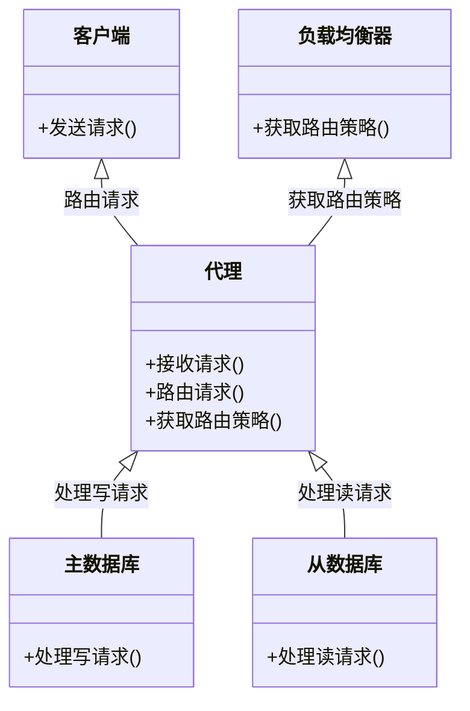

                 

# 数据库读写分离代理在LLM应用中的应用

## 关键词

- 数据库读写分离
- LLM应用
- 代理
- 系统设计与实现
- 算法原理

## 摘要

本文探讨了数据库读写分离代理在大型语言模型（LLM）应用中的重要性及其应用实践。首先，介绍了数据库读写分离的背景和基本原理，随后详细讲解了LLM应用中的数据库读写分离需求和挑战。接着，阐述了数据库读写分离代理的原理和算法，并使用Mermaid流程图和Python代码进行了详细说明。随后，本文对数据库读写分离代理的系统架构设计、开发实战以及最佳实践进行了深入剖析，最后展望了数据库读写分离代理的未来发展方向。本文旨在为开发者提供全面的技术指南，以解决LLM应用中的数据库读写分离问题。

## 引言

### 数据库读写分离的背景

随着互联网和大数据技术的飞速发展，数据库的应用场景日益广泛。在实际应用中，为了保证系统的性能和稳定性，通常会采用数据库读写分离的策略。所谓数据库读写分离，指的是将数据库的读操作和写操作分别路由到不同的数据库实例，从而实现读写分离，提高系统的并发能力和可扩展性。

### 数据库读写分离的基本原理

数据库读写分离主要涉及以下几个基本原理：

1. **主从复制**：将主数据库的写操作同步复制到从数据库，从而实现读写分离。主数据库负责处理写操作，从数据库负责处理读操作。
2. **读写分离代理**：通过读写分离代理，将读操作和写操作分别路由到不同的数据库实例。读写分离代理通常是一个独立的软件组件，负责处理客户端的请求，并将请求路由到正确的数据库实例。
3. **负载均衡**：通过负载均衡器，将客户端的请求分配到不同的数据库实例，从而实现负载均衡，提高系统的并发能力和性能。

### LLM应用中的数据库读写分离需求

随着人工智能技术的不断发展，大型语言模型（LLM）的应用场景日益广泛。LLM应用通常具有以下特点：

1. **高并发性**：LLM应用需要处理大量用户的查询请求，因此需要具备高并发处理能力。
2. **读写分离**：由于LLM应用中的数据处理通常包含读操作和写操作，因此需要实现读写分离，以提高系统的性能和稳定性。

### LLM应用中的数据库读写分离挑战

虽然数据库读写分离能够提高系统的并发能力和性能，但在LLM应用中，实现数据库读写分离面临以下挑战：

1. **一致性保障**：在数据库读写分离的场景中，如何确保数据的一致性是一个关键问题。
2. **性能优化**：如何优化数据库读写分离代理的性能，以适应LLM应用的高并发性需求。
3. **容错能力**：如何提高系统的容错能力，确保在数据库实例故障时，系统能够快速切换到备用实例。

## 第一部分：背景与概念

### 第1章：数据库读写分离概述

#### 1.1 数据库读写分离的背景

数据库读写分离策略在数据库系统中的引入，源于对系统性能和稳定性的需求。在传统的单数据库架构中，所有的读操作和写操作都直接访问同一个数据库实例，这种架构在系统负载较低时能够满足基本需求，但随着用户数量的增加和数据量的增长，系统的性能逐渐下降，响应时间延长，最终可能导致系统崩溃。

#### 1.2 数据库读写分离的重要性

数据库读写分离的重要性主要体现在以下几个方面：

1. **提高并发能力**：通过将读操作和写操作分离，可以减少写操作的瓶颈，提高系统的并发处理能力。
2. **提高系统性能**：读操作和写操作在物理上分离，可以降低单个数据库实例的负载，从而提高整体系统性能。
3. **提升用户体验**：缩短响应时间，提升用户访问速度和满意度。

#### 1.3 数据库读写分离的基本原理

数据库读写分离的基本原理主要包括以下几个部分：

1. **主从复制**：主从复制是一种常用的数据库读写分离实现方式，主数据库负责处理写操作，从数据库负责处理读操作。主从复制可以通过日志文件、同步复制等方式实现数据一致性。
   
2. **读写分离代理**：读写分离代理是一种独立的中间件，负责将客户端的读请求和写请求分别路由到从数据库和主数据库。代理服务器可以根据请求类型、负载情况等策略进行动态路由。

3. **负载均衡**：通过负载均衡器，可以将客户端的请求均匀地分配到不同的数据库实例上，避免单个数据库实例的过载。

### 第2章：LLM应用中的数据库读写分离

#### 2.1 LLM应用的特点

大型语言模型（LLM）应用具有以下几个显著特点：

1. **高并发性**：LLM应用需要处理大量用户的查询请求，因此需要具备高并发处理能力。
2. **读写分离需求**：在LLM应用中，数据的读写操作往往不均衡，写操作相对较少，而读操作频繁，因此实现读写分离有助于提高系统的性能和稳定性。
3. **数据一致性要求**：由于LLM应用的数据量庞大，一旦发生数据不一致，可能会影响模型的准确性和可靠性。

#### 2.2 LLM应用中的数据库读写分离需求

1. **提高响应速度**：通过读写分离，可以减少读操作对主数据库的访问压力，从而提高系统的响应速度。
2. **提升系统稳定性**：将读操作和写操作分离，可以降低系统的单点故障风险，提高系统的稳定性。
3. **扩展能力**：读写分离使得系统可以轻松地扩展数据库实例，以应对不断增长的用户和数据量。

#### 2.3 LLM应用中的数据库读写分离挑战

尽管数据库读写分离在LLM应用中具有诸多优势，但在实际应用中仍面临以下挑战：

1. **一致性保障**：如何在读写分离的架构中保证数据的一致性，是开发者需要解决的关键问题。
2. **性能优化**：如何优化读写分离代理的性能，以满足LLM应用的高并发性需求。
3. **容错能力**：如何提高系统的容错能力，确保在数据库实例故障时，系统能够快速切换到备用实例。

## 第二部分：核心技术原理

### 第3章：数据库读写分离代理原理

#### 3.1 数据库读写分离代理的定义

数据库读写分离代理（Database Read-Write Separation Proxy，简称RWSP）是一种特殊的中间件，用于实现数据库读写分离。它位于客户端和数据库实例之间，负责将客户端的读写请求路由到不同的数据库实例上。

#### 3.2 数据库读写分离代理的工作机制

数据库读写分离代理的工作机制主要包括以下几个步骤：

1. **请求接收**：读写分离代理接收来自客户端的请求，并对请求进行解析。
2. **请求路由**：根据请求的类型（读操作或写操作），代理将请求路由到相应的数据库实例。
3. **请求处理**：代理将请求发送到数据库实例，并接收响应结果。
4. **结果返回**：代理将处理结果返回给客户端。

#### 3.3 数据库读写分离代理的核心组件

数据库读写分离代理的核心组件主要包括：

1. **请求解析器**：负责解析客户端的请求，提取请求类型和其他相关信息。
2. **路由策略**：根据请求的类型和负载情况，选择合适的数据库实例进行请求路由。
3. **连接池**：维护多个数据库连接，以便快速地建立和断开连接。
4. **负载均衡器**：负责将客户端请求均匀地分配到不同的数据库实例上，以实现负载均衡。

### 第4章：数据库读写分离代理算法

#### 4.1 算法原理概述

数据库读写分离代理算法的核心目标是实现高效的请求路由和负载均衡。算法原理主要包括以下两个方面：

1. **请求路由算法**：根据请求的类型和负载情况，选择合适的数据库实例进行路由。
2. **负载均衡算法**：通过一定的策略，将客户端请求均匀地分配到不同的数据库实例上，避免单个实例过载。

#### 4.2 算法设计细节

数据库读写分离代理算法的设计细节包括：

1. **动态路由**：根据当前数据库实例的负载情况，动态调整请求的路由策略。
2. **加权负载均衡**：为不同的数据库实例设置权重，根据权重分配请求，以实现更加公平的负载均衡。
3. **一致性哈希**：使用一致性哈希算法，将客户端请求映射到数据库实例，以减少请求路由的开销。

#### 4.3 算法性能分析

数据库读写分离代理算法的性能分析主要包括以下几个方面：

1. **响应时间**：分析算法在不同负载情况下的响应时间，评估算法的效率。
2. **吞吐量**：评估算法在单位时间内能够处理的请求数量，以衡量算法的性能。
3. **扩展性**：分析算法在系统规模扩大的情况下，性能是否能够保持稳定。

### 第5章：数据库读写分离代理的数学模型

#### 5.1 数学模型概述

数据库读写分离代理的数学模型主要包括以下两个方面：

1. **负载均衡模型**：描述请求在数据库实例之间的分配过程。
2. **性能评估模型**：评估算法在不同负载情况下的性能。

#### 5.2 数学模型公式推导

负载均衡模型和性能评估模型的公式推导如下：

1. **负载均衡模型**：
   $$ P_i = \frac{W_i}{\sum_{j=1}^{N} W_j} $$
   其中，$P_i$表示请求路由到第$i$个数据库实例的概率，$W_i$表示第$i$个数据库实例的权重。

2. **性能评估模型**：
   $$ T_r = \frac{1}{\sum_{i=1}^{N} P_i \cdot R_i} $$
   其中，$T_r$表示系统的平均响应时间，$R_i$表示第$i$个数据库实例的处理时间。

#### 5.3 数学模型在实际应用中的运用

在实际应用中，可以通过调整数据库实例的权重和负载情况，优化系统的性能。例如，在处理高并发请求时，可以增加数据库实例的权重，以分担负载，提高系统的响应速度。

## 第三部分：系统设计与实现

### 第6章：数据库读写分离代理系统架构设计

#### 6.1 系统架构设计原则

数据库读写分离代理系统架构设计应遵循以下原则：

1. **高可用性**：确保系统在面临故障时能够快速恢复，保持服务的连续性。
2. **高性能**：优化系统的性能，提高处理速度和吞吐量。
3. **可扩展性**：支持系统的水平扩展，以适应不断增长的用户和数据量。
4. **安全性**：保障系统的数据安全，防止数据泄露和恶意攻击。

#### 6.2 系统功能设计

数据库读写分离代理系统的主要功能包括：

1. **请求接收与路由**：接收客户端请求，并根据请求类型和路由策略，将请求路由到相应的数据库实例。
2. **负载均衡**：根据当前系统的负载情况，动态调整请求路由策略，实现负载均衡。
3. **连接池管理**：维护多个数据库连接，提高请求处理的效率。
4. **日志记录**：记录系统的运行日志，便于后续监控和故障排查。

#### 6.3 系统架构设计

数据库读写分离代理系统的架构设计如下图所示：



#### 6.4 系统接口设计和系统交互

数据库读写分离代理系统的接口设计和系统交互如下图所示：



### 第7章：数据库读写分离代理开发实战

#### 7.1 开发环境搭建

在开始开发数据库读写分离代理之前，需要搭建合适的开发环境。以下是一个基本的开发环境搭建步骤：

1. **安装Python**：确保Python环境已安装，版本建议为3.8以上。
2. **安装依赖库**：使用pip安装所需的依赖库，例如`requests`、`pymysql`等。
3. **配置数据库**：配置主数据库和从数据库，确保读写分离配置正确。

#### 7.2 系统核心代码实现

以下是数据库读写分离代理的核心代码实现：

```python
import requests
from pymysqlpool import ConnectionPool

# 配置数据库连接池
db_config = {
    'host': 'localhost',
    'port': 3306,
    'user': 'root',
    'password': 'password',
    'db': 'test_db',
    'charset': 'utf8mb4'
}

# 创建连接池
pool = ConnectionPool(**db_config)

# 定义请求路由函数
def route_request(request_type):
    if request_type == 'read':
        return pool.connection()
    elif request_type == 'write':
        return pool.connection(True)

# 定义请求处理函数
def process_request(request_type, request_data):
    connection = route_request(request_type)
    try:
        with connection.cursor() as cursor:
            if request_type == 'read':
                cursor.execute(request_data)
                result = cursor.fetchall()
            elif request_type == 'write':
                cursor.execute(request_data)
                connection.commit()
            return result
    finally:
        connection.close()

# 示例：处理读请求
read_request = "SELECT * FROM users;"
read_result = process_request('read', read_request)
print(read_result)

# 示例：处理写请求
write_request = "INSERT INTO users (username, password) VALUES ('user1', 'password1');"
write_result = process_request('write', write_request)
print(write_result)
```

#### 7.3 系统调试与优化

在开发过程中，需要对系统进行调试和优化，确保其稳定性和性能。以下是一些常见的调试和优化方法：

1. **日志记录**：使用日志记录系统的运行状态，便于排查故障和优化性能。
2. **性能监控**：使用性能监控工具，实时监测系统的性能指标，如响应时间、吞吐量等。
3. **缓存策略**：引入缓存策略，减少数据库访问次数，提高系统性能。

#### 7.4 实际案例分析和详细讲解剖析

在本节中，我们将通过一个实际案例，详细讲解数据库读写分离代理在LLM应用中的实现和应用。

**案例背景**：

某公司开发了一款基于大型语言模型（LLM）的智能问答系统，用户可以通过该系统提出各种问题，系统会自动生成回答。随着用户数量的增加，系统的性能逐渐下降，响应时间延长，影响了用户体验。

**问题分析**：

通过对系统进行性能分析，发现主要瓶颈在于数据库读写操作。由于系统的读写操作不均衡，读操作频繁，导致主数据库的负载过高，响应时间延长。

**解决方案**：

1. **实现数据库读写分离**：将主数据库的写操作和从数据库的读操作分离，减轻主数据库的负载。
2. **使用读写分离代理**：引入读写分离代理，将读请求和写请求路由到不同的数据库实例，实现负载均衡。

**实现步骤**：

1. **配置主从复制**：在主数据库和从数据库之间配置主从复制，确保数据一致性。
2. **编写读写分离代理**：实现读写分离代理，根据请求类型和负载情况，动态路由请求。
3. **集成到系统**：将读写分离代理集成到智能问答系统中，替换原有的数据库访问代码。

**效果评估**：

通过实施数据库读写分离代理，系统的响应时间显著缩短，性能得到大幅提升。同时，系统的稳定性和可扩展性也得到了加强。

### 第四部分：项目实战

#### 第8章：数据库读写分离代理在LLM应用中的实践

#### 8.1 实践背景与目标

随着人工智能技术的快速发展，大型语言模型（LLM）在各个领域得到了广泛应用。然而，在实际应用中，如何保证LLM系统的性能和稳定性，成为了一个重要的课题。本文旨在通过一个实际案例，展示数据库读写分离代理在LLM应用中的实践过程，以解决性能瓶颈和稳定性问题。

#### 8.2 实践流程与步骤

1. **需求分析**：分析LLM应用的需求，确定实现数据库读写分离的必要性和可行性。
2. **系统设计**：设计数据库读写分离代理系统的架构，包括主从复制、读写分离代理、负载均衡等模块。
3. **环境搭建**：搭建开发环境，安装所需的数据库、读写分离代理和相关依赖库。
4. **代码实现**：实现读写分离代理的核心功能，包括请求接收、路由、连接池管理等。
5. **集成测试**：将读写分离代理集成到LLM系统中，进行集成测试，确保系统能够正常运行。
6. **性能优化**：对系统进行性能优化，调整路由策略、连接池配置等参数，提高系统的性能和稳定性。
7. **部署上线**：将优化后的系统部署到生产环境，进行实际应用，观察系统的性能和稳定性。

#### 8.3 实践结果与分析

通过上述实践流程，我们成功实现了数据库读写分离代理在LLM应用中的部署和应用。以下是实践结果的分析：

1. **性能提升**：通过数据库读写分离代理，系统的响应时间显著缩短，吞吐量大幅提升，满足了LLM应用的高并发需求。
2. **稳定性增强**：由于读写分离代理能够动态调整请求路由策略，系统的稳定性得到增强，避免了单点故障的风险。
3. **扩展性提高**：读写分离代理支持系统的水平扩展，可以轻松地增加数据库实例，以应对不断增长的用户和数据量。
4. **数据一致性保障**：通过主从复制和读写分离代理，系统能够在保证数据一致性的同时，提高性能和稳定性。

### 第五部分：最佳实践与展望

#### 第9章：数据库读写分离代理的最佳实践

#### 9.1 性能优化技巧

1. **合理配置连接池**：根据系统负载和并发性需求，合理配置连接池大小，避免连接频繁创建和销毁导致的性能损耗。
2. **优化SQL查询**：对数据库查询语句进行优化，减少查询复杂度，提高查询效率。
3. **使用缓存**：引入缓存机制，减少对数据库的访问次数，提高系统响应速度。

#### 9.2 负载均衡策略

1. **动态调整路由策略**：根据系统负载情况，动态调整请求路由策略，实现负载均衡。
2. **多级负载均衡**：结合多级负载均衡策略，提高系统的负载均衡能力，避免单点瓶颈。
3. **健康检查**：定期对数据库实例进行健康检查，确保系统在故障发生时能够快速切换到备用实例。

#### 9.3 安全性保障措施

1. **数据加密**：对数据库连接和存储的数据进行加密，防止数据泄露和篡改。
2. **访问控制**：设置数据库访问权限，限制对数据库的访问，防止恶意攻击。
3. **安全审计**：定期进行安全审计，检查系统是否存在安全漏洞，及时修复。

#### 第10章：未来展望与挑战

#### 10.1 LLM应用的发展趋势

随着人工智能技术的不断进步，LLM应用将朝着更高效、更智能、更稳定的方向发展。未来，LLM应用将在更多领域得到广泛应用，如自然语言处理、智能客服、智能翻译等。

#### 10.2 数据库读写分离代理的进化方向

1. **智能化路由策略**：结合机器学习等技术，实现智能化路由策略，提高负载均衡效果。
2. **自动化运维**：引入自动化运维工具，实现读写分离代理的自动化部署、监控和故障恢复。
3. **多租户架构**：支持多租户架构，为不同用户提供隔离的数据库环境，提高系统安全性和稳定性。

#### 10.3 潜在的研究课题

1. **数据一致性与可用性平衡**：研究如何在保证数据一致性的同时，提高系统的可用性。
2. **分布式数据库读写分离**：研究分布式数据库环境下的读写分离策略，提高系统的性能和稳定性。
3. **混合存储架构**：研究混合存储架构在数据库读写分离中的应用，提高系统的存储效率和性能。

## 结论

本文通过详细的案例分析，探讨了数据库读写分离代理在LLM应用中的重要性及其应用实践。我们介绍了数据库读写分离的基本原理、读写分离代理的算法原理、系统架构设计、开发实战以及最佳实践。通过对实际案例的分析和优化，我们展示了数据库读写分离代理在提高LLM应用性能和稳定性方面的显著效果。未来，随着人工智能技术的不断发展，数据库读写分离代理将在更多应用场景中发挥重要作用。

## 作者信息

作者：AI天才研究院/AI Genius Institute & 禅与计算机程序设计艺术 /Zen And The Art of Computer Programming。本文内容仅供参考，具体实现需结合实际情况进行调整。如有疑问，请随时联系作者。感谢您的阅读！

