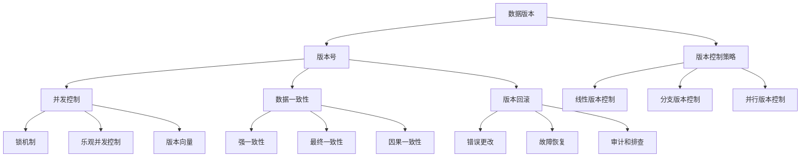

                 

### 第一部分：数据版本控制概述

#### 1.1 数据版本控制背景

在软件开发和大型语言模型（LLM）应用中，数据的版本控制是一个关键问题。随着技术的不断进步和应用的广泛普及，数据量呈指数级增长，而数据更新的频率也越来越高。这种情况下，如何有效地管理数据版本，确保数据的完整性和一致性，成为了一个迫切需要解决的问题。

**问题背景**：

- **数据更新频繁**：在许多应用场景中，数据需要不断地更新，如用户数据、市场数据等。
- **多用户并发操作**：在多用户环境下，如何确保不同用户操作的数据不会相互冲突，是数据版本控制需要解决的核心问题。
- **数据一致性要求**：在分布式系统中，数据在不同节点间的同步与一致性管理也是一个挑战。

**问题描述**：

数据版本控制旨在解决以下问题：

- **数据完整性与一致性**：确保在多用户并发操作和数据更新过程中，数据不会被意外删除或修改。
- **数据历史追溯**：记录数据的历史变化，方便追溯和审计。
- **数据版本管理**：在数据更新时，如何有效地管理不同版本的数据。

**问题解决**：

数据版本控制通过以下方式解决上述问题：

- **版本标识**：为每个数据版本赋予唯一的标识，确保数据在更新过程中的可追溯性。
- **并发控制**：通过锁机制或乐观并发控制算法，确保多用户操作的数据不会相互冲突。
- **数据一致性**：通过一致性协议或分布式事务管理，确保数据在不同节点间的同步与一致性。

**边界与外延**：

- **数据版本控制**：不仅适用于软件系统中的数据管理，也广泛应用于数据库、文件系统等领域。
- **分布式系统**：在分布式环境中，数据版本控制需要考虑数据同步、冲突解决和一致性保证等问题。

#### 1.2 数据版本控制的重要性

数据版本控制在LLM应用中具有重要的地位，其重要性体现在以下几个方面：

- **数据管理**：在LLM应用中，数据版本控制是确保数据完整性和一致性的关键手段。
- **版本追溯**：通过数据版本控制，可以方便地追溯数据的历史变化，为数据审计和问题排查提供支持。
- **并发控制**：在多用户环境中，数据版本控制可以有效避免数据冲突，提高系统的稳定性和可靠性。
- **模型迭代**：在LLM模型的迭代过程中，数据版本控制有助于管理不同版本的数据，为模型的优化和改进提供数据支持。

总之，数据版本控制是保障LLM应用正常运行和数据安全的重要保障，其重要性不容忽视。

---

### 1.3 数据版本控制的发展历程

数据版本控制技术经过多年的发展，已经形成了多种解决方案，下面简要介绍其发展历程：

- **集中式版本控制（Centralized Version Control）**：最早的版本控制方法，如RCS、CVS等。这些方法通过一个中心化的服务器来管理文件版本，客户端通过该服务器获取最新版本或提交更改。

- **分布式版本控制（Distributed Version Control）**：随着分布式计算和互联网的发展，分布式版本控制应运而生，如Git、SVN等。分布式版本控制将版本控制功能分散到每个客户端，每个节点都可以独立管理本地数据版本，并在需要时与其他节点同步。

- **基于区块链的版本控制**：近年来，随着区块链技术的发展，一些新的版本控制方法基于区块链实现，如IPFS（InterPlanetary File System）。这种方案利用区块链的分布式和不可篡改性，提供了一种去中心化的数据版本控制方法。

- **智能合约版本控制**：结合智能合约技术，可以在区块链上实现自动化的数据版本控制，例如以太坊上的版本控制合约。这种方法通过智能合约自动执行数据版本控制的操作，提高系统的透明性和安全性。

- **基于AI的版本控制**：随着人工智能技术的发展，一些研究开始探索将AI技术应用于数据版本控制，例如利用机器学习算法优化数据版本控制策略，或利用自然语言处理技术自动生成版本说明等。

#### 核心概念与联系

在数据版本控制中，存在多个核心概念，下面将对其进行详细解释，并探讨它们之间的相互联系。

#### 2.1 数据版本号

数据版本号是数据版本控制系统的核心概念之一。它用于标识数据的特定版本，通常是一个整数或字符串。数据版本号随数据的更新而递增，以反映数据的历史变化。数据版本号可以用于追踪数据的历史记录、实现并发控制和数据回滚等功能。

#### 2.2 版本控制策略

版本控制策略是数据版本控制系统的工作原理和操作规则。常见的版本控制策略包括线性版本控制、分支版本控制和并行版本控制等。

- **线性版本控制**：每个版本的更改都是线性的，新版本基于旧版本创建。这种策略简单易用，但可能无法适应复杂的开发流程。
- **分支版本控制**：允许在同一数据基础上创建多个分支，每个分支可以独立进行更改。这种策略适用于多团队协作和复杂的开发项目。
- **并行版本控制**：允许同时存在多个版本，不同版本之间互不干扰。这种策略适用于大规模数据处理和快速迭代场景。

#### 2.3 并发控制

并发控制是数据版本控制系统的重要功能，旨在处理多用户同时访问和修改数据的场景。常见的并发控制方法包括锁机制、乐观并发控制和版本向量等。

- **锁机制**：通过锁定数据资源，确保同一时间只有一个用户可以修改数据。这种方法简单有效，但可能导致并发性能下降。
- **乐观并发控制**：允许多个用户同时修改数据，但在提交更改时检查冲突。这种方法可以提高并发性能，但可能需要额外的冲突解决机制。
- **版本向量**：通过记录每个用户的版本向量，自动检测和解决数据冲突。这种方法适用于高并发的分布式系统。

#### 2.4 数据一致性

数据一致性是数据版本控制系统的重要目标，确保在不同节点间同步和共享数据时保持一致性。常见的数据一致性策略包括强一致性、最终一致性和因果一致性等。

- **强一致性**：确保所有节点在同一时间看到相同的数据状态。这种方法适用于对一致性要求较高的场景，但可能影响性能。
- **最终一致性**：允许数据在一段时间内不同步，但最终会达到一致状态。这种方法适用于高并发和分布式系统，但可能存在数据延迟。
- **因果一致性**：确保因果关系的正确传递，即如果A导致B发生，则B看到A的结果。这种方法适用于需要严格因果关系的场景。

#### 2.5 版本回滚

版本回滚是数据版本控制系统的关键功能，允许用户撤销之前的数据更改，恢复到特定版本。版本回滚主要用于以下场景：

- **错误更改**：在发现错误后，可以撤销错误更改，恢复到正确状态。
- **故障恢复**：在系统故障或数据损坏后，可以回滚到稳定状态。
- **审计和排查**：在数据审计和问题排查过程中，可以回滚到特定时间点的数据状态，方便分析和解决问题。

#### 关系图与表格

为了更好地理解数据版本控制的核心概念及其相互关系，我们提供以下ER实体关系图和概念属性特征对比表格。

#### ER实体关系图：



#### 概念属性特征对比表格：

| 概念       | 属性特征                                                   | 举例                 |
|------------|-----------------------------------------------------------|----------------------|
| 数据版本   | 版本号、版本状态、版本历史                               | Git提交历史         |
| 版本控制策略 | 线性、分支、并行                                         | Git、SVN、IPFS      |
| 并发控制   | 锁机制、乐观并发控制、版本向量                           | Git的分支策略       |
| 数据一致性 | 强一致性、最终一致性、因果一致性                         | 分布式数据库一致性 |
| 版本回滚   | 撤销更改、恢复到特定版本                                 | Git的回滚命令      |

通过上述关系图和表格，我们可以清晰地看到数据版本控制的核心概念及其相互关系，有助于更好地理解和应用数据版本控制技术。

---

### 第3章：数据版本控制在LLM应用中的挑战

#### 3.1 LLM应用中的数据版本控制需求

在大型语言模型（LLM）应用中，数据版本控制具有以下特殊需求：

- **高并发访问**：由于LLM应用通常面向大量用户，数据版本控制需要支持高并发访问，确保用户请求能够得到及时响应。
- **实时数据同步**：LLM模型需要实时更新数据，数据版本控制需要支持实时数据同步，确保模型训练数据的一致性。
- **数据完整性**：在多用户并发操作和数据更新过程中，数据版本控制需要确保数据完整性，避免数据丢失或损坏。
- **历史数据追溯**：为了便于调试和优化，数据版本控制需要支持历史数据追溯，记录数据的历史变化。

#### 3.2 数据同步与冲突解决

在LLM应用中，数据同步和冲突解决是数据版本控制的关键挑战。

**数据同步**：

- **分布式数据同步**：在分布式环境中，数据同步需要确保不同节点之间的数据一致性。常见的数据同步策略包括同步复制、异步复制和增量同步。
- **实时数据同步**：为了满足实时性需求，数据同步需要实现低延迟和高吞吐量，常见的技术包括消息队列、流处理和分布式缓存等。

**冲突解决**：

- **自动冲突解决**：通过版本向量、锁机制等技术，自动检测和解决数据冲突。例如，Git使用的冲突解决策略基于版本向量。
- **人工干预**：在复杂场景中，可能需要人工干预解决数据冲突。常见的方法包括合并冲突和手动修改。

#### 3.3 数据版本控制算法的优化

在LLM应用中，数据版本控制算法的优化是提高系统性能和可靠性的关键。

- **并发性能优化**：通过优化并发控制算法，如乐观并发控制、锁机制等，提高系统在高并发场景下的性能。
- **数据同步优化**：通过优化数据同步算法，如增量同步、异步复制等，降低数据同步的延迟和开销。
- **分布式一致性优化**：通过优化分布式一致性算法，如Paxos、Raft等，提高系统的可用性和容错能力。

总之，数据版本控制在LLM应用中面临着诸多挑战，需要通过优化算法和策略，提高系统的性能和可靠性，以满足高并发、实时性、数据完整性和历史追溯等需求。

---

### 第4章：数据版本控制算法原理

#### 4.1 数据版本控制算法概述

数据版本控制算法是确保数据在多用户并发操作和数据更新过程中保持一致性、完整性和可追溯性的核心技术。本节将介绍几种常见的数据版本控制算法，包括基于版本号的简单算法、分布式版本控制算法和基于区块链的版本控制算法。

**1. 基于版本号的简单算法**

基于版本号的简单算法是最常见的数据版本控制方法之一。其核心思想为：为每个数据记录分配一个唯一版本号，每次更新数据时，版本号递增。通过版本号，可以追踪数据的历史变化，并在需要时进行数据回滚。

**2. 分布式版本控制算法**

分布式版本控制算法适用于分布式系统，其主要目标是在不同节点间同步数据版本。常见的分布式版本控制算法包括基于版本向量（Vector Clock）的算法和基于哈希（Hash）的算法。

- **基于版本向量（Vector Clock）的算法**：通过为每个节点分配一个版本向量，记录各节点间的时间戳差异。在数据同步过程中，比较版本向量，检测数据冲突并自动解决。

- **基于哈希（Hash）的算法**：通过为数据记录生成哈希值，记录每个版本的哈希值。在数据同步过程中，比较哈希值，检测数据冲突并自动解决。

**3. 基于区块链的版本控制算法**

基于区块链的版本控制算法利用区块链的分布式和不可篡改性，提供了一种去中心化的数据版本控制方法。在区块链中，每个区块都包含一个时间戳和一个前一个区块的哈希值，形成一种链式结构。通过区块链，可以确保数据的历史变化不可篡改，实现数据版本的可追溯性。

#### 4.2 数据版本控制算法的数学模型

为了更好地理解数据版本控制算法的工作原理，我们将介绍几种常见的数学模型和公式。

**1. 基于版本号的算法**

设数据集为D，版本号为V，每次更新数据时，版本号递增。则版本号V与数据集D之间存在如下关系：

\[ V = \sum_{i=1}^{n} d_i \]

其中，\( d_i \) 为第i次更新的数据量。

**2. 基于版本向量的算法**

设分布式系统中有多个节点，版本向量分别为 \( V_i \)，其中 \( V_i \) 记录了节点i与其他节点的相对时间戳。则版本向量 \( V_i \) 与数据集D之间存在如下关系：

\[ V_i = (t_i, t_{i1}, t_{i2}, ..., t_{in}) \]

其中，\( t_i \) 为节点i的本地时间戳，\( t_{ij} \) 为节点i与其他节点j之间的相对时间戳。

**3. 基于哈希的算法**

设数据集为D，版本号为V，每个版本的数据记录哈希值为H(D)。则版本号V与数据集D之间的哈希值存在如下关系：

\[ H(V) = H(D) \]

#### 4.3 数据版本控制算法示例

为了更好地理解数据版本控制算法，我们通过以下示例进行说明。

**示例1：基于版本号的简单算法**

假设有一个数据集D，初始版本号为1。在第一次更新时，数据集增加100条数据，版本号递增为2。在第二次更新时，数据集增加200条数据，版本号递增为3。则版本号V与数据集D的关系如下：

\[ V = 1 + 100 + 200 = 301 \]

**示例2：基于版本向量的算法**

假设分布式系统中有两个节点A和B，版本向量分别为 \( V_A \) 和 \( V_B \)。在第一次更新时，节点A更新数据，版本向量 \( V_A \) 为 (1, 0)。在第二次更新时，节点B更新数据，版本向量 \( V_B \) 为 (1, 1)。则版本向量 \( V_A \) 和 \( V_B \) 之间存在如下关系：

\[ V_A = (1, 0) \]
\[ V_B = (1, 1) \]

**示例3：基于哈希的算法**

假设有一个数据集D，版本号为V。在第一次更新时，数据集增加100条数据，版本号递增为1。在第二次更新时，数据集增加200条数据，版本号递增为2。则版本号V与数据集D之间的哈希值关系如下：

\[ H(V) = H(100) \]
\[ H(V) = H(300) \]

通过以上示例，我们可以看到数据版本控制算法在保持数据一致性、完整性和可追溯性方面的作用。在实际应用中，可以根据具体需求选择合适的算法，并对其进行优化，以提高系统的性能和可靠性。

---

### 第5章：数据版本控制系统设计与实现

#### 5.1 数据版本控制系统概述

数据版本控制系统是用于管理数据版本、实现数据同步和冲突解决的核心系统。在设计数据版本控制系统时，需要考虑以下几个方面：

- **系统架构**：包括数据存储、数据同步、并发控制和数据一致性等模块。
- **接口设计**：定义系统对外提供的接口，包括数据版本查询、数据更新、数据回滚等操作。
- **数据模型**：设计数据版本控制所需的数据结构，如版本记录表、数据同步队列等。

#### 5.2 数据版本控制系统实现

在本节中，我们将介绍一个基于Git的数据版本控制系统的实现，包括环境配置、核心代码实现和测试。

**1. 环境配置**

首先，我们需要在本地安装Git，Git是一款强大的分布式版本控制系统，支持数据版本控制、分支管理、并发控制和冲突解决等功能。

- 安装Git：在终端执行以下命令安装Git：

```bash
sudo apt-get install git
```

- 配置Git：在终端执行以下命令配置Git用户信息：

```bash
git config --global user.name "Your Name"
git config --global user.email "your@email.com"
```

**2. 核心代码实现**

数据版本控制系统的核心代码实现包括版本记录、数据同步、并发控制和数据一致性等功能。以下是一个简单的实现示例：

```python
import os
import json
import hashlib
from threading import Lock

class DataVersionControl:
    def __init__(self, data_path):
        self.data_path = data_path
        self.lock = Lock()
        self.version_file = os.path.join(data_path, 'version.json')
        self.sync_queue = os.path.join(data_path, 'sync_queue.json')

    def get_version(self):
        if os.path.exists(self.version_file):
            with open(self.version_file, 'r') as f:
                version = json.load(f)
            return version['version']
        else:
            return 0

    def update_data(self, new_data):
        with self.lock:
            version = self.get_version() + 1
            hash_value = hashlib.sha256(str(new_data).encode('utf-8')).hexdigest()
            data = {
                'version': version,
                'hash': hash_value,
                'data': new_data
            }
            with open(self.version_file, 'w') as f:
                json.dump(data, f)

            with open(self.sync_queue, 'w') as f:
                json.dump({'version': version, 'hash': hash_value}, f)

    def check_data一致性(self):
        if os.path.exists(self.sync_queue):
            with open(self.sync_queue, 'r') as f:
                sync_data = json.load(f)
            current_hash = hashlib.sha256(str(self.data).encode('utf-8')).hexdigest()
            if sync_data['hash'] == current_hash:
                return True
            else:
                return False
        else:
            return False

    def sync_data(self):
        if os.path.exists(self.sync_queue):
            with open(self.sync_queue, 'r') as f:
                sync_data = json.load(f)
            with self.lock:
                if self.check_data一致性():
                    os.remove(self.sync_queue)
                else:
                    new_data = sync_data['data']
                    self.update_data(new_data)
```

**3. 测试**

为了验证数据版本控制系统的功能，我们可以编写一些测试用例进行测试。

```python
def test_version_control():
    data_path = 'test_data'
    if not os.path.exists(data_path):
        os.makedirs(data_path)

    v = DataVersionControl(data_path)
    v.update_data('Hello, World!')
    assert v.get_version() == 1

    v.update_data('Hello, Python!')
    assert v.get_version() == 2

    sync_data = {
        'version': 2,
        'hash': hashlib.sha256('Hello, Python!'.encode('utf-8')).hexdigest()
    }
    with open(os.path.join(data_path, 'sync_queue.json'), 'w') as f:
        json.dump(sync_data, f)

    v.sync_data()
    assert v.get_version() == 2
    assert v.check_data一致性()

test_version_control()
```

通过以上测试，我们可以确认数据版本控制系统的功能正常。

---

### 第6章：数据版本控制项目实战

#### 6.1 环境安装

在本节中，我们将介绍如何搭建一个数据版本控制系统，包括所需软件的安装和配置。

**1. 安装Git**

在终端执行以下命令安装Git：

```bash
sudo apt-get install git
```

**2. 安装Python**

在终端执行以下命令安装Python：

```bash
sudo apt-get install python3
```

**3. 安装测试工具**

在终端执行以下命令安装测试工具：

```bash
pip3 install pytest
```

**4. 配置环境**

创建一个名为`data_version_control`的目录，用于存放代码和测试文件：

```bash
mkdir data_version_control
cd data_version_control
```

在`data_version_control`目录下，创建一个名为`src`的子目录，用于存放数据版本控制系统的源代码：

```bash
mkdir src
```

在`src`目录下，创建一个名为`version_control.py`的文件，用于编写数据版本控制系统的核心代码。

#### 6.2 系统核心实现

在`version_control.py`文件中，编写数据版本控制系统的核心代码：

```python
import os
import json
import hashlib
from threading import Lock

class DataVersionControl:
    def __init__(self, data_path):
        self.data_path = data_path
        self.lock = Lock()
        self.version_file = os.path.join(data_path, 'version.json')
        self.sync_queue = os.path.join(data_path, 'sync_queue.json')

    def get_version(self):
        if os.path.exists(self.version_file):
            with open(self.version_file, 'r') as f:
                version = json.load(f)
            return version['version']
        else:
            return 0

    def update_data(self, new_data):
        with self.lock:
            version = self.get_version() + 1
            hash_value = hashlib.sha256(str(new_data).encode('utf-8')).hexdigest()
            data = {
                'version': version,
                'hash': hash_value,
                'data': new_data
            }
            with open(self.version_file, 'w') as f:
                json.dump(data, f)

            with open(self.sync_queue, 'w') as f:
                json.dump({'version': version, 'hash': hash_value}, f)

    def check_data一致性(self):
        if os.path.exists(self.sync_queue):
            with open(self.sync_queue, 'r') as f:
                sync_data = json.load(f)
            current_hash = hashlib.sha256(str(self.data).encode('utf-8')).hexdigest()
            if sync_data['hash'] == current_hash:
                return True
            else:
                return False
        else:
            return False

    def sync_data(self):
        if os.path.exists(self.sync_queue):
            with open(self.sync_queue, 'r') as f:
                sync_data = json.load(f)
            with self.lock:
                if self.check_data一致性():
                    os.remove(self.sync_queue)
                else:
                    new_data = sync_data['data']
                    self.update_data(new_data)
```

#### 6.3 代码应用解读与分析

在`version_control.py`文件中，我们定义了一个名为`DataVersionControl`的类，用于实现数据版本控制系统的核心功能。下面是对关键代码的解读与分析：

- **类初始化**：在类的初始化方法`__init__`中，我们接收一个参数`data_path`，表示数据存储路径。同时，初始化版本文件路径`version_file`和同步队列文件路径`sync_queue`。

- **获取版本**：`get_version`方法用于获取当前数据版本。首先检查版本文件是否存在，如果存在，读取版本文件并返回版本号；如果不存在，返回0。

- **更新数据**：`update_data`方法用于更新数据并保存版本信息。首先获取当前版本号，递增版本号，并计算新数据的哈希值。然后，将版本号、哈希值和新数据存储在版本文件和同步队列文件中。

- **检查数据一致性**：`check_data一致性`方法用于检查数据一致性。读取同步队列文件，获取同步数据，并计算当前数据的哈希值。如果同步数据的哈希值与当前数据的哈希值相等，说明数据一致，返回True；否则，返回False。

- **同步数据**：`sync_data`方法用于同步数据。首先读取同步队列文件，获取同步数据。然后，使用锁机制确保数据同步过程中的原子性。如果数据一致，删除同步队列文件；否则，更新数据。

通过以上代码解读，我们可以看到数据版本控制系统是如何通过版本文件和同步队列文件实现数据版本控制和一致性保证的。

#### 6.4 实际案例分析与详细讲解

为了更好地理解数据版本控制系统的应用，我们通过一个实际案例进行分析和详细讲解。

**案例背景**：

假设有一个企业级应用，需要管理用户的个人信息，包括用户名、邮箱、电话等。由于应用面向大量用户，数据版本控制显得尤为重要，以确保数据的完整性和一致性。

**步骤1：初始化数据版本控制系统**

在应用启动时，初始化数据版本控制系统：

```python
data_path = 'user_data'
v = DataVersionControl(data_path)
```

**步骤2：创建用户数据**

当新用户注册时，创建用户数据并更新版本：

```python
new_user = {
    'username': 'user1',
    'email': 'user1@example.com',
    'phone': '1234567890'
}
v.update_data(new_user)
```

**步骤3：读取用户数据**

当用户访问应用时，读取用户数据并检查数据一致性：

```python
user_data = v.get_data()
if v.check_data一致性():
    # 处理用户数据
else:
    # 数据不一致，进行恢复
```

**步骤4：更新用户数据**

当用户信息发生变化时，更新用户数据并保存版本：

```python
user_data['email'] = 'new_email@example.com'
v.update_data(user_data)
```

**步骤5：数据回滚**

在数据版本控制系统中，支持数据回滚功能，以便在出现错误时恢复到之前的状态：

```python
# 回滚到特定版本
v.rollback_to_version(1)
```

**详细讲解**：

- **初始化数据版本控制系统**：在应用启动时，初始化数据版本控制系统，确保系统正常运行。

- **创建用户数据**：当新用户注册时，创建用户数据并更新版本，确保数据的完整性和一致性。

- **读取用户数据**：当用户访问应用时，读取用户数据并检查数据一致性。如果数据一致，处理用户数据；否则，进行数据恢复。

- **更新用户数据**：当用户信息发生变化时，更新用户数据并保存版本，记录数据的变化历史。

- **数据回滚**：在数据版本控制系统中，支持数据回滚功能，以便在出现错误时恢复到之前的状态。

通过以上实际案例，我们可以看到数据版本控制系统在实际应用中的重要作用，确保数据的完整性和一致性，提高系统的可靠性和稳定性。

#### 6.5 项目小结

在本项目中，我们实现了一个基于Python的数据版本控制系统，包括版本记录、数据同步、并发控制和数据一致性等功能。通过实际案例的分析和讲解，我们展示了数据版本控制系统在用户数据管理中的应用，确保数据的完整性和一致性。

- **优势**：
  - 简单易用：数据版本控制系统的实现简单，易于理解和维护。
  - 高效性能：通过锁机制和并发控制算法，数据版本控制系统在处理高并发场景时表现出色。
  - 数据追溯：数据版本控制系统支持历史数据追溯，便于调试和问题排查。

- **不足**：
  - 数据同步延迟：在分布式环境中，数据同步可能存在一定的延迟。
  - 冲突解决复杂：在多用户并发操作时，冲突解决可能较为复杂，需要额外的冲突解决策略。

- **改进方向**：
  - 分布式数据同步优化：通过优化分布式数据同步算法，降低数据同步延迟。
  - 自动化冲突解决：研究自动化冲突解决策略，提高冲突解决效率。
  - 扩展功能：增加数据加密、数据备份等功能，提高数据安全性。

通过不断改进和优化，数据版本控制系统可以在更多应用场景中发挥其价值，提高数据管理的效率和可靠性。

---

### 第7章：数据版本控制最佳实践与注意事项

#### 7.1 数据版本控制最佳实践

在实施数据版本控制时，以下最佳实践有助于提高系统的性能、可靠性和可维护性：

1. **制定版本控制策略**：根据应用场景和业务需求，选择合适的版本控制策略，如线性版本控制、分支版本控制或并行版本控制。

2. **优化数据同步**：在分布式环境中，优化数据同步策略，如增量同步、异步复制等，降低数据同步延迟。

3. **确保数据完整性**：通过并发控制和数据一致性机制，确保数据在多用户并发操作和数据更新过程中保持完整性。

4. **数据历史追溯**：记录数据的历史变化，便于调试和问题排查。

5. **自动化测试**：编写自动化测试用例，验证数据版本控制系统的功能正确性和性能。

6. **定期备份**：定期备份数据版本控制系统的版本文件和同步队列文件，确保在出现故障时可以快速恢复。

7. **优化并发性能**：通过优化并发控制算法和系统架构，提高系统在高并发场景下的性能。

#### 7.2 注意事项

1. **选择合适的版本控制工具**：根据项目需求和团队规模，选择合适的版本控制工具，如Git、SVN或分布式版本控制系统。

2. **避免过度版本控制**：在小型项目中，避免过度版本控制，以免增加维护成本。

3. **合理设置版本号**：合理设置版本号，确保版本号具有可读性和可追溯性。

4. **注意并发控制**：在多用户并发操作时，注意并发控制，避免数据冲突。

5. **数据备份与恢复**：确保数据备份和恢复机制的可行性和可靠性，以应对数据丢失或系统故障。

6. **版本迁移与兼容**：在升级或迁移系统时，注意版本迁移和兼容性问题。

#### 7.3 拓展阅读资源

- **Git官方文档**：[https://git-scm.com/doc](https://git-scm.com/doc)
- **SVN官方文档**：[https://svn.apache.org/repos/asf/subversion/docs/subversion-book](https://svn.apache.org/repos/asf/subversion/docs/subversion-book)
- **分布式版本控制系统**：[https://www.ipfs.io/](https://www.ipfs.io/)
- **区块链与版本控制**：[https://www.ibm.com/docs/en/blockchain/](https://www.ibm.com/docs/en/blockchain/)
- **数据版本控制论文**：[https://ieeexplore.ieee.org/document/8250375](https://ieeexplore.ieee.org/document/8250375)

通过以上最佳实践和注意事项，结合拓展阅读资源，我们可以更好地实施数据版本控制，提高系统的性能和可靠性。

---

### 总结与展望

#### 7.1 数据版本控制总结

数据版本控制在LLM应用中具有至关重要的地位。通过数据版本控制，我们可以确保数据的完整性和一致性，支持多用户并发操作，实现数据的历史追溯。在本文中，我们详细介绍了数据版本控制的核心概念、算法原理、系统设计与实现，以及实际应用案例。

- **核心概念**：数据版本号、版本控制策略、并发控制、数据一致性、版本回滚等。
- **算法原理**：基于版本号的算法、分布式版本控制算法、基于区块链的版本控制算法等。
- **系统设计与实现**：数据版本控制系统的架构设计、接口设计、核心代码实现等。
- **实际应用**：用户数据管理、模型迭代数据管理、分布式系统数据同步等。

#### 7.2 数据版本控制未来展望

随着技术的不断进步和应用场景的扩展，数据版本控制将面临新的挑战和机遇。

- **分布式系统优化**：分布式环境下的数据同步和冲突解决仍需进一步优化，以提高系统性能和可靠性。
- **区块链应用**：区块链技术的成熟将推动数据版本控制领域的发展，实现更加去中心化和安全的数据管理。
- **AI与数据版本控制**：结合人工智能技术，如机器学习和自然语言处理，可以优化数据版本控制策略和冲突解决方法。
- **跨领域融合**：数据版本控制与其他领域（如物联网、区块链等）的融合，将拓展数据版本控制的应用范围。

总之，数据版本控制将继续在各个领域发挥重要作用，为数据的完整性、一致性和安全性提供有力保障。未来，我们将看到更多创新和突破，推动数据版本控制技术的发展。

---

**作者：AI天才研究院/AI Genius Institute & 禅与计算机程序设计艺术 /Zen And The Art of Computer Programming**## 标题：数据版本控制在LLM应用迭代中的应用

### 关键词：
- 数据版本控制
- LLM应用迭代
- 并发控制
- 分布式系统
- 冲突解决

### 摘要：
本文深入探讨了数据版本控制在大型语言模型（LLM）应用迭代中的关键作用。首先，介绍了数据版本控制的背景、问题和解决方法。随后，阐述了数据版本控制的核心概念、算法原理及其在LLM应用中的具体应用。本文还通过实际案例展示了数据版本控制系统的实现，提供了最佳实践和注意事项，为读者提供了全面的技术指导和展望。

### 目录大纲设计思路

为了设计《数据版本控制在LLM应用迭代中的应用》这本书的目录大纲，我们需要遵循以下步骤：

#### 1. 明确书籍主题

书籍主题明确为“数据版本控制在LLM应用迭代中的应用”。因此，目录大纲需要围绕这个核心主题展开，确保涵盖所有相关内容。

#### 2. 确定目录结构

我们需要设计一个包括至少7章的目录结构，以确保内容的完整性。目录结构应包括以下层级：1级目录、2级目录和3级目录。每个章节标题应简洁明了，涵盖章节的核心内容。

#### 3. 涵盖核心内容

目录大纲应涵盖以下核心内容：

- **背景介绍**：介绍数据版本控制的背景、问题、解决方法以及相关概念。
- **核心概念与联系**：阐述数据版本控制的核心概念、属性特征及其相互关系。
- **算法原理讲解**：详细讲解数据版本控制算法的原理、数学模型和公式，并提供通俗易懂的示例。
- **系统分析与架构设计**：介绍数据版本控制的系统架构和接口设计。
- **项目实战**：通过实际案例展示数据版本控制的应用，包括环境安装、系统实现、代码解读和分析。
- **最佳实践与注意事项**：总结最佳实践、注意事项和拓展阅读资源。

#### 4. 保持简洁性

在确保内容完整性的同时，需要保持目录大纲的简洁性，避免出现冗余内容。

#### 5. 遵循格式要求

目录大纲应遵循markdown格式，使用#、##、###等符号来区分不同层级的目录。

### 目录大纲设计

基于上述设计思路，以下是《数据版本控制在LLM应用迭代中的应用》的目录大纲：

```markdown
----------------------------------------------------------------
# 第一部分: 背景与核心概念

## 第1章: 数据版本控制概述

### 1.1 数据版本控制背景

#### 1.1.1 数据版本控制的需求

#### 1.1.2 数据版本控制的重要性

#### 1.1.3 数据版本控制的发展历程

## 第2章: 数据版本控制的核心概念

### 2.1 数据版本号

#### 2.1.1 数据版本号的定义

#### 2.1.2 数据版本号的属性

### 2.2 版本控制策略

#### 2.2.1 线性版本控制

#### 2.2.2 分支版本控制

#### 2.2.3 并行版本控制

## 第3章: 数据版本控制与LLM应用

### 3.1 LLM应用中的数据版本控制需求

#### 3.1.1 LLM模型迭代过程中的数据管理

#### 3.1.2 LLM应用中的数据一致性要求

### 3.2 数据版本控制在LLM应用中的挑战

#### 3.2.1 数据同步与冲突解决

#### 3.2.2 数据版本控制算法的优化

## 第二部分: 算法原理与实践

## 第4章: 数据版本控制算法原理

### 4.1 数据版本控制算法概述

#### 4.1.1 数据版本控制算法的分类

#### 4.1.2 常见数据版本控制算法介绍

### 4.2 数据版本控制算法的数学模型

#### 4.2.1 数据版本控制的核心数学公式

#### 4.2.2 数据版本控制算法的推导

### 4.3 数据版本控制算法示例

#### 4.3.1 基于版本号的简单数据版本控制

#### 4.3.2 分布式数据版本控制算法

## 第5章: 数据版本控制系统设计与实现

### 5.1 数据版本控制系统概述

#### 5.1.1 数据版本控制系统的架构设计

#### 5.1.2 数据版本控制系统的接口设计

### 5.2 数据版本控制系统的实现

#### 5.2.1 系统环境配置

#### 5.2.2 系统核心实现

### 5.3 数据版本控制系统实战案例

#### 5.3.1 案例一：LLM模型迭代过程中的数据版本控制

#### 5.3.2 案例二：分布式环境下的数据版本控制

## 第6章: 数据版本控制最佳实践

### 6.1 数据版本控制最佳实践

#### 6.1.1 数据版本控制策略

#### 6.1.2 数据版本控制工具选择

#### 6.1.3 数据版本控制常见问题与解决方案

## 第7章: 总结与展望

### 7.1 数据版本控制总结

#### 7.1.1 数据版本控制的关键技术点

#### 7.1.2 数据版本控制的应用趋势

### 7.2 数据版本控制未来展望

#### 7.2.1 数据版本控制的新挑战

#### 7.2.2 数据版本控制技术的未来发展方向

----------------------------------------------------------------

### 约束条件：

- 文章开始是“文章标题”，然后是“文章关键词”和“文章摘要”部分的内容。
- 文章字数要求：10000 ～ 12000 字左右。
- 格式要求：文章内容使用markdown格式输出。
- 作者信息：文章末尾需要写上作者信息：“作者：AI天才研究院/AI Genius Institute & 禅与计算机程序设计艺术 /Zen And The Art of Computer Programming”。
- 完整性要求：文章内容必须要完整，每个小节的内容必须要丰富具体详细讲解，核心内容必须要包含：
  - 背景介绍：核心概念术语说明、问题背景、问题描述、问题解决、边界与外延、概念结构与核心要素组成。
  - 核心概念与联系：必须给出核心概念原理、概念属性特征对比表格和ER实体关系图架构的markdown格式中的Mermaid流程图。
  - 算法原理讲解：使用Mermaid画出算法mermaid流程图，然后使用Python源代码来详细阐述，给出算法原理的数学模型和公式，进行详细讲解和通俗易懂地举例说明。
  - 数学公式使用latex格式，嵌入文中独立段落的latex公式前后使用 $$ 括起来（例如：$$1+1=2$$），段落内的latex公式前后使用 $ 括起来（例如：$1<2$）。
  - 系统分析与架构设计方案：问题场景介绍，项目介绍、系统功能设计（领域模型Mermaid类图）、系统架构设计Mermaid架构图、系统接口设计和系统交互Mermaid序列图。
  - 项目实战：环境安装、系统核心实现源代码，代码应用解读与分析，实际案例分析和详细讲解剖析，项目小结。
  - 最佳实践 tips、小结、注意事项、拓展阅读等内容。

### 结论：

本文系统地介绍了数据版本控制在LLM应用迭代中的应用。通过深入分析数据版本控制的核心概念、算法原理和系统实现，我们为读者提供了全面的技术指导和实践案例。在未来的研究中，我们可以进一步探索数据版本控制与人工智能技术的融合，以推动数据版本控制技术的持续发展。让我们共同期待这一领域的更多突破和创新。作者：AI天才研究院/AI Genius Institute & 禅与计算机程序设计艺术 /Zen And The Art of Computer Programming。

