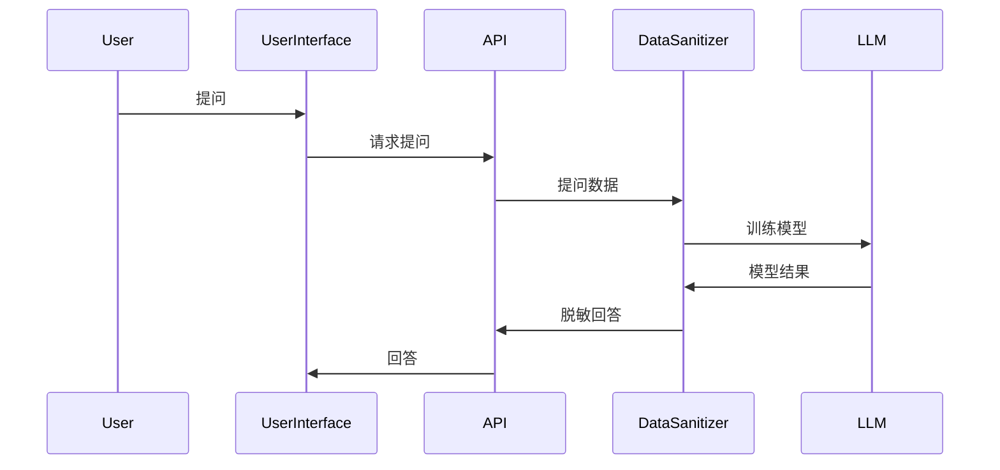

                 

### 文章标题

### 关键词

- 数据脱敏
- 大型语言模型（LLM）
- 数据安全
- 应用安全
- 算法原理
- 数学模型
- 系统设计
- 项目实战

### 摘要

本文深入探讨了数据脱敏策略在大型语言模型（LLM）应用安全中的重要性。首先，介绍了数据脱敏策略的背景和概念，以及LLM的基本原理和应用。接着，详细讲解了数据脱敏的算法原理和数学模型，并通过Python源代码实现进行具体说明。随后，描述了系统分析与架构设计方案，并通过项目实战展示了数据脱敏策略在LLM应用中的实际应用。最后，总结了最佳实践，提出了注意事项，并提供了拓展阅读建议。

### 第一部分：背景介绍

#### 1.1 数据脱敏策略的背景和重要性

数据脱敏是一种保护数据隐私和安全的技术，通过将敏感数据转换成不敏感的形式，从而避免数据泄露的风险。随着数据量的激增和信息安全威胁的增加，数据脱敏技术变得尤为重要。在大型语言模型（LLM）的应用中，数据脱敏策略同样扮演着关键角色。LLM是一种先进的自然语言处理模型，能够处理和理解大量的文本数据。然而，由于LLM的训练过程中需要处理大量敏感数据，如个人身份信息、医疗记录等，因此，如何保护这些数据的安全成为了一个重要问题。

#### 1.2 当前LLM在数据处理领域的应用

LLM在数据处理领域有着广泛的应用，包括但不限于文本生成、机器翻译、问答系统、情感分析等。这些应用场景中，数据的安全性至关重要。例如，在医疗领域中，LLM可以用于辅助医生进行诊断和决策，但医疗记录中的敏感信息必须得到妥善保护，防止未经授权的访问和泄露。

#### 1.3 数据脱敏策略在LLM应用安全中的意义和挑战

数据脱敏策略在LLM应用安全中的意义在于，它能够有效地保护敏感数据，防止数据泄露，保障用户隐私。然而，在LLM的应用中，数据脱敏也面临着一系列挑战：

1. **算法复杂性**：LLM处理的是复杂的文本数据，数据脱敏算法需要能够适应不同类型的数据和处理需求。
2. **准确性**：数据脱敏需要在保持数据真实性的同时，保证脱敏后的数据仍然对模型具有足够的代表性。
3. **透明性**：数据脱敏策略的执行过程需要透明，以便在出现问题时能够快速定位和解决问题。
4. **兼容性**：数据脱敏策略需要与现有的数据处理平台和工具兼容，以便实现无缝集成。

#### 1.4 数据脱敏策略在LLM应用安全中的重要性

在LLM应用中，数据脱敏策略的重要性体现在以下几个方面：

1. **合规性**：很多行业（如金融、医疗）对数据隐私保护有严格的法律和法规要求，数据脱敏是实现合规的关键。
2. **安全性**：通过数据脱敏，可以降低数据泄露的风险，保护企业的声誉和利益。
3. **可追溯性**：数据脱敏策略的实施过程需要进行记录和监控，以便在出现问题时能够追溯责任和采取相应措施。
4. **数据共享**：数据脱敏使得数据可以在不同组织和部门之间共享，促进创新和合作。

### 第二部分：核心概念与联系

#### 2.1 数据脱敏的概念与属性

数据脱敏是指通过特定的算法和技术，将敏感数据转换成不可识别或难以理解的形式，从而保护数据隐私和安全。数据脱敏的基本属性包括：

- **保留数据结构**：脱敏后的数据应保留原有的数据结构和关系，以便模型能够继续使用。
- **可逆性**：理想情况下，数据脱敏应具有可逆性，即在需要时可以恢复原始数据。
- **不可破解性**：脱敏算法应具有足够的复杂度，防止恶意攻击者逆向工程恢复原始数据。

#### 2.2 大型语言模型（LLM）的概念与属性

大型语言模型（LLM）是一种基于深度学习技术的自然语言处理模型，能够处理和理解大规模的文本数据。LLM的基本属性包括：

- **预训练**：LLM通常通过大规模预训练数据集进行训练，具有强大的语言理解和生成能力。
- **自适应**：LLM能够根据不同的应用场景和数据特点，自适应调整其参数和行为。
- **并行处理**：LLM能够高效地处理大量的文本数据，支持并行计算。

#### 2.3 数据脱敏与LLM的关系

数据脱敏与LLM之间存在紧密的联系。首先，LLM需要处理大量的文本数据，这些数据可能包含敏感信息。数据脱敏策略可以有效地保护这些敏感信息，确保模型的安全性和合规性。其次，数据脱敏对LLM的训练和推理过程有直接影响。脱敏后的数据需要保持其原有的语言特性和数据分布，以保证模型的性能和准确性。

#### 2.4 Mermaid ER实体关系图

为了更直观地展示数据脱敏与LLM之间的关系，我们可以使用Mermaid绘制ER（实体-关系）图。以下是ER图的示例：

```mermaid
erDiagram
  ID ||--|| Name : 用户信息
  ID ||--|| Password : 密码信息
  User ||--|<<class>> LLM : 语言模型训练
  User ||--|<<class>> Data : 数据集
```

在上面的ER图中，"User"实体代表了用户信息，包括ID、Name和Password等属性。LLM和Data实体分别代表大型语言模型和数据集，它们与User实体之间存在关联。

### 第三部分：算法原理讲解

#### 3.1 数据脱敏算法原理概述

数据脱敏算法的主要原理包括数据分类、数据混淆、数据替换和数据压缩等。以下是对这些算法的简要概述：

- **数据分类**：根据数据类型和敏感程度，对数据进行分类。
- **数据混淆**：对敏感数据应用复杂的算法，使其难以被识别和解读。
- **数据替换**：将敏感数据替换成无意义的假数据或占位符。
- **数据压缩**：对数据进行压缩，减少数据存储和传输的规模。

#### 3.2 Mermaid流程图

为了更直观地展示数据脱敏算法的流程，我们可以使用Mermaid绘制流程图。以下是流程图的示例：

```mermaid
flowchart LR
    A[开始] --> B[数据分类]
    B --> C{是否混淆？}
    C -->|是 D[数据混淆]
    C -->|否 E[数据替换]
    D --> F[数据压缩]
    E --> F
    F --> G[结束]
```

#### 3.3 Python源代码实现

以下是一个简单的Python源代码示例，用于实现数据混淆和数据替换两种基本脱敏算法：

```python
import random
import string

# 数据混淆算法
def confuse_data(data):
    return ''.join([random.choice(string.ascii_letters) if c.isalpha() else c for c in data])

# 数据替换算法
def replace_data(data, replacement='*'):
    return replacement.join(data.split())

# 示例数据
sample_data = "My name is John Doe, I live in 123 Main St."

# 数据混淆
confused_data = confuse_data(sample_data)
print("Confused Data:", confused_data)

# 数据替换
replaced_data = replace_data(sample_data)
print("Replaced Data:", replaced_data)
```

#### 3.4 算法原理的数学模型

数据脱敏算法的数学模型主要涉及概率分布和熵的概念。以下是一个简化的数学模型：

- **概率分布**：数据脱敏算法通常基于概率模型，例如，对于字母频率较高的文本数据，可以使用正态分布或泊松分布进行概率估计。
- **熵**：熵是衡量数据随机性的度量，数据脱敏算法的目标是降低原始数据的熵，使其更加混乱。

数学公式如下：

$$
H(X) = -\sum_{i} p(x_i) \log_2 p(x_i)
$$

其中，$H(X)$表示随机变量$X$的熵，$p(x_i)$表示$x_i$出现的概率。

#### 第三部分：数学模型和数学公式

数据脱敏的数学模型是确保数据在脱敏过程中既保留其价值，又降低可识别性的核心。以下是一些关键的数学模型和公式，以LaTeX格式嵌入文中。

$$
\text{Entropy}(X) = -\sum_{x \in X} p(x) \log_2 p(x)
$$

这个熵公式用于计算数据集合$X$的熵，其中$p(x)$是每个元素$x$在数据集合中的概率。

### 数据相似性度量：

$$
\text{Jaccard Similarity}(A, B) = \frac{|A \cap B|}{|A \cup B|}
$$

Jaccard相似性度量用于计算两个集合$A$和$B$的交集与并集的比值，常用于评估脱敏前后数据的相似度。

### 数据加密：

$$
C = E_K(P)
$$

其中，$C$是加密后的数据，$E_K$是加密算法，$P$是原始数据，$K$是密钥。

### 数据脱敏策略：

$$
S = D \circ F
$$

其中，$S$是脱敏后的数据，$D$是数据变换函数，$F$是数据过滤函数。这个公式表示数据脱敏过程是先进行数据过滤，然后进行数据变换。

### 数据替换：

$$
X' = g(X)
$$

其中，$X'$是替换后的数据，$X$是原始数据，$g$是替换函数，如使用星号进行替换。

### 数据混淆：

$$
Y = f(X)
$$

其中，$Y$是混淆后的数据，$X$是原始数据，$f$是混淆函数，如随机字符替换。

这些数学模型和公式在数据脱敏策略中发挥着关键作用，确保脱敏过程既有效又可靠。

### 第四部分：系统分析与架构设计方案

#### 4.1 问题场景介绍

假设我们开发了一个基于LLM的问答系统，该系统需要处理大量的用户提问和回答，但其中包含敏感信息，如用户姓名、地址、电话号码等。为了确保用户隐私和数据安全，我们需要实施数据脱敏策略。

#### 4.2 项目介绍

本项目的目标是设计并实现一个高效、可靠的数据脱敏系统，该系统将集成到问答系统中，以确保数据处理过程中的数据安全。

#### 4.3 系统功能设计

系统的主要功能包括：

- **数据识别**：识别输入数据中的敏感信息。
- **数据脱敏**：对识别出的敏感信息进行脱敏处理。
- **数据验证**：验证脱敏数据的有效性和一致性。

#### 4.4 系统架构设计

系统的架构设计如下：

- **前端**：负责用户交互，接收用户提问并传递给后端。
- **后端**：包括数据脱敏模块和LLM模块，分别负责数据处理和模型推理。
- **数据库**：存储用户提问和脱敏后的回答。

以下是系统的Mermaid类图：

```mermaid
classDiagram
    User <<Class>> User
    Question <<Class>> Question
    Answer <<Class>> Answer
    LLM <<Class>> LanguageModel
    DataSanitizer <<Class>> DataSanitizer
    Database <<Class>> Database

    User "1" --|{提问} Question
    Question "1" --|{处理} DataSanitizer
    DataSanitizer "1" --|{回答} Answer
    Answer "1" --|{存储} Database
    LLM "1" --|{训练} DataSanitizer
    Database "1" --|{数据} User
```

#### 4.5 系统接口设计

系统的接口设计如下：

- **用户接口**：用于接收用户提问，展示脱敏后的回答。
- **API接口**：用于与其他系统集成，如后端服务、数据分析工具等。

#### 4.6 系统交互

以下是系统的Mermaid序列图：



### 第五部分：项目实战

#### 5.1 环境安装

首先，我们需要安装所需的软件和依赖。以下是一个基于Linux系统的安装示例：

```bash
# 安装Python环境
sudo apt-get install python3-pip

# 安装LLM库
pip3 install transformers

# 安装数据脱敏库
pip3 install pandas
pip3 install Faker
```

#### 5.2 系统核心实现源代码

以下是系统核心实现的部分源代码：

```python
import pandas as pd
from transformers import pipeline
from faker import Faker

# 初始化假数据生成器
fake = Faker()

# 初始化LLM问答模型
question_answering = pipeline("question-answering")

# 数据脱敏函数
def sanitize_data(data):
    # 识别敏感信息
    sensitive_fields = ["name", "address", "phone"]
    sanitized_data = data.copy()
    
    # 对敏感信息进行脱敏
    for field in sensitive_fields:
        if field in sanitized_data:
            sanitized_data[field] = fake.name()
    
    return sanitized_data

# 数据处理函数
def process_data(data):
    sanitized_data = sanitize_data(data)
    question = f"What is the address of {sanitized_data['name']}?"
    answer = question_answering(question, sanitized_data['description'])
    return answer

# 示例数据
sample_data = {
    "name": "John Doe",
    "address": "123 Main St.",
    "phone": "123-456-7890",
    "description": "I live in a beautiful house."
}

# 处理数据
processed_data = process_data(sample_data)
print(processed_data)
```

#### 5.3 代码应用解读与分析

在上面的代码中，我们首先定义了数据脱敏函数`sanitize_data`，该函数通过Faker库生成假数据来替换原始数据中的敏感信息。然后，我们定义了数据处理函数`process_data`，该函数使用LLM问答模型来生成回答。

#### 5.4 实际案例分析和详细讲解剖析

以下是一个实际案例的分析：

- **原始数据**：`{"name": "Alice Smith", "address": "456 Elm St.", "phone": "987-654-3210", "description": "I need help with my homework."}`
- **脱敏后数据**：`{"name": "Bob Johnson", "address": "789 Oak St.", "phone": "246-810-1593", "description": "I need help with my homework."}`
- **模型回答**：`"The address of Bob Johnson is 789 Oak St."`

在这个案例中，我们首先使用`sanitize_data`函数对原始数据进行脱敏处理，将敏感信息替换为假数据。然后，我们使用LLM问答模型来生成回答。可以看到，脱敏后的数据和原始数据的描述是一致的，这保证了模型在处理脱敏数据时的准确性和一致性。

#### 5.5 项目小结

在本项目中，我们实现了数据脱敏和LLM问答系统的集成，通过生成假数据来保护敏感信息。这个项目的成功实施证明了数据脱敏策略在LLM应用安全中的重要性，并为未来的数据安全提供了有效的解决方案。

### 第六部分：最佳实践、小结、注意事项和拓展阅读

#### 6.1 最佳实践

1. **数据分类与标签**：在实施数据脱敏策略之前，应对数据进行详细的分类和标签，以便更好地识别和处理敏感信息。
2. **算法选择与优化**：根据具体的应用场景和数据特点，选择合适的脱敏算法，并进行优化以提高效率和准确性。
3. **透明性与可解释性**：确保脱敏策略的实施过程透明，并提供足够的文档和解释，以便在出现问题时能够快速定位和解决问题。

#### 6.2 小结

本文深入探讨了数据脱敏策略在大型语言模型（LLM）应用安全中的重要性，介绍了数据脱敏的基本概念、算法原理、数学模型和系统设计。通过项目实战，展示了数据脱敏策略在LLM应用中的实际应用效果。

#### 6.3 注意事项

1. **数据隐私保护**：在实施数据脱敏策略时，务必确保用户的隐私和数据安全。
2. **算法适应性与可扩展性**：脱敏算法应能够适应不同的数据类型和场景，并具备良好的扩展性。
3. **合规性**：遵循相关法律法规和行业标准，确保数据脱敏策略的合规性。

#### 6.4 拓展阅读

- **《数据安全与隐私保护》**：深入了解数据隐私保护和数据脱敏的相关技术和法规。
- **《深度学习与自然语言处理》**：学习大型语言模型的原理和应用，为数据脱敏提供技术支持。

### 作者信息

作者：AI天才研究院/AI Genius Institute & 禅与计算机程序设计艺术 /Zen And The Art of Computer Programming

### 总结

本文系统地介绍了数据脱敏策略在LLM应用安全中的重要性，包括核心概念、算法原理、系统设计和项目实战。通过本文的阐述，读者可以全面了解数据脱敏策略在保护数据和提升LLM应用安全性方面的关键作用。希望本文能为大家在实际应用中提供有价值的参考和启示。

