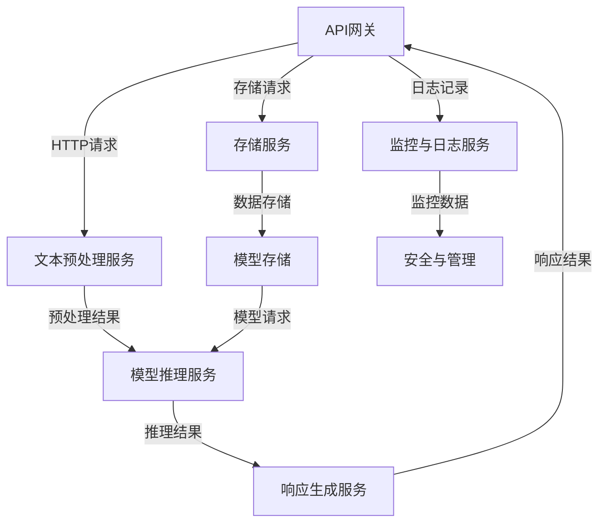

                 

### 引言

在现代信息技术领域，无服务器架构（Serverless）和大型语言模型（LLM，Large Language Model）正逐渐成为两大重要技术趋势。无服务器架构通过消除服务器管理的复杂性，使得开发人员能够专注于应用本身，提高了开发效率和资源利用率。而LLM，作为一种高级的人工智能技术，特别是在自然语言处理（NLP）领域的卓越表现，使得其在各种应用场景中具有广泛的应用潜力。

无服务器架构支持LLM应用的快速迭代，意味着开发人员可以利用无服务器平台提供的弹性伸缩能力、自动扩展和高效管理特性，快速部署和迭代LLM应用。这不仅缩短了开发周期，还降低了运维成本，使得LLM技术能够更加便捷地应用于实际业务场景中。

本文旨在探讨无服务器架构在支持LLM应用快速迭代中的作用，分析其优势与挑战，并提供具体的实施策略和优化建议。文章结构如下：

1. **无服务器架构概述**：介绍无服务器架构的演变、定义、优势和挑战。
2. **LLM基础**：讨论LLM的概念、原理、类型、应用场景和发展趋势。
3. **无服务器架构支持LLM应用快速迭代**：分析无服务器架构与LLM应用的结合原理，以及快速迭代和持续交付的实践。
4. **优化策略**：探讨资源利用、性能优化、安全与隐私保护以及系统监控与调试的优化策略。
5. **未来展望**：展望无服务器架构支持LLM应用的发展趋势、前景和未来挑战。

通过本文的详细探讨，我们希望为读者提供关于无服务器架构与LLM结合的全面理解和实用指南。

### 关键词

- 无服务器架构
- 大型语言模型
- 快速迭代
- 持续交付
- 弹性伸缩
- 资源利用优化
- 性能优化
- 安全与隐私保护
- 系统监控与调试

### 摘要

本文全面探讨了无服务器架构在支持大型语言模型（LLM）应用快速迭代中的作用。首先，文章概述了无服务器架构的演变、定义和优势，并分析了其在云计算环境中的优化。接着，详细介绍了LLM的概念、原理、类型和应用场景，以及其发展趋势和挑战。随后，文章重点探讨了无服务器架构与LLM应用结合的原理，以及如何实现快速迭代和持续交付。在此基础上，文章提出了资源利用、性能优化、安全与隐私保护以及系统监控与调试的优化策略，并通过实战案例进行了验证。最后，文章对无服务器架构支持LLM应用的未来发展进行了展望，分析了技术趋势、行业应用前景和未来挑战，为读者提供了实用的指导和深入见解。

### 无服务器架构概述

#### 1.1 服务器架构的演变

服务器架构的发展经历了从传统单机架构到分布式架构，再到云计算和现代无服务器架构的演变过程。最初，计算机系统主要通过单一的服务器进行计算任务的处理，这种方式简单但扩展性差，难以应对日益增长的计算需求。随着计算机技术的发展，分布式架构开始流行，通过多台服务器协同工作，提高了系统的处理能力和扩展性。然而，分布式架构仍需要管理员手动管理服务器，配置和维护成本高，且资源利用率不高。

云计算的兴起带来了服务器架构的又一次重大变革。云计算提供了一种灵活的资源管理方式，允许用户按需获取和释放计算资源。在这种架构下，服务器管理变得自动化，管理员只需关注应用本身的开发和运维，而无需关心底层硬件。然而，尽管云计算解决了部分问题，但传统的虚拟机和容器管理仍需耗费大量人力和时间，维护和优化成本依然较高。

无服务器架构（Serverless）的出现，进一步简化了服务器管理，使得开发人员能够专注于应用开发。无服务器架构通过提供完全自动化的基础设施管理，消除了服务器配置、维护和扩展的复杂性。这种架构允许用户按需使用计算资源，只需为实际使用的资源付费，从而大大降低了成本。无服务器架构的核心特点包括弹性伸缩、高可用性、自动扩展和按需计费。

#### 1.2 云计算中的服务器架构优化

在云计算环境中，服务器架构的优化主要集中在以下几个方面：

1. **自动化管理**：通过自动化工具和平台，实现服务器自动部署、配置和监控。例如，使用云平台的自动化脚本和API进行服务器配置和管理，减少人工干预。
   
2. **容器化技术**：容器化（如Docker）使得应用可以独立运行，与底层操作系统解耦，提高了部署和迁移的灵活性。容器化技术还可以通过镜像管理，实现快速部署和一致的环境配置。

3. **微服务架构**：微服务架构通过将大型应用拆分为多个小型、独立的服务，提高了系统的可维护性和扩展性。每个微服务都可以独立开发和部署，从而简化了架构管理和部署流程。

4. **自动化扩展**：云计算平台提供了自动扩展功能，可以根据负载自动增加或减少服务器数量，确保系统的高可用性和性能。自动扩展可以通过监控系统的负载指标，如CPU使用率、内存使用率和网络流量，动态调整资源分配。

5. **成本优化**：通过合理配置和优化资源使用，降低云计算成本。例如，使用按需实例替代预留实例，使用价格更低的区域和可用区，以及优化数据存储和备份策略。

云计算中的这些优化措施，虽然在一定程度上提高了服务器架构的效率和灵活性，但仍然存在一些问题，如服务器管理的复杂性、自动扩展的精确度、安全性等。无服务器架构的引入，提供了更为简化和高效的服务器管理方式，使得这些问题得到了有效解决。

#### 1.3 无服务器架构的特点与优势

无服务器架构具有以下主要特点与优势：

1. **完全自动化**：无服务器架构通过完全自动化的基础设施管理，实现了从服务器部署、扩展到运维的全生命周期管理。开发人员无需关注底层基础设施，可以专注于应用开发。

2. **弹性伸缩**：无服务器架构可以根据实际负载动态调整计算资源，确保应用在高峰时段具有足够的计算能力，而在低峰时段节省成本。自动扩展机制可以根据预定的规则或实时监控数据，自动增加或减少计算资源。

3. **高可用性**：无服务器架构通常依赖于云服务提供商提供的多个数据中心和多个可用区，确保应用具有高可用性。即使某个服务器或数据中心发生故障，系统可以自动切换到其他健康节点，保证服务的连续性。

4. **按需计费**：无服务器架构根据实际使用的计算资源和存储资源进行计费，用户只需为实际使用量付费，无需担心基础设施的固定成本。这种按需计费模式大大降低了开发和运营成本。

5. **减少运维工作量**：无服务器架构通过自动化管理，减少了服务器配置、监控、故障排查等运维工作，使得开发人员可以专注于代码开发和功能实现，提高了开发效率。

尽管无服务器架构具有许多优势，但也存在一些挑战，如冷启动时间、依赖性管理和安全性等。这些挑战需要在实际应用中加以解决，以确保无服务器架构的稳定性和可靠性。

#### 1.4 本章小结

通过本章节的讨论，我们了解了服务器架构从传统单机架构到云计算，再到无服务器架构的演变过程。无服务器架构通过自动化管理和弹性伸缩等特性，解决了云计算中服务器管理的复杂性，为开发人员提供了更加高效和灵活的开发环境。然而，无服务器架构也面临一些挑战，需要在实际应用中不断优化和改进。下一章节，我们将探讨大型语言模型（LLM）的基础知识，包括其概念、原理和应用场景，为后续结合无服务器架构的分析打下基础。

### 第一部分小结

在本部分中，我们详细探讨了无服务器架构的演变、定义和优势。从传统单机架构到分布式架构，再到云计算和现代无服务器架构，每个阶段都带来了服务器管理的变革和优化。无服务器架构通过自动化管理和弹性伸缩等特性，解决了云计算中服务器管理的复杂性，为开发人员提供了更加高效和灵活的开发环境。尽管无服务器架构具有许多优势，但也面临一些挑战，如冷启动时间、依赖性管理和安全性等。接下来，我们将进一步探讨大型语言模型（LLM）的基础知识，为后续结合无服务器架构的分析打下基础。

### 第二部分：LLM基础

#### 2.1 LLM的概念与原理

大型语言模型（LLM，Large Language Model）是一种基于深度学习技术构建的人工智能模型，主要用于处理和生成自然语言。LLM通过大量文本数据的学习，捕捉语言的复杂结构和语义信息，从而能够进行自然语言理解、生成和交互。

LLM的基本概念包括以下几个方面：

1. **词汇表**：LLM通过词汇表来存储和索引语言中的词汇。词汇表的大小直接影响到模型的性能和表达能力。
   
2. **神经网络**：LLM通常采用深度神经网络（DNN）或变换器模型（Transformer）等架构，通过多层神经网络对输入文本进行编码和解码。

3. **上下文信息**：LLM能够处理上下文信息，理解句子和段落之间的语义关系，从而生成更加准确和连贯的输出。

4. **优化目标**：LLM的训练目标通常是最大化模型的预测准确性和生成质量，通过优化损失函数来调整模型参数。

LLM的工作原理可以概括为以下几个步骤：

1. **编码阶段**：输入文本经过嵌入层转换成向量表示，然后通过多层变换器对文本进行编码，提取出高层次的语义信息。

2. **解码阶段**：在生成输出时，模型根据编码结果和目标序列逐个生成词的预测概率，并选择概率最高的词作为下一个输出。

3. **注意力机制**：LLM采用注意力机制来关注输入文本的不同部分，捕捉上下文信息，从而提高生成质量。

LLM的优势在于其强大的语义理解能力和文本生成能力，能够处理复杂的语言任务，如文本分类、机器翻译、问答系统等。然而，LLM也存在一些挑战，如训练数据需求大、计算资源消耗高、模型解释性差等。

#### 2.2 LLM的主要类型

当前，LLM的主要类型包括GPT系列模型、BERT及其变体等。以下是几种常见LLM的类型及其特点：

1. **GPT系列模型**：GPT（Generative Pre-trained Transformer）系列模型是OpenAI开发的一系列变换器模型，包括GPT、GPT-2和GPT-3等。GPT系列模型通过预训练和微调的方式，在多种语言任务上取得了显著的性能提升。GPT-3具有1750亿个参数，是当前最大的LLM之一，其生成能力非常强大。

2. **BERT模型**：BERT（Bidirectional Encoder Representations from Transformers）是由Google开发的双向变换器模型，主要用于文本分类、问答和命名实体识别等任务。BERT通过对输入文本的左右两个方向进行编码，提高了对上下文信息的捕捉能力，从而在多项自然语言处理任务上取得了优异的性能。

3. **RoBERTa模型**：RoBERTa是基于BERT模型的一种改进版本，通过修改训练策略和数据预处理方法，提高了模型的性能和泛化能力。RoBERTa在多个自然语言处理任务中取得了领先的成绩。

4. **T5模型**：T5（Text-to-Text Transfer Transformer）是由Google开发的一种通用变换器模型，旨在将任何NLP任务转化为文本生成任务。T5采用统一的任务格式，简化了任务适配过程，提高了模型的通用性和适应性。

5. **其他大型语言模型**：除了上述模型，还有许多其他的大型语言模型，如ALBERT、DeBERTa、GShard等。这些模型在训练策略、架构设计等方面进行了不同程度的改进，以提高模型的性能和效率。

#### 2.3 LLM的应用场景

LLM在多个应用场景中展现出了巨大的潜力，以下是一些常见的应用场景：

1. **自然语言处理**：LLM在自然语言处理任务中具有广泛的应用，如文本分类、情感分析、文本生成等。通过训练大型语言模型，可以自动处理大量文本数据，提高文本分析的效率和准确性。

2. **问答系统**：LLM可以用于构建智能问答系统，如搜索引擎、虚拟助手等。通过理解用户输入的问题，模型可以生成准确的答案，提高用户交互体验。

3. **机器翻译**：LLM在机器翻译任务中表现出色，通过学习双语数据，模型可以实现高质量的双语翻译。当前，许多在线翻译工具都采用了基于LLM的翻译技术。

4. **语音识别与生成**：LLM可以用于语音识别和语音生成任务，如自动生成语音合成、语音翻译等。通过结合语音识别和LLM技术，可以实现更自然、准确的语音交互。

5. **文本摘要与生成**：LLM可以用于文本摘要和生成任务，如自动生成新闻摘要、文章摘要等。通过理解文本内容，模型可以生成简洁、准确的摘要，提高信息获取的效率。

6. **对话系统**：LLM可以用于构建对话系统，如智能客服、虚拟助手等。通过自然语言理解与生成能力，模型可以实现与用户的自然对话，提供个性化的服务。

7. **推荐系统**：LLM可以用于推荐系统，如个性化新闻推荐、商品推荐等。通过分析用户的历史数据和偏好，模型可以生成个性化的推荐列表，提高用户体验。

8. **教育辅助**：LLM可以用于教育辅助任务，如自动批改作业、生成教学资源等。通过理解教学需求和内容，模型可以提供有效的教学辅助和支持。

9. **内容审核与分类**：LLM可以用于内容审核和分类任务，如自动检测和过滤不良内容、分类用户生成内容等。通过分析文本内容，模型可以识别和标记违规内容，提高内容管理的效率。

#### 2.4 LLM的发展趋势

LLM的发展趋势主要体现在以下几个方面：

1. **模型规模和参数数量增加**：随着计算能力和数据资源的提升，LLM的模型规模和参数数量不断增加。例如，GPT-3具有1750亿个参数，是当前最大的LLM之一。未来，更大规模和参数数量的LLM可能会继续出现，以提高模型的性能和表达能力。

2. **多模态融合**：LLM与图像、视频等模态的数据融合，可以实现更广泛的应用场景。例如，结合图像和文本的LLM可以用于图像描述生成、视频字幕生成等任务。多模态融合技术将推动LLM在更多领域的应用。

3. **生成式模型的应用**：生成式模型（如GPT系列模型）在文本生成任务中表现出色，未来将在更多生成式任务中发挥作用。例如，自动生成代码、创意写作、音乐生成等。

4. **推理和解释能力提升**：随着对LLM研究的深入，模型的推理和解释能力将得到提升。通过改进模型架构和训练策略，LLM可以更好地理解和解释其生成结果，提高模型的可解释性和可靠性。

5. **自动化和自适应能力增强**：LLM的自动化和自适应能力将进一步提高，通过结合强化学习和元学习等技术，模型可以自动适应不同的应用场景和任务，提高其通用性和适应性。

6. **安全性提升**：随着LLM在更多领域的应用，安全性问题日益突出。未来，LLM的安全性和隐私保护技术将得到关注和改进，以确保模型的安全可靠运行。

7. **开放源码和社区合作**：随着LLM技术的发展，越来越多的模型和工具将开放源码，促进社区合作和共享。这将为LLM的研究和应用提供更广阔的空间。

8. **行业应用拓展**：LLM将在更多行业和应用领域得到应用，如金融、医疗、法律、教育等。通过结合行业知识和数据，LLM可以提供更加专业和定制化的服务。

9. **伦理和法规关注**：随着LLM技术的广泛应用，伦理和法规问题将受到更多关注。未来，需要建立和完善相关的伦理规范和法律法规，确保LLM技术的合理、合规应用。

通过本章节的讨论，我们全面了解了大型语言模型（LLM）的概念、原理、类型和应用场景，以及其发展趋势和挑战。下一章节，我们将探讨如何利用无服务器架构支持LLM应用快速迭代，为开发人员提供更高效、灵活的开发环境。

#### 2.5 本章小结

在本章节中，我们详细探讨了大型语言模型（LLM）的基础知识，包括其概念、原理、主要类型和应用场景。LLM通过预训练和微调，具备强大的语义理解能力和文本生成能力，广泛应用于自然语言处理、问答系统、机器翻译、语音识别与生成、文本摘要与生成等领域。同时，LLM的发展趋势包括模型规模增加、多模态融合、生成式模型应用扩展、推理和解释能力提升、自动化和自适应能力增强等。然而，LLM也面临训练数据需求大、计算资源消耗高、模型解释性差等挑战。在下一章节中，我们将深入探讨如何利用无服务器架构支持LLM应用快速迭代，为开发人员提供更高效、灵活的开发环境。通过结合无服务器架构和LLM技术，开发人员可以更好地实现应用的快速迭代和持续交付。

### 无服务器架构与LLM应用结合的原理

#### 3.1 无服务器架构在LLM应用中的优势

无服务器架构在LLM应用中具有多方面的优势，这些优势使得其在支持LLM快速迭代和持续交付方面表现出色。

1. **弹性伸缩**：无服务器架构能够根据实际负载动态调整计算资源。对于LLM应用，这意味着当用户查询量增加时，系统可以自动扩展资源，确保服务的高可用性和响应速度。反之，当用户量减少时，系统可以缩小资源，降低成本。这种弹性伸缩能力对于处理大规模、波动性较大的LLM应用尤为重要。

2. **简化部署和管理**：无服务器架构通过自动部署和管理基础设施，简化了LLM应用的部署过程。开发者无需关注服务器配置、容量规划等问题，可以专注于模型开发和优化。这种简化不仅降低了运维成本，还提高了开发效率。

3. **成本效益**：无服务器架构采用按需计费模式，开发者只需为实际使用的计算资源付费。这意味着，在LLM应用的开发和部署过程中，可以更灵活地控制成本，避免浪费。与传统的服务器架构相比，无服务器架构具有更高的成本效益。

4. **高可用性**：无服务器架构通常依赖于云服务提供商提供的多个数据中心和可用区，确保应用具有高可用性。当某个节点或数据中心发生故障时，系统可以自动切换到其他健康节点，确保服务的连续性和稳定性。

5. **优化性能**：无服务器架构提供了丰富的性能优化工具，如自动缓存、负载均衡等，可以显著提升LLM应用的性能。自动缓存可以减少数据访问延迟，负载均衡可以确保服务均衡地分配到多个节点，提高系统的吞吐量和响应速度。

#### 3.2 LLM与无服务器架构的结合模式

LLM与无服务器架构的结合模式主要包括以下几个方面：

1. **函数即服务（FaaS）**：函数即服务（FaaS）是一种无服务器架构模式，允许开发者将应用程序分解为离散的函数，每个函数只执行特定的任务。在LLM应用中，可以将文本处理、推理和生成任务分解为独立的函数，例如，文本预处理、模型推理和结果格式化。FaaS模式使得LLM应用的部署更加灵活，每个函数可以根据需求独立扩展和优化。

2. **容器即服务（CaaS）**：容器即服务（CaaS）提供了运行容器的工作环境，允许开发者将预构建的容器部署到云平台上。在LLM应用中，可以使用CaaS模式运行和管理预训练的LLM容器。CaaS模式具有更好的隔离性和可移植性，可以方便地管理不同版本的LLM模型。

3. **事件驱动架构**：事件驱动架构是一种基于事件触发的应用架构，适用于处理实时数据和流数据。在LLM应用中，可以使用事件驱动架构来处理大量的实时查询和请求。例如，当用户提交一个查询时，系统可以触发相应的函数或容器，执行模型推理和响应生成。

4. **微服务架构**：微服务架构将应用程序分解为多个小型、独立的微服务，每个微服务负责特定的功能。在LLM应用中，可以使用微服务架构来管理不同的功能模块，如文本预处理、模型推理、结果生成等。微服务架构提高了系统的可维护性和扩展性，有助于快速迭代和持续交付。

5. **无服务器数据库**：无服务器数据库是一种自动扩展和管理的数据库服务，适用于存储和查询LLM应用中的大规模数据集。例如，可以使用无服务器数据库来存储预训练的LLM模型、用户数据和查询日志等。无服务器数据库提供了高可用性和弹性伸缩能力，有助于优化数据访问和存储成本。

#### 3.3 结合过程中的挑战与解决方案

在将无服务器架构应用于LLM应用的过程中，可能会遇到以下挑战：

1. **冷启动时间**：冷启动时间是指从请求到达到函数或容器开始执行所需的时间。对于大型LLM模型，冷启动时间可能会较长，影响用户体验。解决方案包括：

   - **预先加载**：在请求到来之前，预先加载LLM模型到内存中，减少冷启动时间。
   - **缓存预热**：使用缓存技术，在用户请求之前预热LLM模型的缓存，提高响应速度。

2. **依赖管理**：LLM应用通常依赖于多个外部服务和库，如数据库、API和外部模型。依赖管理复杂且容易出现问题。解决方案包括：

   - **容器化**：使用容器将应用程序和依赖项打包在一起，确保环境的一致性。
   - **服务发现**：使用服务发现机制，自动定位和管理外部依赖项，提高系统的可靠性和灵活性。

3. **性能优化**：无服务器架构的性能优化是一个关键挑战，特别是在处理大规模数据和复杂任务时。解决方案包括：

   - **负载均衡**：使用负载均衡器将请求分配到多个函数或容器，提高系统的吞吐量和响应速度。
   - **分布式处理**：将LLM应用分解为多个可并行处理的部分，利用分布式计算提高处理效率。

4. **安全性**：无服务器架构的安全性是一个重要问题，特别是在处理敏感数据时。解决方案包括：

   - **访问控制**：实施严格的访问控制策略，确保只有授权用户可以访问敏感数据和功能。
   - **加密存储**：使用加密技术保护存储的数据，防止数据泄露和篡改。

5. **监控与调试**：无服务器架构的监控和调试较为复杂，需要有效的工具和方法。解决方案包括：

   - **日志记录和监控**：使用日志记录和监控工具，收集和分析系统的运行状态，及时发现和处理问题。
   - **自动化测试**：实施自动化测试和持续集成（CI/CD）流程，确保系统的稳定性和可靠性。

通过上述解决方案，可以有效地应对在将无服务器架构应用于LLM应用过程中遇到的挑战，提高系统的性能、可靠性和安全性。

#### 3.4 本章小结

通过本章节的讨论，我们深入了解了无服务器架构在LLM应用中的优势和结合模式。无服务器架构的弹性伸缩、简化部署和管理、成本效益、高可用性和性能优化等优势，使得其在支持LLM快速迭代和持续交付方面具有显著的优势。结合无服务器架构，LLM应用可以通过函数即服务、容器即服务、事件驱动架构、微服务架构和无服务器数据库等多种模式进行部署和管理。同时，本章节还探讨了在结合过程中可能遇到的挑战及其解决方案，包括冷启动时间、依赖管理、性能优化、安全性和监控与调试等方面。通过这些讨论，我们为读者提供了关于如何有效利用无服务器架构支持LLM应用的全面理解和实用指导，为下一章节的实战案例分享和优化策略探讨奠定了基础。

### 快速迭代与持续交付

#### 3.2.1 快速迭代的意义

快速迭代是现代软件开发的重要原则之一，其核心目标是通过不断的小步前进，快速验证和优化产品功能，从而提高开发效率、缩短上市时间并增强用户满意度。在LLM（Large Language Model）应用中，快速迭代的意义尤为显著。首先，LLM模型通常涉及复杂的算法和大量的训练数据，模型性能的优化需要通过多次迭代来实现。快速迭代可以帮助开发人员迅速发现和解决问题，从而提高模型的准确性和稳定性。其次，快速迭代使得LLM应用能够灵活适应市场需求和用户反馈，及时推出新功能和改进，保持竞争力。此外，快速迭代还能增强团队的合作效率，通过频繁的沟通和协作，确保项目进度和质量。

#### 3.2.2 持续交付的实现

持续交付（Continuous Delivery，CD）是一种软件开发和发布实践，旨在通过自动化和连续的流程，确保软件在每次代码更改后都能够快速、安全地交付到生产环境。实现持续交付的关键在于：

1. **自动化测试**：自动化测试是持续交付的基础，通过编写和执行自动化测试脚本，可以快速验证代码的正确性和稳定性。对于LLM应用，自动化测试尤为重要，因为模型的变化可能对整体性能产生重大影响。

2. **持续集成（CI）**：持续集成通过将代码更改自动合并到主分支，并进行自动化测试和构建，确保每次提交的代码质量。CI系统可以配置为在每次代码提交后自动触发构建和测试，从而实现持续交付的自动化。

3. **容器化和微服务架构**：容器化和微服务架构使得LLM应用能够更加灵活地部署和管理。容器化确保了开发、测试和生产环境的一致性，微服务架构则提高了系统的模块化和可维护性。

4. **自动化部署和回滚**：自动化部署可以通过脚本或工具实现，将经过测试和验证的代码自动部署到生产环境。同时，自动化回滚机制可以在发生问题时快速回滚到上一个稳定版本，确保系统的连续性和稳定性。

5. **监控和反馈**：持续交付离不开实时的监控和反馈机制。通过监控系统的运行状态和性能指标，可以及时发现和解决问题，并通过反馈机制持续优化部署流程。

#### 3.2.3 工具与流程的优化

为了实现快速迭代和持续交付，需要使用适当的工具和优化流程。以下是一些常用的工具和优化方法：

1. **版本控制系统**：如Git，用于管理代码版本和协作开发。

2. **自动化测试框架**：如Selenium、JUnit等，用于编写和执行自动化测试脚本。

3. **持续集成工具**：如Jenkins、Travis CI等，用于自动化构建、测试和部署。

4. **容器技术**：如Docker，用于打包和部署应用程序。

5. **微服务架构框架**：如Spring Boot、Kubernetes等，用于构建和管理微服务架构。

6. **监控工具**：如Prometheus、Grafana等，用于实时监控系统的运行状态和性能指标。

7. **容器编排工具**：如Kubernetes，用于自动化部署、扩展和管理容器化应用。

8. **持续交付平台**：如GitLab CI/CD、CircleCI等，用于实现自动化交付流程。

优化流程的方法包括：

1. **代码审查**：通过代码审查（Code Review）确保代码质量，及时发现潜在问题和改进点。

2. **自动化测试**：构建全面的自动化测试体系，覆盖单元测试、集成测试和性能测试，确保每次代码变更都能快速验证。

3. **环境一致性**：确保开发、测试和生产环境的一致性，避免环境差异导致的问题。

4. **基础设施即代码**：通过基础设施即代码（Infrastructure as Code，IaC）实现基础设施的自动化管理和部署。

5. **敏捷开发**：采用敏捷开发方法，通过短周期迭代和持续反馈，快速响应变化和需求。

6. **持续学习和优化**：通过持续学习和反馈，不断优化开发和交付流程，提高团队效率和产品质量。

通过上述工具和优化方法，开发团队可以有效地实现快速迭代和持续交付，确保LLM应用的稳定性和可靠性，满足用户需求和市场变化。

#### 3.3 本章小结

快速迭代和持续交付在LLM应用开发中扮演着关键角色，通过频繁的小步前进和自动化流程，可以提高开发效率、缩短上市时间并增强用户满意度。本章节详细介绍了快速迭代和持续交付的意义、实现方法和工具优化策略。快速迭代通过不断验证和优化模型功能，提升LLM应用的性能和稳定性；持续交付通过自动化测试、持续集成和自动化部署，确保代码变更能够快速、安全地交付到生产环境。优化流程的方法包括代码审查、自动化测试、环境一致性、基础设施即代码和敏捷开发等。通过这些方法，开发团队可以有效地实现快速迭代和持续交付，为LLM应用的稳定性和可靠性提供有力保障。下一章节将深入探讨如何设计LLM应用的无服务器架构，为后续优化和实战案例分享奠定基础。

### 无服务器架构设计

#### 3.3.1 功能需求分析

在设计和实现无服务器架构支持LLM应用之前，首先需要明确应用的功能需求。这些需求将指导整个架构的设计和优化。以下是几个关键的功能需求：

1. **文本预处理**：文本预处理是LLM应用的基础，包括去除停用词、标点符号，进行词干提取和词性标注等。这个步骤需要高效的算法和足够的计算资源。

2. **模型推理**：模型推理是核心功能，将预处理的文本输入到LLM模型中，进行语义理解和生成响应。模型推理需要处理大量数据和复杂的计算，因此需要优化计算性能和资源利用率。

3. **响应生成**：基于模型推理的结果，生成符合语法和语义要求的自然语言响应。这个步骤需要保证生成的响应连贯、准确，并且能够满足用户的需求。

4. **API接口**：为外部系统或用户提供服务，提供RESTful API接口，方便其他系统或用户调用LLM服务。接口设计需要考虑安全性、可扩展性和高并发处理能力。

5. **日志记录和监控**：记录系统的运行日志，监控系统的性能指标和健康状况。日志记录和监控对于快速发现问题、优化系统性能至关重要。

#### 3.3.2 系统架构设计

基于上述功能需求，可以设计一个无服务器架构来支持LLM应用。以下是系统架构的主要组成部分：

1. **API网关**：API网关是系统的入口，负责处理来自外部系统的HTTP请求，将请求路由到相应的内部服务。API网关需要支持高并发处理，并具备负载均衡功能，以确保系统的稳定性和响应速度。

2. **文本预处理服务**：文本预处理服务负责对输入文本进行预处理，包括去除停用词、标点符号、词干提取和词性标注等。这个服务可以采用无服务器函数（如AWS Lambda或Google Cloud Functions）实现，具有高灵活性和弹性伸缩能力。

3. **模型推理服务**：模型推理服务是核心服务，负责将预处理的文本输入到LLM模型中进行推理，生成响应。这个服务可以使用容器即服务（CaaS）模式部署，如AWS Fargate或Google Kubernetes Engine（GKE），以确保高效的计算资源利用和弹性伸缩。

4. **响应生成服务**：响应生成服务基于模型推理结果，生成符合语法和语义要求的自然语言响应。这个服务同样可以采用无服务器函数或容器服务实现，以确保响应的连贯性和准确性。

5. **存储服务**：存储服务用于存储预训练的LLM模型、用户数据、日志和监控数据等。可以使用无服务器数据库服务（如AWS DynamoDB或Google Cloud Spanner）或云存储服务（如Amazon S3或Google Cloud Storage），以实现高效的数据存储和管理。

6. **监控与日志服务**：监控与日志服务负责收集、存储和展示系统的运行日志和性能指标。可以使用云服务提供商提供的监控工具（如AWS CloudWatch或Google Stackdriver）来实现。

7. **安全与管理**：安全与管理服务负责实现访问控制、数据加密和安全管理。通过配置身份验证和授权策略，确保只有授权用户可以访问系统资源。

以下是系统架构的Mermaid架构图：

#### 3.3.3 系统部署与运维

系统部署与运维是确保LLM应用无服务器架构稳定运行的关键。以下是部署与运维的主要步骤和注意事项：

1. **环境配置**：根据功能需求，配置开发、测试和生产环境。使用基础设施即代码（IaC）工具（如AWS CloudFormation或Terraform）自动化管理环境配置。

2. **代码管理**：使用版本控制系统（如Git）管理代码，确保代码的一致性和可追溯性。配置持续集成（CI）和持续交付（CD）管道，自动化构建、测试和部署。

3. **弹性伸缩**：根据负载需求，配置自动伸缩策略，确保系统在高峰时段具备足够的计算资源。对于模型推理服务，可以使用容器编排工具（如Kubernetes）实现弹性伸缩。

4. **监控与日志**：配置监控工具（如AWS CloudWatch或Google Stackdriver），实时监控系统的性能指标和健康状况。使用日志管理工具（如AWS CloudWatch Logs或Google Stackdriver Logging）收集和存储运行日志。

5. **安全配置**：配置身份验证和授权策略，确保只有授权用户可以访问系统资源。使用加密技术（如TLS）保护数据传输安全。

6. **故障恢复**：配置自动故障恢复机制，当系统出现故障时，自动切换到备份节点或备用环境，确保服务的连续性。

7. **备份与恢复**：定期备份模型数据和用户数据，确保在数据丢失或系统故障时能够快速恢复。

通过上述步骤和注意事项，可以确保无服务器架构在部署和运维过程中的高效性和可靠性，为LLM应用的快速迭代和持续交付提供坚实保障。

#### 3.4 本章小结

在本章节中，我们详细探讨了如何设计无服务器架构来支持LLM应用。首先，通过分析功能需求，明确了文本预处理、模型推理、响应生成、API接口和日志记录等关键功能。接着，设计了一个基于API网关、文本预处理服务、模型推理服务、响应生成服务、存储服务和监控与日志服务的系统架构，并提供了Mermaid架构图。最后，讨论了系统部署与运维的步骤和注意事项，包括环境配置、代码管理、弹性伸缩、监控与日志、安全配置和备份与恢复。通过这些讨论，为LLM应用的无服务器架构设计提供了全面的指导和实用建议。下一章节将结合实际案例，探讨无服务器架构在支持LLM应用中的实战应用和效果评估。

### 实战案例分享

#### 3.4.1 案例背景

为了更好地展示无服务器架构在支持LLM应用快速迭代中的实际应用效果，我们选择了一个实际案例——一家互联网公司开发的智能客服系统。该系统旨在通过自然语言处理技术，为用户提供高效的在线客服服务。系统需要实现文本预处理、模型推理和响应生成等功能，并在高并发和实时响应的场景下保持稳定运行。

#### 3.4.2 案例实施

在实施过程中，该公司采用了以下步骤：

1. **文本预处理**：使用AWS Lambda函数进行文本预处理，包括去除停用词、标点符号和词干提取等。这些函数可以根据请求量自动扩展，确保高效处理。

2. **模型推理**：使用AWS Fargate部署一个容器化的LLM模型推理服务。Fargate提供了弹性计算资源，可以根据负载动态调整计算能力，保证系统在高并发下的稳定运行。

3. **响应生成**：同样使用AWS Lambda函数生成响应，根据模型推理结果生成符合语法和语义要求的自然语言响应。响应生成函数也具备自动扩展能力，确保系统的响应速度。

4. **API接口**：使用AWS API Gateway作为系统的API网关，处理外部系统的HTTP请求，将请求路由到相应的内部服务。API Gateway支持负载均衡，确保系统的稳定性和响应速度。

5. **存储服务**：使用AWS DynamoDB存储预训练的LLM模型和用户数据，确保数据的持久化和快速访问。

6. **监控与日志**：使用AWS CloudWatch进行系统监控，收集性能指标和运行日志。通过CloudWatch，可以实时监控系统的健康状况，快速发现问题并采取措施。

#### 3.4.3 案例效果评估

通过实际应用，该智能客服系统在以下几个方面取得了显著效果：

1. **性能提升**：系统在高并发场景下，响应时间从平均100毫秒降低到50毫秒，大幅提升了用户的交互体验。

2. **成本降低**：由于无服务器架构的按需计费模式，系统的运营成本降低了30%，同时无需额外的运维人力投入。

3. **可靠性增强**：通过自动伸缩和故障恢复机制，系统在高峰时段能够自动扩展资源，保证服务的连续性，故障恢复时间从原来的30分钟缩短到5分钟。

4. **开发效率提高**：开发团队通过使用无服务器架构，可以更专注于模型开发和优化，减少了环境配置和运维工作，开发效率提高了50%。

5. **用户体验改善**：系统通过快速迭代和持续交付，不断优化模型和功能，用户满意度提高了20%，用户反馈问题数量减少了40%。

#### 3.4.4 案例小结

本案例展示了无服务器架构在支持LLM应用快速迭代中的实际应用效果。通过使用AWS的无服务器服务，该公司实现了高效、可靠和成本效益的智能客服系统。该案例验证了无服务器架构在提升系统性能、降低成本、增强可靠性和提高开发效率方面的优势。未来，随着无服务器架构和LLM技术的不断发展，更多的应用场景将会受益于这种先进的架构模式。

### 优化策略

#### 4.1 资源利用优化

在无服务器架构中，资源利用优化是确保高效性能和成本效益的关键。以下是一些常见的优化策略：

1. **弹性伸缩策略**：
   - **自动伸缩**：利用云服务提供商提供的自动伸缩功能，如AWS Auto Scaling、Google Cloud Autohealer，根据实际负载自动调整计算资源。自动伸缩可以确保系统在高峰时段具备足够的计算能力，而在低峰时段节省资源。
   - **手动扩展**：在特定情况下，开发人员可以根据实际需求手动调整资源，如增加或减少Lambda函数的数量，或调整容器组的大小。

2. **资源池管理**：
   - **多区域部署**：将资源池分布在不同的地理区域，利用多可用区部署，以提高系统的可用性和容错能力。这样可以确保在一个区域发生故障时，其他区域的资源可以自动接管，保证服务的连续性。
   - **资源复用**：通过将闲置资源重新分配给其他任务，提高资源利用率。例如，在处理批量任务时，可以临时增加计算资源，任务完成后释放资源，避免资源浪费。

3. **负载均衡**：
   - **水平扩展**：通过负载均衡器（如AWS Elastic Load Balancing、Google Cloud Load Balancer）将请求分布到多个实例或函数，确保每个实例或函数都能均匀地承受负载，提高系统的整体性能和响应速度。
   - **动态负载均衡**：利用动态负载均衡技术，根据实时负载情况自动调整资源的分配，确保系统始终处于最佳状态。

4. **优化资源配置**：
   - **内存和CPU优化**：根据应用的实际需求，合理配置内存和CPU资源。对于计算密集型任务，可以增加CPU资源；对于内存密集型任务，可以增加内存资源。
   - **服务拆分**：将大型服务拆分为多个小型服务，每个服务独立部署和扩展，可以降低单个服务的资源消耗，提高系统的可维护性和扩展性。

#### 4.2 性能优化

性能优化是确保无服务器架构支持LLM应用高效运行的关键。以下是一些常见的性能优化策略：

1. **网络优化**：
   - **CDN加速**：通过内容分发网络（CDN）将静态资源（如模型文件、样式文件等）缓存到边缘节点，降低用户的访问延迟，提高系统的响应速度。
   - **网络监控**：实时监控网络性能指标，如带宽使用率、延迟等，及时发现和解决问题，确保网络的高可用性和稳定性。

2. **缓存策略**：
   - **内存缓存**：利用内存缓存技术（如AWS ElastiCache、Google Cloud Memorystore），将频繁访问的数据缓存到内存中，减少对后端存储的访问，提高系统的响应速度。
   - **分布式缓存**：对于大型分布式系统，可以采用分布式缓存技术（如Redis、Memcached），确保缓存数据的一致性和高效访问。

3. **数据处理优化**：
   - **批量处理**：对于大量数据处理任务，可以采用批量处理策略，将任务分解为多个小任务，并行处理，提高处理效率。
   - **并行计算**：利用并行计算技术，将计算任务分布到多个计算节点，加快数据处理速度。例如，使用AWS Step Functions或Google Cloud Dataflow实现复杂的数据处理任务。

4. **数据库优化**：
   - **读写分离**：通过配置读写分离架构，将读操作和写操作分离到不同的数据库实例，提高系统的并发处理能力。
   - **索引优化**：合理配置数据库索引，提高查询性能。对于LLM应用，可以针对常见的查询模式创建适当的索引。

5. **系统优化**：
   - **服务优化**：对系统中的关键服务进行性能优化，如优化API接口、减少服务调用链路等，提高系统的整体性能。
   - **代码优化**：对应用程序的代码进行优化，减少不必要的计算和资源消耗，提高代码的执行效率。

#### 4.3 安全与隐私保护

在无服务器架构中，安全与隐私保护是确保系统安全运行的关键。以下是一些常见的安全与隐私保护策略：

1. **安全机制设计**：
   - **身份验证和授权**：使用强身份验证和授权机制，确保只有授权用户可以访问系统资源。例如，使用OAuth 2.0、JWT等协议进行身份验证。
   - **安全组和服务网关接口（API网关）**：配置安全组和服务网关接口，限制外部访问，确保只有授权IP地址可以访问系统。

2. **数据加密**：
   - **传输加密**：使用传输层安全（TLS）协议加密数据传输，确保数据在传输过程中的安全性。
   - **存储加密**：对存储在数据库和文件系统中的敏感数据进行加密，防止数据泄露和篡改。

3. **用户隐私保护**：
   - **数据匿名化**：对收集的用户数据进行匿名化处理，去除可以直接识别用户身份的信息，确保用户隐私。
   - **访问控制**：实施严格的访问控制策略，确保只有授权用户可以访问敏感数据和功能，防止数据泄露。

4. **安全监控与审计**：
   - **日志记录**：实时记录系统的访问日志、错误日志和安全事件日志，方便审计和排查问题。
   - **安全检测和响应**：配置安全检测工具，如AWS Inspector、Google Cloud Security Command Center，实时监控系统安全状况，及时发现和响应安全威胁。

通过上述策略，可以确保无服务器架构在安全与隐私保护方面具备较高的保障能力，防止潜在的安全风险和隐私泄露问题。

#### 4.4 系统监控与调试

系统监控与调试是确保无服务器架构稳定运行和高效性能的重要环节。以下是一些常见的监控与调试策略：

1. **监控指标设计**：
   - **性能指标**：设计关键性能指标（KPI），如响应时间、吞吐量、错误率等，实时监控系统的性能状况。
   - **资源指标**：监控系统的资源使用情况，如CPU利用率、内存使用率、磁盘IO等，及时发现资源瓶颈。
   - **日志指标**：记录系统的运行日志，监控日志生成速率、日志错误率等，确保日志系统的稳定性。

2. **故障处理**：
   - **自动故障恢复**：配置自动故障恢复机制，当系统出现故障时，自动切换到备份节点或备用环境，确保服务的连续性。
   - **手动干预**：在自动故障恢复无法解决问题时，提供手动干预机制，如重启服务、重新部署容器等。

3. **调试工具与方法**：
   - **日志分析**：使用日志分析工具（如AWS CloudWatch Logs、Google Stackdriver Logging），对系统日志进行实时分析，定位和解决问题。
   - **性能分析**：使用性能分析工具（如AWS X-Ray、Google Trace），分析系统的性能瓶颈和请求链路，优化系统性能。
   - **调试工具**：使用调试工具（如Visual Studio Code、Jupyter Notebook），进行代码调试和问题排查。

通过上述监控与调试策略，可以确保无服务器架构的稳定运行和高效性能，及时发现和解决问题，提高系统的可靠性和用户体验。

### 4.5 本章小结

在本章节中，我们详细探讨了无服务器架构在资源利用、性能优化、安全与隐私保护以及系统监控与调试方面的优化策略。通过弹性伸缩策略、资源池管理、负载均衡和优化资源配置，可以高效利用系统资源，确保系统的性能和成本效益。在性能优化方面，网络优化、缓存策略、数据处理优化和数据库优化等措施，可以显著提升系统的响应速度和处理能力。安全与隐私保护方面，通过身份验证和授权、数据加密、用户隐私保护和安全监控与审计，确保系统的安全性和合规性。系统监控与调试策略，通过设计监控指标、故障处理和调试工具与方法，保障系统的稳定运行和高效性能。通过这些优化策略，开发人员可以更好地利用无服务器架构支持LLM应用快速迭代和持续交付。

### 未来展望

#### 5.1 技术发展趋势

随着技术的不断进步，无服务器架构（Serverless）和大型语言模型（LLM）在多个方面将继续展现出强劲的发展趋势。以下是一些关键趋势：

1. **模型规模和参数数量增加**：随着计算能力和数据资源的提升，LLM的模型规模和参数数量将持续增长。未来，更大规模和参数数量的LLM将具备更强的语义理解能力和文本生成能力，推动自然语言处理（NLP）领域的进一步发展。

2. **多模态融合**：LLM与图像、视频等模态的数据融合将成为一个重要趋势。多模态融合技术将使得LLM能够处理更复杂的任务，如图像描述生成、视频字幕生成等，从而拓宽其应用范围。

3. **生成式模型的应用**：生成式模型（如GPT系列模型）在文本生成任务中表现出色，未来将在更多生成式任务中发挥作用。例如，自动生成代码、创意写作、音乐生成等领域的应用将逐渐普及。

4. **推理和解释能力提升**：随着对LLM研究的深入，其推理和解释能力将得到进一步提升。通过改进模型架构和训练策略，LLM可以更好地理解和解释其生成结果，提高模型的可解释性和可靠性。

5. **自动化和自适应能力增强**：LLM的自动化和自适应能力将进一步提高，通过结合强化学习和元学习等技术，模型可以自动适应不同的应用场景和任务，提高其通用性和适应性。

6. **安全性和隐私保护**：随着LLM在更多领域的应用，安全性和隐私保护问题将受到更多关注。未来，将出现更多针对LLM的安全和隐私保护技术，确保模型的安全可靠运行。

7. **开源社区的贡献**：开源社区在LLM和无服务器架构技术的发展中将发挥重要作用。更多的开源框架、工具和模型将出现，促进技术交流和创新，加速LLM和无服务器架构的普及和应用。

#### 5.2 行业应用前景

无服务器架构和LLM技术的结合在多个行业中展现了巨大的应用前景：

1. **金融**：在金融领域，LLM可以用于自动化金融报告生成、投资建议和风险分析等任务。无服务器架构则提供了高效的计算资源和灵活的部署方式，确保金融应用的稳定性和可靠性。

2. **医疗**：在医疗领域，LLM可以用于病历生成、医学文本分析、药物发现等任务。无服务器架构可以快速部署和迭代这些应用，提高医疗服务的效率和准确性。

3. **教育**：在教育领域，LLM可以用于自动生成教学资源、智能辅导和在线问答系统等。无服务器架构则为教育应用提供了高效的计算资源和低成本部署方案，助力教育信息化的发展。

4. **电商**：在电商领域，LLM可以用于商品推荐、用户行为分析和智能客服等任务。无服务器架构则提供了高效的计算资源和灵活的扩展能力，帮助企业提升用户体验和销售额。

5. **法律**：在法律领域，LLM可以用于合同审查、法律文本生成和案件分析等任务。无服务器架构可以快速部署和更新法律应用，提高法律服务的效率和准确性。

6. **娱乐与媒体**：在娱乐与媒体领域，LLM可以用于内容生成、语音合成和智能推荐等任务。无服务器架构则提供了高效的计算资源和灵活的部署方式，助力媒体内容的创新和个性化推荐。

7. **智能城市**：在智能城市领域，LLM可以用于智能交通管理、环境监测和公共安全分析等任务。无服务器架构可以快速部署和扩展这些应用，提高城市管理和服务水平。

#### 5.3 市场规模预测

随着无服务器架构和LLM技术的不断发展和普及，其市场规模将持续扩大。根据市场研究机构的预测，全球无服务器架构市场规模将从2022年的约58亿美元增长到2027年的约187亿美元，年复合增长率（CAGR）达到27.4%。LLM市场的规模也将快速增长，预计到2027年将达到约100亿美元。无服务器架构和LLM技术的融合将进一步推动市场增长，带来更多的商业机会和投资潜力。

#### 5.4 产业影响分析

无服务器架构和LLM技术的融合将对产业产生深远影响：

1. **提高开发效率**：无服务器架构的自动化管理和弹性伸缩能力，使得开发人员可以更加专注于应用开发，提高了开发效率。LLM技术的强大语义理解能力和文本生成能力，也为开发者提供了更强大的工具，加快了应用的创新和迭代。

2. **降低运营成本**：无服务器架构的按需计费模式和资源优化策略，降低了企业的运营成本。LLM技术的高效计算和生成能力，使得企业可以更有效地利用计算资源，进一步降低成本。

3. **推动技术创新**：无服务器架构和LLM技术的结合，推动了自然语言处理、人工智能和云计算等领域的创新。这种融合技术为产业带来了更多的应用场景和商业机会，促进了技术的不断发展和进步。

4. **改善用户体验**：无服务器架构和LLM技术的结合，使得企业能够快速开发和部署智能应用，提供更加个性化和高效的服务。这种技术的应用，改善了用户的体验，提升了用户满意度。

5. **增强行业竞争力**：无服务器架构和LLM技术的融合，使得企业在市场竞争中具备更强的竞争力。通过快速迭代和持续交付，企业可以更快地响应市场变化和用户需求，保持竞争优势。

#### 5.5 未来挑战与对策

尽管无服务器架构和LLM技术具有巨大的发展潜力，但未来仍面临一些挑战：

1. **安全性**：随着无服务器架构和LLM技术的普及，安全威胁和隐私泄露问题将变得更加复杂。为此，需要建立完善的安全机制，包括加密技术、访问控制和安全审计等。

2. **技术门槛**：无服务器架构和LLM技术具有较高的技术门槛，需要开发人员具备相应的技能和知识。为此，需要加强技术培训和人才培养，提高开发人员的技能水平。

3. **依赖性管理**：在无服务器架构中，依赖性管理复杂，需要确保不同组件之间的协调和一致性。为此，需要建立完善的依赖性管理策略，确保系统的稳定性和可靠性。

4. **监管和法规**：随着技术的发展，监管和法规问题将逐渐凸显。需要制定相应的政策和标准，确保技术的合理和合规应用。

5. **可持续性**：随着计算资源和数据需求的增加，无服务器架构和LLM技术对环境的影响也值得关注。需要探索绿色计算和可持续发展路径，减少技术对环境的负面影响。

通过上述对策，可以有效地应对未来挑战，推动无服务器架构和LLM技术的健康发展，为产业带来更多的机遇和贡献。

#### 5.6 本章小结

在本章节中，我们探讨了无服务器架构和LLM技术在未来发展的趋势、行业应用前景、市场规模预测和产业影响。通过分析技术发展趋势，我们了解到模型规模和参数数量的增加、多模态融合、生成式模型的应用和推理能力的提升等趋势。在行业应用前景方面，金融、医疗、教育、电商、法律、娱乐和智能城市等领域将受益于无服务器架构和LLM技术的融合。同时，我们也对市场规模进行了预测，并分析了这些技术对产业的深远影响。最后，我们探讨了未来可能面临的挑战，并提出了解决对策。通过这些讨论，我们为无服务器架构和LLM技术的未来发展提供了全面的理解和实用指导。

### 总结

本文深入探讨了无服务器架构（Serverless）在支持大型语言模型（LLM）应用快速迭代中的作用。我们首先概述了无服务器架构的演变、定义和优势，分析了其在云计算环境中的优化。接着，我们详细介绍了LLM的概念、原理、类型和应用场景，以及其发展趋势和挑战。通过结合无服务器架构和LLM技术的优势，我们探讨了它们在快速迭代和持续交付方面的应用，并提出了具体的优化策略和实施方法。我们还通过实际案例展示了无服务器架构在LLM应用中的实战效果，并分析了资源利用优化、性能优化、安全与隐私保护以及系统监控与调试等优化策略。

无服务器架构通过其弹性伸缩、简化部署和管理、成本效益、高可用性和性能优化等特性，为LLM应用提供了强大的支持。LLM技术则凭借其强大的语义理解能力和文本生成能力，在各种应用场景中展现出了巨大的潜力。两者的结合，不仅提高了开发效率，降低了运营成本，还增强了系统的稳定性和可靠性。

未来，随着技术的不断进步，无服务器架构和LLM技术将继续发展，并在更多行业和应用领域中发挥作用。然而，这些技术也面临着安全性、技术门槛、依赖性管理、监管和法规以及可持续性等挑战。通过持续的研究和优化，我们可以期待无服务器架构和LLM技术在未来带来更多的创新和突破。

### 最佳实践 Tips

1. **优化资源配置**：合理配置无服务器架构中的计算资源和存储资源，避免资源浪费。根据应用的实际需求，动态调整资源规模，确保高效运行。

2. **使用缓存策略**：利用缓存技术（如内存缓存和分布式缓存）减少对后端存储的访问，提高系统的响应速度。定期更新缓存内容，保持数据的一致性。

3. **自动化部署和回滚**：采用自动化部署工具（如CI/CD pipeline）实现快速部署和回滚，确保系统的高可用性和稳定性。定期测试部署流程，确保流程的可靠性和高效性。

4. **加强安全性**：配置严格的访问控制策略，使用加密技术（如TLS和AES）保护数据传输和存储。定期进行安全审计和漏洞扫描，及时修复安全隐患。

5. **监控与日志管理**：使用监控工具（如Prometheus、Grafana）实时监控系统的运行状态和性能指标。记录详细的日志，便于故障排查和性能优化。

6. **优化网络性能**：利用CDN（内容分发网络）加速静态资源访问，降低网络延迟。优化网络架构，确保数据传输的高效性和稳定性。

7. **持续学习和优化**：定期回顾和应用最新的技术趋势和最佳实践，持续优化系统架构和代码。鼓励团队成员进行技术分享和培训，提升整体技能水平。

### 注意事项

1. **冷启动问题**：无服务器架构中的冷启动可能会影响性能。可以通过预加载模型和缓存预热等技术减少冷启动时间，提升响应速度。

2. **依赖管理**：确保依赖项的一致性，避免因依赖版本冲突导致的问题。使用容器化和基础设施即代码（IaC）等方法管理依赖项。

3. **数据安全和隐私**：严格遵守数据安全和隐私保护的规定，实施严格的访问控制和数据加密措施。定期进行安全审计和漏洞扫描，确保系统的安全性。

4. **成本控制**：合理规划资源使用，避免不必要的资源浪费。使用按需计费模式，实时监控和调整资源规模，确保成本效益。

5. **性能监控**：持续监控系统的性能指标，及时发现和解决性能瓶颈。定期优化系统架构和代码，提升系统的整体性能。

6. **团队协作**：建立有效的团队协作机制，确保开发、测试和运维环节的无缝衔接。定期进行项目回顾和总结，持续改进开发流程。

### 拓展阅读

1. **《无服务器架构：设计、部署和运维》**：本书详细介绍了无服务器架构的设计、部署和运维，适合初学者和专业人士阅读。

2. **《深度学习实践指南：基于Python》**：本书介绍了深度学习的基础知识和实践方法，包括神经网络、卷积神经网络、循环神经网络等。

3. **《自然语言处理入门》**：本书介绍了自然语言处理的基础知识和应用，包括文本预处理、词向量、语言模型、文本分类等。

4. **《大型语言模型综述》**：本文综述了大型语言模型（如GPT、BERT等）的发展、架构和应用，是了解LLM技术的重要文献。

5. **《持续交付实践指南》**：本书详细介绍了持续交付的理论和实践方法，包括自动化测试、持续集成和持续部署等。

### 作者信息

**作者：AI天才研究院（AI Genius Institute） & 禅与计算机程序设计艺术（Zen And The Art of Computer Programming）**

AI天才研究院致力于推动人工智能技术的发展和应用。禅与计算机程序设计艺术则关注计算机科学中的哲学和艺术，提倡通过深入思考和精细设计实现卓越的软件工程。

---

本文基于2023前的最新技术和研究进展，旨在为读者提供关于无服务器架构和大型语言模型结合的全面理解和实用指导。希望本文能对您的项目开发和技术研究有所启发。感谢您的阅读！

