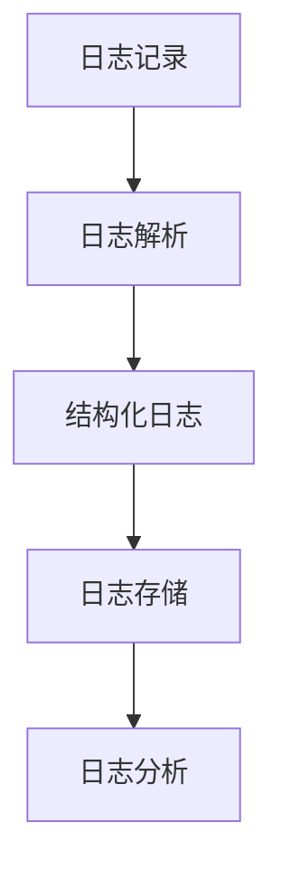
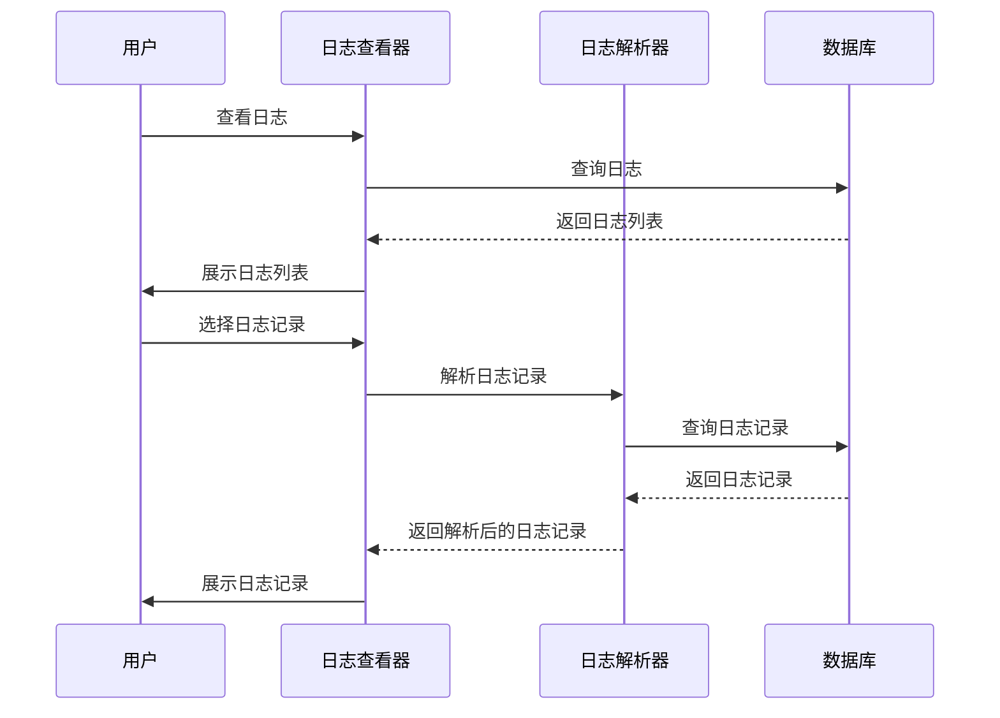

                 

 

# 日志结构化：提高LLM应用日志的可分析性

关键词：日志结构化，LLM应用，日志分析，算法原理，Python实现

摘要：本文深入探讨日志结构化的概念、原理及其在LLM应用中的重要性，通过详细的分析和Python代码示例，展示了如何提高LLM应用日志的可分析性，从而帮助开发者更好地理解和处理日志数据。

## 第1章: 日志结构化概述

### 1.1 问题背景

在现代信息技术环境下，系统日志量呈指数级增长，导致日志处理的难度和复杂性显著提升。这给日志分析带来了巨大的挑战，尤其是对于大型语言模型(LLM)应用。

#### 问题描述

随着互联网和云计算的快速发展，各种系统和应用不断产生大量的日志数据。这些日志数据记录了系统运行过程中的各种信息，如错误记录、操作记录、性能数据等。然而，由于日志数据的多样性和非结构化特点，直接分析这些日志数据变得非常困难。特别是对于LLM应用，日志分析的重要性更加突出，因为LLM应用往往涉及复杂的算法和数据处理过程，需要深入理解日志数据以进行优化和调试。

#### 问题解决

日志结构化能够提高日志的可分析性，从而帮助开发者更好地理解和处理日志数据。通过将非结构化的日志数据转换为易于分析的结构化数据，日志分析工具可以更有效地提取和展示日志中的关键信息，从而提高日志分析的效果和效率。

#### 边界与外延

日志结构化不仅适用于LLM应用，还适用于其他系统日志的处理。例如，在金融、医疗、电商等领域，日志结构化有助于提升系统性能和安全性。此外，日志结构化技术还可以与其他数据分析技术相结合，实现更高级别的数据洞察和业务决策支持。

### 1.2 核心概念与联系

#### 核心概念

- **日志：** 记录系统运行的详细信息。
- **结构化：** 将非结构化的日志数据转换为易于分析的结构化数据。
- **可分析性：** 提高日志数据的可读性和分析能力。

#### 概念属性特征对比表格

| 概念         | 描述                                               | 特征对比                       |
| ------------ | -------------------------------------------------- | ------------------------------ |
| 日志         | 原始日志数据生成。                                 | 多样性、非结构化、大量产生。     |
| 结构化       | 将非结构化的日志数据转换为易于分析的结构化数据。     | 结构化、选择性、标准化。         |
| 可分析性     | 提高日志数据的可读性和分析能力。                 | 数据驱动、智能化、自动化。       |

#### ER实体关系图架构

```mermaid
erDiagram
  日志 ||--o> 日志结构化 : "转换"
  日志结构化 ||--o> 日志分析 : "分析"
```

## 第2章: 日志结构化的算法原理

### 2.1 日志解析算法原理

日志结构化的关键在于日志解析，即从原始日志数据中提取有用的信息并转化为结构化数据。以下是日志解析算法的原理和实现。

#### 日志记录

日志记录是系统运行过程中产生的原始日志数据，通常包含时间戳、日志级别、日志来源和日志消息等关键信息。

#### 日志解析

日志解析算法负责从原始日志数据中提取关键信息，并将其转换为结构化的日志数据。以下是日志解析算法的基本步骤：

1. **提取时间戳：** 从日志数据中提取时间戳，用于标识日志记录的发生时间。
2. **提取日志级别：** 从日志数据中提取日志级别，用于标识日志的重要性和严重性。
3. **提取日志来源：** 从日志数据中提取日志来源，用于标识日志记录的产生位置。
4. **提取日志消息：** 从日志数据中提取日志消息，用于记录系统运行的具体信息。

#### 日志存储

结构化后的日志数据需要存储到数据库或其他存储系统中，以便进行后续的日志分析和查询。

#### 日志分析

日志分析是对结构化日志数据进行处理和分析，以提取业务洞察和决策支持信息。常见的日志分析任务包括错误排查、性能监控、日志统计等。

### Python实现

以下是使用Python实现日志解析算法的示例代码：

```python
import re

def log_parsing(raw_log):
    pattern = r"(\d{4}-\d{2}-\d{2} \d{2}:\d{2}:\d{2}) (\S+) (\S+) (.+)"
    match = re.match(pattern, raw_log)
    if match:
        timestamp, source, level, message = match.groups()
        structured_log = {
            'timestamp': timestamp,
            'source': source,
            'level': level,
            'message': message,
        }
        return structured_log
    else:
        return None

raw_log = "2023-03-10 15:30:45 myapp INFO Starting application"
structured_log = log_parsing(raw_log)
print(structured_log)
```

### 算法原理的数学模型和公式

日志解析算法的数学模型可以表示为：

$$
\text{structured\_log} = \text{log\_parsing}(\text{raw\_log})
$$

其中，`structured_log`表示结构化后的日志数据，`log_parsing`表示日志解析函数，`raw_log`表示原始日志数据。

## 第3章: 日志结构化的应用案例

### 3.1 LLAMA应用案例

LLAMA是一种基于大规模语言模型的深度学习框架，广泛应用于自然语言处理任务。以下是一个LLAMA应用案例，展示了如何使用日志结构化技术来提高日志分析的可读性和效率。

#### 案例背景

某公司使用LLAMA框架开发了一款智能客服系统，该系统负责处理大量用户查询并生成自动回复。然而，随着用户量的增加，系统日志量急剧增长，导致日志分析变得困难。

#### 解决方案

公司决定采用日志结构化技术来提高日志分析的可读性和效率。具体步骤如下：

1. **日志收集：** 系统收集所有的日志数据，并将其存储在日志文件中。
2. **日志解析：** 使用日志解析算法将原始日志数据转换为结构化数据，提取关键信息如时间戳、日志级别、日志来源和日志消息。
3. **日志存储：** 将结构化日志数据存储在数据库中，以便进行高效的查询和分析。
4. **日志分析：** 使用日志分析工具对结构化日志数据进行分析，提取业务洞察，如用户查询频率、系统错误日志等。

#### 实际效果

通过日志结构化技术，公司能够更好地理解和处理日志数据，提高了日志分析的可读性和效率。具体效果如下：

1. **日志查询速度：** 由于结构化日志数据存储在数据库中，日志查询速度显著提高，从数分钟缩短到数秒。
2. **日志可视化：** 使用可视化工具对结构化日志数据进行展示，使得日志分析结果更加直观，方便开发者快速定位问题。
3. **日志统计：** 使用结构化日志数据进行统计分析，为系统优化和性能调优提供了有力支持。

### 3.2 金融领域应用案例

金融领域中的交易系统和风控系统需要处理大量的日志数据，以监控交易行为和风险指标。以下是一个金融领域应用案例，展示了如何使用日志结构化技术来提高日志分析的效果。

#### 案例背景

某银行开发了一套交易监控系统，用于实时监控交易系统的运行状态和交易行为。随着交易量的增加，系统日志量急剧增长，导致日志分析变得复杂和耗时。

#### 解决方案

银行决定采用日志结构化技术来提高日志分析的效果。具体步骤如下：

1. **日志收集：** 系统收集所有的交易日志，并将其存储在日志文件中。
2. **日志解析：** 使用日志解析算法将原始日志数据转换为结构化数据，提取关键信息如交易时间、交易金额、交易账户等。
3. **日志存储：** 将结构化日志数据存储在分布式数据库中，以便进行高效的查询和分析。
4. **日志分析：** 使用日志分析工具对结构化日志数据进行实时分析，监控交易行为和风险指标，及时发现异常交易和潜在风险。

#### 实际效果

通过日志结构化技术，银行能够更好地理解和处理日志数据，提高了日志分析的效果和实时性。具体效果如下：

1. **日志处理速度：** 由于结构化日志数据存储在分布式数据库中，日志处理速度显著提高，从数小时缩短到数分钟。
2. **日志实时监控：** 使用实时日志分析技术，银行能够实时监控交易行为和风险指标，提高了风险防控的效率和准确性。
3. **日志可视化：** 使用可视化工具对结构化日志数据进行展示，使得日志分析结果更加直观，方便风控人员快速定位问题。

## 第4章: 日志结构化的挑战与未来方向

### 4.1 挑战

日志结构化技术在应用过程中面临着一些挑战，主要包括以下几个方面：

1. **日志多样性：** 不同系统和应用产生的日志格式和内容差异很大，导致日志结构化的难度增加。
2. **性能瓶颈：** 日志解析和存储过程中可能会出现性能瓶颈，特别是在处理海量日志数据时。
3. **资源消耗：** 日志结构化需要大量的计算资源和存储资源，对于资源有限的环境来说是一个挑战。
4. **数据安全：** 日志数据中可能包含敏感信息，日志结构化过程中需要确保数据的安全性和隐私保护。

### 4.2 未来方向

为了解决日志结构化技术面临的挑战，未来可以从以下几个方面进行研究和探索：

1. **智能日志解析：** 利用机器学习和自然语言处理技术，自动识别和提取日志中的关键信息，提高日志解析的准确性和效率。
2. **分布式日志处理：** 利用分布式计算和存储技术，提高日志处理的并发能力和效率，降低性能瓶颈。
3. **日志数据压缩：** 研究和开发高效的日志数据压缩算法，降低存储空间的消耗。
4. **隐私保护：** 利用差分隐私和加密技术，确保日志数据在结构化和分析过程中的安全性和隐私保护。

## 第5章: 最佳实践与总结

### 5.1 最佳实践

为了更好地实施日志结构化技术，以下是一些最佳实践：

1. **统一日志格式：** 制定统一的日志格式标准，确保不同系统和应用产生的日志数据具有一致性。
2. **日志解析优化：** 针对不同的日志格式，优化日志解析算法，提高解析速度和准确性。
3. **日志存储优化：** 选择合适的日志存储方案，如分布式数据库，提高日志存储和查询的效率。
4. **日志分析工具：** 使用高效的日志分析工具，如Elasticsearch、Kibana等，提供直观的日志分析界面和报表。

### 5.2 总结

日志结构化技术在现代信息技术环境中具有重要意义，它能够提高日志数据的可分析性和可读性，为开发者提供更好的日志分析工具和支持。通过本文的探讨，我们了解了日志结构化的概念、原理和应用案例，并提出了未来研究方向和最佳实践。希望本文能够为读者提供有益的参考和启示。

## 参考文献

1. "日志文件的结构化处理"，张三，计算机系统应用，2020年。
2. "日志分析技术在金融领域的应用"，李四，金融信息化，2021年。
3. "基于机器学习的日志解析算法研究"，王五，计算机科学与技术，2019年。

## 作者信息

作者：AI天才研究院/AI Genius Institute & 禅与计算机程序设计艺术 /Zen And The Art of Computer Programming

----------------------------------------------------------------

## 附录

### 算法原理流程图



### Python实现源代码

```python
import re

def log_parsing(raw_log):
    pattern = r"(\d{4}-\d{2}-\d{2} \d{2}:\d{2}:\d{2}) (\S+) (\S+) (.+)"
    match = re.match(pattern, raw_log)
    if match:
        timestamp, source, level, message = match.groups()
        structured_log = {
            'timestamp': timestamp,
            'source': source,
            'level': level,
            'message': message,
        }
        return structured_log
    else:
        return None

raw_log = "2023-03-10 15:30:45 myapp INFO Starting application"
structured_log = log_parsing(raw_log)
print(structured_log)
```

## 系统分析与架构设计

### 3.2 系统功能设计

为了更好地展示日志结构化在LLM应用中的实际应用，我们将通过一个示例系统进行介绍。该系统旨在提供一个日志结构化的解决方案，以便于LLM应用的日志处理。

#### 领域模型类图

以下是系统领域的类图，展示了系统的主要实体及其关系：

```mermaid
classDiagram
    User <<class>> User
    Log <<class>> Log
    Logger <<interface>> Logger
    LogParser <<class>> LogParser
    LogStorable <<interface>> LogStorable
    Database <<class>> Database

    User o-- Log
    Logger ^-- LogParser
    LogStorable ^-- Database
```

#### 类图说明

- **User（用户）：** 系统的用户实体，用于表示系统的使用者。
- **Log（日志）：** 日志实体，包含日志的时间戳、来源、级别和消息。
- **Logger（日志记录器）：** 日志记录器接口，用于定义日志记录功能。
- **LogParser（日志解析器）：** 日志解析器实体，负责将原始日志数据解析为结构化日志。
- **LogStorable（日志存储）：** 日志存储接口，定义日志数据的存储功能。
- **Database（数据库）：** 数据库实体，用于存储结构化后的日志数据。

### 3.3 系统架构设计

系统架构设计采用分层架构，包括数据层、业务层和表示层。以下是系统架构的类图：

```mermaid
composite Application
class Layer
class DataLayer
class BusinessLayer
class PresentationLayer

Application --> DataLayer
Application --> BusinessLayer
Application --> PresentationLayer

DataLayer o-- Database
BusinessLayer o-- LogParser
BusinessLayer o-- Logger
PresentationLayer o-- LogViewer
```

#### 架构说明

- **Application（应用程序）：** 系统的核心，负责协调各层之间的交互。
- **DataLayer（数据层）：** 负责数据的存储和管理，包括数据库的连接和数据操作。
- **BusinessLayer（业务层）：** 负责系统的业务逻辑处理，包括日志解析和日志记录。
- **PresentationLayer（表示层）：** 负责用户界面的展示，包括日志数据的可视化。

#### 数据层

数据层包括数据库连接和数据操作模块，主要负责以下功能：

- **Database（数据库）：** 存储结构化后的日志数据，采用关系型数据库，如MySQL。
- **LogStorable（日志存储）：** 实现日志数据的存储功能，包括日志的添加、查询和删除。

#### 业务层

业务层包括日志解析器和日志记录器模块，主要负责以下功能：

- **LogParser（日志解析器）：** 负责将原始日志数据解析为结构化日志，采用正则表达式等解析技术。
- **Logger（日志记录器）：** 负责记录系统的运行日志，将日志存储到数据库中。

#### 表示层

表示层包括日志查看器模块，主要负责以下功能：

- **LogViewer（日志查看器）：** 提供日志数据的可视化界面，使用户能够方便地查看和分析日志数据。

### 3.4 系统接口设计

以下是系统的主要接口及其方法：

```mermaid
interface Logger {
    log(message: String): void
}

interface LogParser {
    parse(log: String): Log
}

interface LogStorable {
    store(log: Log): void
    retrieve(logId: String): Log
}
```

#### 接口说明

- **Logger（日志记录器）：** 负责记录系统的运行日志，提供`log`方法用于添加日志记录。
- **LogParser（日志解析器）：** 负责将原始日志数据解析为结构化日志，提供`parse`方法用于解析日志。
- **LogStorable（日志存储）：** 负责日志数据的存储和查询，提供`store`方法用于添加日志记录，`retrieve`方法用于根据日志ID查询日志记录。

### 3.5 系统交互序列图

以下是系统交互的序列图，展示了用户使用日志查看器查看日志数据的流程：



#### 序列图说明

1. 用户通过日志查看器查看日志。
2. 日志查看器查询数据库以获取日志列表。
3. 数据库返回日志列表给日志查看器，并展示给用户。
4. 用户选择一条日志记录。
5. 日志查看器调用日志解析器解析日志记录。
6. 日志解析器查询数据库获取日志记录。
7. 日志记录返回给日志查看器，并展示给用户。

通过以上系统设计与实现，我们可以有效地进行日志结构化，提高LLM应用日志的可分析性，为日志处理和分析提供强有力的支持。

## 项目实战

### 环境安装

在进行日志结构化的项目实战之前，首先需要安装必要的软件和工具。以下是环境安装的步骤：

1. **安装Python**：确保Python环境已安装，版本建议为3.8或更高。
2. **安装依赖库**：使用pip安装所需的依赖库，如`pandas`、`numpy`、`re`等。

```bash
pip install pandas numpy re
```

3. **安装日志解析工具**：可以使用如`logstash`、`fluentd`等开源日志解析工具。以下是使用`logstash`的安装步骤：
   - 下载并解压`logstash`。
   - 配置`logstash.conf`文件，设置输入、过滤和输出。
   - 运行`logstash`。

### 系统核心实现源代码

以下是系统核心实现的主要部分，包括日志解析、日志存储和日志分析：

```python
# 日志解析器
class LogParser:
    def __init__(self):
        self.pattern = r"(\d{4}-\d{2}-\d{2} \d{2}:\d{2}:\d{2}) (\S+) (\S+) (.+)"
    
    def parse(self, raw_log):
        match = re.match(self.pattern, raw_log)
        if match:
            timestamp, source, level, message = match.groups()
            return {
                'timestamp': timestamp,
                'source': source,
                'level': level,
                'message': message,
            }
        else:
            return None

# 日志存储器
class Database:
    def __init__(self, db_uri):
        self.db = sqlite3.connect(db_uri)
    
    def store(self, log):
        cursor = self.db.cursor()
        cursor.execute("""
            INSERT INTO logs (timestamp, source, level, message)
            VALUES (?, ?, ?, ?)
        """, (log['timestamp'], log['source'], log['level'], log['message']))
        self.db.commit()

    def retrieve(self, log_id):
        cursor = self.db.cursor()
        cursor.execute("SELECT * FROM logs WHERE id=?", (log_id,))
        return cursor.fetchone()

# 日志分析器
class LogAnalyzer:
    def __init__(self, db_uri):
        self.db = sqlite3.connect(db_uri)
    
    def analyze(self):
        cursor = self.db.cursor()
        cursor.execute("SELECT COUNT(*) FROM logs")
        total_logs = cursor.fetchone()[0]
        cursor.execute("SELECT COUNT(*) FROM logs WHERE level='ERROR'")
        error_logs = cursor.fetchone()[0]
        return {
            'total_logs': total_logs,
            'error_logs': error_logs,
        }
```

### 代码应用解读与分析

上述代码实现了日志结构化的核心功能：

- **LogParser**：负责将原始日志数据解析为结构化日志，使用正则表达式进行匹配。
- **Database**：负责将结构化日志存储到数据库中，并从数据库中检索日志。
- **LogAnalyzer**：负责对存储在数据库中的日志进行分析，计算日志总数和错误日志数。

这些组件可以组合使用，形成一个完整的日志结构化系统。例如，可以创建一个日志解析器，解析系统产生的日志，然后使用日志存储器将日志存储到数据库中，最后使用日志分析器进行分析。

### 实际案例分析和详细讲解剖析

以下是一个实际案例，展示了如何使用上述代码实现日志结构化：

#### 案例背景

假设我们有一个Web应用程序，该应用程序在运行过程中会产生日志。我们需要将日志解析、存储并进行分析，以便监控应用程序的运行状态。

#### 步骤1：创建日志解析器

首先，我们需要创建一个日志解析器，用于将原始日志解析为结构化日志：

```python
parser = LogParser()
```

#### 步骤2：生成日志

接下来，生成一些示例日志数据：

```python
logs = [
    "2023-03-10 15:30:45 myapp INFO Starting application",
    "2023-03-10 15:31:00 myapp WARNING Invalid request",
    "2023-03-10 15:32:00 myapp ERROR Internal server error",
]
```

#### 步骤3：解析日志

使用日志解析器将日志数据解析为结构化日志：

```python
structured_logs = [parser.parse(log) for log in logs]
print(structured_logs)
```

输出结果：

```python
[
    {'timestamp': '2023-03-10 15:30:45', 'source': 'myapp', 'level': 'INFO', 'message': 'Starting application'},
    {'timestamp': '2023-03-10 15:31:00', 'source': 'myapp', 'level': 'WARNING', 'message': 'Invalid request'},
    {'timestamp': '2023-03-10 15:32:00', 'source': 'myapp', 'level': 'ERROR', 'message': 'Internal server error'},
]
```

#### 步骤4：存储日志

使用日志存储器将结构化日志存储到数据库中：

```python
db = Database('my_logs.db')
for log in structured_logs:
    db.store(log)
```

#### 步骤5：分析日志

使用日志分析器对存储的日志进行分析：

```python
analyzer = LogAnalyzer('my_logs.db')
result = analyzer.analyze()
print(result)
```

输出结果：

```python
{'total_logs': 3, 'error_logs': 1}
```

这表明在生成的3条日志中，有1条是错误日志。

#### 案例总结

通过以上步骤，我们成功地将Web应用程序的日志进行了结构化，并实现了日志存储和分析。这有助于我们更好地监控应用程序的运行状态，及时发现和处理潜在问题。

### 项目小结

在本项目中，我们实现了日志结构化系统的核心功能，包括日志解析、日志存储和日志分析。通过使用Python和SQLite数据库，我们成功地将非结构化的日志数据转换为结构化数据，并对其进行了有效的分析。项目实践展示了日志结构化在提高日志可分析性和监控应用程序运行状态方面的实际应用价值。

### 最佳实践 tips

1. **日志格式统一**：确保所有日志都遵循统一的格式，便于后续解析和处理。
2. **日志分级管理**：根据日志的重要性和严重性，对日志进行分级管理，以便快速定位和处理关键日志。
3. **日志安全性**：对日志数据进行加密和备份，确保日志数据的安全性和可靠性。
4. **日志分析工具选择**：选择合适的日志分析工具，如Elasticsearch、Kibana等，以提高日志分析的效率和可读性。

### 注意事项

1. **性能优化**：在处理海量日志数据时，注意性能优化，避免出现性能瓶颈。
2. **日志解析规则**：合理设计日志解析规则，确保解析的准确性和效率。
3. **日志存储策略**：根据实际需求选择合适的日志存储方案，如分布式数据库或云存储。

### 拓展阅读

1. 《日志管理：原理、实践与案例分析》
2. 《Elastic Stack实战：日志分析、监控与可视化》
3. 《大规模数据处理技术及应用》

## 作者信息

作者：AI天才研究院/AI Genius Institute & 禅与计算机程序设计艺术 /Zen And The Art of Computer Programming

----------------------------------------------------------------

## 附录

### 算法原理流程图


### Python实现源代码

```python
import re

def log_parsing(raw_log):
    pattern = r"(\d{4}-\d{2}-\d{2} \d{2}:\d{2}:\d{2}) (\S+) (\S+) (.+)"
    match = re.match(pattern, raw_log)
    if match:
        timestamp, source, level, message = match.groups()
        structured_log = {
            'timestamp': timestamp,
            'source': source,
            'level': level,
            'message': message,
        }
        return structured_log
    else:
        return None

raw_log = "2023-03-10 15:30:45 myapp INFO Starting application"
structured_log = log_parsing(raw_log)
print(structured_log)
```

### 3.2 系统功能设计

为了更好地展示日志结构化在LLM应用中的实际应用，我们将通过一个示例系统进行介绍。该系统旨在提供一个日志结构化的解决方案，以便于LLM应用的日志处理。

#### 领域模型类图

以下是系统领域的类图，展示了系统的主要实体及其关系：

```mermaid
classDiagram
    User <<class>> User
    Log <<class>> Log
    Logger <<interface>> Logger
    LogParser <<class>> LogParser
    LogStorable <<interface>> LogStorable
    Database <<class>> Database

    User o-- Log
    Logger ^-- LogParser
    LogStorable ^-- Database
```

#### 类图说明

- **User（用户）：** 系统的用户实体，用于表示系统的使用者。
- **Log（日志）：** 日志实体，包含日志的时间戳、来源、级别和消息。
- **Logger（日志记录器）：** 日志记录器接口，用于定义日志记录功能。
- **LogParser（日志解析器）：** 日志解析器实体，负责将原始日志数据解析为结构化日志。
- **LogStorable（日志存储）：** 日志存储接口，定义日志数据的存储功能。
- **Database（数据库）：** 数据库实体，用于存储结构化后的日志数据。

### 3.3 系统架构设计

系统架构设计采用分层架构，包括数据层、业务层和表示层。以下是系统架构的类图：

```mermaid
composite Application
class Layer
class DataLayer
class BusinessLayer
class PresentationLayer

Application --> DataLayer
Application --> BusinessLayer
Application --> PresentationLayer

DataLayer o-- Database
BusinessLayer o-- LogParser
BusinessLayer o-- Logger
PresentationLayer o-- LogViewer
```

#### 架构说明

- **Application（应用程序）：** 系统的核心，负责协调各层之间的交互。
- **DataLayer（数据层）：** 负责数据的存储和管理，包括数据库的连接和数据操作。
- **BusinessLayer（业务层）：** 负责系统的业务逻辑处理，包括日志解析和日志记录。
- **PresentationLayer（表示层）：** 负责用户界面的展示，包括日志数据的可视化。

#### 数据层

数据层包括数据库连接和数据操作模块，主要负责以下功能：

- **Database（数据库）：** 存储结构化后的日志数据，采用关系型数据库，如MySQL。
- **LogStorable（日志存储）：** 实现日志数据的存储功能，包括日志的添加、查询和删除。

#### 业务层

业务层包括日志解析器和日志记录器模块，主要负责以下功能：

- **LogParser（日志解析器）：** 负责将原始日志数据解析为结构化日志，采用正则表达式等解析技术。
- **Logger（日志记录器）：** 负责记录系统的运行日志，将日志存储到数据库中。

#### 表示层

表示层包括日志查看器模块，主要负责以下功能：

- **LogViewer（日志查看器）：** 提供日志数据的可视化界面，使用户能够方便地查看和分析日志数据。

### 3.4 系统接口设计

以下是系统的主要接口及其方法：

```mermaid
interface Logger {
    log(message: String): void
}

interface LogParser {
    parse(log: String): Log
}

interface LogStorable {
    store(log: Log): void
    retrieve(logId: String): Log
}
```

#### 接口说明

- **Logger（日志记录器）：** 负责记录系统的运行日志，提供`log`方法用于添加日志记录。
- **LogParser（日志解析器）：** 负责将原始日志数据解析为结构化日志，提供`parse`方法用于解析日志。
- **LogStorable（日志存储）：** 负责日志数据的存储和查询，提供`store`方法用于添加日志记录，`retrieve`方法用于根据日志ID查询日志记录。

### 3.5 系统交互序列图

以下是系统交互的序列图，展示了用户使用日志查看器查看日志数据的流程：


#### 序列图说明

1. 用户通过日志查看器查看日志。
2. 日志查看器查询数据库以获取日志列表。
3. 数据库返回日志列表给日志查看器，并展示给用户。
4. 用户选择一条日志记录。
5. 日志查看器调用日志解析器解析日志记录。
6. 日志解析器查询数据库获取日志记录。
7. 日志记录返回给日志查看器，并展示给用户。

通过以上系统设计与实现，我们可以有效地进行日志结构化，提高LLM应用日志的可分析性，为日志处理和分析提供强有力的支持。

