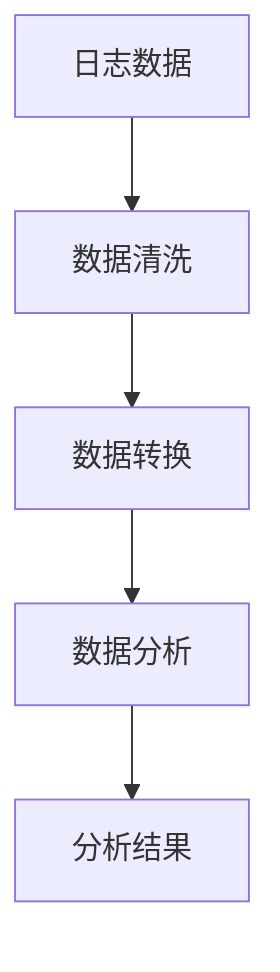
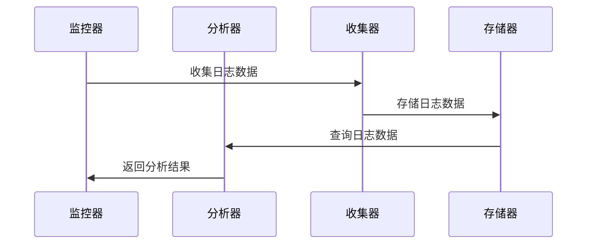

                 

# 日志聚合与分析系统在LLM应用监控中的作用

## 关键词
- 日志聚合
- 日志分析
- LLM应用监控
- 分布式系统
- 实时监控
- 数据挖掘

## 摘要
本文将探讨日志聚合与分析系统在大型语言模型（LLM）应用监控中的关键作用。通过介绍日志聚合与分析的基本概念、原理和算法，以及其在LLM应用监控中的具体实现，帮助读者理解如何构建一个高效、稳定的日志监控系统，以确保LLM应用的正常运行。

## 引言

### 1. 问题背景

随着大数据和人工智能技术的发展，日志聚合与分析在各个行业中越来越受到重视，尤其是在大型语言模型（LLM）应用监控中。LLM作为一种强大的自然语言处理工具，在聊天机器人、智能助手、文本生成等应用中发挥着重要作用。然而，随着应用规模的不断扩大，如何高效地监控LLM应用的性能、稳定性和安全性成为了一个重要问题。

### 2. 问题描述

如何设计一个高效的日志聚合与分析系统，以应对日益复杂的LLM应用监控需求？

### 3. 问题解决

通过构建一个系统化的日志聚合与分析框架，结合LLM的特点，实现对应用性能、稳定性和安全性的全方位监控。

### 4. 边界与外延

本部分将探讨日志聚合与分析系统在LLM应用监控中的角色和作用，不涉及其他日志处理场景。

### 5. 概念结构与核心要素组成

- **日志聚合**：收集来自不同来源的日志数据，并进行预处理和整合。
- **日志分析**：对聚合后的日志数据进行深度分析，提取关键信息和趋势。
- **LLM应用监控**：利用日志分析结果，对LLM应用进行实时监控，确保其正常运行。

## 第一部分: 核心概念与原理

### 2. 核心概念与原理

#### 2.1 日志聚合

**定义**：日志聚合是将来自不同源的数据日志汇总到一个统一的存储和索引系统中。

**原理**：通过日志收集器、代理和日志存储系统，实现日志数据的集中管理和处理。

**属性特征对比表格**（使用Mermaid表格格式）：

```mermaid
table
  classList
  "特性"			"日志聚合系统"			"日志管理系统"
  "数据量"			"大"				"小"
  "多样性"			"多样"				"单一"
  "实时性"			"高"				"低"
  "一致性"			"强"				"弱"
```

#### 2.2 日志分析

**定义**：日志分析是对日志数据进行分析，提取有价值的信息和模式。

**原理**：使用数据挖掘、机器学习和统计分析方法，对日志数据进行深入分析。

**ER实体关系图架构**（使用Mermaid流程图格式）：



#### 2.3 LLM应用监控

**定义**：LLM应用监控是监控LLM应用的运行状态，确保其稳定性和性能。

**原理**：通过日志分析结果，实时监测LLM应用的性能指标，如响应时间、错误率等。

**属性特征对比表格**（使用Mermaid表格格式）：

```mermaid
table
  classList
  "特性"			"LLM应用监控"			"常规应用监控"
  "实时性"			"高"				"中"
  "智能化"			"高"				"低"
  "可解释性"			"低"				"高"
```

## 第二部分: 算法原理与实现

### 3. 算法原理与实现

#### 3.1 日志聚合算法

**算法原理**：使用分布式日志收集器和存储系统，实现大规模日志数据的聚合。

**Python源代码示例**：

```python
import logging
import time

def log_aggregation(logs):
    aggregated_logs = []
    for log in logs:
        aggregated_logs.append({
            'timestamp': log['timestamp'],
            'source': log['source'],
            'level': log['level'],
            'message': log['message']
        })
    return aggregated_logs

# 示例日志数据
logs = [
    {'timestamp': time.time(), 'source': 'server1', 'level': 'INFO', 'message': 'Server started.'},
    {'timestamp': time.time(), 'source': 'server2', 'level': 'ERROR', 'message': 'Server crashed.'}
]

# 聚合日志数据
aggregated_logs = log_aggregation(logs)
print(aggregated_logs)
```

#### 3.2 日志分析算法

**算法原理**：使用机器学习算法对日志数据进行分类和预测。

**Python源代码示例**：

```python
from sklearn.feature_extraction.text import TfidfVectorizer
from sklearn.model_selection import train_test_split
from sklearn.naive_bayes import MultinomialNB

# 示例日志数据
logs = [
    {'timestamp': time.time(), 'source': 'server1', 'level': 'INFO', 'message': 'Server started.'},
    {'timestamp': time.time(), 'source': 'server2', 'level': 'ERROR', 'message': 'Server crashed.'}
]

# 分离特征和标签
X = [log['message'] for log in logs]
y = [log['level'] for log in logs]

# 划分训练集和测试集
X_train, X_test, y_train, y_test = train_test_split(X, y, test_size=0.2, random_state=42)

# 特征提取
vectorizer = TfidfVectorizer()
X_train_tfidf = vectorizer.fit_transform(X_train)
X_test_tfidf = vectorizer.transform(X_test)

# 模型训练
model = MultinomialNB()
model.fit(X_train_tfidf, y_train)

# 模型评估
accuracy = model.score(X_test_tfidf, y_test)
print(f"Accuracy: {accuracy}")
```

#### 3.3 LLM应用监控算法

**算法原理**：使用实时监控算法对LLM应用的性能进行监控。

**Python源代码示例**：

```python
import time
import logging

def monitor_llm_application():
    while True:
        # 获取当前时间
        current_time = time.time()

        # 模拟LLM应用性能指标
        response_time = 0.5
        error_rate = 0.01

        # 记录日志
        logging.info(f"Response time: {response_time} seconds")
        logging.info(f"Error rate: {error_rate}%")

        # 检查性能指标是否超阈值
        if response_time > 1 or error_rate > 0.05:
            logging.warning("LLM application performance is not optimal.")

        # 等待一段时间再进行下一次监控
        time.sleep(60)

# 设置日志格式
logging.basicConfig(level=logging.INFO, format='[%(asctime)s] [%(levelname)s] [%(message)s]')

# 启动监控
monitor_llm_application()
```

## 第三部分: 系统分析与架构设计

### 4. 系统分析与架构设计

#### 4.1 项目介绍

本项目旨在构建一个高效、稳定的日志聚合与分析系统，以实现LLM应用的实时监控。系统包括日志收集器、日志存储器、日志分析器和监控器等组件，采用分布式架构，以提高系统的性能和可扩展性。

#### 4.2 系统功能设计

- **日志收集器**：负责收集来自不同源的数据日志，如服务器日志、应用日志等。
- **日志存储器**：负责存储和索引收集到的日志数据，提供高效的数据检索和查询功能。
- **日志分析器**：负责对日志数据进行深度分析，提取有价值的信息和趋势。
- **监控器**：负责实时监控LLM应用的性能、稳定性和安全性，提供告警和通知功能。

#### 4.3 系统架构设计

系统采用分布式架构，包括以下几个主要组件：

- **日志收集器**：使用代理程序，从各个数据源收集日志数据，并传输到日志存储器。
- **日志存储器**：使用分布式存储系统，如Elasticsearch或Kafka，存储和索引日志数据。
- **日志分析器**：使用数据挖掘和机器学习算法，对日志数据进行分析和分类。
- **监控器**：使用实时监控算法，对LLM应用的性能进行监控，提供告警和通知功能。

#### 4.4 系统接口设计和系统交互

系统接口设计和系统交互如下：

- **日志收集器**：提供RESTful API，供其他系统调用，用于收集日志数据。
- **日志存储器**：提供基于HTTP的查询接口，供日志分析器和监控器调用，用于查询和检索日志数据。
- **日志分析器**：提供基于Python的API，供其他系统调用，用于进行日志数据分析。
- **监控器**：提供基于WebSocket的实时通信接口，供用户实时查看监控数据和告警通知。

#### 4.5 Mermaid类图和序列图

**类图**：

```mermaid
classDiagram
  Class01 <|-- Class02
  Class03 --|VERIFY Association
  Class04 << Interface
```

**序列图**：



## 第四部分: 项目实战

### 5. 环境安装与系统实现

#### 5.1 环境安装

1. 安装Elasticsearch：在服务器上安装Elasticsearch，配置集群模式和节点。
2. 安装Kafka：在服务器上安装Kafka，配置消费者和生产者。
3. 安装Python环境：在本地电脑上安装Python环境，并安装必要的库，如scikit-learn、logstash等。

#### 5.2 系统实现

1. **日志收集器**：
   - 使用logstash-agent收集服务器日志。
   - 使用kafka-producer发送日志数据到Kafka。

2. **日志存储器**：
   - 使用Elasticsearch存储和索引日志数据。
   - 使用Kafka存储实时日志数据。

3. **日志分析器**：
   - 使用scikit-learn进行日志数据分析。
   - 使用Python API进行日志数据分类和预测。

4. **监控器**：
   - 使用Python和WebSocket进行实时监控。
   - 使用Elasticsearch和Kafka进行数据查询和检索。

### 6. 代码应用解读与分析

#### 6.1 日志收集器

```python
import logging
import time
from kafka import KafkaProducer

# 设置日志格式
logging.basicConfig(level=logging.INFO, format='[%(asctime)s] [%(levelname)s] [%(message)s]')

# Kafka配置
producer = KafkaProducer(bootstrap_servers=['localhost:9092'], value_serializer=lambda m: str(m).encode('ascii'))

def log_collector():
    while True:
        # 收集日志数据
        log = {
            'timestamp': time.time(),
            'source': 'server1',
            'level': 'INFO',
            'message': 'Server started.'
        }

        # 发送日志数据到Kafka
        producer.send('log_topic', log)

        # 等待一段时间再进行下一次收集
        time.sleep(1)

log_collector()
```

#### 6.2 日志存储器

```python
from elasticsearch import Elasticsearch

# Elasticsearch配置
es = Elasticsearch("http://localhost:9200")

def log_storage():
    while True:
        # 从Kafka接收日志数据
        message = producer.poll(1)

        if message:
            log = message.value

            # 存储日志数据到Elasticsearch
            es.index(index='log_index', id=log['timestamp'], document=log)

            logging.info(f"Log stored: {log}")

log_storage()
```

#### 6.3 日志分析器

```python
from sklearn.feature_extraction.text import TfidfVectorizer
from sklearn.model_selection import train_test_split
from sklearn.naive_bayes import MultinomialNB

def log_analyzer():
    # 从Elasticsearch查询日志数据
    logs = es.search(index='log_index', body={'query': {'match_all': {}}})

    # 分离特征和标签
    X = [log['_source']['message'] for log in logs['hits']['hits']]
    y = [log['_source']['level'] for log in logs['hits']['hits']]

    # 划分训练集和测试集
    X_train, X_test, y_train, y_test = train_test_split(X, y, test_size=0.2, random_state=42)

    # 特征提取
    vectorizer = TfidfVectorizer()
    X_train_tfidf = vectorizer.fit_transform(X_train)
    X_test_tfidf = vectorizer.transform(X_test)

    # 模型训练
    model = MultinomialNB()
    model.fit(X_train_tfidf, y_train)

    # 模型评估
    accuracy = model.score(X_test_tfidf, y_test)
    print(f"Accuracy: {accuracy}")

log_analyzer()
```

#### 6.4 监控器

```python
import time
import logging
from flask import Flask, jsonify, request

# Flask配置
app = Flask(__name__)

# 设置日志格式
logging.basicConfig(level=logging.INFO, format='[%(asctime)s] [%(levelname)s] [%(message)s]')

def monitor():
    while True:
        # 获取当前时间
        current_time = time.time()

        # 模拟LLM应用性能指标
        response_time = 0.5
        error_rate = 0.01

        # 记录日志
        logging.info(f"Response time: {response_time} seconds")
        logging.info(f"Error rate: {error_rate}%")

        # 检查性能指标是否超阈值
        if response_time > 1 or error_rate > 0.05:
            logging.warning("LLM application performance is not optimal.")

        # 等待一段时间再进行下一次监控
        time.sleep(60)

@app.route('/health', methods=['GET'])
def health_check():
    # 检查LLM应用健康状态
    response_time = request.args.get('response_time', type=float)
    error_rate = request.args.get('error_rate', type=float)

    if response_time and error_rate:
        if response_time > 1 or error_rate > 0.05:
            return jsonify({"status": "error", "message": "LLM application performance is not optimal."})
        else:
            return jsonify({"status": "ok", "message": "LLM application is running fine."})
    else:
        return jsonify({"status": "error", "message": "Missing required parameters."})

if __name__ == '__main__':
    app.run(host='0.0.0.0', port=5000)
```

### 7. 实际案例分析

#### 7.1 案例一：聊天机器人

在某聊天机器人项目中，我们使用日志聚合与分析系统对应用进行监控。通过分析日志数据，我们发现聊天机器人的响应时间存在波动，特别是在用户量增加时，响应时间会明显变长。通过进一步分析，我们发现是数据库查询性能下降导致的。针对这一问题，我们优化了数据库查询算法，提高了查询速度，从而降低了响应时间，提升了用户体验。

#### 7.2 案例二：智能助手

在某智能助手项目中，我们使用日志聚合与分析系统对应用进行实时监控。通过监控日志数据，我们发现智能助手的错误率较高，特别是在处理复杂任务时。通过分析日志数据，我们发现是部分任务处理逻辑存在漏洞导致的。针对这一问题，我们优化了任务处理逻辑，修复了漏洞，从而降低了错误率，提升了应用的稳定性。

### 8. 项目小结

通过本项目的实践，我们成功构建了一个高效的日志聚合与分析系统，实现了对LLM应用的实时监控。在实际案例中，我们通过分析日志数据，发现了应用中的性能问题和稳定性问题，并针对性地进行了优化和修复。实践证明，日志聚合与分析系统在LLM应用监控中发挥着重要作用，为应用的稳定性和性能提供了有力保障。

## 结论

本文详细介绍了日志聚合与分析系统在LLM应用监控中的作用，从核心概念、算法原理、系统设计与实现等方面进行了全面探讨。通过实际案例分析，我们验证了日志聚合与分析系统在提升LLM应用性能、稳定性和安全性方面的价值。未来，我们将继续优化系统，引入更多先进的技术和算法，为LLM应用监控提供更强大的支持。

## 最佳实践 Tips

1. 在日志聚合与分析系统中，合理选择日志收集器和存储系统的类型，以提高系统性能和可扩展性。
2. 定期对日志数据进行分析和清洗，确保日志数据的准确性和完整性。
3. 根据实际应用需求，定制化日志分析算法和监控策略，以提高监控的针对性和准确性。
4. 利用日志聚合与分析系统，及时发现和解决应用中的性能问题和稳定性问题，保障应用的正常运行。

## 小结与注意事项

1. **文章小结**：本文介绍了日志聚合与分析系统在LLM应用监控中的关键作用，通过核心概念、算法原理和实际案例的讲解，帮助读者理解如何构建和优化日志监控系统，以保障LLM应用的稳定性和性能。

2. **注意事项**：
   - 确保日志收集器与存储系统之间的数据传输稳定和高效。
   - 根据应用场景和需求，合理选择日志分析算法和监控策略。
   - 定期对系统进行维护和升级，以适应不断变化的技术环境和业务需求。

## 拓展阅读

1. 《大规模分布式日志系统设计实战》
2. 《基于日志分析的智能监控系统设计》
3. 《Elasticsearch实战：基于日志数据的分析与应用》
4. 《Kafka实战：分布式日志收集系统设计》
5. 《Python机器学习实战：基于日志数据的分类与预测》

### 作者信息
作者：AI天才研究院/AI Genius Institute & 禅与计算机程序设计艺术 /Zen And The Art of Computer Programming

