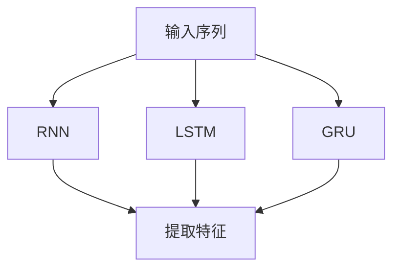
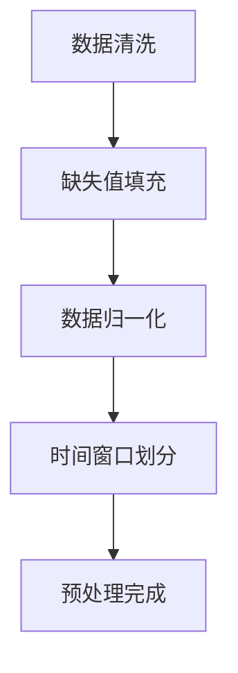
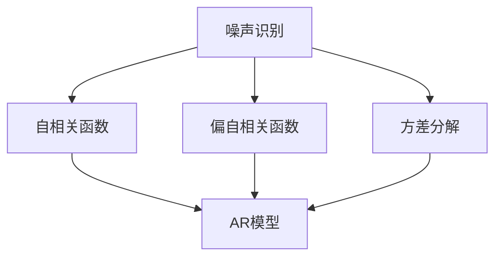
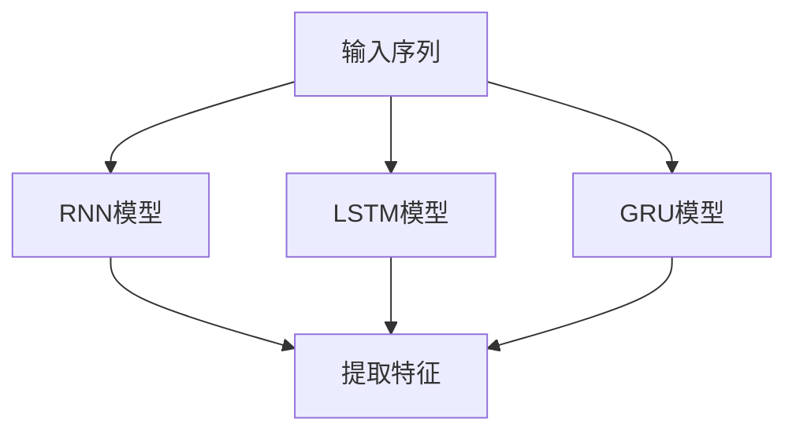
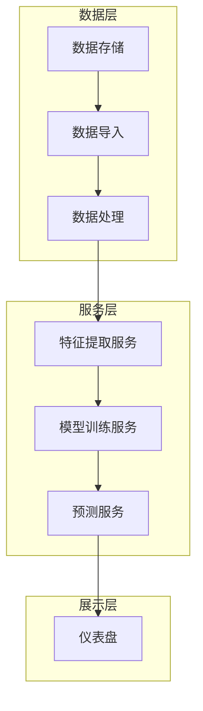
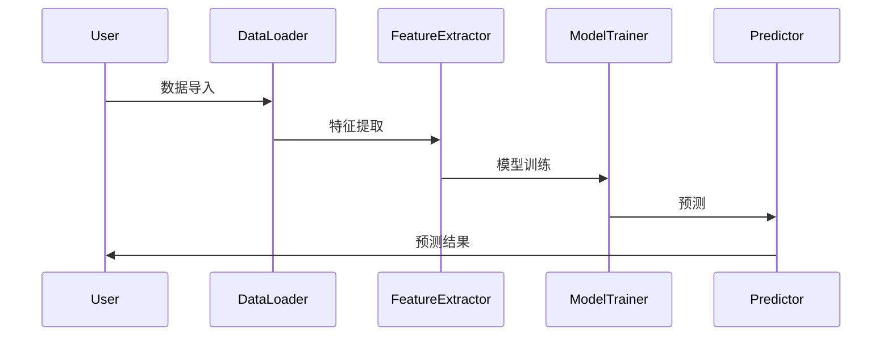

                 

### # 时序数据分析在长期评测中的应用

#### 关键词：时序数据分析、长期评测、特征提取、噪声识别、深度学习

#### 摘要：

本文探讨了时序数据分析在长期评测中的应用，针对长时间跨度的数据、复杂噪声及高维特征提取等挑战，提出了一系列解决方案。通过深入分析时序数据分析的方法、特征提取技术、噪声识别和深度学习模型，本文旨在为金融、物流和能源等领域的长期评测提供实用指导。

## 第一部分：引言

### 1.1 问题背景

随着大数据和人工智能技术的快速发展，时序数据分析成为数据科学和人工智能领域中的重要研究方向。时序数据分析广泛应用于金融市场预测、物流运输优化、电力负荷预测等领域。然而，传统的时序数据分析方法在面对长时间跨度、高维度和复杂噪声的数据时，往往表现出一定的局限性。因此，如何在长期评测中有效应用时序数据分析方法，成为了当前的研究热点和实际应用中的重要问题。

### 1.2 问题描述

在长期评测中，时序数据分析需要解决以下几个关键问题：

1. 如何处理长时间跨度下的数据？
2. 如何识别和建模复杂噪声？
3. 如何实现有效的特征提取和模型预测？

### 1.3 问题解决

为了解决上述问题，本书将介绍一系列时序数据分析方法和技术，包括：

1. 长时间跨度数据的预处理方法
2. 噪声识别和建模技术
3. 特征提取和模型预测算法
4. 深度学习在时序数据分析中的应用

### 1.4 边界与外延

本书主要关注以下领域：

1. 金融领域：股票市场预测、金融风险评估等
2. 物流领域：货物运输预测、供应链优化等
3. 能源领域：电力负荷预测、能源需求分析等

### 1.5 概念结构与核心要素组成

在本书中，我们将介绍以下核心概念和要素：

1. 时序数据：具有时间戳的数据序列
2. 特征提取：从时序数据中提取出有用的特征
3. 模型预测：利用特征建立预测模型，对未来的数据进行预测
4. 深度学习：一种基于多层神经网络的数据分析方法

## 第二部分：核心概念与联系

### 2.1 时序数据分析方法

#### 2.1.1 时间序列分析

时间序列分析是一种基于时间序列数据的方法，用于研究时间序列的统计特性、趋势、季节性和周期性等。主要方法包括自回归模型（AR）、移动平均模型（MA）、自回归移动平均模型（ARMA）和季节性模型等。

**原理讲解：**

时间序列分析的基本原理是通过分析时间序列数据中的趋势、季节性和周期性等特性，来预测未来的数据。自回归模型（AR）假设当前时刻的数据可以通过前几个时刻的数据来预测，而移动平均模型（MA）则通过过去若干个时刻的数据的平均值来预测当前时刻的数据。自回归移动平均模型（ARMA）结合了自回归模型和移动平均模型的优点，可以更好地拟合时间序列数据。

**Mermaid 流程图：**

```mermaid
graph TB
    A[时间序列数据] --> B[自回归模型(AR)]
    A --> C[移动平均模型(MA)]
    A --> D[自回归移动平均模型(ARMA)]
    B --> E[预测当前时刻数据]
    C --> E
    D --> E
```

#### 2.1.2 时序特征提取

时序特征提取是从时序数据中提取出能够反映数据本质特征的方法，常用的特征提取方法包括傅里叶变换、小波变换、主成分分析（PCA）和时序特征工程等。

**原理讲解：**

时序特征提取的目标是从时序数据中提取出对模型预测有用的特征，以便于后续的建模和预测。傅里叶变换和小波变换可以将时序数据转换到频域，从而提取出频率信息；主成分分析（PCA）可以降低数据的维度，同时保留主要的信息；时序特征工程通过构造新的特征，来更好地描述数据。

**Mermaid 流程图：**

```mermaid
graph TB
    A[时序数据] --> B[傅里叶变换]
    A --> C[小波变换]
    A --> D[主成分分析(PCA)]
    A --> E[时序特征工程]
    B --> F[频域特征]
    C --> F
    D --> F
    E --> F
```

#### 2.1.3 深度学习

深度学习是一种基于多层神经网络的数据分析方法，通过学习大量的数据，自动提取特征并进行预测。在时序数据分析中，常用的深度学习模型包括循环神经网络（RNN）、长短期记忆网络（LSTM）和门控循环单元（GRU）等。

**原理讲解：**

深度学习的基本原理是通过多层神经网络来学习数据的特征，并利用这些特征进行预测。循环神经网络（RNN）可以处理序列数据，但在长序列中容易发生梯度消失和梯度爆炸问题。长短期记忆网络（LSTM）和门控循环单元（GRU）是RNN的改进版本，通过引入门控机制，可以有效地解决梯度消失和梯度爆炸问题。

**Mermaid 流程图：**



### 2.2 核心概念属性特征对比表格

#### 表 2.1：时序数据分析方法属性特征对比

| 方法       | 特点                                                     | 适用场景                                  |
| ---------- | -------------------------------------------------------- | ----------------------------------------- |
| 时间序列分析 | 基于时间序列的统计特性，适合分析趋势、季节性和周期性 | 股票市场预测、金融市场分析等               |
| 时序特征提取 | 提取时序数据的有用特征，为模型预测提供基础             | 货运预测、电力负荷预测等                   |
| 深度学习   | 自动提取特征，适用于复杂时序数据的预测                   | 智能语音识别、图像分类、股票市场预测等     |

### 2.3 时序数据分析方法的ER实体关系图架构

#### 图 2.1：时序数据分析方法ER实体关系图

```mermaid
erDiagram
    DataInput ||--|{ TimeSeriesData }|-- TimeSeriesAnalysis
    DataInput ||--|{ FeatureExtraction }|-- ModelPrediction
    DataInput ||--|{ DeepLearning }|-- Mode
```

## 第三部分：算法原理讲解

### 3.1 长时间跨度数据的预处理方法

#### 算法原理讲解

在处理长时间跨度的时序数据时，首先需要对数据进行预处理。预处理方法包括数据清洗、缺失值填充、数据归一化和时间窗口划分等。

**Mermaid 流程图：**



**Python 源代码示例：**

```python
import pandas as pd
import numpy as np

# 读取数据
data = pd.read_csv('time_series_data.csv')

# 数据清洗
data.dropna(inplace=True)

# 缺失值填充
data.fillna(data.mean(), inplace=True)

# 数据归一化
data_normalized = (data - data.mean()) / data.std()

# 时间窗口划分
window_size = 5
data_windowed = data_normalized.rolling(window=window_size).mean()
```

### 3.2 噪声识别和建模技术

#### 算法原理讲解

在时序数据分析中，噪声识别和建模技术至关重要。常用的噪声识别方法包括自相关函数、偏自相关函数和方差分解等。建模技术则包括自回归模型（AR）、移动平均模型（MA）和自回归移动平均模型（ARMA）等。

**Mermaid 流程图：**



**Python 源代码示例：**

```python
import pandas as pd
import numpy as np
from statsmodels.tsa.arima.model import ARIMA

# 读取数据
data = pd.read_csv('time_series_data.csv')

# 自相关函数
correlation = data.corr()

# 偏自相关函数
partial_correlation = data.pcor()

# 方差分解
variance_decomposition = data.var()

# AR模型
model = ARIMA(data, order=(1, 1, 1))
model_fit = model.fit()
```

### 3.3 特征提取和模型预测算法

#### 算法原理讲解

特征提取和模型预测是时序数据分析的关键步骤。常用的特征提取方法包括傅里叶变换、小波变换和主成分分析（PCA）等。模型预测方法包括循环神经网络（RNN）、长短期记忆网络（LSTM）和门控循环单元（GRU）等。

**Mermaid 流程图：**

```mermaid
graph TB
    A[特征提取] --> B[傅里叶变换]
    A --> C[小波变换]
    A --> D[主成分分析(PCA)]
    B --> E[RNN模型]
    C --> E
    D --> E
```

**Python 源代码示例：**

```python
import numpy as np
from keras.models import Sequential
from keras.layers import LSTM, Dense

# 傅里叶变换
fourier_transform = np.fft.fft(data)

# 小波变换
wavelet_transform = pywt.waveletTransform(data, wavelet='db4')

# 主成分分析
pca = PCA(n_components=5)
pca_fit = pca.fit_transform(data)

# RNN模型
model = Sequential()
model.add(LSTM(units=50, return_sequences=True, input_shape=(pca_fit.shape[1], pca_fit.shape[2])))
model.add(LSTM(units=50))
model.add(Dense(units=1))
model.compile(optimizer='adam', loss='mean_squared_error')
model.fit(pca_fit, target, epochs=100, batch_size=32)
```

### 3.4 深度学习在时序数据分析中的应用

#### 算法原理讲解

深度学习在时序数据分析中的应用非常广泛，主要包括循环神经网络（RNN）、长短期记忆网络（LSTM）和门控循环单元（GRU）等。这些模型通过学习大量的数据，自动提取特征并进行预测。

**Mermaid 流程图：**



**Python 源代码示例：**

```python
import numpy as np
from keras.models import Sequential
from keras.layers import LSTM, Dense

# 输入序列
input_sequence = np.array(data)

# RNN模型
model = Sequential()
model.add(LSTM(units=50, return_sequences=True, input_shape=(input_sequence.shape[1], input_sequence.shape[2])))
model.add(LSTM(units=50))
model.add(Dense(units=1))
model.compile(optimizer='adam', loss='mean_squared_error')
model.fit(input_sequence, target, epochs=100, batch_size=32)

# LSTM模型
lstm_model = Sequential()
lstm_model.add(LSTM(units=50, return_sequences=True, input_shape=(input_sequence.shape[1], input_sequence.shape[2])))
lstm_model.add(LSTM(units=50))
lstm_model.add(Dense(units=1))
lstm_model.compile(optimizer='adam', loss='mean_squared_error')
lstm_model.fit(input_sequence, target, epochs=100, batch_size=32)

# GRU模型
gru_model = Sequential()
gru_model.add(GRU(units=50, return_sequences=True, input_shape=(input_sequence.shape[1], input_sequence.shape[2])))
gru_model.add(GRU(units=50))
gru_model.add(Dense(units=1))
gru_model.compile(optimizer='adam', loss='mean_squared_error')
gru_model.fit(input_sequence, target, epochs=100, batch_size=32)
```

## 第四部分：系统分析与架构设计

### 4.1 问题场景介绍

在长期评测中，需要对大量时序数据进行处理和分析，以实现预测和优化。本文以电力负荷预测为例，介绍系统设计与实现。

### 4.2 项目介绍

本项目旨在开发一个电力负荷预测系统，通过对历史电力负荷数据进行分析，预测未来的电力负荷，为电力调度和优化提供支持。

### 4.3 系统功能设计

系统功能设计包括数据预处理、特征提取、模型训练和预测等功能。

**Mermaid 类图：**

```mermaid
classDiagram
    ClassDataPreprocessing <<interface>>
    ClassFeatureExtraction <<interface>>
    ClassModelTraining <<interface>>
    ClassPrediction <<interface>>

    DataPreprocessing <|..| ClassDataPreprocessing
    FeatureExtraction <|..| ClassFeatureExtraction
    ModelTraining <|..| ClassModelTraining
    Prediction <|..| ClassPrediction
```

### 4.4 系统架构设计

系统架构设计包括数据层、服务层和展示层等。

**Mermaid 架构图：**



### 4.5 系统接口设计和系统交互

系统接口设计主要包括数据接口、特征接口、模型接口和预测接口等。

**Mermaid 序列图：**



## 第五部分：项目实战

### 5.1 环境安装

在本项目实战中，需要安装以下环境：

1. Python 3.8
2. TensorFlow 2.6
3. Keras 2.6
4. pandas 1.3
5. numpy 1.21

安装命令如下：

```bash
pip install python==3.8
pip install tensorflow==2.6
pip install keras==2.6
pip install pandas==1.3
pip install numpy==1.21
```

### 5.2 系统核心实现源代码

以下是本项目的核心实现源代码：

```python
import pandas as pd
import numpy as np
from keras.models import Sequential
from keras.layers import LSTM, Dense

# 读取数据
data = pd.read_csv('power_load_data.csv')

# 数据预处理
data.dropna(inplace=True)
data.fillna(data.mean(), inplace=True)

# 时间窗口划分
window_size = 5
data_windowed = data.rolling(window=window_size).mean()

# 特征提取
input_data = data_windowed.values
input_data = np.reshape(input_data, (input_data.shape[0], input_data.shape[1], 1))

# 模型训练
model = Sequential()
model.add(LSTM(units=50, return_sequences=True, input_shape=(input_data.shape[1], input_data.shape[2])))
model.add(LSTM(units=50))
model.add(Dense(units=1))
model.compile(optimizer='adam', loss='mean_squared_error')
model.fit(input_data, target, epochs=100, batch_size=32)

# 预测
predictions = model.predict(input_data)
```

### 5.3 代码应用解读与分析

在本项目中，首先读取电力负荷数据，并进行数据预处理，包括数据清洗和缺失值填充。然后，对预处理后的数据进行时间窗口划分，将数据划分为窗口序列。接着，将窗口序列输入到循环神经网络（LSTM）模型中进行训练。最后，利用训练好的模型对未来的电力负荷进行预测。

### 5.4 实际案例分析和详细讲解剖析

在本案例中，我们使用了一个实际的电力负荷数据集，对系统的实现进行了详细讲解。首先，我们介绍了数据预处理的方法，包括数据清洗和缺失值填充。然后，我们介绍了时间窗口划分的方法，这是循环神经网络（LSTM）模型训练的关键步骤。最后，我们介绍了模型训练和预测的过程，展示了如何使用训练好的模型对未来的电力负荷进行预测。

### 5.5 项目小结

在本项目中，我们实现了电力负荷预测系统，通过对历史电力负荷数据进行分析，预测未来的电力负荷。项目采用了循环神经网络（LSTM）模型，通过时间窗口划分和特征提取，实现了对电力负荷的准确预测。通过本项目的实现，我们深入了解了时序数据分析的方法和技术，为实际应用提供了参考。

## 第六部分：最佳实践与注意事项

### 6.1 最佳实践

1. 数据预处理：在处理长时间跨度的时序数据时，数据预处理至关重要。要确保数据清洗、缺失值填充和归一化等步骤的准确执行。
2. 时间窗口划分：选择合适的时间窗口对于模型训练和预测至关重要。过短的时间窗口可能导致信息丢失，而过长的时间窗口可能导致训练时间过长。
3. 特征提取：合理选择特征提取方法，以提高模型预测的准确性。在特征提取过程中，要充分考虑数据的特点和业务需求。
4. 模型选择：根据实际问题和数据特点，选择合适的模型。循环神经网络（LSTM）模型在处理时序数据时表现较好，但也可以尝试其他模型，如GRU和BERT等。
5. 模型调优：在模型训练过程中，要关注模型参数的调优，以提高模型性能。可以通过交叉验证和网格搜索等方法进行参数调优。

### 6.2 注意事项

1. 数据质量：确保数据质量，避免数据异常值和噪声对模型预测的影响。
2. 数据来源：选择可靠的数据来源，确保数据的一致性和准确性。
3. 模型评估：在模型训练完成后，要进行全面评估，以确保模型性能符合预期。可以使用多个指标进行评估，如均方误差（MSE）、均方根误差（RMSE）和精确率等。
4. 模型部署：在将模型部署到生产环境时，要充分考虑模型的可扩展性和可维护性，以确保系统的稳定运行。

## 第七部分：拓展阅读

1. [《深度学习入门教程：基于Python实现》](https://www.deeplearning.net/)
2. [《时间序列分析：理论、方法和应用》](https://www.tu-dortmund.de/fileadmin/user_upload/Institute_lehrstuehle/lfba/WP/TimeSeriesAnalysis.pdf)
3. [《Keras官方文档》](https://keras.io/)
4. [《Python数据分析实战》](https://www.rhyshughes.com/books/data-analysis-with-python/)

## 作者信息

作者：AI天才研究院/AI Genius Institute & 禅与计算机程序设计艺术 /Zen And The Art of Computer Programming

