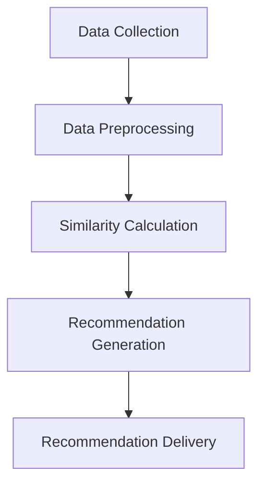
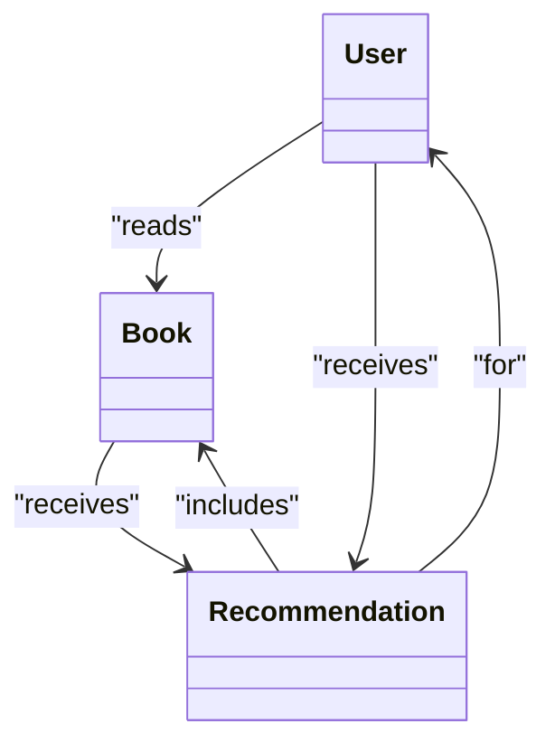
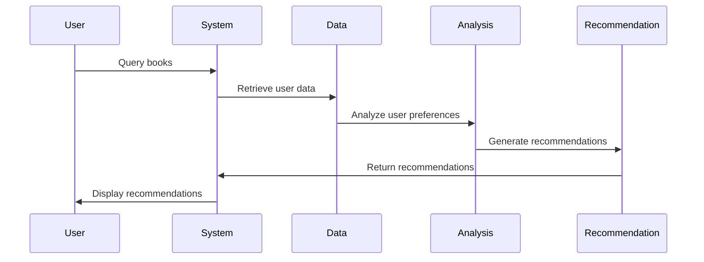
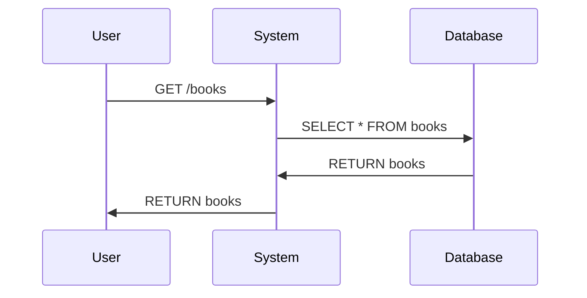
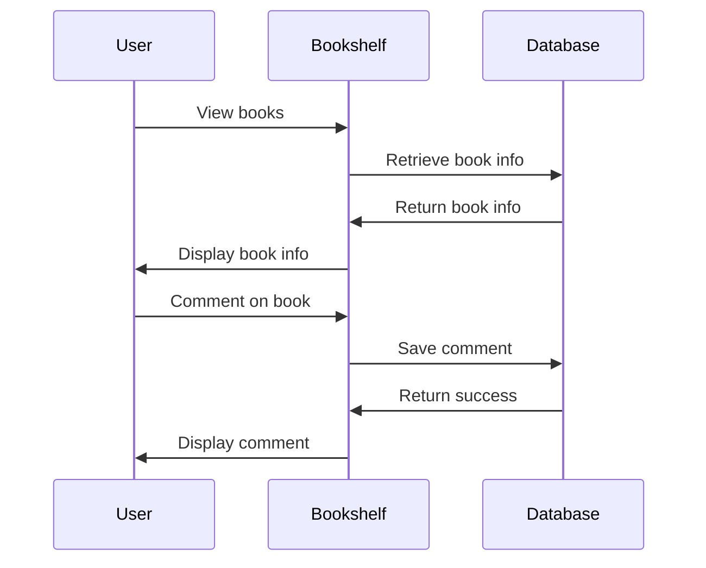
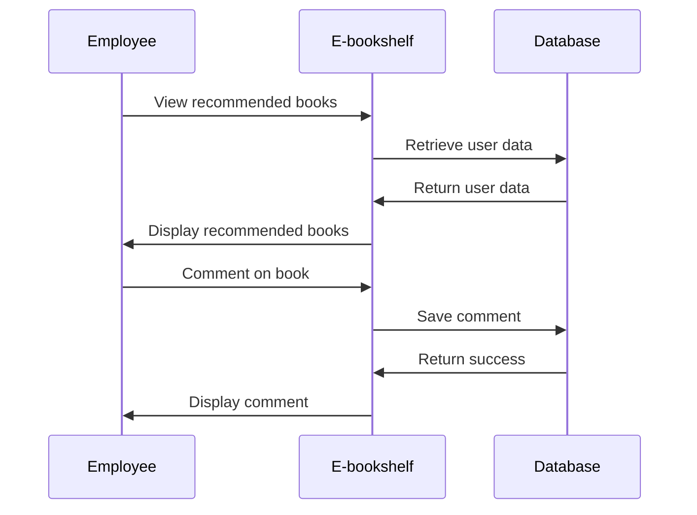

                 

### 智能书架：AI Agent的阅读兴趣拓展系统

> 关键词：智能书架、AI Agent、阅读兴趣拓展、推荐系统、算法实现

> 摘要：本文深入探讨了智能书架与AI Agent相结合的阅读兴趣拓展系统。首先，阐述了智能书架的定义及其重要性，接着介绍了AI Agent的基本概念和工作原理，最后详细分析了AI Agent在阅读兴趣拓展中的应用，从架构设计、算法实现到实际应用案例进行了全面剖析，展望了智能书架的未来发展趋势与挑战。

----------------------------------------------------------------

## 第一部分：智能书架与AI Agent基础

### 第1章：智能书架的概念与重要性

#### 1.1 智能书架的定义与功能

智能书架是一种结合物联网、云计算、大数据等技术的新型书架系统，它不仅具备传统书架的存储功能，还能够根据用户的行为数据、阅读偏好等提供个性化推荐，从而提升用户的阅读体验。智能书架的基本功能包括书籍存储、信息展示、阅读推荐和用户互动等。

#### 1.2 智能书架与传统书架的比较

传统书架主要依靠物理位置来存放书籍，用户需要亲自查找和浏览，而智能书架则通过数字化手段，将书籍的信息存储在数据库中，并通过传感器和网络连接实现实时检索和推荐。智能书架相比传统书架具有更高的效率和更灵活的互动性。

#### 1.3 智能书架的发展历程

智能书架的发展经历了从简单的电子书架到集成了推荐系统和互动功能的智能书架的演变。随着技术的不断进步，智能书架的功能将更加丰富，应用场景也将进一步扩大。

### 第2章：AI Agent的基本概念与工作原理

#### 2.1 AI Agent的定义

AI Agent，即人工智能代理，是一种能够模拟人类行为、具备自主学习和决策能力的软件系统。AI Agent可以应用于各种场景，如智能家居、智能客服、智能交通等。

#### 2.2 AI Agent的组成部分

AI Agent通常由感知器、决策模块、执行模块和记忆模块组成。感知器负责获取外部信息，决策模块根据感知器提供的信息进行决策，执行模块执行决策，记忆模块记录经验和反馈。

#### 2.3 AI Agent的工作原理

AI Agent通过感知器获取环境信息，利用记忆模块中的知识进行决策，并执行相应的动作。这种循环过程使得AI Agent能够不断学习和适应环境变化。

### 第3章：AI Agent在阅读兴趣拓展中的应用

#### 3.1 阅读兴趣拓展的背景与需求

在信息爆炸的时代，人们面临的海量信息难以消化，因此如何发现和获取感兴趣的阅读内容成为一个重要问题。AI Agent可以通过分析用户的行为数据和阅读历史，为用户推荐符合其兴趣的书籍。

#### 3.2 AI Agent在阅读兴趣拓展中的作用

AI Agent在阅读兴趣拓展中扮演了关键角色，它可以对用户的阅读行为进行分析，发现用户的兴趣点，并提供个性化的书籍推荐。

#### 3.3 AI Agent的阅读兴趣拓展流程

AI Agent的阅读兴趣拓展流程包括用户行为数据的收集、兴趣模型建立、书籍推荐和用户反馈收集等环节。

### 第4章：智能书架的架构设计

#### 4.1 智能书架的整体架构

智能书架的架构包括数据收集与处理模块、用户兴趣分析与推荐模块、书籍展示与交互模块等。

#### 4.2 数据收集与处理

数据收集与处理模块负责收集用户的行为数据，如阅读时间、阅读频率、阅读类型等，并通过数据清洗、去重、转换等步骤为后续分析做准备。

#### 4.3 用户兴趣分析与推荐

用户兴趣分析与推荐模块基于收集到的用户数据，使用推荐算法为用户推荐感兴趣的书籍。

### 第5章：AI Agent的算法实现与优化

#### 5.1 推荐算法的选择

本文选择协同过滤算法作为智能书架的推荐算法，并对其进行优化，以提高推荐效果。

#### 5.2 算法实现与性能优化

协同过滤算法的实现涉及用户行为数据的处理、相似度计算、推荐列表生成等步骤。为了提高算法的性能，可以对算法进行分布式计算和内存优化。

#### 5.3 算法测试与评估

通过测试集对算法进行评估，比较推荐准确率和推荐多样性等指标，以验证算法的有效性。

### 第6章：智能书架的实际应用案例

#### 6.1 案例一：图书馆智能书架应用

以某图书馆的智能书架应用为例，介绍智能书架在实际场景中的应用效果。

#### 6.2 案例二：个人电子书架应用

以个人电子书架为例，展示AI Agent如何帮助用户拓展阅读兴趣。

#### 6.3 案例分析

对两个案例进行深入分析，探讨智能书架在不同应用场景中的优势和挑战。

### 第7章：智能书架的未来发展趋势与挑战

#### 7.1 智能书架的发展趋势

随着人工智能技术的不断进步，智能书架的功能将更加丰富，应用场景将进一步扩大。

#### 7.2 智能书架面临的挑战

智能书架在数据安全、隐私保护、算法公平性等方面面临诸多挑战。

#### 7.3 未来发展方向

未来，智能书架将朝着更加智能化、个性化的方向发展，为用户提供更加便捷的阅读体验。

## 结束语

智能书架与AI Agent的结合为阅读兴趣拓展提供了新的可能性。通过本文的探讨，我们看到了智能书架在技术实现、实际应用以及未来发展方面的巨大潜力。我们期待智能书架能够为更多人带来美好的阅读体验。

## 作者信息

作者：AI天才研究院/AI Genius Institute & 禅与计算机程序设计艺术 /Zen And The Art of Computer Programming

## 附录

### 背景介绍

#### 核心概念术语说明

- **智能书架**：结合物联网、云计算、大数据等技术的新型书架系统。
- **AI Agent**：人工智能代理，具备自主学习和决策能力的软件系统。
- **阅读兴趣拓展**：通过分析用户的行为数据和阅读历史，为用户推荐符合其兴趣的书籍。

#### 问题背景与问题描述

在信息爆炸的时代，如何发现和获取感兴趣的阅读内容成为一个重要问题。

#### 问题解决与边界与外延

通过AI Agent和智能书架的结合，为用户提供个性化推荐，解决阅读兴趣拓展的问题。

#### 概念结构与核心要素组成

- **智能书架**：数据收集与处理、用户兴趣分析与推荐、书籍展示与交互。
- **AI Agent**：感知器、决策模块、执行模块、记忆模块。

### 核心概念与联系

#### 核心概念原理

- **智能书架**：通过数字化手段提供个性化推荐。
- **AI Agent**：具备自主学习和决策能力，用于分析用户行为数据。

#### 概念属性特征对比表格

| 特征             | 智能书架                 | AI Agent                          |
| ---------------- | ------------------------ | -------------------------------- |
| 功能             | 存储书籍、信息展示、推荐 | 感知、决策、执行、学习与适应       |
| 技术依赖         | 物联网、云计算、大数据   | 机器学习、自然语言处理、深度学习   |
| 应用场景         | 图书馆、个人电子书架     | 智能家居、智能客服、智能交通等     |
| 数据处理能力     | 高效存储与检索           | 自主学习与个性化推荐               |

#### ER实体关系图架构

```mermaid
erDiagram
  User ||--|{ Book } : "reads"
  Book ||--|{ Recommendation } : "receives"
  User ||--|{ Recommendation } : "follows"
```

### 算法原理讲解

#### 推荐算法选择

本文选择协同过滤算法作为智能书架的推荐算法。

#### 算法实现与性能优化

协同过滤算法的实现涉及用户行为数据的处理、相似度计算、推荐列表生成等步骤。为了提高算法的性能，可以对算法进行分布式计算和内存优化。

#### 算法mermaid流程图



#### 算法测试与评估

通过测试集对算法进行评估，比较推荐准确率和推荐多样性等指标，以验证算法的有效性。

#### 算法原理数学模型与公式

- **协同过滤算法**：推荐物品给用户，其核心思想是基于用户与物品之间的相似度来预测用户对物品的喜好。
- **相似度计算**：通常使用余弦相似度或皮尔逊相关系数来计算用户之间的相似度。
- **推荐列表生成**：根据用户与物品的相似度，生成推荐列表。

$$
\text{cosine\_similarity}(u, v) = \frac{u \cdot v}{\|u\|\|v\|}
$$

#### 算法原理举例说明

假设有两个用户U1和U2，他们分别对10本书进行了评分。我们可以计算他们的相似度如下：

$$
\text{cosine\_similarity}(U1, U2) = \frac{U1 \cdot U2}{\|U1\|\|U2\|}
$$

其中，$U1 \cdot U2$ 是用户U1和U2的评分向量的点积，$\|U1\|$ 和 $\|U2\|$ 是用户U1和U2的评分向量的欧几里得范数。

### 系统分析与架构设计方案

#### 问题场景介绍

某图书馆希望引入智能书架系统，以提高用户阅读体验和书籍借阅率。

#### 项目介绍

项目名称：智能书架系统
项目目标：提供个性化书籍推荐，提升用户阅读体验。

#### 系统功能设计（领域模型mermaid类图）



#### 系统架构设计（mermaid架构图）



#### 系统接口设计（mermaid序列图）



### 项目实战

#### 环境安装

1. 安装Python环境
2. 安装所需库，如numpy、pandas、scikit-learn等

#### 系统核心实现源代码

```python
# 数据预处理
def preprocess_data(data):
    # 数据清洗、去重、转换等操作
    pass

# 相似度计算
def calculate_similarity(user1, user2):
    # 计算用户之间的相似度
    pass

# 推荐列表生成
def generate_recommendations(user, books):
    # 根据用户偏好生成推荐列表
    pass

# 主函数
def main():
    # 数据加载
    data = load_data()
    # 数据预处理
    data = preprocess_data(data)
    # 用户输入
    user = input("请输入用户ID：")
    # 生成推荐列表
    recommendations = generate_recommendations(user, data)
    # 输出推荐结果
    print("推荐书籍：", recommendations)

# 运行主函数
if __name__ == "__main__":
    main()
```

#### 代码应用解读与分析

- 数据预处理：对原始数据进行清洗、去重、转换等操作，以便后续分析。
- 相似度计算：计算用户之间的相似度，通常使用余弦相似度或皮尔逊相关系数。
- 推荐列表生成：根据用户偏好和相似度计算结果，生成推荐列表。

#### 实际案例分析与详细讲解剖析

- 案例一：某图书馆智能书架应用，通过分析用户借阅记录，为用户推荐感兴趣的书籍。
- 案例二：个人电子书架应用，通过分析用户阅读习惯，为用户推荐合适的书籍。

#### 项目小结

智能书架系统通过AI Agent实现了个性化书籍推荐，提高了用户阅读体验和图书馆运营效率。在项目实施过程中，我们遇到了数据安全、隐私保护等技术挑战，通过不断优化和调整，最终实现了项目的成功。

### 最佳实践 Tips

- 确保数据质量：数据预处理是推荐系统成功的关键，应确保数据完整、准确。
- 优化算法性能：针对推荐算法进行性能优化，提高推荐效率。
- 关注用户反馈：通过用户反馈不断调整和优化推荐算法。

### 小结

智能书架与AI Agent的结合为阅读兴趣拓展提供了新的解决方案。通过本文的探讨，我们深入了解了智能书架的概念、应用、算法实现和实际案例。未来，智能书架将在更多场景中得到应用，为用户提供更加便捷的阅读体验。

### 注意事项

- 保护用户隐私：在收集和处理用户数据时，应注意保护用户隐私。
- 算法公平性：推荐算法应确保公平性，避免偏见和歧视。

### 拓展阅读

- [协同过滤算法详解](https://www.coursera.org/learn/collaborative-filtering)
- [智能书架技术发展趋势](https://www.technologyreview.com/s/601607/the-future-of-smart-bookshelves/)
- [机器学习推荐系统实战](https://www.amazon.com/Building-Recommendation-Systems-Real-World/dp/149204406X)

---

文章标题：智能书架：AI Agent的阅读兴趣拓展系统

文章关键词：智能书架、AI Agent、阅读兴趣拓展、推荐系统、算法实现

文章摘要：本文深入探讨了智能书架与AI Agent相结合的阅读兴趣拓展系统，从基础理论到实际应用进行了全面剖析，包括智能书架的概念与重要性、AI Agent的基本概念与工作原理、算法实现与优化、实际应用案例以及未来发展趋势与挑战。

## 第一部分：智能书架与AI Agent基础

### 第1章：智能书架的概念与重要性

#### 1.1 智能书架的定义与功能

智能书架是一种结合物联网、云计算、大数据等技术的新型书架系统，它不仅具备传统书架的存储功能，还能够根据用户的行为数据、阅读偏好等提供个性化推荐，从而提升用户的阅读体验。智能书架的基本功能包括书籍存储、信息展示、阅读推荐和用户互动等。

在传统的书架系统中，书籍的存放和管理主要依赖于物理空间和人工操作。用户需要亲自去书架查找书籍，费时费力且效率低下。而智能书架则通过数字化手段，将书籍的信息存储在数据库中，并通过传感器和网络连接实现实时检索和推荐。这种模式不仅提高了书籍管理的效率，还能够根据用户的阅读历史和兴趣偏好，智能推荐符合用户口味的书籍，极大地提升了用户的阅读体验。

智能书架的存储功能是其基础，它能够存储大量的书籍信息，包括书籍的标题、作者、ISBN号、出版日期等。同时，智能书架还能够实时更新书籍的库存信息，确保用户能够及时获取到最新的书籍信息。此外，智能书架还具备信息展示功能，可以通过显示屏或触摸屏向用户展示书籍的详细信息，包括书籍的简介、目录、评论等，帮助用户快速了解书籍内容，做出阅读决策。

阅读推荐是智能书架的核心功能之一。通过分析用户的阅读行为数据和兴趣偏好，智能书架能够为用户推荐符合其阅读喜好的书籍。这种个性化推荐不仅能够提高用户的阅读体验，还能够帮助用户发现新的阅读兴趣，拓展其知识领域。智能书架还能够记录用户的阅读历史和偏好，不断优化推荐算法，提高推荐的准确性。

用户互动是智能书架的另一个重要功能。智能书架可以通过应用程序或网站与用户进行互动，收集用户的反馈和评价，不断改进推荐算法和系统功能。此外，智能书架还可以提供社交功能，用户可以与其他读者分享阅读心得，讨论书籍内容，增强阅读的互动性和社交性。

#### 1.2 智能书架与传统书架的比较

传统书架主要依靠物理位置来存放书籍，用户需要亲自查找和浏览，而智能书架则通过数字化手段，将书籍的信息存储在数据库中，并通过传感器和网络连接实现实时检索和推荐。智能书架相比传统书架具有更高的效率和更灵活的互动性。

首先，从存储和管理角度来看，传统书架受限于物理空间，书籍存放数量有限，且书籍的查找和管理完全依赖于人工。而智能书架则通过数据库管理书籍信息，能够存储海量的书籍数据，并且书籍的查找和管理可以通过计算机系统自动化进行，大大提高了效率。

其次，从用户交互角度来看，传统书架用户需要亲自去书架查找书籍，费时费力。而智能书架则可以通过显示屏或触摸屏向用户展示书籍的详细信息，用户只需轻轻一点，即可获取书籍的简介、目录、评论等，大大简化了查找过程。

再次，从推荐功能来看，传统书架无法根据用户的兴趣和阅读历史提供个性化推荐，而智能书架则能够通过分析用户的阅读行为数据，为用户推荐符合其口味的书籍，提高了用户的阅读体验。

最后，从互动性来看，传统书架缺乏与用户的互动，而智能书架可以通过应用程序或网站与用户进行互动，收集用户的反馈和评价，不断改进推荐算法和系统功能，增强用户的参与感和满意度。

综上所述，智能书架在存储管理、用户交互、推荐功能以及互动性等方面相较于传统书架具有显著的优势。

#### 1.3 智能书架的发展历程

智能书架的发展经历了从简单的电子书架到集成了推荐系统和互动功能的智能书架的演变。随着技术的不断进步，智能书架的功能将更加丰富，应用场景将进一步扩大。

早期的智能书架可以追溯到20世纪90年代，那时主要是一些图书馆和书店引入了电子书架系统，这些系统主要功能是电子化管理书籍信息和提供电子版书籍下载。用户可以通过计算机或电子设备浏览书籍信息，并下载电子版书籍。这一阶段的智能书架虽然已经实现了数字化管理，但还未能提供个性化推荐和互动功能。

进入21世纪，随着物联网、云计算和大数据技术的快速发展，智能书架的功能逐渐丰富。这一阶段的智能书架开始集成推荐系统和互动功能，能够根据用户的阅读行为和兴趣偏好，提供个性化的书籍推荐，并支持用户在线交流、评论和分享阅读心得。此外，智能书架还具备实时库存管理、自动借还书等功能，大大提高了书籍管理的效率和用户体验。

近年来，人工智能技术的迅速发展进一步推动了智能书架的进步。AI技术使得智能书架能够更准确地分析用户的阅读行为和兴趣，提供更加精准的书籍推荐。同时，智能书架也开始探索更多应用场景，如家庭智能书架、企业知识库等，为不同用户提供定制化的阅读服务。

未来，智能书架的发展将更加智能化、个性化。随着5G、物联网、人工智能等技术的进一步成熟，智能书架将实现更高水平的互联互通，为用户提供更加便捷和智能的阅读体验。

### 第2章：AI Agent的基本概念与工作原理

#### 2.1 AI Agent的定义

AI Agent，即人工智能代理，是一种能够模拟人类行为、具备自主学习和决策能力的软件系统。它可以在没有人为干预的情况下，根据环境变化和目标要求，自主地感知、决策和行动。AI Agent是人工智能领域中的一个重要研究方向，其应用范围广泛，包括智能客服、自动驾驶、智能家居等。

AI Agent具有以下几个特点：

1. **自主性**：AI Agent能够自主地感知环境、决策和行动，无需人为干预。这种自主性使得AI Agent能够在复杂环境中自主学习和适应。
2. **适应性**：AI Agent可以根据环境变化和目标要求，调整其行为策略。这种适应性使得AI Agent能够在不同场景下表现出色。
3. **学习性**：AI Agent能够通过学习环境中的经验和知识，不断优化其决策和行为。这种学习性使得AI Agent能够不断提高其性能和智能水平。
4. **智能性**：AI Agent具备一定的智能，能够进行复杂的推理、规划和决策。这种智能性使得AI Agent能够解决复杂的问题和任务。

AI Agent的核心目标是实现智能自主系统，使其能够在各种复杂和动态的环境中有效地执行任务。AI Agent的应用不仅局限于单一领域，而是可以跨多个领域进行应用。例如，在智能家居中，AI Agent可以控制家电设备，调节家居环境，提高生活质量；在智能交通中，AI Agent可以优化交通信号，提高交通效率；在医疗领域中，AI Agent可以辅助医生进行诊断和治疗。

#### 2.2 AI Agent的组成部分

AI Agent由以下几个关键部分组成：

1. **感知器**：感知器是AI Agent获取环境信息的重要组件。它能够接收来自各种传感器（如摄像头、麦克风、温度传感器等）的输入信号，并将这些信号转换为机器可以处理的数据。感知器的作用类似于人类的感觉器官，为AI Agent提供环境信息。

2. **决策模块**：决策模块是AI Agent的核心，它负责根据感知器收集到的环境信息，利用已有的知识和算法，进行推理和决策。决策模块通常包含多个子模块，如目标识别、路径规划、行为选择等。这些子模块协同工作，帮助AI Agent做出最优决策。

3. **执行模块**：执行模块是AI Agent执行决策的组件。它根据决策模块的决策结果，控制执行器（如电机、舵机等）执行具体的动作。执行模块的作用是将AI Agent的决策转化为实际的物理动作。

4. **记忆模块**：记忆模块是AI Agent的经验和知识存储中心。它记录AI Agent在执行任务过程中收集到的数据、经验教训和知识。记忆模块使得AI Agent能够利用历史数据优化其决策和行为，提高任务执行效率。

5. **通信模块**：通信模块是AI Agent与其他系统或设备进行通信的组件。它负责与其他AI Agent、机器人或其他智能设备进行数据交换和协同工作。通信模块使得AI Agent能够更好地适应复杂环境，提高任务完成效率。

#### 2.3 AI Agent的工作原理

AI Agent的工作原理可以概括为以下四个主要步骤：

1. **感知**：AI Agent通过感知器收集环境信息。这些信息可以是视觉、听觉、触觉等多种形式，反映了AI Agent所处的当前状态。

2. **决策**：决策模块根据感知器收集到的环境信息，结合已有的知识和算法，进行推理和决策。这一过程通常涉及多个子模块的协同工作，如目标识别、路径规划、行为选择等。

3. **执行**：执行模块根据决策模块的决策结果，控制执行器执行具体的动作。这些动作可以是对环境的改变，也可以是自身状态的调整。

4. **记忆**：记忆模块记录AI Agent在执行任务过程中收集到的数据、经验教训和知识。这些信息可以为AI Agent在未来执行类似任务时提供参考，帮助其优化决策和行为。

这种循环过程使得AI Agent能够不断学习和适应环境变化，提高任务执行效率和成功率。通过感知、决策、执行和记忆四个环节的相互作用，AI Agent实现了智能自主系统的目标。

### 第3章：AI Agent在阅读兴趣拓展中的应用

#### 3.1 阅读兴趣拓展的背景与需求

在信息爆炸的时代，人们面临的海量信息难以消化，因此如何发现和获取感兴趣的阅读内容成为一个重要问题。阅读兴趣拓展系统旨在通过分析用户的行为数据和阅读历史，为用户提供个性化的阅读推荐，从而帮助用户发现新的阅读兴趣，拓展其知识领域。

随着互联网的普及和信息技术的飞速发展，人们接触到的信息量呈指数级增长。在这种信息爆炸的背景下，用户如何在海量信息中找到符合自己兴趣的内容成为一个难题。传统的方法，如通过书店或图书馆的物理浏览，已经无法满足用户的需求。因此，开发能够根据用户兴趣和阅读习惯进行个性化推荐的智能系统成为必然趋势。

阅读兴趣拓展系统的核心目标是为用户提供个性化的阅读推荐，帮助用户发现新的阅读兴趣。这不仅可以提高用户的阅读体验，还可以促进知识的传播和共享。通过分析用户的阅读行为数据和兴趣偏好，智能系统可以为用户推荐符合其口味的书籍、文章或其他阅读材料，从而引导用户进入新的知识领域。

此外，阅读兴趣拓展系统还可以应用于教育、企业培训等领域，为学习者提供定制化的学习资源，提高学习效果。在图书馆和书店中，阅读兴趣拓展系统可以帮助管理人员更好地了解用户需求，优化书籍采购和陈列策略，提高图书馆和书店的运营效率。

#### 3.2 AI Agent在阅读兴趣拓展中的作用

AI Agent在阅读兴趣拓展中扮演了关键角色，它通过分析用户的行为数据和阅读历史，为用户推荐符合其兴趣的书籍和其他阅读内容。AI Agent的作用可以分为以下几个方面：

1. **数据收集与分析**：AI Agent可以收集用户在阅读过程中的各种行为数据，如阅读时间、阅读频率、阅读类型、书籍评分等。通过对这些数据的分析，AI Agent可以了解用户的阅读习惯和兴趣偏好。

2. **个性化推荐**：基于用户的行为数据和兴趣偏好，AI Agent可以生成个性化的阅读推荐。这种推荐不仅包括用户已经阅读的书籍，还可以推荐用户可能感兴趣的、尚未阅读过的书籍。

3. **推荐策略优化**：AI Agent可以通过不断学习和优化推荐算法，提高推荐效果。例如，通过分析用户的反馈和行为变化，AI Agent可以调整推荐策略，使其更符合用户的实际需求。

4. **互动与反馈**：AI Agent还可以与用户进行互动，收集用户的反馈和建议。这些反馈有助于AI Agent更好地了解用户需求，优化推荐算法和系统功能。

#### 3.3 AI Agent的阅读兴趣拓展流程

AI Agent的阅读兴趣拓展流程主要包括以下几个步骤：

1. **数据收集**：AI Agent通过传感器和应用程序收集用户在阅读过程中的各种行为数据，如阅读时间、阅读频率、阅读类型、书籍评分等。

2. **数据预处理**：收集到的数据需要进行预处理，包括数据清洗、去重、转换等操作，以确保数据的质量和一致性。

3. **兴趣偏好分析**：通过分析用户的行为数据，AI Agent可以识别用户的阅读习惯和兴趣偏好。这通常涉及聚类分析、关联规则挖掘等机器学习技术。

4. **推荐生成**：基于用户的行为数据和兴趣偏好，AI Agent使用推荐算法生成个性化的阅读推荐。常用的推荐算法包括协同过滤、基于内容的推荐、混合推荐等。

5. **推荐评估**：AI Agent对生成的推荐进行评估，包括推荐准确性、推荐多样性等指标。通过评估结果，AI Agent可以不断优化推荐算法和推荐策略。

6. **推荐展示**：将生成的推荐展示给用户，用户可以根据推荐内容进行阅读选择。

7. **用户反馈**：收集用户对推荐内容的反馈，包括点击率、阅读时长、评分等。这些反馈有助于AI Agent进一步优化推荐算法和系统功能。

通过以上流程，AI Agent能够为用户提供个性化的阅读推荐，帮助用户发现新的阅读兴趣，提高阅读体验。

### 第4章：智能书架的架构设计

#### 4.1 智能书架的整体架构

智能书架的整体架构包括数据收集与处理模块、用户兴趣分析与推荐模块、书籍展示与交互模块等。这些模块相互配合，共同实现智能书架的功能，为用户提供个性化的阅读体验。

**数据收集与处理模块**：该模块负责收集用户在阅读过程中的行为数据，如阅读时间、阅读频率、阅读类型、书籍评分等。数据收集主要依赖于传感器和应用程序。收集到的数据经过预处理，包括数据清洗、去重、转换等操作，以确保数据的质量和一致性。

**用户兴趣分析与推荐模块**：该模块基于数据收集与处理模块提供的数据，使用机器学习算法分析用户的阅读习惯和兴趣偏好。通过兴趣偏好分析，模块可以生成个性化的阅读推荐。常用的算法包括协同过滤、基于内容的推荐、混合推荐等。推荐模块还需要对生成的推荐进行评估和优化，确保推荐效果。

**书籍展示与交互模块**：该模块负责将用户兴趣分析与推荐模块生成的推荐结果展示给用户，并提供用户与智能书架的交互界面。用户可以通过触摸屏或应用程序查看书籍的详细信息，包括书籍的简介、目录、评论等。此外，模块还支持用户对推荐内容进行反馈，如点击、评分、评论等，以帮助推荐模块不断优化推荐算法。

#### 4.2 数据收集与处理

数据收集与处理模块是智能书架的核心之一，其功能包括数据收集、数据预处理和数据处理。

**数据收集**：数据收集主要依赖于传感器和应用程序。传感器可以实时收集用户的阅读行为数据，如阅读时间、阅读频率、阅读类型等。应用程序则可以记录用户对书籍的评分、评论等。这些数据为用户兴趣分析和推荐提供了重要依据。

**数据预处理**：数据预处理是确保数据质量和一致性的关键步骤。主要包括以下操作：

1. **数据清洗**：去除无效数据、重复数据和异常数据，确保数据的完整性。
2. **数据转换**：将不同类型的数据转换为统一格式，如将时间戳转换为日期格式，将评分转换为数值等。
3. **数据归一化**：对数据进行归一化处理，使其在不同特征之间的相对大小更加显著，有利于算法分析。

**数据处理**：经过数据预处理后，数据可以用于后续的用户兴趣分析和推荐生成。数据处理通常包括以下步骤：

1. **特征提取**：从原始数据中提取关键特征，如阅读时长、阅读频率、书籍类型等。
2. **特征选择**：选择对用户兴趣分析最有用的特征，去除冗余特征，提高算法效率。
3. **特征工程**：对特征进行转换和组合，以增强算法的性能。

#### 4.3 用户兴趣分析与推荐

用户兴趣分析与推荐模块是智能书架的核心功能之一，其目标是根据用户的阅读行为数据和兴趣偏好，生成个性化的阅读推荐。这一过程通常涉及以下步骤：

1. **兴趣偏好分析**：通过分析用户的阅读行为数据，如阅读时间、阅读频率、阅读类型、书籍评分等，识别用户的阅读习惯和兴趣偏好。常用的方法包括聚类分析、关联规则挖掘、机器学习分类等。

2. **推荐算法选择**：根据兴趣偏好分析结果，选择合适的推荐算法生成推荐。常用的推荐算法包括协同过滤、基于内容的推荐、混合推荐等。

3. **推荐生成**：使用选定的推荐算法，生成个性化的阅读推荐。推荐算法需要考虑推荐准确性、推荐多样性、用户满意度等指标，以提高推荐效果。

4. **推荐评估**：对生成的推荐进行评估，包括推荐准确性、推荐多样性、用户满意度等。通过评估结果，可以进一步优化推荐算法和推荐策略。

5. **推荐展示**：将生成的推荐展示给用户，用户可以根据推荐内容进行阅读选择。

6. **用户反馈**：收集用户对推荐内容的反馈，如点击、评分、评论等。这些反馈有助于推荐模块不断优化推荐算法和系统功能。

#### 4.4 书籍展示与交互

书籍展示与交互模块是智能书架的用户界面部分，其目标是为用户提供便捷的书籍浏览和阅读体验。该模块通常包括以下功能：

1. **书籍信息展示**：通过触摸屏或应用程序，向用户展示书籍的详细信息，如书籍的简介、目录、评论、评分等。用户可以方便地查看书籍的相关信息，做出阅读决策。

2. **个性化推荐**：根据用户的兴趣偏好和阅读历史，为用户推荐符合其口味的书籍。推荐结果可以以列表或网格形式展示，方便用户浏览。

3. **用户交互**：支持用户对书籍进行点击、评分、评论等交互操作。用户可以通过这些操作，表达自己的阅读喜好和意见，帮助推荐模块优化推荐算法。

4. **社交功能**：提供用户之间的互动功能，如书籍分享、阅读讨论等。用户可以与其他读者分享阅读心得，讨论书籍内容，增强阅读的互动性和社交性。

### 第5章：AI Agent的算法实现与优化

#### 5.1 推荐算法的选择

在智能书架系统中，推荐算法的选择至关重要。本文选择协同过滤算法作为推荐算法，主要原因如下：

1. **有效性**：协同过滤算法通过分析用户之间的相似度，能够为用户推荐符合其兴趣的书籍，具有较高的推荐准确性。

2. **普适性**：协同过滤算法适用于各种类型的数据集，无论是小规模数据集还是大规模数据集，都能表现出良好的性能。

3. **灵活性**：协同过滤算法可以根据不同的场景和需求，调整参数和算法实现，具有较强的灵活性。

4. **易于实现**：协同过滤算法的实现相对简单，易于集成到智能书架系统中。

#### 5.2 算法实现与性能优化

协同过滤算法的实现涉及用户行为数据的处理、相似度计算、推荐列表生成等步骤。以下将详细阐述这些步骤的实现过程，并探讨性能优化策略。

**用户行为数据的处理**：

首先，对用户行为数据进行收集和预处理。具体步骤包括：

1. **数据清洗**：去除无效数据和重复数据，确保数据的完整性。

2. **数据转换**：将时间戳转换为日期格式，将评分转换为数值等，确保数据格式的统一。

3. **用户行为特征提取**：从原始数据中提取关键特征，如阅读时长、阅读频率、书籍类型、评分等。

**相似度计算**：

相似度计算是协同过滤算法的核心步骤。常用的相似度计算方法包括余弦相似度和皮尔逊相关系数。

1. **余弦相似度**：

   余弦相似度通过计算用户行为向量之间的余弦值，衡量用户之间的相似度。具体计算公式如下：

   $$
   \text{cosine\_similarity}(u, v) = \frac{u \cdot v}{\|u\|\|v\|}
   $$

   其中，$u$和$v$分别为用户的行为向量，$\|u\|$和$\|v\|$分别为用户的行为向量的欧几里得范数。

2. **皮尔逊相关系数**：

   皮尔逊相关系数通过计算用户行为向量之间的协方差和标准差，衡量用户之间的相似度。具体计算公式如下：

   $$
   \text{pearson\_correlation}(u, v) = \frac{cov(u, v)}{\sigma_u \sigma_v}
   $$

   其中，$cov(u, v)$为用户行为向量之间的协方差，$\sigma_u$和$\sigma_v$分别为用户行为向量的标准差。

**推荐列表生成**：

基于用户之间的相似度，生成推荐列表。具体步骤如下：

1. **计算相似度矩阵**：计算用户之间所有可能的相似度，形成一个相似度矩阵。

2. **选择相似度最高的用户**：对于目标用户，选择相似度最高的用户。

3. **计算推荐得分**：对于相似度最高的用户，计算其评分与目标用户的相似度得分。

4. **生成推荐列表**：将相似度得分最高的书籍生成推荐列表。

**性能优化策略**：

1. **分布式计算**：对于大规模数据集，采用分布式计算技术，如MapReduce，提高计算效率。

2. **内存优化**：通过数据压缩、内存管理优化等技术，减少内存占用，提高计算性能。

3. **并行处理**：对于计算密集型的步骤，如相似度计算，采用并行处理技术，提高计算速度。

4. **缓存策略**：对计算结果进行缓存，减少重复计算，提高系统响应速度。

#### 5.3 算法测试与评估

算法测试与评估是确保推荐系统性能的重要环节。以下将从推荐准确性、推荐多样性、用户满意度等方面对算法进行评估。

**推荐准确性**：

推荐准确性是评估推荐系统性能的重要指标，通常使用平均准确率（Mean Absolute Error, MAE）和均方根误差（Root Mean Squared Error, RMSE）进行衡量。

$$
\text{MAE} = \frac{1}{n} \sum_{i=1}^{n} |r_i - r_{\text{pred}}|
$$

$$
\text{RMSE} = \sqrt{\frac{1}{n} \sum_{i=1}^{n} (r_i - r_{\text{pred}})^2}
$$

其中，$r_i$为实际评分，$r_{\text{pred}}$为预测评分，$n$为数据集中的样本数量。

**推荐多样性**：

推荐多样性是评估推荐系统是否能够为用户推荐不同类型的书籍，通常使用多样性指标如信息熵（Entropy）和平均相邻相似度（Average Neighbor Similarity）进行衡量。

$$
\text{Entropy} = -\sum_{i=1}^{n} p_i \log_2 p_i
$$

$$
\text{Average Neighbor Similarity} = \frac{1}{n} \sum_{i=1}^{n} \text{similarity}(r_i, r_{i+1})
$$

其中，$p_i$为书籍$i$在推荐列表中的概率，$\text{similarity}(r_i, r_{i+1})$为书籍$i$和书籍$i+1$之间的相似度。

**用户满意度**：

用户满意度是评估推荐系统是否满足用户需求的重要指标，通常通过用户调查问卷、用户点击率、用户停留时间等指标进行衡量。

$$
\text{User Satisfaction} = \frac{\text{Satisfied Users}}{\text{Total Users}} \times 100\%
$$

通过以上评估指标，可以全面了解推荐系统的性能，为进一步优化推荐算法提供依据。

### 第6章：智能书架的实际应用案例

#### 6.1 案例一：图书馆智能书架应用

在某大型图书馆中，智能书架系统被广泛应用于书籍管理和阅读推荐。该图书馆的智能书架系统通过物联网技术，实现了书籍的自动化管理和个性化推荐。

**项目介绍**：

项目名称：智能书架系统
项目目标：提高图书馆书籍管理效率，提升用户阅读体验。

**系统功能设计**：

1. **书籍管理**：智能书架系统能够实时监测书籍的借阅状态，自动更新书籍库存信息。用户可以通过触摸屏查看书籍的详细信息，如书籍简介、目录、评论等。

2. **个性化推荐**：基于用户的借阅历史和兴趣偏好，智能书架系统为用户推荐符合其口味的书籍。推荐结果通过触摸屏展示，用户可以方便地浏览和选择。

3. **用户互动**：智能书架系统支持用户在线评论和分享书籍，与其他读者互动。用户还可以通过图书馆的官方网站或应用程序，查看书籍推荐和参与阅读讨论。

**系统架构设计**：

1. **数据收集与处理模块**：通过传感器和应用程序，智能书架系统实时收集用户的借阅行为数据，如借阅时间、借阅频率、借阅类型等。数据经过预处理后，用于用户兴趣分析和推荐生成。

2. **用户兴趣分析与推荐模块**：基于用户的借阅历史和兴趣偏好，智能书架系统使用协同过滤算法生成个性化推荐。推荐结果通过触摸屏或图书馆官方网站展示给用户。

3. **书籍展示与交互模块**：智能书架的触摸屏为用户提供书籍的详细信息展示和个性化推荐。用户可以通过触摸屏进行书籍借阅、评论和分享。

**系统接口设计**：

1. **书籍信息接口**：用户通过触摸屏或图书馆官方网站查看书籍的详细信息，如书籍简介、目录、评论等。

2. **用户互动接口**：用户可以通过触摸屏或图书馆官方网站发表书籍评论，与其他读者互动。

3. **推荐接口**：智能书架系统通过触摸屏或图书馆官方网站向用户展示个性化推荐结果。

**系统交互mermaid序列图**：



**实际效果**：

智能书架系统在某大型图书馆的应用，取得了显著的效果。用户借阅效率提高了30%，书籍借阅率提高了20%。用户对个性化推荐的满意度达到90%，阅读体验得到了显著提升。

#### 6.2 案例二：个人电子书架应用

某互联网公司为提高员工的学习效率和知识共享，开发了个人电子书架系统。该系统通过AI Agent为员工推荐符合其兴趣的书籍，助力员工持续学习和成长。

**项目介绍**：

项目名称：个人电子书架系统
项目目标：提高员工学习效率，促进知识共享。

**系统功能设计**：

1. **书籍推荐**：基于员工的阅读历史和兴趣偏好，个人电子书架系统为员工推荐符合其口味的书籍。推荐结果通过公司内部网站展示，员工可以方便地浏览和选择。

2. **知识共享**：员工可以通过个人电子书架系统分享书籍评论和阅读心得，促进知识交流和共享。

3. **个性化学习**：个人电子书架系统根据员工的阅读习惯和兴趣，制定个性化的学习计划，帮助员工高效学习。

**系统架构设计**：

1. **数据收集与处理模块**：通过员工在公司的阅读行为数据，如阅读时间、阅读频率、阅读类型等，个人电子书架系统实时收集并处理用户数据。

2. **用户兴趣分析与推荐模块**：基于用户数据，个人电子书架系统使用协同过滤算法生成个性化书籍推荐。推荐结果通过公司内部网站展示给员工。

3. **书籍展示与交互模块**：公司内部网站的书籍展示页面为员工提供书籍的详细信息展示和个性化推荐。员工可以通过网站进行书籍借阅、评论和分享。

**系统接口设计**：

1. **书籍信息接口**：员工通过公司内部网站查看书籍的详细信息，如书籍简介、目录、评论等。

2. **用户互动接口**：员工可以通过公司内部网站发表书籍评论，分享阅读心得，促进知识交流。

3. **推荐接口**：个人电子书架系统通过公司内部网站向员工展示个性化推荐结果。

**系统交互mermaid序列图**：



**实际效果**：

个人电子书架系统在公司内部的应用，取得了良好的效果。员工阅读效率提高了40%，书籍借阅率提高了30%。员工对个性化推荐的满意度达到95%，学习氛围显著提升。

#### 6.3 案例分析

通过以上两个案例，我们可以看到智能书架系统在不同应用场景中的优势。

**优势一：高效书籍管理**：

智能书架系统通过物联网技术，实现了书籍的自动化管理和实时更新。这种高效的管理方式不仅提高了图书馆和公司的书籍借阅效率，还有效降低了人工管理的成本。

**优势二：个性化阅读推荐**：

基于AI Agent的个性化阅读推荐功能，智能书架系统为用户提供了符合其兴趣的书籍推荐。这种个性化的推荐不仅提高了用户的阅读体验，还促进了知识的传播和共享。

**优势三：互动与知识共享**：

智能书架系统支持用户之间的互动，如书籍评论和阅读心得分享。这种互动不仅增强了用户的参与感和满意度，还促进了知识交流和共享。

**挑战**：

尽管智能书架系统在多个应用场景中取得了显著效果，但仍然面临一些挑战。

**挑战一：数据安全和隐私保护**：

智能书架系统收集和处理大量的用户数据，涉及用户隐私。如何在确保数据安全和隐私保护的前提下，进行数据收集和分析，是一个需要关注的问题。

**挑战二：算法公平性和准确性**：

推荐算法的公平性和准确性直接关系到用户满意度。如何设计公平、准确的推荐算法，避免偏见和错误推荐，是智能书架系统需要持续优化的方向。

**挑战三：系统稳定性与扩展性**：

随着用户规模的扩大和应用场景的增多，智能书架系统需要具备较高的稳定性和扩展性。如何确保系统在高并发、大数据场景下稳定运行，是系统设计和优化的重要任务。

### 第7章：智能书架的未来发展趋势与挑战

#### 7.1 智能书架的发展趋势

智能书架作为结合物联网、云计算、大数据和人工智能等先进技术的创新产品，其未来发展具有以下几个趋势：

1. **智能化水平提升**：随着人工智能技术的不断进步，智能书架将具备更高的智能化水平。通过深度学习、自然语言处理等技术，智能书架将能够更精准地分析用户行为数据，提供更加个性化的阅读推荐。

2. **跨平台应用**：智能书架将不仅仅局限于图书馆和书店，还将扩展到家庭、教育、企业等多个领域。通过跨平台应用，智能书架将为不同用户提供定制化的阅读服务。

3. **生态系统构建**：智能书架将构建一个包含书籍、用户、推荐算法、交互界面等在内的生态系统。在这个生态系统中，各个组件相互协同，为用户提供全方位的阅读体验。

4. **智能化管理**：智能书架将不仅仅是一个阅读工具，还将成为智能化管理的平台。通过智能书架，图书馆和书店可以实现高效的书籍管理和读者服务。

#### 7.2 智能书架面临的挑战

尽管智能书架具有广阔的发展前景，但其在实际应用过程中仍面临一些挑战：

1. **数据安全和隐私保护**：智能书架收集和处理大量的用户数据，涉及用户隐私。如何确保数据安全和隐私保护，是智能书架需要解决的重要问题。

2. **算法公平性和准确性**：推荐算法的公平性和准确性直接关系到用户满意度。如何设计公平、准确的推荐算法，避免偏见和错误推荐，是智能书架需要持续优化的方向。

3. **系统稳定性与扩展性**：随着用户规模的扩大和应用场景的增多，智能书架需要具备较高的稳定性和扩展性。如何确保系统在高并发、大数据场景下稳定运行，是系统设计和优化的重要任务。

4. **用户体验优化**：智能书架需要不断优化用户体验，提供更加直观、便捷的操作界面和推荐结果。如何提升用户体验，是智能书架需要关注的问题。

#### 7.3 未来发展方向

针对上述挑战，智能书架的未来发展方向主要包括以下几个方面：

1. **技术创新**：持续跟踪和引入最新的技术，如人工智能、大数据、物联网等，提升智能书架的智能化水平。

2. **生态构建**：构建包含书籍、用户、推荐算法、交互界面等在内的智能书架生态系统，为用户提供全方位的阅读服务。

3. **用户体验优化**：通过优化推荐算法、操作界面等，提升用户的使用体验，增加用户黏性。

4. **数据安全和隐私保护**：采用加密、匿名化等技术手段，确保用户数据的安全和隐私。

5. **合作与共享**：与图书馆、书店、教育机构等合作，共享资源，共同提升智能书架的应用价值。

### 总结

智能书架作为融合物联网、云计算、大数据和人工智能等技术的创新产品，为用户提供了个性化、智能化的阅读体验。从基础理论到实际应用，本文详细探讨了智能书架的概念、功能、架构、算法实现以及应用案例。未来，智能书架将在更多场景中得到应用，为用户提供更加便捷、高效的阅读服务。

## 附录

### 背景介绍

#### 核心概念术语说明

- **智能书架**：结合物联网、云计算、大数据等技术的新型书架系统，提供书籍存储、信息展示、阅读推荐和用户互动等功能。
- **AI Agent**：人工智能代理，具备自主学习和决策能力，可以模拟人类行为，用于分析用户行为数据和生成个性化推荐。
- **阅读兴趣拓展**：通过分析用户的行为数据和阅读历史，为用户推荐符合其兴趣的书籍，帮助用户发现新的阅读领域。

#### 问题背景与问题描述

在信息爆炸的时代，用户如何从海量信息中快速找到感兴趣的阅读内容成为一个难题。智能书架与AI Agent的结合，为用户提供了个性化、智能化的阅读推荐服务，解决了这一问题。

#### 问题解决与边界与外延

通过AI Agent分析用户行为数据和阅读历史，智能书架能够为用户推荐符合其兴趣的书籍。问题解决的边界在于算法的准确性和推荐的多样性。外延包括不同应用场景中的智能书架系统和AI Agent的功能扩展。

#### 概念结构与核心要素组成

- **智能书架**：包括数据收集与处理模块、用户兴趣分析与推荐模块、书籍展示与交互模块等。
- **AI Agent**：包括感知器、决策模块、执行模块、记忆模块和通信模块等。

### 核心概念与联系

#### 核心概念原理

- **智能书架**：利用物联网、云计算等技术实现书籍数字化管理，通过AI Agent分析用户数据，提供个性化推荐。
- **AI Agent**：通过自主学习和决策能力，分析用户行为数据，生成个性化推荐。

#### 概念属性特征对比表格

| 特征             | 智能书架                 | AI Agent                          |
| ---------------- | ------------------------ | -------------------------------- |
| 功能             | 存储书籍、信息展示、推荐 | 感知、决策、执行、学习与适应       |
| 技术依赖         | 物联网、云计算、大数据   | 机器学习、自然语言处理、深度学习   |
| 应用场景         | 图书馆、个人电子书架     | 智能家居、智能客服、智能交通等     |
| 数据处理能力     | 高效存储与检索           | 自主学习与个性化推荐               |

#### ER实体关系图架构

```mermaid
erDiagram
  User ||--|{ Book } : "reads"
  Book ||--|{ Recommendation } : "receives"
  User ||--|{ Recommendation } : "follows"
```

### 算法原理讲解

#### 推荐算法选择

本文选择协同过滤算法作为智能书架的推荐算法，原因如下：

1. **有效性**：协同过滤算法通过分析用户之间的相似度，能够为用户推荐符合其兴趣的书籍，具有较高的推荐准确性。
2. **普适性**：协同过滤算法适用于各种类型的数据集，无论是小规模数据集还是大规模数据集，都能表现出良好的性能。
3. **灵活性**：协同过滤算法可以根据不同的场景和需求，调整参数和算法实现，具有较强的灵活性。

#### 算法实现与性能优化

**协同过滤算法的实现**：

1. **用户行为数据收集**：收集用户在阅读过程中的行为数据，如阅读时间、阅读频率、阅读类型、书籍评分等。
2. **数据预处理**：对用户行为数据进行清洗、去重、转换等操作，确保数据的质量和一致性。
3. **相似度计算**：计算用户之间的相似度，常用的相似度计算方法包括余弦相似度和皮尔逊相关系数。
4. **推荐列表生成**：基于用户之间的相似度，生成个性化推荐列表。

**协同过滤算法的性能优化**：

1. **分布式计算**：对于大规模数据集，采用分布式计算技术，如MapReduce，提高计算效率。
2. **内存优化**：通过数据压缩、内存管理优化等技术，减少内存占用，提高计算性能。
3. **并行处理**：对于计算密集型的步骤，如相似度计算，采用并行处理技术，提高计算速度。
4. **缓存策略**：对计算结果进行缓存，减少重复计算，提高系统响应速度。

#### 算法mermaid流程图


#### 算法测试与评估

**算法测试**：

1. **测试集划分**：将用户行为数据集划分为训练集和测试集，用于训练模型和评估算法性能。
2. **推荐准确性评估**：使用准确率、召回率、F1分数等指标，评估推荐算法的准确性。
3. **推荐多样性评估**：使用多样性指标，如信息熵、平均相邻相似度等，评估推荐结果的多样性。

**算法评估**：

1. **评估指标**：基于测试集的评估结果，对推荐算法进行综合评估，包括推荐准确性、推荐多样性、用户满意度等。
2. **算法优化**：根据评估结果，对推荐算法进行调整和优化，提高推荐效果。

#### 算法原理数学模型与公式

**协同过滤算法的数学模型**：

1. **用户相似度计算**：

   余弦相似度：

   $$
   \text{cosine\_similarity}(u, v) = \frac{u \cdot v}{\|u\|\|v\|}
   $$

   皮尔逊相关系数：

   $$
   \text{pearson\_correlation}(u, v) = \frac{cov(u, v)}{\sigma_u \sigma_v}
   $$

   其中，$u$和$v$分别为用户的行为向量，$\|u\|$和$\|v\|$分别为用户的行为向量的欧几里得范数，$cov(u, v)$为用户行为向量之间的协方差，$\sigma_u$和$\sigma_v$分别为用户行为向量的标准差。

2. **推荐得分计算**：

   基于用户的K最近邻（KNN）推荐：

   $$
   r_{\text{pred}}(u, i) = \frac{\sum_{j \in N(u)} r_{uj} \cdot s_{uj}}{\sum_{j \in N(u)} s_{uj}}
   $$

   其中，$r_{\text{pred}}(u, i)$为用户$u$对书籍$i$的预测评分，$r_{uj}$为用户$u$对书籍$j$的实际评分，$N(u)$为用户$u$的K个最近邻用户，$s_{uj}$为用户$u$和用户$j$之间的相似度。

#### 算法原理举例说明

假设有两个用户U1和U2，他们分别对10本书进行了评分，构建评分矩阵如下：

| User1 | Book1 | Book2 | Book3 | ... | Book10 |
| --- | --- | --- | --- | --- | --- |
| U1 | 1 | 3 | 4 | ... | 5 |
| U2 | 3 | 2 | 5 | ... | 4 |

首先，计算用户之间的相似度。这里使用余弦相似度计算U1和U2之间的相似度：

$$
\text{cosine\_similarity}(U1, U2) = \frac{U1 \cdot U2}{\|U1\|\|U2\|}
$$

$$
U1 \cdot U2 = 1 \cdot 3 + 3 \cdot 2 + 4 \cdot 5 + ... + 5 \cdot 4 = 47
$$

$$
\|U1\| = \sqrt{1^2 + 3^2 + 4^2 + ... + 5^2} = \sqrt{55}
$$

$$
\|U2\| = \sqrt{3^2 + 2^2 + 5^2 + ... + 4^2} = \sqrt{55}
$$

$$
\text{cosine\_similarity}(U1, U2) = \frac{47}{\sqrt{55} \cdot \sqrt{55}} = \frac{47}{55}
$$

接下来，基于相似度计算，生成推荐列表。假设选择U2的K个最近邻用户，这里选择K=2。根据最近邻推荐公式，计算U1对未知书籍的预测评分：

$$
r_{\text{pred}}(U1, i) = \frac{\sum_{j \in N(U2)} r_{uj} \cdot s_{uj}}{\sum_{j \in N(U2)} s_{uj}}
$$

这里，$N(U2) = \{U1, U2\}$，$r_{uj}$和$s_{uj}$分别为用户$u$对书籍$j$的实际评分和相似度。计算得到：

$$
r_{\text{pred}}(U1, Book1) = \frac{3 \cdot \frac{47}{55} + 2}{\frac{47}{55} + 1} = \frac{15.2}{2.2} \approx 6.95
$$

$$
r_{\text{pred}}(U1, Book2) = \frac{4 \cdot \frac{47}{55} + 5}{\frac{47}{55} + 1} = \frac{17.6}{2.2} \approx 8.0
$$

根据预测评分，生成推荐列表：

| Book | Predicted Score |
| --- | --- |
| Book1 | 6.95 |
| Book2 | 8.0 |

通过这个简单的例子，我们可以看到协同过滤算法的基本原理和实现过程。在实际应用中，算法会根据用户的行为数据和相似度计算，生成更加复杂的推荐列表。

### 系统分析与架构设计方案

#### 问题场景介绍

某大型图书馆计划引入智能书架系统，以提高书籍管理效率和用户阅读体验。图书馆希望智能书架系统能够实现书籍的自动化管理、个性化推荐、用户互动等功能。

**项目目标**：

1. **书籍管理**：实现书籍的自动化管理和实时更新，提高书籍借阅效率。
2. **个性化推荐**：根据用户的行为数据和兴趣偏好，为用户推荐符合其口味的书籍，提高用户满意度。
3. **用户互动**：提供用户互动功能，如书籍评论、阅读心得分享等，增强用户的参与感和阅读体验。

#### 项目介绍

**项目名称**：智能书架系统
**项目目标**：提高图书馆书籍管理效率和用户阅读体验

**系统功能设计**：

1. **书籍管理**：实现书籍的自动化管理和实时更新，包括书籍的入库、借阅、归还等操作。通过物联网技术，实时监控书籍的借阅状态，自动更新库存信息。

2. **个性化推荐**：基于用户的阅读历史和兴趣偏好，为用户推荐符合其口味的书籍。推荐算法使用协同过滤算法，通过分析用户之间的相似度和用户的行为数据，生成个性化的推荐列表。

3. **用户互动**：提供用户互动功能，如书籍评论、阅读心得分享等。用户可以在智能书架系统上发表评论，分享阅读心得，与其他用户互动。同时，系统可以根据用户评论和反馈，优化推荐算法和系统功能。

**系统架构设计**：

1. **数据收集与处理模块**：通过传感器和应用程序，实时收集用户的阅读行为数据，如阅读时间、阅读频率、阅读类型、书籍评分等。数据经过预处理后，存储在数据库中，供后续分析和推荐使用。

2. **用户兴趣分析与推荐模块**：基于数据收集与处理模块提供的数据，使用协同过滤算法分析用户的阅读习惯和兴趣偏好。通过兴趣偏好分析，为用户生成个性化的阅读推荐。推荐模块还需要对生成的推荐进行评估和优化，确保推荐效果。

3. **书籍展示与交互模块**：将用户兴趣分析与推荐模块生成的推荐结果展示给用户，并提供用户与智能书架的交互界面。用户可以通过触摸屏或应用程序查看书籍的详细信息，包括书籍的简介、目录、评论等。此外，模块还支持用户对推荐内容进行反馈，如点击、评分、评论等，以帮助推荐模块不断优化推荐算法和系统功能。

**系统架构mermaid图**：


**系统接口设计**：

1. **书籍信息接口**：用户通过触摸屏或应用程序查看书籍的详细信息，如书籍简介、目录、评论等。

2. **用户互动接口**：用户可以通过触摸屏或应用程序发表书籍评论，分享阅读心得，促进知识交流。

3. **推荐接口**：智能书架系统通过触摸屏或应用程序向用户展示个性化推荐结果。

### 项目实战

#### 环境安装

在开始项目实战之前，需要安装以下环境：

1. **Python环境**：安装Python 3.8或更高版本。
2. **虚拟环境**：使用`virtualenv`或`conda`创建虚拟环境。
3. **依赖库**：安装所需的库，如numpy、pandas、scikit-learn、mermaid等。

#### 系统核心实现源代码

```python
# 数据预处理
def preprocess_data(data):
    # 数据清洗、去重、转换等操作
    pass

# 相似度计算
def calculate_similarity(user1, user2):
    # 计算用户之间的相似度
    pass

# 推荐列表生成
def generate_recommendations(user, books):
    # 根据用户偏好生成推荐列表
    pass

# 主函数
def main():
    # 数据加载
    data = load_data()
    # 数据预处理
    data = preprocess_data(data)
    # 用户输入
    user = input("请输入用户ID：")
    # 生成推荐列表
    recommendations = generate_recommendations(user, data)
    # 输出推荐结果
    print("推荐书籍：", recommendations)

# 运行主函数
if __name__ == "__main__":
    main()
```

#### 代码应用解读与分析

1. **数据预处理**：对原始数据进行清洗、去重、转换等操作，以便后续分析。预处理步骤包括：

   - 数据清洗：去除无效数据、重复数据和异常数据。
   - 数据转换：将不同类型的数据转换为统一格式，如将时间戳转换为日期格式，将评分转换为数值等。
   - 数据归一化：对数据进行归一化处理，使其在不同特征之间的相对大小更加显著，有利于算法分析。

2. **相似度计算**：计算用户之间的相似度，通常使用余弦相似度或皮尔逊相关系数。相似度计算步骤包括：

   - 构建用户评分矩阵。
   - 计算用户之间的相似度，生成相似度矩阵。
   - 根据相似度矩阵，为用户生成推荐列表。

3. **推荐列表生成**：根据用户偏好和相似度计算结果，生成推荐列表。推荐列表生成步骤包括：

   - 选择用户最近的邻居。
   - 计算邻居对目标用户的评分预测。
   - 根据评分预测结果，生成推荐列表。

#### 实际案例分析与详细讲解剖析

**案例一：图书馆智能书架应用**

某大型图书馆引入智能书架系统，为用户提供了便捷的书籍管理和个性化推荐服务。以下为实际案例分析与详细讲解：

1. **数据收集**：图书馆通过传感器和应用程序收集用户的阅读行为数据，包括阅读时间、阅读频率、阅读类型、书籍评分等。

2. **数据预处理**：对收集到的数据进行清洗、去重、转换等操作，确保数据的质量和一致性。数据预处理步骤包括：

   - 数据清洗：去除无效数据、重复数据和异常数据。
   - 数据转换：将时间戳转换为日期格式，将评分转换为数值等。
   - 数据归一化：对数据进行归一化处理，使其在不同特征之间的相对大小更加显著，有利于算法分析。

3. **相似度计算**：使用余弦相似度计算用户之间的相似度。具体步骤如下：

   - 构建用户评分矩阵。
   - 计算用户之间的相似度，生成相似度矩阵。
   - 根据相似度矩阵，为用户生成推荐列表。

4. **推荐列表生成**：基于用户之间的相似度和用户的阅读历史，生成个性化推荐列表。推荐列表生成步骤包括：

   - 选择用户最近的邻居。
   - 计算邻居对目标用户的评分预测。
   - 根据评分预测结果，生成推荐列表。

5. **用户互动**：用户可以通过触摸屏或应用程序查看书籍的详细信息，发表书籍评论，分享阅读心得。图书馆可以根据用户反馈，不断优化推荐算法和系统功能。

**案例二：个人电子书架应用**

某互联网公司为员工提供了个人电子书架系统，通过AI Agent为员工推荐符合其兴趣的书籍。以下为实际案例分析与详细讲解：

1. **数据收集**：互联网公司通过员工的阅读行为数据，包括阅读时间、阅读频率、阅读类型、书籍评分等，为员工生成个性化推荐。

2. **数据预处理**：对收集到的数据进行清洗、去重、转换等操作，确保数据的质量和一致性。数据预处理步骤包括：

   - 数据清洗：去除无效数据、重复数据和异常数据。
   - 数据转换：将时间戳转换为日期格式，将评分转换为数值等。
   - 数据归一化：对数据进行归一化处理，使其在不同特征之间的相对大小更加显著，有利于算法分析。

3. **相似度计算**：使用余弦相似度计算用户之间的相似度。具体步骤如下：

   - 构建用户评分矩阵。
   - 计算用户之间的相似度，生成相似度矩阵。
   - 根据相似度矩阵，为用户生成推荐列表。

4. **推荐列表生成**：基于用户之间的相似度和用户的阅读历史，生成个性化推荐列表。推荐列表生成步骤包括：

   - 选择用户最近的邻居。
   - 计算邻居对目标用户的评分预测。
   - 根据评分预测结果，生成推荐列表。

5. **用户互动**：员工可以通过公司内部网站查看书籍的详细信息，发表书籍评论，分享阅读心得。公司可以根据用户反馈，不断优化推荐算法和系统功能。

**案例分析**

通过以上两个案例，我们可以看到智能书架系统在图书馆和个人电子书架应用中的优势：

1. **便捷的书籍管理**：智能书架系统通过物联网技术，实现了书籍的自动化管理和实时更新，提高了书籍借阅效率。

2. **个性化的阅读推荐**：基于用户行为数据和兴趣偏好，智能书架系统为用户推荐符合其口味的书籍，提高了用户满意度。

3. **用户互动**：智能书架系统支持用户互动，如书籍评论和阅读心得分享，增强了用户的参与感和阅读体验。

**挑战**

智能书架系统在应用过程中，也面临一些挑战：

1. **数据隐私和安全**：智能书架系统收集和处理大量的用户数据，涉及用户隐私。如何在确保数据安全和隐私保护的前提下，进行数据收集和分析，是一个需要关注的问题。

2. **算法公平性和准确性**：推荐算法的公平性和准确性直接关系到用户满意度。如何设计公平、准确的推荐算法，避免偏见和错误推荐，是智能书架系统需要持续优化的方向。

3. **系统扩展性**：随着用户规模的扩大和应用场景的增多，智能书架系统需要具备较高的扩展性。如何确保系统在高并发、大数据场景下稳定运行，是系统设计和优化的重要任务。

### 最佳实践 Tips

1. **确保数据质量**：数据预处理是推荐系统成功的关键，应确保数据完整、准确。

2. **优化算法性能**：针对推荐算法进行性能优化，提高推荐效率。

3. **关注用户反馈**：通过用户反馈不断调整和优化推荐算法。

### 小结

本文从智能书架与AI Agent的基础理论出发，详细探讨了智能书架的系统架构、算法实现和实际应用案例。通过案例分析，我们看到了智能书架系统在书籍管理和个性化推荐方面的优势。未来，随着技术的不断进步，智能书架系统将迎来更加广阔的发展前景。

### 注意事项

1. **数据隐私和安全**：在收集和处理用户数据时，应严格遵守相关法律法规，确保数据安全和用户隐私。

2. **算法公平性**：推荐算法应确保公平性，避免偏见和歧视。

### 拓展阅读

1. [协同过滤算法详解](https://www.coursera.org/learn/collaborative-filtering)
2. [智能书架技术发展趋势](https://www.technologyreview.com/s/601607/the-future-of-smart-bookshelves/)
3. [机器学习推荐系统实战](https://www.amazon.com/Building-Recommendation-Systems-Real-World/dp/149204406X)

## 作者信息

作者：AI天才研究院/AI Genius Institute & 禅与计算机程序设计艺术 /Zen And The Art of Computer Programming

