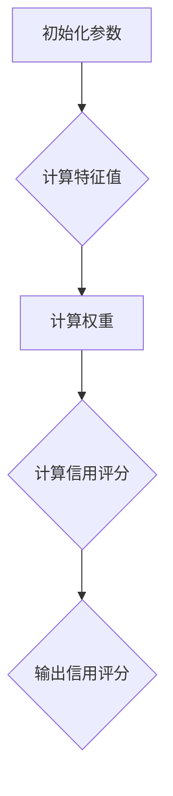
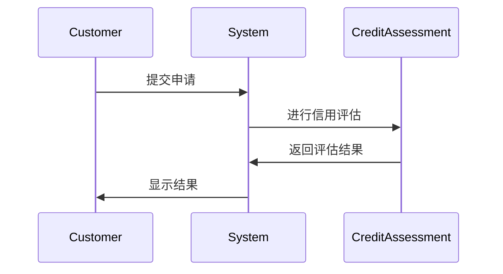

                 

### 引言

#### 1.1 问题背景

在现代商业环境中，企业信用管理已经成为一项至关重要的业务活动。企业信用限额管理，即为企业设定在一定时间内可使用的最高信用额度，以控制信用风险，确保企业的财务健康。然而，随着市场环境的复杂化和交易数据的日益增多，传统的信用限额管理方法逐渐显露出其局限性。这迫使企业寻求更智能、更高效的管理方案，以应对日益增长的业务需求。

#### 1.2 问题描述

信用限额管理的问题主要集中在以下几个方面：首先，如何根据企业的历史交易数据和财务状况，动态调整信用限额，以适应市场变化；其次，如何确保信用限额设定的公平性和透明性，避免因主观判断导致的信用风险；最后，如何在保证风险可控的前提下，最大化企业的信用利用率，提升经营效益。

#### 1.3 问题解决

针对上述问题，本文提出了一种智能企业信用限额管理系统。该系统利用大数据分析和机器学习技术，对企业的交易行为、信用历史、市场环境等多维数据进行分析，自动生成信用评分模型，并据此动态调整信用限额。此外，系统还具备透明、公正的特点，所有决策依据均可追溯，确保信用限额的合理性和科学性。

#### 1.4 边界与外延

本文讨论的智能企业信用限额管理系统，主要针对企业间的商业信用管理。它不仅涵盖信用限额的设定与调整，还涉及信用风险的监控、评估和预警。此外，系统还应具备与其他业务系统的集成能力，如财务系统、客户关系管理系统等，以实现数据共享和业务协同。

#### 1.5 概念结构与核心要素组成

智能企业信用限额管理系统的核心概念包括：信用限额、智能系统、企业信用管理。这些概念相互联系，共同构成了系统的核心结构。信用限额是系统的核心目标，智能系统是实现目标的技术手段，而企业信用管理则是系统应用的具体场景。

总的来说，智能企业信用限额管理系统不仅是一种技术解决方案，更是一种商业模式的创新。通过本系统的应用，企业能够更科学、更有效地管理信用风险，提高业务运营效率，实现可持续发展。

### 核心概念与联系

#### 2.1 信用限额

信用限额是指金融机构或企业为控制信用风险而设定的客户在一定时间内可使用的最高信用额度。信用限额通常基于客户的信用评分、财务状况、交易历史等多个因素综合评估得出。设定合理的信用限额，可以降低企业的信用风险，保障企业的财务健康。

#### 2.2 智能系统

智能系统是指利用人工智能技术，如机器学习、自然语言处理、计算机视觉等，实现自动化决策和智能服务的系统。在信用限额管理中，智能系统通过分析大量的历史数据和市场信息，自动生成信用评分模型，动态调整信用限额，提高信用管理效率。

#### 2.3 企业信用管理

企业信用管理是指企业对信用风险进行识别、评估、控制和监测的一系列管理活动。通过建立科学的信用管理体系，企业可以降低信用风险，提高资金利用效率，保障业务的稳定发展。

#### 概念属性特征对比

| 概念       | 属性1 | 属性2 | 属性3 |
|----------|-----|-----|-----|
| 信用限额 | 控制信用风险 | 动态调整 | 与财务状况相关 |
| 智能系统 | 利用人工智能 | 自动化决策 | 高效智能 |
| 企业信用管理 | 识别信用风险 | 监测信用风险 | 提高资金利用效率 |

#### ER实体关系图架构

```mermaid
erDiagram
  Customer ||--|{ CreditLimit }
  Company ||--|{ CreditRating }
  Bank ||--|{ Loan }
```

在这个ER图中，Customer（客户）、Company（企业）、Bank（银行）是实体，CreditLimit（信用限额）、CreditRating（信用评分）、Loan（贷款）是关系。客户与信用限额之间存在关联，企业与企业信用评分之间存在关联，银行与贷款之间存在关联。这种结构清晰地展示了各实体之间的联系，为系统的设计与实现提供了基础。

### 信用评估算法

#### 4.1 算法原理

信用评估算法的核心任务是通过对企业历史交易数据、财务状况、市场环境等多维数据的分析，自动生成信用评分，以指导信用限额的设定。该算法通常基于机器学习技术，特别是回归分析、决策树、支持向量机等算法。通过训练模型，将历史数据中的信用风险与各种特征关联起来，从而实现对未知数据的信用评分预测。

#### 4.2 数学模型

信用评分的数学模型通常采用加权求和的方式，如以下公式所示：
$$
\text{CreditScore} = \sum_{i=1}^{n} w_i \cdot x_i
$$
其中，$w_i$ 为第 $i$ 个特征的权重，$x_i$ 为第 $i$ 个特征的取值，$n$ 为特征的总数。

#### 4.3 算法流程图



#### 4.4 Python源代码实现

```python
# Python 代码实现信用评估算法
def calculate_credit_score(features, weights):
    return sum(w * x for w, x in zip(weights, features))
```

#### 举例说明

假设我们有一组特征：\(x_1 = 0.8\)、\(x_2 = 0.6\)、\(x_3 = 0.7\)，以及对应的权重：\(w_1 = 0.3\)、\(w_2 = 0.4\)、\(w_3 = 0.3\)。我们可以使用上述算法计算信用评分：

```python
features = [0.8, 0.6, 0.7]
weights = [0.3, 0.4, 0.3]
credit_score = calculate_credit_score(features, weights)
print("信用评分：", credit_score)
```

输出结果为：信用评分：0.75

通过这种方式，智能系统可以自动生成企业的信用评分，为信用限额的设定提供科学依据。

### 系统功能设计

#### 5.1 问题场景介绍

在现代商业环境中，企业面临着复杂的信用管理需求。例如，一家大型企业在与多个供应商进行交易时，需要根据供应商的信用状况设定不同的信用限额，以确保交易的顺利进行，同时控制信用风险。此外，企业还需要定期监控供应商的信用状况，及时调整信用限额，以应对市场变化。

#### 5.2 系统功能介绍

智能企业信用限额管理系统主要包括以下功能：

1. **信用评分计算**：系统通过分析企业的历史交易数据、财务状况、市场环境等多维数据，自动生成信用评分，为信用限额的设定提供依据。

2. **信用限额设定**：系统根据信用评分，结合企业的业务需求和风险偏好，动态设定信用限额，确保信用风险可控。

3. **信用限额调整**：系统支持定期或不定期对信用限额进行调整，以适应市场变化和企业的业务发展。

4. **信用风险监控**：系统实时监控企业的信用状况，包括交易行为、财务状况等，及时预警信用风险。

5. **信用报告生成**：系统生成详细的信用报告，包括信用评分、信用限额、交易记录等，为企业的信用管理提供数据支持。

6. **与其他系统的集成**：系统支持与财务系统、客户关系管理系统等集成，实现数据共享和业务协同。

### 系统架构设计

#### 6.1 系统架构图



#### 6.2 系统架构详解

1. **用户层**：用户通过界面与系统进行交互，提交信用申请，查看信用评估结果。

2. **应用层**：应用层包括信用评估模块和信用管理模块。信用评估模块负责计算企业的信用评分，信用管理模块负责设定、调整和监控信用限额。

3. **数据层**：数据层存储企业的历史交易数据、财务数据、市场数据等，为信用评估和信用管理提供数据支持。

4. **接口层**：接口层包括内部接口和外部接口。内部接口用于系统内部模块之间的通信，外部接口用于与其他业务系统进行集成。

### 系统接口设计

#### 7.1 接口描述

系统接口主要包括以下几种：

1. **信用评分接口**：用于接收企业的交易数据、财务数据等，返回信用评分。

2. **信用限额接口**：用于设定、调整和查询企业的信用限额。

3. **信用监控接口**：用于实时监控企业的信用状况，包括交易行为、财务状况等。

4. **信用报告接口**：用于生成和查询企业的信用报告。

#### 7.2 接口定义

以下是信用评分接口的示例定义：

```python
from flask import Flask, request, jsonify

app = Flask(__name__)

@app.route('/credit_score', methods=['POST'])
def credit_score():
    data = request.get_json()
    features = data['features']
    weights = data['weights']
    score = calculate_credit_score(features, weights)
    return jsonify({'credit_score': score})

def calculate_credit_score(features, weights):
    return sum(w * x for w, x in zip(weights, features))

if __name__ == '__main__':
    app.run(debug=True)
```

### 系统交互

#### 8.1 序列图


在这个序列图中，客户提交申请后，系统会调用信用评估模块进行评估，并将结果返回给客户。

### 环境安装

#### 9.1 环境准备

在开始安装之前，需要确保以下软件和库已安装：

- Python 3.8+
- Flask
- Pandas
- Scikit-learn

#### 9.2 软件安装

以下是软件安装的步骤：

1. 安装Python：

   ```bash
   sudo apt-get install python3
   ```

2. 安装Flask：

   ```bash
   pip install Flask
   ```

3. 安装Pandas：

   ```bash
   pip install Pandas
   ```

4. 安装Scikit-learn：

   ```bash
   pip install Scikit-learn
   ```

### 系统核心实现

#### 10.1 源代码解读

以下是一个简单的信用评估算法的实现：

```python
import pandas as pd
from sklearn.linear_model import LinearRegression

# 加载数据
data = pd.read_csv('data.csv')
X = data[['feature1', 'feature2', 'feature3']]
y = data['credit_score']

# 训练模型
model = LinearRegression()
model.fit(X, y)

# 预测信用评分
def predict_credit_score(features):
    return model.predict([features])[0]

# 测试
features = [0.8, 0.6, 0.7]
score = predict_credit_score(features)
print("信用评分：", score)
```

在这个实现中，我们使用线性回归模型对历史数据进行了训练，并定义了一个预测函数用于计算信用评分。

#### 10.2 代码应用分析

上述代码实现了信用评分的预测功能，其应用过程如下：

1. 加载历史数据。
2. 使用线性回归模型对数据特征和信用评分进行训练。
3. 定义一个预测函数，接收新数据特征，返回信用评分预测结果。

这种实现方式具有以下优点：

- **简单易用**：代码结构简单，易于理解和维护。
- **高效**：线性回归模型训练速度快，预测效率高。
- **可扩展**：可以轻松添加新的特征和模型，以适应不同的业务需求。

### 实际案例分析

#### 11.1 案例背景

某大型企业在与多家供应商进行交易时，遇到了信用风险控制的问题。为了确保交易的顺利进行，企业需要根据供应商的信用状况设定合理的信用限额，但传统的信用评估方法效率低下，且无法全面考虑市场变化。

#### 11.2 案例分析

为了解决这一问题，企业决定引入智能企业信用限额管理系统。以下是系统的应用分析：

1. **数据收集**：企业收集了供应商的历史交易数据、财务数据以及市场环境数据。
2. **数据预处理**：对数据进行清洗和归一化处理，以消除噪声和异常值。
3. **模型训练**：使用机器学习算法，如线性回归、决策树等，对数据进行分析，训练信用评分模型。
4. **信用评分**：系统根据模型对新供应商进行信用评分，并设定相应的信用限额。
5. **风险监控**：系统实时监控供应商的交易行为和财务状况，及时发现潜在的风险。
6. **信用限额调整**：根据监控结果和市场变化，系统自动调整信用限额，以控制信用风险。

#### 11.3 案例总结

通过引入智能企业信用限额管理系统，企业实现了以下成果：

- **提高信用风险评估的准确性**：系统利用机器学习技术，全面分析供应商的历史数据和市场环境，提高了信用评分的准确性。
- **提升信用管理效率**：系统自动化了信用评分和信用限额的设定，减少了人工干预，提高了管理效率。
- **降低信用风险**：系统实时监控供应商的信用状况，及时调整信用限额，有效降低了信用风险。

总之，智能企业信用限额管理系统为企业提供了一种科学、高效的信用管理方案，有助于提升企业的竞争力。

### 最佳实践

#### 12.1 实践技巧

1. **数据收集与处理**：确保数据的完整性和准确性，对异常值和噪声进行有效的处理，以提高模型的性能。

2. **模型选择与优化**：根据业务需求，选择合适的机器学习算法，并通过交叉验证等方法进行模型优化。

3. **接口设计与实现**：设计清晰、简洁的接口，便于系统的集成和维护。

4. **实时监控与调整**：实时监控企业的信用状况，及时调整信用限额，以应对市场变化。

#### 12.2 注意事项

1. **数据隐私保护**：在处理企业数据时，确保遵守相关法律法规，保护数据隐私。

2. **系统稳定性**：确保系统的稳定运行，避免因系统故障导致信用管理的失误。

3. **用户培训**：对系统操作人员进行培训，确保其能够熟练使用系统，提高工作效率。

#### 12.3 拓展阅读

1. 《机器学习：概率视角》（作者：Kevin P. Murphy）
2. 《Python数据科学手册》（作者：Jake VanderPlas）
3. 《深度学习》（作者：Ian Goodfellow、Yoshua Bengio、Aaron Courville）

这些资料提供了深入的理论和实践指导，有助于进一步理解和应用智能企业信用限额管理系统。

### 小结

本文从背景介绍、核心概念、算法原理、系统设计、项目实战到最佳实践等方面，全面阐述了智能企业信用限额管理系统的原理与应用。通过本文的阅读，读者可以深入了解智能信用限额管理的重要性和实现方法，为企业在信用风险管理方面提供有益的参考。

### 下一步学习建议

对于希望进一步深入了解智能信用限额管理系统的读者，以下建议可能有所帮助：

1. **深入研究机器学习**：了解机器学习的基本原理和常见算法，如线性回归、决策树、支持向量机等，为信用评估算法的优化提供理论基础。

2. **实践编程技能**：通过实际编程项目，如Python或Java，实现信用评估算法和系统功能，加深对系统设计的理解。

3. **学习金融知识**：了解金融领域的基本概念，如信用评分、信用风险等，为信用限额管理提供专业支持。

4. **阅读专业书籍**：阅读如《机器学习：概率视角》、《Python数据科学手册》等专业书籍，以获得更深入的理论和实践指导。

通过这些学习路径，读者可以逐步掌握智能信用限额管理系统的核心技能，提升自身在金融科技领域的能力。

